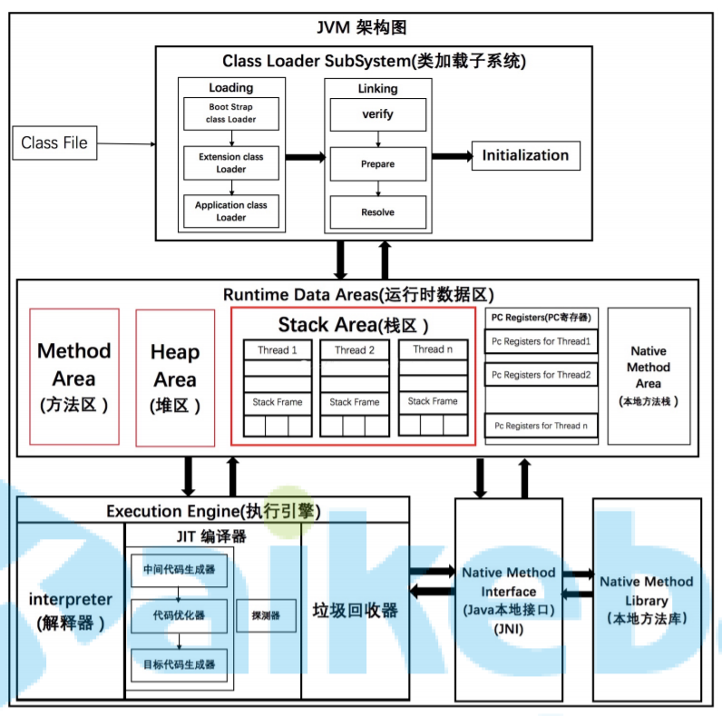
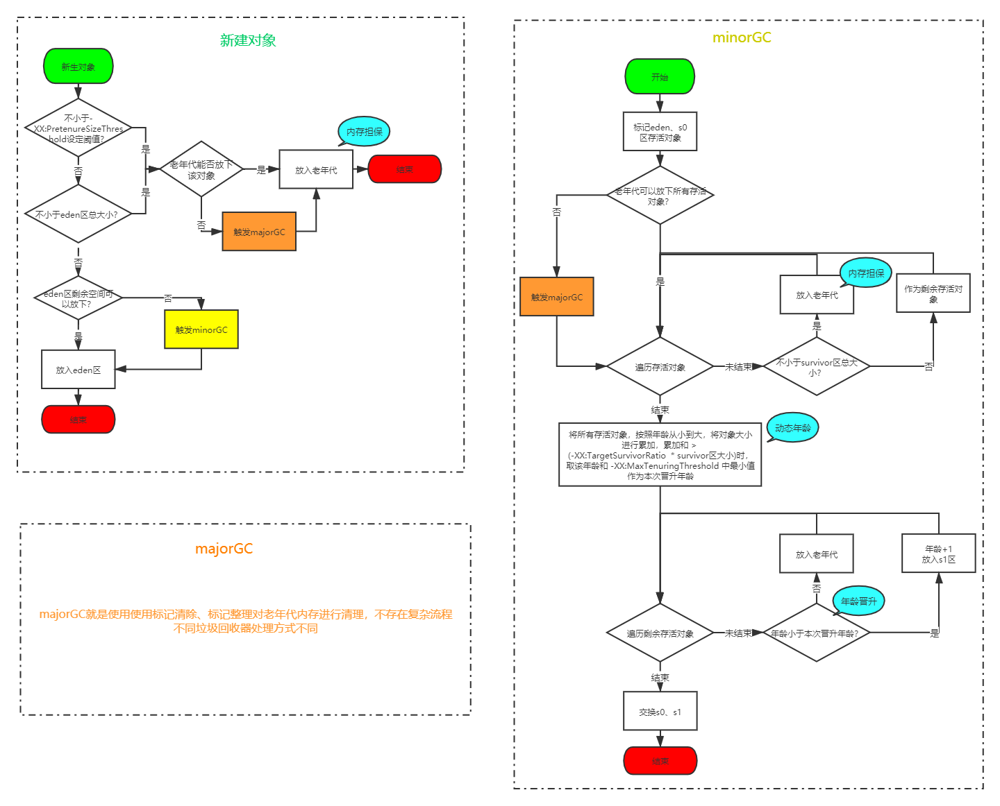
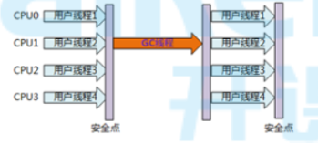

# JVM通识

## 程序执行方式有哪些

+ 静态编译执行
  + 直接将代码编译为机器码再执行
  + C语言
+ 动态解释执行
  + 将代码加载到内存中，看一行，解释一行，将这行代码编译成机器码；每次看这行代码，都需要重新解释
  + python
+ 动态编译执行
  + 当一块代码，被动态解释执行的次数太多的时候，会在内存中将这一块代码编译成机器码保存起来，以后在执行这块代码时直接使用机器码

> jvm采用的是`动态编译`+`动态解释`的方式
>
> + 动态编译就是`JIT`（java即时编译器）
> + 动态解释就是`interpreter`（java解释器）

## java和jvm关系

+ jvm只认`class`格式的字节码

+ 不是只有java可以编译为`class`格式的字节码

   

## jdk、jre、jvm关系

 

## OracleJDK和OpenJDK

### 查看JDK版本

+ OracleJDK版本信息

  ```
  [root@localhost ~]# java -version
  java version "1.8.0_162"
  Java(TM) SE Runtime Environment (build 1.8.0_162-b12)
  Java HotSpot(TM) 64-Bit Server VM (build 25.162-b12， mixed mode)
  ```

+ OpenJDK版本信息

  ```
  [root@localhost ~]# java -version
  openjdk version "1.8.0_144"
  OpenJDK Runtime Environment (build 1.8.0_144-b01)
  OpenJDK 64-Bit Server VM (build 25.144-b01， mixed mode)
  ```

### 区别

 

两者几乎没有区别，那点区别我们也用不到，可以忽略

## jvm与hotspot

+ jvm是一种标准
+ hotspot是jvm标准的具体实现

## jvm运行模式

+ 分为client模式和server模式

  我们用的一般都是server模式，在嵌入式系统中（手机）上，可能用的是client模式

  client模式只能在32为机器上运行

+ server模式是重量级虚拟机，加入了很多优化项，所以server模式启动更慢，但是运行时server模式运行效率更高

# JVM架构图

 

# JVM程序执行流程

## 执行流程

+ java源代码到机器码流程

   

+ 编译器与解释器协调流程

   

  当一块代码执行次数很多时，就可能会变成热点代码，被一次性编译成机器码，以后每次执行时直接执行机器码

## 热点代码

+ 当出现以下两种情况时，会被标记为热点代码

  + 被多次调用的方法。
  + 被多次执行的循环体。

  两种情况，编译器都是以整个方法作为编译对象

+ 这里的多次，默认是10000次

  我们可以通过修改这个阈值，让jvm尽快的使用动态编译执行，来提高执行效率

  具体是通过虚拟机参数：`-XX： CompileThreshold`设置。

### 热点检测方式

+ 基于采样的热点探测

  周期性地检查各个线程的栈顶，如果发现某些方法经常出现在栈顶，那这 个方法就是“热点方法”

  + 缺点：由于`周期性`，容易因为受到线程阻塞或别 的外界因素的影响而扰乱热点探测。
  + JVM不使用这种方式

+ 基于计数器的热点探测（HOTSPOT采用的方式）

  为每个方法（甚至是代码块）建立计数器，统计方法的执行次数，如果执 行次数超过一定的阀值，就认为它是“热点方法”。

  计数器一共有两个：

  + 方法调用计数器

    用于统计方法被调用的次数

  + 回边计数器

    + 统计一个方法中循环体代码执行的次数
    + 在字节码中遇到控制流向后跳转的指令称 为“回边”

### 半衰期

当方法在一段时间内被调用次数还没有超过阈值，则会将计数器直接修改为阈值的一半，防止一段代码靠时间耗成热点代码

# JIT使用

## JVM为什么编译器与解释器并存

+ 解释器执行代码启动更快，编译器运行时效率更高
+ 编译执行占用内存空间更大，解释器能节省内存空间，适用于嵌入式系统

jvm并存两种执行方式，可以针对不同的代码在时间和空间的权衡上找到最优方案

## 为什么实现两种即时编译器

jvm中有2种即时编译器：

+ client complier

  编译速度更快，专注于局部优化，放弃了全局优化

+ server complier

  编译质量更高，进行了充分优化

可以根据不同场景做出更合适的选择

## JIT进行了哪些优化

### 公共子表达式消除

```java
int d = (c*b)*12+a+(a+b*c);
```

对于上面代码，JIT会检测到`c*b`和`b*c`是同一个表达式，会将`b*c`替换成公共表达式`E`进行替换

```
int d = E*12+a+(a+E);
```

只要`b`和`c`的值没有发生改变，都是使用上次`E`的计算结果进行替换，这个子表达式计算一次即可，不用每次都计算了

对于上面的结果，还可以使用`代数化简`进行优化

```java
int d = E*13+a*2;
```

### 方法内联

JIT进行即时编译时，如果A方法调用了B方法，有时会直接使用B方法内的代码替换到A方法中，减少方法个数，从而减少方法入栈出栈引发的额外开销

```java
private int add4(int x1， int x2， int x3， int x4) {
	return add2(x1， x2) + add2(x3， x4);
}
private int add2(int x1， int x2) {
	return x1 + x2;
}
```

是运行一段时间后JVM会把add2方法去掉，并把代码翻译成

```java
private int add4(int x1， int x2， int x3， int x4) {
	return x1 + x2 + x3 + x4;
}
```

### 逃逸分析

+ 当一个对象在1个作用域中被创建之后，被另外一个作用域引用，称为`逃逸`

+ jvm中的作用域一般指的是方法，所以一般逃逸分析指的是`方法逃逸`

+ 逃逸分析包括

  + 全局变量赋值逃逸
  + 方法返回值逃逸
  + 实例引用发生逃逸
  + 线程逃逸:赋值给类变量或可以在其他线程中访问的实例变量

  ```java
  public class EscapeAnalysis {
  	//全局变量
  	public static Object object;
  	public void globalVariableEscape(){//全局变量赋值逃逸
  		object = new Object();
  	}
  	public Object methodEscape(){ //方法返回值逃逸
  		return new Object();
  	}
  	public void instancePassEscape(){ //实例引用发生逃逸
  		this.speak(this);
  	}
  	public void speak(EscapeAnalysis escapeAnalysis){
  		System.out.println("Escape Hello");
  	}
  }
  ```

+ jvm默认是开启逃逸分析的，如果需要关闭，可以通过设计`-XX:-DoEscapeAnalysis`进行关闭，一般不需要关闭

### 对象的栈上内存分配

当方法内创建1个对象，而这个对象没有发生逃逸时，jvm会尽量使用栈上内存分配，好处是在栈上创建的对象，方法执行结束后可以直接释放掉，而如果放在堆中进行内存分配，将需要进行垃圾回收，成本更高

### 标量替换

当1个对象没有方法逃逸是，JIT会把这个对 象拆解成若干个其中包含的若干个成员变量来代替。

```java
//有一个类A
public class A{
    public int a=1;
    public int b=2
}

//方法getAB使用类A里面的a，b
private void getAB(){
    A x = new A();
    A y = new A();
}

//JVM在编译的时候会直接编译成
private void getAB(){
    xa = 1;
    xb = 2;
    ya = 1;
    yb = 2;
}
```

### 同步锁消除

当一块加了同步锁的代码，经过逃逸分析后发现不会发生逃逸，则JIT编译时会自动取消同步锁

# class文件

## 查看class文件插件

+ 字节码查看class文件
  + 安装插件`jclasslib Bytecode Viewer`
  + 查看文件之前，先`Rebuild Project`
  + 查看class文件汇总信息
    + 选中要查看的java文件，View --> Show Bytecode With Jclasslib
  + 查看class文件
    + 选中要查看的java文件，View --> Show Bytecode
+ 二进制查看class文件
  + 安装插件`BinEd`
  + 选择要查看的class文件，右键，open as binary

## class文件概述

+ class文件字节码结构示意图

   

+ 魔数

  + 固定4字节
  + 固定内容`0xCAFEBABE`，用来标识这是1个class文件

+ 版本号

  + 副版本号2字节；主版本号2字节
  + 5、6字节用来表示副版本号；7、8字节用来表示主版本号
  + 主版本号1.1用十进制的45表示，以后的每个新主版本都会在原先版本的基础上加1，1.8版本用52表示，16进制是0x34

+ 常量池计数器（constant_pool_count ）

  + 固定2字节
  + 常量池计数器值 = 常量池（constant_pool）中常量池项（cp_info）个数 + 1
  + 当常量池索引值大于0，且小于constant_pool_count 时有效，常量池索引值从1开始
  + 常量池索引值为0时（#0）用来表示不指向任何常量

+ 常量池数据区

  + 由（constant_pool_count  - 1）个常量池项（cp_info）组成
  + cp_info：参见[常量池项](#常量池项) 

+ 访问标志

  + 固定两字节

  + 描述

     

+ 类索引

  + 固定2字节
  + 当前类对应 CONSTANT_Class_info 的常量池索引值 - 1

+ 父类索引

  + 固定2字节
  + 父类对应 CONSTANT_Class_info 的常量池索引值 - 1

+ 接口计数器

  + 固定2字节
  + 当前类或接口的直接父接口数

+ 接口信息区

  + 接口计数器 * 2 个字节
  + 父接口对应 CONSTANT_Class_info 的常量池索引值 - 1，组成数组

+ 字段计数器

  + 固定2字节
  + 该类或接口声明的【类字段】或者【实例字段】数

+ 字段信息数据区

  字段表，fields[]数组中的每个成员都必须是一个fields_info结构的数据项，用于表示当前类或接口中某个字段的完整描述。 fields[]数组描述当前类或接口声明的所有字段，但不包括从父类或父接口继承的部分。

+ 方法计数器

  + 固定2字节
  + 当前类的方法数

+ 方法信息数据区

  + 方法表，methods[] 数组中的每个成员都必须是一个 method_info 结构的数据项，用于表示当前类或接口中某个方法的完整描述。
  + 如果某个method_info 结构的access_flags 项既没有设置 ACC_NATIVE 标志也没有设置ACC_ABSTRACT 标志，那么它所对应的方法体就应当可以被 Java 虚拟机直接从当前类加载，而不需要引用其它类。
  + method_info结构可以表示类和接口中定义的所有方法，包括【实例方法】、【类方法】、【实例初始化方法】和【类或接口初始化方法】。
  + methods[]数组只描述【当前类或接口中声明的方法】，【不包括从父类或父接口继承的方法

+ 属性计数器

  + 固定2字节
  + 当前 Class 文件attributes表的成员个数

+ 属性信息数据区

  + attributes 表的每个项的值必须是attribute_info结构。

## 常量池项

常量池项有很多种类型，具体类型由第1个字节`tag`（固定1个字节）的值决定

+ 结构

  > + CONSTANT_Utf8_info
  >
  >   + tag：1
  >
  >   + 含义：表示字符串常量，不对应java中任何数据类型，仅用于被其他cp_info引用
  >
  >   + 结构
  >
  >     ```json
  >     {
  >         tag				// 固定1字节；此时值为1
  >         length			// 固定1字节；表示字符长度
  >         byte[length]	// length个字节；字符串内容
  >     }
  >     ```
  >
  > + CONSTANT_Integer_info
  >
  >   + tag：3
  >
  >   + 含义：int类型常量
  >
  >   + 结构
  >
  >     ```json
  >     {
  >         tag				// 固定1字节；此时值为3
  >         byte[4]			// 固定4字节；int常量值
  >     }
  >     ```
  >
  > + CONSTANT_Float_info
  >
  >   + tag：4
  >
  >   + 含义：float类型常量
  >
  >   + 结构
  >
  >     ```json
  >     {
  >         tag				// 固定1字节；此时值为4
  >         byte[4]			// 固定4字节；float常量值
  >     }
  >     ```
  >
  > + CONSTANT_Long_info
  >
  >   + tag：5
  >
  >   + 含义：long类型常量
  >
  >   + 结构
  >
  >     ```json
  >     {
  >         tag				// 固定1字节；此时值为5
  >         byte[8]			// 固定8字节；long常量值
  >     }
  >     ```
  >
  > + CONSTANT_Double_info
  >
  >   + tag：6
  >
  >   + 含义：double类型常量
  >
  >   + 结构
  >
  >     ```json
  >     {
  >         tag				// 固定1字节；此时值为6
  >         byte[4]			// 固定8字节；double常量值
  >     }
  >     ```
  >
  > + CONSTANT_Class_info
  >
  >   + tag：7
  >
  >   + 含义：当前或调用的类或接口
  >
  >     这里的调用到是真的用到，如果一个类声明了一个属性，而这个属性后续没有被用到，则这个声明删掉都行，那这个类的全限定名就不会放入常量池
  >
  >   + 结构
  >
  >     ```json
  >     {
  >         tag				// 固定1字节；此时值为7
  >         byte[2]			// 固定2字节；当前或调用的类或接口的完全限定名对应 CONSTANT_Utf8_info 的常量池索引值 - 1
  >     }
  >     ```
  >
  >   + 例
  >
  >      
  >
  > + CONSTANT_String_info
  >
  >   + tag：8
  >
  >   + 含义：String类型常量
  >
  >   + 结构
  >
  >     ```json
  >     {
  >         tag				// 固定1字节；此时值为8
  >         byte[2]			// 固定2字节；String类型字符串的值对应 CONSTANT_Utf8_info 的常量池索引值 - 1
  >     }
  >     ```
  >
  > + CONSTANT_Fieldref_info
  >
  >   + tag：9
  >
  >   + 含义：类中字段
  >
  >   + 结构
  >
  >     ```json
  >     {
  >         tag				// 固定1字节；此时值为9
  >         byte[2]			// 固定2字节；所属类对应 CONSTANT_Class_info 的常量池索引值 - 1
  >     	byte[2] 		// 固定2字节；字段对应 CONSTANT_NameAndType_info 的常量池索引值 - 1
  >     }
  >     ```
  >
  > + CONSTANT_Methodref_info
  >
  >   + tag：10
  >
  >   + 含义：类中调用的方法
  >
  >   + 结构
  >
  >     ```json
  >     {
  >         tag				// 固定1字节；此时值为10
  >         byte[2]			// 固定2字节；所属类对应 CONSTANT_Class_info 的常量池索引值 - 1
  >     	byte[2] 		// 固定2字节；方法对应 CONSTANT_NameAndType_info 的常量池索引值 - 1
  >     }
  >     ```
  >
  > + CONSTANT_InterfaceMethodref_info
  >
  >   + tag：11
  >
  >   + 含义：类中通过接口调用的接口方法
  >
  >   + 结构
  >
  >     ```json
  >     {
  >         tag				// 固定1字节；此时值为11
  >         byte[2]			// 固定2字节；所属类对应 CONSTANT_Class_info 的常量池索引值 - 1
  >     	byte[2] 		// 固定2字节；方法对应 CONSTANT_NameAndType_info 的常量池索引值 - 1
  >     }
  >     ```
  >
  > + CONSTANT_NameAndType_info
  >
  >   + tag：12
  >
  >   + 含义：字段或方法的名称或类型
  >
  >     这里方法的参数+返回值可以看作这个方法的类型
  >
  >   + 结构
  >
  >     ```json
  >     {
  >         tag				// 固定1字节；此时值为12
  >         byte[2]			// 固定2字节；字段或方法名对应 CONSTANT_Utf8_info 的常量池索引值 - 1
  >     	byte[2] 		// 固定2字节；字段或方法的类型描述字符串对应 CONSTANT_Utf8_info 的常量池索引值 - 1
  >     }
  >     ```
  >
  > + CONSTANT_MethodHandler_info
  >
  >   + tag：15
  >   + 含义：方法句柄
  >
  > + CONSTANT_MethodType_info
  >
  >   + tag：16
  >   + 含义：方法类型
  >
  > + CONSTANT_InvokeDynamic_info
  >
  >   + tag：18
  >   + 含义：用于表示invokeddynamic指令所使用到的引导方法（Bootstrap Method）、引导方法使用到动态调用名称（Dynamic Invocation Name）、参数和请求返回类型、以及可以选择性的附加被称为静态参数（static Arguments）的常量序列

+ cp_info分类

  + 字面量型结构体
    + 内容是字面量
    + CONSTANT_Utf8_info、CONSTANT_Integer_info、CONSTANT_Float_info、CONSTANT_Long_info、CONSTANT_Double_info
  + 引用型结构体
    + 内容是索引值
    + 其他都是

+ 哪些字面量会进入常量池

  + double、float、long
  + final类型的基本类型常量
  + 双引号引起的字符串值
  + 2个字节存不下的int型常量（大于`32767`或小于`-32768`）

## 引用

+ 符号引用

  当要引用的内容还没有加载到内存时，是没有这个内容的地址的，先用符号先占着

+ 直接引用

  + 这个内容加载到内存之后，已经有了这个内容的实际地址，则直接指向这个内容
  + 可以是如下形式：
    + 直接指向目标指针
    + 相对偏移量（如数组下标）
    + 一个能间接定位到目标的句柄

+ 引用替换时机

  符号引用替换为直接引用的操作发生在类加载过程(加载 -> 连接(验证、准备、解析) -> 初始化)中的解析阶段，会将符号引用转换(替换)为对应的直接引用，放入运行时常量池中。

## 特殊字符串字面量

+ 类的全限定名

  class文件中，类的全限定名中的`.`全被替换为`/`

+ 描述符

   

## 特殊方法名称

+ `<init>`

  构造方法名称

+ `<clinit>`

  静态代码块方法名称

# 类加载子系统

## 类加载过程

 

+ 加载
  + class文件加载可以来源于多种途径，如：文件、网络、jar包、动态生成
  + 加载靠类加载器实现（ClassLoader）
  + 类加载不是启动时全加载的，是需要用到这个类时在进行加载
  + 类加载之后变成Class对象保存带方法区

+ 验证

  + 验证class文件是否合法

  + 验证流程

      

+ 准备
  + 为类的静态变量分配内存
  + 把静态变量初始化为0，false，null等

+ 解析

  符号引用替换为直接引用

+ 初始化
  + 调用静态代码块方法`<clinit>`，jvm执行该方法时会自动上锁
  + 为`static`变量初始化赋值

## 类加载时机

+ 执行字节码指令`new`、`getstatic`、`putstatic`、`invokestatic`时，如果类没有初始化，先进行初始化

  对应代码是`new`对象，读写static（非final）变量，调用static方法

+ 使用反射调用类

+ 初始化1个类时发现父类还没有初始化，先初始化父类

+ 虚拟机启动时指定了主类，加载主类

## 类加载器

 

+ `jvm`中主要有4中类加载器，每种类加载器负责加载不同目录下的jar包
+ `custom classloader`是自定义加载器，如有需要，自己实现的，其他三个是自带的

## 双亲委派

### 什么叫双亲委派

+ 如上图，一个类要被加载时，先从下至上检查是否已加载，再自上而下尝试加载
+ 因为越上层类加载器的权重越高，为了保证1个类加载时加载的是权限最高的类加载器加载的类，下层类加载器发现这个类没有加载时，不能直接加载，需要先问问上层类加载器要不要加载这个类

### 好处

+ 避免重复加载
+ 避免自己写了1个`java.lang.String`类时，就会由下层类加载器加载成自己的了，代码就出错了

### jvm如何判断两个类相同

+ 判断类的全路径
+ 判断是否由同一个类加载器加载

### 为什么需要自定义类加载器

+ 默认类加载器只能加载指定目录的类，如果需要从其他位置加载，需要自定义

## SPI机制

+ 编写1个接口

  ```java
  package spi;
  public interface SpiTestInterface {
      void test();
  }
  ```

+ 编写1个实现类

  ```java
  package spi;
  public class SpiTestClass implements SpiTestInterface {
      @Override
      public void test() {
          System.out.println("hello");
      }
  }
  ```

+ `classpath:/META-INF/services`下写1个以`接口全路径`为名的文件，内容为实现类的全路径

  `classpath:/META-INF/services/spi.SpiTestInterface`:

  ```
  spi.SpiTestClass
  ```

+ 使用`ServiceLoader`加载

  ```java
  @Test
  public void run(){
      ServiceLoader<SpiTestInterface> spiTestInterfaces = ServiceLoader.load(SpiTestInterface.class);
      Optional<SpiTestInterface> first = StreamSupport.stream(spiTestInterfaces.spliterator(), false).findFirst();
      first.ifPresent(SpiTestInterface::test);
  }
  ```

  

# 运行时数据区

## 概述

### JVM运行时数据区规范

 

#### 结构

+ 方法区

  方法区中主要是class文件中加载的内容

+ 堆

  + 对象
  + 数组

+ 栈

  每个线程在栈中分配一块空间，线程结束，内存释放

+ 程序计数器

  用来记录每个线程的PC指针，知道程序执行到哪了

+ 本地方法栈

  本地方法指的是系统内核提供的方法

  当JVM调用内核方法时，会在这里分配一块空间作为栈空间

#### 补充

+ 方法区、堆，是线程共享区域；栈、程序计数器、本地方法栈，是线程独享区域，每个线程对应一部分内存
+ 垃圾回收主要针对`堆`，方法区也存在垃圾回收，但是效率不高
+ 上述5块区域，只有`程序计数器`不存在内存溢出，其他都存在

### HotSpot的JVM实现

 

+ hotspot中，方法区就是`永久代`

+ 运行时数据区

  + 在1.7以前，等于`JVM内存`

    方法区、堆、栈、程序计数器、本地方法栈，都在`JVM内存`中

  + 在1.8以后，等于`JVM内存` + `元空间`

    堆、栈、程序计数器、本地方法栈，在`JVM内存`中；方法区在`元空间`

+ 运行时常量池

  jvm内存中，每个类对用1个jvm常量池

+ 元空间

  1.8以后，方法区

+ 版本演化

  + 1.7版本准备去永久代，将静态变量、运行时常量池，从永久代移入堆中
  + 1.8版本完成去永久代，将原来的永久代从JVM内存中移出，放入机器内存中，更名为`元空间`

## 打印内存地址

```java
public class StringTest {

    static final Unsafe UNSAFE = getUnsafe();
    static final boolean IS64BIT = true;

    public static void main(String... args) {
        String a = "he";
        a = a + "llo";
        printAddresses("ascending", a);
        printAddresses("ascending", a.charAt(0));
        printAddresses("ascending", a.charAt(1));
        printAddresses("ascending", a.intern());
    }

    public static void printAddresses(String label, Object... objects) {
        System.out.print(label + ": 0x");
        long last = 0;
        int offset = UNSAFE.arrayBaseOffset(objects.getClass());
        int scale = UNSAFE.arrayIndexScale(objects.getClass());
        switch (scale) {
            case 4:
                long factor = IS64BIT ? 8 : 1;
                final long i1 = (UNSAFE.getInt(objects, offset) & 0xFFFFFFFFL) * factor;
                System.out.print(Long.toHexString(i1));
                last = i1;
                for (int i = 1; i < objects.length; i++) {
                    final long i2 = (UNSAFE.getInt(objects, offset + i * 4) & 0xFFFFFFFFL) * factor;
                    if (i2 > last)
                        System.out.print(", +" + Long.toHexString(i2 - last));
                    else
                        System.out.print(", -" + Long.toHexString( last - i2));
                    last = i2;
                }
                break;
            case 8:
                throw new AssertionError("Not supported");
        }
        System.out.println();
    }

    private static Unsafe getUnsafe() {
        try {
            Field theUnsafe = Unsafe.class.getDeclaredField("theUnsafe");
            theUnsafe.setAccessible(true);
            return (Unsafe) theUnsafe.get(null);
        } catch (Exception e) {
            throw new AssertionError(e);
        }
    }
}
```

## 运行时常量池和字符串常量池

### 运行时常量池和字符串常量池区别

  

+ 静态常量池（class常量池）

  存在于class文件中，

  每个类都有1个静态常量池

+ 运行时常量池

  class文件加载到内存之后，之前静态常量池在内存中加载成了运行时常量池

  每个Class对象有1个运行时常量池

  加载进这里得字符串常量是1个`CONSTANT_Stirng_info`指向1个`CONSTANT_Utf8_info`

+ 字符串常量池

  全局只有1个字符串常量池

  字符串常量池就是`stringtable`


### 存储位置

字符串常量池和运行时常量池存储位置始终是相同的

1.6以前，存在方法区；1.7以后，存在堆中

### 字符串

字符串`String s = "hello"`在内存中体现

 

### 字符串常量池

##### stringtable

+ 数据结构与`hashtable`完全一样，用来加快查找效率
+ `key`是字符串的hash值，`value`是字符串常量（String对象）的引用地址

+ 1.6以前是哈希桶长度固定`1009`，1.7以后可以通过`-XX:StringTableSize=<size>`进行设置
+ 常量存入stringtable过程
  + 类加载时字符串常量已经加载进运行时常量池
  + **第一次使用该常量时（执行ldc指令）**，先校验stringtable中是否存在该字符串对应的hashcode
  + 有直接返回stringtable中该hashcode指向的对象
  + 没有则将该对象字符串的hashcode作为key，运行时常量池中得字符串常量对象引用作为value存入
  + 返回该对象

##### String.intern()

+ 作用：将字符串动态存储为常量
+ 过程
  + 校验stringtable中是否存在该字符串对应的hashcode
  + 有直接返回stringtable中该hashcode指向的对象
  + 没有则将该对象字符串的hashcode作为key，对象地址作为value存入
  + 返回该对象

##### 注意

+ 编译器能确定的字符串都会在编译期作为字面量存储在常量池

  ```java
  private static final String a = "he";
  private static final String b = "llo";
  private static String d = a + b;
  
  // 上面代码编译后对应class文件的<clint>方法为
  0 ldc #3 <hello>
  2 putstatic #4 <StringTest.d>
  5 return
  // 可见, hello这个字面量已经存在于常量池
  ```

## 直接内存

+ java程序中，有一些数据不仅限于进程内部使用，需要将数据交给其他进程或内核使用，常见于IO操作

  如果先在堆上申请内存，再对数据进行拷贝会降低性能

  所以可以使用直接内存，直接将数据存储再堆外内存（直接内存），数据存储好后，其他进程或内核可以直接使用

+ 直接内存不受`jvm`管理，不会进行垃圾回收

+ jvm可以使用的直接内存可以通过`-XX:MaxDirectMemorySize`进行设置

+ `DirectBuffer`类就是可以操作直接内存的类


## java堆

### 堆中存储什么数据

+ 1.6：对象、数组
+ 1.7：对象、数组、字符串常量池、静态变量

### 堆内存划分

 

+ 堆分为新生代和老年代，默认比例为1：2

+ 新生代分为`Eden`区、`s0`区、`s1`区，三者默认比例为8：1：1

+ 新创建的对象会优先放入新生代

  90%以上的对象存在于新生代，并且很快被回收掉

+ 老年代对象

  + 新生代存活下来的对象
  + 通过内存担保机制直接进入老年代的对象
  + 超过设定的阈值（具体大小，不是比例）的大对象，直接放入老年代

### 内存分配参数

+ 设置堆空间总大小

  + `-Xms`：堆空间初始值；默认当前机器最大内存的 1/64
  + `-Xmn`：堆空间最大值；默认当前机器最大内存的 1/4
  + 一般将初始值与最大值设置为相同，避免对虚拟空间再次进行内存开辟带来的性能消耗
  + 一般设置为4G，太大了`STW`时间会过长

+ 设置年轻代大小：

  + `-XX:NewSize(-Xns)`：新生代初始值；
  + `-XX:MaxNewSize(-Xmn)`：新生代最大值
  + 老年代 = 堆空间 - 新生代

+ 设置`Eden`区占新生代比例

  + `-XX:SurvivorRatio=8`：`Eden`区与`Survivor`区比例，默认`8:1:1`

+ 设置永久代大小

  + `-XX:PermSize`：永久代初始值
  + `-XX:MaxPermSize`：永久代最大值

+ 设置元空间大小

  + `-XX:MetaspaceSize`：元空间初始值，默认`20.75MB`
  + `-XX:MaxMetaspaceSize`：元空间最大值，默认无上限

+ 设置大对象阈值

  `-XX:PretenureSizeThreshold`

  + 超过这个值的对象直接在年老代分配内存
  + 默认0，表示无论如何都优先在`Eden`区分配内存
  + 一般不设置，容易出问题

### 虚拟空间

 

+ 当某块内存初始值与最大值不相等时，这个差值会以虚拟空间的形式存在，自己不用，别人也不能用，当自己想用时需要重新开辟内存空间（容量震荡）
+ 一般将初始值与最大值设为相同，避免容量震荡

### 对象内存分配方式

#### 指针碰撞

+ 用在年轻代的垃圾回收器中

+ 已使用内存与未使用内存之间有分界线，需要分配内存时紧邻已使用内存进行分配，就叫指针碰撞

   

#### 空闲列表

+ 用在老年代垃圾回收器中

+ 整个内存中的未使用内存是碎片化的，需要空闲列表进行维护

   

### 对象内存分配安全问题

当多个线程同时在同一块地址申请内存时，存在线程安全问题

有如下两种解决方案

#### CAS

+ 全称：`Compare And Swap`（比较替换）
+ 内存空间分配本身有一个原子性的特点，当一块内存空间已经被使用时，其他线程再来使用会失败
+ `CAS`使用乐观锁的方式，每次直接去分配，失败了再重试

#### TLAB

+ 全称：`Thread Local Allocation Buffer`（本地线程分配缓存）
+ 每个线程创建时，先使用`CAS`方式，为这个线程申请一块内存空间，这个线程创建的对象在这块空间中进行分配；每个线程的这块空间不够时，再次利用`CAS`去申请
+ 这样的方式会引发申请的内存碎片化的问题，但是这个碎片化在可控范围内，允许存在
+ `TLAB`存在的目的是在一定程度上减少`CAS`中失败的概率

### 对象内存布局

 

## 虚拟机栈

  

+ 每个线程有1个独立的栈
+ 每个线程的栈由多个栈帧组成，每执行1个方法就压入1个栈帧

### 栈帧

+ `每次调用1个方法`对应1个栈帧
+ 栈帧内包括：局部变量表、操作栈、动态链接、返回地址

#### 局部变量表

+ 可以看成1个带下标的数组，每个元素是1个变量槽，每个变量槽占4字节

+ 用于存储局部变量的值

  + this（下标为0的槽）
  + 方法参数
  + 方法内定义的变量
  + 返回地址

+ 可以保存`boolean`、`byte`、`char`、`short`、`int`、`float`、`double`、`long`、`reference`、`returnAddress`类型变量的值

  + 变量不足4字节（1个槽）时，使用1个槽存储这个变量

    如：`boolean`、`byte`、`char`、`short`

  + 变量超过4字节（1个槽）时，使用多个槽存储这个变量

    如：`double`、`long`

+ 每个局部变量在编译时就已经确定了，他是这个方法的第几个变量，也就确定了这个变量对应的局部变量表中的下标，所以局部变量在编译之后，都转化为了对局部变量表中槽的操作

  + java代码

    ```java
    int a = 1;
    long b = 1;
    int c = 1;
    ```

  + 字节码

    ```java
    0 iconst_1
    1 istore_1
    2 lconst_1
    3 lstore_2
    4 iconst_1
    5 istore 4
    ```

+ 1个方法在编译时，就能确定局部变量表需要的最大槽数（`max_locals`），直接写进方法的`code`属性中了

#### 操作栈

+ 作用

  用来进行数值运算的，相当于草稿纸

  加减乘除，移位，与或非等运算，都是将数值先加载到操作栈在进行运算的

+ 程序运行方式

  所有程序运行方式有2种：

  + 操作数栈
  + 寄存器

  jvm采用基于操作数栈的方式运行

+ 最大深度

  1个方法在编译时，就能确定操作数栈需要的最大深度（`max_stacks`），直接写进方法的`code`属性中了

#### 动态连接

+ 将符号引用转换为直接引用
  + 符号引用：字节码中的`#12`
  + 直接引用：内存地址
+ 引用的转换一部分在类加载或第一次使用时已经完成（静态连接），还有一部分需要运行时转换（动态连接）

#### 方法返回

+ 栈帧中需要保存调用自己的方法执行到第几行了（进入当前栈帧时PC寄存器的值），当方法返回时，才能找到上个方法执行到哪了

### 方法调用 

#### 虚方法与非虚方法

+ 非虚方法

  不可以产生多态的方法

  + static方法
  + 私有方法
  + final方法
  + this()
  + super()

+ 虚方法

  可以产生多态的方法

  除了上述方法都是虚方法

#### 静态绑定与动态绑定

+ 静态绑定

  非虚方法使用静态绑定，在编译器就可以根据类确定目标方法

+ 动态绑定

  虚方法使用动态绑定，需要在运行期根据具体对象的类型确定目标方法

#### 方法调用指令

+ `invokestatic`

  调用静态方法

  （静态绑定）

+ `invokespecial`

  调用非静态私有方法、构造方法(包括super)

  （静态绑定）

+ `invokeinterface`

  调用接口方法

  （动态绑定）

+ `invokevirtual`

  调用非静态非私有方法（实例方法）

  （动态绑定）

+ `invokedynamic`

  动态调用（Java7引入的，第一次用却是在Java8中，用在了Lambda表达式和默认方法中，它允许调用任意类中的同名方法，注意是任意类，和重载重写不同）(动态≠多态)

#### 虚方法表

+ 虚方法表位于运行时常量池
+ 使用key-value存储结构，key是方法的hashcode，value是方法地址
+ 每个类的虚方法表中存储了他和他父类中所有方法，重写的方法存得是最下层的方法
+ 当调用1个方法时，先计算这个方法的hashcode，然后去这个对象的类的虚方法表中查找这个方法，因为即使是父类的方法也在这个类中存了，所以也是可以直接找到的

## 内存异常

### StackOverflowError

+ 发生在栈中
+ 栈中每个线程栈的大小由`-Xss`参数决定，一般为256K，当方法调用太深时（一般为递归调用），会导致这个线程的栈中有很多个栈帧，导致这个线程栈的内存不足，抛出异常

### OutOfMemoryError

+ 发生在堆中
+ 当堆中内存不够分配对象时抛出该异常

## 程序计数器

+ 1个线程1个PC寄存器
+ 用于标记代码执行到第几行了

## 本地方法栈

+ 本地方法

  java调用的，由C++编写的方法（`native`方法），被称为本地方法

+ 本地方法栈就是给本地方法调用时使用的栈空间


# 字节码指令

## 概述

+ 1个字节码指定由1个操作码（Opcode）和0~1个操作数（Operands）组成

  + 操作码（Opcode）
    + 固定1个字节
    + 用于表示这是个什么指令
  + 操作数
    + 4*n个字节
    + 用于表示要操作的数值

+ 操作数

  因为操作数最小单位也是变量槽，而1个变量槽固定4字节，所以操作数中：

  + `long`、`double`占用8字节
  + 其余占用4字节

+ 字节码指令前的数字，代表这行字节码指令开始于代码区第几个字节

   

   

## 操作码

### 简化操作码

为了减少字节码代码的长度，将经常出现的一些`操作码+操作数`的组合直接用1个`操作码`表示，将这个字节码指令从`4*n+1`个字节减少至1个字节

如：`iload 1`简化为`iload_1`，`istore 2`简化为`istore_2`

### `load`系列

+ 【局部变量表】加载到【操作数栈】

  将【局部变量表】中第`n`个变量槽开始的`x`个变量槽中的数据加载到【操作数栈】

  `x`由操作码对应的变量类型确定

+ 关键字是`load`

+ 变量类型

  + `iload`：int
  + `lload`：long
  + `fload`：float
  + `dload`：double
  + `aload`：引用

+ 当操作数`n`为`0~3`时，使用`<t>load_<n>`简化

### `aload`系列

+ 【数组】加载到【操作数栈】

  【操作数栈】栈顶第1个元素作为数组下标，第2个元素组为数组地址，将数组中对应下标的元素的值加载到【操作数栈】栈顶

  java

  ```java
  int b = arr1[0];
  ```

  字节码指令

  ```java
  32 aload_1
  33 iconst_0
  34 iaload
  35 istore_3
  ```

+ 数组存储在堆中

+ 关键字是`<t>aload`

+ 变量类型

  + `iaload`：int
  + `laload`：long
  + `faload`：float
  + `daload`：double
  + `aaload`：引用
  + `baload`：boolean或byte
  + `caload`：char
  + `saload`：short

### `store`系列

+ 【操作数栈】存储到【局部变量表】

  将【操作数栈】栈顶数据存储到【局部变量表】第`n`个变量槽开始的`x`个变量槽中

  `x`由操作码对应的变量类型确定

+ 关键字是`store`

+ 变量类型

  + `istore`：int
  + `lstore`：long
  + `fstore`：float
  + `dstore`：double
  + `astore`：引用

+ 当操作数`n`为`0~3`时，使用`<t>store_<n>`简化

### `astore`系列

+ 【操作数栈】存储到【数组】

  【操作数栈】栈顶第1个元素作为数组元素值，第2个元素组为数组下标，第3个元素组为数组地址，将数组元素值存储到数组中

  java

  ```java
  int[] arr = {1};
  ```

  字节码指令

  ```java
  0 iconst_1
  1 newarray 10 (int)
  3 dup
  4 iconst_0
  5 iconst_1
  6 iastore
  7 astore_1
  ```

+ 数组存储在堆中

+ 关键字是`<t>astore`

+ 变量类型

  + `iastore`：int
  + `lastore`：long
  + `fastore`：float
  + `dastore`：double
  + `aastore`：引用
  + `bastore`：boolean或byte
  + `castore`：char
  + `sastore`：short

### 【常量】加载到【操作数栈】

#### `const`系列

+ 操作对象：固定数值
+ 分类
  + `aconst_null`：将`null`推送至栈顶
  + ` iconst_m1`：将int型`-1`推送至栈顶
  + `iconst_<n>`：将int型`n`推送至栈顶（`n`在0~5内）
  + `lconst_<n>`：将long型`n`推送至栈顶（`n`在0~1内）
  + `fconst_<n>`：将float型`n`推送至栈顶（`n`在0、1、2内）
  + `dconst_<n>`：将double型`n`推送至栈顶（`n`在0、1内）

#### `push`系列

> 需要1个常量值作为操作数

+ 操作对象：1~2字节int型数值）
+ 分类：
  + `bipush`：将单字节int型数值（-128~127）推送至栈顶
  + `sipush`：将双字节int型数值（-32768~32767）推送至栈顶

#### `ldc`系列

> 需要1个符号引用作为操作数
>
> `const`和`push`系列搞不定的常量一定都存储在常量池中

+ 操作对象：常量池中常量
+ 分类：
  + `ldc`：将常量池中单字节常量值推送至栈顶
  + `ldc_w`：将常量池中双字节常量值推送至栈顶
  + `ldc2_w`：将常量池中4字节常量值推送至栈顶

### `pop`系列

> + 对栈上数据进行操作
>
> + 2个字节 = 1个字

+ `pop`：将双字节栈顶数值弹出

+ `pop2`：将4字节栈顶数值弹出

+ `dup`：

  复制栈顶1个字，然后插入到栈顶原来的字之前

  执行指令之前，栈顶： `word1 xxxx`

  执行完指令之后： `word1 word1 xxxx`

+ `dup_x1`：

  复制栈顶1个字，然后插入到栈顶原来的字的前1个字之前

  执行指令之前，栈顶： `word1 word2 xxxx`

  执行完指令之后： `word1 word2 word1 xxxx`

+ `dup_x2`：

  复制栈顶1个字，然后插入到栈顶原来的字的前2个字之前

  执行指令之前，栈顶： `word1 word2 world3 xxxx`

  执行完指令之后： `word1 word2 world3 word1 xxxx`

+ `dup2`：

  复制栈顶2个字，然后插入到栈顶原来的2个字之前

  执行指令之前，栈顶： `word1 world2 world3 xxxx`

  执行完指令之后：  `word1 world2 word1 world2 world3 xxxx`

+ `dup2_x1`：

  复制栈顶2个字，然后插入到栈顶原来的2个字的前1个字之前

  执行指令之前，栈顶： `word1 world2 world3 xxxx`

  执行完指令之后：  `word1 world2 word3 world1 world2 xxxx`

+ `dup2_x2`：

  复制栈顶2个字，然后插入到栈顶原来的2个字的前2个字之前

  执行指令之前，栈顶： `word1 world2 world3 world4 xxxx`

  执行完指令之后：  `word1 world2 word3 world4 world1 world2 xxxx`

### 运算操作

> 还有很多其他操作指令，暂时没时间学了

# 垃圾回收

## 垃圾标记

> `JVM`通过对象得引用标记垃圾，这里的引用指的都是强引用

### 引用

> 以下引用由上至下越来越弱

1. 强引用

   ```java
   Object o = new Object()
   ```

   只要引用还在，就不会被回收

   我们研究的，都是强引用

2. 软引用

   + 可能还有用，但并非必须的对象
   + 内存不够时回收

3. 弱引用

   + 非须对象
   + 垃圾回收发生时，无论内存够不够，都被回收

4. 虚引用

   + 唯一用处就是被回收时收到1个系统通知

### 标记算法

#### 引用计数

+ 原理

  每个对象都有1个引用计数器，用来表示自己被多少个变量引用了，当计数为0时就是垃圾

+ 优点：

  简单高效

+ 缺点

  无法解决循环引用问题

  两个垃圾互相引用，计数永远达不到0

+ 已经过时了

#### 根可达

##### GC根对象

垃圾回收器将某些特殊的对象定义为GC根对象，包括：

+ 虚拟机栈中引用的对象（栈帧中的本地变量表）
+ 方法区中的常量引用的对象
+ 方法区中的类静态属性引用的对象
+ 本地方法栈中JNI（Native方法）的引用对象
+ 活跃线程

##### 标记存活对象

+ 标记开始前，先暂停线程，称为`STW(Stop The World)`
+ 遍历`GC根对象`，执行如下流程
  + 是否在`GC根对象`的引用链上
    + 是：标记为存活对象
    + 否：对象是否重写了`finalize()`方法
      + 是：`finalize()`方法是否被执行过
        + 是：标记为垃圾
        + 否：放入`F-Queue`队列
      + 否：标记为垃圾
+ 遍历`F-Queue`执行`finalize()`方法，执行后是否在`GC根对象`的引用链上
  + 是：标记为存活对象
  + 否：标记为垃圾

##### finalize()

+ 可以看作对象的`析构方法`，可以进行重写
+ 该方法只会被一条由虚拟机自动建立的、低优先级的`Finalizer`线程执行1次，下次发现不在`GC根对象`的引用链上时，一定会被回收

## 垃圾回收算法

### 标记清除

+ 使用`根可达`算法对垃圾进行标记，然后对垃圾对象占用的内存空间进行回收
+ 优点：不需要移动存活对象，存活对象较多时效率较高
+ 缺点：
  + 内存空间碎片化，需要使用的内存大于碎片内存时，这块内存就无法被使用
  + 需要额外的`空闲列表`对空闲空间进行管理，降低效率
+ 因为对象还在原来得区域，所以通常适用于老年代

### 标记整理

+ 过程

   

  + 标记：使用`根可达`算法对垃圾进行标记
  + 整理：让所有的对象都向一端移动，然后直接清理掉端边界以外的内存

+ 优点：解决碎片化问题

+ 缺点：`STW`时间较长，需要拷贝对象并更新引用地址

+ 因为对象还在原来得区域，所以通常适用于老年代

### 复制算法

+ 将内存一分为2，分别称为`对象面`和`空闲面`

+ 当需要垃圾回收时，将`对象面`的存活对象统一复制到`空闲面`，清空`对象面`，将原来的`空闲面`作为新的`对象面`，原来的`对象面`作为新的`空闲面`

+ 适用性

  + 因为每次垃圾回收需要对所有存活对象进行拷贝，所以适用于`新生代`这种存活周期较短的空间
  + 老年代中对象存活周期较长，使用复制算法或导致同一个对象翻来覆去的拷贝，降低性能
  + 新生代用的就是复制算法
    + `Eden区`内存满了回收时，将对象拷贝到`s0`区，清空`Eden区`
    + `eden`和`s0`都满了的时候，对象拷贝到`s1`，清空`eden`和`s0`，将`s0`与`s1`位置互换
  
+ 优点

  + 标记复制可同时进行
  + 避免碎片化

+ 缺点

  + 可使用内存空间缩小一半

### 分代回收

就是1个大原则，年轻代和老年代采用不同得回收算法

## GC分类

+ `minorGC`：
  + 年轻代得`gc`
  + `eden`区空间不足时触发`minorGC`
+ `majorGC`：
  + 老年代得`gc`
  + 因为一般`minoeGC`后，存活对象需要放入老年代，而老年代空房间不足时会触发`majorGC`，所以`majorGC`一般都伴随1次`minorGC`
  + 老年代空间不足时触发`majorGC`
  + 老年代垃圾回收不会进入永久代，还会保留在老年代
+ `fullGC`：
  + 整个堆和方法区得回收
  + `fullGC` = `minorGC` + `majorGC` + 方法区回收；但是因为只差了个方法区，所以`majorGC`和`fullGC`概念也经常混淆
  + 触发条件
    + 调用System.gc时，系统建议执行Full GC，但是不必然执行
    + 老年代不够用，没人替它担保
    + 方法区不够用，没人替他担保
    + 当新生代的对象无法被老年代担保成功时
+ 方法区GC：
  + 方法区也会进行垃圾回收，但是性能太低，一般不关注

## GC流程

> 流程图：https://www.processon.com/diagraming/5fa27383e401fd1c7b84bf26
>
> 官方文档：https://www.oracle.com/webfolder/technetwork/tutorials/obe/java/gc01/index.html

 

## 回收机制

### 内存担保

+ 当1个对象进入1个区时，如果大于等于该区总大小，直接进入下一个区

+ 因为`survivor`区不可能大于`eden`区，所以`eden`区放不下的，`survivor`区也一定放不下，所以`eden`区放不下的也会直接进入老年代

### 年龄晋升

年轻代中对象每`GC`一次年龄加1，当达到晋升年龄时再进行`gc`,则会进入老年代

### 动态年龄

+ `minorGC`时，将所有存活对象按照年龄从小到大将对象大小进行累加，当累加和大于`-XX:TargetSurvivorRatio * survivor区大小`时，取该年龄和`-XX:MaxTenuringThreshold`中最小值作为本次晋升年龄
+ `-XX:TargetSurvivorRatio`：默认50%
+ `-XX:MaxTenuringThreshold`：晋升年龄，默认15

## 回收方式

### 串行回收

+ 回收时需要`STW`，使用`单线程`进行回收

 

### 并行回收

+ 回收时需要`STW`，使用`多线程`进行回收

 

### 并发标记回收

`CMS`回收器的回收方式，参见[CMS收集器](# CMS收集器)  

### 垃圾优先回收

+ G1和ZGC垃圾回收器的回收方式
+ 将整个内存划分成一个个小区域，优先对回收性价比最高的区域进行回收

### 适用性

+ 复制、标记整理
  + 因为这两个算法需要移动对象，内存地址会变更，所以适用串行回收、并行回收
+ 标记清除
  + 不需要移动对象，适用并发标记回收

## 评估指标

### 指标

+ 吞吐量

  `用户代码运行时间 `与 `总运行时间` 比例

+ 垃圾收集开销

  `垃圾回收时间 `与 `总运行时间` 比例

+ 暂停时间

  `STW`时间

+ 收集频率

  垃圾回收发生频率

+ 内存占用

  内存越大，回收频率越低，但是暂停时间越长

  内存比较贵的时候看这个，现在不看了

+ 快速

  对象生命周期

### 重点关注

+ 吞吐量、暂停时间

+ 吞吐量高，暂停时间长，适用于计算场景

   

+ 吞吐量低，暂停时间短，适用于处理请求场景

   

### 总结

+ jvm调优目标

  尽量提升吞吐量和响应时间，两者需要一个平衡，至于哪个更优先根据场景决定

+ 经验

  `full gc`应该控制在每天`1`次，每次不超过`10ms`

## GC日志

### 启用

+ `-verbose:gc`

  + 打印简单GC日志
  + 同`-XX:+PrintGC`，不过`-XX:+PrintGC`即将被废弃
  + 一般不看简单日志

+ `-XX:+PrintGCDetails`

  打印详细GC日志

+ `-Xloggc:/opt/logs/gc.log`

  GC日志输出到文件

+ `-XX:+PrintGCTimeStamps`

  日志每行前面添加`jvm`启动至今的时间戳,单位秒

  ```
  0.185: [GC 66048K->53077K(251392K)，0.0977580 secs]
  0.323: [GC 119125K->114661K(317440K)，0.1448850 secs]
  0.603: [GC 246757K->243133K(375296K)，0.2860800 secs]
  ```

+ `-XX:+PrintGCDateStamps`

  日志每行前面添加日期时间戳

  ```
  2014-01-03T12:08:38.102-0100: [GC 66048K->53077K(251392K)，0.0959470 secs]
  2014-01-03T12:08:38.239-0100: [GC 119125K->114661K(317440K)，0.1421720secs]
  2014-01-03T12:08:38.513-0100: [GC 246757K->243133K(375296K)，0.2761000secs]
  ```

### 查看

#### GC日志

年轻代GC时可以看见该日志

 

+ GC类型：可以看出垃圾回收器，和GC类型

#### Full gc 日志

发生full gc时可以看见该日志

 

## 垃圾回收器

### 概述

 

图中连线表示谁和谁可以组合，但是常用组合方式如下：

 

#### 组合选择

+ 单CPU或小内存，单机程序

  `-XX:+UseSerialGC`

+ 多CPU，需要最大吞吐量，如后台计算型应用

  `-XX:+UseParalellGC`或者`-XX:+UseParalellOldGC`

+ 多CPU，追求低停顿时间（STW的时间），需快速响应如互联网应用

  `-XX:+UseParNewGC`或

  `-XX:+UseConcMarkSweepGC`

> 常用组合：
>
> + 计算型用`-XX:+UseParalellGC`
> + 响应型用`-XX:+UseConcMarkSweepGC`
>
> 最好的垃圾回收器`G1`，可以替代其他回收器

#### 默认垃圾回收器

+ 1.8：`ps` + `po`
+ 1.9：`G1`

### Serial收集器

+ 串行回收方式
+ 适用于新生代
+ 使用复制算法
+ 适用于单机应用程序会单核cpu场景

### Serial Old收集器

+ `Serial`收集器的老年代版本，特性与`Serial`收集器相同
+ 使用标记整理算法
+ 也用于做`cms`收集器的后备收集器

### ParNew收集器

+ `Serial`收集器的多线程版本
+ 并行回收方式
+ 响应时间优先

### Parallel Scavenge收集器

+ 新生代收集器
+ 并行回收方式
+ 采用复制算法

> 以上特性与`ParNew`很像

+ 吞吐量优先

### Parallel Old收集器

+ `Parallel Scavenge`老年代版本
+ 使用标记整理算法

### CMS收集器

#### 概述

+ 并发标记回收方式
+ 使用标记清除算法，容易产生内存碎片
+ 老年代回收器
+ 响应时间优先
+ 不是默认回收器，需要单独开启

#### 回收过程

 

+ 初始标记

  + 标记`GC Root`可以直接到达的对象
  + 需要`STW`，但是时间非常短

+ 并发标记

  + 并发遍历刚才标记的可直接到达的对象

  + 这个过程耗时较长

  + 并发执行可能会导致存活对象标记成了垃圾

    ```
    1. C对象挂在B对象下，A对象独立，此时遍历A，标记不到C
    2. 用户进程将C对象从B对象下转移到A对象下，此时遍历到B，则整个过程遍历不到C对象
    ```

+ 重新标记

  + 将上一步中误标记为垃圾的存活对象重新标记为存活对象
  + 并行执行，时间略长于初始标记

+ 并发清除

  对标记的对象进行清除

#### 浮动垃圾

并发标记过程中，可能有些对象正在变成垃圾，而本次标记不到，需要下次才能回收，这部分对象称为浮动垃圾

#### Concurrent Mode Failure

+ 这是`CMS`收集器在`GC`时可能出现的异常，原因就是老年代内存不够分了

+ 解决方案

  减小年轻代大小，避免年轻代一次性放入太多数据

  但是会导致增加回收频率

#### 碎片整理

> 碎片整理引发`STW`

+ `-XX:+UseCMSCompactAtFullCollection`

  强制进行碎片整理

+ `-XX:+CMSFullGCsBeforeCompaction`

  经过几次的FullGC进行空间碎片整理

### G1收集器

#### 概述

+ java9开始作为默认回收器

+ 并行 + 并发

+ 物理上将整个堆分为多个`region`，逻辑上将这些`region`分为`eden`区、`survivor`区、老年代、`Humongous`区

   

  默认分为`2048`个`region`，可以通过`-XX:G1HeapRegionSize`指定`region`大小（`1MB~32MB`，且必须是2的幂）

+ `Humongous`区

  + 当1个对象大小超过1个`region`一半，会直接在老年代进行分配，这个区称为`Humongous`区

  + `Humongous`区占用1至多个`region`

+ 每个`region`是什么区并不是固定的，可以相互转换

+ `G1`会自动调年轻代大小

  + 方式1
    + 动态变化范围：
      + 最小：年轻代初始百分比`-XX:G1NewSizePercent`（默认整堆5%）
      + 最大：年轻代最大百分比`-XX:G1MaxNewSizePercent`（默认整堆60%）
    + 根据暂停时间`XX:MaxGCPauseMillis`（默认200）动态计算得出年轻代大小
  + 方式2
    + 设置`-XX:NewRatio`、`-Xmn`直接指定年轻带大小
    + 此时上面三个参数失去意义

+ 采用标记清除和复制算法

+ 通过`-XX:+UseG1GC`启用

+ 不会等内存耗尽的时候进行垃圾回收，使用`启发性算法`在合适的时候对性价比高的`region`进行回收

+ 可以通过`-XX:MaxGCPauseMill`设置`stw`时间，暂停时间越短，年轻代越小

#### 参数

+ `-XX:+UseG1GC`：启用`G1`
+ `-XX:G1HeapRegionSize`：指定`region`大小（`1MB~32MB`，且必须是2的幂）
+ `-XX:MaxGCPauseMillis`：最大暂停时间（默认200）
+ `-XX:ParallelGCThread`：设置`STW`工作线程数，最大8
+ `-XX:ConcGCThreads`：并发标记线程数，设置为`-XX:ParallelGCThread`的`1/4`左右
+ `-XX:InitiatingHeapOccupancyPercent`：垃圾回收触发阈值，默认`45%`

#### 使用

`G1`使用比较简单

+ 启用

+ 设置堆大小

+ 设置合适的`-XX:MaxGCPauseMillis`

  这个很重要，设置不好影响吞吐量，一般10%时间用于垃圾回收即可

### ZGC回收器

+ java11引入的，应该是用不着了
+ 取消了分区概念
+ 目前最好回收器