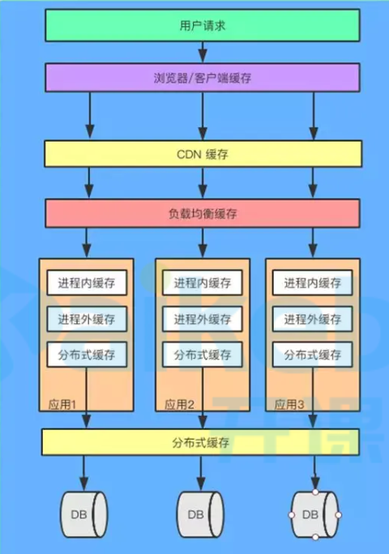
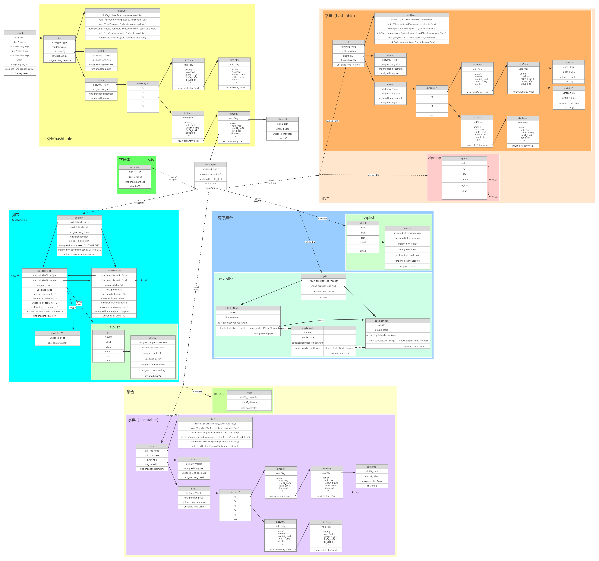
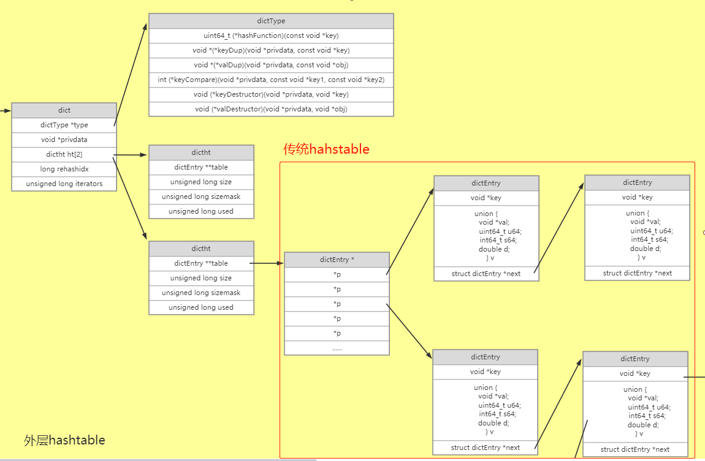
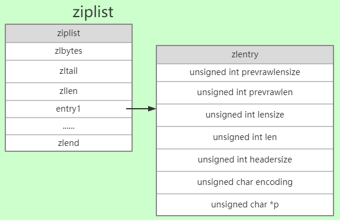
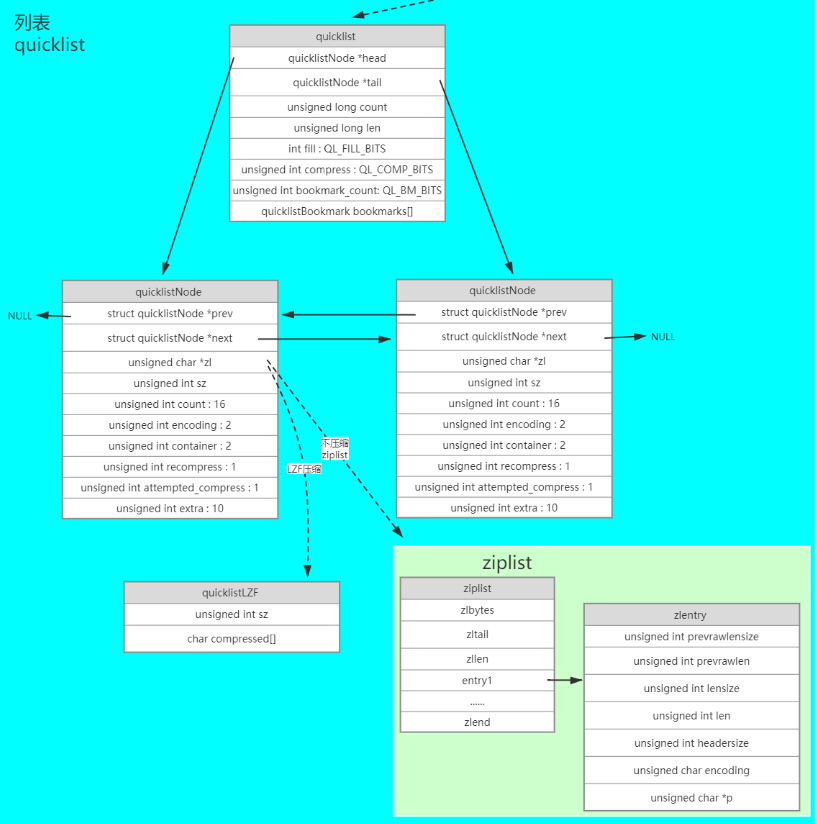
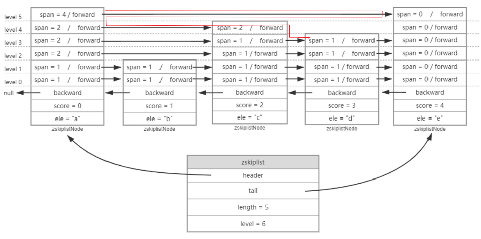
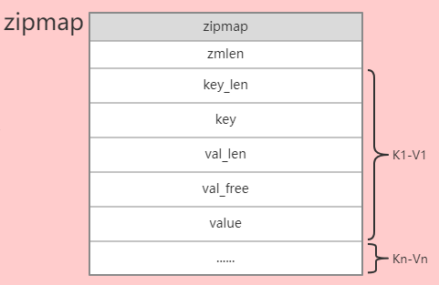
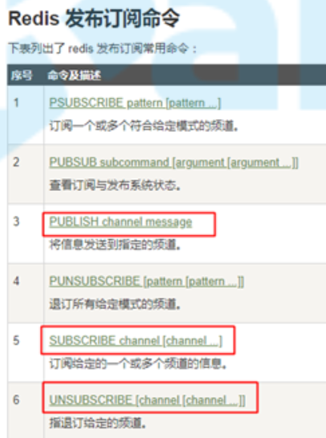

# 通识

## 缓存与缓冲

1. 缓存（cache）

   缓存是为了提高性能，把数据就存到这了，以后获取的时候，这里有就直接从这里获取了

2. 缓冲（buffer）

   缓冲是为了较少设备交互次数存在的

   比如向硬盘写数据时，如果每写1个字节都直接写入到磁盘，磁盘交互会很多，可以先把数据缓冲到buffer中，一次性写入，磁盘交互次数会大幅降低

## 缓存有哪些

+ CPU缓存
+ 操作系统缓存
+ 数据库缓存
+ JVM 编译缓存
+ CDN 缓存
+ 代理与反向代理缓存
+ 前端缓存
+ 应用程序缓存
+ 分布式对象缓存

## 多级缓存

 

使用多级缓存后，大部分请求都被缓存处理了，只有少部分请求会打到数据库

+ CDN缓存

  内容分发网络，将一些静态文件缓存到就近的站点，每次请求相同文件时，直接就近获取即可，不会直接请求源服务器

+ 负载均衡缓存

  动静分离时，对静态文件缓存，不用每次去磁盘取数据

  `nginx`

# redis介绍

## 快的原因

1. 基于内存
2. 单线程，使用了IO多路复用（epoll模型）

## 源码

+ 地址：https://github.com/redis/redis
+ 本文基于6.0版本


# 存储结构

 


## 结构说明

### redisDb

+ 每个`redisDb`代表1个数据库，默认16个数据库

### 外层hashtable

+ 每个`redisDb`下挂着1个`hashtable`，用于存储该库中所有键值对
+ 键固定是字符串类型，存储结构一般为`sds`结构体，具体参见[字符串类型](#字符串类型) 
+ 值使用`redisObject`结构存储，这个值具体是哪种基本类型，在`redisObject`中指定

### redisObject

+ 所有value值使用`redisObject`类型存储，使用`type`属性表示5种基本数据类型
+ `ptr`指针指向真正的数据
+ `refcount`
  + 引用计数，当技术大于1时表示这是1个`共享对象`
  + 共享对象池：`0~9999`这些整形数字内置在共享对象池中，可以重复引用

### 字符串类型

字符串类型内部编码有3种：

+ 整形编码
  + 字符串内容为整形数字时，使用8字节`long`整形表示
+ `embstr`编码
  + 小于等于44字节的字符串，使用该编码存储
  + 字符串内容使用`sds`结构存储
  + `redisObject`与`sds`内存空间上是连续的，一次内存分配同时创建这两个对象，`sds`中直接预留了固定的44个字节
+ `raw`编码
  + 大于44字节的字符串，使用该编码存储
  + 字符串内容也使用`sds`结构存储
  + 区别在于`redisObject`与`sds`内存空间上是分开的，这两个对象分两次创建；每次设置1个字符串值的时候，先在一块新的内存上创建对应的`sds`对象，然后将`sds`对象的地址赋值给`redisObject`的`ptr`属性

### 列表

列表使用`quicklist`数据结构

### 集合

内部编码：

+ `intset`

  满足如下2个条件时，使用该编码

  + 元素数量小于512

  + 所有元素都是整数

+ `hashtable`

  + 不满足上面两个条件时使用该编码
  + `set`集合使用`hashtable`编码时，`hashtable`中所有`value`值为`null`

### 有序集合

内部编码：

+ `ziplist`

  满足如下2个条件时，使用该编码

  + 元素数量小于128

  + 所有元素长度小于64字节

+ `zskiplist`

  + 不满足上面两个条件时使用该编码

### 哈希

hash类型内部编码有2种：

+ `zipmap`

  满足如下2个条件时，使用该编码

  + 元素数量小于512
  + 所有键和值的字符串长度都小于64字节

+ `hashtable`

  + 不满足上面两个条件时使用该编码

## 结构体

```c
// server.h:663
typedef struct redisDb {
    dict *dict;                 	// 数据库键空间，存放着所有的键值对
    dict *expires;              	// 键的过期时间
    dict *blocking_keys;        	// 处于阻塞状态的键和相应的client（主要用于List类型的阻塞操作）
    dict *ready_keys;           	// 准备好数据可以解除阻塞状态的键和相应的client
    dict *watched_keys;         	// 被watch命令监控的key和相应client
    int id;                     	// 数据库ID标识
    long long avg_ttl;          	// 数据库内所有键的平均TTL（生存时间）
    unsigned long expires_cursor; 	// 周期性删除过期键的游标
    list *defrag_later;         	// 逐一尝试整理碎片的关键名称列表
} redisDb;

// dict.h:76
typedef struct dict {
    dictType *type;					// 字典类型数据指针
    void *privdata;					// 私有数据
    dictht ht[2];					// 两张hashtable
    long rehashidx; 				// rehash索引
    unsigned long iterators; 		// 正在运行的迭代器个数
} dict;

// dict.h:58
typedef struct dictType {
    uint64_t (*hashFunction)(const void *key);								// 哈希函数指针
    void *(*keyDup)(void *privdata, const void *key);						// 复制key函数指针
    void *(*valDup)(void *privdata, const void *obj);						// 复制值函数指针
    int (*keyCompare)(void *privdata, const void *key1, const void *key2);	// 键比对函数指针
    void (*keyDestructor)(void *privdata, void *key);						// 销毁键的函数指针
    void (*valDestructor)(void *privdata, void *obj);						// 销毁值的函数指针
} dictType;

// dict.h:69
typedef struct dictht {
    dictEntry **table;			// 哈希桶指针
    unsigned long size;			// 哈希表大小
    unsigned long sizemask;		// 哈希表大小掩码，用于计算索引值；总是等于 size - 1
    unsigned long used;			// 已有节点数量
} dictht;

// dict.h:47
typedef struct dictEntry {
    void *key;					// key数据指针
    union {
        void *val;
        uint64_t u64;
        int64_t s64;
        double d;
    } v;						// value数据指针
    struct dictEntry *next;		// 链表下一节点指针
} dictEntry;

// sds.h
// sds结构体存在多种字节长度的结构体，仅仅长度不同，结构完全相同；这里以sdshdr16为例
struct __attribute__ ((__packed__)) sdshdr16 {
    uint16_t len; 				// 已用长度
    uint16_t alloc; 			// 可用字符串总长度
    unsigned char flags; 		// 低3位为标志位
    char buf[];					// 字符串内容
};

// server.h:625
typedef struct redisObject {
    unsigned type:4;				// 值类型
    unsigned encoding:4;			// 编码
    unsigned lru:LRU_BITS; 			// 最后一次命令程序访问时间
    int refcount;					// 引用计数
    void *ptr;						// 数据指针
} robj;

// quicklist.h:105
typedef struct quicklist {
    quicklistNode *head;					// 链表头指针
    quicklistNode *tail;					// 链表尾指针
    unsigned long count;        			// 集合种元素总数
    unsigned long len;          			// 链表节点数
    int fill : QL_FILL_BITS;              	// ziplist大小限定
    unsigned int compress : QL_COMP_BITS; 	// 节点压缩深度设置
    unsigned int bookmark_count: QL_BM_BITS;
    quicklistBookmark bookmarks[];
} quicklist;

// quicklist.h:46
typedef struct quicklistNode {
    struct quicklistNode *prev;				// 前一节点指针
    struct quicklistNode *next;				// 后一节点指针
    unsigned char *zl;						// ziplist数据指针
    unsigned int sz;             			// ziplist数据字节数
    unsigned int count : 16;     			// ziplist中元素数
    unsigned int encoding : 2;   			// 编码 RAW==1 or LZF==2
    unsigned int container : 2;  			// 预留字段，存放数据的方式，1--NONE，2--ziplist
    unsigned int recompress : 1; 			// 解压标记，当查看一个被压缩的数据时，需要暂时解压，标记此参数为1，之后再重新进行压缩
    unsigned int attempted_compress : 1; 	// 标记节点不压缩
    unsigned int extra : 10; 				// 扩展字段
} quicklistNode;

// quicklist.h:64
typedef struct quicklistLZF {
    unsigned int sz; 			// compressed[]字节数
    char compressed[];			// 压缩后内容
} quicklistLZF;

// ziplist.c:271
typedef struct zlentry {
    unsigned int prevrawlensize; // 前一个元素长度需要空间
    unsigned int prevrawlen;     // 上一项长度
    unsigned int lensize;        // 当前元素长度需要空间
    unsigned int len;            // 当前元素长度
    unsigned int headersize;     // prevrawlensize + lensize 字节长度
    unsigned char encoding;      // 编码
    unsigned char *p;            // 实际内容
} zlentry;

// intset.h:35
typedef struct intset {
    uint32_t encoding;			// 编码
    uint32_t length;			// 长度
    int8_t contents[];			// 内容
} intset;

// server.h:923
typedef struct zskiplist {
    struct zskiplistNode *header, *tail;	// 头节点、尾节点
    unsigned long length;					// 节点长度
    int level;								// 最大节点层数
} zskiplist;

// server.h:913
typedef struct zskiplistNode {
    sds ele;								// 成员对象
    double score;							// 分数
    struct zskiplistNode *backward;			// 前一节点
    struct zskiplistLevel {
        struct zskiplistNode *forward;		// 下一节点
        unsigned long span;					// 跨度
    } level[];								// 层
} zskiplistNode;
```


## 数据结构

### 字典（hashtable）

 

+ 传统`hashtable`如上图红框内所示，一个哈希桶下面挂1个单向链表

+ `redis`中`hashtable`上面加了两层，主要目的是准备两个哈希桶，用于实现扩容时的[渐进rehash](https://github.com/Mshuyan/redis#%E6%B8%90%E8%BF%9Brehash) 

### ziplist

 

+ 压缩列表分为2部分：`ziplist`、`zlentry`，`zlentry`镶嵌在`ziplist`内部
+ `ziplist`
  + `zlbytes`：整个`ziplist`占用字节数；占用4字节
  + `zltail`：尾节点偏移量；占用4字节
  + `zllen`：节点数，小于65535时表示节点数，等于65535时需要遍历才能得到节点数；占用2字节
  + `zlentry`
    + `prevrawlensize`：前一节点长度占用字节数，值为1或5
    + `prevrawlen`：前一节点长度
    + `lensize`：当前元素长度占用字节数
    + `len`：当前元素长度
    + `headersize`头信息（前面四部分）字节数
    + `encoding`：编码
    + `p`：数据内容；这里实际不是指针，就是数组，内容就存在接下来的内存区域
+ 插入、修改、删除操作，是需要大量内存拷贝的

### quicklist

 

+ `quicklist`就是`双向链表`+`ziplist`

### skiplist

 

+ 头尾节点一定是最高的节点
+ 要寻找`score=3`的节点时，查找轨迹如红色路线

### zipmap

 

+ 就是k-v键值对一个一个往后放，查找时需要逐个遍历

# 内存用量统计

## 内存划分

+ 数据内存

  用于存储数据库中的数据

+ 进程内存

  程序运行需要的内存，包括数据内存、缓冲内存、内存碎片、常量池

+ 缓冲内存

  数据收发客户端命令时需要使用缓冲内存对命令进行缓冲

+ 内存碎片

  数据修改过程中产生的内存碎片

## 内存统计

我们可以在`redis`中使用`info memory`命令查看内存统计数据

我们一般只需要关注如下几个数据：

+ `used_memory`

  + 已使用内存
  + `used_memory_human`可以用`MB、KB`等人性化方式表示

+ `used_memory_rss`

  + 操作系统给redis进程分配的总内存

+ `mem_fragmentation_ratio`

  + 内存碎片比例；该值等于`used_memory_rss / used_memory`

+ `mem_fragmentation_bytes`

  + 内存碎片大小；就是未使用内存大小

+ `mem_allocator`

  + 内存分配器，默认`jemalloc`，无需修改

# 缓存淘汰策略

本部分已经学过，参见[redis-内存管理](https://github.com/Mshuyan/redis#%E5%86%85%E5%AD%98%E7%AE%A1%E7%90%86) 

# redis事务

+ 不支持回滚

## 事务命令

+ `MULTI`

  + 开始事务

  + 事务中的命令都会先被缓存起来

  + 语法：

    ```sh
    127.0.0.1:6379> multi
    ```

+ `DISCARD`

  + 清空事务中缓存的命令，并退出事务

  + 语法：

    ```sh
    127.0.0.1:6379> discard
    ```

+ `EXEC`

  + 执行事务中缓存的命令，并退出事务

  + 语法：

    ```sh
    127.0.0.1:6379> exec
    ```

## 实现乐观锁

+ 利用`redis`事务+`watch`命令可以实现乐观锁

  命令该执行执行，当事务涉及的数据被修改时告诉我就行了

### 命令

+ `WATCH`

  + 执行该命令的时刻开始，监控多个key，从开始监控到执行`exec`命令过程中，如果被监控的`key`被修改了，则事务执行不成功

  + 该命令必须在`multi`命令前执行

  + 语法

    ```sh
    127.0.0.1:6379[1]> watch s1 s2
    OK
    127.0.0.1:6379[1]> multi
    OK
    127.0.0.1:6379[1]> set s1 33
    QUEUED
    127.0.0.1:6379[1]> set s2 44
    QUEUED
    127.0.0.1:6379[1]> exec
    1) OK
    2) OK
    ```

+ `UNWATCH`

  + 取消对上一次`watch`命令涉及到的所有key的监控

  + 该命令可以可以在事务外执行，也可以在事务外执行

    事务中合适的时候执行，可以尽量缩小事务中命令的执行条件边界，在保证事务可靠性前提下，提高事务成功率

  + 语法

    ```sh
    127.0.0.1:6379[1]> watch s1
    OK
    127.0.0.1:6379[1]> multi
    OK
    127.0.0.1:6379[1]> unwatch
    QUEUED
    127.0.0.1:6379[1]> exec
    ```

### 实现

```sh
127.0.0.1:6379[1]> watch s1 s2
OK
127.0.0.1:6379[1]> multi
OK
127.0.0.1:6379[1]> set s1 33
QUEUED
127.0.0.1:6379[1]> set s2 44
QUEUED
127.0.0.1:6379[1]> exec				# watch 到 exec 期间，如果监控的值被修改了，命令就执行不成功
1) OK
2) OK
```

# 持久化

+ 前面学过一部分，参见[redis持久化](https://github.com/Mshuyan/redis#%E6%8C%81%E4%B9%85%E5%8C%96) 

## 混合持久化

+ 就是同时使用`aof`和`rdb`进行持久化
+ `5.0`以后默认使用该方式
+ 可以通过配置`aof-use-rdb-preamble yes`启用


# lua整合

## 概述

+ `lua`是1个脚本语言
+ `redis`中使用`lua`脚本，则脚本中执行的命令都是一起执行的，可以认为是`原子操作`

## 使用

### lua脚本中调用Redis命令

+ 调用

  + `redis.call()`：出错时返回错误信息，停止执行
  + `redis.pcall()`：出错时记录错误信息，继续执行
  + 返回值为`redis`命令的返回值

+ 返回值

  `lua`脚本使用`return`返回脚本的返回值给客户端，不`return`则返回`nil`

+ 例

  ```sh
  127.0.0.1:6379> eval "return redis.call('set',KEYS[1],ARGV[1])" 1 n1 zha
  OK
  ```

### redis命令行

#### EVAL命令

```sh
# 语法
127.0.0.1:6379> eval SCRIPT KEY_NUMS KEY ... VALUE ...
# SCRIPT：脚本内容
# KEY_NUMS：key个数
# KEY：多个key，可变参数
# VALUE：多个value，可变参数
# 例
127.0.0.1:6379> eval "return {KEYS[1],KEYS[2],ARGV[1],ARGV[2]}" 2 key1 key2 first second
1) "key1"
2) "key2"
3) "first"
4) "second"
```

#### SCRIPT命令

+ `script load SCRIPT`：将脚本缓存，并返回`SHA1`摘要（使用校验和作为唯一标识）

+ `script exists SHA1`：根据`SHA1`摘要判断脚本是否存在

+ `script kill`：杀死所有正在运行的脚本

+ `script flush`：清除所有脚本缓存

+ 例

  ```sh
  127.0.0.1:6379> script load "return redis.call('set',KEYS[1],ARGV[1])"
  "c686f316aaf1eb01d5a4de1b0b63cd233010e63d"
  127.0.0.1:6379> script exists c686f316aaf1eb01d5a4de1b0b63cd233010e63d
  1) (integer) 1
  127.0.0.1:6379> script kill
  (error) NOTBUSY No scripts in execution right now.
  127.0.0.1:6379> script flush
  OK
  ```

#### EVALSHA

```sh
# 语法: 就是将 eval 的脚本换成 SHA1
127.0.0.1:6379> evalsha SHA1 KEY_NUMS KEY ... VALUE ...
# 例
127.0.0.1:6379> script load "return {KEYS[1],KEYS[2],ARGV[1],ARGV[2]}"
"a42059b356c875f0717db19a51f6aaca9ae659ea"
127.0.0.1:6379> evalsha a42059b356c875f0717db19a51f6aaca9ae659ea 2 1 2 3 4
1) "1"
2) "2"
3) "3"
4) "4"
```

### linux命令行

+ `redis-cli --eval`

  语法：

  ```sh
  $ redis-cli -eval SCRIPT KEY ... , VALUE ...
  ```

  + `SCRIPT`：脚本文件
  + `KEY`：脚本中使用的`key`，可变参数，逗号分隔
  + `VALUE`：脚本中使用的`value`，可变参数，逗号分隔
  + `KEY`和`VALUE`之间使用` , `分割，`,`前后都有空格

+ 例

  + 编写脚本文件`test.lua`

    ```lua
    return {KEYS[1],KEYS[2],ARGV[1],ARGV[2]}
    ```

  + 命令行执行

    ```sh
    root at shuyan in ~
    $ cat test.lua
    return {KEYS[1],KEYS[2],ARGV[1],ARGV[2]}
    
    root at shuyan in ~
    $ redis-cli --eval test.lua 1 2 , 3 4
    1) "1"
    2) "2"
    3) "3"
    4) "4"
    ```

    

# 消息模式（了解）

+ 1V1

  + `lpush`发布消息
  + `brpop`订阅消息

+ 1Vn

  + `publish`发布消息
  + `subscribe`订阅消息

   

# Redis Stream（了解）

+ 5.0新增的数据结构
+ 可以看成消息队列
+ 相对于redis之前的发布订阅功能，增加了持久化的特性

# 分布式锁

## 分布式锁特性

分布式锁必须具备如下特性

+ 互斥性：只能有1个人拿到锁
+ 同一性：谁加的锁只能谁解锁

## Redis实现

### 加锁

#### setnx（不推荐）

```java
public boolean tryLock(String key,String requset,int timeout) {
    Long result = jedis.setnx(key, requset);
    // result = 1时，设置成功，否则设置失败
    if (result == 1L) {
        return jedis.expire(key, timeout) == 1L;
    } else {
        return false;
    }
}
```

+ `setnx`与`expire`命令不是原子操作，遇上第一条执行异常或执行完重启了，锁无法过期

#### lua脚本（一般）

```java
public boolean tryLock_with_lua(String key, String UniqueId, int seconds) {
    String lua_scripts = "if redis.call('setnx',KEYS[1],ARGV[1]) == 1 then" +
            "redis.call('expire',KEYS[1],ARGV[2]) return 1 else return 0 end";
    List<String> keys = new ArrayList<>();
    List<String> values = new ArrayList<>();
    keys.add(key);
    values.add(UniqueId);
    values.add(String.valueOf(seconds));
    Object result = jedis.eval(lua_scripts, keys, values);
    //判断是否成功
    return result.equals(1L);
}
```

+ 实现效果上没有问题，但是还是用`setnx`实现，代码比较多

#### set（推荐）

```java
public boolean tryLock_with_set(String key, String UniqueId, int seconds) {
    return "OK".equals(jedis.set(key, UniqueId, "NX", "EX", seconds));
}
```

### 解锁

+ 不可以直接删除`key`，如果真的中途被其他人拿到了锁，这里之间删除`key`将解了别人的锁

+ 使用`lua`脚本先把`value`拿出来看看是不是自己的再解锁

  ```java
  public boolean releaseLock_with_lua(String key,String value) {
      String luaScript = "if redis.call('get',KEYS[1]) == ARGV[1] then " +
              "return redis.call('del',KEYS[1]) else return 0 end";
      return jedis.eval(luaScript, Collections.singletonList(key), Collections.singletonList(value)).equals(1L);
  }
  ```

### 为什么需要设置value值

为了让保证同一性，删除锁的时候先看看是不是自己加的锁，避免删了别人的锁

### Redisson

+ 参考资料：https://www.bookstack.cn/books/redisson-wiki-zh
+ `redisson`是`redis`客户端，比`jsdis`和`lettuce`好，强烈推荐
+ `redisson`支持可重入锁、公平锁、读写锁、联锁、红锁

# 常见问题

## 缓存穿透

+ 问题

  大量请求一直请求数据库不存在的key，redis没有缓存`null`值，这些请求会直接打到数据库

+ 解决方案

  + 缓存`null`值，过期时间很短，数据变更时修改
  + 布隆过滤器

## 缓存雪崩

+ 问题

  大量缓存集中失效，请求直接打到数据库

+ 解决方案

  + 过期时间分散开
  + 使用二级缓存
  + 保证redis服务高可用

## 缓存击穿

+ 问题

  单个缓存过期，正好大量请求过来了，直接打到数据库

+ 解决方案

  + 分布式锁保证不会同时访问数据库

## 双写一致性

+ 问题

  当数据库更新数据，redis需要同步更新时，如何保证最终数据一致性

+ 解决方案

  ```
  update_db
  sleep xxx ms
  rm_redis
  ```

# 调优

## lazy free

+ 4.0新加特性

+ 删除操作不在主进程进行，使用子进程后台删除

+ 参数

  默认都是关闭的

  ```sh
  lazyfree-lazy-eviction no	# 内存淘汰时的删除是否后台删除
  lazyfree-lazy-expire no		# 过期key删除是否后台删除
  lazyfree-lazy-server-del no # 隐式删除是否后台删除（如rename命令）
  slave-lazy-flush no			# 执行flush命令时是否后台删除
  ```

## 内存淘汰策略

+ 默认关闭，建议开启
+ `maxmoemory`：最好设置为物理内存`75%`
+ 配置合适的缓存淘汰策略

## 禁用耗时命令

+ 禁用`keys`，使用`scan`扫描
+ 删除大数据时使用`unlink`代替`del`，删除改为异步

## pipeline批量操作

+ 一组指令一起发送至服务端执行
+ 减少网络开销


