> + 课程使用`mysql5.7.3`
> + `mysql`配置文件中不区分`-`和`_`

# MySql安装

+ docker

  ```sh
  #!/bin/bash
  
  # /usr/local/docker-srv/mysql5.7/logs 需要修改权限为 777
  
  docker run -d --name mysql5.7 \
   --log-opt max-size=10m \
   -v /etc/localtime:/etc/localtime:ro \
   -v /etc/timezone:/etc/timezone:ro \
   -p 3306:3306 \
   --privileged=true \
   -v /usr/local/docker-srv/mysql5.7/conf:/etc/mysql \
   -v /usr/local/docker-srv/mysql5.7/logs:/logs \
   -v /usr/local/docker-srv/mysql5.7/data:/var/lib/mysql \
   -e MYSQL_ROOT_PASSWORD=943397 \
   mysql:5.7
  ```

  

# MySql文件结构

> + `mysql`数据分为日志文件和数据文件，通常放在`var/lib/mysql`目录下

## 日志文件

> + 日志文件都是`顺序IO`的，追加的形式按顺序写
> + 日志相关配置可以通过` show variables like '%log%';`查看

### 错误日志

+ 作用：记录运行过程中遇到的所有`错误、警告、通知`等信息,以及每次`启动和关闭`的详细信息。

+ 配置

  ```sh
  # 作用：错误日志存储位置
  # 默认值：stderr，输出到控制台
  # 常用配置：一般都需要指定1个输出位置
  log_error=/var/log/mysqld.log
  # 作用：将哪些级别的警告输出到错误日志，默认2；0表示不输出警告
  # 默认值：2
  # 常用配置：使用默认值
  log_warnings=2
  # 作用：将哪些信息输出到错误日志：1：错误；2：错误和警告；3：错误、警告和通知
  # 默认值：3
  # 常用配置：使用默认值
  log_error_verbosity=3
  ```

### 二进制日志

+ 作用：记录数据库实例的所有修改语句

+ 配置

  ```sh
  # 作用：指定服务id
  # 默认值：0
  # 说明：主从复制功能需要为每个mysql实例指定不同的server-id；为0时无法启用主从复制和binlog日志功能
  server-id=1 
  # 作用：启用并配置binlog文件的basename
  # 默认：OFF
  # 常用配置：需要使用`binlog`文件时再开启，一般需要将数据实时同步给其他服务时需要开启
  log-bin=mysql-bin
  ```

+ 说明：启用`binlog`后，会在`/var/lib/mysql`下生成如下文件：

  + `{basename.index}`：二进制索引文件，用于为所有二进制文件建立索引
  + `{basename}.000001`：二进制文件，真正的内容

### 通用查询日志

+ 作用：记录用户所有操作

+ 配置

  ```sh
  # 是否启用通用日志
  # 默认值 OFF；可选值 ON|OFF
  # 常用配置：关闭；开启后产生大量不必要的磁盘IO，影响性能
  general_log=OFF
  # 通用日志文件名
  # 默认值：/{datadir}/{hostname}.log
  general_log_file=/var/lib/mysql/dc3757bde5bd.log
  ```

### 慢查询日志

+ 作用：记录查询时间过长得sql

+ 配置

  ```sh
  # 是否启用慢查询
  # 默认值：OFF；可选值 ON|OFF
  # 常用配置：
  slow_query_log=ON
  # 慢查询阈值，单位秒
  # 默认10
  long_query_time=10
  # 慢查询日志文件名
  # 默认值：/{datadir}/{hostname}-slow.log
  # 如果指定文件名没有指定目录，默认目录为{datadir}
  slow_query_log_file=/var/lib/mysql/dc3757bde5bd-slow.log
  ```


## 数据文件

> 数据文件是`随机IO`的，需要在文件中需要的位置插入、修改数据

### InnoDB

+ `ib_buffer_pool`

  内存中缓冲池得持久化文件

  持久化的目的是数据库重启时可以直接加载上次使用的缓冲池，避免预热过程

+ `ib_logfile0`、`ib_logfile1`

  重做日志文件

+ `ibdata1`

  系统表空间文件

+ 库文件

  > + 每个`database`对于1个与数据库同名的目录，目录下存放该数据库相关文件
  > + 下属文件名中的`*`均为表名

  + `*.frm`

    表结构定义信息

  + `*.ibd`

    表中索引和数据

  + `db.opt`

    数据库属性信息，默认字符集等

### MyIsam

+ `*.frm`

  表结构定义信息

+ `*.myd`

  表中数据

+ `*.myi`

  表中索引

# MySql逻辑架构

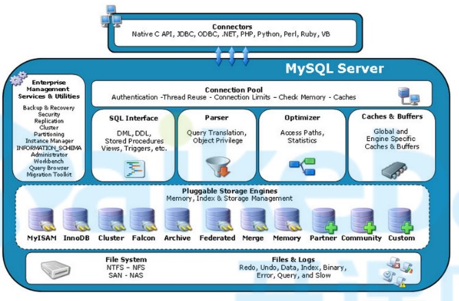 

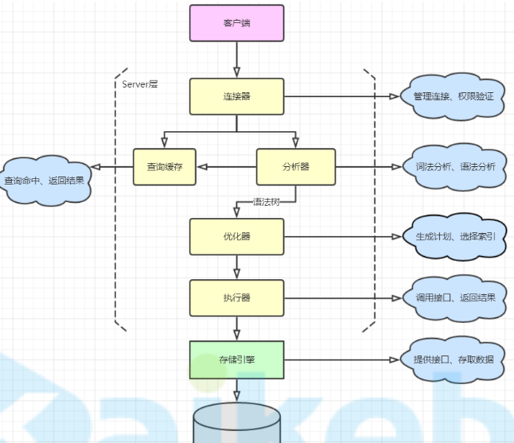 

+ 客户端

  各种语言实现的客户端连接器，如JDBC

+ `MySQL Server`层

  + `Management Serveices & Utilities`

    系统管理和控制工具

  + `Connaction Pool`

    + 连接池
    + 用于与客户端建立连接，身份认证，获取权限
    + 通过`show processlist;`命令可以查看连接池中的连接
    + `wait_timeout`参数控制连接超时时间，默认8小时

  + `SQL Interface`

    + `SQL`接口
    + 用于接收和返回数据

  + `Parser`

    + 解析器
    + 用于对sql进行验证和解析，大致流程如下：
      + 词法分析，先将语句拆解成各个部分
      + 语法分析，分析语法是否合法
      + 创建解析树并校验权限

  + `Optimizer`

    + 查询优化器
    + 对查询语句进行优化
      + 多个可用索引时选择1个效率最高的
      + 多表关联时整理表的关联顺序
    + 生成多个执行计划，选择效率最高的执行
    + `explain`查看的执行计划，就是查询优化器生成的

  + 执行器

    + 调用存储引擎接口进行查询
    + 校验权限
    
  + `Caches & Buffers`

    + 缓存和缓冲区
    + 将查询语句的hash值作为key，将查询结果进行缓冲，数据变更时自动失效
    + 使用效果并不理想，mysql8.0中已弃用，想用可以自己用二级缓存、redis等实现

+ 存储引擎层

  + MySql的存储引擎是可插拔的，如：MyIsam、InnoDB、Memory
  + MySql可以为每张表指定不同的引擎

+ 文件系统

  就是存储在磁盘上的各种文件，参见[文件结构](# 文件结构) 

# InnoDB引擎

## InnoDB架构图

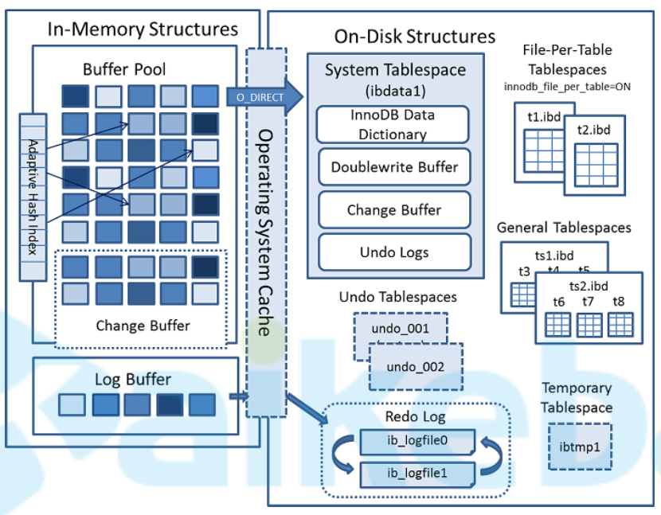 

## 内存结构

### 缓冲池

+ 用户缓存磁盘上的`数据页`和`索引页`
+ 每页大小为16K
+ 通过`LRU`算法淘汰不常使用的数据页
+ 缓冲池会持久化到磁盘上，用于避免预热过程，对应文件为`ib_buffer_pool`
+ `buffer pool`实例大小 = `buffer pool`总大小（`innodb_buffer_pool_size`） / `buffer pool`实例数（`innodb_buffer_pool_instances`）
+ `buffer pool`中缓存了多种类型的数据页，类型如下：
  + 索引页
  + 数据页
  + 回滚日志
  + 修改缓冲区
  + 自适应哈希索引
  + 锁信息
  + 数据字典

#### 修改缓冲区

+ 对辅助索引的更新操作缓存到修改缓冲区中，异步进行辅助索引的更新
+ 内存中放不下时，会将数据持久化到系统表空间文件中
+ 一开始只记录插入操作，也叫`插入缓冲区`，后来也记录修改删除操作，所以更名为`修改缓冲区`

#### 自适应哈希索引

+ 了解
+ 完全由`mysql`控制的哈希结构索引
+ 如果1个或多个索引组合使用的次数足够多，根据索引信息生成1个key，value指向数据页，创建1个哈希结构的索引；用于加快查询效率
+ 参考资料：https://juejin.cn/post/6847902217270198286

### 日志缓冲区

+ 也叫`重做日志缓冲区`，专门缓存`redo log`日志的
+ `redo log`内容先写到`日志缓冲区`，`commit`时再刷新到磁盘文件中

## 磁盘结构

### 逻辑存储结构

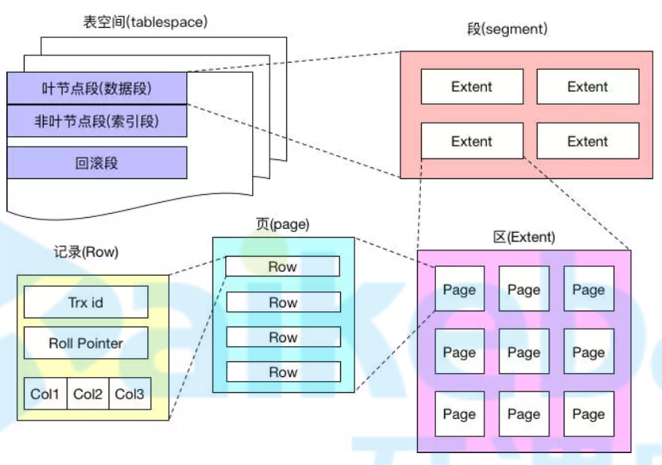 

+ 1个区=1MB
+ 1页=16KB

### 内容

#### 系统表空间

> + 整个数据库服务器只有一份
> + 对应`ibdata1`文件

+ 数据字典

+ 双写缓冲区

  参见[脏页罗盘流程](# 脏页罗盘流程)

+ 修改缓冲区

  内存中修改缓冲区放不下时，会将数据持久化到系统表空间文件中

+ 回滚日志

  参见[回滚日志](# 回滚日志) 

#### 回滚表空间

+ 了解
+ 整个数据库服务器只有一份，可以分开多个文件存储
+ `Undo Logs`默认存储在系统表空间文件中，也可以单独存储在`Undo Tablespaces`中

#### 用户表空间

+ 每张表对应1个用户表空间
+ 对应`*.ibd`文件
+ 用于存储该表的数据和所有的索引

#### 通用表空间

+ 了解
+ 同样对应`*.ibd`文件
+ 通过`create tablespace ...`命令可以创建通用表空间文件，我们再创建表的时候可以指定使用哪个通用表空间文件存储这张表

#### 临时表空间

+ 了解
+ 对应`ibtmp1`文件
+ 查询时创建的临时表会存储到临时表空间中
+ 持久化的目的是避免预热过程

#### 重做日志

+ 默认两个文件循环写入，对应文件：`ib_logfile0`、`ib_logfile1`
+ 参数
  + `innodb_log_file_size`参数可以用来指定`redo log`日志文件每个文件的大小，默认50MB
  + `innodb_log_files_in_group`参数可以指定文件组由几个文件组成，默认2

## redo log

### 内容

`redo log`中主要包括2部分内容：

+ 事务中生成新的`undo log`版本的记录
+ 事务中的修改操作记录

### 执行流程

+ 开启事务

+ 将记录`undo log`的操作记录到`redo_log`

+ 记录`undo log`

+ 所有修改操作，直接更新缓冲池中数据页，并将修改操作记录到`log buffer`中

+ 修改内存中数据页

+ 提交

  + 将当前事务的`提交动作`记录到`log buffer`中
  
  + 提交时不直接修改硬盘上的数据（随机IO消耗性能），将`log buffer`中记录持久化到磁盘上的`redo_log`文件中，持久化成功才返回`commit`成功；后续异步修改磁盘上的数据，这样既避免数据的丢失，又提高了修改数据的性能

### redolog落盘时机

- 当`redo log buffer`的数据超过`redo log buffer`容量的一半时

- 事务提交的时候

  通过`innodb_flush_log_at_trx_commit`参数控制，默认1

  + 1：等待主线程每秒写入1次
  + 2：提交时立即写入磁盘
  + 3：提交时立即写入文件系统缓存，由操作系统决定何时写入磁盘

- 每秒一次，Master线程会将`redo log buffer`的数据写出，这个刷出跟事务提交无关，彼此是独立的

- 服务正常关闭的时候

- `checkpoint`的时候

### 数据恢复

+ 对于还没来得及落盘的脏页数据，可以通过重新执行`redo log`中操作进行恢复
+ 上面恢复的数据中可能存在未提交的数据，需要通过`undo log`回滚

#### 未提交的数据落盘

+ [redolog落盘时机](#redolog落盘时机)中除了`commit`时的落盘，均会造成未提交的`redo_log`落盘
+ 因为`log buffer`是一大块内存全局顺序写，当一个事务提交时，他前面还没提交的日志也会被落盘
+ 因为`log buffer`是一大块内存全局顺序写，需要回滚的事务无法再将`redo log`记录删掉，落盘发生时这部分应该回滚的记录也会被落盘

#### 解决

+ 由于生成`undo log`的操作被记录在`redo log`中，`redo log`中如果发现事务尚未提交，可以在`undo log`中找到

## 脏页落盘

+ 由于修改数据时只修改了缓冲池中数据页，并且将`redo log`写入磁盘了，并没有更新磁盘中数据页，所以会存在内存中数据页和磁盘中数据也不一致的情况，磁盘上没来得及更新的数据页就称之为脏页
+ 脏页落盘就是将内存中数据页同步到磁盘中数据页上
+ 脏页落盘是通过`checkpoint（检查点）`机制进行落盘

### CheckPoint

`checkpoint`分为2类：

+ `sharp checkpoint`

  关闭数据库时全部落盘

+ `fuzzy checkpoint`

  在如下几个时机发生时进行部分落盘

  + `Master Thread Checkpoint`

    主线程每秒或每10秒进行一次异步落盘

  + `FLUSH_LRU_LIST Checkpoint`

    当缓冲池中空闲页不足时，通过`LRU`算法淘汰数据也，被淘汰的数据页中的存在脏页时进行落盘

  + `Async/Sync Flush Checkpoint`

    redolog快写满时需要执行。

    + 当redolog的使用量大于redolog总容量的75%小于90%时执行异步落盘。
    + 当redolog的使用量大于redolog总容量的90%时执行同步落盘

  + `Dirty Page too much Checkpoint`

    `buffer pool`中脏页占75%时执行异步落盘

### 双写缓冲区（脏页罗盘流程）

+ 将脏页写入到内存中`双写缓冲区`
+ 将内存中双写缓冲区写入到系统表空间的双写缓冲区
+ 将内存中双写缓冲区写入到用户表空间

> 双写保证落盘过程中不会造成数据页的损坏


# 事务

## 事务执行流程

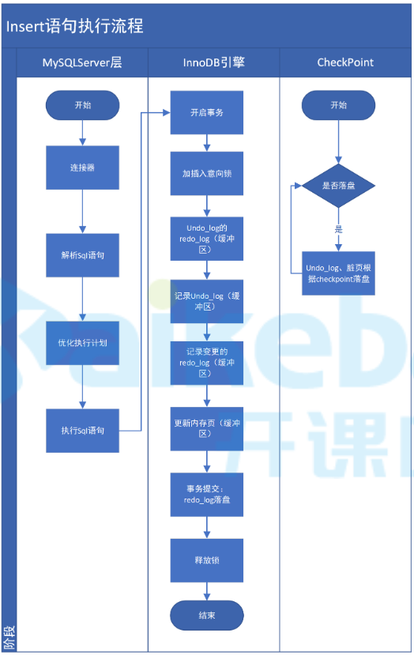 

+ `undo_log`的`redo_log`：修改数据前，需要先`当前读`要修改的记录，并生成`undo log`记录，这步操作是需要记录在`redo log`中的（参见[undo_log](# undo_log)）

## 事务介绍

### 事务特性（ACID）

+ 原子性（`atomicty`）

  整个事务要么全成功。要么全失败

+ 一致性（`consistency`）

  事务开始前和结束后，数据完整性不要被破坏（因为事务部分提交导致出现错误数据）

+ 隔离性（`isolation`）

  不同事务之间不能相互影响

  隔离性的强弱与事务的性能相关，隔离级别越高性能越差

+ 持久性（`durability`）

  事务提交后数据永久有效

### 隔离级别

#### 切换隔离级别

```mysql
# 查看当前事务级别：
SELECT @@tx_isolation;
# 设置read uncommitted级别：
set session transaction isolation level read uncommitted;
# 设置read committed级别：
set session transaction isolation level read committed;
# 设置repeatable read级别：
set session transaction isolation level repeatable read;
# 设置serializable级别：
set session transaction isolation level serializable;
```

#### 事务之间存在哪些影响

+ 脏读

  + 一个事务读取到另一个事务中还`未提交`的数据

  + 通过`MVCC`解决，每次获取最新得`read view`

+ 不可重复读

  + 因其他事务提交的`修改和删除`，一个事务中两次读取同一条数据的结果不一致
  + 解决
    + `RR`级别：通过`MVCC`解决，第一次获取`read view`时缓存起来，后续使用缓存的`read view`；
    + `Serializable`级别：读写串行执行，不存在不可重复读

+ 幻读

  + 因其他事务提交的`新增`，一个事务中两次读取到的数据不一致
  + 解决
    + `RR`级别
      
      + 默认通过`MVCC`解决了`快照读`状态下的幻读，`当前读`状态下的幻读问题还存在
      
        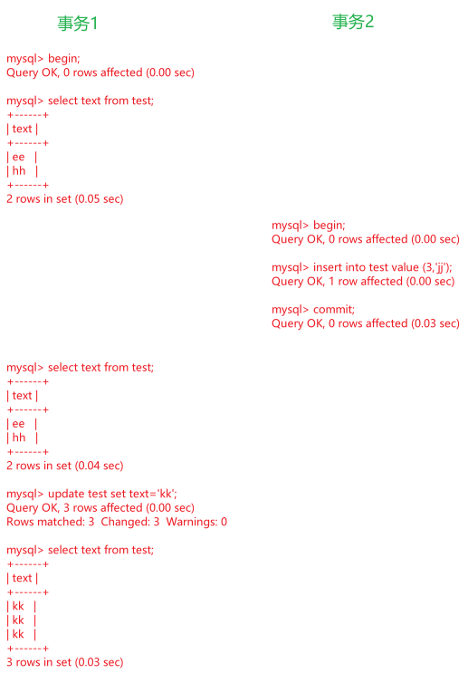 
      
      + `当前读`本身就要求读到最新已提交数据，还想避免幻读，只能通过锁保证事务执行过程中不允许插入
      
        可以`select`时使用共享锁或排他锁解决（原理是`间隙锁`）
      
    + `Serializable`级别
    
      读写串行执行，不存在幻读

+ 丢失更新

  + 两个事务同时执行时，后提交事务`覆盖`了先提交的事务提交的数据
  + 解决
    + `RC`、`RR`：手动通过悲观锁或乐观锁解决
    + `Serializable`：`select`自动加`意向共享锁`，不存在丢失更新

#### 隔离级别

+ 读未提交（RU）

  未解决任何问题

+ 读已提交（RC）

  + 通过`MVCC`解决脏读

  + `oracle`默认
  + 没有间隙锁

+ 可重复读（RR）

  + `mysql`默认

  + 加入间隙锁

  + 通过`MVCC`解决

    + 脏读

    + 不可重复读

    + 幻读

      解决了`快照读`状态下的幻读，`当前读`状态下的幻读问题还存在
      
      `当前读`下的幻读可以`select`时使用共享锁或排他锁解决（原理是`间隙锁`）

+ 串行化（`Serializable`）

  解决所有问题

## 事务实现方案

### 术语

+ 快照读

  + 不加锁的`select`就是快照读
  + 读取到的是当前事务的可见版本数据

+ 当前读

  + 读取数据同时加上共享锁或排他锁

  + 读取到的一定是最新版本数据

    这里不用解释为：最新版本`已提交`数据；因为未提交的数据上了排他锁，压根读不到

  + 哪些操作使用当前读

    + `select`+共享锁

      ```sql
      # 所有版本
      select * from test lock in share mode
      # 8.0
      select * from test for share
      ```
  
    + `select`+排他锁
    
      ```sql
      select * from test lock in share mode
      ```

    + `insert`、`update`、`delete`操作中都隐式包含了一步当前读

### 概述

+ `InnoDB`使用`LBCC`+ `MVCC`实现的事务

  所有`insert`、`update`、`delete`操作自动使用排他锁

  + RU

    + `LBCC`方案，`select`不加锁
    + 读写同一份数据，因为写操作使用排他锁，写与写串行执行

  + RC

    `LBCC`+`MVCC`方案，

    + `select`不加锁
    + 没有`间隙锁`
    + 每次读取都使用最新的`read view`

  + RR

    `LBCC`+`MVCC`方案，

    + `select`不加锁
    + 有`间隙锁`
    + 第一次读取时将`read view`缓存起来，后续读取时使用缓存的`read view`

  + `Serializable`

    `LBCC`方案，`select`自动加上`意向共享锁`


## MVCC

+ 多版本并发控制（`Multi Version Concurrency Control`）
+ 只能在`读已提交`和`可重复读`两个级别使用
+ 为每个事务中读写的数据行生成独立的快照版数据，读取时只读取自己可见版本数据
+ `InnoDB`中，使用`undo_log`和`read view`实现`MVCC`

### undo_log

+ 隐藏列

  `InnoDB`中的记录行有3个隐藏列

  + `RowID`：默认主键id，没有主键时自动生成
  + `事务ID`：每个事务的ID编号
  + `回滚指针`：指向上一版本的指针

+ `update undo log`

  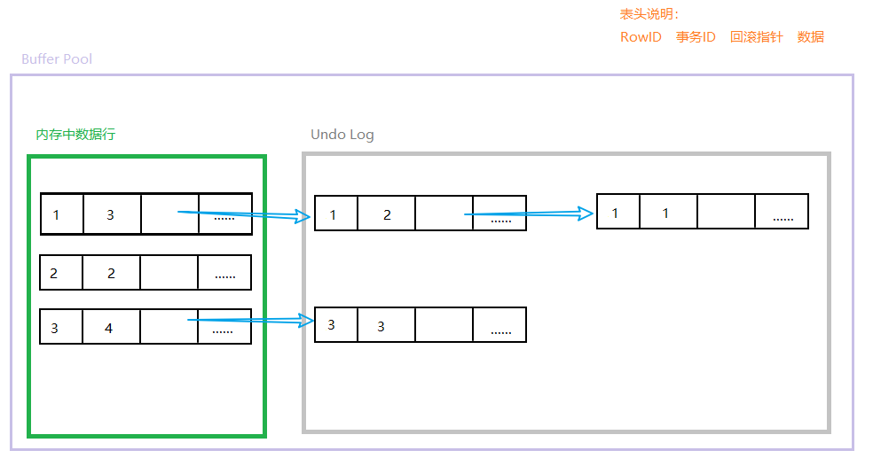 

  + 每当有新事务对某行数据进行修改时，将`内存中数据行`向后串一下，移入`Undo Log`,并将原来的`内存中数据行`复制一份作为新的`内存中数据行`，新的`内存中数据行`：`RowID`保持不变；`事务ID`修改为当前事务ID；`回滚指针`指向原来的`内存中数据行`
  + `update undo log`是指执行`update`、`delete`操作时产生的`undo log`
  + 事务提交后，`undo log`中旧版本不能立即删除，因为还有其他事务需要读取（参见`不可重复读`），需要后续执行`purge`操作进行回收
    + 猜测是没有任何1个未提交事务的事务ID直接大于某个事务的时，这个事务就可以删除了
    + 8 > 5 > 2；则8直接大于5，间接大于2

+ `insert undo log`

  + 事务中`insert`的数据本身就对其他事务不可见，提交后可以直接删除掉`insert undo log`记录
  + 这块不理解，本来就没有，哪来的老版本，何谈删除
  
+ 落盘时机

  + 跟随`checkpoint`落盘

  + 提交时落盘
  
    > 参考资料：http://mlwiki.org/index.php/Undo/Redo_Logging
    >
    > 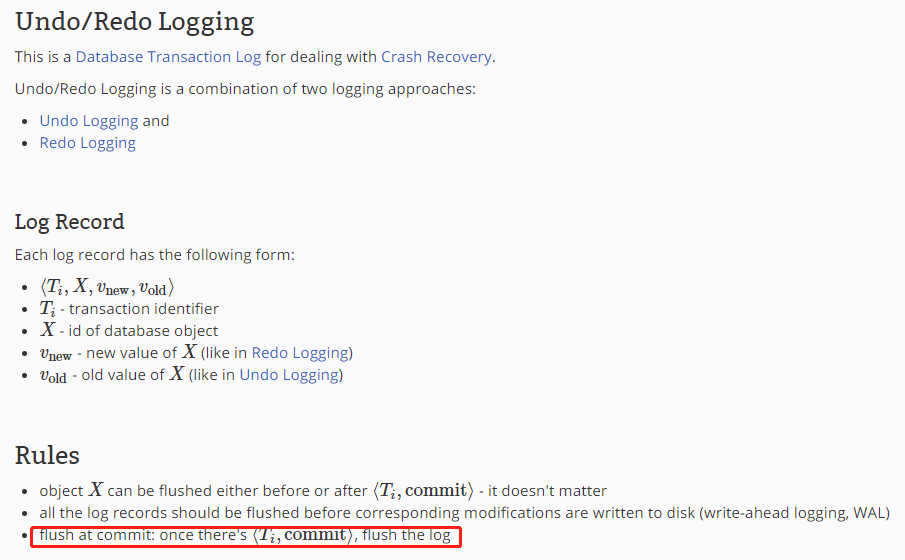 
  
+ 持久化

  数据恢复时，对未提交的落盘数据进行回滚

  参见：[数据恢复](#数据恢复) 

### read view

+ `read view`就是从多个版本中筛选出来的最终可见版本

+ 每次执行`select`时生成`read view`

+ 筛选规则

  + mysql维护了如下几个变量：

    + `m_ids`：全局未提交的事务id列表
    + `m_up_limit_id`：`m_ids`中最小的事务id
    + `m_low_limit_id`：生成`read view`时，系统要产生的下一个事务id
    + `m_creator_trx_id`：当前事务id

  + 遍历版本链，用被访问版本的事务id与上述值比较：

    + 被访问版本的事务id`小于` `m_up_limit_id`时，该版本可见

      已提交版本

    + 被访问版本的事务id`等于` `m_creator_trx_id`时，该版本可见

      当前事务版本

    + 被访问版本的事务id在`m_up_limit_id`和`m_low_limit_id`之间时

      + 在`m_ids`中，不可见

        未提交版本

      + 不在`m_ids`中，可见

        已提交版本

    + 被访问版本的事务id`大于等于` `m_low_limit_id`时，该版本不可见

      生成`read view`时，还没有产生这个版本

  + 遍历结束后，找到事务ID最大的可见版本就是最终的`read view`

+ `RC`和`RR`在不可重复读问题上的区别在于

  + `RC`每次查询获取最新的`read view`
  + `RR`第一次查询将`read view`缓存，后续使用缓存起来的`read view`

### 总结

+ 相比`LBCC`中`select`加`意向共享锁`的方案，提升了读写、写读操作的性能，也可以通过快照的方式解决了不可重复读的问题

+ 但同时引入了另一个问题：

  某字段原本是1，两个事务同时读取并进行加1操作，正确结果应该是3，但是实际结果可能是2

  这个问题只能通过`select`加`意向共享锁`解决

## LBCC

+ 基于锁的并发控制（`Lock Based Concurrency Control`）
+ 资料
  + https://www.cnblogs.com/rjzheng/p/9950951.html
  + https://dev.mysql.com/doc/refman/5.7/en/innodb-locking.html#innodb-intention-locks

### update流程

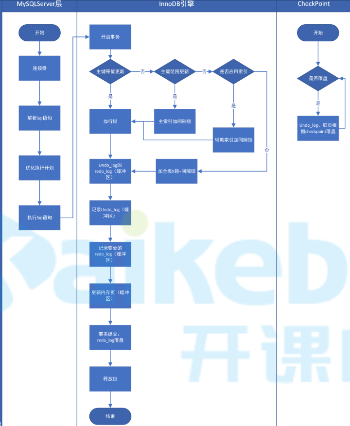 

+ 修改时不存在加`表锁`，是把所有行加行锁+间隙锁，效果与加表锁相同

### 锁分类

#### 功能

+ `LBCC`中的锁按功能进行分类，分为`共享锁`、`排他锁`，这只是两个概念并不是实际的锁

  + 基于`共享锁`概念的实际的锁：读锁、行级共享锁
  + 基于`排他锁`概念的实际的锁：写锁、行级排他锁

+ 兼容性

  共享与共享兼容，排他与任何锁互斥

  |      | 读锁 | 写锁 |
  | :--: | :--: | :--: |
  | 读锁 | 兼容 |  /   |
  | 写锁 | 互斥 | 互斥 |

#### 级别

##### 全局锁

+ 锁住整个数据库

+ 命令

  ```sql
  flush tables with read lock;
  ```

+ 备份数据库时，可以加上`--single-transaction`通过`MVCC`的`read view`功能来保证数据的一致性，避免通过全局锁保证一致性

##### 表级锁

###### 读(S)写(X)锁

+ 表级锁

+ `MySqlServer`层实现

+ 读锁就是表级共享锁

  ```sql
  lock table t read;
  ```

+ 写锁就是表级排他锁

  ```sql
  lock table t write;
  ```

  加上写锁普通读也不允许了

+ 查看表锁情况

  ```sql
  show open tables;
  ```

+ 删除表锁

  ```sql
  unlock tables;
  ```

+ 仅与表级锁发生作用，如意向锁

###### 元数据锁

+ `MySqlServer`层实现

+ 元数据锁也分`共享锁`和`排他锁`，但是锁住的是表的元数据
+ 开启一个事务后，对表进行增删改查操作时，自动为表加上元数据共享锁；当对表结构进行修改时，自动加上元数据排他锁
+ 作用就是事务中对数据进行操作时不允许修改表结构
+ 元数据锁作用于元数据，因为只有元数据锁作用于元数据，所以他只跟自己产生作用

###### 意向锁

+ 表级锁

+ `InnoDB`实现

+ 意向锁分为`意向共享锁（IS）`，`意向排他锁（IX）`

+ 作用

  + 如果没有意向锁，当使用读写锁时，需要逐行判断表中是否存在使用了行级锁的记录，存在时不能随意上锁
  + 为了提高性能，表中任意记录上锁时，该表加上意向锁；这样使用读写锁时不需要逐行判断了

+ 意向锁底层使用计数器实现

+ 兼容性

  + 意向锁只与[读(S)写(X)锁](#读(S)写(X)锁)发生作用
  + 兼容性2个原则：
    + 意向锁之间都兼容
    + 剩下的共享与共享兼容，排他与任何锁互斥

  |            | 意向共享锁 | 意向排他锁 | 读锁 | 写锁 |
  | :--------: | :--------: | :--------: | :--: | :--: |
  | 意向共享锁 |    兼容    |     /      |  /   |  /   |
  | 意向排他锁 |    兼容    |    兼容    |  /   |  /   |
  |    读锁    |    兼容    |    互斥    | 兼容 |  /   |
  |    写锁    |    互斥    |    互斥    | 互斥 | 互斥 |


###### 自增锁

+ `MySqlServer`层实现

+ 插入时，生成自增id列需要上锁，避免id重复

##### 行级锁

+ 只有`InnoDB`支持，`InnoDB`实现

+ 通过给索引上的索引项加锁实现

  这个特性决定了，只有通过索引检索的数据才能使用行级锁，否则只能所有记录加上行级锁（效果类似表锁）

+ `insert`、`update`、`delete`自动加锁，非`Serializable`级别下`select`需要手动加锁

###### 记录所

+ 加在索引项上（包括聚簇索引和辅助索引），锁住这行记录

+ 分为`共享锁`、`排他锁`

+ 用于保证锁住期间其他事务不可以修改该行数据

+ `select`可以手动加记录锁

  + `共享锁`

    ```sql
    select ... lock in share mode
    ```

  + `排他锁`

    ```sql
    select ... for update
    ```

###### 间隙锁

+ 一种区间锁，加在索引上，锁住1个索引区间（开区间）
+ 用于保证在此期间不会插入记录导致幻读
+ 间隙锁是基于现有索引项加锁的，如：
  + 当前存在索引项`3,6,10`
  + 条件为`=4`时，因为找不到`4`，则会加上`(3,6)`的间隙锁
  + 条件为`>4`时，则会在`(3,6](6,10]`上分别加上临键锁，`(10,+∞)`上加上间隙锁

###### 临键锁

+ 一种区间锁
+ 就是`记录所`+`间隙锁`（左开右闭）

###### 插入意向锁

+ 插入意向锁是一种区间锁，并不是意向锁
+ 执行`insert`时自动产生所属区间的插入意向锁，并获取插入行上的排他锁
+ 插入意向锁不会阻止任何锁
+ 假设有一个记录索引包含键值4和7，不同的事务分别插入5和6，每个事务都会产生一个加在4-7之间的插入意向锁，获取在插入行上的排它锁，但是不会被互相锁住，因为数据行并不冲突

### 增删改查时加锁情况

#### update、delete

+ 所属表加上元数据排他锁
+ 所属表加上意向排他锁
+ 索引加上行锁（排他锁）

#### select

+ 普通读
  + 所属表加上元数据共享锁
+ `lock in share mode`
  + 所属表加上元数据共享锁
  + 所属表加上意向共享锁
  + 索引加上行锁（共享锁）
+ `for update`
  + 所属表加上元数据排他锁
  + 所属表加上意向排他锁
  + 索引加上行锁（排他锁）

#### insert

+ 所属表加上元数据排他锁
+ 所属表加上意向排他锁
+ 插入意向锁
+ 自增锁
+ 插入行加上行锁（排他锁）

### 行锁加锁规则

#### 规则

+ 加锁的基本单位是next-key lock。

+ 查找过程中访问到的满足条件的对象才会加锁。

+ 索引上的等值查询，给唯一索引加锁的时候，next-key lock退化为行锁。

+ 索引上的等值查询，向右遍历时且最后一个值不满足等值条件的时候，next-key lock退化为间隙锁。

#### 详解

+ 主键索引查询
  + 等值查询
    + 命中纪录，聚集索引加记录锁
    + 未命中，聚集索引加间隙锁；
  + 范围查询
    + 未命中，聚集索引加间隙锁
    + 命中，聚集索引加临键锁+间隙锁+记录锁
+ 辅助索引查询
  + 等值查询
    + 未命中，辅助索引加间隙锁
    + 命中
      + 唯一索引
        + 辅助索引加记录锁
        + 聚集索引加行锁
      + 非唯一索引
        + 辅助索引加记录锁，索引项两侧加间隙锁
        + 聚集索引加行锁
  + 范围查询
    + 未命中，辅助索引加间隙锁
    + 命中
      + 辅助索引加临键锁+间隙锁+记录锁
      + 聚集索引加行锁

### 查看锁状态

+ 执行如下命令查看全局锁状态

  ```
   show status like 'innodb_row_lock%';
  ```

  查询结果参数如下：

  ```
  - Innodb_row_lock_current_waits：当前正在等待锁定的数量； 
  - Innodb_row_lock_time：从系统启动到现在锁定总时间长度； 
  - Innodb_row_lock_time_avg：每次等待所花平均时间； 
  - Innodb_row_lock_time_max：从系统启动到现在等待最常的一次所花的时间； 
  - Innodb_row_lock_waits：系统启动后到现在总共等待的次数
  ```

+ 查看处于事务、锁状态中的sql语句

  ```
  select * from information_schema.innodb_locks;
  select * from information_schema.innodb_lock_waits;
  select * from information_schema.innodb_trx;
  ```

### 死锁

+ 当多个事务互相要获取对方已经锁住的资源时发生死锁

+ 例

  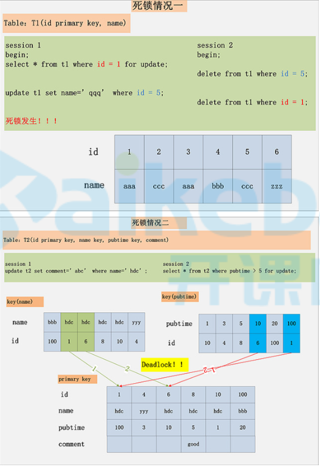 

+ 避免

  + 尽量保持表的操作顺序一致
  + 尽量使用轻量级事务，不要一个事务中操作过多资源
  + 尽量让事务快点执行完

### 整合隔离级别

+ 性能

  + 写操作一定使用排他锁，所以写操作一定是串行执行的

  + 读

    + 当`select`不加锁时

      + 因为只有一份数据，事务中对数据的修改一定直接在这份数据上修改，其他事务就可以读到未提交的数据，脏读、不可重复读、幻读、丢失更新等问题都出现了，**这就是RU的实现原理**
      + 并行：读读、读写、写读
      + 串行：写写

    + 当`select`加`意向共享锁`时

      + 可以避免哪些问题
        + 脏读：事务在修改数据的过程中，不允许其他事务来读，从根本上避免了脏读
        + 幻读：范围查询时会使用`Next-Key Locks`将范围锁住，不允许插入，避免幻读
        + 不可重复读：读的过程中不允许其他事务来写，根本上避免了不可重复读
      + 并行：读读
      + 串行：读写、写读、写写
      + **这就是`Serializable`实现原理**

    + 当`select`加`意向排他锁`时

      相比`select`加`意向共享锁`，读读也变成串行执行，能避免一个事务读取到正准备进行修改的数据

      非特殊场景，不建议使用

# 索引

## 条件过滤

+ 存储引擎层只会对用到索引的条件进行筛选，没有用到索引的字段的筛选工作是交给`MySqlServer`层进行筛选的

+ 例

  在`a`字段创建索引

  ```sql
  select a,b,c from t where a = 1 and d = 2;
  ```

  存储引擎层会使用`a`字段索引进行筛选，然后将查询结果交给`MySqlServer`层

  `MySqlServer`层再对`d=2`这个没有用到索引的条件进行筛选

+ `explain`时出现`Using where`表示在`MySqlServer`层进行过滤的，其他的是在存储引擎层通过索引树进行过滤的

## 索引数据结构

### 索引要求

索引得数据结构必须满足如下两个要求：

+ 等值查询
+ 范围查询

### hash索引

+ 能够满足等值查询，并且效率高于B+Tree
+ 无法满足范围查询

### B+Tree

+ 同时满足等值查询和范围查询

## MySql索引

### MyISAM

+ 聚集索引使用`B+Tree`结构，叶子节点存储数据地址
+ 辅助索引使用`B+Tree`结构，叶子节点存储数据地址

### InnoDB

+ 聚集索引使用`B+Tree`结构，叶子节点存储数据
+ 辅助索引使用`B+Tree`结构，叶子节点存储数据主键id（需要进行回表查询）

## 组合索引

+ 创建索引时尽量使用组合索引

+ 存储结构

  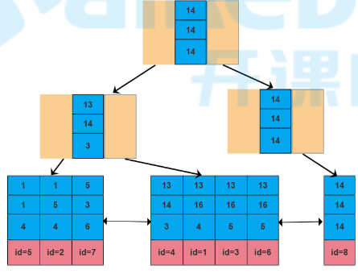 

+ 组合索引有2个好处

  + 当查询条件中涉及多个索引列时
    + 如果单独为每个字段创建索引，`InnoDB`只会选择效率最高的1个索引使用
    + 如果创建组合索引，`InnoDB`会按照组合索引中字段顺序依次进行检索；效率更高
  + 增删改数据时，如果单独为每个字段创建索引，会产生多个索引树；如果创建组合索引，只会产生1个索引树；维护多个索引相对于维护一个索引，成本更高

+ 最左前缀匹配原则

  + 匹配时，按照组合索引创建顺序，前面的字段走了索引，后面的字段才会走索引，任何一个字段无法使用索引，则会造成索引中断，后面的字段都无法使用索引了

  + 索引中断

    组合索引匹配时，任意一个字段只有匹配到1个值时，后面的字段才会使用索引

    哪些情况会造成索引中断：

    + 没有使用组合索引中某字段作为条件（当前列索引已经失效）
    + 索引列上做计算（当前列索引已经失效）
    + 范围查询：大于、小于、`between`、`like`（当前列使用索引，后面的索引失效）

## 覆盖索引

+ 索引树中包含了`条件中`和`select中`的所有字段时，`InnoDB`直接使用该索引树进行查询，并直接使用索引树中数据进行返回，`避免了回表操作`，这种现象称为覆盖索引

+ 案例

  + 背景

    在`a,b,c`字段上创建组合索引

  + 案例1

    ```sql
    select a,b,c,id from  t_multiple_index where a=13 and b=16;
    ```

    因为组合索引树中包含了`a,b,c,id`字段，所以没必要进行回表操作，查询完直接使用索引树中字段返回

  + 案例2

    ```sql
    select a,b,c,id from  t_multiple_index where b=16;
    ```

    该语句表面上是无法使用组合索引的，但是因为组合索引树中包含了涉及到的所有列，会使用该索引树进行全表扫描，这样可以减少磁盘IO次数

## 索引条件下推ICP

+ 概念

  + 组合索引中存在索引中断时，存储引擎将数据返给`MySqlServer`层对被中断的索引字段进行筛选
  + 启用`索引条件下推`后，存储引擎层会直接对被中断的索引字段进行筛选
  + 因为是将对被中断的索引字段进行筛选步骤，下推到了存储引擎层处理，所以叫`索引条件下推`
  + 好处就是减少了存储引擎层磁盘IO次数

+ 开启关闭

  + 查看状态

    ```sh
    mysql> show VARIABLES like 'optimizer_switch';
    ```

  + 启用禁用

    ```sh
    # 默认开启
    # 常用设置：保持默认
    mysql> SET optimizer_switch = 'index_condition_pushdown=off';
    ```

+ 执行计划中`extra`列包含`Using index condition`，表示使用了`索引条件下推`

+ 例

  `a,b,c`创建组合索引

  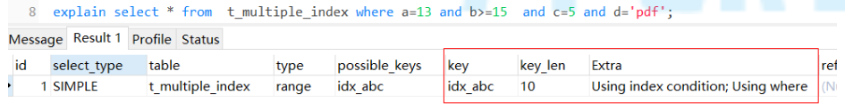 

## Exists

+ 用法

  + 如果子查询中存在关联的记录，则返回外层查询中对应的记录

  + 相当于`boolean`条件

  + 例

    ```sql
    -- 如果 p_user 中存在关联记录，则返回 p_user_2 表中对应记录
    select * from p_user_2 where [not] EXISTS (select id from p_user where id = p_user_2.id )
    ```

+ `exists`与`in`

  两者什么时候使用的原则是：大表可以走索引

  + 当子查询为大表时，使用`exists`，因为使用`exists`时，对于外层查询来说，该条件走不了索引
  + 当子查询为小表时，使用`in`，因为子查询不需要使用索引，尽量让外层查询使用索引
  + 两张表数据量差不多时，这俩没啥区别

## 索引优化

### =、!=

+ 等值查询走索引
+ `!=`不走索引

### in、not in

+ in
  + 优化器会根据表中数据量和`in`中可选值个数自动进行判断。如果能过滤掉大部分数据，会走索引；否则不会走
  + 大胆的用，但是可以使用`exists`进行优化

+ not in

  不走索引

### is null、is not null

+ is null
  + 走索引
+ is not null
  + 不走索引

### or

+ or得条件如果属于同一张表，则走索引；否则不走索引

## 索引总结

```
全值匹配我最爱，最左前缀要遵守；
带头大哥不能死，中间兄弟不能断；
索引列上不计算，范围之后全失效；
Like百分写最右，覆盖索引不写星；
不等空值还有OR，索引失效要少用.（这句不准确，仅作参考）
```

+ 隐式类型转换属于计算，会造成索引失效
+ 必要的情况下，可以将select中字段放入到组合索引树中，这样会用到覆盖索引，避免回表
+ 尽量使用组合索引，避免每个字段单独创建索引
+ 记录很少的表不要创建索引（避免存储开销）
+ 索引不能过多
  + 空间浪费
  + 时间浪费
    + 更新时维护索引树的时间开销
    + 增加优化器选择时间
+ 最终是否走不走索引，看的是索引字段的区分度，如果索引字段不能帮助筛选掉大部分数据，就没必要走索引了
+ 主键建议使用自增长长整型，主键长度长会导致1个索引页中存储得节点更少，增加磁盘IO
