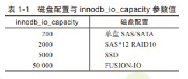

> + 课程使用`mysql5.7.3`
> + `mysql`配置文件中不区分`-`和`_`

# MySql安装

+ docker

  ```sh
  #!/bin/bash
  
  # /usr/local/docker-srv/mysql5.7/logs 需要修改权限为 777
  
  docker run -d --name mysql5.7 \
   --log-opt max-size=10m \
   -v /etc/localtime:/etc/localtime:ro \
   -v /etc/timezone:/etc/timezone:ro \
   -p 3306:3306 \
   --privileged=true \
   -v /usr/local/docker-srv/mysql5.7/conf:/etc/mysql \
   -v /usr/local/docker-srv/mysql5.7/logs:/logs \
   -v /usr/local/docker-srv/mysql5.7/data:/var/lib/mysql \
   -e MYSQL_ROOT_PASSWORD=943397 \
   mysql:5.7
  ```

  

# MySql文件结构

> + `mysql`数据分为日志文件和数据文件，通常放在`var/lib/mysql`目录下

## 日志文件

> + 日志文件都是`顺序IO`的，追加的形式按顺序写
> + 日志相关配置可以通过` show variables like '%log%';`查看

### 错误日志

+ 作用：记录运行过程中遇到的所有`错误、警告、通知`等信息,以及每次`启动和关闭`的详细信息。

+ 配置

  ```sh
  # 作用：错误日志存储位置
  # 默认值：stderr，输出到控制台
  # 常用配置：一般都需要指定1个输出位置
  log_error=/var/log/mysqld.log
  # 作用：将哪些级别的警告输出到错误日志，默认2；0表示不输出警告
  # 默认值：2
  # 常用配置：使用默认值
  log_warnings=2
  # 作用：将哪些信息输出到错误日志：1：错误；2：错误和警告；3：错误、警告和通知
  # 默认值：3
  # 常用配置：使用默认值
  log_error_verbosity=3
  ```

### 二进制日志

+ 作用：记录数据库实例的所有修改语句

+ 配置

  ```sh
  # 作用：指定服务id
  # 默认值：0
  # 说明：主从复制功能需要为每个mysql实例指定不同的server-id；为0时无法启用主从复制和binlog日志功能
  server-id=1 
  # 作用：启用并配置binlog文件的basename
  # 默认：OFF
  # 常用配置：需要使用`binlog`文件时再开启，一般需要将数据实时同步给其他服务时需要开启
  log-bin=mysql-bin
  ```

+ 说明：启用`binlog`后，会在`/var/lib/mysql`下生成如下文件：

  + `{basename.index}`：二进制索引文件，用于为所有二进制文件建立索引
  + `{basename}.000001`：二进制文件，真正的内容

### 通用查询日志

+ 作用：记录用户所有操作

+ 配置

  ```sh
  # 是否启用通用日志
  # 默认值 OFF；可选值 ON|OFF
  # 常用配置：关闭；开启后产生大量不必要的磁盘IO，影响性能
  general_log=OFF
  # 通用日志文件名
  # 默认值：/{datadir}/{hostname}.log
  general_log_file=/var/lib/mysql/dc3757bde5bd.log
  ```

### 慢查询日志

+ 作用：记录查询时间过长得sql

+ 配置

  ```sh
  # 是否启用慢查询
  # 默认值：OFF；可选值 ON|OFF
  # 常用配置：
  slow_query_log=ON
  # 慢查询阈值，单位秒
  # 默认10
  long_query_time=10
  # 慢查询日志文件名
  # 默认值：/{datadir}/{hostname}-slow.log
  # 如果指定文件名没有指定目录，默认目录为{datadir}
  slow_query_log_file=/var/lib/mysql/dc3757bde5bd-slow.log
  ```


## 数据文件

> 数据文件是`随机IO`的，需要在文件中需要的位置插入、修改数据

### InnoDB

+ `ib_buffer_pool`

  内存中缓冲池得持久化文件

  持久化的目的是数据库重启时可以直接加载上次使用的缓冲池，避免预热过程

+ `ib_logfile0`、`ib_logfile1`

  重做日志文件

+ `ibdata1`

  系统表空间文件

+ 库文件

  > + 每个`database`对于1个与数据库同名的目录，目录下存放该数据库相关文件
  > + 下属文件名中的`*`均为表名

  + `*.frm`

    表结构定义信息

  + `*.ibd`

    表中索引和数据

  + `db.opt`

    数据库属性信息，默认字符集等

### MyIsam

+ `*.frm`

  表结构定义信息

+ `*.myd`

  表中数据

+ `*.myi`

  表中索引

# MySql逻辑架构

 

 

+ 客户端

  各种语言实现的客户端连接器，如JDBC

+ `MySQL Server`层

  + `Management Serveices & Utilities`

    系统管理和控制工具

  + `Connaction Pool`

    + 连接池
    + 用于与客户端建立连接，身份认证，获取权限
    + 通过`show processlist;`命令可以查看连接池中的连接
    + `wait_timeout`参数控制连接超时时间，默认8小时

  + `SQL Interface`

    + `SQL`接口
    + 用于接收和返回数据

  + `Parser`

    + 解析器
    + 用于对sql进行验证和解析，大致流程如下：
      + 词法分析，先将语句拆解成各个部分
      + 语法分析，分析语法是否合法
      + 创建解析树并校验权限

  + `Optimizer`

    + 查询优化器
    + 对查询语句进行优化
      + 多个可用索引时选择1个效率最高的
      + 多表关联时整理表的关联顺序
    + 生成多个执行计划，选择效率最高的执行
    + `explain`查看的执行计划，就是查询优化器生成的

  + 执行器

    + 调用存储引擎接口进行查询
    + 校验权限
    
  + `Caches & Buffers`

    + 缓存和缓冲区
    + 将查询语句的hash值作为key，将查询结果进行缓冲，数据变更时自动失效
    + 使用效果并不理想，mysql8.0中已弃用，想用可以自己用二级缓存、redis等实现

+ 存储引擎层

  + MySql的存储引擎是可插拔的，如：MyIsam、InnoDB、Memory
  + MySql可以为每张表指定不同的引擎

+ 文件系统

  就是存储在磁盘上的各种文件，参见[文件结构](# 文件结构) 

# InnoDB引擎

## InnoDB架构图

 

## 内存结构

### 缓冲池

+ 用户缓存磁盘上的`数据页`和`索引页`
+ 每页大小为16K
+ 通过`LRU`算法淘汰不常使用的数据页
+ 缓冲池会持久化到磁盘上，用于避免预热过程，对应文件为`ib_buffer_pool`
+ `buffer pool`实例大小 = `buffer pool`总大小（`innodb_buffer_pool_size`） / `buffer pool`实例数（`innodb_buffer_pool_instances`）
+ `buffer pool`中缓存了多种类型的数据页，类型如下：
  + 索引页
  + 数据页
  + 回滚日志
  + 修改缓冲区
  + 自适应哈希索引
  + 锁信息
  + 数据字典

#### 修改缓冲区

+ 对辅助索引的更新操作缓存到修改缓冲区中，异步进行辅助索引的更新
+ 内存中放不下时，会将数据持久化到系统表空间文件中
+ 一开始只记录插入操作，也叫`插入缓冲区`，后来也记录修改删除操作，所以更名为`修改缓冲区`

#### 自适应哈希索引

+ 了解
+ 完全由`mysql`控制的哈希结构索引
+ 如果1个或多个索引组合使用的次数足够多，根据索引信息生成1个key，value指向数据页，创建1个哈希结构的索引；用于加快查询效率
+ 参考资料：https://juejin.cn/post/6847902217270198286

### 日志缓冲区

+ 也叫`重做日志缓冲区`，专门缓存`redo log`日志的
+ `redo log`内容先写到`日志缓冲区`，`commit`时再刷新到磁盘文件中

## 磁盘结构

### 逻辑存储结构

 

+ 1个区=1MB
+ 1页=16KB

### 内容

#### 系统表空间

> + 整个数据库服务器只有一份
> + 对应`ibdata1`文件

+ 数据字典

+ 双写缓冲区

  参见[脏页罗盘流程](# 脏页罗盘流程)

+ 修改缓冲区

  内存中修改缓冲区放不下时，会将数据持久化到系统表空间文件中

+ 回滚日志

  参见[回滚日志](# 回滚日志) 

#### 回滚表空间

+ 了解
+ 整个数据库服务器只有一份，可以分开多个文件存储
+ `Undo Logs`默认存储在系统表空间文件中，也可以单独存储在`Undo Tablespaces`中

#### 用户表空间

+ 每张表对应1个用户表空间
+ 对应`*.ibd`文件
+ 用于存储该表的数据和所有的索引

#### 通用表空间

+ 了解
+ 同样对应`*.ibd`文件
+ 通过`create tablespace ...`命令可以创建通用表空间文件，我们再创建表的时候可以指定使用哪个通用表空间文件存储这张表

#### 临时表空间

+ 了解
+ 对应`ibtmp1`文件
+ 查询时创建的临时表会存储到临时表空间中
+ 持久化的目的是避免预热过程

#### 重做日志

+ 默认两个文件循环写入，对应文件：`ib_logfile0`、`ib_logfile1`
+ 参数
  + `innodb_log_file_size`参数可以用来指定`redo log`日志文件每个文件的大小，默认50MB
  + `innodb_log_files_in_group`参数可以指定文件组由几个文件组成，默认2

## redo log

### 内容

`redo log`中主要包括2部分内容：

+ 事务中生成新的`undo log`版本的记录
+ 事务中的修改操作记录

### 执行流程

+ 开启事务

+ 将记录`undo log`的操作记录到`redo_log`

+ 记录`undo log`

+ 所有修改操作，直接更新缓冲池中数据页，并将修改操作记录到`log buffer`中

+ 修改内存中数据页

+ 提交

  + 将当前事务的`提交动作`记录到`log buffer`中
  
  + 提交时不直接修改硬盘上的数据（随机IO消耗性能），将`log buffer`中记录持久化到磁盘上的`redo_log`文件中，持久化成功才返回`commit`成功；后续异步修改磁盘上的数据，这样既避免数据的丢失，又提高了修改数据的性能

### redolog落盘时机

- 当`redo log buffer`的数据超过`redo log buffer`容量的一半时

- 事务提交的时候

  通过`innodb_flush_log_at_trx_commit`参数控制，默认1

  + 1：等待主线程每秒写入1次
  + 2：提交时立即写入磁盘
  + 3：提交时立即写入文件系统缓存，由操作系统决定何时写入磁盘

- 每秒一次，Master线程会将`redo log buffer`的数据写出，这个刷出跟事务提交无关，彼此是独立的

- 服务正常关闭的时候

- `checkpoint`的时候

### 数据恢复

+ 对于还没来得及落盘的脏页数据，可以通过重新执行`redo log`中操作进行恢复
+ 上面恢复的数据中可能存在未提交的数据，需要通过`undo log`回滚

#### 未提交的数据落盘

+ [redolog落盘时机](#redolog落盘时机)中除了`commit`时的落盘，均会造成未提交的`redo_log`落盘
+ 因为`log buffer`是一大块内存全局顺序写，当一个事务提交时，他前面还没提交的日志也会被落盘
+ 因为`log buffer`是一大块内存全局顺序写，需要回滚的事务无法再将`redo log`记录删掉，落盘发生时这部分应该回滚的记录也会被落盘

#### 解决

+ 由于生成`undo log`的操作被记录在`redo log`中，`redo log`中如果发现事务尚未提交，可以在`undo log`中找到

## 脏页落盘

+ 由于修改数据时只修改了缓冲池中数据页，并且将`redo log`写入磁盘了，并没有更新磁盘中数据页，所以会存在内存中数据页和磁盘中数据也不一致的情况，磁盘上没来得及更新的数据页就称之为脏页
+ 脏页落盘就是将内存中数据页同步到磁盘中数据页上
+ 脏页落盘是通过`checkpoint（检查点）`机制进行落盘

### CheckPoint

`checkpoint`分为2类：

+ `sharp checkpoint`

  关闭数据库时全部落盘

+ `fuzzy checkpoint`

  在如下几个时机发生时进行部分落盘

  + `Master Thread Checkpoint`

    主线程每秒或每10秒进行一次异步落盘

  + `FLUSH_LRU_LIST Checkpoint`

    当缓冲池中空闲页不足时，通过`LRU`算法淘汰数据也，被淘汰的数据页中的存在脏页时进行落盘

  + `Async/Sync Flush Checkpoint`

    redolog快写满时需要执行。

    + 当redolog的使用量大于redolog总容量的75%小于90%时执行异步落盘。
    + 当redolog的使用量大于redolog总容量的90%时执行同步落盘

  + `Dirty Page too much Checkpoint`

    `buffer pool`中脏页占75%时执行异步落盘

### 双写缓冲区（脏页罗盘流程）

+ 将脏页写入到内存中`双写缓冲区`
+ 将内存中双写缓冲区写入到系统表空间的双写缓冲区
+ 将内存中双写缓冲区写入到用户表空间

> 双写保证落盘过程中不会造成数据页的损坏


# 事务

## 事务执行流程

 

+ `undo_log`的`redo_log`：修改数据前，需要先`当前读`要修改的记录，并生成`undo log`记录，这步操作是需要记录在`redo log`中的（参见[undo_log](# undo_log)）

## 事务介绍

### 事务特性（ACID）

+ 原子性（`atomicty`）

  整个事务要么全成功。要么全失败

+ 一致性（`consistency`）

  事务开始前和结束后，数据完整性不要被破坏（因为事务部分提交导致出现错误数据）

+ 隔离性（`isolation`）

  不同事务之间不能相互影响

  隔离性的强弱与事务的性能相关，隔离级别越高性能越差

+ 持久性（`durability`）

  事务提交后数据永久有效

### 隔离级别

#### 切换隔离级别

```mysql
# 查看当前事务级别：
SELECT @@tx_isolation;
# 设置read uncommitted级别：
set session transaction isolation level read uncommitted;
# 设置read committed级别：
set session transaction isolation level read committed;
# 设置repeatable read级别：
set session transaction isolation level repeatable read;
# 设置serializable级别：
set session transaction isolation level serializable;
```

#### 事务之间存在哪些影响

+ 脏读

  + 一个事务读取到另一个事务中还`未提交`的数据

  + 通过`MVCC`解决，每次获取最新得`read view`

+ 不可重复读

  + 因其他事务提交的`修改和删除`，一个事务中两次读取同一条数据的结果不一致
  + 解决
    + `RR`级别：通过`MVCC`解决，第一次获取`read view`时缓存起来，后续使用缓存的`read view`；
    + `Serializable`级别：读写串行执行，不存在不可重复读

+ 幻读

  + 因其他事务提交的`新增`，一个事务中两次读取到的数据不一致
  + 解决
    + `RR`级别
      
      + 默认通过`MVCC`解决了`快照读`状态下的幻读，`当前读`状态下的幻读问题还存在
      
         
      
      + `当前读`本身就要求读到最新已提交数据，还想避免幻读，只能通过锁保证事务执行过程中不允许插入
      
        可以`select`时使用共享锁或排他锁解决（原理是`间隙锁`）
      
    + `Serializable`级别
    
      读写串行执行，不存在幻读

+ 丢失更新

  + 两个事务同时执行时，后提交事务`覆盖`了先提交的事务提交的数据
  + 解决
    + `RC`、`RR`：手动通过悲观锁或乐观锁解决
    + `Serializable`：`select`自动加`意向共享锁`，不存在丢失更新

#### 隔离级别

+ 读未提交（RU）

  未解决任何问题

+ 读已提交（RC）

  + 通过`MVCC`解决脏读

  + `oracle`默认
  + 没有间隙锁

+ 可重复读（RR）

  + `mysql`默认

  + 加入间隙锁

  + 通过`MVCC`解决

    + 脏读

    + 不可重复读

    + 幻读

      解决了`快照读`状态下的幻读，`当前读`状态下的幻读问题还存在
      
      `当前读`下的幻读可以`select`时使用共享锁或排他锁解决（原理是`间隙锁`）

+ 串行化（`Serializable`）

  解决所有问题

## 事务实现方案

### 术语

+ 快照读

  + 不加锁的`select`就是快照读
  + 读取到的是当前事务的可见版本数据

+ 当前读

  + 读取数据同时加上共享锁或排他锁

  + 读取到的一定是最新版本数据

    这里不用解释为：最新版本`已提交`数据；因为未提交的数据上了排他锁，压根读不到

  + 哪些操作使用当前读

    + `select`+共享锁

      ```sql
      # 所有版本
      select * from test lock in share mode
      # 8.0
      select * from test for share
      ```
  
    + `select`+排他锁
    
      ```sql
      select * from test lock in share mode
      ```

    + `insert`、`update`、`delete`操作中都隐式包含了一步当前读

### 概述

+ `InnoDB`使用`LBCC`+ `MVCC`实现的事务

  所有`insert`、`update`、`delete`操作自动使用排他锁

  + RU

    + `LBCC`方案，`select`不加锁
    + 读写同一份数据，因为写操作使用排他锁，写与写串行执行

  + RC

    `LBCC`+`MVCC`方案，

    + `select`不加锁
    + 没有`间隙锁`
    + 每次读取都使用最新的`read view`

  + RR

    `LBCC`+`MVCC`方案，

    + `select`不加锁
    + 有`间隙锁`
    + 第一次读取时将`read view`缓存起来，后续读取时使用缓存的`read view`

  + `Serializable`

    `LBCC`方案，`select`自动加上`意向共享锁`


## MVCC

+ 多版本并发控制（`Multi Version Concurrency Control`）
+ 只能在`读已提交`和`可重复读`两个级别使用
+ 为每个事务中读写的数据行生成独立的快照版数据，读取时只读取自己可见版本数据
+ `InnoDB`中，使用`undo_log`和`read view`实现`MVCC`

### undo_log

+ 隐藏列

  `InnoDB`中的记录行有3个隐藏列

  + `RowID`：默认主键id，没有主键时自动生成
  + `事务ID`：每个事务的ID编号
  + `回滚指针`：指向上一版本的指针

+ `update undo log`

   

  + 每当有新事务对某行数据进行修改时，将`内存中数据行`向后串一下，移入`Undo Log`,并将原来的`内存中数据行`复制一份作为新的`内存中数据行`，新的`内存中数据行`：`RowID`保持不变；`事务ID`修改为当前事务ID；`回滚指针`指向原来的`内存中数据行`
  + `update undo log`是指执行`update`、`delete`操作时产生的`undo log`
  + 事务提交后，`undo log`中旧版本不能立即删除，因为还有其他事务需要读取（参见`不可重复读`），需要后续执行`purge`操作进行回收
    + 猜测是没有任何1个未提交事务的事务ID直接大于某个事务的时，这个事务就可以删除了
    + 8 > 5 > 2；则8直接大于5，间接大于2

+ `insert undo log`

  + 事务中`insert`的数据本身就对其他事务不可见，提交后可以直接删除掉`insert undo log`记录
  + 这块不理解，本来就没有，哪来的老版本，何谈删除
  
+ 落盘时机

  + 跟随`checkpoint`落盘

  + 提交时落盘
  
    > 参考资料：http://mlwiki.org/index.php/Undo/Redo_Logging
    >
    >  
  
+ 持久化

  数据恢复时，对未提交的落盘数据进行回滚

  参见：[数据恢复](#数据恢复) 

### read view

+ `read view`就是从多个版本中筛选出来的最终可见版本

+ 每次执行`select`时生成`read view`

+ 筛选规则

  + mysql维护了如下几个变量：

    + `m_ids`：全局未提交的事务id列表
    + `m_up_limit_id`：`m_ids`中最小的事务id
    + `m_low_limit_id`：生成`read view`时，系统要产生的下一个事务id
    + `m_creator_trx_id`：当前事务id

  + 遍历版本链，用被访问版本的事务id与上述值比较：

    + 被访问版本的事务id`小于` `m_up_limit_id`时，该版本可见

      已提交版本

    + 被访问版本的事务id`等于` `m_creator_trx_id`时，该版本可见

      当前事务版本

    + 被访问版本的事务id在`m_up_limit_id`和`m_low_limit_id`之间时

      + 在`m_ids`中，不可见

        未提交版本

      + 不在`m_ids`中，可见

        已提交版本

    + 被访问版本的事务id`大于等于` `m_low_limit_id`时，该版本不可见

      生成`read view`时，还没有产生这个版本

  + 遍历结束后，找到事务ID最大的可见版本就是最终的`read view`

+ `RC`和`RR`在不可重复读问题上的区别在于

  + `RC`每次查询获取最新的`read view`
  + `RR`第一次查询将`read view`缓存，后续使用缓存起来的`read view`

### 总结

+ 相比`LBCC`中`select`加`意向共享锁`的方案，提升了读写、写读操作的性能，也可以通过快照的方式解决了不可重复读的问题

+ 但同时引入了另一个问题：

  某字段原本是1，两个事务同时读取并进行加1操作，正确结果应该是3，但是实际结果可能是2

  这个问题只能通过`select`加`意向共享锁`解决

## LBCC

+ 基于锁的并发控制（`Lock Based Concurrency Control`）
+ 资料
  + https://www.cnblogs.com/rjzheng/p/9950951.html
  + https://dev.mysql.com/doc/refman/5.7/en/innodb-locking.html#innodb-intention-locks

### update流程

 

+ 修改时不存在加`表锁`，是把所有行加行锁+间隙锁，效果与加表锁相同

### 锁分类

#### 功能

+ `LBCC`中的锁按功能进行分类，分为`共享锁`、`排他锁`，这只是两个概念并不是实际的锁

  + 基于`共享锁`概念的实际的锁：读锁、行级共享锁
  + 基于`排他锁`概念的实际的锁：写锁、行级排他锁

+ 兼容性

  共享与共享兼容，排他与任何锁互斥

  |      | 读锁 | 写锁 |
  | :--: | :--: | :--: |
  | 读锁 | 兼容 |  /   |
  | 写锁 | 互斥 | 互斥 |

#### 级别

##### 全局锁

+ 锁住整个数据库

+ 命令

  ```sql
  flush tables with read lock;
  ```

+ 备份数据库时，可以加上`--single-transaction`通过`MVCC`的`read view`功能来保证数据的一致性，避免通过全局锁保证一致性

##### 表级锁

###### 读(S)写(X)锁

+ 表级锁

+ `MySqlServer`层实现

+ 读锁就是表级共享锁

  ```sql
  lock table t read;
  ```

+ 写锁就是表级排他锁

  ```sql
  lock table t write;
  ```

  加上写锁普通读也不允许了

+ 查看表锁情况

  ```sql
  show open tables;
  ```

+ 删除表锁

  ```sql
  unlock tables;
  ```

+ 仅与表级锁发生作用，如意向锁

###### 元数据锁

+ `MySqlServer`层实现

+ 元数据锁也分`共享锁`和`排他锁`，但是锁住的是表的元数据
+ 开启一个事务后，对表进行增删改查操作时，自动为表加上元数据共享锁；当对表结构进行修改时，自动加上元数据排他锁
+ 作用就是事务中对数据进行操作时不允许修改表结构
+ 元数据锁作用于元数据，因为只有元数据锁作用于元数据，所以他只跟自己产生作用

###### 意向锁

+ 表级锁

+ `InnoDB`实现

+ 意向锁分为`意向共享锁（IS）`，`意向排他锁（IX）`

+ 作用

  + 如果没有意向锁，当使用读写锁时，需要逐行判断表中是否存在使用了行级锁的记录，存在时不能随意上锁
  + 为了提高性能，表中任意记录上锁时，该表加上意向锁；这样使用读写锁时不需要逐行判断了

+ 意向锁底层使用计数器实现

+ 兼容性

  + 意向锁只与[读(S)写(X)锁](#读(S)写(X)锁)发生作用
  + 兼容性2个原则：
    + 意向锁之间都兼容
    + 剩下的共享与共享兼容，排他与任何锁互斥

  |            | 意向共享锁 | 意向排他锁 | 读锁 | 写锁 |
  | :--------: | :--------: | :--------: | :--: | :--: |
  | 意向共享锁 |    兼容    |     /      |  /   |  /   |
  | 意向排他锁 |    兼容    |    兼容    |  /   |  /   |
  |    读锁    |    兼容    |    互斥    | 兼容 |  /   |
  |    写锁    |    互斥    |    互斥    | 互斥 | 互斥 |


###### 自增锁

+ `MySqlServer`层实现

+ 插入时，生成自增id列需要上锁，避免id重复

##### 行级锁

+ 只有`InnoDB`支持，`InnoDB`实现

+ 通过给索引上的索引项加锁实现

  这个特性决定了，只有通过索引检索的数据才能使用行级锁，否则只能所有记录加上行级锁（效果类似表锁）

+ `insert`、`update`、`delete`自动加锁，非`Serializable`级别下`select`需要手动加锁

###### 记录所

+ 加在索引项上（包括聚簇索引和辅助索引），锁住这行记录

+ 分为`共享锁`、`排他锁`

+ 用于保证锁住期间其他事务不可以修改该行数据

+ `select`可以手动加记录锁

  + `共享锁`

    ```sql
    select ... lock in share mode
    ```

  + `排他锁`

    ```sql
    select ... for update
    ```

###### 间隙锁

+ 一种区间锁，加在索引上，锁住1个索引区间（开区间）
+ 用于保证在此期间不会插入记录导致幻读
+ 间隙锁是基于现有索引项加锁的，如：
  + 当前存在索引项`3,6,10`
  + 条件为`=4`时，因为找不到`4`，则会加上`(3,6)`的间隙锁
  + 条件为`>4`时，则会在`(3,6](6,10]`上分别加上临键锁，`(10,+∞)`上加上间隙锁

###### 临键锁

+ 一种区间锁
+ 就是`记录所`+`间隙锁`（左开右闭）

###### 插入意向锁

+ 插入意向锁是一种区间锁，并不是意向锁
+ 执行`insert`时自动产生所属区间的插入意向锁，并获取插入行上的排他锁
+ 插入意向锁不会阻止任何锁
+ 假设有一个记录索引包含键值4和7，不同的事务分别插入5和6，每个事务都会产生一个加在4-7之间的插入意向锁，获取在插入行上的排它锁，但是不会被互相锁住，因为数据行并不冲突

### 增删改查时加锁情况

#### update、delete

+ 所属表加上元数据排他锁
+ 所属表加上意向排他锁
+ 索引加上行锁（排他锁）

#### select

+ 普通读
  + 所属表加上元数据共享锁
+ `lock in share mode`
  + 所属表加上元数据共享锁
  + 所属表加上意向共享锁
  + 索引加上行锁（共享锁）
+ `for update`
  + 所属表加上元数据排他锁
  + 所属表加上意向排他锁
  + 索引加上行锁（排他锁）

#### insert

+ 所属表加上元数据排他锁
+ 所属表加上意向排他锁
+ 插入意向锁
+ 自增锁
+ 插入行加上行锁（排他锁）

### 行锁加锁规则

#### 规则

+ 加锁的基本单位是next-key lock。

+ 查找过程中访问到的满足条件的对象才会加锁。

+ 索引上的等值查询，给唯一索引加锁的时候，next-key lock退化为行锁。

+ 索引上的等值查询，向右遍历时且最后一个值不满足等值条件的时候，next-key lock退化为间隙锁。

#### 详解

+ 主键索引查询
  + 等值查询
    + 命中纪录，聚集索引加记录锁
    + 未命中，聚集索引加间隙锁；
  + 范围查询
    + 未命中，聚集索引加间隙锁
    + 命中，聚集索引加临键锁+间隙锁+记录锁
+ 辅助索引查询
  + 等值查询
    + 未命中，辅助索引加间隙锁
    + 命中
      + 唯一索引
        + 辅助索引加记录锁
        + 聚集索引加行锁
      + 非唯一索引
        + 辅助索引加记录锁，索引项两侧加间隙锁
        + 聚集索引加行锁
  + 范围查询
    + 未命中，辅助索引加间隙锁
    + 命中
      + 辅助索引加临键锁+间隙锁+记录锁
      + 聚集索引加行锁

### 查看锁状态

+ 执行如下命令查看全局锁状态

  ```
   show status like 'innodb_row_lock%';
  ```

  查询结果参数如下：

  ```
  - Innodb_row_lock_current_waits：当前正在等待锁定的数量； 
  - Innodb_row_lock_time：从系统启动到现在锁定总时间长度； 
  - Innodb_row_lock_time_avg：每次等待所花平均时间； 
  - Innodb_row_lock_time_max：从系统启动到现在等待最常的一次所花的时间； 
  - Innodb_row_lock_waits：系统启动后到现在总共等待的次数
  ```

+ 查看处于事务、锁状态中的sql语句

  ```
  select * from information_schema.innodb_locks;
  select * from information_schema.innodb_lock_waits;
  select * from information_schema.innodb_trx;
  ```

### 死锁

+ 当多个事务互相要获取对方已经锁住的资源时发生死锁

+ 例

   

+ 避免

  + 尽量保持表的操作顺序一致
  + 尽量使用轻量级事务，不要一个事务中操作过多资源
  + 尽量让事务快点执行完

### 整合隔离级别

+ 性能

  + 写操作一定使用排他锁，所以写操作一定是串行执行的

  + 读

    + 当`select`不加锁时

      + 因为只有一份数据，事务中对数据的修改一定直接在这份数据上修改，其他事务就可以读到未提交的数据，脏读、不可重复读、幻读、丢失更新等问题都出现了，**这就是RU的实现原理**
      + 并行：读读、读写、写读
      + 串行：写写

    + 当`select`加`意向共享锁`时

      + 可以避免哪些问题
        + 脏读：事务在修改数据的过程中，不允许其他事务来读，从根本上避免了脏读
        + 幻读：范围查询时会使用`Next-Key Locks`将范围锁住，不允许插入，避免幻读
        + 不可重复读：读的过程中不允许其他事务来写，根本上避免了不可重复读
      + 并行：读读
      + 串行：读写、写读、写写
      + **这就是`Serializable`实现原理**

    + 当`select`加`意向排他锁`时

      相比`select`加`意向共享锁`，读读也变成串行执行，能避免一个事务读取到正准备进行修改的数据

      非特殊场景，不建议使用

# 索引

## 条件过滤

+ 存储引擎层只会对用到索引的条件进行筛选，没有用到索引的字段的筛选工作是交给`MySqlServer`层进行筛选的

+ 例

  在`a`字段创建索引

  ```sql
  select a,b,c from t where a = 1 and d = 2;
  ```

  存储引擎层会使用`a`字段索引进行筛选，然后将查询结果交给`MySqlServer`层

  `MySqlServer`层再对`d=2`这个没有用到索引的条件进行筛选


## 索引数据结构

### 索引要求

索引得数据结构必须满足如下两个要求：

+ 等值查询
+ 范围查询

### hash索引

+ 能够满足等值查询，并且效率高于B+Tree
+ 无法满足范围查询

### B+Tree

+ 同时满足等值查询和范围查询

## MySql索引

### MyISAM

+ 聚集索引使用`B+Tree`结构，叶子节点存储数据地址
+ 辅助索引使用`B+Tree`结构，叶子节点存储数据地址

### InnoDB

+ 聚集索引使用`B+Tree`结构，叶子节点存储数据
+ 辅助索引使用`B+Tree`结构，叶子节点存储数据主键id（需要进行回表查询）

## 组合索引

+ 创建索引时尽量使用组合索引

+ 存储结构

   

+ 组合索引有2个好处

  + 当查询条件中涉及多个索引列时
    + 如果单独为每个字段创建索引，`InnoDB`只会选择效率最高的1个索引使用
    + 如果创建组合索引，`InnoDB`会按照组合索引中字段顺序依次进行检索；效率更高
  + 增删改数据时，如果单独为每个字段创建索引，会产生多个索引树；如果创建组合索引，只会产生1个索引树；维护多个索引相对于维护一个索引，成本更高

+ 最左前缀匹配原则

  + 匹配时，按照组合索引创建顺序，前面的字段走了索引，后面的字段才会走索引，任何一个字段无法使用索引，则会造成索引中断，后面的字段都无法使用索引了

  + 索引中断

    组合索引匹配时，任意一个字段只有匹配到1个值时，后面的字段才会使用索引

    哪些情况会造成索引中断：

    + 没有使用组合索引中某字段作为条件（当前列索引已经失效）
    + 索引列上做计算（当前列索引已经失效）
    + 范围查询：大于、小于、`between`、`like`（当前列使用索引，后面的索引失效）

## 覆盖索引

+ 索引树中包含了`条件中`和`select中`的所有字段时，`InnoDB`直接使用该索引树进行查询，并直接使用索引树中数据进行返回，`避免了回表操作`，这种现象称为覆盖索引

+ 案例

  + 背景

    在`a,b,c`字段上创建组合索引

  + 案例1

    ```sql
    select a,b,c,id from  t_multiple_index where a=13 and b=16;
    ```

    因为组合索引树中包含了`a,b,c,id`字段，所以没必要进行回表操作，查询完直接使用索引树中字段返回

  + 案例2

    ```sql
    select a,b,c,id from  t_multiple_index where b=16;
    ```

    该语句表面上是无法使用组合索引的，但是因为组合索引树中包含了涉及到的所有列，会使用该索引树进行全表扫描，这样可以减少磁盘IO次数

## 索引条件下推ICP

+ 概念

  + 组合索引中存在索引中断时，存储引擎将数据返给`MySqlServer`层对被中断的索引字段进行筛选
  + 启用`索引条件下推`后，存储引擎层会直接对被中断的索引字段进行筛选
  + 因为是将对被中断的索引字段进行筛选步骤，下推到了存储引擎层处理，所以叫`索引条件下推`
  + 好处就是减少了存储引擎层磁盘IO次数

+ 开启关闭

  + 查看状态

    ```sh
    mysql> show VARIABLES like 'optimizer_switch';
    ```

  + 启用禁用

    ```sh
    # 默认开启
    # 常用设置：保持默认
    mysql> SET optimizer_switch = 'index_condition_pushdown=off';
    ```

+ 执行计划中`extra`列包含`Using index condition`，表示使用了`索引条件下推`

+ 例

  `a,b,c`创建组合索引

   

## Exists

+ 用法

  + 如果子查询中存在关联的记录，则返回外层查询中对应的记录

  + 相当于`boolean`条件

  + 例

    ```sql
    -- 如果 p_user 中存在关联记录，则返回 p_user_2 表中对应记录
    select * from p_user_2 where [not] EXISTS (select id from p_user where id = p_user_2.id )
    ```

+ `exists`与`in`

  两者什么时候使用的原则是：大表可以走索引

  + 当子查询为大表时，使用`exists`，因为使用`exists`时，对于外层查询来说，该条件走不了索引
  + 当子查询为小表时，使用`in`，因为子查询不需要使用索引，尽量让外层查询使用索引
  + 两张表数据量差不多时，这俩没啥区别

## 索引优化

### =、!=

+ 等值查询走索引
+ `!=`不走索引

### in、not in

+ in
  + 优化器会根据表中数据量和`in`中可选值个数自动进行判断。如果能过滤掉大部分数据，会走索引；否则不会走
  + 大胆的用，但是可以使用`exists`进行优化

+ not in

  不走索引

### is null、is not null

+ is null
  + 走索引
+ is not null
  + 不走索引

### or

+ 大多数情况下不走索引，以下除外
  + 其中一个条件判断`is null`时，可以忽略该条件，看作只有另外的一个条件
  + 主键字段，如`id<0 or id>3`

### left join

+ 开发中常见的1个需求

  B为A的扩展表

  ```sql
  select * from A as s left join B as b on b.id = a.id
  ```

  + 如果A中有的记录，B中一定有对应记录，则B表执行计划的`type`为`eq_ref`或`ref`

  + 如果A中有的记录，B中未必有对应记录，则会直接造成B表的全表扫描，此时，只需要在`on`中添加1个B表中非空索引列的筛选条件（可以起不到任何过滤作用），即可变回`eq_ref`或`ref`

  ```sql
  select * from A as s left join B as b on b.id = a.id and b.id > 0
  ```

+ 尽量使用小表驱动大表，左边的表一定需要全表扫描，尽量使用小表

### count

+ count查询尽量避免使用主键索引，参见[count(*)优化](https://github.com/Mshuyan/database/blob/master/%E6%95%B0%E6%8D%AE%E5%BA%93%E8%AE%BE%E8%AE%A1%E4%B8%8E%E4%BC%98%E5%8C%96.md#count%E4%BC%98%E5%8C%96) 

## 索引总结

```
全值匹配我最爱，最左前缀要遵守；
带头大哥不能死，中间兄弟不能断；
索引列上不计算，范围之后全失效；
Like百分写最右，覆盖索引不写星；
不等空值还有OR，索引失效要少用.
```

+ 隐式类型转换属于计算，会造成索引失效
+ 必要的情况下，可以将select中字段放入到组合索引树中，这样会用到覆盖索引，避免回表
+ 尽量使用组合索引，避免每个字段单独创建索引
+ 记录很少的表不要创建索引（避免存储开销）
+ 索引不能过多
  + 空间浪费
  + 时间浪费
    + 更新时维护索引树的时间开销
    + 增加优化器选择时间
+ 最终是否走不走索引，看的是索引字段的区分度，如果索引字段不能帮助筛选掉大部分数据，就没必要走索引了
+ 主键建议使用自增长长整型，主键长度长会导致1个索引页中存储得节点更少，增加磁盘IO

# 性能优化

## 性能优化思路

+ 慢查询日志查看执行时间较长sql语句
+ 通过执行计划优化sql
+ 使用`show profile[s]`查看有问题的sql的资源使用情况
+ 调整操作系统参数优化
+ 升级服务器硬件

## 慢查询日志

+ 启用参见[慢查询日志](#慢查询日志)

+ 慢查询日志查看工具

  ```sh
  $ mysqldumpslow -s t -t 10 -g "left join" /var/lib/mysql/slow
  ```

  + `-s`：排序方式
    + `al`：平均锁定时间
    + `ar`：平均返回记录时间
    + `at`：平均查询时间（默认）
    + `c`：计数
    + `l`：锁定时间
    + `r`：返回记录
    + `t`：查询时间
  + `-t`：返回前面多少条记录
  + `-g`：正则匹配规则

## 执行计划

### 介绍

+ 查询语句在`server`层会进行优化，`explain`分析的是优化后的sql

  当你的sql被优化时，看到的执行计划可能和sql有出入，此时应该想办法对sql进行改进

### 列说明

#### `id`

+ 每个查询单位自动分配1个id
+ 1个查询语句解析之后会被分解成多个查询单位，有些查询单位可以一起执行，有些查询单位需要依赖于其他查询单位的执行结果，所以这些查询单位是分批次执行的
+ 越先执行的批次id越大，同一批次执行的id相同
+ `union`查询时会有`id`为`null`的行，表示对结果进行组合，因为他不参与查询，所以`id`为`null`
+ id越大，优先级越高，id相同时，由上至下执行

#### `select_type`(重要)

+ 查询类型

+ 可选值

  + `simple`

    + 简单查询

    + 表示不需要`union`操作或者不包含子查询的简单`select`查询

    + 示例

      ```sh
      mysql> explain select * from test;
      +----+-------------+-------+------------+------+---------------+------+---------+------+------+----------+-------+
      | id | select_type | table | partitions | type | possible_keys | key  | key_len | ref  | rows | filtered | Extra |
      +----+-------------+-------+------------+------+---------------+------+---------+------+------+----------+-------+
      |  1 | SIMPLE      | test  | NULL       | ALL  | NULL          | NULL | NULL    | NULL |    4 |   100.00 | NULL  |
      +----+-------------+-------+------------+------+---------------+------+---------+------+------+----------+-------+
      1 row in set (0.04 sec)
      ```

  + `primary`

    + 一个需要`union`操作或者含有子查询的`select`，位于最外层的单位查询的`select_type`即为`primary`

    + 示例

      ```sh
      mysql> explain select text from test where id = (select id from test where id = 1);
      +----+-------------+-------+------------+-------+---------------+---------+---------+-------+------+----------+-------------+
      | id | select_type | table | partitions | type  | possible_keys | key     | key_len | ref   | rows | filtered | Extra       |
      +----+-------------+-------+------------+-------+---------------+---------+---------+-------+------+----------+-------------+
      |  1 | PRIMARY     | test  | NULL       | const | PRIMARY       | PRIMARY | 4       | const |    1 |   100.00 | NULL        |
      |  2 | SUBQUERY    | test  | NULL       | const | PRIMARY       | PRIMARY | 4       | const |    1 |   100.00 | Using index |
      +----+-------------+-------+------------+-------+---------------+---------+---------+-------+------+----------+-------------+
      2 rows in set (0.06 sec)
      ```

  + `subquery`

    + 表示不需要`union`操作或者不包含子查询的简单子查询，相当于子查询中的`simple`类型

    + 示例

      ```sh
      mysql> explain select text from test where id = (select id from test where id = 1);
      +----+-------------+-------+------------+-------+---------------+---------+---------+-------+------+----------+-------------+
      | id | select_type | table | partitions | type  | possible_keys | key     | key_len | ref   | rows | filtered | Extra       |
      +----+-------------+-------+------------+-------+---------------+---------+---------+-------+------+----------+-------------+
      |  1 | PRIMARY     | test  | NULL       | const | PRIMARY       | PRIMARY | 4       | const |    1 |   100.00 | NULL        |
      |  2 | SUBQUERY    | test  | NULL       | const | PRIMARY       | PRIMARY | 4       | const |    1 |   100.00 | Using index |
      +----+-------------+-------+------------+-------+---------------+---------+---------+-------+------+----------+-------------+
      2 rows in set (0.06 sec)
      ```

  + `union`

    + `union`连接的多个查询，除了第一个都是`union`

    + 示例

      ```sh
      mysql> explain select id from  (select id from test1 union select id from test) c;
      +------+--------------+------------+------------+-------+---------------+---------+---------+------+------+----------+-----------------+
      | id   | select_type  | table      | partitions | type  | possible_keys | key     | key_len | ref  | rows | filtered | Extra           |
      +------+--------------+------------+------------+-------+---------------+---------+---------+------+------+----------+-----------------+
      |    1 | PRIMARY      | <derived2> | NULL       | ALL   | NULL          | NULL    | NULL    | NULL |    8 |   100.00 | NULL            |
      |    2 | DERIVED      | test1      | NULL       | index | NULL          | PRIMARY | 4       | NULL |    4 |   100.00 | Using index     |
      |    3 | UNION        | test       | NULL       | index | NULL          | PRIMARY | 4       | NULL |    4 |   100.00 | Using index     |
      | NULL | UNION RESULT | <union2,3> | NULL       | ALL   | NULL          | NULL    | NULL    | NULL | NULL | NULL     | Using temporary |
      +------+--------------+------------+------------+-------+---------------+---------+---------+------+------+----------+-----------------+
      4 rows in set (0.07 sec)
      ```

  + `union result`

    + 将`union`结果进行组合时，`select_type`就是`union result`，此时`id`一定为`null`

    + 示例

      ```sh
      mysql> explain select id from  (select id from test1 union select id from test) c;
      +------+--------------+------------+------------+-------+---------------+---------+---------+------+------+----------+-----------------+
      | id   | select_type  | table      | partitions | type  | possible_keys | key     | key_len | ref  | rows | filtered | Extra           |
      +------+--------------+------------+------------+-------+---------------+---------+---------+------+------+----------+-----------------+
      |    1 | PRIMARY      | <derived2> | NULL       | ALL   | NULL          | NULL    | NULL    | NULL |    8 |   100.00 | NULL            |
      |    2 | DERIVED      | test1      | NULL       | index | NULL          | PRIMARY | 4       | NULL |    4 |   100.00 | Using index     |
      |    3 | UNION        | test       | NULL       | index | NULL          | PRIMARY | 4       | NULL |    4 |   100.00 | Using index     |
      | NULL | UNION RESULT | <union2,3> | NULL       | ALL   | NULL          | NULL    | NULL    | NULL | NULL | NULL     | Using temporary |
      +------+--------------+------------+------------+-------+---------------+---------+---------+------+------+----------+-----------------+
      4 rows in set (0.07 sec)
      ```

  + `dependent union`

    + 与`union`类似，此时需要依赖于外部查询

    + 示例

      ```sh
      mysql> explain select text from test where id in (select id from test1 union select id from test);
      +------+--------------------+------------+------------+--------+---------------+---------+---------+------+------+----------+-----------------+
      | id   | select_type        | table      | partitions | type   | possible_keys | key     | key_len | ref  | rows | filtered | Extra           |
      +------+--------------------+------------+------------+--------+---------------+---------+---------+------+------+----------+-----------------+
      |    1 | PRIMARY            | test       | NULL       | ALL    | NULL          | NULL    | NULL    | NULL |    4 |   100.00 | Using where     |
      |    2 | DEPENDENT SUBQUERY | test1      | NULL       | eq_ref | PRIMARY       | PRIMARY | 4       | func |    1 |   100.00 | Using index     |
      |    3 | DEPENDENT UNION    | test       | NULL       | eq_ref | PRIMARY       | PRIMARY | 4       | func |    1 |   100.00 | Using index     |
      | NULL | UNION RESULT       | <union2,3> | NULL       | ALL    | NULL          | NULL    | NULL    | NULL | NULL | NULL     | Using temporary |
      +------+--------------------+------------+------------+--------+---------------+---------+---------+------+------+----------+-----------------+
      4 rows in set (0.07 sec)
      ```

      这条语句看起来没有依赖外部查询，其实被优化成下面这样了

      ```sql
      select text from test as t1 where exists (select id from test1 as t11 where t11.id = t1.id union select id from test as t2 where t2.id = t1.id);
      ```

  + `dependent subquery`

    + 与`subquery`类似，此时需要依赖于外部查询

    + 示例

      ```sh
      mysql> explain select text from test as t1 where exists (select id from test1 as t11 where t11.id = t1.id union select id from test as t2 where t2.id = t1.id);
      +------+--------------------+------------+------------+--------+---------------+---------+---------+------------+------+----------+-----------------+
      | id   | select_type        | table      | partitions | type   | possible_keys | key     | key_len | ref        | rows | filtered | Extra           |
      +------+--------------------+------------+------------+--------+---------------+---------+---------+------------+------+----------+-----------------+
      |    1 | PRIMARY            | t1         | NULL       | ALL    | NULL          | NULL    | NULL    | NULL       |    4 |   100.00 | Using where     |
      |    2 | DEPENDENT SUBQUERY | t11        | NULL       | eq_ref | PRIMARY       | PRIMARY | 4       | test.t1.id |    1 |   100.00 | Using index     |
      |    3 | DEPENDENT UNION    | t2         | NULL       | eq_ref | PRIMARY       | PRIMARY | 4       | test.t1.id |    1 |   100.00 | Using index     |
      | NULL | UNION RESULT       | <union2,3> | NULL       | ALL    | NULL          | NULL    | NULL    | NULL       | NULL | NULL     | Using temporary |
      +------+--------------------+------------+------------+--------+---------------+---------+---------+------------+------+----------+-----------------+
      4 rows in set (0.08 sec)
      ```

  + `derived`

    查询过程中产生的中间表，5.7中已经取消了

#### `table`

查询单位对应的表

#### `partitions`

分区表需要使用的列，不建议使用分区表，这列可忽略

#### `type`（重要）

+ 每个查询单位的访问类型

+ 可选值（访问性能由高到低排序）

  + `system`

    派生表中的`const`类型显示为`system`，5.7中已移除，可忽略

  + `const`（重要）

    + 在唯一索引或主键上进行等值查询时，`type`为`const`

    + 通过索引值可以直接定位唯一一条对应记录

    + 示例

      ```sh
      mysql> explain select * from test where id = (select id from test where text = '33');
      +----+-------------+-------+------------+-------+---------------+---------+---------+-------+------+----------+-------------+
      | id | select_type | table | partitions | type  | possible_keys | key     | key_len | ref   | rows | filtered | Extra       |
      +----+-------------+-------+------------+-------+---------------+---------+---------+-------+------+----------+-------------+
      |  1 | PRIMARY     | test  | NULL       | const | PRIMARY       | PRIMARY | 4       | const |    1 |   100.00 | NULL        |
      |  2 | SUBQUERY    | test  | NULL       | ALL   | NULL          | NULL    | NULL    | NULL  |    4 |    25.00 | Using where |
      +----+-------------+-------+------------+-------+---------------+---------+---------+-------+------+----------+-------------+
      2 rows in set (0.13 sec)
      ```

  + `eq_ref`（重要）

    + 多表关联时，如果后执行的查询单位的关联条件是主键或非空唯一索引，则后执行的查询单位的`type`为`eq_ref`

    + 连接方式与执行顺序

      + `inner join`会自动先执行小表
      + `left join`一定先执行左表
      + `right join`一定先执行右表

    + 当后执行的查询单位索引中不能包含所有先执行查询单位返回的关联值时，后执行的查询单位`type`会变为`ALL`，只需要在`on`中添加1个后执行的查询单位对应表中非空索引列的筛选条件（可以起不到任何筛选作用），如`id>0`，即可变回`eq_ref`

    + 通过索引值可以直接定位唯一一条对应记录

    + 示例

      + 表`test`和`test1`具有相同的表结构：

        ```SQL
        CREATE TABLE `test`  (
          `id` int(11) NOT NULL,
          `text` varchar(255) NULL DEFAULT NULL,
          `ref` int(11) NULL DEFAULT NULL,
          PRIMARY KEY (`id`) USING BTREE
        ) ENGINE = InnoDB
        ```

      + `test`数据

        ```
        id  text  ref
        1	 tt    1
        2	 ll	   2
        3    gg    3
        ```

      + `test1`数据

        ```
        id  text  ref
        1	 tt    1
        2	 ll	   2
        ```

      + 几个示例如下

        ```sh
        mysql> explain select * from test1 as t1 left join test as t on t1.ref=t.id;
        +----+-------------+-------+------------+--------+---------------+---------+---------+-------------+------+----------+-------+
        | id | select_type | table | partitions | type   | possible_keys | key     | key_len | ref         | rows | filtered | Extra |
        +----+-------------+-------+------------+--------+---------------+---------+---------+-------------+------+----------+-------+
        |  1 | SIMPLE      | t1    | NULL       | ALL    | NULL          | NULL    | NULL    | NULL        |    2 |   100.00 | NULL  |
        |  1 | SIMPLE      | t     | NULL       | eq_ref | PRIMARY       | PRIMARY | 4       | test.t1.ref |    1 |   100.00 | NULL  |
        +----+-------------+-------+------------+--------+---------------+---------+---------+-------------+------+----------+-------+
        2 rows in set (0.05 sec)
        
        mysql> explain select * from test as t left join test1 as t1 on t.ref=t1.id;
        +----+-------------+-------+------------+------+---------------+------+---------+------+------+----------+----------------------------------------------------+
        | id | select_type | table | partitions | type | possible_keys | key  | key_len | ref  | rows | filtered | Extra                                              |
        +----+-------------+-------+------------+------+---------------+------+---------+------+------+----------+----------------------------------------------------+
        |  1 | SIMPLE      | t     | NULL       | ALL  | NULL          | NULL | NULL    | NULL |    4 |   100.00 | NULL                                               |
        |  1 | SIMPLE      | t1    | NULL       | ALL  | PRIMARY       | NULL | NULL    | NULL |    2 |   100.00 | Using where; Using join buffer (Block Nested Loop) |
        +----+-------------+-------+------------+------+---------------+------+---------+------+------+----------+----------------------------------------------------+
        2 rows in set (0.05 sec)
        
        # test1的索引1,2中不包含所有test表返回的关联值1,2,3，所以变成全表扫描了
        # 此时只需在 on 中添加1个test1表中非空索引列的筛选条件即可恢复为 eq_ref，其实这个条件起不到任何过滤作用
        
        mysql> explain select * from test as t left join test1 as t1 on t.ref=t1.id and t1.id > 0;
        +----+-------------+-------+------------+--------+---------------+---------+---------+------------+------+----------+-------------+
        | id | select_type | table | partitions | type   | possible_keys | key     | key_len | ref        | rows | filtered | Extra       |
        +----+-------------+-------+------------+--------+---------------+---------+---------+------------+------+----------+-------------+
        |  1 | SIMPLE      | t     | NULL       | ALL    | NULL          | NULL    | NULL    | NULL       |    6 |   100.00 | NULL        |
        |  1 | SIMPLE      | t1    | NULL       | eq_ref | PRIMARY       | PRIMARY | 4       | test.t.ref |    1 |   100.00 | Using where |
        +----+-------------+-------+------------+--------+---------------+---------+---------+------------+------+----------+-------------+
        2 rows in set (0.08 sec)
        ```

  + `ref`（重要）

    + 如下两种情况会出现

      + 多表关联

        如果后执行的查询单位的关联条件是`非唯一性索引`，则后执行的查询单位的`type`为`ref`

      + 等值查询

        使用`非唯一性索引`进行等值查询时，`type`为`ref`

    + 这里的`非唯一性索引`包含如下情况：

      + `NORMAL`索引
      + 组合唯一索引
      + 允许为空的唯一索引（仅针对多表关联）

    + 当后执行的查询单位索引中不能包含所有先执行查询单位返回的关联值时，后执行的查询单位`type`会变为`ALL`，只需要在`on`中添加1个后执行的查询单位对应表中非空索引列的筛选条件（可以起不到任何筛选作用），如`id>0`，即可变回`ref`

    + 通过索引值可以定位多条对应记录

    + 示例

      ```sh
      # test表text字段有普通索引
      mysql> explain select * from test1 as t1 left join test as t on t.text = t1.text;
      +----+-------------+-------+------------+------+---------------+------------+---------+--------------+------+----------+-------+
      | id | select_type | table | partitions | type | possible_keys | key        | key_len | ref          | rows | filtered | Extra |
      +----+-------------+-------+------------+------+---------------+------------+---------+--------------+------+----------+-------+
      |  1 | SIMPLE      | t1    | NULL       | ALL  | NULL          | NULL       | NULL    | NULL         |    2 |   100.00 | NULL  |
      |  1 | SIMPLE      | t     | NULL       | ref  | index_text    | index_text | 258     | test.t1.text |    1 |   100.00 | NULL  |
      +----+-------------+-------+------------+------+---------------+------------+---------+--------------+------+----------+-------+
      2 rows in set (0.06 sec)
      
      # test1表text和ref字段具有联合唯一索引
      mysql> explain select * from test1 where text = '33';
      +----+-------------+-------+------------+------+---------------+------------+---------+-------+------+----------+-------+
      | id | select_type | table | partitions | type | possible_keys | key        | key_len | ref   | rows | filtered | Extra |
      +----+-------------+-------+------------+------+---------------+------------+---------+-------+------+----------+-------+
      |  1 | SIMPLE      | test1 | NULL       | ref  | index_text    | index_text | 257     | const |    1 |   100.00 | NULL  |
      +----+-------------+-------+------------+------+---------------+------------+---------+-------+------+----------+-------+
      1 row in set (0.06 sec)
      ```

  + `fulltext`

    全文索引的优先级很高，若全文索引和普通索引同时存在时，mysql不管代价，优先选择使用全文索引

  + `ref_or_null`

    在`ref`基础上增加了`null`值比较

  + `unique_subquery`

    用于where中的in形式子查询，子查询返回不重复值唯一值

  + `index_subquery`

    用于in形式子查询使用到了辅助索引或者in常数列表，子查询可能返回重复值，可以使用索引将子查询去重

  + `range`（重要）

    范围扫描，常见于`>、<、between、in、like`等查询

  + `index_merge`

    + 表示查询使用了两个以上的索引，最后取交集或者并集，常见`and`，`or`的条件使用了不同的索引，官方排序这个在`ref_or_null`之后，但是实际上由于要读取所个索引，性能可能大部分时间都不如`range`
    + 出现该值时表示sql还有优化空间

  + `index`（重要）

    + 通过覆盖索引返回查询结果

  + `ALL`（重要）

    + 全盘扫描，所有过滤在`server`层完成

+ 除了`ALL`都可以用到索引

+ 除了`index_merge`，其他都只用到1个索引

+ 最起码达到`range`级别

#### `possible_keys`

+ 可能用到的索引

#### `key`

+ 实际用到的索引

#### `key_len`

+ 实际使用的索引长度
+ 创建索引时，索引长度越小越好
+ 通过该值可以判断出是否使用了组合索引的所有字段
+ `key_len`不计算排序和分组中使用索引的索引长度

#### `ref`

索引关联位置：

+ 如果是使用的常数等值查询，这里会显示`const`
+ 如果是连接查询，被驱动表的执行计划这里会显示驱动表的关联字段
+ 如果是条件使用了表达式或者函数，或者条件列发生了内部隐式转换，这里可能显示为`func`

#### `rows`

+ 执行计划中估算的扫描行数，也就是引擎层返回给`server`层的行数，不是精确值

#### `filtered`

+ 最终返回记录数占`rows`的百分比

#### `extra`（重要）

+ 扩展信息
+ 一共有几十种，常见如下：
  + `Using filesort`：排序无法使用索引
  + `Using temporary`：使用了临时表，mysql对查询结果排序时会使用临时表，常见于分组或排序，需要排查是否走索引
  + `Using index`：使用了覆盖索引
  + `Using where`：`server`层需要对数据进行过滤
  + `Using join buffer`：
    + 表明使用了连接缓存
    + 比如说在查询的时候，多表join的次数非常多，
    + 需要将配置文件中的缓冲区的`join buffer`调大一些。

## show profile[s]

### 介绍

+ 全名`Query Profiler`，mysql自带的诊断分析工具，能做到精确分析
+ 该功能是会话级别的
+ 可以展示当前会话执行sql的资源使用情况

### 开启

+ 查看

  ```sql
  select @@profiling;
  -- 或者
  show variables like '%prof
  ```

+ 开启

  ```sql
  set profiling=1; --1是开启、0是关
  ```

### 使用

+ `show profiles`

  + 展示最近执行sql列表
  + 默认15条，由`profiling_history_size`参数控制

  ```sql
  mysql> show profiles;
  +----------+------------+-----------------------------------------------------------------------------+
  | Query_ID | Duration   | Query                                                                       |
  +----------+------------+-----------------------------------------------------------------------------+
  |        1 | 0.00040300 | select @@profiling                                                          |
  |        2 | 0.00123550 | select * from test as t left join test1 as t1 on t.ref=t1.id and t1.ref > 0 |
  +----------+------------+-----------------------------------------------------------------------------+
  2 rows in set (0.08 sec)
  ```

+ `show profile`

  + 默认

    展示最后一条语句资源使用详情，默认`status`和`duration`两列

    ```sql
    mysql> show profile;
    +----------------------+----------+
    | Status               | Duration |
    +----------------------+----------+
    | starting             | 0.000136 |
    | checking permissions | 0.000007 |
    | checking permissions | 0.000006 |
    | Opening tables       | 0.000294 |
    | init                 | 0.000032 |
    | System lock          | 0.000009 |
    | optimizing           | 0.000012 |
    | statistics           | 0.000165 |
    | preparing            | 0.000058 |
    | executing            | 0.000005 |
    | Sending data         | 0.000250 |
    | end                  | 0.000044 |
    | query end            | 0.000046 |
    | closing tables       | 0.000047 |
    | freeing items        | 0.000078 |
    | cleaning up          | 0.000051 |
    +----------------------+----------+
    16 rows in set (0.11 sec)
    ```

  + 参数控制

    + 格式

      ```
      SHOW PROFILE [type ...]
      [FOR QUERY n]
      [LIMIT row_count [OFFSET offset]]
      ```

    + 参数说明

      + [type]
        + `ALL`：显示所有性能信息
        + `BLOCK IO` ：显示块IO操作的次数
        + `CONTEXT SWITCHES`: 显示上下文切换次数，不管是主动还是被动
        + `CPU` ：显示用户CPU时间、系统CPU时间
        + `IPC`： 显示发送和接收的消息数量
        + `MEMORY`：[暂未实现]
        + `PAGE FAULTS` ：显示页错误数量
        + `SOURCE`： 显示源码中的函数名称与位置
        + `SWAPS` ：显示SWAP的次数

    + 例

      ```sql
      mysql> show profile all for query 2 limit 20;
      +----------------------+----------+----------+------------+-------------------+---------------------+--------------+---------------+---------------+-------------------+-------------------+-------------------+-------+-----------------------+----------------------+-------------+
      | Status               | Duration | CPU_user | CPU_system | Context_voluntary | Context_involuntary | Block_ops_in | Block_ops_out | Messages_sent | Messages_received | Page_faults_major | Page_faults_minor | Swaps | Source_function       | Source_file          | Source_line |
      +----------------------+----------+----------+------------+-------------------+---------------------+--------------+---------------+---------------+-------------------+-------------------+-------------------+-------+-----------------------+----------------------+-------------+
      | starting             | 0.000136 | 0.000000 | 0.000135   |                 0 |                   0 |            0 |             0 |             0 |                 0 |                 0 |                 0 |     0 | NULL                  | NULL                 | NULL        |
      | checking permissions | 0.000007 | 0.000000 | 0.000007   |                 0 |                   0 |            0 |             0 |             0 |                 0 |                 0 |                 0 |     0 | check_access          | sql_authorization.cc |         809 |
      | checking permissions | 0.000006 | 0.000000 | 0.000005   |                 0 |                   0 |            0 |             0 |             0 |                 0 |                 0 |                 0 |     0 | check_access          | sql_authorization.cc |         809 |
      | Opening tables       | 0.000294 | 0.000000 | 0.000295   |                 0 |                   0 |            0 |             0 |             0 |                 0 |                 0 |                 0 |     0 | open_tables           | sql_base.cc          |        5815 |
      | init                 | 0.000032 | 0.000000 | 0.000031   |                 0 |                   0 |            0 |             0 |             0 |                 0 |                 0 |                 0 |     0 | handle_query          | sql_select.cc        |         128 |
      | System lock          | 0.000009 | 0.000000 | 0.000009   |                 0 |                   0 |            0 |             0 |             0 |                 0 |                 0 |                 0 |     0 | mysql_lock_tables     | lock.cc              |         330 |
      | optimizing           | 0.000012 | 0.000000 | 0.000012   |                 0 |                   0 |            0 |             0 |             0 |                 0 |                 0 |                 0 |     0 | optimize              | sql_optimizer.cc     |         158 |
      | statistics           | 0.000165 | 0.000000 | 0.000165   |                 0 |                   0 |            0 |             0 |             0 |                 0 |                 0 |                 0 |     0 | optimize              | sql_optimizer.cc     |         374 |
      | preparing            | 0.000058 | 0.000000 | 0.000058   |                 0 |                   0 |            0 |             0 |             0 |                 0 |                 0 |                 0 |     0 | optimize              | sql_optimizer.cc     |         482 |
      | executing            | 0.000005 | 0.000000 | 0.000004   |                 0 |                   0 |            0 |             0 |             0 |                 0 |                 0 |                 0 |     0 | exec                  | sql_executor.cc      |         126 |
      | Sending data         | 0.000250 | 0.000000 | 0.000251   |                 0 |                   0 |            0 |             0 |             0 |                 0 |                 0 |                 0 |     0 | exec                  | sql_executor.cc      |         202 |
      | end                  | 0.000044 | 0.000000 | 0.000043   |                 0 |                   0 |            0 |             0 |             0 |                 0 |                 0 |                 0 |     0 | handle_query          | sql_select.cc        |         206 |
      | query end            | 0.000046 | 0.000000 | 0.000046   |                 0 |                   0 |            0 |             0 |             0 |                 0 |                 0 |                 0 |     0 | mysql_execute_command | sql_parse.cc         |        4956 |
      | closing tables       | 0.000047 | 0.000000 | 0.000046   |                 0 |                   0 |            0 |             0 |             0 |                 0 |                 0 |                 0 |     0 | mysql_execute_command | sql_parse.cc         |        5009 |
      | freeing items        | 0.000078 | 0.000000 | 0.000077   |                 0 |                   0 |            0 |             0 |             0 |                 0 |                 0 |                 0 |     0 | mysql_parse           | sql_parse.cc         |        5622 |
      | cleaning up          | 0.000051 | 0.000000 | 0.000051   |                 0 |                   0 |            0 |             0 |             0 |                 0 |                 0 |                 0 |     0 | dispatch_command      | sql_parse.cc         |        1931 |
      +----------------------+----------+----------+------------+-------------------+---------------------+--------------+---------------+---------------+-------------------+-------------------+-------------------+-------+-----------------------+----------------------+-------------+
      16 rows in set (0.15 sec)
      ```

### 经验

+ `Creating tmp table`

  创建临时表：拷贝数据到临时表，用完再删除；

+ `Copying to tmp table on disk` 

  把内存临时表复制到磁盘，危险

## 服务器层面优化

+ 将`innodb_buffer_pool_size`设置为总内存大小`3/4`

  缓存使用情况查询

  ```
  mysql> show global status like 'innodb_buffer_pool_pages_%';
  +----------------------------------+-------+
  | Variable_name                    | Value |
  +----------------------------------+-------+
  | Innodb_buffer_pool_pages_data    | 580   |
  | Innodb_buffer_pool_pages_dirty   | 0     |
  | Innodb_buffer_pool_pages_flushed | 2354  |
  | Innodb_buffer_pool_pages_free    | 7610  |
  | Innodb_buffer_pool_pages_misc    | 2     |
  | Innodb_buffer_pool_pages_total   | 8192  |
  +----------------------------------+-------+
  6 rows in set (0.05 sec)
  ```

  `Innodb_buffer_pool_pages_free`为`0`表示缓冲池内存用光了

+ 没必要开启的日志都关掉

+ 写入缓存大小`innodb_log_file_size`设置为缓冲池`1/4` 

+ 脏页达到`25%~50%`时进行落盘，默认`75%`

  ```
  innodb_max_dirty_pages_pct
  ```

+ 调整刷新脏页数量，充分利用磁盘性能

  ```
  mysql> show global variables like 'innodb_io_capacity';
  +--------------------+-------+
  | Variable_name      | Value |
  +--------------------+-------+
  | innodb_io_capacity | 200   |
  +--------------------+-------+
  1 row in set (0.05 sec)
  ```

  参考值

   

+ 设置`binlog`文件格式为`row`（mysql8.0默认）

  ```
  mysql> show global variables like 'binlog_format';
  +---------------+-------+
  | Variable_name | Value |
  +---------------+-------+
  | binlog_format | ROW   |
  +---------------+-------+
  1 row in set (0.05 sec)
  ```

+ 其他优化参见课件