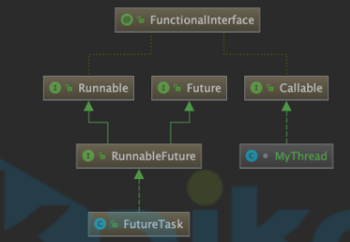
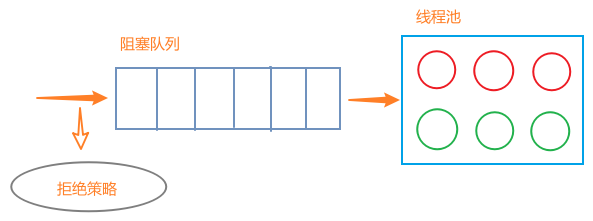
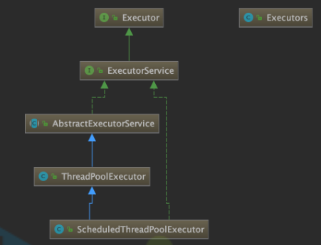

> 本章需要结合[多线程](https://github.com/Mshuyan/JavaBasic/tree/master/javaSE#%E5%A4%9A%E7%BA%BF%E7%A8%8B)学习

# 概念

## JUC

+ `JUC`是`java.util.concurrent`包得缩写

+ `java.util.concurrent`是JDK提供得并发工具包，主要包括如下3个包：

  + `java.util.concurrent`

    并发编程工具类

  + `java.util.concurrent.atomic`

    并发编程原子类

  + `java.util.concurrent.locks`

    并发编程锁

## JMM

+ `JMM`是java内存模型`java memory model`得缩写

+ 多线程访问同一个变量时，这个变量是存储在`主内存`（堆）中得，每个线程有一个`工作内存`（栈），每个线程访问这个变量时，会将变量从主内存拷贝到工作内存，修改后立即同步给主内存

   

+ **工作内存中拷贝的是对象中的变量，不是对象** 

+ `JMM`中比较重要得3个概念：

  + 原子性

    一个操作不可分割

  + 可见性

    每个线程对主内存得修改立即通知其他线程

  + 有序性

    指令不会被重排

## JNI

+ 全称`java native interface`
+ java和C语言实现的本地方法的交互规范

# volatile

> `volatile`具备2个特性：
>
> + 可见性
> + 有序性
>
> 不具备原子性

## 可见性

### 测试

+ 根据`JMM`，两个线程都将主内存中变量读取到工作内存后，一个线程修改变量的值后立即写回主内存，但是另一个线程并不知道这个变量已经被修改

+ demo

  ```java
  public class VolatileDemo1 {
      public static int number = 0;
  
      public static void main(String[] args) {
          new Thread(()->{
              try {
                  // 让主线程先读取主内存中变量值
                  sleep(20);
              } catch (InterruptedException ignore) {}
              // 修改并写回主内存
              number += 1;
          },"test").start();
  
          // 因为主线程不知道主内存中变量已被修改，会死在这
          while(number == 0){
          }
          System.out.println(Thread.currentThread().getName() + "\t int类型的number最终值：" + number);
      }
  }
  ```

+ `number`使用`volatile`修饰即可解决

  `volatile`变量被修改并写回主内存后，会立即通知其他线程重新加载该变量的值

### synchronized

+ 上述代码在`while`循环中加入`System.out.println();`后，即使不使用`volatile`关键字，也不存在可见性问题了
+ 原因是`System.out.println();`中使用了`synchronized`
+ `synchronized`关键字有2个作用：
  + 进入代码块之前，先清空工作内存中共享变量，重新从主内存加载
  + 代码块加上同步锁

## 有序性

+ cpu执行指令时，会根据cpu使用情况，对cpu指令进行重排，指令重排的原则保证了单线程情况下，不会影响执行结果；但是多线程情况下，可能会影响代码执行结果

### 测试

+ demo

  ```java
  public class ResortSeqDemo {
      int a=0;
      boolean flag=false;
      /*
      多线程下flag=true可能先执行，还没走到a=1就被挂起。
      其它线程进入method02的判断，修改a的值=5，而不是6。
       */
      public void method01(){
          a=1;
          flag=true;
      }
      public void method02(){
          if (flag){
              a+=5;
              System.out.println("*****最终值a: "+a);
          }
      }
  
      public static void main(String[] args) {
          ResortSeqDemo resortSeq = new ResortSeqDemo();
  
          new Thread(()->{resortSeq.method01();},"ThreadA").start();
          new Thread(()->{resortSeq.method02();},"ThreadB").start();
      }
  }
  ```

+ 通过给`a`和`flag`加上`volatile`可以禁止指令重排

### 单例模式应用

+ 在单例模式中`instance = new SingletonDemo();`这行代码会被编译成多行字节码指令执行，并可能存在指令重排

  + 正常顺序
    + 申请内存空间
    + 执行初始化流程
    + 引用赋值给`instance`变量
  + 重排后
    + 申请内存空间
    + 引用赋值给`instance`变量
    + 执行初始化流程

+ 重排后的指令在多线程环境下，如果一个线程将引用赋值给`instance`变量后，将cpu让给另外一个线程执行，这个线程发现`instance`变量不为空，调用对象中的方法将抛出异常，因为对象还没来得及初始化

+ 此处需要使用`volatile`修饰`instance`变量，来禁止`instance`变量赋值上面的代码排序到他下面执行

+ demo

  ```java
  public class SingletonDemo {
      private static volatile SingletonDemo instance = null;
  
      private SingletonDemo() {
          System.out.println(Thread.currentThread().getName() +"\t SingletonDemo构造方法执行了");
      }
  
      public static SingletonDemo getInstance(){
          if (instance == null) {
              synchronized (SingletonDemo.class){
                  if (instance == null) {
                      instance = new SingletonDemo();
                  }
              }
          }
          return instance;
      }
  }
  ```

## 原子性

+ 有些代码虽然是一行，但是编译成字节码后分为多行执行（如`i++`），因为这些操作分为多行执行，并不具备原子性，就会导致代码执行出错

+ demo

  ```java
  public class VolatileDemo2 {
      public static volatile int NUMBER = 0;
  
      public static void main(String[] args) {
          for(int i=0; i<20; i++) {
              new Thread(() -> {
                  for(int j=0; j<1000; j++){
                      NUMBER++;
                  }
              }, "test"+ i).start();
          }
  
          while(Thread.activeCount() > 2){ }
          System.out.println(Thread.currentThread().getName() + "\t int类型的number最终值：" + NUMBER);
      }
  }
  ```

  上面的`NUMBER++`编译成字节码后如下：

  ```java
   9 getstatic #17 <thread/VolatileDemo2.numner>
  12 iconst_1
  13 iadd
  14 putstatic #17 <thread/VolatileDemo2.numner>
  ```

  当两个线程同时获取变量值之后，都基于这个值进行`+1`操作，然后写回主内存，我们期望的结果是加了2，但此时只加了1

+ 解决

  + 这个问题无法通过`volatile`解决，他不具备原子性
  + 我们可以将`NUMBER`定义为`AtomicInteger`解决，这是1个原子类

## 内存屏障

### 介绍

`volatile`变量在读写时，分别会在这行代码上下增加两道内存屏障，这些内存屏障实际是`CPU指令`

+ `volatile`写

   

  + `StoreStore`
    + 加在`volatile`变量写操作指令**前**
    + 以这道屏障为界，上面的**普通写**不可以跑到屏障的下面，下面的**`volatile`写**不可以跑到屏障的上面
  + `StoreLoad`
    + 加在`volatile`变量写操作指令**后**
    + 以这道屏障为界，上面的**`volatile`写**不可以跑到屏障的下面，下面的**`volatile`读写**不可以跑到屏障的上面

+ `volatile`读

   

  + `LoadLoad`
    + 加在`volatile`变量读操作指令**后**
    + 以这道屏障为界，上面的**`volatile`读**不可以跑到屏障的下面，下面的**普通读**不可以跑到屏障的上面
  + `LoadStore`
    + 加在`volatile`变量读操作指令**后**
    + 以这道屏障为界，上面的**`volatile`读**不可以跑到屏障的下面，下面的**所有写**不可以跑到屏障的上面

### 作用

`volatile`是通过内存屏障实现的，内存屏障的作用就是`volatile`的作用：

+ 禁止指令重排

  禁止内存屏障前后的指令重新排序

+ 保证内存可见性

  强制将CPU缓存刷出到内存

# CAS

## 介绍

+ 全称`Compare And Swap`，比较交换
+ 这是一条CPU并发原语，功能如下：
  + 判断主内存中的值是否与期望值相同，相同则修改为另一个值，不同则不断重试
  + 这个过程是原子操作

## AtomicInteger

### 初始化

```java
// 获取1个静态unsafe对象
private static final Unsafe unsafe = Unsafe.getUnsafe();
// 记录当前类对象中，value 属性相对于对象首地址的偏移量
private static final long valueOffset;

// 静态代码块，类加载时执行1次
static {
    try {
        // 通过 value 字段的属性信息计算出：
        // 创建1个 AtomicInteger 对象时， 其中的 value 属性相对于该对象首地址的偏移量
        valueOffset = unsafe.objectFieldOffset
            // 获取 AtomicInteger 类中 value 字段的属性信息，返回值为 Field 类型
            (AtomicInteger.class.getDeclaredField("value"));
    } catch (Exception ex) { throw new Error(ex); }
}

// volatile变量，保证内存可见性
private volatile int value;
```

### getAndIncrement

```java
// i++ 操作
public final int getAndIncrement() {
    // 底层调用 unsafe 中得本地方法
    return unsafe.getAndAddInt(this, valueOffset, 1);
}
```

+ `JMM`模型中，拷贝到工作内存的是变量（这里指`value`字段），而不是对象，所以`this`指向的是主内存中的对象，这里修改的也是主内存中对象中的`value`值；因为`value`是`volatile`变量，修改后会立即通知其他线程，所以不必担心可见性问题
+ 传送门
  + [unsafe.getAndAddInt](#getAndAddInt) 

## Unsafe类

### 介绍

+ 该类中的方法都是实现`CAS`操作的本地方法，直接操作内存
+ java中所有原子类底层调用的都是这个类中的本地方法实现

### getAndAddInt

```java
/**
 * 获取并自增指定值
 * @param var1 要操作得对象
 * @param var2 相对偏移量
 * @param var4 自增值
 */
public final int getAndAddInt(Object var1, long var2, int var4) {
    int var5;
    do {
        // 获取要操作变量得值
        var5 = this.getIntVolatile(var1, var2);
        // 如果要操作得变量值等于 var5 ，则将该值修改为 var5+var4
        // 修改失败就一直重复该步骤
    } while(!this.compareAndSwapInt(var1, var2, var5, var5 + var4));

    return var5;
}
```

## CAS缺点

+ `CAS`操作实际上是1种`自旋锁`，线程很多得时候会出现一直不成功得情况，开销较大

  无解

+ 仅适用于对1个变量操作，对多个变量操作时无法保证原子性

  将多个变量封装到1个对象中，通过`原子引用类`保证对这个对象操作的原子性

+ 存在[ABA问题](#ABA问题)

## 原子引用类

+ `原子引用类`可以将多个变量封装到对象中进行原子操作
+ `原子引用类`里的对象，不可以直接操作，每次都必须是用新对象替代老对象才可以保证原子性和ABA问题

### AtomicReference

+ 初始化流程与[AtomiceInteger](#初始化)相同

+ `compareAndSet`

  ```java
  // 对比并设置
  public final boolean compareAndSet(V expect, V update) {
      // 底层调用 unsafe 中的本地方法
      return unsafe.compareAndSwapObject(this, valueOffset, expect, update);
  }
  ```

  + `AtomicReference`中`value`值存储的是对象的引用地址，也就是**当`V`类型对象的引用被修改时，可以保证原子性，但是`V`类型对象内部数据发生变化，是不受控制的，每次都必须是用新对象替代老对象才可以保证原子性和ABA问题**
  + `对比`也是对比的引用地址是否相同，而不会使用`equals`方法对比

### ABA问题

+ CAS操作过程如下

  + 获取主内存中变量值为`A`
  + 以`A`作为期望值，对比主内存中值是否与期望值相同，相同则修改为新值，否则失败

+ 在上述过程中，第一二步之间可能存在该变量值被修改为`B`后立即又被修改回`A`的情况，此时执行第二步时并不会察觉这个值被修改过。这就是**ABA问题** 

+ 有时我们是不希望第一二步之间变量值被修改的，如：

  + 现有1个通过链表实现的栈结构：

    head -> A -> B -> C

  + 线程1获取栈顶为A，此时线程1将cpu交给线程2

  + 线程2将A和B依次弹出栈顶，然后将A重新压入栈顶，栈结构变为：

    head -> A -> C

    此时将cpu重新交回线程1

  + 线程1使用期望值A将栈顶元素更新为D，栈结构变为：

    head -> D -> C

    而线程1期望的结果是：

    head -> D -> B -> C

### 解决方案

#### 我的思路

+ 解决`ABA`问题的关键在于，保证每次修改后变量值不会再变回原来的值
+ 可以每次修改时，将要保存的值作为属性封装到另外一个对象中，这个对象每次修改都是重新创建的，通过`UNSAFE.compareAndSwapObject`方法进行比较替换原子操作

#### AtomicStampedReference

+ 在`AtomicReference`基础上，保存数据同时可以提供版本号；根据版本号的控制，可以在引用再次被设置回以前的值时，指定不同的版本号，就能保证`引用+版本号`这个整体跟之前是不同的值，就能进行`CAS`操作了

+ 初始化

  ```java
  // 定义1个私有内部类，用于封装要保存的数据
  private static class Pair<T> {
      // 要保存的数据
      final T reference;
      // 版本号
      final int stamp;
      private Pair(T reference, int stamp) {
          this.reference = reference;
          this.stamp = stamp;
      }
      static <T> Pair<T> of(T reference, int stamp) {
          return new Pair<T>(reference, stamp);
      }
  }
  
  // 保存的是封装后的数据
  private volatile Pair<V> pair;
  ```

+ `compareAndSet`

  ```java
  /**
   * 比较并设置
   * @param expectedReference 期望对象
   * @param newReference 新对象
   * @param expectedStamp 期望版本
   * @param newStamp 新版本
   */
  public boolean compareAndSet(V   expectedReference,
                               V   newReference,
                               int expectedStamp,
                               int newStamp) {
      Pair<V> current = pair;
      return
          expectedReference == current.reference &&
          expectedStamp == current.stamp &&
          ((newReference == current.reference &&
            newStamp == current.stamp) ||
           casPair(current, Pair.of(newReference, newStamp)));
  }
  ```

#### AtomicMarkableReference

+ `AtomicStampedReference`的简化版，把版本号换成了布尔值

# 线程安全集合

## CopyOnWriteArrayList

+ `ArrayList`是线程不安全的集合，解决方案：

  + `Vector`
    + 不推荐
    + 底层通过`synchronized`实现，太重了
  + `Collections.synchronizedList()`
    + 不推荐
    + 底层通过`synchronized`实现，太重了
  + `CopyOnWriteArrayList`
    + 推荐
    + 通过`写时复制`实现`读写分离`，保证线程安全

+ demo

  ```java
  public boolean add(E e) {
      final ReentrantLock lock = this.lock;
      // 上锁
      lock.lock();
      try {
          Object[] elements = getArray();
          int len = elements.length;
          // 原数组复制到新数组，并且新数组长度+1
          Object[] newElements = Arrays.copyOf(elements, len + 1);
          // 元素加入新数组
          newElements[len] = e;
          // 集合指向新数组
          setArray(newElements);
          return true;
      } finally {
          // 解锁
          lock.unlock();
      }
  }
  ```

+ 写的时候上锁，保证了线程安全

+ 写时复制，保证了写过程中还可以并发读取，串行写，并行读，实现读写分离，提高性能

## CopyOnWriteArraySet

同`CopyOnWriteArrayList`

## ConcurrentHashMap

同`CopyOnWriteArrayList`

# 锁

## 锁类型

+ 可重入锁

+ 读写锁

+ 公平锁

+ 可中断锁

  等待获取锁的线程可以中断，不等了

## synchronized

### 概述

+ JVM实现，底层是两个监控器
  + `monitorenter`进入监控器
  + `monitorexit`退出监控器
+ 是可重入锁，独占锁，非公平，不可中断，非读写
+ 没有超时时间，一直获取不到，就一直阻塞
+ 无法判断锁的状态
+ 用法
  + `synchronized(obj)`锁住指定对象
  + 加在方法上锁住`this`
  + 加在`static`方法上锁住`Class`对象
+ 等待使用`wait`，唤醒使用`notify`（均位于`Object`类）
+ 释放锁
  + `wait`释放锁，恢复后重新获取锁
  + `sleep`不释放锁
  + 抛出异常自动释放锁
  + 代码执行结束释放锁

### 线程生命周期

参见[线程声明周期](https://github.com/Mshuyan/JavaBasic/tree/master/javaSE#%E7%BA%BF%E7%A8%8B%E7%94%9F%E5%91%BD%E5%91%A8%E6%9C%9F) 

## JUC中的锁

### ReentrantLock

+ 结合[lock](https://github.com/Mshuyan/JavaBasic/tree/master/javaSE#lock) 

+ 可重入锁，独占锁，可中断

+ 可重入不公平锁（常用）

  ```java
  Lock lock = new ReentrantLock();
  Lock lock = new RentrantLock(false);
  ```

+ 可重入公平锁

  ```java
  Lock lock = new RentrantLock(true);
  ```

### ReentrantReadWriteLock

+ 可重入读写锁，读锁是共享锁，写锁是独占锁，可中断

+ 可重入不公平读写锁（常用）

  ```java
  ReentrantReadWriteLock lock = new ReentrantReadWriteLock();
  ReentrantReadWriteLock lock = new ReentrantReadWriteLock(false);
  ```

+ 可重入公平读写锁

  ```java
  ReentrantReadWriteLock lock = new ReentrantReadWriteLock(true);
  ```

### Condition

+ `Lock`锁的等待使用`await`，唤醒使用`signal`

+ 一个锁可以获取多个`Condition`对象，每个线程使用自己的`Condition`对象进行`await`操作，通过执行指定`Condition`对象的`signal`方法，可以唤醒指定的线程

+ demo

  ```java
  ReentrantLock lock = new ReentrantLock();
  Condition conditionA = lock.newCondition();
  Condition conditionB = lock.newCondition();
  
  new Thread(()->{
      lock.lock();
      try {
          conditionA.await();
      }catch (Exception e){}
      finally {
          lock.unlock();
      }
  },"A").start();
  
  new Thread(()->{
      lock.lock();
      try {
          conditionB.await();
      }catch (Exception e){}
      finally {
          lock.unlock();
      }
  },"B").start();
  
  sleep(1000);
  // 先唤醒A
  conditionA.signal();
  // 再唤醒B
  conditionB.signal();
  ```

  

## 区别

|  类别  |                         synchronized                         |                      lock                       |
| :----: | :----------------------------------------------------------: | :---------------------------------------------: |
|  类型  |                       关键字，JVM实现                        |                       类                        |
| 释放锁 | 执行完同步代码自动释放锁<br />同步代码发生异常，jvm让线程释放锁 | 在finally中必须手动释放锁，不然容易造成线程死锁 |
| 获取锁 |                         只有1种方式                          |                多种获取锁的方式                 |
| 锁状态 |                     无法判断锁是否被占用                     |                    可以判断                     |
| 锁类型 |               可重入、不可中断、非公平、非读写               |       可重入、可中断、可以公平、可以读写        |
|  性能  |                             较低                             |                      较高                       |
|  唤醒  |                         只能随机唤醒                         |         可以根据`condition`唤醒指定线程         |

# 常用方法

以下内容，参见[常用方法](https://github.com/Mshuyan/JavaBasic/tree/master/javaSE#%E5%B8%B8%E7%94%A8%E6%96%B9%E6%B3%95) 

+ thread类
  + start
  + sleep
  + join
  + yield
  + interrupt
+ object类（与`synchronized`配合使用）
  + wait
  + notify
  + notifyAll
+ condition（与`lock`配合使用）
  + await
  + signal
+ sleep与wait区别
+ 为什么wait、notify、notifyAll必须位于synchronized代码块


# 并发工具类

## CountDownLatch

+ 倒计数门闩
  + 创建`CountDownLatch`变量，并指定初始值，主线程`await`
  + 多线程执行操作，执行结束后`CountDownLatch`变量调用`countDown`方法进行减一操作
  + 当`CountDownLatch`变量减少为0时，主线程被唤醒

## CyclicBarrier

+ 多个线程准备就位之后，一起做一件事

+ demo

  ```java
  public static void main(String[] args) {
      // 7个线程准备好后，执行参数2的回调
      CyclicBarrier cyclicBarrier = new CyclicBarrier(7,()->{
          System.out.println("====== Ready~ GO !!!");
      });
  
      for (int i = 1; i <= 7; i++) {
          // 7个线程陆续启动
          new Thread(()->{
              System.out.println(Thread.currentThread().getName() + "\t就位");
              try {
                  // 7个线程进入等待状态
                  cyclicBarrier.await();
                  // 7个线程准备好后，参数2的回调方法执行结束后，各个线程同时被唤醒，继续执行下面的操作
                  System.out.println(Thread.currentThread().getName() + " run");
              } catch (Exception e) {
                  e.printStackTrace();
              }
          }, String.valueOf("选手" + i)).start();
      }
  }
  /**
   * 打印结果：
   * 选手1	就位
   * 选手3	就位
   * 选手4	就位
   * 选手7	就位
   * 选手5	就位
   * 选手6	就位
   * 选手2	就位
   * ====== Ready~ GO !!!
   * 选手2 run
   * 选手1 run
   * 选手7 run
   * 选手4 run
   * 选手3 run
   * 选手5 run
   * 选手6 run
   */
  ```

## Semaphore

+ 只允许指定数量的线程拿到资源，资源全部被拿光后其他线程只能阻塞，直到有人释放资源，被阻塞的线程才能拿到被释放的资源

+ 场景类似于上厕所

+ demo

  ```java
  public static void main(String[] args) {
      //厕所有3个坑
      Semaphore semaphore = new Semaphore(2);
  
      for (int i = 1; i <= 3; i++) {
          // 6个人要上厕所
          new Thread(()->{
              try{
                  //看看有没有坑，有就进去，没有就排队
                  semaphore.acquire();
                  System.out.println(Thread.currentThread().getName()+"\t拉臭臭");
  
                  try { TimeUnit.SECONDS.sleep(3); } catch (InterruptedException e) {e.printStackTrace(); }
                  System.out.println(Thread.currentThread().getName()+"\t拉完了");
              } catch (Exception e) {
                  e.printStackTrace();
              } finally {
                  //出厕所
                  semaphore.release();
              }
          }, String.valueOf(i)).start();
      }
  }
  /**
   * 打印结果：
   * 2	拉臭臭
   * 1	拉臭臭
   * 1	拉完了
   * 2	拉完了
   * 3	拉臭臭
   * 3	拉完了
   */
  ```

# 阻塞队列

## 概述

+ 所有的阻塞队列实现了`BlockingQueue`接口

+ 方法对比

  | 操作/失败时行为 | 抛出异常 | 返回boolean |   阻塞   |           超时           |
  | :-------------: | :------: | :---------: | :------: | :----------------------: |
  |      插入       | add(E e) | offer(E e)  | put(E e) | offer(E e,Time,TimeUnit) |
  |      取出       | remove() |   poll()    |  take()  |   poll(Time,TimeUnit)    |

+ 常用的是`超时`列的方法

## ArrayBlockingQueue

+ 数组结构的有界限的阻塞队列
+ 界限需要构造方法指定

## LinkedBlockingQueue

+ 链表结构的有界限的阻塞队列

+ 界限可以构造方法指定，默认`Integer.MAX_VALUE`

# 线程相关接口

## 接口说明

 

+ `Runable`

  + 没有返回值
  + 不可以抛出异常

+ `Callable`

  + 有返回值
  + 可以抛出异常

+ `Future`

  + 用于控制异步任务，获取异步计算结果

  + code

    ```java
    boolean cancel(boolean mayInterruptIfRunning);
    boolean isCancelled();
    boolean isDone();
    V get() throws InterruptedException, ExecutionException;
    V get(long timeout, TimeUnit unit) throws InterruptedException, ExecutionException, TimeoutException;
    ```

+ `RunableFuture`

  + 可执行可控制的异步任务接口

+ `FutureTask`

  + 异步任务实现类

## demo

```java
class MyThread implements Callable<Integer> {
    @Override
    public Integer call() throws Exception {
        System.out.println("callable come in ...");
        try { TimeUnit.SECONDS.sleep(3); } catch (InterruptedException e) {e.printStackTrace(); }
        return 1024;
    }
}

public class CallableDemo {
    public static void main(String[] args) throws ExecutionException, InterruptedException {
        //创建FutureTask类，接受MyThread。
        FutureTask<Integer> futureTask = new FutureTask<>(new MyThread());
        //将FutureTask对象放到Thread类的构造器里面。
        new Thread(futureTask, "AA").start();


        int result01 = 100;
        //用FutureTask的get方法得到返回值。
        int result02 = futureTask.get();

        System.out.println("result=" + (result01 + result02));
    }
}
```

+ 真正的启动线程必须使用`Thread`，`Thread`只认`Runnable`接口，`FutureTask`接受`Callable`接口，所以需要将`Callable`交给`FutureTask`执行，`FutureTask`交给`Thread`执行

# 线程池

## 概述

+ 示意图

   

  + 当需要开启1个线程时，先判断线程池中是否有空闲的核心线程
  + 如果有，则直接拿出1个线程执行
  + 如果没有，将该任务放入阻塞队列进行排队，线程中有任务执行结束后，从阻塞队列中取出下一个要执行的任务进行执行
  + 如果阻塞队列满了时，还有新的线程要执行，则创建非核心线程来执行阻塞队列中的任务
  + 如果非核心线程也都忙着呢，阻塞队列也满了，还有新的任务要执行，则使用拒绝策略处理此次申请
  + 当任务逐渐执行结束，非核心线程都空闲下来了，则非核心线程会被自动回收

+ 优点

  + 线程复用，节省创建销毁线程带来的开销，提高响应速度
  + 线程的数量可控，防止OOM异常

## 相关接口

 

+ `Executor`

  + 执行器

  + code

    ```java
    void execute(Runnable command);
    ```

+ `ExecutorService`

  + 执行器服务

  + 增加了一些任务的控制方法

  + code

    ```java
    void shutdown();
    List<Runnable> shutdownNow();
    boolean isShutdown();
    boolean isTerminated();
    boolean awaitTermination(long timeout, TimeUnit unit) throws InterruptedException;
    <T> Future<T> submit(Callable<T> task);
    <T> Future<T> submit(Runnable task, T result);
    Future<?> submit(Runnable task);
    ```

+ `AbstractExecutorService`

  + `ExecutorService`的抽象实现类

+ `ThreadPoolExecutor`

  + 线程池执行器
  + 维护一个线程池，使用线程池中的线程执行任务

+ `ScheduledThreadPoolExecutor`

  + 任务调度线程池执行器，支持`CRON`表达式的线程池执行器

+ `Executors`

  + 线程池的创建需要指定很多参数，使用`Excutor`可以通过指定合适的参数创建适用于各种场景的线程池

## JDK线程池

+ `Executors`中提供了多种创建线程池的方法，常用的如下：

  + `newFixedThreadPool`

    + code

      ```java
      public static ExecutorService newFixedThreadPool(int nThreads) {
          return new ThreadPoolExecutor(nThreads, nThreads,
                                        0L, TimeUnit.MILLISECONDS,
                                        new LinkedBlockingQueue<Runnable>());
      }
      ```

    + 定长线程池

    + 核心线程数与最大线程数相同

    + `LinkedBlockingQueue`默认大小非常大，会造成`OOM`异常

  + `newSingleThreadExecutor`

    + code

      ```java
      public static ExecutorService newSingleThreadExecutor() {
          return new FinalizableDelegatedExecutorService
              (new ThreadPoolExecutor(1, 1,
                                      0L, TimeUnit.MILLISECONDS,
                                      new LinkedBlockingQueue<Runnable>()));
      }
      ```

    + 只有1个线程的线程池

    + 核心线程数与最大线程数都为1

    + `LinkedBlockingQueue`默认大小非常大，会造成`OOM`异常

  + `newCachedThreadPool`

    + code

      ```java
      public static ExecutorService newCachedThreadPool() {
          return new ThreadPoolExecutor(0, Integer.MAX_VALUE,
                                        60L, TimeUnit.SECONDS,
                                        new SynchronousQueue<Runnable>());
      }
      ```

    + 缓存线程池，没有核心线程，需要多少线程开启多少线程

    + 核心线程数为0，最大线程数约等于无限

    + 最大线程没有上限，会造成`OOM`异常

    + 没有核心线程会产生线程的创建和销毁的开销，比不用线程池好不到哪去

+ JDK提供好的线程池都是存在问题的，实际开发中线程池需要自定义设置

## 构造参数

+ `int corePoolSize`
  + 核心线程数，程序启动自动创建好，不会被销毁
+ `int maximumPoolSize`
  + 最大线程数
  + 核心线程数量不够用时可以创建非核心线程满足需要，但是总线程数需要有上限
+ `long keepAliveTime`
  + 存活时间
  + 非核心线程超过存活时间会自动销毁
+ `TimeUnit unit`
  + 存活时间单位
+ `BlockingQueue<Runnable> workQueue`
  + 阻塞队列
  + 线程池不够大时，其他的线程需要放在阻塞队列中等待被执行
+ `ThreadFactory threadFactory`
  + 线程工厂
  + 创建线程时如何创建
+ `RejectedExecutionHandler handler`
  + 拒绝策略
  + 阻塞队列也满了时如何处理新的线程请求

## 拒绝策略

+ `AbortPolicy`
  + 默认策略
  + 直接抛出`RejectedExecutionException`异常，阻止系统正常运行
+ `CallerRunsPolicy`
  + 将任务返回给调用者执行
+ `DiscardOldestPolicy`
  + 抛弃阻塞队列中等待时间最长的任务，将当前任务再次提交
+ `DiscardPolicy`
  + 丢弃当前任务

## 线程池优化

> 通过`grep 'processor' /proc/cpuinfo | sort -u | wc -l`命令可以查看`CPU线程数`

+ 核心线程数

  + 与`最大线程数`一致即可

+ 最大线程数

  + IO密集型任务（常用）

    + IO密集型指的是数据库操作，文件处理这样的任务，大部分时间花在IO上，CPU处于闲置状态等待IO操作完成，这样的任务线程池可以大一些
    + 常用值为`2*CPU线程数`

  + CPU密集型任务

    + CPU密集型指的是大部分时间CPU处于工作状态

    + 常用值为`CPU线程数+1`

+ 存活时间

  + 60S

+ 阻塞队列

  + 使用`LinkedBlockingQueue`

  + 线程池大小不可以无限大，会导致非核心线程用不上

  + 公式：（最大容忍延时 / 任务平均执行时间）* 核心线程池数

  + 常用值：最大线程数

    猜的，实际大小需要测试

+ 线程工厂

  + 默认即可

+ 拒绝策略

  + 如果不允许任务丢失，使用默认的`AbortPolicy`（常用）
  + 如果允许任务丢失，使用`DiscardPolicy`

# 死锁定位

+ `jps -l`命令找到需要查看的进程
+ `jstack + 进程号`查看堆栈信息，定位到代码位置，修改代码解决


