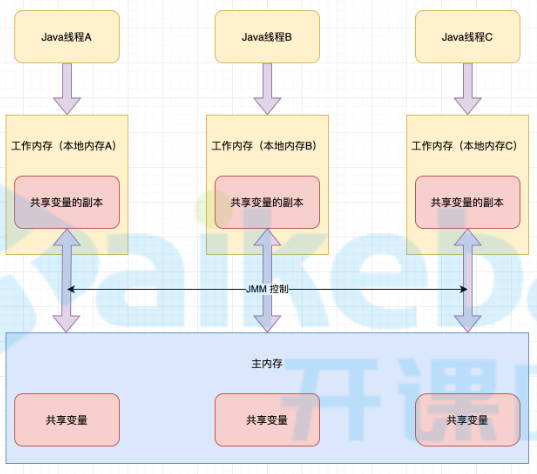

# 概念

## JUC

+ `JUC`是`java.util.concurrent`包得缩写

+ `java.util.concurrent`是JDK提供得并发工具包，主要包括如下3个包：

  + `java.util.concurrent`

    并发编程工具类

  + `java.util.concurrent.atomic`

    并发编程原子类

  + `java.util.concurrent.locks`

    并发编程锁

## JMM

+ `JMM`是java内存模型`java memory model`得缩写

+ 多线程访问同一个变量时，这个变量是存储在`主内存`（堆）中得，每个线程有一个`工作内存`（栈），每个线程访问这个变量时，会将变量从主内存拷贝到工作内存，修改后立即同步给主内存

   

+ **工作内存中拷贝的是对象中的变量，不是对象** 

+ `JMM`中比较重要得3个概念：

  + 原子性

    一个操作不可分割

  + 可见性

    每个线程对主内存得修改立即通知其他线程

  + 有序性

    指令不会被重排

## JNI

+ 全称`java native interface`
+ java和C语言实现的本地方法的交互规范

# volatile

> `volatile`具备2个特性：
>
> + 可见性
> + 有序性
>
> 不具备原子性

## 可见性

### 测试

+ 根据`JMM`，两个线程都将主内存中变量读取到工作内存后，一个线程修改变量的值后立即写回主内存，但是另一个线程并不知道这个变量已经被修改

+ demo

  ```java
  public class VolatileDemo1 {
      public static int number = 0;
  
      public static void main(String[] args) {
          new Thread(()->{
              try {
                  // 让主线程先读取主内存中变量值
                  sleep(20);
              } catch (InterruptedException ignore) {}
              // 修改并写回主内存
              number += 1;
          },"test").start();
  
          // 因为主线程不知道主内存中变量已被修改，会死在这
          while(number == 0){
          }
          System.out.println(Thread.currentThread().getName() + "\t int类型的number最终值：" + number);
      }
  }
  ```

+ `number`使用`volatile`修饰即可解决

  `volatile`变量被修改并写回主内存后，会立即通知其他线程重新加载该变量的值

### synchronized

+ 上述代码在`while`循环中加入`System.out.println();`后，即使不使用`volatile`关键字，也不存在可见性问题了
+ 原因是`System.out.println();`中使用了`synchronized`
+ `synchronized`关键字有2个作用：
  + 进入代码块之前，先清空工作内存中共享变量，重新从主内存加载
  + 代码块加上同步锁

## 有序性

+ cpu执行指令时，会根据cpu使用情况，对cpu指令进行重排，指令重排的原则保证了单线程情况下，不会影响执行结果；但是多线程情况下，可能会影响代码执行结果

### 测试

+ demo

  ```java
  public class ResortSeqDemo {
      int a=0;
      boolean flag=false;
      /*
      多线程下flag=true可能先执行，还没走到a=1就被挂起。
      其它线程进入method02的判断，修改a的值=5，而不是6。
       */
      public void method01(){
          a=1;
          flag=true;
      }
      public void method02(){
          if (flag){
              a+=5;
              System.out.println("*****最终值a: "+a);
          }
      }
  
      public static void main(String[] args) {
          ResortSeqDemo resortSeq = new ResortSeqDemo();
  
          new Thread(()->{resortSeq.method01();},"ThreadA").start();
          new Thread(()->{resortSeq.method02();},"ThreadB").start();
      }
  }
  ```

+ 通过给`a`和`flag`加上`volatile`可以禁止指令重排

### 单例模式应用

+ 在单例模式中`instance = new SingletonDemo();`这行代码会被编译成多行字节码指令执行，并可能存在指令重排

  + 正常顺序
    + 申请内存空间
    + 执行初始化流程
    + 引用赋值给`instance`变量
  + 重排后
    + 申请内存空间
    + 引用赋值给`instance`变量
    + 执行初始化流程

+ 重排后的指令在多线程环境下，如果一个线程将引用赋值给`instance`变量后，将cpu让给另外一个线程执行，这个线程发现`instance`变量不为空，调用对象中的方法将抛出异常，因为对象还没来得及初始化

+ 此处需要使用`volatile`修饰`instance`变量，来禁止`instance`变量赋值上面的代码排序到他下面执行

+ demo

  ```java
  public class SingletonDemo {
      private static volatile SingletonDemo instance = null;
  
      private SingletonDemo() {
          System.out.println(Thread.currentThread().getName() +"\t SingletonDemo构造方法执行了");
      }
  
      public static SingletonDemo getInstance(){
          if (instance == null) {
              synchronized (SingletonDemo.class){
                  if (instance == null) {
                      instance = new SingletonDemo();
                  }
              }
          }
          return instance;
      }
  }
  ```

## 原子性

+ 有些代码虽然是一行，但是编译成字节码后分为多行执行（如`i++`），因为这些操作分为多行执行，并不具备原子性，就会导致代码执行出错

+ demo

  ```java
  public class VolatileDemo2 {
      public static volatile int NUMBER = 0;
  
      public static void main(String[] args) {
          for(int i=0; i<20; i++) {
              new Thread(() -> {
                  for(int j=0; j<1000; j++){
                      NUMBER++;
                  }
              }, "test"+ i).start();
          }
  
          while(Thread.activeCount() > 2){ }
          System.out.println(Thread.currentThread().getName() + "\t int类型的number最终值：" + NUMBER);
      }
  }
  ```

  上面的`NUMBER++`编译成字节码后如下：

  ```java
   9 getstatic #17 <thread/VolatileDemo2.numner>
  12 iconst_1
  13 iadd
  14 putstatic #17 <thread/VolatileDemo2.numner>
  ```

  当两个线程同时获取变量值之后，都基于这个值进行`+1`操作，然后写回主内存，我们期望的结果是加了2，但此时只加了1

+ 解决

  + 这个问题无法通过`volatile`解决，他不具备原子性
  + 我们可以将`NUMBER`定义为`AtomicInteger`解决，这是1个原子类

## 内存屏障

### 介绍

`volatile`变量在读写时，分别会在这行代码上下增加两道内存屏障，这些内存屏障实际是`CPU指令`

+ `volatile`写

   

  + `StoreStore`
    + 加在`volatile`变量写操作指令**前**
    + 以这道屏障为界，上面的**普通写**不可以跑到屏障的下面，下面的**`volatile`写**不可以跑到屏障的上面
  + `StoreLoad`
    + 加在`volatile`变量写操作指令**后**
    + 以这道屏障为界，上面的**`volatile`写**不可以跑到屏障的下面，下面的**`volatile`读写**不可以跑到屏障的上面

+ `volatile`读

   

  + `LoadLoad`
    + 加在`volatile`变量读操作指令**后**
    + 以这道屏障为界，上面的**`volatile`读**不可以跑到屏障的下面，下面的**普通读**不可以跑到屏障的上面
  + `LoadStore`
    + 加在`volatile`变量读操作指令**后**
    + 以这道屏障为界，上面的**`volatile`读**不可以跑到屏障的下面，下面的**所有写**不可以跑到屏障的上面

### 作用

`volatile`是通过内存屏障实现的，内存屏障的作用就是`volatile`的作用：

+ 禁止指令重排

  禁止内存屏障前后的指令重新排序

+ 保证内存可见性

  强制将CPU缓存刷出到内存

# CAS

## 介绍

+ 全称`Compare And Swap`，比较交换
+ 这是一条CPU并发原语，功能如下：
  + 判断主内存中的值是否与期望值相同，相同则修改为另一个值，不同则不断重试
  + 这个过程是原子操作

## AtomicInteger

### 初始化

```java
// 获取1个静态unsafe对象
private static final Unsafe unsafe = Unsafe.getUnsafe();
// 记录当前类对象中，value 属性相对于对象首地址的偏移量
private static final long valueOffset;

// 静态代码块，类加载时执行1次
static {
    try {
        // 通过 value 字段的属性信息计算出：
        // 创建1个 AtomicInteger 对象时， 其中的 value 属性相对于该对象首地址的偏移量
        valueOffset = unsafe.objectFieldOffset
            // 获取 AtomicInteger 类中 value 字段的属性信息，返回值为 Field 类型
            (AtomicInteger.class.getDeclaredField("value"));
    } catch (Exception ex) { throw new Error(ex); }
}

// volatile变量，保证内存可见性
private volatile int value;
```

### getAndIncrement

```java
// i++ 操作
public final int getAndIncrement() {
    // 底层调用 unsafe 中得本地方法
    return unsafe.getAndAddInt(this, valueOffset, 1);
}
```

+ `JMM`模型中，拷贝到工作内存的是变量（这里指`value`字段），而不是对象，所以`this`指向的是主内存中的对象，这里修改的也是主内存中对象中的`value`值；因为`value`是`volatile`变量，修改后会立即通知其他线程，所以不必担心可见性问题
+ 传送门
  + [unsafe.getAndAddInt](#getAndAddInt) 

## Unsafe类

### 介绍

+ 该类中的方法都是实现`CAS`操作的本地方法，直接操作内存
+ java中所有原子类底层调用的都是这个类中的本地方法实现

### getAndAddInt

```java
/**
 * 获取并自增指定值
 * @param var1 要操作得对象
 * @param var2 相对偏移量
 * @param var4 自增值
 */
public final int getAndAddInt(Object var1, long var2, int var4) {
    int var5;
    do {
        // 获取要操作变量得值
        var5 = this.getIntVolatile(var1, var2);
        // 如果要操作得变量值等于 var5 ，则将该值修改为 var5+var4
        // 修改失败就一直重复该步骤
    } while(!this.compareAndSwapInt(var1, var2, var5, var5 + var4));

    return var5;
}
```

## CAS缺点

+ `CAS`操作实际上是1种`自旋锁`，线程很多得时候会出现一直不成功得情况，开销较大

  无解

+ 仅适用于对1个变量操作，对多个变量操作时无法保证原子性

  将多个变量封装到1个对象中，通过`原子引用类`保证对这个对象操作的原子性

+ 存在[ABA问题](#ABA问题)

## 原子引用类

+ `原子引用类`可以将多个变量封装到对象中进行原子操作
+ `原子引用类`里的对象，不可以直接操作，每次都必须是用新对象替代老对象才可以保证原子性和ABA问题

### AtomicReference

+ 初始化流程与[AtomiceInteger](#初始化)相同

+ `compareAndSet`

  ```java
  // 对比并设置
  public final boolean compareAndSet(V expect, V update) {
      // 底层调用 unsafe 中的本地方法
      return unsafe.compareAndSwapObject(this, valueOffset, expect, update);
  }
  ```

  + `AtomicReference`中`value`值存储的是对象的引用地址，也就是**当`V`类型对象的引用被修改时，可以保证原子性，但是`V`类型对象内部数据发生变化，是不受控制的，每次都必须是用新对象替代老对象才可以保证原子性和ABA问题**
  + `对比`也是对比的引用地址是否相同，而不会使用`equals`方法对比

### ABA问题

+ CAS操作过程如下

  + 获取主内存中变量值为`A`
  + 以`A`作为期望值，对比主内存中值是否与期望值相同，相同则修改为新值，否则失败

+ 在上述过程中，第一二步之间可能存在该变量值被修改为`B`后立即又被修改回`A`的情况，此时执行第二步时并不会察觉这个值被修改过。这就是**ABA问题** 

+ 有时我们是不希望第一二步之间变量值被修改的，如：

  + 现有1个通过链表实现的栈结构：

    head -> A -> B -> C

  + 线程1获取栈顶为A，此时线程1将cpu交给线程2

  + 线程2将A和B依次弹出栈顶，然后将A重新压入栈顶，栈结构变为：

    head -> A -> C

    此时将cpu重新交回线程1

  + 线程1使用期望值A将栈顶元素更新为D，栈结构变为：

    head -> D -> C

    而线程1期望的结果是：

    head -> D -> B -> C

### 解决方案

#### 我的思路

+ 解决`ABA`问题的关键在于，保证每次修改后变量值不会再变回原来的值
+ 可以每次修改时，将要保存的值作为属性封装到另外一个对象中，这个对象每次修改都是重新创建的，通过`UNSAFE.compareAndSwapObject`方法进行比较替换原子操作

#### AtomicStampedReference

+ 在`AtomicReference`基础上，保存数据同时可以提供版本号；根据版本号的控制，可以在引用再次被设置回以前的值时，指定不同的版本号，就能保证`引用+版本号`这个整体跟之前是不同的值，就能进行`CAS`操作了

+ 初始化

  ```java
  // 定义1个私有内部类，用于封装要保存的数据
  private static class Pair<T> {
      // 要保存的数据
      final T reference;
      // 版本号
      final int stamp;
      private Pair(T reference, int stamp) {
          this.reference = reference;
          this.stamp = stamp;
      }
      static <T> Pair<T> of(T reference, int stamp) {
          return new Pair<T>(reference, stamp);
      }
  }
  
  // 保存的是封装后的数据
  private volatile Pair<V> pair;
  ```

+ `compareAndSet`

  ```java
  /**
   * 比较并设置
   * @param expectedReference 期望对象
   * @param newReference 新对象
   * @param expectedStamp 期望版本
   * @param newStamp 新版本
   */
  public boolean compareAndSet(V   expectedReference,
                               V   newReference,
                               int expectedStamp,
                               int newStamp) {
      Pair<V> current = pair;
      return
          expectedReference == current.reference &&
          expectedStamp == current.stamp &&
          ((newReference == current.reference &&
            newStamp == current.stamp) ||
           casPair(current, Pair.of(newReference, newStamp)));
  }
  ```

#### AtomicMarkableReference

+ `AtomicStampedReference`的简化版，把版本号换成了布尔值

# 线程安全集合

## CopyOnWriteArrayList

+ `ArrayList`是线程不安全的集合，解决方案：

  + `Vector`
    + 不推荐
    + 底层通过`synchronized`实现，太重了
  + `Collections.synchronizedList()`
    + 不推荐
    + 底层通过`synchronized`实现，太重了
  + `CopyOnWriteArrayList`
    + 推荐
    + 通过`写时复制`实现`读写分离`，保证线程安全

+ demo

  ```java
  public boolean add(E e) {
      final ReentrantLock lock = this.lock;
      // 上锁
      lock.lock();
      try {
          Object[] elements = getArray();
          int len = elements.length;
          // 原数组复制到新数组，并且新数组长度+1
          Object[] newElements = Arrays.copyOf(elements, len + 1);
          // 元素加入新数组
          newElements[len] = e;
          // 集合指向新数组
          setArray(newElements);
          return true;
      } finally {
          // 解锁
          lock.unlock();
      }
  }
  ```

+ 写的时候上锁，保证了线程安全

+ 写时复制，保证了写过程中还可以并发读取，串行写，并行读，实现读写分离，提高性能

## CopyOnWriteArraySet

同`CopyOnWriteArrayList`

## ConcurrentHashMap

同`CopyOnWriteArrayList`


