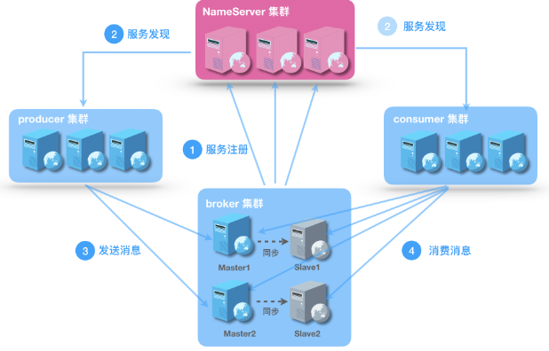
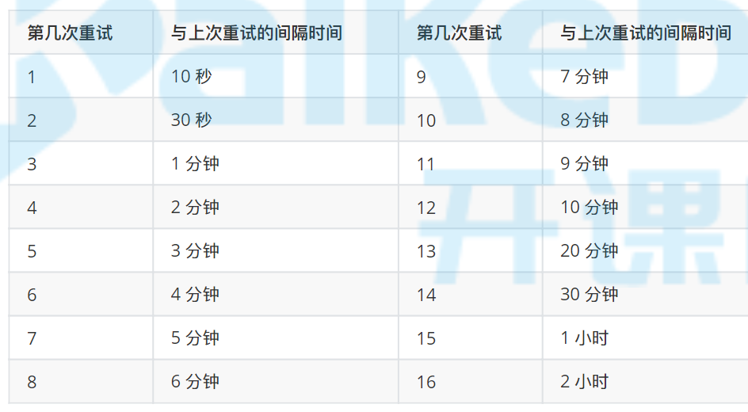

# 介绍

## MQ作用

+ 异步解耦
+ 流量消峰
+ 顺序收发
+ 分布式事务一致性

## MQ缺点

+ 不能完全替代RPC
+ 系统可用性降低
+ 系统复杂度提高
+ 一致性问题

# 安装

## 源码安装

+ 从[github](https://github.com/apache/rocketmq/releases)获取源码

+ `maven`编译

  ```mvn
  mvn -Prelease-all -Dcheckstyle.skip=true -DskipTests clean install -U
  ```

+ 在`distribution`模块的`target/rocketmq-4.7.1`目录下获取编译结果

+ 启动

  `rocketmq`依赖`jdk1.8`，系统中必须安装`jdk1.8`

  + 启动`name server`

    + 注册中心

    + 启动命令
  
      ```sh
    nohup sh bin/mqnamesrv >/dev/null 2>&1 &
      ```

    + 查看日志
  
      ```sh
    tail -f ~/logs/rocketmqlogs/namesrv.log
      ```

  + 启动`broker`

    + 消息队列节点
  
    + 启动命令
    
    ```sh
      # -n 指定注册中心地址
  nohup sh bin/mqbroker -c conf/broker.conf -n localhost:9876 >/dev/null 2>&1 &
    ```
  
    + 查看日志
  
      ```sh
    tail -f ~/logs/rocketmqlogs/broker.log
      ```
    
  
+ 关闭

  + 关闭`name server`

    ```sh
    bin/mqshutdown namesrv
    ```

  + 关闭`broker`

    ```sh
    bin/mqshutdown broker
    ```

* maven依赖

  ```xml
  <dependency>
      <groupId>org.apache.rocketmq</groupId>
      <artifactId>rocketmq-client</artifactId>
      <version>4.7.1</version>
  </dependency>
  ```

## docker安装

+ 创建`logs`和`store`目录用于映射

+ 复制`broker.conf`文件用于映射

+ `namesrv.sh`

  ```sh
  #/bin/bash
  
  docker run --name rmqnamesrv -d \
   --log-opt max-size=10m \
   -v /etc/localtime:/etc/localtime:ro \
   -v /etc/timezone:/etc/timezone:ro \
   --privileged=true \
   -p 9876:9876 \
   -v /usr/local/docker-srv/rocketmq/namesrv/logs:/root/logs/rocketmqlogs \
   -e "JAVA_OPT_EXT=-server -Xms2g -Xmx2g -Xmn1g" \
   rocketmqinc/rocketmq sh mqnamesrv
  ```

+ `broker.sh`

  ```sh
  #/bin/bash
  
  docker run --name rmqbroker -d \
   --log-opt max-size=10m \
   -v /etc/localtime:/etc/localtime:ro \
   -v /etc/timezone:/etc/timezone:ro \
   --privileged=true \
   -p 10909:10909 \
   -p 10911:10911 \
   -p 10912:10912 \
   -v /usr/local/docker-srv/rocketmq/broker/broker.conf:/opt/rocketmq-4.4.0/conf/broker.conf \
   -v /usr/local/docker-srv/rocketmq/broker/logs:/root/logs/rocketmqlogs \
   -v /usr/local/docker-srv/rocketmq/broker/store:/root/store \
   --link rmqnamesrv:namesrv \
   -e "NAMESRV_ADDR=namesrv:9876" \
   -e "JAVA_OPT_EXT=-server -Xms2g -Xmx2g -Xmn1g" \
   rocketmqinc/rocketmq sh mqbroker -c /opt/rocketmq-4.4.0/conf/broker.conf
  ```

+ 实际生产中注意修改`JVM`参数

## 控制台安装

+ [下载源码](https://github.com/apache/rocketmq-externals)，不要下载`release`版本，那是`1.0.0`版本的，源码是`2.0.0`版本

+ 解压进入`rocketmq-console`目录，执行如下命令编译

  ```
  mvn clean package -Dmaven.test.skip=true
  ```

+ 创建目录，拷贝文件

  ```sh
  $ mkdir -p /usr/local/rocketmq-console/data
  $ cp /mnt/c/Users/43422/Desktop/rocketmq-externals-master/rocketmq-console/target/rocketmq-console-ng-2.0.0.jar /usr/local/rocketmq-console
  $ cp /mnt/c/Users/43422/Desktop/rocketmq-externals-master/rocketmq-console/src/main/resources/*.properties /usr/local/rocketmq-console
  ```

+ 修改`application.properties`

  ```properties
  #这个填写自己的nameserver的地址
  rocketmq.config.namesrvAddr=127.0.0.1:9876
  #rocketmq-console的数据目录，默认为 /tmp/rocketmq-console/data
  rocketmq.config.dataPath=/usr/local/rocketmq-console/data
  #开启认证登录功能，默认为false
  rocketmq.config.loginRequired=true
  ```

+ 修改`user.properties`

  ```properties
  # 该文件支持热修改，即添加和修改用户时，不需要重新启动console
  # 格式， 每行定义一个用户， username=password[,N]  #N是可选项，可以为0 (普通用户)； 1 （管理员）  
  
  #定义管理员 
  admin=admin,1
  
  #定义普通用户
  user1=user1
  user2=user2
  ```

+ 启动

  ```sh
  nohup java -jar rocketmq-console-ng-2.0.0.jar >/dev/null 2>&1 &
  ```

+ 默认端口`8080`，查看页面

# 服务端

## 文件结构

### 安装包

+ `benchmark`

  性能测试工具

  + `consumer.sh`  ：测试消费者能力
  + `producer.sh`  ：测试普通MQ生产者能力
  + `runclass.sh`  
  + `tproducer.sh`：测试事务MQ生产者能力

+ `bin`

  工具脚本

  ```sh
  README.md         mqadmin.cmd         mqbroker.numanode3  play.cmd       setcache.sh
  cachedog.sh       mqbroker            mqnamesrv           play.sh        startfsrv.sh
  cleancache.sh     mqbroker.cmd        mqnamesrv.cmd       runbroker.cmd  tools.cmd
  cleancache.v1.sh  mqbroker.numanode0  mqshutdown          runbroker.sh   tools.sh
  dledger           mqbroker.numanode1  mqshutdown.cmd      runserver.cmd
  mqadmin           mqbroker.numanode2  os.sh               runserver.sh
  ```

  + `mqbroker`：mq节点启动脚本
  + `mqnamesrv`：注册中心启动脚本
  + `mqshutdown`：停止脚本

+ `conf`

  配置文件

  ```sh
  2m-2s-async  2m-noslave   dledger             logback_namesrv.xml  plain_acl.yml
  2m-2s-sync   broker.conf  logback_broker.xml  logback_tools.xml    tools.yml
  ```

  + `broker.conf`：`broker`节点配置文件

+ `lib`

  依赖库

### 存储文件

+ 日志

  日志存储在`~/logs/rocketmqlogs`目录下

+ 持久化文件

  存储在`~/store`目录下

## 端口

### namesrv

+ 9876：通信端口

### broker

+ remotingServer
  + 默认10911
  + 用于消费者拉取消息
  + 也可用于生产者生产消息，但是生产者默认不使用该端口
+ fastRemotingServer
  + `remotingServer-2`，默认10909
  + 用于生产者生产消息，默认就是这个
+ HAService
  + `remotingServer+1`，默认10912
  + 用于Broker的主从同步

## 修改JVM参数

+ `name server`

  修改`bin/runserver.sh`文件

+ `broker`

  修改`bin/runbroker.sh`文件
  
+ docker

  通过`-e "JAVA_OPT_EXT=-server -Xms2g -Xmx2g -Xmn1g"`指定

## broker服务配置

### 配置方法

broker服务端配置有2种方式：

+ 修改`conf/broker.conf`文件
+ 直接在启动命令上添加参数
+ 配置文件必须通过`-c`参数进行指定
+ `broker.conf`文件和`conf/2m-xxx`目录下的`properties`文件是一样的，只不过文件名不同而已

### 参数

+ `autoCreateTopicEnable`
  + 是否开启自动创建topic
  + 默认值`true`
+ `brokerId`
  + 值为0表示主节点，大于0表示从节点
  + 同一套主从关系中，该值不能相同
+ `defaultTopicQueueNums`
  + 1个`topic`中默认有多少个队列
+ `brokerIP1`
  + 注册IP
+ `namesrvAddr`
  + `namesrv`地址，多个时以`;`分割
+ `brokerClusterName`
  + 集群名称
  + 同一个系统应该使用相同的集群名称
+ `brokerName`
  + `broker`分片名称
  + 同一套主从关系中，该值必须相同
+ `deleteWhen`
  + 几点删除文件，24小时制
+ `fileReservedTime`
  + 文件保留时间，单位小时
+ `listenPort`
  + `remotingServer`监听端口
+ `brokerRole`
  + `broker`节点角色，决定了主从同步方式
  + 可选值
    + `ASYNC_MASTER`：异步模式主节点
    + `SYNC_MASTER`：同步模式主节点
    + `SLAVE`：从节点
+ `flushDiskType`
  + 刷盘策略
  + 可选值
    + `ASYNC_FLUSH`：异步刷盘
    + `SYNC_FLUSH`：同步刷盘
+ `storePathCommitLog`
  + `commitlog`文件存储路径
  + 默认`~/store/commitlog`
+ `storePathConsumerQueue`
  + `comsumerqueue`文件存储路径
  + 默认`~/store/comsumerqueue`
+ `mapedFileSizeCommitLog`
  + 每个`commitlog`文件大小
  + 默认1G

# 基本概念

## 生产者组

+ `producerGroup`

+ 发送同一类消息（`topic`相同）的多个生产者放入同一个生产者组

## 消费者组

+ `consumerGroup`
+ 消费逻辑相同（`topic`相同，`tag`相同）的多个消费者放入同一个消费者组

## 主题

+ `topic`

+ 1个`topic`下有多个队列
+ 一般同一类消息发送到同一个topic
+ 生产者和消费者都可以发送或消费多个topic中的消息
+ 1个topic中的队列会落到多个`broker`节点上，但是每个队列只能在1个`broker`节点上

## 队列

+ `queue`

+ 集群模式下，1个队列只能被1个消费者消费；广播模式下，1个队列可以被同1个消费者组中所有消费者消费

+ 一个消费者可以消费多个队列中的消息

+ 每个队列只能在1个`broker`节点上

+ `topic`中队列数量指定方式

  读写队列数量分开设置时建议相同

  + 代码

    ```java
    producer.setDefaultTopicQueueNums(8);
    ```

  + 配置文件

    ```
    defaultTopicQueueNums=16
    ```

  + 控制台指定

## 消息

+ 必须指定`topic`
+ 可以指定多个`tag`
+ 可以添加`property`属性

## 标签

+ `tag`

+ 消息的标签，可以用来过滤消息，
+ 本质就是`name`为`TAGS`的`propety`属性，但是不能当作普通`property`看，使用`tag`进行过滤时，代码中会自动将`name`为`TAGS`的`propety`属性识别为`tag`进行过滤

## 消费模式

+ 分类
  + 集群模式（默认）
    + 一条消息只被一个消费者消费
    + 所有消费者使用公用的偏移量获取队列中的消息
  + 广播模式
    + 一条消息可以被同一个消费者组中的多个消费者消费
    + 每个消费者使用自己的偏移量获取队列中的消息
    + 参见[广播消息](#广播消息) 

## 偏移量

+ 用于标记消费者从哪个位置开始向后进行消费
+ 分为`LocalfileOffsetStore`和`RemoteBrokerOffsetStore`
  + `RemoteBrokerOffsetStore`
    + 消费者使用`集群模式`进行消费时，在`broker`服务端使用`RemoteBrokerOffsetStore`结构记录当前队列消费到哪了，这样可以保证每条消息只能被1个消费者消费1次
    + 会持久化到`broker`服务器上
  + `LocalfileOffsetStore`
    + 消费者使用`广播模式`进行消费时，在`consumer`客户端使用`LocalfileOffsetStore`结构记录当前队列消费到哪了，这样可以保证每条消息可以被每个消费者消费1次
    + 会持久化到本地文件

## 重置消费位点

+ 重新设置服务端偏移量，从指定时间开始消费
+ 不支持广播模式，因为广播模式偏移量在客户端保存


# 消息样例

## 普通消息

### 生产

生产者发送消息共有3种方式：

+ SYNC

  + 同步发送，同步处理`broker`响应结果

  + code

    重点在于`15`行`producer.send(msg)`:

    ```java
    // 指定生产者分组，创建生产者
    DefaultMQProducer producer = new DefaultMQProducer("please_rename_unique_group_name");
    // 指定 name server 地址
    producer.setNamesrvAddr("localhost:9876");
    // 开始生产
    producer.start();
    for (int i = 0; i < 10; i++) {
        //创建1条消息，指定 topic tag 消息体
        Message msg = new Message("TopicTest" /* Topic */,
                                  "TagA" /* Tag */,
                                  ("Hello RocketMQ " + i).getBytes(RemotingHelper.DEFAULT_CHARSET) /* Message body */
                                 );
        //指定 key
        msg.setKeys("key-"+i);
        SendResult sendResult = producer.send(msg);
        System.out.printf("%s%n", sendResult);
    }
    //关闭生产者
    producer.shutdown();
    ```

+ ASYNC

  + 单独线程异步发送，异步处理`broker`响应结果

  + code

    重点在于`20`行`producer.send(msg, new SendCallback() {})`：

    ```java
    // 指定生产者分组，创建生产者
    DefaultMQProducer producer = new DefaultMQProducer("please_rename_unique_group_name");
    // 指定 name server 地址
    producer.setNamesrvAddr("localhost:9876");
    // 开始生产
    producer.start();
    // 设置异步发送失败重试次数
    producer.setRetryTimesWhenSendAsyncFailed(0);
    
    int messageCount = 10;
    final CountDownLatch countDownLatch = new CountDownLatch(messageCount);
    for (int i = 0; i < messageCount; i++) {
        try {
            final int index = i;
            // 创建1条消息，指定 topic tag keys 消息体
            Message msg = new Message("TopicTest",
                                      "TagA",
                                      "OrderID188",
                                      ("Hello world "+i).getBytes(RemotingHelper.DEFAULT_CHARSET));
            producer.send(msg, new SendCallback() {
                @Override
                public void onSuccess(SendResult sendResult) {
                    countDownLatch.countDown();
                    System.out.printf("%-10d OK %s %n", index, sendResult.getMsgId());
                }
    
                @Override
                public void onException(Throwable e) {
                    countDownLatch.countDown();
                    System.out.printf("%-10d Exception %s %n", index, e);
                    e.printStackTrace();
                }
            });
        } catch (Exception e) {
            e.printStackTrace();
        }
    }
    countDownLatch.await(5, TimeUnit.SECONDS);
    producer.shutdown();
    ```

+ ONEWAY

  + 单独线程异步发送，不管`broker`的响应结果

  + code

    重点在于`14`行`producer.sendOneway(msg);`

    ```java
    // 指定生产者分组，创建生产者
    DefaultMQProducer producer = new DefaultMQProducer("please_rename_unique_group_name");
    // 指定 name server 地址
    producer.setNamesrvAddr("localhost:9876");
    // 开始生产
    producer.start();
    for (int i = 0; i < 10; i++) {
        // 创建1条消息，指定 topic tag 消息体
        Message msg = new Message("TopicTest" /* Topic */,
                                  "TagA" /* Tag */,
                                  ("Hello RocketMQ " + i).getBytes(RemotingHelper.DEFAULT_CHARSET) /* Message body */
                                 );
        producer.sendOneway(msg);
    }
    System.out.println("send finish");
    // 等待发送完成
    Thread.sleep(5000);
    producer.shutdown();
    ```

+ 3种类型对比

  | 发送方式 | 发送TPS | 结果反馈 | 可靠性   |
  | -------- | ------- | -------- | -------- |
  | 同步发送 | 快      | 有       | 不丢失   |
  | 异步发送 | 快      | 有       | 不丢失   |
  | 单项发送 | 最快    | 无       | 可能丢失 |

### 消费

+ code

  ```java
  // 指定消费者分组，创建消费者
  DefaultMQPushConsumer consumer = new DefaultMQPushConsumer("group1");
  // 指定 name server 地址
  consumer.setNamesrvAddr("localhost:9876");
  // 订阅topic
  consumer.subscribe("TopicTest", // topic
                     "*"); // 匹配哪些tag
  // 注册监听器
  consumer.registerMessageListener(new MessageListenerConcurrently() {
      @Override
      public ConsumeConcurrentlyStatus consumeMessage(List<MessageExt> msgs,ConsumeConcurrentlyContext context) {
          for (MessageExt msg:msgs){
              System.out.printf("%s Receive New Messages: %s %n", Thread.currentThread().getName(), new String(msg.getBody()));
          }
  		return ConsumeConcurrentlyStatus.CONSUME_SUCCESS;
      }
  });
  
  // 启动消费者
  consumer.start();
  ```

## 顺序消息

+ 生产者

  + 通过`MessageQueueSelector`，将需要保证顺序的消息，按照代码规则，分配到同一个队列中

  + demo

    ```java
    SendResult sendResult = producer.send(msg, // 消息
                                          // 队列选择器
                                          new MessageQueueSelector() {
                                              @Override
                                              // 队列集合  消息  send方法传入的可变参数列表
                                              public MessageQueue select(List<MessageQueue> mqs, Message msg, Object arg) {
                                                  // 转换回订单id
                                                  Integer id = (Integer) arg;
                                                  // 哈希取模
                                                  int index = id % mqs.size();
                                                  // 返回要使用的队列
                                                  return mqs.get(index);
                                              }
                                          // 可变参数列表传入订单id
                                          }, orderId);
    ```

+ 消费者

  + 使用`MessageListenerOrderly`消息监听器，通过并发锁保证一个队列中的全部消息，必须由同一个消费者进行消费

  + demo

    ```java
    consumer.registerMessageListener(new MessageListenerOrderly() {
                AtomicLong consumeTimes = new AtomicLong(0);
    
                @Override
                public ConsumeOrderlyStatus consumeMessage(List<MessageExt> msgs,
                                                           ConsumeOrderlyContext context) {
                    context.setAutoCommit(false);
                    for (MessageExt me : msgs) {
                        System.out.printf(Thread.currentThread().getName() + " Receive New Messages: " + new String(me.getBody()) + "%n");
                    }
                    this.consumeTimes.incrementAndGet();
                    if ((this.consumeTimes.get() % 2) == 0) {
                        return ConsumeOrderlyStatus.SUCCESS;
                    } else if ((this.consumeTimes.get() % 3) == 0) {
                        return ConsumeOrderlyStatus.ROLLBACK;
                    } else if ((this.consumeTimes.get() % 4) == 0) {
                        return ConsumeOrderlyStatus.COMMIT;
                    } else if ((this.consumeTimes.get() % 5) == 0) {
                        context.setSuspendCurrentQueueTimeMillis(3000);
                        return ConsumeOrderlyStatus.SUSPEND_CURRENT_QUEUE_A_MOMENT;
                    }
                    return ConsumeOrderlyStatus.SUCCESS;
                }
            });
    ```

## 广播消息

+ 一个队列中的一条消息可以被同一个消费者组中的消费者同时消费

+ 在消费者中指定广播模式

  ```java
  DefaultMQPushConsumer consumer = new DefaultMQPushConsumer("group2");
  consumer.setNamesrvAddr("localhost:9876");
  consumer.setConsumeFromWhere(ConsumeFromWhere.CONSUME_FROM_FIRST_OFFSET);
  //设置广播模式（默认集群模式）
  consumer.setMessageModel(MessageModel.BROADCASTING);
  consumer.subscribe("TopicTest", "TagA || TagC || TagD");
  consumer.registerMessageListener(new MessageListenerConcurrently() {
      @Override
      public ConsumeConcurrentlyStatus consumeMessage(List<MessageExt> msgs, ConsumeConcurrentlyContext context) {
          System.out.printf(Thread.currentThread().getName() + " Receive New Messages: " + msgs + "%n");
          return ConsumeConcurrentlyStatus.CONSUME_SUCCESS;
      }
  });
  consumer.start();
  ```

+ 注意事项

  + 广播消费模式下不支持顺序消息。
  + 广播消费模式下不支持重置消费位点。
  + 每条消息都需要被相同订阅逻辑的多台机器处理。
  + 广播模式下服务端不维护消费进度，消费进度在客户端维护(offset)
  + 广播模式下，消息队列 RocketMQ 版保证每条消息至少被每台客户端消费一次，但是并不会重投消费失败的消息，因此业务方需要关注消费失败的情况。
  + 广播模式下，客户端每一次重启都会从最新消息消费。客户端在被停止期间发送至服务端的消息将会被自动跳过，请谨慎选择。
  + 广播模式下，每条消息都会被大量的客户端重复处理，因此推荐尽可能使用集群模式

## 延时消息

+ `rocketmq`仅支持固定延时等级的延时

  ```
  1s 5s 10s 30s 1m 2m 3m 4m 5m 6m 7m 8m 9m 10m 20m 30m 1h 2h
  ```

  延时等级可以通过配置文件修改都有哪些等级

+ 实现原理

  + 所有延时消息发送后都存储在同一个`topic`（`SCHEDULE_TOPIC_XXXX`）中，根据延时level的个数创建对应数量的队列
  + `ScheduleMessageService`线程定时轮询`SCHEDULE_TOPIC_XXXX`中的消息，如果消息到时了，则将消息发送到原来指定的`topic`中，就能立即被消费者消费

+ `SCHEDULE_TOPIC_XXXX`主题是内置的，不允许进行订阅

+ demo

  ```java
  Message message = new Message("TopicTest", ("Hello scheduled message " + i).getBytes());
  //注意这里的3指的不是3s，而是等级
  message.setDelayTimeLevel(3);
  producer.send(message);
  ```

## 批量消息

+ 批量发送消息时只能发送到相同的`topic`

+ `Message`的`waitStoreMsgOK`属性需要相同

+ 不能批量发送延时消息，事务消息

+ 批量发送一次消息不能大于4M

+ demo

  ```java
  public class BatchProducer {
      public static void main(String[] args) throws Exception {
          DefaultMQProducer producer = new
                  DefaultMQProducer("please_rename_unique_group_name");
          producer.setNamesrvAddr("localhost:9876");
          producer.start();
          String topic = "TopicTest";
          List<Message> messages = new ArrayList<>();
          messages.add(new Message(topic, "TagA", "OrderID001", "Hello world 0".getBytes()));
          messages.add(new Message(topic, "TagA", "OrderID002", "Hello world 1".getBytes()));
          messages.add(new Message(topic, "TagA", "OrderID003", "Hello world 2".getBytes()));
          // 分割成多个小于4M的集合
          ListSplitter splitter = new ListSplitter(messages);
          while (splitter.hasNext()) {
              try {
                  List<Message> listItem = splitter.next();
                  SendResult sendResult = producer.send(listItem);
                  System.out.printf("%s%n", sendResult);
              } catch (Exception e) {
                  e.printStackTrace();
              }
          }
          producer.shutdown();
      }
  }
  
  class ListSplitter implements Iterator<List<Message>> {
      private final List<Message> messages;
      private int currIndex;
  
      public ListSplitter(List<Message> messages) {
          this.messages = messages;
      }
  
      @Override
      public boolean hasNext() {
          return currIndex < messages.size();
      }
  
      @Override
      public List<Message> next() {
          int nextIndex = currIndex;
          int totalSize = 0;
          for (; nextIndex < messages.size(); nextIndex++) {
              Message message = messages.get(nextIndex);
              int tmpSize = message.getTopic().length() + message.getBody().length;
              Map<String, String> properties = message.getProperties();
              for (Map.Entry<String, String> entry : properties.entrySet()) {
                  tmpSize += entry.getKey().length() + entry.getValue().length();
              }
              //for log overhead
              tmpSize = tmpSize + 20;
              int sizeLimit = 1024 * 1024 * 4;
              if (tmpSize > sizeLimit) {
                  //it is unexpected that single message exceeds the sizeLimit
                  //here just let it go, otherwise it will block the splitting process
                  if (nextIndex - currIndex == 0) {
                      //if the next sublist has no element, add this one and then break, otherwise just break
                      nextIndex++;
                  }
                  break;
              }
              if (tmpSize + totalSize > sizeLimit) {
                  break;
              } else {
                  totalSize += tmpSize;
              }
          }
          List<Message> subList = messages.subList(currIndex, nextIndex);
          currIndex = nextIndex;
          return subList;
      }
  }
  ```

## 过滤消息

消息过滤有2种方式：

+ `tag`过滤

  + 生产者生产消息时为消息指定`tag`
  + 消费者订阅消息时，通过表达式筛选`tag`过滤出自己想消费的消息
  + demo参见[普通消息](#普通消息)

+ `sql`表达式过滤

  + 生产消息时通过`putUserProperty`方法为`Message`设置属性

  + 消费者订阅消息时，通过sql条件过滤

  + demo

    + 生产

      ```java
      Message msg = new Message("TopicTest" /* Topic */,
                                tag /* Tag */,
                                ("RocketMQ消息测试，消息的TAG="+tag+  ", 属性 age = " + i + ", == " + i).getBytes(RemotingHelper.DEFAULT_CHARSET));
      msg.putUserProperty("age", i+"");
      SendResult sendResult = producer.send(msg);
      ```

    + 订阅

      ```java
      DefaultMQPushConsumer consumer = new DefaultMQPushConsumer("please_rename_unique_group_name");
      consumer.setNamesrvAddr("localhost:9876");
      // 通过sql过滤
      consumer.subscribe("TopicTest", MessageSelector.bySql("age between 0 and 6"));
      ```

## 事务消息

+ 半事务消息

  消息发送到服务端，但是处于`暂不投递`状态，需要进行二次确认才能被投递

  处于`暂不投递`状态的消息称为`半事务消息`

+ 消息回查

  服务端发现有长时间未确认的`半事务消息`，时，会主动向消息发送方询问消息状态，消息发送方再次提交二次确认

+ 注意事项

  + 不支持延时消息，批量消息
  + 默认最大检查次数为15次，可以通过`broker`配置文件中`transactionCheckMax`参数修改，超过次数被丢失
  + 事务消息超时时间
    + 全局超时时间：可以通过`broker`配置文件中`transactionTimeout `参数设置
    + 发送消息时也可以通过设置`CHECK_IMMUNITY_TIME_IN_SECONDS`属性指定，优先于全局配置
  + 消息可能丢失，如需保证消息绝对不丢失，需要使用`同步的双重写入机制`
  + 事务消息的生产`groupID`不能与其他类型消息的生产者 `groupID`共享。与其他类型的消息不同，事务消息允许反向查询、MQ服务器能通过它们的生产者 `groupID`查询到客户端
  
+ demo参见[基于RocketMQ的分布式事务](https://juejin.cn/post/6844904099993878536) 

  执行`producer.sendMessageInTransaction(msg,null);`后，当前线程处于阻塞状态，`broker`返回发送结果后，先回调`TransactionListener#executeLocalTransaction`方法，再从`producer.sendMessageInTransaction(msg,null);`继续向下执行

+ 原理

  `broker`中存在两个`topic`：

  + `RMQ_SYS_TRANS_HALF_TOPIC`半事务消息

    第一次提交的消息统一先放在这里

  + `RMQ_SYS_TRANS_OP_HALF_TOPIC`二次提交消息

    第二次提交的消息统一放在这里

  `broker`根据这两个`topic`进行回查、commit重新投递、回滚等操作

# 源码解读

## 消息监听器

+ 对应接口为`MessageListener`

+ 有两个实现类

  + `MessageListenerOrderly`

    消息顺序消费的监听器

  + `MessageListenerConcurrently`

    消息并发消费的监听器

## 消息实体类

+ 发送消息使用`Message`实体类
+ 消费消息使用`MessageExt`实体类，他是`Message`的子类

# 集群

 

## 基本原理

+ 所有节点通过`netty`通信

+ name server

  + 用于管理路由信息和元数据信息

  + `zookeeper`实现的是强一致性方案，`name server`仅管理了一些元数据信息，使用最终一致性解决方案即可

  + `name server`集群各节点之间不能通信，`broker`节点会分别注册到所有`name server`节点上，每`30s`发送一次心跳包

  + 每`10s`扫描1次，超过`120s`没有收到客户端的心跳包则将客户端剔除

  + 客户端配置多个`name server`可以使用`;`分割，`NettyRemotingClient`类中第一次选择`name server`是随机的，后续轮询选择使用哪个`name server`

    ```java
    producer.setNamesrvAddr("172.17.102.46:9876;172.17.102.46:9877");
    ```

+ 客户端每`30s`从`name server`获取路由信息和元数据信息

+ broker

  + 生产者每`30s`向`broker`的`master`节点发送心跳（可以通过`ClientConfig`中`heartbeatBrokerInterval`进行设置），broker每`10s`扫描依次，`2min`没有接到心跳则断开连接
  + 消费者默认连接`master`节点进行消费，当`master`宕机时，自动转向`slave`节点消费，可能会有少量消息丢失，但是`master`恢复后会全部消费掉
  + 当`master`宕机时，生产者也不会再把消息发送到该节点

+ master

  + 可读可写
  + 默认生产者消费者都是连接`master`节点，`master`宕机之后，消费者会自动转向`slave`节点

+ slave

  + 仅支持读

## namesrv

+ `namesrv`各节点是独立的，按单机方式启动多个即可

+ 当`namesrv`启动多个是，`broker`节点的`broker.conf`文件中需要配置多个`namesrv`地址

  ```
  namesrvAddr=127.0.0.1:9876;127.0.0.1:9877
  ```


## broker

### 方案对比

+ 单`master`模式
  + 优点：简单
  + 缺点：不可靠
+ 多`master`模式
  + 优点：
    + 性能最好
    + 可靠性比单`master`好一点
  + 缺点：某个`master`节点宕机期间，该节点中消息不能被及时消费
+ 多`master`多`slave`异步复制模式（常用）
  + 刷盘策略由`flushDiskType`配置决定，复制策略这里使用异步复制
  + 优点：
    + 性能和多`master`一样好
    + 可靠性更好，`master`宕机期间可以从`slave`节点消费
  + 缺点：`slave`节点的消息可能比`master`节点缺失一点
+ 多`master`多`slave`同步双写模式
  + 刷盘策略由`flushDiskType`配置决定，复制策略这里使用同步复制
  + 优点：`slave`节点数据一定和`master`节点完全一致
  + 缺点：性能比多`master`多`slave`异步复制模式差10%

### 官方建议

+ 官方给出了下面三种配置方式的配置文件

  + 双主

    配置文件`conf/2m-noslave/*.properties`

  + 双柱双从同步复制

    配置文件`conf/2m-2s-sync/*.properties`

  + 双主双从异步复制

    配置文件`conf/2m-2s-async/*.properties`

## 同步方式

主从节点之间同步方式分为同步和异步，由`brokerRole`参数决定

+ 异步同步
  + 主节点刷盘之后，异步进行消息同步
  + 从节点消息可能比主节点少一些
+ 同步方式
  + 主节点刷盘时，同步步进行消息同步
  + 能保证从节点消息与主节点一定一致

# 高级功能

## 消息存储

+ 默认存储在`~/store`目录下

### 存储结构

消息存储主要依赖于`commitlog`和`consumerqueue`文件，另外`index`文件用于方便根据`key`或时间区间查找消息

+ `commitlog`
  + 用于存储真正的消息
  + 顺序写
  + 所有topic中消息都顺序写在一起
+ `consumerqueue`
  + 消息的逻辑队列，类似数据库的索引文件
  + 每个队列对应一组文件
  + `RemoteBrokerOffsetStore`就是存在这个文件中的
+ `index`
  + 用于方便根据`key`或时间区间查找消息
  + 每个文件400MB，能存2000Q个索引
  + 底层使用HashMap结构

### 清理机制

+ 消息默认保留3天（`fileReservedTime`参数设置），超过时间会自动删除相应的`commitlog`、`consumerqueue`等文件，删除时间由`deleteWhen`参数决定
+ 磁盘使用量达到75%时自动清理最老的消息

### 刷盘策略

+ 分为同步刷盘和异步刷盘
+ 由`flushDiskType`参数决定
+ 常用异步刷盘

## 消息投递

+ 采用长轮询机制
+ 原理
  + 消费者向broker发送拉取消息请求
  + broker将hold住这个请求，超时后返回，消费者再发起
  + 有新消息时将消息返回给消费者

## 消息重试

### 触发

集群模式下当出现下面情况时，发生消息重试

+ 消息返回`ConsumeConcurrentlyStatus.RECONSUME_LATER`
+ 消息返回`null`
+ 消费者抛出异常并且未捕获

### 顺序消息重试

+ 间隔1s不断进行重试

### 非顺序消息重试

+ 最多尝试16次，时间间隔如下

   

+ 重试达到一定次数后进入死信队列

## 死信队列

+ 不能被正常消费得消息会进入死信队列
+ 名称：`%DLQ%Cunsumer组名`，如：`%DLQ%online-test`
+ 一个死信队列对应一个消费组

## 消息查询

3种查询方式：

+ key
  + 发送消息时生产者指定得`key`，可以用于跟踪消息
+ MessageId
  + broker端生成
+ UniqueKey
  + 客户端生成
+ `UniqueKey`相同，`MessageId`不同，表明这条消息是生产端向`broker`端投递消息时出现重复
+ `UniqueKey`和`MessageId`均相同，表明这条消息是`broker`端向消费端投递消息时出现重复

## Rebalance

+ 重新把`topic`下得队列与消费者组中得消费者得对应关系进行分配，这个过程叫做`rebalance`
+ 触发场景
  + 队列数量发生变化
  + 消费者组中消费者数量发生变化
+ 危害
  + 消费暂停：1个消费者宕机了，由另一个消费者接替他进行消费，此时该队列的消费暂停
  + 消费突增：消费暂停后，累计了很多消息，此时消费者会以最大能力进行消费，此时出现消费突增
  + 重复消费：1个消费者消费了一条消息还没来得及返回响应宕机了，此时另一个消费者接管这个队列还能消费这条消息

# springboot集成

## 介绍

+ 使用`apache`官方依赖

  ```xml
  <dependency>
      <groupId>com.github.thierrysquirrel</groupId>
      <artifactId>rocketmq-spring-boot-starter</artifactId>
      <version>2.2.1-RELEASE</version>
  </dependency>
  ```

+ [官网地址](https://github.com/apache/rocketmq-spring) 

  
