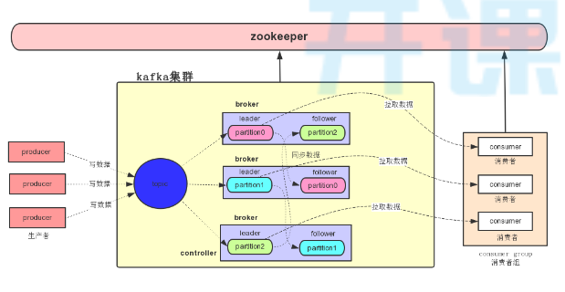
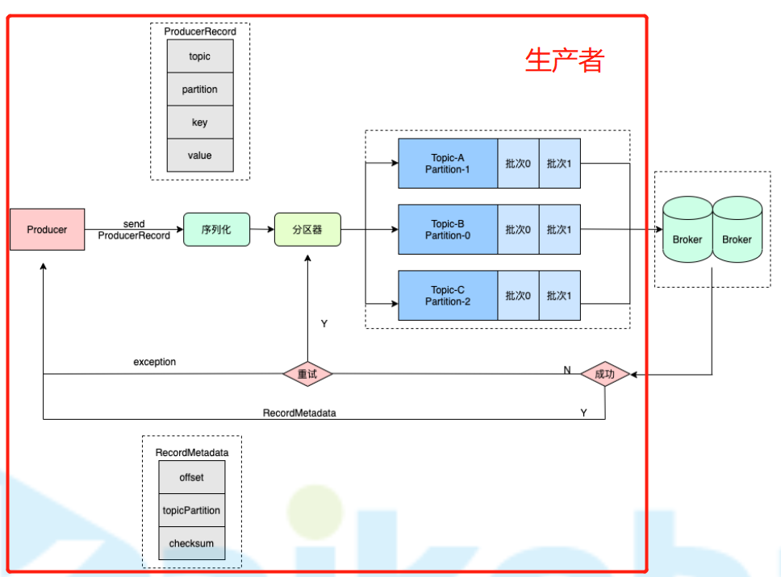

# 概述

## 系统结构

 

+ `zookeeper`作为注册中心，用于存储元数据，负责`leader`选举，`rebalance`

## 下载安装

+ 地址：http://kafka.apache.org/quickstart

+ 启动`zookeeper`

  ```sh
  nohup bin/zookeeper-server-start.sh config/zookeeper.properties >/dev/null 2>&1 &
  ```

  + 默认端口2181

+ 停止`zookeeper`

  ```
  bin/zookeeper-server-stop.sh
  ```

+ 启动`kafka`

  ```
  nohup bin/kafka-server-start.sh config/server.properties >/dev/null 2>&1 &
  ```

  + 默认端口9092

+ 停止`kafka`

  ```
  bin/kafka-server-stop.sh
  ```

# 集成

```xml
<dependency>
    <groupId>org.apache.kafka</groupId>
    <artifactId>kafka-clients</artifactId>
    <version>2.6.0</version>
</dependency>
```

## 生产者

### 发送流程

 

+ 将消息序列化
+ 根据`topic`、`position`选择分区
+ 批量发送消息时需要分批次发送
+ 发送失败后会进行重试


## 消费者


