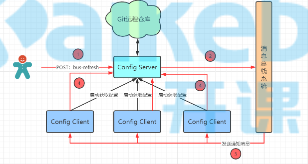
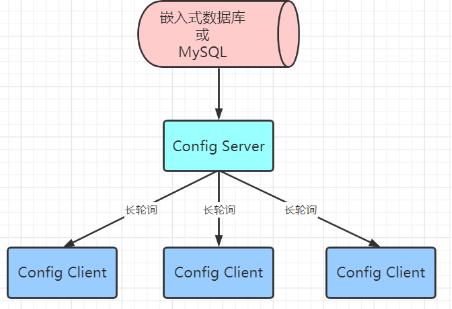
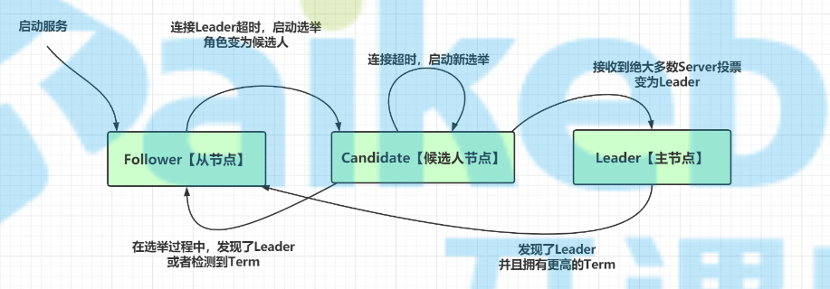
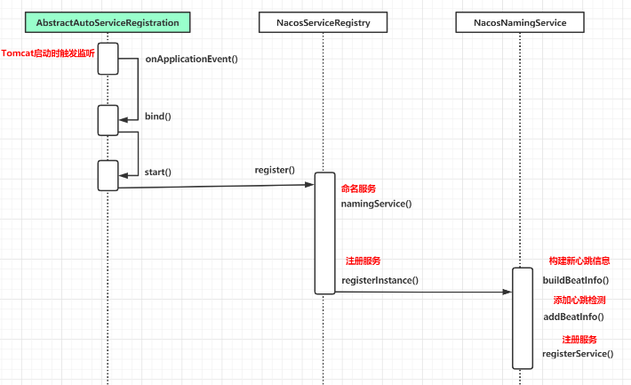
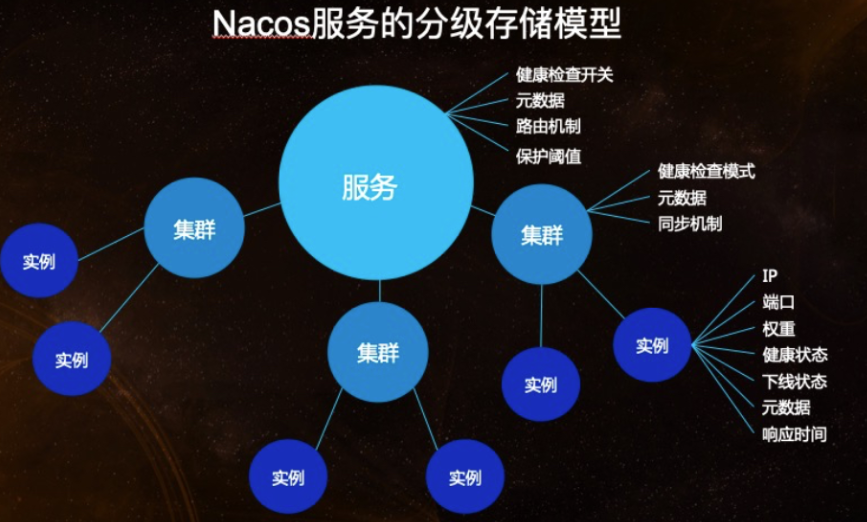
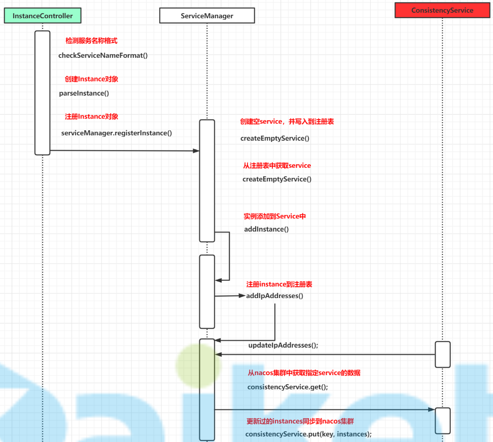
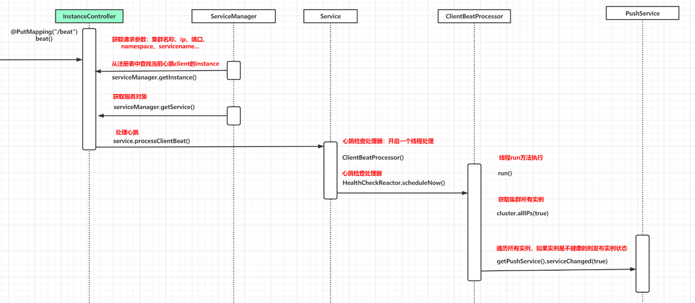

# nacos

+ 客户端定时从注册中心拉取信息，并缓存到本地，即使注册中心死掉了，也不影响服务服务调用

## 注册中心功能

+ 服务注册
+ 服务续约
+ 获取服务列表
+ 服务下线
+ 失效剔除

## 配置中心原理

### SpringCloudConfig

 

+ 提交配置触发post请求给server端的bus/refresh接口
+  server端接收到请求并发送给Spring Cloud Bus总线
+ Spring Cloud bus接到消息并通知给其它连接到总线的客户端
+ 其它客户端接收到通知，请求Server端获取最新配置
+ 全部客户端均获取到最新的配置

### NacosConfig

 

+ 客户端长轮询获取配置
+ 服务端
  + 每30s检查以下配置是否发生变化，如果有变化立即返回
  + 事件订阅方式保证数据发生变化立马返回给客户端

## CAP

+ 解释

  + C
    + 数据一致性
  + A
    + 可用性
    + 整个服务对外一直可用
  + P
    + 分区容错性
    + 各个分区存在通信失败问题
    + 这个问题一定存在，所以只能在`CP`和`AP`之间进行选择
    + C和A不可兼得是因为P的存在

+ nacos默认是AP的，可以发送请求修改为`CP`

  ```
  http://localhost:8848/nacos/v1/ns/operator/switches?entry=ServerMode&value=CP
  ```

+ `zookeeper`是`CP`的

## BASE理论

+ 解释
  + BA
    + 基本可用
    + 出现分区问题时，允许损失部分可用性
  + S
    + 软状态
    + 允许数据同步过程中存在中间状态
  + E
    + 最终一致性
+ `BASE`理论是对`CAP`定理的补充
+ 最重要的是**最终一致性**，只要保证了`最终一致性`，允许损失部分可用性，也允许数据存在中间状态

## RAFT算法

+ `raft`算法是`paxos`算法简化版

+ 用于领导者选举

### 概念

+ Leader：领导者，可以处理读写请求，向其他节点同步数据日志
+ Candidate：候选人节点，参与leader选举的节点
+ Follower：从节点
  + 可以处理读请求，需要处理主节点同步过来的数据日志
  + 可以称为候选人节点
  + 可以进行投票
+ Term：任期
  + 发起依次选举任期加1
  + 表示第几次选举

### 流程

 

+ 从节点
  + 正常状态下，如果收到`term`大于当前主节点的候选人发起的投票，则将票投给这个候选人，并且该`term`值只能投1次票
  + 如果与主节点心跳超时，则等待随机的一段时间（避免同时发起投票造成选举失败），将`term`加1，晋升为候选人节点，开始发起投票
+ 候选人
  + 接收到超半数（总节点数的半数）投票后，立即通知所有节点，他成为新的leader了
  + 接收到其他候选人当选，则退化为从节点
  + 投票超时，重新投票
+ 主节点
  + 发现了拥有更高`term`的leader，则退化为从节点

### 数据一致性

+ 客户端写入数据时，需要将数据同步给过半节点后，才返回成功的

+ 领导人完全原则

  领导者选举时，也会比较`logindex`，会将具有最新数据的节点选为领导人

+ 以上两个原则保证了各节点之间的数据一定是一致的，并且已提交数据不会丢失

### 脑裂

+ 因为网络问题导致节点之间通信出现问题，或出现选出两个leader的情况，这种情况叫做脑裂

## 源码解析

### Nacos客户端

#### Nacos与springcloud整合

+ 引入`spring-cloud-starter-alibaba-nacos-discovery`依赖后，自动引入了`spring-cloud-commons`这个依赖；这个依赖是`springcloud`组件必须引入的公共`jar`包，所有组件都需要和这个组件进行对接
+ `spring-cloud-commons`通过`SPI`机制加载`META-INF/spring.factories`中的配置类；其中`AutoServiceRegistrationAutoConfiguration`是关于注册中心的配置类，这个配置类中要求注入`AutoServiceRegistration`这个类

+ `spring-cloud-starter-alibaba-nacos-discovery`通过`SPI`机制加载`META-INF/spring.factories`中的配置类；其中`NacosServiceRegistryAutoConfiguration`中注入了`AutoServiceRegistration`的实现类`NacosAutoServiceRegistration`，这个就是`nacos`注册中心的入口

#### Nacos注册与续约

 

+ `NacosAutoServiceRegistration`是抽象类`AbstractAutoServiceRegistration`的子类，而`AbstractAutoServiceRegistration`是`ApplicationListener`的实现类，可以监听应用的各种事件
+ `AbstractAutoServiceRegistration`监听到服务启动的事件之后，依次调用`bind()`、`start()`方法，最终进入`NacosServiceRegistry#register()`方法
+ `NacosServiceRegistry#register()`方法先通过`namingservice()`方法获取命名服务，然后调用`namingService.registerInstance()`方法完成如下3件事：
  + 调用`beatReactor.buildBeatInfo()`方法构建心跳信息
  + 调用`beatReactor.addBeatInfo()`方法添加心跳检测任务
  + 调用`serverProxy.registerService()`方法注册服务

### Nacos服务端

#### 分级存储模型

 

Nacos考虑到了多机房的情况，所以服务一共分为3级：

+ 服务
  + 1个nacos客户端服务的名称对应Nacos中的服务
  + 1个服务包含多个集群
  + 对应源码中`Service`类
+ 集群
  + 隶属于某一个`Service`的多个服务实例的集群，一般对应1个机房
  + 对应源码中`Cluster`类
+ 实例
  + 具体服务实例
  + 对应`Instance`类

#### 处理注册心跳请求源码

+ 服务启动类：`console`模块 

##### 注册服务接口

+ `InstanceController#register()`

+ 时序图

   

##### 心跳接口

+ `InstanceController#beat()`

+ 时序图

   

# OpenFeign

## 请求压缩

+ feign使用的是http协议，请求相对其他协议需要传输更多字节，所以需求要通过压缩算法比请求体比较大的请求进行压缩

+ 相关配置

  ```yml
  # 配置开启请求压缩
  feign.compression.request.enabled: true
  # 配置开启响应压缩
  feign.compression.response.enabled: true
  # 设置压缩的内容数据类型
  feign.compression.request.mime-types: text/xml,application/xml,application/json
  # 压缩触发的最小大小，1kb压缩没有意义
  feign.compression.request.min-request-size: 2048
  ```

  