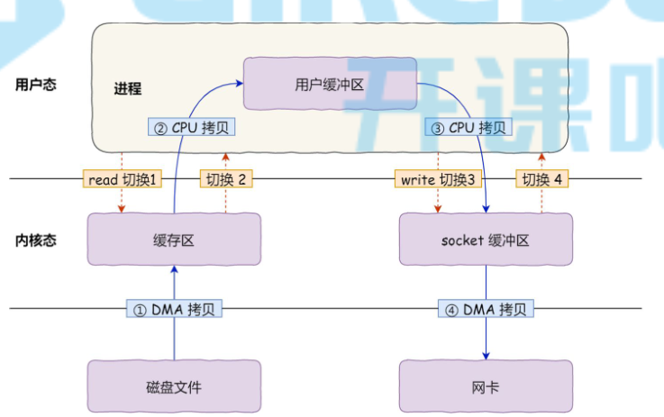
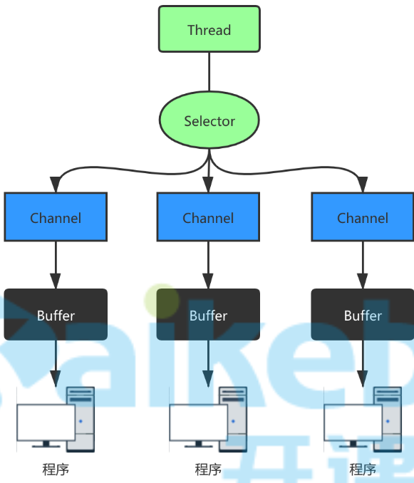

# IO模型

## 内核空间、用户空间

 

+ 内核空间：操作系统缓冲区
+ 用户空间：应用程序缓冲区
+ IO指的是磁盘和网络的IO操作

## IO模型类型

+ 同步

  调用者主动查看IO操作完成结果

+ 异步

  被调用者完成IO操作后主动通知调用者

+ 阻塞

  调用者在1个IO操作未完成前一致挂起，不进行其他操作

+ 非阻塞

  调用者在1个IO操作未完成前可以进行其他操作

+ 多路复用

  + 同步非阻塞方式
  + 同步方式通过轮询的方式执行多个IO操作

+ 信号驱动式

  不常用

## IO多路复用方案

+ linux下有3种方案：select、poll、epoll

+ 区别

  |            | select               | poll               | epoll                                             |
  | ---------- | -------------------- | ------------------ | ------------------------------------------------- |
  | 数据结构   | bitmap               | 数组               | 红黑树                                            |
  | 最大连接数 | 1024                 | 无上限             | 无上限                                            |
  | fd拷贝     | 每次调用`select`拷贝 | 每次调用`poll`拷贝 | 首次调用`epoll_ctl`拷贝；每次调用`epoll_wait`拷贝 |
  | 工作效率   | 轮询O(n)             | 轮询O(n)           | 回调：O(1)                                        |

## javaIO模型

### BIO

#### 介绍

+ 同步阻塞
+ 1个线程负责1个连接
+ 适用于连接数目比较小且固定的场景，容易造成资源浪费
+ 1.4以前的唯一选择
+ 位于`java.io`包下

#### 存在问题

+ BIO主要存在如下问题：
  + 每次产生新请求，需要创建和销毁1个线程，增加线程创建及销毁开销
  + 线程阻塞过程中处理其他线程时，存在线程上下文切换开销
  + 因为线程与请求时1对1关系，所以线程数限制了不能处理过多请求
+ 对于线程创建销毁开销问题，可以通过线程池解决（伪异步IO）
+ 其他问题需要在`NIO`中进行解决

### NIO

+ 同步非阻塞
+ 1个线程负责多个连接
+ 适用于连接数目多且连接比较短的场景
+ 1.4开始支持
+ 位于`java.nio`包下

### AIO（NIO2）

+ 异步非阻塞
+ 采用`Proactor`模式，有效的请求才启动线程
+ 适用于连接数较多，连接时间较长的场景
+ 不常用

### BIO与NIO区别

+ BIO面向流处理数据，NIO面向缓冲区处理数据，流只能读或写，缓冲区可读可写
+ `BIO`是阻塞的，`NIO`是非阻塞的
+ `BIO`1个线程只能处理1个请求，`NIO`1个线程可以处理多个请求

# NIO

## 原理

 

`NIO`中有3个重要的概念：

+ `selector`
  + 1个线程对应1个`selector`
  + 用于处理不同请求时在`channel`上进行切换
  + 每产生1个`channel`会注册到`selector`上
+ `channel`
  + 1个`channel`对应1个请求
  + 每个`channel`都有1个对应的`buffer`
+ `buffer`
  + 底层是数组
  + 是可读可写缓冲区

## Buffer

+ `Buffer`接口是个顶级

