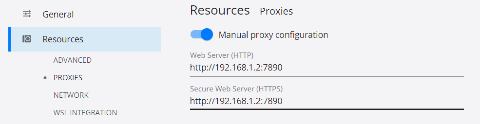
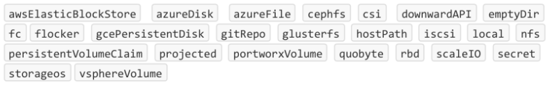
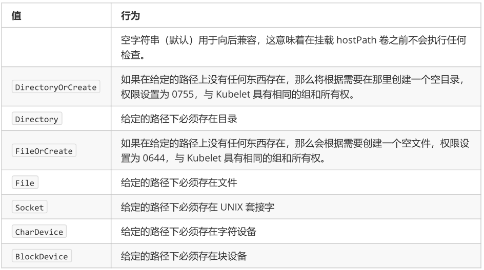
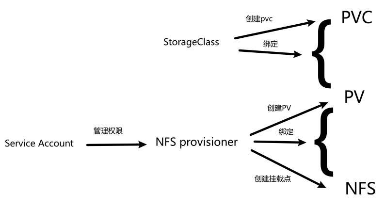
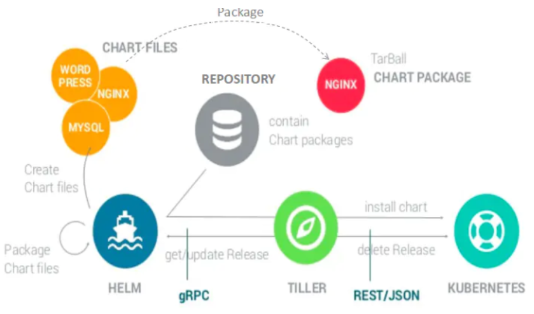
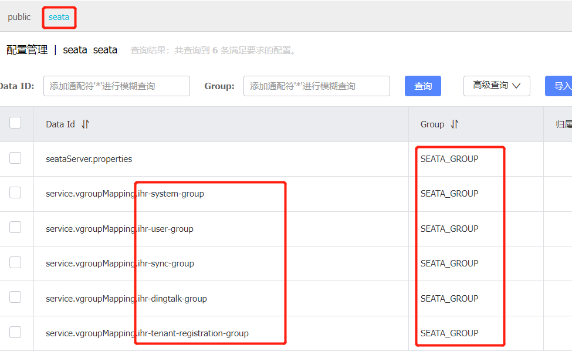

> + [k8s中文文档](http://docs.kubernetes.org.cn) 

# 介绍

## 主要功能

+ 数据卷：在`pod`之间共享数据
+ 健康检查：设置监控检查策略保证应用健壮性
+ 复制应用程序实例：控制器维护`Pod`副本数量
+ 弹性伸缩: 根据设定的指标（`CPU`利用率）自动缩放`Pod`副本数
+ 服务发现: 使用环境变量或`DNS`服务插件保证容器中程序发现`Pod`入口访问地址。
+ 负载均衡：一组`Pod`副本分配一个私有的集群`IP`地址，其他应用通过该`IP`访问时会根据负载均衡策略进行转发
+ 滚动更新：一次更新一个`Pod`，而不是同时删除整个服务
+ 服务编排: 通过文件描述部署服务，使得应用程序部署变得更高效。
+ 资源监控: `Node`节点组件集成`cAdvisor`资源收集工具，可通过`Heapster`汇总整个集群节点资源数据，然后存储到`InfluxDB`时序数据库，再由`Grafana`展示。
+ 提供认证和授权: 支持属性访问控制（`ABAC`）、角色访问控制（`RBAC`）认证授权策略。

## 架构


+ 发送请求：
  + `kubectl`命令
  + 浏览器（`rancher`、`dashboard`）
+ `scheduler`：调度器，负责计算pod应该部署到哪个`node`
+ `controller`：控制器，负责维护`node`节点资源对象
+ `apiserver`：网关
+ `etcd`：分布式键值数据库，用于存储节点信息
+ `node`节点：每个节点运行1个`kubelet`进程，用于维护本机得`pod`
+ `registry`：镜像仓库

## node节点


+ `pod`：`k8s`管理的最小单元，1个`pod`内一般只能运行1个容器
+ `docker`：创建容器的基础服务
+ `kubelet`：`master`节点发来的请求都由`kubelet`在本机代理执行
+ `kube-proxy`：网络代理，用于生成网络规则，创建访问路由，`service`网络访问规则，负载均衡规则
+ `fluentd`：收集日志

## 知识点

+ `k8s`中所有资源对象都以`yaml`配置文件得形式存储在`etcd`中

# 安装

## 主从通用配置

### 环境要求

+ CPU核数 >= 2
+ 内存 >= 2G
+ linux内核版本 >= 4
  + `uname -r`查看
  + 后面可以进行升级

### 环境准备

+ 安装依赖

  ```shell
  $ yum install -y conntrack ntpdate ntp ipvsadm ipset jq iptables curl sysstat libseccomp wget vim net-tools git iproute lrzsz bash-completion tree bridge-utils unzip bind-utils gcc
  ```

+ 关闭防火墙

  ```shell
  $ systemctl stop firewalld && systemctl disable firewalld
  ```

+ 安装`iptables`并置空规则，用于后续使用`iptables`实现`k8s`得负载均衡

  ```shell
  $ yum -y install iptables-services && systemctl start iptables && systemctl enable iptables && iptables -F && service iptables save
  ```

+ 关闭swap分区（虚拟内存）

  ```shell
  $ swapoff -a && sed -i '/ swap / s/^\(.*\)$/#\1/g' /etc/fstab
  ```

+ 关闭`selinux`

  ```shell
  $ setenforce 0 && sed -i 's/^SELINUX=.*/SELINUX=disabled/' /etc/selinux/config
  ```

+ 升级linux内核

  ```shell
  $ rpm -Uvh https://www.elrepo.org/elrepo-release-7.el7.elrepo.noarch.rpm
  $ yum --enablerepo=elrepo-kernel install -y kernel-lt
  # 查看可选内核
  $ awk -F\' '$1=="menuentry " {print $2}' /etc/grub2.cfg
  # 选择1个内核作为默认启动内核（从0开始）
  $ grub2-set-default 0
  # 重启生效
  $ reboot
  # 查看内核版本
  $ uname -r
  ```

+ 配置时间

  + 设置时区

    ```shell
    $ timedatectl set-timezone Asia/Shanghai
    ```

  + 安装`ntpd`自动同步时间，utc时间写入RTC时钟

    ```shell
    $ ntpdate cn.pool.ntp.org
    ```

  + 重启服务器，使依赖时间得服务应用新的时间

+ 根据`k8s`需要，配置内核参数

  ```shell
  # 创建配置文件
  $ cat > /etc/sysctl.d/kubernetes.conf <<EOF
  net.bridge.bridge-nf-call-iptables=1
  net.bridge.bridge-nf-call-ip6tables=1
  net.ipv4.ip_forward=1
  net.ipv4.tcp_tw_recycle=0
  vm.swappiness=0
  vm.overcommit_memory=1
  vm.panic_on_oom=0
  fs.inotify.max_user_instances=8192
  fs.inotify.max_user_watches=1048576
  fs.file-max=52706963
  fs.nr_open=52706963
  net.ipv6.conf.all.disable_ipv6=1
  net.netfilter.nf_conntrack_max=2310720
  EOF
  # 立即生效
  $ sysctl -p /etc/sysctl.d/kubernetes.conf
  ```

+ 配置日志管理服务`journal`，用于管理`k8s`日志

  ```shell
  # 日志保存目录
  $ mkdir /var/log/journal
  # 配置文件存放目录
  $ mkdir /etc/systemd/journald.conf.d
  # 创建配置文件
  $ cat > /etc/systemd/journald.conf.d/99-prophet.conf <<EOF
  [Journal]
  Storage=persistent
  Compress=yes
  SyncIntervalSec=5m
  RateLimitInterval=30s
  RateLimitBurst=1000
  SystemMaxUse=10G
  SystemMaxFileSize=200M
  MaxRetentionSec=2week
  ForwardToSyslog=no
  EOF
  # 重启journald 加载配置
  $ systemctl restart systemd-journald
  ```

+ 为`kube-proxy`开启`ipvs`做准备

  > `kube-proxy`用于为`k8s`中得`service`构建路由规则；可以基于`iptables`或`ipvs`实现，`ipvs`比`iptables`能支持更多得路由规则

  ```shell
  # 向内核安装桥接模式防火墙模块`br_netfilter`
  $ modprobe br_netfilter
  # 向内核安装 ipvs 相关模块得脚本
  $ cat > /etc/sysconfig/modules/ipvs.modules <<EOF
  #!/bin/bash
  modprobe -- ip_vs
  modprobe -- ip_vs_rr
  modprobe -- ip_vs_wrr
  modprobe -- ip_vs_sh
  modprobe -- nf_conntrack
  EOF
  # 修改权限并执行脚本，并查看这些文件是否被引导
  $ chmod 755 /etc/sysconfig/modules/ipvs.modules && bash /etc/sysconfig/modules/ipvs.modules && lsmod | grep -e ip_vs -e nf_conntrack_ipv4
  ```

### 配置docker

+ Cgroup Driver

  + Docker 在默认情况下使用的 Cgroup Driver 为 `cgroupfs`，可以通过`docker info`命令查看

  + 而 Kubernetes 其实推荐使用 `systemd` 来代替 `cgroupfs`，`Cgroup Driver`不一致会导致安装`k8s`时报错

    ```
    failed to create kubelet: misconfiguration: kubelet cgroup driver: "cgroupfs" is different from docker cgroup driver: "systemd"
    ```

  + Docker修改`Cgroup Driver`为`systemd`

    + 编辑 `/etc/docker/daemon.json` ，添加如下启动项参数

      ```json
      {
        "exec-opts": ["native.cgroupdriver=systemd"]
      }
      ```

    + 重启docker

+ 开机启动

  ```
  systemctl enable docker
  ```

### 安装K8S

> + k8s得3种安装方式：
>   + 二进制：负责
>   + kubeadm安装：简单，官方推荐
>   + 可视化界面（如rancher）
> + 我们这里使用kubeadm安装

```shell
# 创建`repo`文件，从阿里云安装kubeadm
$ cat <<EOF > /etc/yum.repos.d/kubernetes.repo
[kubernetes]
name=Kubernetes
baseurl=http://mirrors.aliyun.com/kubernetes/yum/repos/kubernetes-el7-x86_64
enabled=1
gpgcheck=0
repo_gpgcheck=0
gpgkey=http://mirrors.aliyun.com/kubernetes/yum/doc/yum-key.gpg
		http://mirrors.aliyun.com/kubernetes/yum/doc/rpm-package-key.gpg
EOF
# 安装kubeadm、kubelet、kubectl
$ yum install -y kubeadm kubelet kubectl
# 启动 kubelet
$ systemctl enable kubelet && systemctl start kubelet
```

### 集群镜像下载

+ k8s需要得docker镜像下载

  + 查看需要哪些镜像

    ```shell
    $ kubeadm config images list
    ```

  + 从国内镜像仓库下载，并重命名

    ```
    docker pull registry.aliyuncs.com/google_containers/kube-apiserver:v1.23.4
    docker tag registry.aliyuncs.com/google_containers/kube-apiserver:v1.23.4 k8s.gcr.io/kube-apiserver:v1.23.4
    docker rmi registry.aliyuncs.com/google_containers/kube-apiserver:v1.23.4
    
    docker pull registry.aliyuncs.com/google_containers/kube-controller-manager:v1.23.4
    docker tag registry.aliyuncs.com/google_containers/kube-controller-manager:v1.23.4 k8s.gcr.io/kube-controller-manager:v1.23.4
    docker rmi registry.aliyuncs.com/google_containers/kube-controller-manager:v1.23.4
    
    docker pull registry.aliyuncs.com/google_containers/kube-scheduler:v1.23.4
    docker tag registry.aliyuncs.com/google_containers/kube-scheduler:v1.23.4 k8s.gcr.io/kube-scheduler:v1.23.4
    docker rmi registry.aliyuncs.com/google_containers/kube-scheduler:v1.23.4
    
    docker pull registry.aliyuncs.com/google_containers/kube-proxy:v1.23.4
    docker tag registry.aliyuncs.com/google_containers/kube-proxy:v1.23.4 k8s.gcr.io/kube-proxy:v1.23.4
    docker rmi registry.aliyuncs.com/google_containers/kube-proxy:v1.23.4
    
    docker pull registry.aliyuncs.com/google_containers/pause:3.6
    docker tag registry.aliyuncs.com/google_containers/pause:3.6 k8s.gcr.io/pause:3.6
    docker rmi registry.aliyuncs.com/google_containers/pause:3.6
    
    docker pull registry.aliyuncs.com/google_containers/etcd:3.5.1-0
    docker tag registry.aliyuncs.com/google_containers/etcd:3.5.1-0 k8s.gcr.io/etcd:3.5.1-0
    docker rmi registry.aliyuncs.com/google_containers/etcd:3.5.1-0
    
    docker pull coredns/coredns:1.8.6
    docker tag coredns/coredns:1.8.6 k8s.gcr.io/coredns/coredns:v1.8.6
    docker rmi coredns/coredns:1.8.6
    ```

### 自动更新`ntpd`时间

```
$ timedatectl set-ntp yes
$ systemctl stop ntpd
$ ntpd -gq
$ systemctl start ntpd
$ systemctl enable ntpd
```

## 主节点配置


### 部署

+ 拉取资源配置文件

  ```shell
  $ kubeadm config print init-defaults > kubeadm-config.yaml
  ```

+ 修改资源配置文件

  ```yaml
  localAPIEndpoint:
    # 修改为本机ip
    advertiseAddress: 192.168.10.8
  nodeRegistration:
    # 指定节点名称
    name: k8s-master
  # 修改版本为执行 kubeadm config images list 后 kube-*包得版本
  kubernetesVersion: 1.23.4
  networking:    
    # 指定flannel模型通信 service 网段地址
    serviceSubnet: 20.96.0.0/16
    # 指定flannel模型通信 pod网段地址,此网段和flannel网段一致  
    podSubnet: 20.244.0.0/16
    
  # 指定使用ipvs进行通信
  ---    
  apiVersion: kubeadm.k8s.io/v1beta3
  kind: kubeProxyConfiguration
  featureGates:
    SupportIPVSProxyMode: true
  mode: ipvs
  ```

+ 初始化主节点，开始部署

  ```shell
  $ kubeadm init --config=kubeadm-config.yaml --upload-certs | tee kubeadm-init.log
  ```

+ 打印如下信息表示安装成功

  ```
  Your Kubernetes control-plane has initialized successfully!
  
  To start using your cluster, you need to run the following as a regular user:
  
    mkdir -p $HOME/.kube
    sudo cp -i /etc/kubernetes/admin.conf $HOME/.kube/config
    sudo chown $(id -u):$(id -g) $HOME/.kube/config
  
  Alternatively, if you are the root user, you can run:
  
    export KUBECONFIG=/etc/kubernetes/admin.conf
  
  You should now deploy a pod network to the cluster.
  Run "kubectl apply -f [podnetwork].yaml" with one of the options listed at:
    https://kubernetes.io/docs/concepts/cluster-administration/addons/
  
  Then you can join any number of worker nodes by running the following on each as root:
  
  kubeadm join 192.168.10.8:6443 --token abcdef.0123456789abcdef \
          --discovery-token-ca-cert-hash sha256:6655246a71133a6d186378b4271918c0501d6605577cfbb0206fcb74e30419f2
  ```

+ 按照安装结果执行建议的操作

  ```shell
  $ echo "export KUBECONFIG=/etc/kubernetes/admin.conf" >> /etc/profile
  $ source /etc/profile
  ```

### flannel插件

+ 无法直接下载，需要在浏览器访问[flannel插件配置文件](https://raw.githubusercontent.com/coreos/flannel/master/Documentation/kube-flannel.yml)并下载，上传至服务器

+ 修改`pod`地址池与`kubeadm-config.yaml`文件保持一致

+ 部署`flannel`

  ```shell
  $ kubectl create -f kube-flannel.yaml
  ```

### 允许主节点部署`pod`（可选）

```
kubectl taint nodes --all node-role.kubernetes.io/master-
```

## 从节点加入集群

### 配置host

+ 设置本机hostname

  ```shell
  # 设置本机hostname
  $ hostnamectl set-hostname k8s-01
  # 查看hostname
  $ hostname
  ```

### 加入集群

在从节点执行主节点集群安装成功后打印的信息

```
kubeadm join 192.168.10.8:6443 --token abcdef.0123456789abcdef \
        --discovery-token-ca-cert-hash sha256:6655246a71133a6d186378b4271918c0501d6605577cfbb0206fcb74e30419f2
```

### 重新生成加入集群命令

+ 生成`worker`节点加入集群命令

  ```shell
  # 主节点执行
  $ kubeadm token create --print-join-command
  ```

+ 生成`master`节点加入集群命令

  ```shell
  # 在上面命令基础上，还需要生成 certificate-key
  $ kubeadm init phase upload-certs --experimental-upload-certs
  # 将两步生成结果拼接起来使用
  ```

### 重新加入集群

+ 执行`kubeadm reset`重置节点状态
+ 原主节点执行`kubectl delete node xxx`删除节点
+ 然后正常加入新集群

## NFS安装

+ 所有提供网络存储空间的设备按如下方式执行

  ```sh
  $ yum install nfs-utils -y
  $ mkdir /opt/k8s/nfs
  $ vim /etc/exports
  /opt/k8s/nfs 192.168.30.0/24(rw,no_root_squash)
  $ systemctl enable nfs & systemctl restart nfs
  ```

+ 如需测试，使用网络存储空间的设备按如下方式执行

  ```sh
  $ yum install nfs-utils -y
  $ mount -t nfs 192.168.30.27:/opt/k8s/nfs /opt/k8s/nfs
  ```


## helm安装

+ 从[github](https://github.com/helm/helm/releases)下载，解压后将`helm`文件移动到`usr/local/bin`目录下

## Ingress安装

+ `helm`下载`chart`

  ```
  helm repo add ingress-nginx https://kubernetes.github.io/ingress-nginx
  helm fetch ingress-nginx/ingress-nginx
  ```

+ 替换镜像

  + 在`values.yaml`文件中搜索`image:`关键字，找到要下载的镜像

  + 本地开启`vpn`，`docker desktop`设置代理

     

  + 本地拉取镜像并上传至私有镜像仓库

  + `values.yaml`中镜像地址、镜像名称、`Digest`修改为私有仓库信息

+ 修改`values.yaml`其他配置

  ```yaml
    dnsPolicy: ClusterFirstWithHostNet
    hostNetwork: true # 使用 80/443端口，必须使用主机网络
    hostPort:
      enabled: true
    publishService:
      enabled: false
    kind: DaemonSet # 每个节点部署1g
  service:
   enabled: false
  ```

+ 部署

  ```sh
  # 安装
  $ helm install ingress-nginx . -n kube-system
  ```

+ 配置自定义`default-backend`

  + 目的是解决`Host头攻击漏洞`

  + 创建自定义`default-backend`服务

    ```yaml
    kind: ConfigMap
    apiVersion: v1
    metadata:
      name: default-backend-nginx
      namespace: kube-system
    data:
      default.conf: |
        server {
          listen 80;
          server_name _;
          
          return 403;
        }
    ---
    kind: Service
    apiVersion: v1
    metadata:
      name: my-default-backend
      namespace: kube-system
    spec:
      ports:
        - name: http
          protocol: TCP
          port: 80
          targetPort: 80
      selector:
        app: my-default-backend
      type: ClusterIP
    ---
    kind: Deployment
    apiVersion: apps/v1
    metadata:
      name: my-default-backend
      namespace: kube-system
    spec:
      replicas: 1
      selector:
        matchLabels:
          app: my-default-backend
      template:
        metadata:
          labels:
            app: my-default-backend
        spec:
          volumes:
            - name: default-backend-nginx
              configMap:
                name: default-backend-nginx
          containers:
            - name: my-default-backend
              image: nginx
              ports:
                - name: http
                  containerPort: 80
                  protocol: TCP
              volumeMounts:
                - name: default-backend-nginx
                  mountPath: /etc/nginx/conf.d
              imagePullPolicy: IfNotPresent
    ```

  + 编辑`DaemonSet/ingress-nginx-controller`配置，增加如下选项

    ```yaml
    	spec:
          containers:
            - name: controller
              args:
                # 增加这行
                - '--default-backend-service=kube-system/my-default-backend'
    ```

  + 编辑`configmap/ingress-nginx-controller`新增如下这行

    ```yaml
    custome-http-errors: 403,404,500,502,503,504
    ```

## dashboard安装

### token登陆

+ 执行如下命令下载`chart`

  ```sh
  helm repo add k8s-dashboard https://kubernetes.github.io/dashboard
  helm fetch k8s-dashboard/kubernetes-dashboard
  ```

+ 解压后修改`values.yaml`

  ```yaml
  # 通过ingress暴露https服务
  ingress:
    enabled: true
    className: "nginx"
    hosts:
      - k8s.xtbg.com
    tls:
      - secretName: kubernetes-dashboard-tls
        hosts:
          - k8s.xtbg.com
  ```

+ 创建`secret`资源`kubernetes-dashboard-tls`

  ```sh
  openssl genrsa -out tls.key 1024
  openssl req -new -x509 -key tls.key -out tls.crt -subj /C=CN/ST=Shanghai/L=Shanghai/O=DevOps/CN=k8s.xtbg.com
  kubectl create secret tls kubernetes-dashboard-tls --cert=tls.crt --key=tls.key -n kube-system
  ```

+ 使用如下命令部署应用

  ```
  helm install kubernetes-dashboard . -n kube-system
  ```

+ 绑定权限

  ```sh
  # 安装后默认生成了名为 kubernetes-dashboard 的serviceAccount，和名为 clusterAdmin 的 clusterRole
  # 为两者创建绑定关系
  $ kubectl create clusterrolebinding dashboard-cluster-admin  --clusterrole=cluster-admin --serviceaccount=kube-system:kubernetes-dashboard
  # 查看名为 kubernetes-dashboard 的 serviceAccount 关联的secret
  $ kubectl describe serviceaccount kubernetes-dashboard -n kube-system
  # 查看token; kubernetes-dashboard-token-wlsms 是上条命令查询结果的 Mountable secrets 属性的值
  $ kubectl describe secret kubernetes-dashboard-token-wlsms -n kube-system
  # 将查询出的token复制进登录页登陆
  ```

### 账号密码登陆（暂时不好使）

+ 执行如下命令下载`chart`

  ```sh
  helm repo add k8s-dashboard https://kubernetes.github.io/dashboard
  helm fetch k8s-dashboard/kubernetes-dashboard
  ```

+ 解压后修改`values.yaml`

  ```yaml
  # 1.使用basic认证
  extraArgs:
    - --authentication-mode=basic
  # 2.通过ingress暴露https服务
  ingress:
    enabled: true
    className: "nginx"
    hosts:
      - k8s.xtbg.com
    tls:
      - secretName: kubernetes-dashboard-tls
        hosts:
          - k8s.xtbg.com
  ```

+ 创建`secret`资源`kubernetes-dashboard-tls`

  ```sh
  openssl genrsa -out tls.key 1024
  openssl req -new -x509 -key tls.key -out tls.crt -subj /C=CN/ST=Shanghai/L=Shanghai/O=DevOps/CN=k8s.xtbg.com
  kubectl create secret tls kubernetes-dashboard-tls --cert=tls.crt --key=tls.key -n kube-system
  ```

+ 使用如下命令部署应用

  ```
  helm install kubernetes-dashboard . -n kube-system
  ```

+ 配置`BASIC`认证账号密码文件

  + 创建账号密码文件

    ```
    echo "admin,admin,1" > /etc/kubernetes/pki/basic_auth_file
    ```

  + 根据[文档](https://kubernetes.io/zh/docs/reference/access-authn-authz/abac/#%E7%AD%96%E7%95%A5%E6%96%87%E4%BB%B6%E6%A0%BC%E5%BC%8F)创建策略文件

  + 修改`/etc/kubernetes/manifests/kube-apiserver.yaml`

    ```yaml
    # 修改
    - --authorization-mode=Node,RBAC
    # 增加如下配置
    - --token-auth-file=/etc/kubernetes/pki/basic_auth_file
    - --authorization-policy-file=/etc/kubernetes/pki/abac_policy.jsonl
    # 不要配置不允许匿名登陆，会导致存活指针无法探测，apiServer频繁重启
    # - --anonymous-auth=false
    ```

    + 生效

      ```
      systemctl daemon-reload
      systemctl restart kubelet
      ```

    + 每次修改`/etc/kubernetes/pki/basic_auth_file`文件需要重启`k8s`

+ 为`admin`用户绑定权限

  ```
  kubectl create clusterrolebinding login-on-dashboard-with-cluster-admin --clusterrole=cluster-admin --user=admin
  ```

# 资源控制器

## 什么是控制器

+ k8s中内建了很多`controller`（控制器），用来控制`Pod`的具体状态和行为

   

+ `Pod`分类

  + 自主式`pod`，不被控制器管理，退出了不会被重新创建
  + 控制器管理的`pod`，退出了会被重新创建

## 重要控制器

### Replication

+ 用来确保容器应用的副本数始终保持在用户定义的副本数,即如果有容器异常退出,会自动创建新的Pod来替代;而如果异常多出来的容器也会自动回收;

### ReplicaSet

+ 在新版本的`k8s`中建议使用`Replicaset`来取代`ReplicationController`. 他俩没有本质的不同,只是名字不一样,并且`ReplicaSet`支持集合式的`selector`（标签选择器）

+ `RS`可以单独使用，但是一般使用`Deployment`管理`RS`，可以避免与其他机制不兼容（如：`RS`不支持滚动更新）

### Deployment

+ 无状态服务部署控制器

+ `Deployment`为`Pod`和`ReplicaSet`提供了一个声明式定义(`declarative`)方法,用来替代以前的`ReplicationController`来方便的管理应用。典型的应用场景包括;

  + 定义`Deployment`来创建`Pod`和`ReplicaSet`
  + 滚动升级和回滚应用
  + 扩容和缩容
  + 暂停和继续`Deployment`

+ `Deployment`更新策略

  + `Deployment`可以保证在升级时只有一定数量的`Pod`是`down`的。默认的,它会确保至少有比期望的`Pod`数量少一个是`up`状态(最多一个不可用)
  + `Deployment`同时也可以确保只创建出超过期望数量的一定数量的`Pod`,默认的,它会确保最多比期望的`Pod`数量多一个的`Pod`是`up`的(最多1个`surge `)
  + 未来的`k8s`版本中,将从1-1变成25%-25%

  ```
  kubect1 describe deployments
  ```

+ 滚动更新流程

   

  + `Deployment`+`ReplicaSet`的拓扑结构是：`Deployment`管理`ReplicaSet`，`ReplicaSet`管理`pod`
  + 当进行滚动更新时，`Deployment`会创建1个新的`ReplicaSet`，新的`ReplicaSet`每创建1个新的`pod`，旧的`ReplicaSet`就会停掉1个旧的`pod`

+ 回滚

  + 滚动更新流程结束后，旧的`ReplicaSet`并不会删掉，但是旧的`pod`会删除
  + 当需要进行回滚时，使用旧的`ReplicaSet`逐个创建并启动老版本`pod`，并停掉新的`pod`

### HPA

+ 全称：`Horizontal Pod Autoscaling`，pod自动水平缩放

+ 仅适用于 `Deployment `和 `ReplicaSet`

+ 在`V1`版本中仅支持根据Pod的CPU利用率扩容，在`vlalpha`版本中，支持根据内存和用户自定义的metric扩缩容

+ 拓扑结构

   

  + 事先需要配置`pod`伸缩容规则
  + `HPA`对`ReplicaSet`进行监听，如果`ReplicaSet`下`pod`达到扩容条件（如`pod`的`cpu`利用率达到80%)，则将进行扩容，如果`ReplicaSet`下`pod`达到缩容条件（如`pod`的`cpu`利用率低于50%)，则将进行缩容

### StatefulSet

+ 用于部署有状态服务
+ 有状态服务会有自己得数据卷，当pod宕机后，重启新的pod时，`statefulset`会让新的`pod`使用旧的数据卷，基于`pvc`实现
+ `pod`重建后，`ip`发生变化，但是`PodName`和`HostName`不会改变，基于`headless service`实现
+ 有序部署，有序扩展，有序收缩；按照预设顺序依次进行，后面的`pod`执行的前提是前面的`pod`必须是`running`状态；基于`init containers`实现
+ `statefulSet`管理的`pod`的名称规则：`StatefulSetName-N`；`N`表示第几个`pod`
+ 挂在`pv`方式
  + 声明方式
    + 手动创建`PVC`，使用`valumns`挂载`pvc`
    + 所有`pod`绑定同一个`pvc`

  + 模板方式
    + 自动创建`pvc`，使用`volumeClaimTemplates`直接指定要使用的数据卷信息
    + 自动创建的`pvc`命令规则：`volumeClaimTemplatesName-StatefulSetName-N`
    + 每个`pod`绑定自己的`pvc`


### DaemonSet

+ 为所有或部分节点创建`pod`，每个节点只运行1个副本
+ 比如每个节点需要有1个监控服务器状态的pod时使用

### Persistent Volume

+ 管理维护`Persistent volume`和`Persistent volume Claim`
+ 负责持久化存储，为有状态服务准备

### Job

+ 任务控制器，每个pod只处理1次

### CronJob

+ 在Job基础上加上定时任务调度

## 其他控制器

### node

+ 维护管理`node`，定期检查`node`健康状态

### Namespace

+ 定期清理无效namespace

### Service

+ 管理维护`service(IP)`，提供负载以及服务代理

### Endpoint

+ 管理维护`endpoint`，关联`service`和`pod`

### service account

+ 为每个`namespace`创建默认的`account`和`secret`

# Pod核心原理

## Pod是什么

+ `pod`特点
  + 有自己的`IP`
  + 有自己的`hostname`
+ `pod`相当于1台独立的虚拟主机，内部封装的是由docker引擎创建的容器

## pause容器 

+ 1个`pod`在启动时，跟随`pod`同时启动了1个`pause`容器，该容器提供了1个虚拟共享网卡和1个共享数据卷，分别用于网络通信和持久化

   

+ `pause`容器为业务容器提供以下功能：

   

  + `PID`命名空间：`pod`的进程识别号
  + 网络命名空间：`pod`内容器使用同一套`IP`和端口
  + `IPC`命名空间：`pod`内容器使用`SystemV IPC`或`POSIX`消息队列进行通信
  + `UTS`命名空间：`pod`内容器共享1个主机名
  + 共享数据卷：`pod`内容器可以访问`pod`级别数据卷

## 特点

+ 无状态服务得pod重建后，IP、hostname都会发生变化；有状态服务pod重建后，ip变化，hostname不变，用以找到之前得数据卷

## pod生命周期

 

+ pod启动后，依次执行3个初始化容器（包含`pause`容器），直至执行成功再向下执行

+ 随后启动主容器

+ 主容器刚刚启动成功后，立即调用初始化钩子（`post start`）

+ 主容器退出前，执行终止前钩子（`pre stop`）

+ 在主容器存活期间，始终存在2个探针

  + 就绪探针（`readiness probe`）
  + 存活探针（`liveness probe`）

  探针发现任何异常，则会按照重启策略重启pod

# 组件

## Lable

+ `k8s`中所有资源对象都可以打标签，方便对资源进行分组
+ 1个资源对象可以有多个标签

## 标签选择器

+ 单个标签选择器

  + 只能通过1个标签条件进行匹配

+ 复合标签选择器

  + 能通过多个标签条件进行匹配

  + 如

    ```
    Selector:
    	app = MyApp
    	release = stable
    ```

## Pod Template

+ `k8s`中所有资源都会以`yaml`配置文件的形式保存在`etcd`中
+ `pod`在`etcd`中的定义就是`pod template`

## service

+ `service`就是同一服务创建得多个副本`pod`得集合，对外提供相同功能得服务

+ `service`是自己创建得

+ 配置文件

  ```yaml
  apiVersion: v1
  kind: Service
  # 元信息
  metadata:
    # 创建时间
    creationTimestamp: "2021-07-09T01:14:31Z"
    # 标签
    labels:
      run: myapp
    # service 名称
    name: myapp
    # 命名空间
    namespace: default
    # 版本
    resourceVersion: "469555"
    # 唯一标识
    uid: d39d224e-4f7e-41fd-a574-8d292f232367
  # service定义信息
  spec:
    # serviceIP
    clusterIP: 10.106.21.206
    # 集群中所有serviceIP
    clusterIPs:
    - 10.106.21.206
    # IP类型
    ipFamilies:
    - IPv4
    ipFamilyPolicy: SingleStack
    # 端口，可多个
    ports:
      # service端口
    - port: 30000
      # 协议
      protocol: TCP
      # pod端口
      targetPort: 80
      # node端口，spec.type=NodePort时有效，
      # 不指定nodePort时将在 30000~32767 之间随机1个端口
      nodePort: 31000
    # 选择器
    selector:
      run: myapp
    sessionAffinity: None
    # service 类型，可选值如下：
    #   ClusterIP：默认；可在集群内使用 serviceIP访问服务
    #   NodePort：将service端口映射到集群所有节点的宿主机端口上
    #   LoaderBalancer：常见于云服务提供商，以后研究
    type: ClusterIP
  status:
    loadBalancer: {}
  ```

### headless service

+ 是1种特殊的`service`，需要将`spec.ClusterIP`设置为`None`
+ 不对外提供统一的`Service VIP`，不做负载均衡，将`POD`的`IP`直接暴露
+ 适用于有状态服务部署，如`redis`，客户端需要知道所有`redis`节点地址，在客户端做负载

## ingress

### 介绍

+ `service`对外暴露端口很多时不便管理，可以借助`ingress`通过`域名+路径`减少对外暴露端口

+ `ingress`本质就是`nginx`的二次开发

+ [官网](https://kubernetes.github.io/ingress-nginx/) 

+ 安装参见[ingress安装](#ingress安装) 

+ ingress有两个实现版本

  两者使用上略有差异

  + `networking.k8s.io/v1`：k8s官网版本`ingress-nginx`
  + `extensions/v1beta1`：nginx官方版本`nginx-ingress`

+ 配置转发规则

  将`ingress`配置文件应用后即可实现转发

  + http

    ```yaml
    kind: Ingress
    apiVersion: networking.k8s.io/v1
    metadata:
      name: health-app
      namespace: health-tst
      labels:
        app: health-app
      annotations:
        nginx.ingress.kubernetes.io/proxy-body-size: 50m
    spec:
      ingressClassName: nginx
      rules:
        - host: dingappk8s.faw-vw.com
          http:
            paths:
              - pathType: ImplementationSpecific
                path: /portal
                backend:
                  service:
                    name: health-app
                    port:
                      number: 80
                     
    ```
    
  + https

    + 生成私钥

      ```
      openssl genrsa -out tls.key 1024
      ```

    + 自签发证书

      ```
      openssl req -new -x509 -key tls.key -out tls.crt -subj /C=CN/ST=Shanghai/L=Shanghai/O=DevOps/CN=ingress.kaikeba.com
      ```

    + 创建K8S使用的证书配置文件Secret

      ```
      kubectl create secret tls tomcat-ingress-secret --cert=tls.crt --key=tls.key
      ```

    + 创建带tls认证的tomcat后端服务

      ```yaml
      apiVersion: extensions/v1beta1
      kind: Ingress
      metadata:  
        name: ingress-tomcat-tls  
        namespace: default  
        annotations:    
          kubernetes.io/ingress.class: "nginx" 
          nginx.ingress.kubernetes.io/proxy-body-size: 50m
        labels:    
          app: tomcat
      spec:  
        tls:  
        - hosts:    
          - tomcat.ikiwi.me    
          secretName: tomcat-ingress-secret  
        rules:  
        - host: ingress.kaikeba.com 
          http:      
            paths:        
            - backend:            
              serviceName: tomcat            
              servicePort: 8080
      ```

### 注解

+ 配置新旧服务版本流量权重

  `nginx.ingress.kubernetes.io/service-weight: ""`

+ 重写URI

  `nginx.ingress.kubernetes.io/rewrite-target: /`

+ 请求体大小限制

  + `networking.k8s.io/v1`

    `nginx.ingress.kubernetes.io/proxy-body-size: 50m`

  + `extensions/v1beta1`

    `nginx.org/client-max-body-size: 50m`

# 网络

> + [全网最详细的 K8s Service 不能访问排查流程](https://zhuanlan.zhihu.com/p/161464741) 

## 内部访问

+ 内部访问指的是`k8s`集群内访问

+ pod内：ip、service名称

  > pod内能通过service名称访问就是因为`pod`内`resolv.conf`配置了`k8s`得`dns`服务地址

+ 宿主机：ip

  > 宿主机如果想通过服务名称访问，需要在`resolv.conf`文件中增加`k8s`得`dns`服务地址，并修改`search`补全策略
  >
  > ```sh
  > search default.svc.cluster.local svc.cluster.local cluster.local 7-1908-gnome
  > nameserver 10.96.0.10	# k8s 的 dns 服务地址
  > ```

## Service VIP

### 定义

+ `service VIP`是`k8s`为`service`资源对象提供得1个虚拟IP，有了它，可以将整个`Service`资源对象看作1个服务使用，屏蔽了`Service`内部`pod`副本得细节
+ 所有访问`service`资源对象得请求都需要经过`service VIP`，由它进行负载均衡并转发
+ `service VIP`得高可用性由`etcd`保证，可以理解为，`service VIP`实际上是`api server`中保存在`etcd`得一组配置信息，这些信息会同步到对应节点得`iptables`中配置成路由规则（每个节点得`iptables`中有`service`中所有`pod`的路由信息，不是只有自己节点`pod`的路由信息）

## 负载均衡

+ 由于`pod`重建后`ip`和`hostname`均会发生变化，所以使用`nginx`在`pod`之间无法实现负载均衡，需要使用`service`实现；`nginx`可以在`service`之间实现负载均衡

 

+ `service VIP`提供了1个统一得`ip`及端口，所有对`service`资源对象得请求都要使用`service VIP`进行请求。再由`iptables`中配置得负载均衡策略进行请求转发
+ 如果`service`需要对外提供服务，则将物理机得1个端口映射到`Service VIP`得端口上，则可以通过访问物理机得`ip`及端口进行访问

### 负载均衡策略

#### `userspace`（已过时）

+ 当请求到达`service VIP`时，随机选择1个`node`节点，交由该节点得`kube-proxy`负责负载均衡
+ 由于`kube-proxy`负责得事情太多，性能较差，这种方案已被取代

#### `iptables`

 

+ 外部请求通过物理机端口到达`client pod`（也就是`nginx`）,请求转发至`service VIP`，随机选1个节点，使用该节点的`iptables`负责负载均衡（不是只负责自己节点的`pod`，是可以负载到所有`pod`）
+ `kube-proxy`负责服务注册与发现和`iptables`中路由规则改写；`iptables`负责负载
+ `iptables`负载策略：
  + 随机
  + 轮询（默认）

#### `ipvs`

+ 就是将上图的`iptables`换成`ipvs`
+ `ipvs`是`iptables`的扩展版本，支持更多负载策略
+ `ipvs`负载策略
  + `rr`：轮询
  + `lc`：最小连接数
  + `dh`：目的地址`hash`
  + `sh`：源地址`hash`
  + `sed`：最短切望延迟
  + `np`：无需队列等待

## 服务发现

+ `pod`宕机后，`k8s`会重启新的`pod`，`ip`和`hostname`会发生变化。此时每个`node`节点中得`kube-proxy`会监听到这些变化，并上传到`api server`，改写`Service VIP`中`endpoints`资源对象得信息

## DNS

+ `master`节点运行了2个`dns`相关的`pod`，用于==在`pod`内部==通过`service`名称进行访问

### `resolv.conf`

正确的域名解析顺序是:

+ 查找`/etc/hosts`
+ 根据`nameserver`使用`resolv.conf`配置得DNS服务器查找域名
+ 如果根据`nameserver`查找不到域名就进行`search`补全，重新走1~2步

### dnsPolicy

每个`Pod`所使用的`DNS`策略，是通过`pod.spec.dnsPolicy`字段设置的，共有4种`DNS`策略：

+ `ClusterFirst`：

  默认策略，表示使用集群内部的`CoreDNS`来做域名解析，`Pod`内`/etc/resolv.conf`文件中配置的`nameserver`是集群的`DNS`服务器，即`kube-dns`的地址。

+ `Default`：

  `Pod`直接继承集群`node`节点的域名解析配置，也就是，`Pod`会直接使用宿主机上的`/etc/resolv.conf`文件内容。

+ `None`：

  忽略`k8s`集群环境中的`DNS`设置，Pod会使用其`dnsConfig`字段所提供的`DNS`配置，`dnsConfig`字段的内容要在创建`Pod`时手动设置好。

+ `ClusterFirstWithHostNet`：如果`Pod`的`hostNetwork`字段设置为`true`，则表示`Pod`与宿主机共用同一个网络命名空间，此时`Pod`的`DNS`策略默认使用的是`Default`，不能访问集群内的服务。若希望`Pod`在`host`网络模式下还能访问集群内的服务，可以将`dnsPolicy`设置成`ClusterFirstWithHostNet`

## 外网访问

+ 编辑`service`配置文件，将`spec.type`设置为`NodePort`
+ 这样设置后，会将`service`的端口与每台`Node`节点物理机端口进行绑定，访问任意`Node`节点的该端口均可以访问该服务

# 指令

## kubectl get

### 说明

+ 查看资源列表

+ 指令

  ```shell
  kubectl get TYPE [NAME_PREFIX] [OPTIONS]
  ```

+ 参数解析

  + `TYPE`：资源类型，可选值：
    + `pod`等同于`pods`
    + `svc`
    + `node`、
    + `namespace`
    + 资源控制器类型，如：`deployment`
    + `cm/configmap`
  + `NAME_PREFIX`：资源名称前缀
  + `OPTIONS`：可选项
    + `-A`：
      + 全称：`--all-namespaces=true`
      + 列出所有命名空间得资源
    + `-o`
      + 指定输出格式
      + 可选值
        + `wide`：显示更多列
        + `json`：`json`格式输出
    + `-n`
      + 指定命名空间
    + `--show-labels`
      + 显示所有`label`信息
    + `-l`
      + 指定标签

### 示例

+ 查看`node`列表

  ```shell
  kubectl get node
  ```

+ 查看`pod`列表

  ```shell
  kubectl get pod
  ```

+ 查看`service`列表

  ```shell
  kubectl get svc
  ```

## kubectl describe

### 说明

+ 查看资源详情

+ 命令

  ```shell
  kubectl describe TYPE NAME_PREFIX [OPTIONS]
  ```

+ 参数解析

  + `TYPE`：资源类型，可选值：
    + `pod`等同于`pods`
    + `svc`
    + `node`、
    + `namespace`
    + 资源控制器类型，如：`deployment`
    + `cm/configmap`
  + `NAME_PREFIX`：资源名称前缀
  + `OPTIONS`：可选项
    + `-n`
      + 指定命名空间

### 示例

+ 查看`node`详情

  ```shell
  kubectl describe node k8s-01
  ```

+ 查看`pod`详情

  ```shell
  kubectl describe pod myapp
  ```

## kubectl delete

### 说明

+ 删除资源

+ 命令

  ```shell
  kubectl delete TYPE NAME_PREFIX [OPTIONS]
  ```

+ 参数解析

  + `TYPE`：资源类型，可选值：
    + `pod`等同于`pods`
    + `svc`
    + `node`、
    + `namespace`
    + 资源控制器类型，如：`deployment`
  + `NAME_PREFIX`：资源名称前缀
  + `OPTIONS`：可选项
    + `-n`
      + 指定命名空间
    + `--all`
      + 删除所有

### 示例

+ 删除`pod`

  ```shell
  kubectl delete pod myapp
  ```

+ 删除`node`

  ```shell
  kubectl delete node k8s-01
  ```

## kubectl run

### 说明

+ 指令部署镜像

+ 命令

  ```shell
  kubectl run POD_NAME --image=URL --port=PORT
  ```

+ 参数解析

  + `POD_NAME`：`pod`名称
  + `URL`：`docker`中镜像路径
  + `PORT`：端口
  + `--expose=BOOL`：默认false；为`true`自动创建`service`

+ 注意

  + `1.17`版本之前，会自动创建`deployment`、`RS`资源对象
  + `1.18`版本之后，只会创建`pod`

### 示例

+ 简单部署

  ```shell
  kubectl run myapp --image=ikubernetes/myapp:v1 --port=80
  ```

## kubectl scale

### 说明

+ 扩容指令

+ 命令

  ```shell
  kubectl scale TYPE NAME --replicas=COUNT
  ```
  
+ 参数解析

  + `TYPE`：资源控制器类型
  + `NAME`：资源控制器实例名称
  + `COUNT`：副本数量

### 示例

+ 扩容`deployment`资源对象

  ```
  kubectl scale deployment myapp --replicas=2
  ```

## kubectl autoscale

### 说明

+ 用于根据pod资源使用情况自动扩容

+ 该命令会自动创建`hpa`控制器监控`rs`

+ 命令

  ```
  autoscale (-f FILENAME | TYPE NAME | TYPE/NAME) [--min=MINPODS] --max=MAXPODS [--cpu-percent=CPU] [flags]
  ```

  + `-f`：指定配置文件关联的资源
  + `TYPE NAME | TYPE/NAME`：资源类型，这里仅支持：
    + `deployment`
    + `rs`
  + `--min`：最少pod数
  + `--max`：最多pod数
  + `--cpu-percent`：cpu使用率达到多少开始扩容

## kubectl exec

### 说明

+ 在`pod`外部执行`pod`内命令，类似`docker exec`

+ 命令

  ```shell
  kubectl exec POD -- COMMOND [OPTIONS]
  ```

+ 参数解析

  + `POD`：`pod`名称
  + `COMMOND`：要执行得命令
  + `OPTIONS`：可选项
    + `-it`：以交互方式进入容器

### 示例

+ 登陆`pod`

  ```shell
  kubectl exec -it [POD_NAME] -- sh
  ```

## kubectl expose

### 说明

+ 创建`service`，将`service`的端口转发到`pod`容器的端口上

+ 命令

  ```shell
  kubectl expose TYPE NAME --port=HOST_PORT --target-port=POD_PORT
  ```

+ 参数解析

  + `TYPE`：资源控制器类型
  + `NAME`：资源控制器实例名称
  + `HOST_PORT`：`service`端口，范围`30000~32767`
  + `POD_PORT`：`pod`端口

### 示例

+ 创建`service`，将`deployment`资源控制器下`pod`的80 端口映射到`service`的30000端口

  ```shell
  $ kubectl expose deployment myapp --port=30000 --target-port=80
  ```

## kubectl edit

### 说明

+ 编辑资源得配置文件

+ 命令

  ```shell
  kubectl edit TYPE NAME
  ```

+ 参数解析

  + `TYPE`：资源类型，可选值：
    + `pod`等同于`pods`
    + `svc`
    + `node`、
    + `namespace`
    + 资源控制器类型，如：`deployment`
  + `NAME`：资源控制器实例名称

### 示例

+ 编辑`pod`配置文件

  ```shell
  kubectl edit pod myapp
  ```


## kubectl set

### 说明

+ 用于更改已经存在的资源

+ 命令

  ```shell
  kubectl set SUBCOMMAND [options]
  ```

+ 参数解析

  + `SUBCOMMAND`：可选命令如下：
    + `env`：修改资源对象的`pod template`的环境变量
    + `image`：更新资源对象的`pod template`的镜像
    + `resources`：更新资源对象的`pod template`的`requests`或`limits`
      + `requests`：最少占用资源（cpu、内存）
      + `limits`：最大占用资源
    + 

### 示例

```sh
$ kubectl set image deployment myapp myapp=ikubernetes/myapp:v2
```

## kubectl create

### deployment

#### 说明

+ 用于创建`deployment`资源对象

+ 命令

  ```
  kubectl create deployment NAME --image=IMAGE -- [COMMAND] [ARGS...] [OPTIONS]
  ```

  + `NAME`：资源对象名称
  + `IMAGE`：镜像地址
  + `COMMAND`：镜像启动可选命令
  + `ARGS`：镜像启动可选参数
  + `OPTIONS`：可选项
    + `-r/--replicas=1`：指定副本数量
    + `--port`：指定端口

#### 示例

+ 使用`myapp`镜像创建`deployment`资源对象

  ```
  kubectl create deployment myapp --image=ikubernetes/myapp:v1 --port=80
  ```


### configmap

+ 用于创建`configmap`

+ 命令

  ```
  kubectl create configmap NAME [--from-file=[key=]source] [--from-literal=key1=value1] [option]
  ```

  + `NAME`：`configmap`名称
  + `--from-file`：从文件或目录创建
  + `--from-literal`：直接指定`key=value`创建

## kubectl label

### 说明

+ 为资源对象打标签

+ 命令

  ```
  kubectl label TYPE NAME K=V ...
  ```

  + `TYPE`：资源类型，可选值：
    + `pod`等同于`pods`
    + `svc`
    + `node`、
    + `namespace`
    + 资源控制器类型，如：`deployment`
  + `NAME`：资源控制器实例名称
  + `K=V`：标签键值对

## kubectl explain

### 说明

+ 查看资源清单

+ 命令

  ```
  kubectl explain TYPE
  ```

  + `TYPE`：资源类型，可选值：
    + `pod`等同于`pods`
    + `svc`
    + `node`、
    + `namespace`
    + 资源控制器类型，如：`deployment`

## kubectl apply

### 说明

+ 使用资源配置文件

+ 命令

  ```sh
  kubectl apply OPTION
  ```

  + `OPTIONS`：可选项
    + `-f`：指定文件

### 示例

```sh
$ kubectl apply -f app-deployment.yaml
```

## kubectl rolling-update

+ 滚动更新

+ 命令

  ```
  kubectl rolling-update OLD_CONTROLLER_NAME ([NEW_CONTROLLER_NAME] --image=NEW_CONTAINER_IMAGE | -f NEW_CONTROLLER_SPEC)
  ```

  + 

# 镜像部署

## 指令方式

+ 部署指令

  ```shell
  $ kubectl run myapp --image=ikubernetes/myapp:v1 --port=80
  ```
  
+ 指令方式部署应用时

  + `1.17`版本之前，会自动创建`deployment`、`RS`资源对象
  + `1.18`版本之后，只会创建`pod`

## 更新镜像

+ 使用`kubectl set image`命令更新镜像

## yaml配置文件方式

+ 资源清单：就是配置文件
+ 参见[笔记](.\课件\day06-k8s实战-指令、yaml部署\note\day06_指令、yaml部署.md) 
+ 可以使用`---`将多个配置文件内容写在同一个文件中

### 配置说明

#### deployment配置

```yaml
# deployment相关
apiVersion: apps/v1
kind: Deployment
metadata:
  name: myapp-deploy
  namespace: default
# rs相关
spec:
  replicas: 3
  selector:
    matchLabels:
      app: myapp
      release: stabel
# pod相关
  template:
    metadata:
      labels:
        app: myapp
        release: stabel
        env: test
    spec:
      containers:
      - name: myapp
        image: nginx:v1
        imagePullPolicy: IfNotPresent
        ports:
        - name: http
          containerPort: 80
```

#### service配置

```yaml
apiVersion: v1
kind: Service
metadata:
  name: myweb
  namespace: default
spec:
  type: ClusterIP
  selector:
    app: myapp
    release: stabel
  ports:
  - name: http
    port: 80
    targetPort: 80
```

#### pod配置

```yaml
apiVersion: v1
kind: Pod
metadata:
 name: init-pod
 labels:
   app: myapp
spec:
 containers:
 - name: myapp
   image: hub.kaikeba.com/library/myapp:v1
```

#### RS配置

```yaml
apiVersion: extensions/v1beta1 
kind: ReplicaSet 
metadata:
  name: frontend 
spec:
  replicas: 3
  selector:
    matchLabels: 
      tier: frontend 
  template:
    metadata:
      labels:
        tier: frontend
    spec:
      containers:
        - name: Java-nginx
          image: hub.kaikeba.com/library/myapp:v1
          env:
            - name: GET_HOSTS_FROM 
              value: dns
          ports:
            - containerPort: 80
```

#### DaemonSet配置

```yaml
apiVersion: apps/v1
kind: DaemonSet
metadata:
  name: my-deamon
  namespace: default
  labels: 
    app: daemonset
spec:
  selector:
    matchLabels:
      app: my-daemonset
  template:
    metadata:
      labels:
        app: my-daemonset
    spec:
      containers:
      - name: daemon-app
        image: hub.kaikeba.com/library/myapp:v1
```

#### job配置

```yaml
apiVersion: batch/v1
kind: Job
metadata:
  name: job-demo
spec:
  template:
    metadata:
      name: job-demo
    spec:
      restartPolicy: Never
      containers:
      - name: counter
        image: busybox
        command:
        - "bin/sh"
        - "-c"
        - "for i in 9 8 7 6 5 4 3 2 1; do echo $i; done"
```

#### CronJob配置

```yaml
apiVersion: batch/v1beta1
kind: CronJob
metadata:
  name: cronjob-demo
spec:
  schedule: "*/1 * * * *"
  jobTemplate:
    spec:
      template:
        spec:
          restartPolicy: OnFailure
          containers:
          - name: hello
            image: busybox
            args:
            - "bin/sh"
            - "-c"
            - "for i in 9 8 7 6 5 4 3 2 1; do echo $i; done"
```

#### statefulSet配置

##### 声明方式

```yaml
# 定义 headless service
apiVersion: v1
kind: Service
metadata:
  name: nginx
  labels:
    app: nginx
spec:
  ports:
  - port: 80
    name: web
  clusterIP: None
  selector:
    app: nginx
---
# 定义 steatefulSet
apiVersion: apps/v1
kind: StatefulSet
metadata:
  name: web
spec:
  selector:
    matchLabels:
      app: nginx
  # 这里需要指定 service 的name
  serviceName: "nginx"
  replicas: 3
  template:
    metadata:
      labels:
        app: nginx
    spec:
      # pod超时时间，默认30s，超过这个时间强制结束老的pod
      terminationGracePeriodSeconds: 10
      containers:
      - name: nginx
        image: k8s.gcr.io/nginx-slim:0.8
        ports:
        - containerPort: 80
          name: web
        volumeMounts:
        - name: www
          mountPath: /usr/share/nginx/html
      volumes:
      - name: www
        persistentVolumeClaim:
          claimName: my-pvc
---
# 定义 pvc
apiVersion: v1
kind: PersistentVolumeClaim
metadata:
  name: my-pvc
spec:
  accessModes:
    - ReadWriteMany
  resources:
    requests:
      storage: 5Gi  
```

##### 模板方式

```yaml
# 定义 headless service
apiVersion: v1
kind: Service
metadata:
  name: nginx
  labels:
    app: nginx
spec:
  ports:
  - port: 80
    name: web
  clusterIP: None
  selector:
    app: nginx
---
# 定义 statefulSet
apiVersion: apps/v1
kind: StatefulSet
metadata:
  name: web
spec:
  selector:
    matchLabels:
      app: nginx
  # 这里需要指定 service 的name
  serviceName: nginx
  replicas: 3
  template:
    metadata:
      labels:
        app: nginx
    spec:
      # pod超时时间，默认30s，超过这个时间强制结束老的pod
      terminationGracePeriodSeconds: 10
      containers:
      - name: nginx
        image: hub.kaikeba.com/java12/myapp:v1
        ports:
        - containerPort: 80
          name: web
        volumeMounts:
        - name: www
          mountPath: /usr/share/nginx/html
  # 不使用手动创建的pvc，直接指定要使用的资源，自动创建pvc
  volumeClaimTemplates:
  - metadata:
      name: www
    spec:
      accessModes: [ "ReadWriteOnce" ]
      resources:
        requests:
          storage: 1Gi
```

### 使用配置文件

+ 使用`kubectl apply`命令生效配置文件

# 数据存储

## valumn数据卷

+ 主要分为4类：

  + 云盘：如亚马逊云盘
  + 网络存储：如NFS
  + 本地存储：本地目录
  + `k8s`自身资源：如：configmap、secret

+ 都有哪些

  

### emptyDir

+ 创建1个空卷，挂在到`pod`

+ 会跟随`pod`一并删除

+ 应用场景：`pod`之间数据共享

+ 示例

  ```yaml
  apiVersion: v1
  kind: Pod
  metadata:
    name: test-pod1
  spec:
    # 1. 声明数据卷
    volumes:
    - name: cache-volume
      emptyDir: {}
    containers:
    - image: hub.kaikeba.com/library/myapp:v1
      name: test-container
      # 2. 挂载数据卷
      volumeMounts:
      - mountPath: /cache
        name: cache-volume
  ---
  apiVersion: v1
  kind: Pod
  metadata:
    name: test-pod2
  spec:
    # 1. 声明数据卷
    volumes:
    - name: cache-volume
      emptyDir: {}
    containers:
    - image: hub.kaikeba.com/library/myapp:v1
      name: test-container
      # 2. 挂载数据卷
      volumeMounts:
      - mountPath: /cache
        name: cache-volume
    - name: test-1
      image: hub.kaikeba.com/library/busybox:v1
      command: ["/bin/sh","-c","sleep 3600s"]
      imagePullPolicy: IfNotPresent
      # 2. 挂载数据卷
      volumeMounts:
      - mountPath: /cache
        name: cache-volume
  ```

### hostpath

+ 将`node`的文件或路径挂在到`pod`

+ 删除`pod`，数据卷不会丢失

+ 示例

  ```yaml
  apiVersion: v1
  kind: Pod
  metadata:
    name: test-pod
  spec:
    containers:
    - image: hub.kaikeba.com/library/myapp:v1
      name: test-container
      volumeMounts:
      - mountPath: /cache
        name: cache-volume
    volumes:
    - name: cache-volume
      hostPath:
        path: /data
        type: Directory
  ```

+ `type`可选值

   

### NFS网络存储

+ `NFS`用于多台服务器共享存储，一台主机的文件修改会自动同步到其他主机

+ k8s使用nfs的目的是，将pod内数据卷的修改同步到``nfs`网络存储设备上，实现持久化

+ 按照[NFS安装](#NFS安装)进行安装

+ 示例

  ```yaml
  apiVersion: apps/v1beta1
  kind: Deployment
  metadata:
    name: nfs
  spec:
    replicas: 3
    template:
      metadata:
        labels:
          app: nginx
      spec:
        containers:
        - name: nginx
          image: hub.kaikeba.com/library/myapp:v1
          volumeMounts:
          - name: wwwroot
            mountPath: /usr/share/nginx/html
          ports:
          - containerPort: 80
        volumes:
        - name: wwwroot
          nfs:
            server: 192.168.66.13
            path: /opt/k8s/nfs/wwwroot
  ```

  

## configMap配置

### 介绍

+ 存储在`etcd`中的配置资源，用于存储配置信息，类似于配置中心，所有相关pod都会从中读取配置
+ 注入的方式
  + 挂载存储卷
  + 传递变量
+ 属于名称空间级别，不能跨名称空间使用
+ ConfigMap内容修改后，对应的pod必须重启或者重新加载配置（支持热更新的应用，不需要重启）

### 创建configMap

#### 使用目录创建

+ 将需要使用的多个配置文件存放在1个目录中

+ 使用如下命令创建

  ```sh
  kubectl create cm game-config --from-file=/root/properties
  ```

#### 使用文件创建

+ `--from-file`指定文件路径

  ```
  kubectl create cm game-config --from-file=/root/properties/game.properties
  ```

#### 文字创建

+ 命令中直接指定配置

  ```
  kubectl create cm game-config --from-literal=testkey=testvalue
  ```

#### yaml创建（常用）

+ 前面所有创建方式最终都会以`yaml`方式保存，可以直接指定`yaml`文件进行创建

  ```yaml
  apiVersion: v1
  data:
    game.properties: |
      enemies=aliens
      lives=3
      enemies.cheat=true
      enemies.cheat.level=noGoodRotten
      secret.code.passphrase=UUDDLRLRBABAS
      secret.code.allowed=true
      secret.code.lives=30
    ui.properties: |
      color.good=purple
      color.bad=yellow
      allow.textmode=true
      how.nice.to.look=fairlyNice
  kind: ConfigMap
  metadata:
    name: game-config
    namespace: default
  ```

  使用`kubectl apply -f`应用配置文件

### 应用configmap

#### 准备测试配置

```yaml
# 创建configMap
apiVersion: v1
kind: ConfigMap
metadata:
  name: special-config
  namespace: default
data:
  special.how: very
  special.type: charm
  
# 创建第二个configMap
apiVersion: v1
kind: ConfigMap
metadata:
  name: env-config
  namespace: default
data:
  log_level: INFO
```

#### 作为环境变量使用

```yaml
apiVersion: v1
kind: Pod
metadata:
  name: test-pod
spec:
  containers:
    - name: test-container
      image: hub.kaikeba.com/library/myapp:v1 
      command: ["/bin/sh", "-c", "env"]
      env:
        - name: SPECIAL_LEVEL_KEY 
          # 1:仅使用1个值
          valueFrom:
            configMapKeyRef: 
              name: special-config  # configmap名称
              key: special.how      # comfigmap中要引用变量的key
      # 2. 整个文件引用
      envFrom:
        - configMapRef: 
            name: env-config 		# configmap名称
  restartPolicy: Never
```

#### 作为命令行参数使用

+ 先将配置作为环境变量使用，再在命令行参数中通过`${}`方式使用环境变量

#### 通过数据卷挂在到pod中

```yaml
apiVersion: v1
kind: Pod
metadata:
  name: test-pod3
spec:
  # 1. 声明数据卷
  volumes: 
    - name: config-volume
      configMap:				# 从configmap中引入
        name: env-config
  containers:
    - name: test-container
      image: ikubernetes/myapp:v1
      command: [ "/bin/sh", "-c", "sleep 600s" ]
      # 2. 挂载数据卷
      volumeMounts:
        - name: config-volume	# 必须使用volumns中声明的name值
          mountPath: /etc/config # 挂载到容器的/etc/config目录下
  restartPolicy: Never
```

+ 容器启动后，在`/etc/config`目录下会将每个配置的`key`以文件（其实是软连接）的形式存储，文件内容就是对应的`value`

  ```sh
  # ls /etc/config
  log_level
  # cat /etc/config/log_level
  INFO
  ```

### 热更新

+ 将`configmap`中的值修改后，最长10s后，`pod`中配置就会同步过去

### 典型应用

+ [nginx外部配置文件](https://blog.csdn.net/weixin_47415962/article/details/116003059) 

## secret配置

### 介绍

+ 具备[configmap配置](# configMap配置)的所有特性
+ 同样以键值方式存储，使用`Base64`进行加密
+ 通过环境变量或者挂在数据卷方式使用
+ 可以避免敏感信息暴露在镜像或者`Pod Sec`中

### 类型

#### Service Account

+ 用来访问`kubernetes API`，控制访问`pod`的安全问题
+ 由`Kubernetes`自动创建
+ 自动挂载到`Pod`的`/run/secrets/kubernetes.io/serviceaccount`目录中.

#### opaque

+ 用来存储用户自己的敏感信息（如：密钥）

+ 值必须使用`Base64`加密后字符串

  ```sh
  $ echo -n '123456' | base64
  MTIzNDU2
  ```

  加载到`pod`内会自动解密

+ 创建配置

  ```yaml
  apiVersion: v1
  kind: Secret
  metadata:
    name: mysecret
  type: Opaque
  data:
   password: YWJjZGVmZ2g=
   username: YWRtaW4=
  ```

+ 使用

  + 挂载数据卷方式

    ```yaml
    apiVersion: v1
    kind: pod
    metadata:
     name: secret-test
     labels:
       name: secret-test
    spec:
      # 1. 声明数据卷
      volumes:
      - name: secrets
        secret:
          secretName: mysecret
      containers:
      - image: hub.kaikeba.com/java12/myapp:v1
        name: db
        # 2. 挂在数据卷
        volumeMounts:
        - name: secrets
          mountPath: "/etc/secrets"
          readOnly: true
    ```

  + 作为环境变量

    ```yaml
    apiVersion: extensions/v1beta1
    kind: Deployment
    metadata:
     name: secret-deployment
    spec:
      replicas: 2
      template:
        metadata:
          labels:
            app: pod-deployment
        spec:
          containers:
          - name: pod-1
            image: hub.kaikeba.com/java12/myapp:v1
            ports:
            - containerPort: 80
            env:
            - name: TEST_USER
              # 1. 单个配置引用
              valueFrom:
                secretKeyRef:
                  name: mysecret	# secret名称
                  key: username		# 配置的key
            # 2. 整个文件引用
            envFrom:
            - secretRef: 
                name: mysecret 		# secret名称
    ```

## 持久化（PV&PVC）

### 介绍

+ PV
  + 持久卷
  + 管理员预先设定好的一个个的持久卷资源
  + 底层是NFS这样的网络存储资源
+ PVC
  + 持久卷声明
  + 用户使用持久卷的请求
+ pvc如何匹配pv
  + 标签选择器
  + 读写模式
    + ReadWriteOnce：单节点模式
    + ReadWriteMany：多节点模式
  + 高速存储/低俗存储
  + 存储大小
+ `PV`与`PVC`是一一对应的

### 示例

+ 创建2个`PV`

  ```yaml
  apiVersion: v1
  kind: PersistentVolume
  metadata:
    name: my-pv1
  spec:
    capacity:
      storage: 5Gi
    accessModes:
      - ReadWriteMany
    nfs:
      path: /opt/k8s/nfs/demo1
      server: 192.168.66.13
  ---
  apiVersion: v1
  kind: PersistentVolume
  metadata:
    name: my-pv2
  spec:
    capacity:
      storage: 10Gi
    accessModes:
      - ReadWriteMany
    nfs:
      path: /opt/k8s/nfs/demo2
      server: 192.168.66.13
  ```

+ `pod`中通过`pvc`使用`pv`

  ```yaml
  apiVersion: v1
  kind: Pod
  metadata:
    name: my-pod
  spec:
    containers:
    - name: nginx
      image: nginx:latest
      ports:
      - containerPort: 80
      volumeMounts:
        - name: www
          mountPath: /usr/share/nginx/html
    volumes:
      - name: www
        persistentVolumeClaim:
          claimName: my-pvc
  ---
  apiVersion: v1
  kind: PersistentVolumeClaim
  metadata:
    name: my-pvc
  spec:
    accessModes:
      - ReadWriteMany
    resources:
      requests:
        storage: 5Gi
  ```

### storageClass

#### 说明

+ 用于根据`pvc`的需求自动创建`pv`，不需要管理员维护

+ 使用步骤

  + 创建一个可用的NFS服务器
  + 创建`Service Account`.这是用来管控`NFS provisioner`在k8s集群中运行的权限
  + 创建`StorageClass`负责建立`PVC`并调用`NFS provisioner`进行预定的工作,并让`PV`与`PVC`建立管理
  + 创建`NFS provisioner`.有两个功能：
    + 在`NFS`共享目录下创建挂载点(volume)
    + 建立`PV`并将`PV`与`NFS`的挂载点建立关联  

+ 图示

   

#### 创建`storageClass`

##### 方法一

+ 结论

  经测试，后续创建`pvc`时会报错，不建议使用

  原因是`provisioner`镜像问题，需要换成`nfs-subdir-external-provisioner/nfs-subdir-external-provisioner`

  ```
  unexpected error getting claim reference: selfLink was empty, can't make reference
  ```

+ 创建`ServiceAccount`

  ```yaml
  # 创建 ServiceAccount
  apiVersion: v1
  kind: ServiceAccount
  metadata:
    name: nfs-client-provisioner
    namespace: default
  ---
  # 创建 ClusterRole
  apiVersion: rbac.authorization.k8s.io/v1
  kind: ClusterRole
  metadata:
    name: nfs-client-provisioner-runner
  rules:
    - apiGroups: [""]
      resources: ["persistentvolumes"]
      verbs: ["get", "list", "watch", "create", "delete"]
    - apiGroups: [""]
      resources: ["persistentvolumeclaims"]
      verbs: ["get", "list", "watch", "update"]
    - apiGroups: ["storage.k8s.io"]
      resources: ["storageclasses"]
      verbs: ["get", "list", "watch"]
    - apiGroups: [""]
      resources: ["events"]
      verbs: ["create", "update", "patch"]
    - apiGroups: [""]
      resources: ["endpoints"]
      verbs: ["get", "list", "watch", "create", "update", "patch"]
  ---
  # 创建 ClusterRoleBinding，绑定 ClusterRole 和 ServiceAccount
  apiVersion: rbac.authorization.k8s.io/v1
  kind: ClusterRoleBinding
  metadata:
    name: run-nfs-client-provisioner
  subjects:
    - kind: ServiceAccount
      name: nfs-client-provisioner
      namespace: default
  roleRef:
    kind: ClusterRole
    name: nfs-client-provisioner-runner
    apiGroup: rbac.authorization.k8s.io
  ---
  # 创建 Role 
  apiVersion: rbac.authorization.k8s.io/v1
  kind: Role
  metadata:
    name: leader-locking-nfs-client-provisioner
    namespace: default
  rules:
    - apiGroups: [""]
      resources: ["endpoints"]
      verbs: ["get", "list", "watch", "create", "update", "patch"]
  ---
  # 创建 RoleBinding，绑定 Role 和 ServiceAccount
  apiVersion: rbac.authorization.k8s.io/v1
  kind: RoleBinding
  metadata:
    name: leader-locking-nfs-client-provisioner
  subjects:
    - kind: ServiceAccount
      name: nfs-client-provisioner
      namespace: default
  roleRef:
    kind: Role
    name: leader-locking-nfs-client-provisioner
    apiGroup: rbac.authorization.k8s.io
  ```

  + `ClusterRole`>`Role`
  + `Role`：单个`namespace`范围内
  + `ClusterRole`：
    + 所有`namespace`
    + 集群级别，可管理所有权限

+ 创建`storageClass`

  ```yaml
  apiVersion: storage.k8s.io/v1
  kind: StorageClass
  metadata:
    name: managed-nfs-storage
  provisioner: qgg-nfs-storage
  parameters:  
     archiveOnDelete: "false"
  ```

+ 创建`NFS provisioner`

  + 实际是运行了1个插件`pod`，用来管理挂载点

  ```yaml
  apiVersion: apps/v1
  kind: Deployment
  metadata:
    name: nfs-client-provisioner
    labels:
      app: nfs-client-provisioner
    namespace: default
  spec:
    replicas: 1
    selector:
      matchLabels:
        app: nfs-client-provisioner
    strategy:
      type: Recreate
    template:
      metadata:
        labels:
          app: nfs-client-provisioner
      spec:
        # 使用 service account
        serviceAccountName: nfs-client-provisioner
        containers:
          - name: nfs-client-provisioner
            image: quay.io/external_storage/nfs-client-provisioner:latest
            volumeMounts:
              - name: nfs-client-root
                mountPath: /persistentvolumes
            env:
              - name: PROVISIONER_NAME
                value: qgg-nfs-storage
              - name: NFS_SERVER
                value: 192.168.66.13
              - name: NFS_PATH  
                value: /opt/k8s/nfs
        volumes:
          - name: nfs-client-root
            nfs:
              server: 192.168.66.13
              path: /opt/k8s/nfs
  ```

##### 方法二

+ [github](https://github.com/kubernetes-sigs/nfs-subdir-external-provisioner/releases)下载`chart`包并解压

+ 修改`values.yaml`

  ```yaml
  # 指定镜像
  image:
    repository: willdockerhub/nfs-subdir-external-provisioner
  # nfs信息
  nfs:
    server:10.133.206.49
    path: /data/k8s/nfs
  # storageClass信息
  storageClass:
    defaultClass: true  # 根据需求决定是否需要设置为默认
  ```

+ 安装

  ```sh
  helm install nfs-subdir-external-provisioner . -n k
  ```

#### 测试

+ 手动创建`pvc`测试

  ```yaml
  # 创建pvc
  apiVersion: v1
  kind: PersistentVolumeClaim
  metadata:
    name: test-claim
    # 指定 storageClass
    annotations:
      volume.beta.kubernetes.io/storage-class: "managed-nfs-storage"
  spec:
    accessModes:
      - ReadWriteMany
    resources:
      requests:
        storage: 1Mi
  
  # 创建pod   
  apiVersion: v1
  kind: Pod
  metadata:
    name: test-pod
  spec:
    containers:
    - name: test-pod
      image: busybox:1.24
      command:
        - "/bin/sh"
      args:
        - "-c"
        - "touch /mnt/SUCCESS && exit 0 || exit 1"
      volumeMounts:
        - name: nfs-pvc
          mountPath: "/mnt"
    restartPolicy: "Never"
    # valumns挂在pvc
    volumes:
      - name: nfs-pvc
        persistentVolumeClaim:
          claimName: test-claim
  ```

+ 自动创建`pvc`测试

  ```yaml
  # 创建 headless service
  apiVersion: v1
  kind: Service
  metadata:
    name: nginx-headless
    labels:
      app: nginx
  spec:
    ports:
    - port: 80
      name: web
    clusterIP: None 
    selector:
      app: nginx
  ---
  # 创建 statefulSet
  apiVersion: apps/v1beta1
  kind: StatefulSet
  metadata:
    name: web
  spec:
    serviceName: "nginx"
    replicas: 2
    template:
      metadata:
        labels:
          app: nginx
      spec:
        containers:
        - name: nginx
          image: ikubernetes/myapp:v1
          ports:
          - containerPort: 80
            name: web
          volumeMounts:
          - name: www
            mountPath: /usr/share/nginx/html
    # 模板方式创建pvc
    volumeClaimTemplates:
    - metadata:
        name: www
        # 指定 storageClass
        annotations:
          volume.beta.kubernetes.io/storage-class: "managed-nfs-storage"
      spec:
        accessModes: [ "ReadWriteOnce" ]
        resources:
          requests:
            storage: 1Gi
  ```

# harbor

## 搭建

+ 安装`docker-compose`

+ 从[github](https://github.com/goharbor/harbor/releases)下载离线版本安装文件

+ 解压后，将`harbor.yml.tmpl`更名为`harbor.yml`，并进行编辑

  + 如果可以使用内网ip通过浏览器访问

    ```sh
    #将hostname更改为本机IP
    #[此处可以写域名]  
    hostname = 192.168.20.7
    
    # 屏蔽如下配置
    # https:
      # https port for harbor, default is 443
    #   port: 443
      # The path of cert and key files for nginx
    #   certificate: /your/certificate/path
    #   private_key: /your/private/key/path
    
    #这行指定的是登录harbor的登录名及密码
    #默认用户为“admin”，密码为“Harbor12345”
    harbor_admin_password = Harbor12345   
    ```

  + 如果不可以使用内网ip通过浏览器访问

    ```sh
    http:
      # 修改为合适的端口
      port: 1880
    
    # 屏蔽如下配置
    # https:
      # https port for harbor, default is 443
    #   port: 443
      # The path of cert and key files for nginx
    #   certificate: /your/certificate/path
    #   private_key: /your/private/key/path
    
    # 打开如下配置，并配置为nginx代理的域名及端口
     external_url: https://reg.mydomain.com:8433
    
    #这行指定的是登录harbor的登录名及密码
    #默认用户为“admin”，密码为“Harbor12345”
    harbor_admin_password = Harbor12345   
    ```

    + 此时需要启动nginx服务进行代理，代理地址仅允许域名+端口，不能带路径
    + 此时内网ip或外网路径均可使用
    + nginx需要在`http{}`中配置`client_max_body_size 500m;`

+ 安装

  ```bash
  ./install.sh
  ```

+ docker配置镜像仓库地址

  在`/etc/docker/daemon.json`文件中增加如下配置

  ```
  "insecure-registries": ["https://hub.kaikeba.com"]
  ```

  生效配置并重启docker（参见docker教程）

## 更新配置

```sh
$ cd /root/harbor
$ docker-compose down
$ vim harbor.yml  # 更新配置
$ ./prepare
$ docker-compose up -d
```

## 重启

```sh
$ cd /root/harbor
$ docker-compose down
$ docker-compose up -d
```

# helm

## 介绍

+ 软件包管理工具

  部署1个应用时，往往需要很多资源对象，`helm`用于将这些资源对象作为1个软件包统一管理

+ 相关组件及概念

  + `chart`：`helm`的软件包格式，一系列用于描述资源的文件
  + `release`：`chart`在`k8s`集群部署后成为`release`
  + `repository`：`chart`的仓库
  + `helm`：命令行工具，用于本地开发管理`chart`
  + `tiller`：
    + `helm`的服务端，用于接收并处理`helm`的请求，并于`k8s`交互
    + `3.0`版本之后去掉了`tiller`，`helm`直接与`k8s`通信

+ 架构图

   

  + `3.0`版本后去掉了`tiller`

## chart结构

+ `charts`：依赖的`chart`
+ `chart.yml`：`chart`的基本信息
+ `templates`：用于存放资源文件
  + `deployment.yaml`
  + `ingress.yaml`
  + `service.yaml`
  + `_helpers.tpl`：定义一些可重用的模板片断，此文件中的定义在任何资源定义模板中可用
  + `NOTE.txt`：帮助信息
+ `values.yaml`：包含了必要的值定义（默认值）, 用于存储 templates 目录中模板文件中用到变量的值

## 使用

+ 创建并进入`hello-helm`目录

+ 编辑`chart.yaml`文件

  ```yaml
  name: hello-world
  version: 1.0.0
  ```

+ 编辑`values.yaml`

  ```yaml
  image:  
    repository: hub.kaikeba.com/java12/myapp  
    tag: 'v1'
  ```

+ 创建`template`目录并编辑资源文件

  + 以`deployment.yaml`为例演示如何使用`values`

    ```yaml
    apiVersion: extensions/v1beta1
    kind: Deployment
    metadata:  
      name: hello-world
    spec:  
      replicas: 1  
      template:    
        metadata:      
          labels:        
            app: hello-world    
        spec:      
          containers:      
          - name: hello-world        
            image: {{ .Values.image.repository }}:{{ .Values.image.tag }}        
            ports:        
            - containerPort: 8080          
              rotocol: TCP
    ```

## 命令

+ `helm install RELEASE_NAME .`

  以当前目录作为`chart`目录进行部署

  + `--set`：指定键值
  + `--values`：指定`values.yaml`文件
  + `--dry-run --debug `：打印出生成的清单文件内容，而不执行部署

+ `helm ls`

  列出已部署的`release`

  + `--deleted`：列出已删除`release`

+ `helm status RELEASE_NAME`

  查看`release`状态

+ `helm delete RELEASE_NAME`

  删除该`release`关联的资源

  + `--purge`：`release`记录一并删除

+ `helm rollback RELEASE_NAME REVISION_NUMBER`

  `release`版本回退

+ `helm upgrade RELEASE_NAME .`

  以当前目录作为`chart`目录进行更新

  + `--set`：指定键值
  + `--values`：指定`values.yaml`文件
  + `-f`：指定更新某文件

## 换源

```sh
helm repo remove stable
helm repo add stable https://apphub.aliyuncs.com
helm repo update 
```

# 使用示例

## mysql

+ 下载`chart`并解压

  ```
  helm fetch stable/mysql
  ```

+ 修改`values.yaml`

  ```yaml
  # 设置root密码
  root:
    password: xtbg.ca
  # 不部署从机
  replication:
    enabled: false
  # 指定 storageClass 自动生成pv
  master:
    persistence:
      storageClass: "nfs-client-49"
  # 暴露端口
  service:
    type: NodePort
  # 设置时区
  timezone: Asia/Shanghai
  ```

+ 配置时区

  + `bitnami/mysql:8.8.18`中配置`value.yaml`
  
    ```
      extraEnvVars:
        - name: TZ
          value: Asia/Shanghai
    ```
  
+ 部署

  ```
  helm install mysql5-7 . -n zhiding2
  ```

## redis

+ 下载`chart`并解压

  ```
  helm repo add bitnami https://charts.bitnami.com/bitnami
  helm fetch bitnami/redis
  ```

+ 修改`values.yaml`

  ```yaml
  # 单机部署
  architecture: standalone
  # 不需要密码验证
  auth:
    enabled: false
  
  master:
    # 关闭持久化
    persistence:
      enabled: false
    # 暴露端口
    service:
      type: NodePort
  ```

+ 部署

  ```
  helm install redis . -n zhiding2
  ```

## mongodb

+ 下载`chart`并解压

  ```
  helm repo add bitnami https://charts.bitnami.com/bitnami
  helm fetch bitnami/mongodb
  ```

+ 本地翻墙下载`docker`镜像`bitnami/mongodb:4.4.11-debian-10-r0`，上传至私服

+ 修改`values.yaml`

  ```yaml
  # 修改镜像地址为私服地址
  image:
    registry: registry.cn-beijing.aliyuncs.com
    repository: publix/bitnami-mongodb
    tag: 4.4.11-debian-10-r0
  # 单机模式下需要使用StatefulSet
  useStatefulSet: StatefulSet
  # 设置root密码
  auth:
    rootPassword: "xtbg.ca"
  # p
  extraEnvVars:
    - name: TZ
      value: Asia/Shanghai
  # 暴露端口
  service:
    type: NodePort
  # 指定storageClass
  persistence:
    storageClass: "nfs-client-49"
  ```

+ 登陆私服

  ```
  docker login registry.cn-beijing.aliyuncs.com
  ```

+ 部署

  ```
  helm install mongodb . -n zhiding2
  ```

## minio

+ 本地下载`chart`并上传解压

  ```
  helm repo add bitnami https://charts.bitnami.com/bitnami
  helm fetch bitnami/minio
  ```

+ 本地下载`docker`镜像并上传至私服

+ 修改`values.yaml`

  ```yaml
  # 修改镜像地址
  image:
    registry: registry.cn-beijing.aliyuncs.com
    repository: publix/bitnami-minio
    tag: 2021.12.29-debian-10-r0
  # 设置密码
  auth:
    rootUser: admin
    rootPassword: "xtbg.ca.xtbg"		# 必须不少于8位，否则pod起不来
  # 暴露端口
  service:
    type: NodePort
  # 数据卷
  persistence:
    storageClass: "nfs-client-49"
  ```

+ 登陆私服

  ```
  docker login registry.cn-beijing.aliyuncs.com
  ```

+ 部署

  ```
  helm install minio . -n zhiding2
  ```

## nacos

+ 本地克隆[nacos-k8s](https://github.com/nacos-group/nacos-k8s.git)，并将`helm`目录打包上传至服务器

+ 修改`values.yaml`

  ```yaml
  # s
  nacos:
    storage:
  #    type: embedded
      type: mysql
      db:
        host: mysql8.zhiding
        name: nacos
        port: 3306
        username: root
        password: xtbg.ca
  ```

+ 修改`template/comfigmap.yaml`

  ```yaml
  mysql.port: {{ .port | default 3306}}
  # 修改为
  mysql.port: {{ quote .port | default 3306}}
  # 否则会报类型转换错误
  ```

+ 在`README.md`中找到数据库脚本，初始化数据库

+ 启动`nacos`

  ```
  helm install nacos . -n zhiding2
  ```

## openvpn

+ 修改并应用`yaml`

  ```yaml
  apiVersion: v1
  kind: Service
  metadata:
    name: openvpn
    namespace: middleware-sit
  spec:
    type: ClusterIP
    selector:
      app: openvpn
      release: stabel
    ports:
    - name: http
      port: 1194
      targetPort: 1194
  ---
  # deployment相关
  apiVersion: apps/v1
  kind: StatefulSet
  metadata:
    name: openvpn
    namespace: middleware-sit
  # rs相关
  spec:
    serviceName: openvpn
    replicas: 1
    selector:
      matchLabels:
        app: openvpn
        release: stabel
  # pod相关
    template:
      metadata:
        labels:
          app: openvpn
          release: stabel
      spec:
        containers:
        - name: openvpn
          image: kylemanna/openvpn:2.4
          imagePullPolicy: Always
          command: ['sh', '-c', ' sysctl net.ipv6.conf.all.disable_ipv6=0 ; 
                                  sysctl net.ipv6.conf.default.forwarding=1 ; 
                                  sysctl net.ipv6.conf.all.forwarding=1 ; 
                                  echo "1" > /proc/sys/net/ipv4/ip_forward;
                                  sed -i "s/port 1194/port \$OVPN_PORT/g" /usr/local/bin/ovpn_genconfig ;
                                  while true; do sleep 30; done; ']
          ports:
          - name: http
            containerPort: 1194
          volumeMounts:
          - name: vc-name
            mountPath: /etc/openvpn
          securityContext:
            privileged: true
            capabilities:
              add: # 添加
              - NET_ADMIN
    volumeClaimTemplates:
    - metadata:
        name: vc-name
        # 指定 storageClass
        annotations:
          volume.beta.kubernetes.io/storage-class: "nfs-client"
      spec:
        accessModes: [ "ReadWriteOnce" ]
        resources:
          requests:
            storage: 1Gi
  ```
  
+ 登陆pod

  + 指定公网ip生成配置文件

    必须指定`node`节点网段，否则服务端其他节点无法连通客户端
    
    ```
    ovpn_genconfig -u tcp://182.92.74.44:1194 \
    	-s '22.0.0.0/24' \
    	-p 'route 10.0.0.0 255.255.255.0' \
    	-p 'route 172.25.16.0 255.255.240.0' \
    	-p 'route 192.168.0.0 255.255.0.0' \
    	-d -c -D
    ```
    
  + 初始化密钥文件
  
    ```
    ovpn_initpki
    ```
  
  + （可选）修改服务端配置`/etc/openvpn/openvpn.conf`
  
    ```
    # 记住ip
    ifconfig-pool-persist ipp.text
    # 同一账号多地登录
    duplicate-cn
    ```
  
  + 启动服务
  
    ```
    nohup ovpn_run &
    ```
  
  + 配置客户端访问服务端同网段其他机器
  
    ```sh
    # 来着22.0.0.0网段得请求转发到eth0网卡
    iptables -t nat -A POSTROUTING -s 22.0.0.0/24 -o eth0 -j MASQUERADE
    ```
    
  + 生成客户端证书
  
    ```
    easyrsa build-client-full shuyan-client nopass
    ovpn_getclient shuyan-client > shuyan-client.ovpn
    ```
  
+ k8s集群节点安装openvpn客户端，连入vpn网络

  + 修改集群节点使用的`ovpn`文件

    ```sh
    # 不从服务端拉取`route`配置，否则服务端访问本地网络都走vpn了
    route-nopull
    # vpn子网网段需要配置走vpn
    route 22.0.0.0 255.255.255.0
    ```

  + 安装客户端，开机连接

    ```
    yum install openvpn
    echo 'openvpn /etc/openvpn/client/k8s-sit.ovpn' >> /etc/rc.local
    chmod +x /etc/rc.local
    ```


## seata

+ nacos配置

  + 创建`seata`命名空间

  + 添加`seataServer.properties`配置，`group`为`SEATA_GROUP`，内容为[config.txt](https://github.com/seata/seata/blob/1.4.0/script/config-center/config.txt)内容，进行适当修改，主要为以下部分

    ```properties
    # seata地址
    service.default.grouplist=192.168.137.86:8091
    # 数据库连接信息
    store.mode=db
    store.db.url=jdbc:mysql://rm-0jlh1c0p8ad955p32o.mysql.rds.aliyuncs.com:3306/seata?useUnicode=true&rewriteBatchedStatements=true
    store.db.user=ihr_db_admi
    store.db.password=1qaz@WS
    ```

  + 为每个服务创建事务分组配置，`dataId`为`service.vgroupMapping.[APPLICATION-NAME]-group`，内容为`default`

     

+ 创建`seata`服务端数据库，并执行[sql脚本](https://github.com/seata/seata/blob/1.4.0/script/server/db/mysql.sql) 

+ `yaml`部署

  ```yaml
  apiVersion: v1
  kind: Service
  metadata:
    name: seata-server
    namespace: ihr-sit
    labels:
      k8s-app: seata-server
  spec:
    type: ClusterIP
    ports:
      - port: 8091
        targetPort: 8091
        protocol: TCP
        name: http
    selector:
      k8s-app: seata-server
  ---
  apiVersion: apps/v1
  kind: Deployment
  metadata:
    name: seata-server
    namespace: ihr-sit
    labels:
      k8s-app: seata-server
  spec:
    replicas: 1
    selector:
      matchLabels:
        k8s-app: seata-server
    template:
      metadata:
        labels:
          k8s-app: seata-server
      spec:
        containers:
          - name: seata-server
            image: docker.io/seataio/seata-server:1.4.2
            imagePullPolicy: IfNotPresent
            env:
              - name: SEATA_CONFIG_NAME
                value: file:/root/seata-config/registry
            ports:
              - name: http
                containerPort: 8091
                protocol: TCP
            volumeMounts:
              - name: seata-config
                mountPath: /root/seata-config
        volumes:
          - name: seata-config
            configMap:
              name: seata-server-config
  ---
  apiVersion: v1
  kind: ConfigMap
  metadata:
    name: seata-server-config
  data:
    registry.conf: |
      registry {
          type = "nacos"
          nacos {
            serverAddr = "nacos-cs:8848"
            namespace = "seata"
            group = "SEATA_GROUP"
          }
      }
      config {
        type = "nacos"
        nacos {
          serverAddr = "nacos-cs:8848"
          dataId: "seataServer.properties"
          namespace = "seata"
          group = "SEATA_GROUP"
        }
      }
  ```

+ `springcloud`集成配置

  + 自定义配置

    ```java
    PropsUtil.setProperty(props, "seata.registry.type", LauncherConstant.NACOS_MODE);
    PropsUtil.setProperty(props, "seata.registry.nacos.server-addr", LauncherConstant.nacosAddr(profile));
    PropsUtil.setProperty(props, "seata.registry.nacos.namespace", "seata");
    PropsUtil.setProperty(props, "seata.config.type", LauncherConstant.NACOS_MODE);
    PropsUtil.setProperty(props, "seata.config.nacos.server-addr", LauncherConstant.nacosAddr(profile));
    PropsUtil.setProperty(props, "seata.config.nacos.namespace", "seata");
    ```

  + `bladex`配置

    ```java
    // 事务分组
    defaultProperties.setProperty("spring.cloud.alibaba.seata.tx-service-group", appName.concat(NacosConstant.NACOS_GROUP_SUFFIX));
    ```

  + `seata`框架默认使用`SEATA_GROUP`分组

## rabbitmq

### 原版

+ 下载`chart`并解压

  ```
  helm repo add bitnami https://charts.bitnami.com/bitnami
  helm fetch bitnami/rabbitmq
  ```

+ 修改`value.yaml`

  ```yaml
  auth:
    username: user
    password: "xtbg.ca"
  clustering:
    enabled: false
  persistence:
    enabled: true
    storageClass: "nfs-client"
  service:
    type: NodePort
  ```

### 自定义插件

+ 制作镜像

  + 目录结构

    ```yaml
    Dockfile
    plugins/
      rabbitmq_delayed_message_exchange-3.9.0/	# 下载插件并解压
    ```

  + Dockerfile

    ```dockerfile
    FROM docker.io/bitnami/rabbitmq:3.9.11-debian-10-r0
    COPY plugins /opt/bitnami/rabbitmq/plugins/
    ```

  + 制作镜像并上传到镜像仓库

+ 在[rabbitmq原版](#原版)修改`value.yaml`基础上修改如下内容

  ```yaml
  # 修改为自己的镜像
  image:
    registry: registry.cn-beijing.aliyuncs.com
    repository: publix/bitnami-rabbitmq-delay
    tag: 3.9.11-debian-10-r0
  # 扩展插件加上新增的插件名称
  extraPlugins: "rabbitmq_auth_backend_ldap,rabbitmq_delayed_message_exchange"
  ```

# kubesphere

> 官网：https://kubesphere.io/zh/docs/installing-on-linux/introduction/intro/

## 安装

+ 主机要求

  + 最低配置：CPU：2 核，内存：4 G，硬盘：40 G

  + 时间正确

  + 可使用`curl`、`openssl`命令

  + 安装软件：`socat`、`conntrack`、`ebtables`、`ipset`

    ```
    yum install -y socat conntrack ebtables ipset
    ```

  + 关闭防火墙

+ 所有安装基于`kubekey`安装，下载地址：https://github.com/kubesphere/kubekey/releases，下载`-amd64.tar.gz`版本

  解压后执行命令

  ```
  export KKZONE=cn
  chmod +x kk
  ```

### 多节点安装

+ 查看支持那些版本`k8s`

  ```
  ./kk version --show-supported-k8s
  ```

+ 创建示例配置文件

  ```sh
  # 注意版本前带 v
  ./kk create config --with-kubernetes v1.23.0 --with-kubesphere
  # 执行后生成 config-sample.yaml 文件,需要进行配置修改
  ```

+ 创建集群

  ```sh
  ./kk create cluster -f config-sample.yaml
  # 最后一步 Please wait for the installation to complete 可能会卡很长时间
  # 可以使用 kubectl 查看所有pod运行情况，有问题及时解决
  ```

### 启用kubectl自动补全

```sh
apt-get install bash-completion
echo 'source <(kubectl completion bash)' >>~/.bashrc
kubectl completion bash >/etc/bash_completion.d/kubectl
```

### 卸载

```
./kk delete cluster -f config-sample.yaml
```

## kk配置

> 参数说明：https://kubesphere.io/zh/docs/installing-on-linux/introduction/vars/

### 说明

```yaml

apiVersion: kubekey.kubesphere.io/v1alpha2
kind: Cluster
metadata:
  name: sample
spec:
  # 节点信息
  hosts:
  	#节点名称      节点公/私网IP			节点私网IP					  用户名		 密码
  - {name: master, address: 172.16.0.2, internalAddress: 172.16.0.2, user: ubuntu, password: "Qcloud@123"}
  - {name: node1, address: 172.16.0.3, internalAddress: 172.16.0.2, user: ubuntu, password: "Qcloud@123"}
  - {name: node2, address: 172.16.0.4, internalAddress: 172.16.0.3, user: ubuntu, password: "Qcloud@123"}
  # 核心插件部署位置
  roleGroups:
    etcd:
    - master
    control-plane: 
    - master
    worker:
    - node1
    - node2
  controlPlaneEndpoint:
    ## Internal loadbalancer for apiservers 
    # internalLoadbalancer: haproxy

    domain: lb.kubesphere.local
    address: ""
    port: 6443
  kubernetes:
    version: 1.23.0
    clusterName: cluster.local
  network:
    plugin: calico
    # 节点IP池
    kubePodsCIDR: 10.233.64.0/18
    kubeServiceCIDR: 10.233.0.0/18
    ## multus support. https://github.com/k8snetworkplumbingwg/multus-cni
    multusCNI:
      enabled: false
  registry:
    plainHTTP: false
    privateRegistry: ""
    namespaceOverride: ""
    # docker加速地址
    registryMirrors: []
    # 不安全的docker仓库地址
    insecureRegistries: []
  # 持久化配置
  addons: []


# 组件安装，可安装后进行调整
---
apiVersion: installer.kubesphere.io/v1alpha1
kind: ClusterConfiguration
metadata:
  name: ks-installer
  namespace: kubesphere-system
  labels:
    version: v3.2.1
spec:
  persistence:
    storageClass: ""
  authentication:
    jwtSecret: ""
  local_registry: ""
  namespace_override: ""
  # dev_tag: ""
  etcd:
    monitoring: false
    endpointIps: localhost
    port: 2379
    tlsEnable: true
  common:
    core:
      console:
        enableMultiLogin: true
        port: 30880
        type: NodePort
    # apiserver:
    #  resources: {}
    # controllerManager:
    #  resources: {}
    redis:
      enabled: false
      volumeSize: 2Gi
    openldap:
      enabled: false
      volumeSize: 2Gi
    minio:
      volumeSize: 20Gi
    monitoring:
      # type: external
      endpoint: http://prometheus-operated.kubesphere-monitoring-system.svc:9090
      GPUMonitoring:
        enabled: false
    gpu:
      kinds:         
      - resourceName: "nvidia.com/gpu"
        resourceType: "GPU"
        default: true
    es:
      # master:
      #   volumeSize: 4Gi
      #   replicas: 1
      #   resources: {}
      # data:
      #   volumeSize: 20Gi
      #   replicas: 1
      #   resources: {}
      logMaxAge: 7
      elkPrefix: logstash
      basicAuth:
        enabled: false
        username: ""
        password: ""
      externalElasticsearchHost: ""
      externalElasticsearchPort: ""
  alerting:
    enabled: false
    # thanosruler:
    #   replicas: 1
    #   resources: {}
  auditing:
    enabled: false
    # operator:
    #   resources: {}
    # webhook:
    #   resources: {}
  devops:
    enabled: false
    jenkinsMemoryLim: 2Gi
    jenkinsMemoryReq: 1500Mi
    jenkinsVolumeSize: 8Gi
    jenkinsJavaOpts_Xms: 512m
    jenkinsJavaOpts_Xmx: 512m
    jenkinsJavaOpts_MaxRAM: 2g
  events:
    enabled: false
    # operator:
    #   resources: {}
    # exporter:
    #   resources: {}
    # ruler:
    #   enabled: true
    #   replicas: 2
    #   resources: {}
  logging:
    enabled: false
    containerruntime: docker
    logsidecar:
      enabled: true
      replicas: 2
      # resources: {}
  metrics_server:
    enabled: false
  monitoring:
    storageClass: ""
    # kube_rbac_proxy:
    #   resources: {}
    # kube_state_metrics:
    #   resources: {}
    # prometheus:
    #   replicas: 1
    #   volumeSize: 20Gi
    #   resources: {}
    #   operator:
    #     resources: {}
    #   adapter:
    #     resources: {}
    # node_exporter:
    #   resources: {}
    # alertmanager:
    #   replicas: 1
    #   resources: {}
    # notification_manager:
    #   resources: {}
    #   operator:
    #     resources: {}
    #   proxy:
    #     resources: {}
    gpu:
      nvidia_dcgm_exporter:
        enabled: false
        # resources: {}
  multicluster:
    clusterRole: none 
  network:
    networkpolicy:
      enabled: false
    ippool:
      type: none
    topology:
      type: none
  openpitrix:
    store:
      enabled: false
  servicemesh:
    enabled: false
  kubeedge:
    enabled: false   
    cloudCore:
      nodeSelector: {"node-role.kubernetes.io/worker": ""}
      tolerations: []
      cloudhubPort: "10000"
      cloudhubQuicPort: "10001"
      cloudhubHttpsPort: "10002"
      cloudstreamPort: "10003"
      tunnelPort: "10004"
      cloudHub:
        advertiseAddress:
          - ""
        nodeLimit: "100"
      service:
        cloudhubNodePort: "30000"
        cloudhubQuicNodePort: "30001"
        cloudhubHttpsNodePort: "30002"
        cloudstreamNodePort: "30003"
        tunnelNodePort: "30004"
    edgeWatcher:
      nodeSelector: {"node-role.kubernetes.io/worker": ""}
      tolerations: []
      edgeWatcherAgent:
        nodeSelector: {"node-role.kubernetes.io/worker": ""}
        tolerations: []
```

### 高可用

#### 内置HAproxy

```yaml
spec:
  controlPlaneEndpoint:
    # 取消如下注释即可
    internalLoadbalancer: haproxy
    
    domain: lb.kubesphere.local
    address: ""
    port: 6443
```

#### 其他

参见

+ [使用负载均衡器创建](https://kubesphere.io/zh/docs/installing-on-linux/high-availability-configurations/ha-configuration/) 
+ [使用keepalive和HAproxy创建](https://kubesphere.io/zh/docs/installing-on-linux/high-availability-configurations/set-up-ha-cluster-using-keepalived-haproxy/) 

## 持久化存储

+ 参考：[持久化存储](https://kubesphere.io/zh/docs/installing-on-linux/persistent-storage-configurations/understand-persistent-storage/) 
+ 支持的免费持久化存储方案：
  + NFS：不建议，存在兼容问题
  + GlusterFS：社区支持一般
  + Ceph：最优

### Ceph

#### 安装


#### kk配置


### NFS

+ 所有节点安装`nfs`客户端

  ```
  sudo apt-get install nfs-common
  ```

+ 准备配置文件`nfs-client.yaml`

  ```yaml
  nfs:
    server: "192.168.0.2"
    path: "/mnt/demo"
  storageClass:
    defaultClass: true
  ```

+ kk配置

  ```yaml
    addons:
    - name: nfs-client
      namespace: kube-system
      sources:
        chart:
          name: nfs-client-provisioner
          repo: https://charts.kubesphere.io/main
          # 上面的文件
          valuesFile: /home/ubuntu/nfs-client.yaml
          # 也可以直接写在这里
          # values:
          # - storageClass.defaultClass=true
          # - nfs.server=192.168.0.2
          # - nfs.path=/mnt/demo
  ```

+ 踩坑
  + `nfs服务端`不要安装到集群内，会导致`calico`的`pod`无法启动，安装卡在最后1步`Please wait for the installation to complete`

## 节点操作

+ 重新检索`kk`配置文件

  ```sh
  ./kk create config --from-cluster
  # 如果原有配置文件还存在，可以用原来的
  ```

### 添加

+ 修改`kk`配置文件，在`hosts`和`roleGroups`内增加节点信息

+ 添加

  ```
  ./kk add nodes -f sample.yaml
  ```

### 删除

+ 在管理界面停止节点调度

+ 删除节点

  ```
  ./kk delete node <nodeName> -f config-sample.yaml
  ```

## 启用可插拔插件

> + 登陆管理界面，`平台管理 > CRD > ClusterConfiguration > ks-installer`右侧仨点，编辑`yaml`
> + 参考：[组件](https://kubesphere.io/zh/docs/pluggable-components/overview/)  

+ 告警系统

  + 指标达到阈值时，通过钉钉、邮件等方式通知

  + 配置

    ```
    alerting:
        enabled: true
    ```

+ 审计日志

  + 人员操作记录

  + 配置

    ```
    auditing:
        enabled: true
    ```

+ 事件系统

  + 图形化管理k8s事件

  + 配置

    ```
    events:
        enabled: true
    ```

+ 日志系统

  + 日志收集器

  + 配置

    ```
    logging:
        containerruntime: docker
        enabled: true
        logsidecar:
          enabled: true
          replicas: 2
    ```

+ 动态伸缩

  + HPA

  + 配置

    ```
    metrics_server:
        enabled: true
    ```

+ 应用商店

  + 通过helm管理应用

  + 配置

    ```
    openpitrix:
        store:
          enabled: true
    ```

+ 服务网格

  + servicemesh

  + 配置

    ```
    servicemesh:
        enabled: true
    ```

+ devops

  + jenkins环境

  + 配置

    ```
     devops:
        enabled: true
        jenkinsJavaOpts_MaxRAM: 2g
        jenkinsJavaOpts_Xms: 512m
        jenkinsJavaOpts_Xmx: 512m
        jenkinsMemoryLim: 2Gi
        jenkinsMemoryReq: 1500Mi
        jenkinsVolumeSize: 8Gi
    ```

+ 网络策略

  + 用于在同一个集群内对`pod`设置防火墙

  + 配置

    ```
    network:
        networkpolicy:
          enabled: true
    ```

+ 服务拓扑

  + 用图形化展示服务间通信关系

  + 配置

    ```
    network:
        topology:
          type: weave-scope
    ```

+ 容器IP池

  + `pod`的`ip`池

  + 配置

    ```
    network:
        ippool:
          type: calico
    ```

+ KubeEdge

  + 管理边缘节点

  + 配置

    ```yaml
    kubeedge:
        cloudCore:
          cloudHub:
            advertiseAddress:
              - ''
            nodeLimit: '100'
          cloudhubHttpsPort: '10002'
          cloudhubPort: '10000'
          cloudhubQuicPort: '10001'
          cloudstreamPort: '10003'
          nodeSelector:
            node-role.kubernetes.io/worker: ''
          service:
            cloudhubHttpsNodePort: '30002'
            cloudhubNodePort: '30000'
            cloudhubQuicNodePort: '30001'
            cloudstreamNodePort: '30003'
            tunnelNodePort: '30004'
          tolerations: []
          tunnelPort: '10004'
        edgeWatcher:
          edgeWatcherAgent:
            nodeSelector:
              node-role.kubernetes.io/worker: ''
            tolerations: []
          nodeSelector:
            node-role.kubernetes.io/worker: ''
          tolerations: []
        # 启用
        enabled: true
    ```

## 多集群管理


# 踩坑

## no route to host

如果你遇到 `Pod `无法解析 `DNS`，`coredns `日志显示 `no route to host`，尝试以下命令

```shell
systemctl stop kubelet
systemctl stop docker
iptables --flush
iptables -tnat --flush
systemctl start kubelet
systemctl start docker
```

## 默认不允许`master`节点部署pod

```sh
# 允许
$ kubectl taint nodes --all node-role.kubernetes.io/master-
# 禁止
$ kubectl taint nodes k8s node-role.kubernetes.io/master=true:NoSchedule
```

## IPVS: rr: TCP ... no destination avaliable

+ 安装`kubesphere`之后，服务端经常刷这个日志

+ 解决：主节点执行

  ```
  echo -e 'modprobe ip_vs\nmodprobe ip_vs_wrr' >/etc/sysconfig/modules/ipvs.modules
  chmod +x /etc/sysconfig/modules/ipvs.modules
  sh /etc/sysconfig/modules/ipvs.modules
  ```

  
