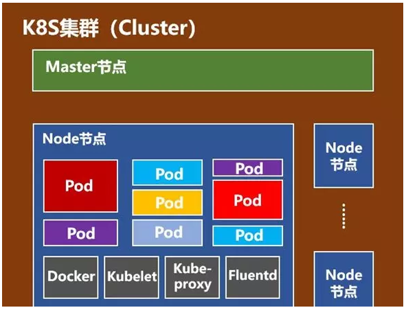
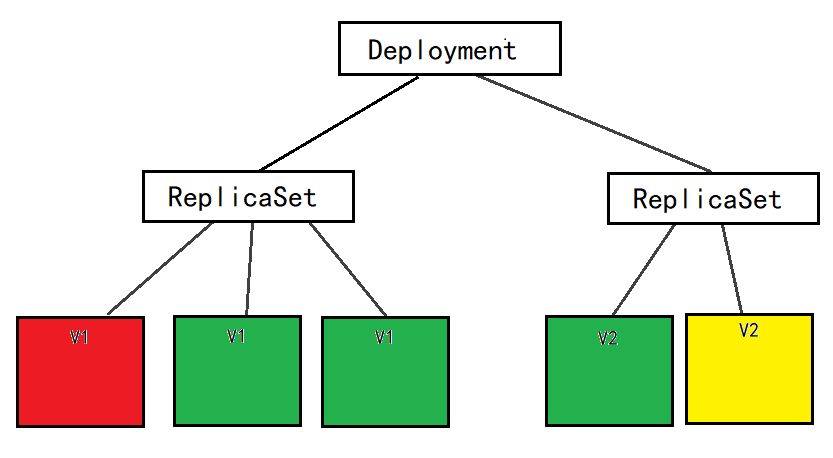
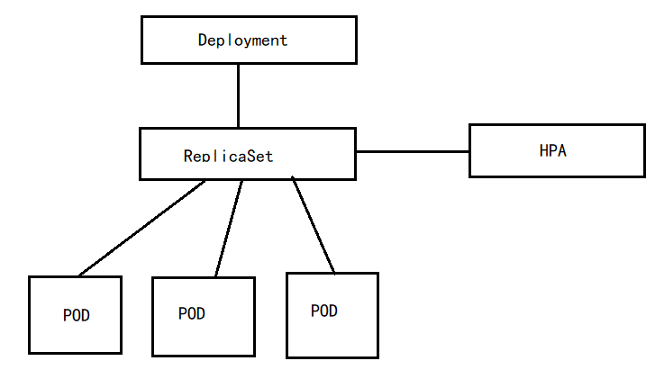
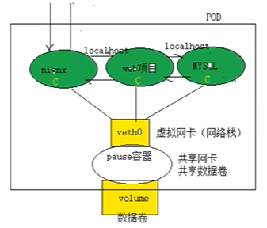
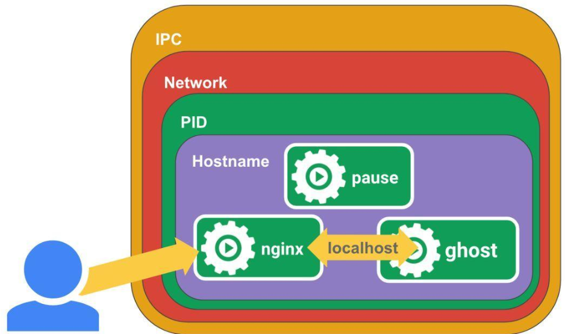
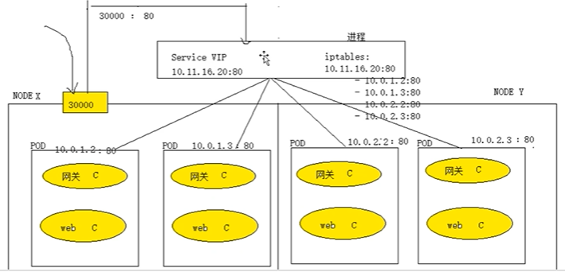
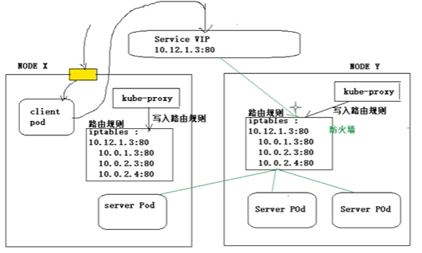

# 介绍

## 主要功能

+ 数据卷：在`pod`之间共享数据
+ 健康检查：设置监控检查策略保证应用健壮性
+ 复制应用程序实例：控制器维护`Pod`副本数量
+ 弹性伸缩: 根据设定的指标（`CPU`利用率）自动缩放`Pod`副本数
+ 服务发现: 使用环境变量或`DNS`服务插件保证容器中程序发现`Pod`入口访问地址。
+ 负载均衡：一组`Pod`副本分配一个私有的集群`IP`地址，其他应用通过该`IP`访问时会根据负载均衡策略进行转发
+ 滚动更新：一次更新一个`Pod`，而不是同时删除整个服务
+ 服务编排: 通过文件描述部署服务，使得应用程序部署变得更高效。
+ 资源监控: `Node`节点组件集成`cAdvisor`资源收集工具，可通过`Heapster`汇总整个集群节点资源数据，然后存储到`InfluxDB`时序数据库，再由`Grafana`展示。
+ 提供认证和授权: 支持属性访问控制（`ABAC`）、角色访问控制（`RBAC`）认证授权策略。

## 架构


+ 发送请求：
  + `kubectl`命令
  + 浏览器（`rancher`、`dashboard`）
+ `scheduler`：调度器，负责计算pod应该部署到哪个`node`
+ `controller`：控制器，负责维护`node`节点资源对象
+ `apiserver`：网关
+ `etcd`：分布式键值数据库，用于存储节点信息
+ `node`节点：每个节点运行1个`kubelet`进行，用于维护本机得`pod`
+ `registry`：镜像仓库

## node节点



+ `pod`：`k8s`管理的最小单元，1个`pod`内一般只能运行1个容器
+ `docker`：创建容器的基础服务
+ `kubelet`：`master`节点发来的请求都由`kubelet`在本机代理执行
+ `kube-proxy`：网络代理，用于生成网络规则，创建访问路由，`service`网络访问规则，负载均衡规则
+ `fluentd`：收集日志

## 知识点

+ `k8s`中所有资源对象都以`yaml`配置文件得形式存储在`etcd`中

# 安装

## 主从通用配置

### 环境要求

+ CPU核数 >= 2
+ 内存 >= 2G
+ linux内核版本 >= 4
  + `uname -r`查看
  + 后面可以进行升级

### 环境准备

+ 安装依赖

  ```shell
  $ yum install -y conntrack ntpdate ntp ipvsadm ipset jq iptables curl sysstat libseccomp wget vim net-tools git iproute lrzsz bash-completion tree bridge-utils unzip bind-utils gcc
  ```

+ 关闭防火墙

  ```shell
  $ systemctl stop firewalld && systemctl disable firewalld
  ```

+ 安装`iptables`并置空规则，用于后续使用`iptables`实现`k8s`得负载均衡

  ```shell
  $ yum -y install iptables-services && systemctl start iptables && systemctl enable iptables && iptables -F && service iptables saveyum -y install iptables-services && systemctl start iptables && systemctl enable iptables && iptables -F && service iptables save
  ```

+ 关闭swap分区（虚拟内存）

  ```shell
  $ swapoff -a && sed -i '/ swap / s/^\(.*\)$/#\1/g' /etc/fstab
  ```

+ 关闭`selinux`

  ```shell
  $ setenforce 0 && sed -i 's/^SELINUX=.*/SELINUX=disabled/' /etc/selinux/config
  ```

+ 升级linux内核

  ```shell
  $ rpm -Uvh https://www.elrepo.org/elrepo-release-7.el7.elrepo.noarch.rpm
  $ yum --enablerepo=elrepo-kernel install -y kernel-lt
  # 查看可选内核
  $ awk -F\' '$1=="menuentry " {print $2}' /etc/grub2.cfg
  # 选择1个内核作为默认启动内核（从0开始）
  $ grub2-set-default 0
  # 重启生效
  $ reboot
  # 查看内核版本
  $ uname -r
  ```

+ 配置时间

  + 设置时区

    ```shell
    $ timedatectl set-timezone Asia/Shanghai
    ```

  + 安装`ntpd`自动同步时间，utc时间写入RTC时钟

    ```shell
    $ ntpdate cn.pool.ntp.org
    $ timedatectl set-local-rtc
    ```

  + 重启服务器，使依赖时间得服务应用新的时间

+ 根据`k8s`需要，配置内核参数

  ```shell
  # 创建配置文件
  $ cat > /etc/sysctl.d/kubernetes.conf <<EOF
  net.bridge.bridge-nf-call-iptables=1
  net.bridge.bridge-nf-call-ip6tables=1
  net.ipv4.ip_forward=1
  net.ipv4.tcp_tw_recycle=0
  vm.swappiness=0
  vm.overcommit_memory=1
  vm.panic_on_oom=0
  fs.inotify.max_user_instances=8192
  fs.inotify.max_user_watches=1048576
  fs.file-max=52706963
  fs.nr_open=52706963
  net.ipv6.conf.all.disable_ipv6=1
  net.netfilter.nf_conntrack_max=2310720
  EOF
  # 立即生效
  $ sysctl -p /etc/sysctl.d/kubernetes.conf
  ```

+ 配置日志管理服务`journal`，用于管理`k8s`日志

  ```shell
  # 日志保存目录
  $ mkdir /var/log/journal
  # 配置文件存放目录
  $ mkdir /etc/systemd/journald.conf.d
  # 创建配置文件
  $ cat > /etc/systemd/journald.conf.d/99-prophet.conf <<EOF
  [Journal]
  Storage=persistent
  Compress=yes
  SyncIntervalSec=5m
  RateLimitInterval=30s
  RateLimitBurst=1000
  SystemMaxUse=10G
  SystemMaxFileSize=200M
  MaxRetentionSec=2week
  ForwardToSyslog=no
  EOF
  # 重启journald 加载配置
  $ systemctl restart systemd-journald
  ```

+ 为`kube-proxy`开启`ipvs`做准备

  > `kube-proxy`用于为`k8s`中得`service`构建路由规则；可以基于`iptables`或`ipvs`实现，`ipvs`比`iptables`能支持更多得路由规则

  ```shell
  # 向内核安装桥接模式防火墙模块`br_netfilter`
  $ modprobe br_netfilter
  # 向内核安装 ipvs 相关模块得脚本
  $ cat > /etc/sysconfig/modules/ipvs.modules <<EOF
  #!/bin/bash
  modprobe -- ip_vs
  modprobe -- ip_vs_rr
  modprobe -- ip_vs_wrr
  modprobe -- ip_vs_sh
  modprobe -- nf_conntrack
  EOF
  # 修改权限并执行脚本，并查看这些文件是否被引导
  $ chmod 755 /etc/sysconfig/modules/ipvs.modules && bash /etc/sysconfig/modules/ipvs.modules && lsmod | grep -e ip_vs -e nf_conntrack_ipv4
  ```

### 配置docker

+ Cgroup Driver

  + Docker 在默认情况下使用的 Cgroup Driver 为 `cgroupfs`，可以通过`docker info`命令查看

  + 而 Kubernetes 其实推荐使用 `systemd` 来代替 `cgroupfs`，`Cgroup Driver`不一致会导致安装`k8s`时报错

    ```
    failed to create kubelet: misconfiguration: kubelet cgroup driver: "cgroupfs" is different from docker cgroup driver: "systemd"
    ```

  + Docker修改`Cgroup Driver`为`systemd`

    + 编辑 `/etc/docker/daemon.json` ，添加如下启动项参数

      ```json
      {
        "exec-opts": ["native.cgroupdriver=systemd"]
      }
      ```

    + 重启docker

### 安装K8S

> + k8s得3种安装方式：
>   + 二进制：负责
>   + kubeadm安装：简单，官方推荐
>   + 可视化界面（如rancher）
> + 我们这里使用kubeadm安装

```shell
# 创建`repo`文件，从阿里云安装kubeadm
$ cat <<EOF > /etc/yum.repos.d/kubernetes.repo
[kubernetes]
name=Kubernetes
baseurl=http://mirrors.aliyun.com/kubernetes/yum/repos/kubernetes-el7-x86_64
enabled=1
gpgcheck=0
repo_gpgcheck=0
gpgkey=http://mirrors.aliyun.com/kubernetes/yum/doc/yum-key.gpg
		http://mirrors.aliyun.com/kubernetes/yum/doc/rpm-package-key.gpg
EOF
# 安装kubeadm、kubelet、kubectl
$ yum install -y kubeadm kubelet kubectl
# 启动 kubelet
$ systemctl enable kubelet && systemctl start kubelet
```

### 集群镜像下载

+ k8s需要得docker镜像下载

  + 查看需要哪些镜像

    ```shell
    $ kubeadm config images list
    ```

  + 从国内镜像仓库下载，并重命名

    ```
    docker pull registry.aliyuncs.com/google_containers/kube-apiserver:v1.21.2
    docker tag registry.aliyuncs.com/google_containers/kube-apiserver:v1.21.2 k8s.gcr.io/kube-apiserver:v1.21.2
    docker rmi registry.aliyuncs.com/google_containers/kube-apiserver:v1.21.2
    
    docker pull registry.aliyuncs.com/google_containers/kube-controller-manager:v1.21.2
    docker tag registry.aliyuncs.com/google_containers/kube-controller-manager:v1.21.2 k8s.gcr.io/kube-controller-manager:v1.21.2
    docker rmi registry.aliyuncs.com/google_containers/kube-controller-manager:v1.21.2
    
    docker pull registry.aliyuncs.com/google_containers/kube-scheduler:v1.21.2
    docker tag registry.aliyuncs.com/google_containers/kube-scheduler:v1.21.2 k8s.gcr.io/kube-scheduler:v1.21.2
    docker rmi registry.aliyuncs.com/google_containers/kube-scheduler:v1.21.2
    
    docker pull registry.aliyuncs.com/google_containers/kube-proxy:v1.21.2
    docker tag registry.aliyuncs.com/google_containers/kube-proxy:v1.21.2 k8s.gcr.io/kube-proxy:v1.21.2
    docker rmi registry.aliyuncs.com/google_containers/kube-proxy:v1.21.2
    
    docker pull registry.aliyuncs.com/google_containers/pause:3.4.1
    docker tag registry.aliyuncs.com/google_containers/pause:3.4.1 k8s.gcr.io/pause:3.4.1
    docker rmi registry.aliyuncs.com/google_containers/pause:3.4.1
    
    docker pull registry.aliyuncs.com/google_containers/etcd:3.4.13-0
    docker tag registry.aliyuncs.com/google_containers/etcd:3.4.13-0 k8s.gcr.io/etcd:3.4.13-0
    docker rmi registry.aliyuncs.com/google_containers/etcd:3.4.13-0
    
    docker pull coredns/coredns:1.8.0
    docker tag coredns/coredns:1.8.0 k8s.gcr.io/coredns/coredns:v1.8.0
    docker rmi coredns/coredns:1.8.0
    ```

## 主节点配置

### 配置host

+ 设置本机hostname

  ```shell
  # 设置本机hostname
  $ hostnamectl set-hostname k8s-master01
  $ hostnamectl set-hostname k8s-node01
  $ hostnamectl set-hostname k8s-node02
  # 查看hostname
  $ hostname
  ```

+ 配置`IP Host`映射

  ```shell
  vi /etc/hosts
  192.168.66.10 k8s-master01
  192.168.66.11 k8s-node01
  192.168.66.12 k8s-node02
  ```


### 部署

+ 拉取资源配置文件

  ```shell
  $ kubeadm config print init-defaults > kubeadm-config.yaml
  ```

+ 修改资源配置文件

  ```yaml
  localAPIEndpoint:
    # 修改为本机ip
    advertiseAddress: 192.168.10.8
  # 修改版本为执行 kubeadm config images list 后 kube-*包得版本
  kubernetesVersion: 1.21.1
  networking:    
    # 指定flannel模型通信 pod网段地址,此网段和flannel网段一致  
    podSubnet: 10.244.0.0/16
    
  # 指定使用ipvs进行通信
  ---    
  apiVersion: kubeadm.k8s.io/v1beta2
  kind: kubeProxyConfiguration
  featureGates:
    SupportIPVSProxyMode: true
  mode: ipvs
  ```

+ 初始化主节点，开始部署

  ```shell
  $ kubeadm init --config=kubeadm-config.yaml --upload-certs | tee kubeadm-init.log
  ```

+ 打印如下信息表示安装成功

  ```
  Your Kubernetes control-plane has initialized successfully!
  
  To start using your cluster, you need to run the following as a regular user:
  
    mkdir -p $HOME/.kube
    sudo cp -i /etc/kubernetes/admin.conf $HOME/.kube/config
    sudo chown $(id -u):$(id -g) $HOME/.kube/config
  
  Alternatively, if you are the root user, you can run:
  
    export KUBECONFIG=/etc/kubernetes/admin.conf
  
  You should now deploy a pod network to the cluster.
  Run "kubectl apply -f [podnetwork].yaml" with one of the options listed at:
    https://kubernetes.io/docs/concepts/cluster-administration/addons/
  
  Then you can join any number of worker nodes by running the following on each as root:
  
  kubeadm join 192.168.10.8:6443 --token abcdef.0123456789abcdef \
          --discovery-token-ca-cert-hash sha256:6655246a71133a6d186378b4271918c0501d6605577cfbb0206fcb74e30419f2
  ```

+ 按照安装结果执行建议的操作

  ```shell
  $ echo "export KUBECONFIG=/etc/kubernetes/admin.conf" >> /etc/profile
  $ source /etc/profile
  ```

### flannel插件

+ 无法直接下载，需要在浏览器访问[flannel插件配置文件](https://raw.githubusercontent.com/coreos/flannel/master/Documentation/kube-flannel.yml)并下载，上传至服务器

+ 部署`flannel`

  ```shell
  $ kubectl create -f kube-flannel.yml
  ```

## 从节点加入集群

### 配置host

+ 设置本机hostname

  ```shell
  # 设置本机hostname
  $ hostnamectl set-hostname k8s-master01
  $ hostnamectl set-hostname k8s-node01
  $ hostnamectl set-hostname k8s-node02
  # 查看hostname
  $ hostname
  ```

+ 配置`IP Host`映射

  ```shell
  vi /etc/hosts
  192.168.66.10 k8s-master01
  192.168.66.11 k8s-node01
  192.168.66.12 k8s-node02
  ```

### 加入集群

在从节点执行主节点集群安装成功后打印的信息

```
kubeadm join 192.168.10.8:6443 --token abcdef.0123456789abcdef \
        --discovery-token-ca-cert-hash sha256:6655246a71133a6d186378b4271918c0501d6605577cfbb0206fcb74e30419f2
```

## UI安装

# 资源控制器

## 什么是控制器

+ k8s中内建了很多`controller`（控制器），用来控制`Pod`的具体状态和行为

   

+ `Pod`分类

  + 自主式`pod`，不被控制器管理，退出了不会被重新创建
  + 控制器管理的`pod`，退出了会被重新创建

## 重要控制器

### Replication

+ 用来确保容器应用的副本数始终保持在用户定义的副本数,即如果有容器异常退出,会自动创建新的Pod来替代;而如果异常多出来的容器也会自动回收;

### ReplicaSet

+ 在新版本的`k8s`中建议使用`Replicaset`来取代`ReplicationController`. 他俩没有本质的不同,只是名字不一样,并且`ReplicaSet`支持集合式的`selector`（标签选择器）

+ `RS`可以单独使用，但是一般使用`Deployment`管理`RS`，可以避免与其他机制不兼容（如：`RS`不支持滚动更新）

### Deployment

+ 无状态服务部署控制器

+ `Deployment`为`Pod`和`ReplicaSet`提供了一个声明式定义(`declarative`)方法,用来替代以前的`ReplicationController`来方便的管理应用。典型的应用场景包括;

  + 定义`Deployment`来创建`Pod`和`ReplicaSet`
  + 滚动升级和回滚应用
  + 扩容和缩容
  + 暂停和继续`Deployment`

+ `Deployment`更新策略

  + `Deployment`可以保证在升级时只有一定数量的`Pod`是`down`的。默认的,它会确保至少有比期望的`Pod`数量少一个是`up`状态(最多一个不可用)
  + `Deployment`同时也可以确保只创建出超过期望数量的一定数量的`Pod`,默认的,它会确保最多比期望的`Pod`数量多一个的`Pod`是`up`的(最多1个`surge `)
  + 未来的`k8s`版本中,将从1-1变成25%-25%

  ```
  kubect1 describe deployments
  ```

+ 滚动更新流程

   

  + `Deployment`+`ReplicaSet`的拓扑结构是：`Deployment`管理`ReplicaSet`，`ReplicaSet`管理`pod`
  + 当进行滚动更新时，`Deployment`会创建1个新的`ReplicaSet`，新的`ReplicaSet`每创建1个新的`pod`，旧的`ReplicaSet`就会停掉1个旧的`pod`

+ 回滚

  + 滚动更新流程结束后，旧的`ReplicaSet`并不会删掉，但是旧的`pod`会删除
  + 当需要进行回滚时，使用旧的`ReplicaSet`逐个创建并启动老版本`pod`，并停掉新的`pod`

### HPA

+ 全称：`Horizontal Pod Autoscaling`，pod自动水平缩放

+ 仅适用于 `Deployment `和 `ReplicaSet`

+ 在`V1`版本中仅支持根据Pod的CPU利用率扩容，在`vlalpha`版本中，支持根据内存和用户自定义的metric扩缩容

+ 拓扑结构

   

  + 事先需要配置`pod`伸缩容规则
  + `HPA`对`ReplicaSet`进行监听，如果`ReplicaSet`下`pod`达到扩容条件（如`pod`的`cpu`利用率达到80%)，则将进行扩容，如果`ReplicaSet`下`pod`达到缩容条件（如`pod`的`cpu`利用率低于50%)，则将进行缩容

### StatefulSet

+ 用于部署有状态服务
+ 有状态服务会有自己得数据卷，当pod宕机后，重启新的pod时，`statefulset`会让新的`pod`使用旧的数据卷

### DaemonSet

+ 为所有或部分节点创建`pod`，每个节点只运行1个副本
+ 比如每个节点需要有1个监控服务器状态的pod时使用

### Persistent Volume

+ 管理维护`Persistent volume`和`Persistent volume Claim`
+ 负责持久化存储，为有状态服务准备

### Job

+ 任务控制器，每个pod只处理1次

### CronJob

+ 在Job基础上加上定时任务调度

## 其他控制器

### node

+ 维护管理`node`，定期检查`node`健康状态

### Namespace

+ 定期清理无效namespace

### Service

+ 管理维护`service(IP)`，提供负载以及服务代理

### Endpoint

+ 管理维护`endpoint`，关联`service`和`pod`

### service account

+ 为每个`namespace`创建默认的`account`和`secret`

# Pod核心原理

## Pod是什么

+ `pod`特点
  + 有自己的`IP`
  + 有自己的`hostname`
+ `pod`相当于1台独立的虚拟主机，内部封装的是由docker引擎创建的容器

## pause容器 

+ 1个`pod`在启动时，跟随`pod`同时启动了1个`pause`容器，该容器提供了1个虚拟共享网卡和1个共享数据卷，分别用于网络通信和持久化

   

+ `pause`容器为业务容器提供以下功能：

   

  + `PID`命名空间：`pod`的进程识别号
  + 网络命名空间：`pod`内容器使用同一套`IP`和端口
  + `IPC`命名空间：`pod`内容器使用`SystemV IPC`或`POSIX`消息队列进行通信
  + `UTS`命名空间：`pod`内容器共享1个主机名
  + 共享数据卷：`pod`内容器可以访问`pod`级别数据卷

## 特点

+ 无状态服务得pod重建后，IP、hostname都会发生变化；有状态服务pod重建后，ip变化，hostname不变，用以找到之前得数据卷
+ 

# 组件

## Lable

+ `k8s`中所有资源对象都可以打标签，方便对资源进行分组
+ 1个资源对象可以有多个标签

## 标签选择器

+ 单个标签选择器

  + 只能通过1个标签条件进行匹配

+ 复合标签选择器

  + 能通过多个标签条件进行匹配

  + 如

    ```
    Selector:
    	app = MyApp
    	release = stable
    ```

## Service

+ `service`就是同一服务创建得多个副本`pod`得集合，对外提供相同功能得服务
+ `service`是自己创建得

# Service VIP

## 定义

+ `service VIP`是`k8s`为`service`资源对象提供得1个虚拟IP，有了它，可以将整个`Service`资源对象看作1个服务使用，屏蔽了`Service`内部`pod`副本得细节
+ 所有访问`service`资源对象得请求都需要经过`service VIP`，由它进行负载均衡并转发
+ `service VIP`得高可用性由`etcd`保证，可以理解为，`service VIP`实际上是`api server`中保存在`etcd`得一组配置信息，这些信息会同步到对应节点得`iptables`中配置成路由规则（每个节点得`iptables`中有`service`中所有`pod`的路由信息，不是只有自己节点`pod`的路由信息）

## 负载均衡

 

+ `service VIP`提供了1个统一得`ip`及端口，所有对`service`资源对象得请求都要使用`service VIP`进行请求。再由`iptables`中配置得负载均衡策略进行请求转发
+ 如果`service`需要对外提供服务，则将物理机得1个端口映射到`Service VIP`得端口上，则可以通过访问物理机得`ip`及端口进行访问

## 服务发现

+ `pod`宕机后，`k8s`会重启新的`pod`，`ip`和`hostname`会发生变化。此时每个`node`节点中得`kube-proxy`会监听到这些变化，并上传到`api server`，改写`Service VIP`中`endpoints`资源对象得信息

# 负载均衡策略

## `userspace`（已过时）

+ 当请求到达`service VIP`时，随机选择1个`node`节点，交由该节点得`kube-proxy`负责负载均衡
+ 由于`kube-proxy`负责得事情太多，性能较差，这种方案已被取代

## `iptables`

 

+ 外部请求通过物理机端口到达`client pod`（也就是`nginx`）,请求转发至`service VIP`，随机选1个节点，使用该节点的`iptables`负责负载均衡（不是只负责自己节点的`pod`，是可以负载到所有`pod`）
+ `kube-proxy`负责服务注册与发现和`iptables`中路由规则改写；`iptables`负责负载
+ `iptables`负载策略：
  + 随机
  + 轮询（默认）

## `ipvs`

+ 就是将上图的`iptables`换成`ipvs`
+ `ipvs`是`iptables`的扩展版本，支持更多负载策略
+ `ipvs`负载策略
  + `rr`：轮询
  + `lc`：最小连接数
  + `dh`：目的地址`hash`
  + `sh`：源地址`hash`
  + `sed`：最短切望延迟
  + `np`：无需队列等待

# 指令

+ 指定部署镜像

  ```shell
  # kubectl run DEPLOYMENT_NAME --image=URL --port=PORT
  $ kubectl run myapp --image=ikubernetes/myapp --port=80

+ 查看pod

  ```shell
  $ kubectl get pod DEPLOYMENT_NAME [-n NAMESPACE]
  ```

+ 查看Pod详情

  ```shell
  $ kubectl describe pod DEPLOYMENT_NAME [-n NAMESPACE]
  ```

+ 删除pod

  ```shell
  $ kubectl delete pod DEPLOYMENT_NAME [-n NAMESPACE]
  ```

  

# 镜像部署

## 指令

+ 部署指令

  ```shell
  # kubectl run [deploymentName] --image=[url] --port=[port]
  $ kubectl run myapp --image=ikubernetes/myapp --port=80
  ```

  

