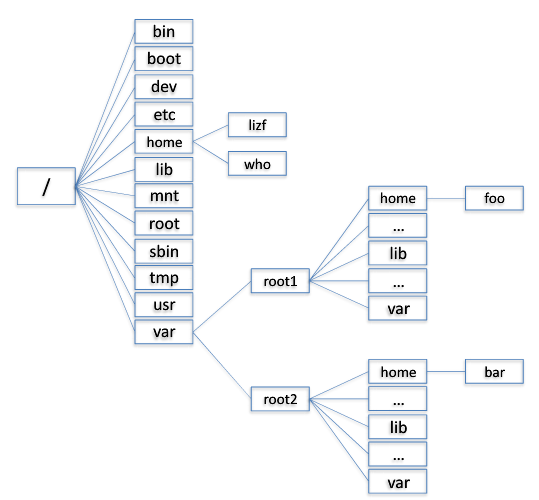
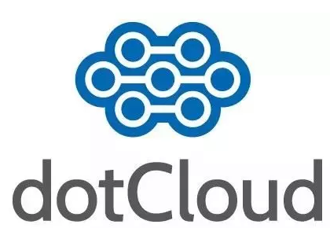
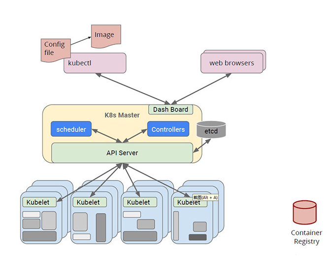
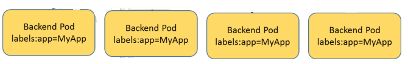
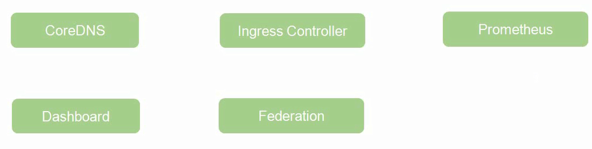

# Kubernetes(K8s)

# 一、Openstack&VM


 ## 1、**认识虚拟化**

### **1.1**、什么是虚拟化

在计算机中，虚拟化（英语：Virtualization）是一种资源管理技术，是将计算机的各种实体资源，如服务器、网络、内存及存储等，予以抽象、转换后呈现出来，打破实体结构间的不可切割的障碍，使用户可以比原本的组态更好的方式来应用这些资源。这些资源的新虚拟部份是不受现有资源的架设方式，地域或物理组态所限制。一般所指的虚拟化资源包括计算能力和资料存储。

 

虚拟化技术是一套解决方案。完整的情况需要CPU、主板芯片组、BIOS和软件的支持，例如VMM软件或者某些操作系统本身。即使只是CPU支持虚拟化技术，在配合VMM的软件情况下，也会比完全不支持虚拟化技术的系统有更好的性能。

 

在实际的生产环境中，虚拟化技术主要用来解决高性能的物理硬件产能过剩和老的旧的硬件产能过低的重组重用，透明化底层物理硬件，从而最大化的利用物理硬件  对资源充分利用

虚拟化技术种类很多，例如：软件虚拟化、硬件虚拟化、内存虚拟化、网络虚拟化(vip)、桌面虚拟化、服务虚拟化、虚拟机等等。

 

### **1.2、虚拟化分类**

（1）全虚拟化架构

虚拟机的监视器（hypervisor）是类似于用户的应用程序运行在主机的OS之上，如VMware的workstation，这种虚拟化产品提供了虚拟的硬件。

                 

（2）OS层虚拟化架构

  

（3）硬件层虚拟化

  

硬件层的虚拟化具有高性能和隔离性，因为hypervisor直接在硬件上运行，有利于控制VM的OS访问硬件资源，使用这种解决方案的产品有VMware ESXi 和 Xen server

Hypervisor是一种运行在物理服务器和操作系统之间的中间软件层,可允许多个操作系统和应用共享一套基础物理硬件，因此也可以看作是虚拟环境中的“元”操作系统，它可以协调访问服务器上的所有物理设备和虚拟机，也叫虚拟机监视器（Virtual Machine Monitor，VMM）。

Hypervisor是所有虚拟化技术的核心。当服务器启动并执行Hypervisor时，它会给每一台虚拟机分配适量的内存、CPU、网络和磁盘，并加载所有虚拟机的客户操作系统。 宿主机

Hypervisor是所有虚拟化技术的核心，软硬件架构和管理更高效、更灵活，硬件的效能能够更好地发挥出来。常见的产品有：VMware、KVM、Xen等等

 

## 2、OpenStack与KVM、VMWare

### 2.1、OpenStack

OpenStack：开源管理项目 OpenStack是一个旨在为公共及私有云的建设与管理提供软件的开源项目。它不是一个软件，而是由几个主要的组件组合起来完成一些具体的工作。OpenStack由以下五个相对独立的组件构成：

·     OpenStack Compute(Nova)是一套控制器，用于虚拟机计算或使用群组启动虚拟机实例;

·     OpenStack镜像服务(Glance)是一套虚拟机镜像查找及检索系统，实现虚拟机镜像管理;

·     OpenStack对象存储(Swift)是一套用于在大规模可扩展系统中通过内置冗余及容错机制，以对象为单位的存储系统，类似于Amazon S3;

·     OpenStack Keystone，用于用户身份服务与资源管理以及

·     OpenStack Horizon，基于Django的仪表板接口，是个图形化管理前端。 这个起初由美国国家航空航天局和Rackspace在2010年末合作研发的开源项目，旨在打造易于部署、功能丰富且易于扩展的云计算平台。OpenStack项目的首要任务是简化云的部署过程并为其带来良好的可扩展性，企图成为数据中心的操作系统，即云操作系统。 

***Openstack*****项目层级关系：**

 

·     第一层是基础设施层，这一层主要包含Nova、Glance和Keystone，如果我们要想得到最基本的基础设施的服务，必须安装部署这三个项目。

·     第二层是扩展基础设施层，这一层可以让我们得到更多跟基础设施相关的高级服务，主要包含Cinder、Swift、Neutron、Designate和Ironic等，其中Cinder提供块存储，Swift提供对象存储，Neutron提供网络服务，Designate提供DNS服务，Ironic提供裸机服务。

·     第三层是可选的增强特性，帮用户提供一些更加高级的功能，主要包含Ceilometer、Horizon和Barbican，其中Ceilometer提供监控、计量服务，Horizon提供用户界面，Barbican提供秘钥管理服务。

·     第四层主要是消费型服务，所谓的消费型服务，主要是指第四层的服务都需要通过使用前三层的服务来工作。

第四层主要有Heat、Magnum、Sahara、Solum和Murano等，其中Heat主要提供orchestration服务，Magnum主要提供容器服务，Sahara主要提供大数据服务，我们可以通过Sahara很方便地部署Hadoop、Spark集群。Solum主要提供应用开发的服务，并且可以提供一些类似于CI/CD的功能。Muarno主要提供应用目录的服务，类似于App Store，就是用户可以把一些常用的应用发布出来供其他用户去使用。最右边是Kolla，Kolla的主要功能是容器化所有的OpenStack服务，便于OpenStack安装部署和升级。

 

### 2.2、KVM

KVM(Kernel-based Virtual Machine)基于内核的虚拟机 KVM是集成到Linux内核的Hypervisor，是X86架构且硬件支持虚拟化技术（Intel VT或AMD-V）的Linux的全虚拟化解决方案。它是Linux的一个很小的模块，利用Linux做大量的事，如任务调度、内存管理与硬件设备交互等。 KVM最大的好处就在于它是与Linux内核集成的，所以速度很快。

 

### 2.3、VMWare 

VMWare (Virtual Machine ware) VMWare (Virtual Machine ware)是一个“虚拟PC”虚拟机管理管理软件。它的产品可以使你在一台机器上同时运行二个或更多Windows、DOS、LINUX系统。

与“多启动”系统相比，VMWare采用了完全不同的概念。多启动系统在一个时刻只能运行一个系统，在系统切换时需要重新启动机器。VMWare是真正“同时”运行，多个操作系统在主系统的平台上，就象标准Windows应用程序那样切换。而且每个操作系统你都可以进行虚拟的分区、配置而不影响真实硬盘的数据，你甚至可以通过网卡将几台虚拟机用网卡连接为一个局域网，极其方便。安装在VMware操作系统性能上比直接安装在硬盘上的系统低不少，因此，比较适合学习和测试。


# 二、容器&编排技术

## 1、容器发展史

### 1.1、Chroot

容器技术的概念可以追溯到1979年的UNIX Chroot。这项功能将Root目录及其它子目录变更至文件系统内的新位置，且只接受特定进程的访问，其设计目的在于为每个进程提供一套隔离化磁盘空间。1982年其被添加至BSD。

 

​                                

chroot只是提供了对进程文件目录虚拟化的功能，不能够防止进程恶意访问系统。这个问题在FreeBSDGails容器技术中得以解决

 

 

### 1.2、FreeBSD Jails

FreeBSD Jails与Chroot的定位类似，不过其中包含有进程沙箱机制以对文件系统、用户及网络等资源进行隔离。通过这种方式，它能够为每个Jail、定制化软件安装包乃至配置方案等提供一个对应的IP地址。Jails技术为FreeBSD系统提供了一种简单的安全隔离机制。它的不足在于这种简单性的隔离也同时会影响Jails中应用访问系统资源的灵活性。

 

  

### 1.3、Solaris Zones

Solaris Zone技术为应用程序创建了虚拟的一层，让应用在隔离的Zone中运行，并实现有效的资源管理。每一个Zone 拥有自己的文件系统，进程空间，防火墙，网络配置等等。

 

Solaris Zone技术真正的引入了容器资源管理的概念。在应用部署的时候为Zone配置一定的资源，在运行中可以根据Zone的负载动态修改这个资源限制并且是实时生效的，在其他Zone不需要资源的时候，资源会自动切换给需要的资源的Zone，这种切换是即时的不需要人工干预的，最大化资源的利用率，在必要的情况下，也可以为单个Zone隔离一定的资源。

 

  

 

### 1.4、LXC

LXC指代的是Linux Containers，其功能通过Cgroups以及Linux Namespaces实现。也是第一套完整的Linux容器管理实现方案。在LXC出现之前， Linux上已经有了类似 Linux-Vserver、OpenVZ 和 FreeVPS。虽然这些技术都已经成熟，但是这些解决方案还没有将它们的容器支持集成到主流 Linux 内核。相较于其它容器技术，LXC能够在无需任何额外补丁的前提下运行在原版Linux内核之上。目前LXC项目由Canonical有限公司负责赞助及托管。

 

  

 


  

### 1.5、Docker

​	Docker项目最初是由一家名为DotCloud的平台即服务厂商所打造，其后该公司更名为Docker。Docker在起步阶段使用LXC，而后利用自己的Libcontainer库将其替换下来。与其它容器平台不同，Docker引入了一整套与容器管理相关的生态系统。其中包括一套高效的分层式容器镜像模型、一套全局及本地容器注册表、一个精简化REST API以及一套命令行界面等等。

 

与Docker具有同样目标功能的另外一种容器技术就是CoreOS公司开发的Rocket. Rocket基于App Container规范并使其成为一项更为开放的标准。

 

  

## 2、Docker容器

### 2.1、Docker历史

2010年，几个搞IT的年轻人，在美国旧金山成立了一家名叫“dotCloud”的公司。

  

这家公司主要提供基于PaaS的云计算技术服务。具体来说，是和LXC有关的容器技术。LXC，就是Linux容器虚拟技术（Linux container）、后来，dotCloud公司将自己的容器技术进行了简化和标准化，并命名为——Docker。

  

Docker技术诞生之后，并没有引起行业的关注。而dotCloud公司，作为一家小型创业企业，在激烈的竞争之下，也步履维艰。正当他们快要坚持不下去的时候，脑子里蹦出了“开源”的想法。

什么是“开源”？开源，就是开放源代码。也就是将原来内部保密的程序源代码开放给所有人，然后让大家一起参与进来，贡献代码和意见。

Open Source，开源

有的软件是一开始就开源的。也有的软件，是混不下去，创造者又不想放弃，所以选择开源。自己养不活，就吃“百家饭”嘛。

2013年3月，dotCloud公司的创始人之一，Docker之父，28岁的Solomon Hykes正式决定，将Docker项目开源。

不开则已，一开惊人。

越来越多的IT工程师发现了Docker的优点，然后蜂拥而至，加入Docker开源社区。

Docker的人气迅速攀升，速度之快，令人瞠目结舌。

开源当月，Docker 0.1版本发布。此后的每一个月，Docker都会发布一个版本。到2014年6月9日，Docker 1.0版本正式发布。

此时的Docker，已经成为行业里人气最火爆的开源技术，没有之一。甚至像Google、微软、Amazon、VMware这样的巨头，都对它青睐有加，表示将全力支持。

Docker火了之后，dotCloud公司干脆把公司名字也改成了Docker Inc.。

Docker和容器技术为什么会这么火爆？说白了，就是因为它“轻”。

### 2.2、Docker原理

容器是一种轻量级的虚拟化技术，因为它跟虚拟机比起来，它少了一层 hypervisor 层。先看一下下面这张图，这张图简单描述了一个容器的启动过程。 


```
 注: hypervisor：一种运行在物理服务器和操作系统之间的中间层软件，可以允许多个操作系统和应用共享一套基础物理硬件。可以将hypervisor看做是虚拟环境中的“元”操作系统，可以协调访问服务器上的所有物理设备和虚拟机，所以又称为虚拟机监视器（virtual machine monitor）。
 
hypervisor是所有虚拟化技术的核心，非中断的支持多工作负载迁移是hypervisor的基本功能。当服务器启动并执行hypervisor时，会给每一台虚拟机分配适量的内存，cpu，网络和磁盘资源，并且加载所有虚拟机的客户操作系统。 
```

  最下面是一个磁盘，容器的镜像是存储在磁盘上面的。上层是一个容器引擎，容器引擎可以是 docker，也可以是其它的容器引擎。引擎向下发一个请求，比如说创建容器，这时候它就把磁盘上面的容器镜像运行成在宿主机上的一个进程。

对于容器来说，最重要的是怎么保证这个进程所用到的资源是被隔离和被限制住的，在 Linux 内核上面是由 cgroup 和 namespace 这两个技术来保证的

### 2.3、NameSpace

​	namespace 是用来做资源隔离的，在 Linux 内核上有七种 namespace，docker 中用到了前六种。第七种 cgroup namespace 在 docker 本身并没有用到，但是在 runC 实现中实现了 cgroup namespace。 

​     

```
1）第一个是 mout namespace。mout namespace 就是保证容器看到的文件系统的视图，是容器镜像提供的一个文件系统，也就是说它看不见宿主机上的其他文件，除了通过 -v 参数 bound 的那种模式，是可以把宿主机上面的一些目录和文件，让它在容器里面可见的； 
 
2）第二个是 uts namespace，这个 namespace 主要是隔离了 hostname 和 domain； 
 
3）第三个是 pid namespace，这个 namespace 是保证了容器的 init 进程是以 1 号进程来启动的； 
 
4）第四个是网络 namespace，除了容器用 host 网络这种模式之外，其他所有的网络模式都有一个自己的 network namespace 的文件； 
 
5）第五个是 user namespace，这个 namespace 是控制用户 UID 和 GID 在容器内部和宿主机上的一个映射，不过这个 namespace 用的比较少； 
 
6）第六个是 IPC namespace，这个 namespace 是控制了进程兼通信的一些东西，比方说信号量； 
 
7）第七个是 cgroup namespace，上图右边有两张示意图，分别是表示开启和关闭 cgroup namespace。用 cgroup namespace 带来的一个好处是容器中看到的 cgroup 视图是以根的形式来呈现的，这样的话就和宿主机上面进程看到的 cgroup namespace 的一个视图方式是相同的；另外一个好处是让容器内部使用 cgroup 会变得更安全。
```

## 3、D&K&O

### 3.1、Docker&KVM

VM 利用 Hypervisor 虚拟化技术来模拟 CPU、内存等硬件资源，这样就可以在宿主机上建立一个 Guest OS，这是常说的安装一个虚拟机。

  

 

每一个 Guest OS 都有一个独立的内核，比如 Ubuntu、CentOS 甚至是 Windows 等，在这样的 Guest OS 之下，每个应用都是相互独立的，VM 可以提供一个更好的隔离效果。但这样的隔离效果需要付出一定的代价，因为需要把一部分的计算资源交给虚拟化，这样就很难充分利用现有的计算资源，并且每个 Guest OS 都需要占用大量的磁盘空间，比如 Windows 操作系统的安装需要 10~30G 的磁盘空间，Ubuntu 也需要 5~6G，同时这样的方式启动很慢。正是因为虚拟机技术的缺点，催生出了容器技术。

容器是针对于进程而言的，因此无需 Guest OS，只需要一个独立的文件系统提供其所需要文件集合即可。所有的文件隔离都是进程级别的，因此启动时间快于 VM，并且所需的磁盘空间也小于 VM。当然了，进程级别的隔离并没有想象中的那么好，隔离效果相比 VM 要差很多。

总体而言，容器和 VM 相比，各有优劣，因此容器技术也在向着强隔离方向发展。

  

Docker提供了一种程序运行的容器，同时保证这些容器相互隔离。虚拟机也有类似的功能，但是它通过Hypervisor创建了一个完整的操作系统栈。不同于虚拟机的方式，Docker依赖于Linux自带的LXC(Linux Containers)技术。LXC利用了Linux可以对进程做内存、CPU、网络隔离的特性。Docker镜像不需要新启动一个操作系统，因此提供了一种轻量级的打包和运行程序的方式。而且Docker能够直接访问硬件，从而使它的I/O操作比虚拟机要快得多。

 

疑问：

Docker可以直接跑在物理服务器上，这引起大家的疑问：假如已经用了Docker，还有必要使用OpenStack吗？ 

Docker和KVM的性能测试对比图表。和预期的一样，启动KVM和Docker容器的时间差异非常显著，而且在内存和CPU利用率上，双方差距非常大，如下表所示。

 

  

双方巨大的性能差异，导致了在相同工作负载下，KVM需要更多的CPU和内存资源，导致成本上升。

 

### **3.2**、KVM&openstack 


​	openstack是云管理平台，其本身并不提供虚拟化功能，真正的虚拟化能力是由底层的hypervisor（如KVM、Qemu、Xen等）提供。所谓管理平台，就是为了方便使用而已。如果没有openstack，一样可以通过virsh、virt-manager来实现创建虚拟机的操作，只不过敲命令行的方式需要一定的学习成本，对于普通用户不是很友好。 

​	KVM是最底层的hypervisor，是用来模拟CPU的运行，然鹅一个用户能在KVM上完成虚拟机的操作还需要network及周边的I/O支持，所以便借鉴了qemu进行一定的修改，形成qemu-kvm。但是openstack不会直接控制qemu-kvm，会用一个libvirt的库去间接控制qemu-kvm。qemu-kvm的地位就像底层驱动来着。 

​	OpenStack：开源管理项目

OpenStack是一个旨在为公共及私有云的建设与管理提供软件的开源项目。它不是一个软件，而是由几个主要的组件组合起来完成一些具体的工作。OpenStack由以下五个相对独立的组件构成： 

* OpenStack Compute(Nova)是一套控制器，用于虚拟机计算或使用群组启动虚拟机实例； 

* OpenStack镜像服务(Glance)是一套虚拟机镜像查找及检索系统，实现虚拟机镜像管理； 

* OpenStack对象存储(Swift)是一套用于在大规模可扩展系统中通过内置冗余及容错机制，以对象为单位的存储系统，类似于Amazon S3； 

* OpenStack Keystone，用于用户身份服务与资源管理以及 

* OpenStack Horizon，基于Django的仪表板接口，是个图形化管理前端。 

这个起初由美国国家航空航天局和Rackspace在2010年末合作研发的开源项目，旨在打造易于部署、功能丰富且易于扩展的云计算平台。OpenStack项目的首要任务是简化云的部署过程并为其带来良好的可扩展性，企图成为数据中心的操作系统，即云操作系统。

 

KVM：开放虚拟化技术

 

KVM（Kernel-based Virtual Machine）是一个开源的系统虚拟化模块，它需要硬件支持，如Intel VT技术或者AMD V技术，是基于硬件的完全虚拟化，完全内置于Linux。

 

2008年，红帽收购Qumranet获得了KVM技术，并将其作为虚拟化战略的一部分大力推广，在2011年发布RHEL6时支持KVM作为唯一的hypervisor。KVM主打的就是高性能、扩展性、高安全，以及低成本。

 

与Linux的缘分

 

一个被某些热心支持者成为云时代的Linux，是公有云与私有云的开源操作系统。一个则是Linux内核的一部分，将Linux转换成一个Type-1 hypervisor，无需任何变更就能享受现有的Linux内核进程调度、内存管理和设备支持。

 

OpenStack炙手可热，它如同Linux一样，旨在构建一个内核，所有的软件厂商都围绕着它进行工作。OpenStack的许多子项目，对云计算平台中的各种资源（如计算能力、存储、网络）提供敏捷管理。此外，OpenStack也提供对虚拟化技术的支持。

 

KVM集成在Linux的各个主要发行版本中，使用Linux自身的调度器进行管理。KVM专注于成为最好的虚拟机监控器，是使用Linux企业的不二选择，加上它还支持Windows平台，所以也是异构环境的最佳选择。

 

OpenStack与KVM都发展迅猛

 

OpenStack是一个拥有众多支持者的大项目。时至今日，已经有超过180家企业和400多位开发人员对这一项目积极地做着贡献，而其生态系统甚至更为庞大，已经超过了5600人和850家机构。在今年9月，OpenStack基会正式成立。白金会员有红帽、IBM与惠普等，黄金会员包括思科、戴尔与英特尔等。

 

OpenStack基本上是一个软件项目，有近55万行代码。分解成核心项目、孵化项目，以及支持项目和相关项目。除了以上提及的五大组成，与虚拟网络有关的Quantum首次被列为核心项目。

 

KVM是一个脱颖而出的开放虚拟化技术。它是由一个大型的、活跃的开放社区共同开发的，红帽、IBM、SUSE等都是其成员。2011年，IBM、红帽、英特尔与惠普等建立开放虚拟化联盟（OVA），帮助构建KVM生态系统，提升KVM采用率。如今，OVA已经拥有超过250名成员公司，其中，IBM有60多位程序员专门工作于KVM开源社区。

 

 

### 3.3、Docker&openstack

OpenStack和Docker之间是很好的互补关系。Docker的出现能让IaaS层的资源使用得更加充分，因为Docker相对虚拟机来说更轻量，

对资源的利用率会更加充分；

 

  

 

 

​	云平台提供一个完整管理数据中心的解决方案，至于用哪种hypervisor或container只是云平台中的一个小部分。像OpenStack这样的云平台包含了多租户的安全、隔离、管理、监控、存储、网络等其他部分。云数据中心的管理需要很多服务支撑，但这和用Docker还是KVM其实没多大关系。

 

​	Docker不是一个全功能的VM, 它有很多严重的缺陷，比如安全、Windows支持，因此不能完全替代KVM。现在Docker社区一直在弥补这些缺陷，当然这会带来一定的性能损耗。

 

## 4、容器编排

### 4.1、应用部署变迁

  

 

### 4.2、容器管理

怎么去管理这么多的容器 

• 怎么横向扩展 

• 容器down 了，怎么恢复 

• 更新容器后不影响业务 

• 如何监控容器 

• 如何调度新创建的容器 

• 数据安全问题

 

### 4.3、云原生

  

​	云原生是一条最佳路径或者最佳实践。更详细的说，***云原生为用户指定了一条低心智负担的、敏捷的、能够以可扩展、可复制的方式最大化地利用云的能力、发挥云的价值的最佳路径。***


云原生的技术范畴包括了以下几个方面：  

* 第一部分是云应用定义与开发流程。这包括应用定义与镜像制作、配置 CI/CD、消息和 Streaming 以及数据库等。

* 第二部分是云应用的编排与管理流程。这也是 Kubernetes 比较关注的一部分，包括了应用编排与调度、服务发现治理、远程调用、API 网关以及 Service Mesh。

- 第三部分是监控与可观测性。这部分所强调的是云上应用如何进行监控、日志收集、Tracing 以及在云上如何实现破坏性测试，也就是混沌工程的概念。

- 第四部分就是云原生的底层技术，比如容器运行时、云原生存储技术、云原生网络技术等。

- 第五部分是云原生工具集，在前面的这些核心技术点之上，还有很多配套的生态或者周边的工具需要使用，比如流程自动化与配置管理、容器镜像仓库、云原生安全技术以及云端密码管理等。

- 最后则是 Serverless。Serverless 是一种 PaaS 的特殊形态，它定义了一种更为“极端抽象”的应用编写方式，包含了 FaaS 和 BaaS 这样的概念。而无论是 FaaS 还是 BaaS，其最为典型的特点就是按实际使用计费（Pay as you go），因此 Serverless 计费也是重要的知识和概念。

### 4.4、Swarm

目前三大主流的容器平台Swarm, Mesos和Kubernetes具有不同的容器调度系统 ；

Swarm的特点是直接调度Docker容器，并且提供和标准Docker API一致的API。 


​	每台服务器上都装有Docker并且开启了基于HTTP的DockerAPI。这个集群中有一个SwarmManager的管理者，用来管理集群中的容器资源。管理者的管理对象不是服务器层面而是集群层面的，也就是说通过Manager，我们只能笼统地向集群发出指令而不能具体到某台具体的服务器上要干什么（这也是Swarm的根本所在）。至于具体的管理实现方式，Manager向外暴露了一个HTTP接口，外部用户通过这个HTTP接口来实现对集群的管理。

 

###   4.5、Mesos

  Mesos针对不同的运行框架采用相对独立的调度系统，其框架提供了Docker容器的原生支持。 Mesos并不负责调度而是负责委派授权，毕竟很多框架都已经实现了复杂的调度。 

### 4.6、Kubernetes

​	Kubernetes则采用了Pod和Label这样的概念把容器组合成一个个的互相存在依赖关系的逻辑单元。相关容器被组合成Pod后被共同部署和调度，形成服务（Service）。这个是Kubernetes和Swarm，Mesos的主要区别。 

​	Kubernetes（k8s）是自动化容器操作的开源平台，这些操作包括部署，调度和节点集群间扩展。如果你曾经用过Docker容器技术部署容器，那么可以将Docker看成Kubernetes内部使用的低级别组件。Kubernetes不仅仅支持Docker，还支持Rocket，这是另一种容器技术。

 

 使用Kubernetes可以：  

- 自动化容器的部署和复制

- 随时扩展或收缩容器规模

- 将容器组织成组，并且提供容器间的负载均衡

- 很容易地升级应用程序容器的新版本

- 提供容器弹性，如果容器失效就替换它，等等...


# 三、Kubernetes

## 1、borg系统

  Borg. Google的Borg系统运行几十万个以上的任务，来自几千个不同的应用，跨多个集群，每个集群（cell）有上万个机器。它通过管理控制、高效的任务包装、超售、和进程级别性能隔离实现了高利用率。它支持高可用性应用程序与运行时功能，最大限度地减少故障恢复时间，减少相关故障概率的调度策略。以下就是Borg的系统架构图。其中Scheduler负责任务的调度。 

</img>


## 2、k8s基本介绍

​	就在Docker容器技术被炒得热火朝天之时，大家发现，如果想要将Docker应用于具体的业务实现，是存在困难的——编排、管理和调度等各个方面，都不容易。于是，人们迫切需要一套管理系统，对Docker及容器进行更高级更灵活的管理。就在这个时候，K8S出现了。 

***\*K8S****，就是基于容器的集群管理平台，它的全称，是kubernetes**

</img>


## 3、k8s主要功能

​	Kubernetes是docker容器用来编排和管理的工具，它是基于Docker构建一个容器的调度服务，提供资源调度、均衡容灾、服务注册、动态扩缩容等功能套件。Kubernetes提供应用部署、维护、 扩展机制等功能，利用Kubernetes能方便地管理跨机器运行容器化的应用，其主要功能如下： 

* 数据卷: Pod中容器之间共享数据，可以使用数据卷。

* 应用程序健康检查: 容器内服务可能进程堵塞无法处理请求，可以设置监控检查策略保证应用健壮性。

* 复制应用程序实例: 控制器维护着Pod副本数量，保证一个Pod或一组同类的Pod数量始终可用。

* 弹性伸缩: 根据设定的指标（CPU利用率）自动缩放Pod副本数。

* 服务发现: 使用环境变量或DNS服务插件保证容器中程序发现Pod入口访问地址。

* 负载均衡: 一组Pod副本分配一个私有的集群IP地址，负载均衡转发请求到后端容器。在集群内部其他Pod可通过这个ClusterIP访问应用。

* 滚动更新: 更新服务不中断，一次更新一个Pod，而不是同时删除整个服务。

* 服务编排: 通过文件描述部署服务，使得应用程序部署变得更高效。

* 资源监控: Node节点组件集成cAdvisor资源收集工具，可通过Heapster汇总整个集群节点资源数据，然后存储到InfluxDB时序数据库，再由Grafana展示。

* 提供认证和授权: 支持属性访问控制（ABAC）、角色访问控制（RBAC）认证授权策略。


## 4、k8s集群

这个集群主要包括两个部分： 

- **一个Master节点（主节点）**

- **一群Node节点（计算节点）**

</img>

一看就明白：Master节点主要还是负责管理和控制。Node节点是工作负载节点，里面是具体的容器。


## 5、Master节点

​                                

Master节点包括API Server、Scheduler、Controller manager、etcd。API Server是整个系统的对外接口，供客户端和其它组件调用，相当于“营业厅”。Scheduler负责对集群内部的资源进行调度，相当于“调度室”。Controller manager负责管理控制器，相当于“大总管”。

</img>

## 6、node节点

</img>

 Node节点包括Docker、kubelet、kube-proxy、Fluentd、kube-dns（可选），还有就是**Pod**  


## 7、k8s master

### 7.1、api server

Kubernetes API Server: Kubernetes API，集群的统一入口，各组件协调者，以HTTP API提供接口服务，所有对象资源的增删改查和监听操作都 交给APIServer处理后再提交给Etcd存储。


### 7.2、managerController

</img>

```java
Kubernetes Controller: 处理集群中常规后台任务，一个资源对应一个控制器，而ControllerManager就是负责管理这些控制器的各个资源控制器对于如下： 

1）Replication Controller: 管理维护Replication Controller，关联Replication Controller和Pod，保证Replication Controller定义的副本数量与实际运行Pod数量一致。 

2）Node Controller: 管理维护Node，定期检查Node的健康状态，标识出(失效|未失效)的Node节点。 

3）Namespace Controller: 管理维护Namespace，定期清理无效的Namespace，包括Namesapce下的API对象，比如Pod、Service等。 

4）Service Controller: 管理维护Service，提供负载以及服务代理。

5）EndPoints Controller: 管理维护Endpoints，关联Service和Pod，创建Endpoints为Service的后端，当Pod发生变化时，实时更新Endpoints (即Pod Ip + Container Port)。 

6）Service Account Controller: 管理维护Service Account，为每个Namespace创建默认的Service Account，同时为Service Account创建Service Account Secret。 

7）Persistent Volume Controller: 管理维护Persistent Volume和Persistent Volume Claim，为新的Persistent Volume Claim分配Persistent Volume进行绑定，为释放的Persistent Volume执行清理回收。 

8）Daemon Set Controller: 管理维护Daemon Set，负责创建Daemon Pod，保证指定的Node上正常的运行Daemon Pod。 

9）Deployment Controller: 管理维护Deployment，关联Deployment和Replication Controller，保证运行指定数量的Pod。当Deployment更新时，控制实现Replication Controller和　Pod的更新。 

10）Job Controller: 管理维护Job，为Jod创建一次性任务Pod，保证完成Job指定完成的任务数目 

11）Pod Autoscaler Controller: 实现Pod的自动伸缩，定时获取监控数据，进行策略匹配，当满足条件时执行Pod的伸缩动作
```


### 7.3、etcd

etcd 是一个分布式的、可靠的 key-value 存储系统，它用于存储分布式系统中的关键数据，这个定义非常重要。


etcd是一个第三方服务，分布式键值存储系统。用于保持集群状态，比如Pod、Service等对象信息

etcd是一个高可用的分布式键值(key-value)数据库。etcd内部采用raft协议作为一致性算法，etcd基于Go语言实现。Etcd是Kubernetes集群中的一个十分重要的组件，用于保存集群所有的网络配置和对象的状态信息。整个kubernetes系统中一共有两个服务需要用到etcd用来协同和存储配置，分别是：

1）网络插件flannel、对于其它网络插件也需要用到etcd存储网络的配置信息

2）kubernetes本身，包括各种对象的状态和元信息配置

### 7.4、scheduler

根据调度算法为新创建的Pod选择一个Node节点。 scheduler在整个系统中承担了承上启下的重要功能，承上是指它负责接收controller manager创建新的Pod，为其安排一个落脚的目标Node，启下是指安置工作完成后，目标Node上的kubelet服务进程接管后继工作。

也就是说scheduler的作用是通过调度算法为待调度Pod列表上的每一个Pod从Node列表中选择一个最合适的Node。

                     

 

## 8、k8s node

### 8.1、kubelet

kubelet是Master在Node节点上的Agent，每个节点都会启动 kubelet进程，用来处理 Master 节点下发到本节点的任务，管理本机运行容器的生命周期，比如创建容器、Pod挂载数据卷、 下载secret、获取容器和节点状态等工作。kubelet将每个Pod转换成一组容器。

 

1、kubelet 默认监听四个端口，分别为 10250 、10255、10248、4194

 

​                                

*  10250（kubelet API）：kubelet server 与 apiserver 通信的端口，定期请求 apiserver 获取自己所应当处理的任务，通过该端口可以访问获取 node 资源以及状态。 

* 10248（健康检查端口）：通过访问该端口可以判断 kubelet 是否正常工作, 通过 kubelet 的启动参数 --healthz-port 和 --healthz-bind-address 来指定监听的地址和端口。 

* 4194（cAdvisor 监听）：kublet 通过该端口可以获取到该节点的环境信息以及 node 上运行的容器状态等内容，访问 http://localhost:4194 可以看到 cAdvisor 的管理界面,通过 kubelet 的启动参数 `--cadvisor-port` 可以指定启动的端口。 

* 10255 （readonly API）：提供了 pod 和 node 的信息，接口以只读形式暴露出去，访问该端口不需要认证和鉴权。

   

### 8.2、kube-proxy

在Node节点上实现Pod网络代理，维护网络规则和四层负载均衡工作，kube-proxy 本质上,类似一个反向代理. 我们可以把每个节点上运行的 kube-proxy 看作 service 的透明代理兼LB.

  

kube-proxy 监听 apiserver 中service 与Endpoint 的信息, 配置iptables 规则,请求通过iptables 直接转发给 pod

 

### 8.3、docker

运行容器的引擎。

### 8.4、pod

Pod是最小部署单元，一个Pod有一个或多个容器组成，Pod中容器共享存储和网络，在同一台Docker主机上运行

1）pod基本结构


**Pause的作用：**

我们看下在node节点上都会起很多pause容器，和pod是一一对应的。

每个Pod里运行着一个特殊的被称之为Pause的容器，其他容器则为业务容器，这些业务容器共享Pause容器的网络栈和Volume挂载卷，因此他们之间通信和数据交换更为高效，在设计时我们可以充分利用这一特性将一组密切相关的服务进程放入同一个Pod中。同一个Pod里的容器之间仅需通过localhost就能互相通信。

**kubernetes中的pause容器主要为每个业务容器提供以下功能：**

​	PID命名空间：Pod中的不同应用程序可以看到其他应用程序的进程ID。

​	网络命名空间：Pod中的多个容器能够访问同一个IP和端口范围。

​	IPC命名空间：Pod中的多个容器能够使用SystemV IPC或POSIX消息队列进行通信。

​	UTS命名空间：Pod中的多个容器共享一个主机名；Volumes（共享存储卷）：

Pod中的各个容器可以访问在Pod级别定义的Volumes。


2）控制器pod

* ReplicationController & ReplicaSet & Deployment

  <font color="red">ReplicationController</font>

​	用来确保容器应用的副本数始终保持在用户定义的副本数，即如果有容器异常退出，会自动创建新的Pod来替代，而如果异常多出的容器也会自动回收。

​	在新版本的 Kubernetes 中建议使用ReplicaSet 来取代ReplicationController

​	<font color="red">ReplicaSet</font>

​	ReplicaSet跟ReplicationController没有本质的不同，只是名字不一样，并且ReplicaSet支持集合式的selector

</img>

​	

​	虽然ReplicaSet可以独立使用，但一般还是建议使用Deployment来自动管理ReplicaSet,这样就无需担心跟其他机制的不兼容问题（比如 ReplicaSet 不支持 rolling-update 但 Deployment支持）


​	Deployment为Pod和ReplicaSet 提供了一个 声明式定义方法，用来替代以前的 ReplicationController 来方便的管理应用。

​	典型的应用场景：

​	（1）、定义Deployment 来创建 Pod 和 ReplicaSet

​	（2）、滚动升级和回滚应用

​	（3）、扩容和索容

​	（4）、暂停和继续 Deployment


​	Deployment不仅仅可以滚动更新，而且可以进行回滚，如何发现升级到V2版本后，发现服务不可用，可以回滚到V1版本。


<font color="red">HPA(HorizontalPodAutoScale)</font>

Horizontal Pod Autoscaling 仅适用于 Deployment 和 ReplicaSet,在V1版本中仅支持根据Pod的CPU利用率扩容，在vlalpha版本中，支持根据内存和用户自定义的metric扩缩容

</img>

* StatefullSet

StatefullSet 是为了解决有状态服务的问题（对应Deployments 和 ReplicaSets 是为无状态服务而设计），其应用场景包括：

（1） 稳定的持久化存储，即Pod重新调度后还是能访问的相同持久化数据，基于PVC来实现

（2）稳定的网络标志，及Pod重新调度后其 PodName 和 HostName 不变，基于Headlesss Service（即没有 Cluster IP 的 Service）来实现。

（3）有序部署，有序扩展，即Pod是有顺序的，在部署或者扩展的时候要依据定义的顺序依次进行（即从 0 到 N-1,在下一个Pod运行之前所有之前的Pod必须都是Running 和 Ready 状态），基于 init containers 来实现。

（4）有序收缩，有序删除（即从N-1 到 0）

```
解析：

有状态：需要实时的进行数据更新及存储，把某个服务抽离出去，再加入回来就没有办法正常工作，这样的服务就是有状态服务。
例如： mysql，Redis....

无状态：docker主要面对的是无状态服务，所谓的无状态服务就是没有对应的存储数据需要实时的保留，或者是把服务摘除后经过一段时间运行后再把服务放回去依然能够正常运行，就是无状态服务。
例如： Apache、lvs 
```


* DaemonSet

  DaemonSet确保全部（或者一些 [ node打上污点（可以想象成一个标签）,pod如果不定义容忍这个污点，那么pod就不会被调度器分配到这个node ]）Node上运行一个Pod的副本。当有Node加入集群时，也会为他们新增一个Pod。当有Node从集群移除时，这些Pod也会被回收。删除DaemonSet将会删除他创建的所有Pod,使用DaemonSet 的一些典型用法：

  （1） 运行集群存储daemon,例如在每个Node上运行glustered,ceph

  （2）在每个Node上运行日志收集Daemon,例如：fluentd、logstash.

  （3）在每个Node上运行监控Daemon,例如：Prometheus Node Exporter
  
  Job 负责批处理任务，即仅执行一次的任务，它保证批处理任务的一个或多个Pod成功结束
  
  Cron Job管理基于时间Job,即：
  
  * 在给定时间点只运行一次
  * 周期性地在给定时间点运行


## 9、 其他插件

 

COREDNS：可以为集群中的SVC创建一个域名IP的对应关系解析
DASHBOARD：给 K8S 集群提供一个 B/S 结构访问体系
INGRESS CONTROLLER：官方只能实现四层代理，INGRESS 可以实现七层代理
FEDERATION：提供一个可以跨集群中心多K8S统一管理功能
PROMETHEUS：提供K8S集群的监控能力
ELK：提供 K8S 集群日志统一分析介入平台

 