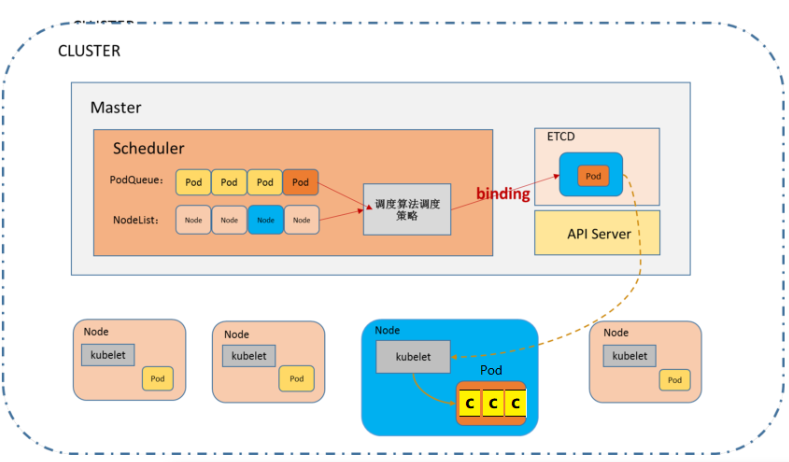

# Kubernetes(K8s)

# 一、Kubernetes

## 1、borg系统

  Borg. Google的Borg系统运行几十万个以上的任务，来自几千个不同的应用，跨多个集群，每个集群（cell）有上万个机器。它通过管理控制、高效的任务包装、超售、和进程级别性能隔离实现了高利用率。它支持高可用性应用程序与运行时功能，最大限度地减少故障恢复时间，减少相关故障概率的调度策略。以下就是Borg的系统架构图。其中Scheduler负责任务的调度。 

</img>


## 2、k8s基本介绍

​	就在Docker容器技术被炒得热火朝天之时，大家发现，如果想要将Docker应用于具体的业务实现，是存在困难的——编排、管理和调度等各个方面，都不容易。于是，人们迫切需要一套管理系统，对Docker及容器进行更高级更灵活的管理。就在这个时候，K8S出现了。 

***\*K8S****，就是基于容器的集群管理平台，它的全称，是kubernetes**

</img>


## 3、k8s主要功能

​	Kubernetes是docker容器用来编排和管理的工具，它是基于Docker构建一个容器的调度服务，提供资源调度、均衡容灾、服务注册、动态扩缩容等功能套件。Kubernetes提供应用部署、维护、 扩展机制等功能，利用Kubernetes能方便地管理跨机器运行容器化的应用，其主要功能如下： 

* 数据卷: Pod中容器之间共享数据，可以使用数据卷。

* 应用程序健康检查: 容器内服务可能进程堵塞无法处理请求，可以设置监控检查策略保证应用健壮性。

* 复制应用程序实例: 控制器维护着Pod副本数量，保证一个Pod或一组同类的Pod数量始终可用。

* 弹性伸缩: 根据设定的指标（CPU利用率）自动缩放Pod副本数。

* 服务发现: 使用环境变量或DNS服务插件保证容器中程序发现Pod入口访问地址。

* 负载均衡: 一组Pod副本分配一个私有的集群IP地址，负载均衡转发请求到后端容器。在集群内部其他Pod可通过这个ClusterIP访问应用。

* 滚动更新: 更新服务不中断，一次更新一个Pod，而不是同时删除整个服务。

* 服务编排: 通过文件描述部署服务，使得应用程序部署变得更高效。

* 资源监控: Node节点组件集成cAdvisor资源收集工具，可通过Heapster汇总整个集群节点资源数据，然后存储到InfluxDB时序数据库，再由Grafana展示。

* 提供认证和授权: 支持属性访问控制（ABAC）、角色访问控制（RBAC）认证授权策略。


## 4、k8s集群架构

这个集群主要包括两个部分： 

- **一个Master节点（主节点）**

- **一群Node节点（计算节点）**

</img>

一看就明白：Master节点主要还是负责管理和控制。Node节点是工作负载节点，里面是具体的容器。


**1）Master节点**

​                                

Master节点包括API Server、Scheduler、Controller manager、etcd。API Server是整个系统的对外接口，供客户端和其它组件调用，相当于“营业厅”。Scheduler负责对集群内部的资源进行调度，相当于“调度室”。Controller manager负责管理控制器，相当于“大总管”。

</img>


**2）node节点**


</img>

 Node节点包括Docker、kubelet、kube-proxy、Fluentd、kube-dns（可选），还有就是**Pod**  


## 5、k8s master

### 5.1、api server

Kubernetes API Server: Kubernetes API，集群的统一入口，各组件协调者，以HTTP API提供接口服务，所有对象资源的增删改查和监听操作都 交给APIServer处理后再提交给Etcd存储。


### 5.2、ManagerController

</img>


### 5.3、etcd

etcd 是一个分布式的、可靠的 key-value 存储系统，它用于存储分布式系统中的关键数据，这个定义非常重要。


etcd是一个第三方服务，分布式键值存储系统。用于保持集群状态，比如Pod、Service等对象信息

etcd是一个高可用的分布式键值(key-value)数据库。etcd内部采用raft协议作为一致性算法，etcd基于Go语言实现。Etcd是Kubernetes集群中的一个十分重要的组件，用于保存集群所有的网络配置和对象的状态信息。整个kubernetes系统中一共有两个服务需要用到etcd用来协同和存储配置，分别是：

1）网络插件flannel、对于其它网络插件也需要用到etcd存储网络的配置信息

2）kubernetes本身，包括各种对象的状态和元信息配置

### 5.4、scheduler

​	根据调度算法为新创建的Pod选择一个Node节点。 scheduler在整个系统中承担了承上启下的重要功能，承上是指它负责接收controller manager创建新的Pod，为其安排一个落脚的目标Node，启下是指安置工作完成后，目标Node上的kubelet服务进程接管后继工作。

也就是说scheduler的作用是通过调度算法为待调度Pod列表上的每一个Pod从Node列表中选择一个最合适的Node。

                     

 

## 6、k8s node

### 6.1、kubelet

【kubelet负责管理[pods](https://www.kubernetes.org.cn/kubernetes-pod)和它们上面的容器，images镜像、volumes、etc】

kubelet是Master在Node节点上的Agent，每个节点都会启动 kubelet进程，用来处理 Master 节点下发到本节点的任务，管理本机运行容器的生命周期，比如创建容器、Pod挂载数据卷、 下载secret、获取容器和节点状态等工作。kubelet将每个Pod转换成一组容器。

 

1、kubelet 默认监听四个端口，分别为 10250 、10255、10248、4194

 

​                                

*  10250（kubelet API）：kubelet server 与 apiserver 通信的端口，定期请求 apiserver 获取自己所应当处理的任务，通过该端口可以访问获取 node 资源以及状态。 

* 10248（健康检查端口）：通过访问该端口可以判断 kubelet 是否正常工作, 通过 kubelet 的启动参数 --healthz-port 和 --healthz-bind-address 来指定监听的地址和端口。 

* 4194（cAdvisor 监听）：kublet 通过该端口可以获取到该节点的环境信息以及 node 上运行的容器状态等内容，访问 http://localhost:4194 可以看到 cAdvisor 的管理界面,通过 kubelet 的启动参数 `--cadvisor-port` 可以指定启动的端口。 

* 10255 （readonly API）：提供了 pod 和 node 的信息，接口以只读形式暴露出去，访问该端口不需要认证和鉴权。

   

### 6.2、kube-proxy

在Node节点上实现Pod网络代理，维护网络规则和四层负载均衡工作，kube-proxy 本质上,类似一个反向代理. 我们可以把每个节点上运行的 kube-proxy 看作 service 的透明代理兼LB.

  

kube-proxy 监听 apiserver 中service 与Endpoint 的信息, 配置iptables 规则,请求通过iptables 直接转发给 pod

 

### 6.3、docker

运行容器的引擎。

### 6.4、pod

Pod是最小部署单元，一个Pod有一个或多个容器组成，Pod中容器共享存储和网络，在同一台Docker主机上运行

1）pod基本结构


**Pause的作用：**

我们看下在node节点上都会起很多pause容器，和pod是一一对应的。

每个Pod里运行着一个特殊的被称之为Pause的容器，其他容器则为业务容器，这些业务容器共享Pause容器的网络栈和Volume挂载卷，因此他们之间通信和数据交换更为高效，在设计时我们可以充分利用这一特性将一组密切相关的服务进程放入同一个Pod中。同一个Pod里的容器之间仅需通过localhost就能互相通信。

**kubernetes中的pause容器主要为每个业务容器提供以下功能：**

​	PID  命名空间：Pod中的不同应用程序可以看到其他应用程序的进程ID

​	网络命名空间：Pod中的多个容器能够访问同一个IP和端口范围

​	IPC命名空间：Pod中的多个容器能够使用SystemV IPC或POSIX消息队列进行通信

​	UTS命名空间：Pod中的多个容器共享一个主机名；

​    Volumes（共享存储卷）：Pod中的各个容器可以访问在Pod级别定义的Volumes

## 7、 Other组件

 

CoreDNS：可以为集群中的SVC创建一个域名IP的对应关系解析

DasHBoard：给 K8S 集群提供一个 B/S 结构访问体系

Ingress Controller：官方只能实现四层代理，INGRESS 可以实现七层代理

Federation：提供一个可以跨集群中心多K8S统一管理功能

Prometheus：提供K8S集群的监控能力

ELK：提供 K8S 集群日志统一分析介入平台

 

# 二、核心组件原理


## 1、RC[控制器]

<font color="red">ReplicationController</font>

​	用来确保容器应用的副本数始终保持在用户定义的副本数，即如果有容器异常退出，会自动创建新的Pod来替代，而如果异常多出的容器也会自动回收。

​	在新版本的 Kubernetes 中建议使用ReplicaSet 来取代ReplicationController

## 2、RS[控制器]

​	<font color="red">ReplicaSet</font>

​	ReplicaSet跟ReplicationController没有本质的不同，只是名字不一样，并且ReplicaSet支持集合式的selector

</img>

​	

​	虽然ReplicaSet可以独立使用，但一般还是建议使用Deployment来自动管理ReplicaSet,这样就无需担心跟其他机制的不兼容问题（比如 ReplicaSet 不支持 rolling-update 但 Deployment支持）


## 	3、Deployment

​	Deployment为Pod和ReplicaSet 提供了一个 声明式定义方法，用来替代以前的 ReplicationController 来方便的管理应用。

​	典型的应用场景：

​	（1）、定义Deployment 来创建 Pod 和 ReplicaSet

​	（2）、滚动升级和回滚应用

​	（3）、扩容和索容

​	（4）、暂停和继续 Deployment

​	Deployment不仅仅可以滚动更新，而且可以进行回滚，如果发现升级到V2版本后，发现服务不可用，可以回滚到V1版本。

## 4、HPA

<font color="red">HPA(HorizontalPodAutoScale)</font>

Horizontal Pod Autoscaling 仅适用于 Deployment 和 ReplicaSet,在V1版本中仅支持根据Pod的CPU利用率扩容，在vlalpha版本中，支持根据内存和用户自定义的metric扩缩容


## 5、StatefullSet

StatefullSet 是为了解决有状态服务的问题（对应Deployments 和 ReplicaSets 是为无状态服务而设计），其应用场景包括：

（1） 稳定的持久化存储，即Pod重新调度后还是能访问的相同持久化数据，基于PVC来实现

（2）稳定的网络标志，及Pod重新调度后其 PodName 和 HostName 不变，基于Headlesss Service（即没有 Cluster IP 的 Service）来实现。

（3）有序部署，有序扩展，即Pod是有顺序的，在部署或者扩展的时候要依据定义的顺序依次进行（即从 0 到 N-1,在下一个Pod运行之前所有之前的Pod必须都是Running 和 Ready 状态），基于 init containers 来实现。

（4）有序收缩，有序删除（即从N-1 到 0）

## 6、DaemonSet

​	DaemonSet确保全部（或者一些 [ node打上污点（可以想象成一个标签）,pod如果不定义容忍这个污点，那么pod就不会被调度器分配到这个node ]）

​	Node上运行一个Pod的副本。当有Node加入集群时，也会为他们新增一个Pod。当有Node从集群移除时，这些Pod也会被回收。删除DaemonSet将会删除他创建的所有Pod,使用DaemonSet 的一些典型用法：

（1） 运行集群存储daemon,例如在每个Node上运行glustered,ceph

（2）在每个Node上运行日志收集Daemon,例如：fluentd、logstash.

（3）在每个Node上运行监控Daemon,例如：Prometheus Node Exporter

Job 负责批处理任务，即仅执行一次的任务，它保证批处理任务的一个或多个Pod成功结束

Cron Job管理基于时间Job,即：

* 在给定时间点只运行一次
* 周期性地在给定时间点运行

## 7、Volume

数据卷，共享Pod中容器使用的数据。 

</img>


## 8、**Label**

```
标签用于区分对象（比如Pod、Service），键/值对存在；每个对象可以有多个标签，通过标签关联对象。 
```

​	Kubernetes中任意API对象都是通过Label进行标识，Label的实质是一系列的Key/Value键值对，其中key于value由用户自己指定。

​	Label可以附加在各种资源对象上，如Node、Pod、Service、RC等，一个资源对象可以定义任意数量的Label，同一个Label也可以被添加到任意数量的资源对象上去。

​	Label是Replication Controller和Service运行的基础，二者通过Label来进行关联Node上运行的Pod。

我们可以通过给指定的资源对象捆绑一个或者多个不同的Label来实现多维度的资源分组管理功能，以便于灵活、方便的进行资源分配、调度、配置等管理工作。
一些常用的Label如下：

版本标签："release":"stable","release":"canary"......

环境标签："environment":"dev","environment":"qa","environment":"production"

架构标签："tier":"frontend","tier":"backend","tier":"middleware"

分区标签："partition":"customerA","partition":"customerB"

质量管控标签："track":"daily","track":"weekly"

Label相当于我们熟悉的标签，给某个资源对象定义一个Label就相当于给它大了一个标签，随后可以通过Label Selector（标签选择器）查询和筛选拥有某些Label的资源对象，Kubernetes通过这种方式实现了类似SQL的简单又通用的对象查询机制。

Label Selector在Kubernetes中重要使用场景如下:
**->** kube-Controller进程通过资源对象RC上定义Label Selector来筛选要监控的Pod副本的数量，从而实现副本数量始终符合预期设定的全自动控制流程;
**->** kube-proxy进程通过Service的Label Selector来选择对应的Pod，自动建立起每个Service岛对应Pod的请求转发路由表，从而实现Service的智能负载均衡;
**->** 通过对某些Node定义特定的Label，并且在Pod定义文件中使用Nodeselector这种标签调度策略，kuber-scheduler进程可以实现Pod”定向调度“的特性;


# 三、服务发现

## 1、service

### 1.1、什么是Service

​	Service是一个抽象的概念。它通过一个虚拟的IP的形式(VIPs)，映射出来指定的端口，通过代理客户端发来的请求转发到后端一组Pods中的一台（也就是endpoint）

​	Service定义了Pod逻辑集合和访问该集合的策略，是真实服务的抽象。Service提供了统一的服务访问入口以及服务代理和发现机制，关联多个相同Label的Pod，用户不需要了解后台Pod是如何运行。
外部系统访问Service的问题:
**->**  首先需要弄明白Kubernetes的三种IP这个问题
​      **-**  Node IP：Node节点的IP地址
　   **-**  Pod IP： Pod的IP地址
　   **-**  Cluster IP：Service的IP地址

**->**   首先,Node IP是Kubernetes集群中节点的物理网卡IP地址，所有属于这个网络的服务器之间都能通过这个网络直接通信。这也表明Kubernetes集群之外的节点访问Kubernetes集群之内的某个节点或者TCP/IP服务的时候，必须通过Node IP进行通信

**->**  其次，Pod IP是每个Pod的IP地址，他是Docker Engine根据docker0网桥的IP地址段进行分配的，通常是一个虚拟的二层网络。

最后Cluster IP是一个虚拟的IP，但更像是一个伪造的IP网络，原因有以下几点: 
**->**  Cluster IP仅仅作用于Kubernetes Service这个对象，并由Kubernetes管理和分配P地址
**->**  Cluster IP无法被ping，他没有一个“实体网络对象”来响应
**->**  Cluster IP只能结合Service Port组成一个具体的通信端口，单独的Cluster IP不具备通信的基础，并且他们属于Kubernetes集群这样一个封闭的空间。
**->**  Kubernetes集群之内，Node IP网、Pod IP网于Cluster IP网之间的通信，采用的是Kubernetes自己设计的一种编程方式的特殊路由规则。

### 1.2、service原理


## 2、IPTables

Iptables模式为Services的默认代理模式。在iptables 代理模式中，kube-proxy不在作为反向代理的在VIPs 和backend Pods之间进行负载均衡的分发。这个工作放给工作在四层的iptables来实现。iptables 和netfilter紧密集成，密切合作，都在kernelspace 就实现了包的转发。

 

在这个模式下，kube-proxy 主要有这么几步来实现实现报文转发：

- 通过watching kubernetes集群 cluster API， 获取新建、删除Services或者Endpoint Pod指令。
- kube-proxy 在node上设置iptables规则，当有请求转发到Services的 ClusterIP上后，会立即被捕获，并重定向此Services对应的一个backend的Pod。
- kube-proxy会在node上为每一个Services对应的Pod设置iptables 规则，选择Pod默认算法是随机策略。


在iptables模式中，kube-proxy把流量转发和负载均衡的策略完全委托给iptables/netfiter 来做，这些转发操作都是在kernelspace 来实现，比userspace 快很多。


在iptables 中kube-proxy 只做好watching API 同步最新的数据信息这个角色。路由规则信息和转发都放在了kernelspace 的iptables 和netfiter 来做了。但是，这个这个模式不如userspace模式的一点是，在usersapce模式下，kube-proxy做了负载均衡，如果选择的backend 一台Pod没有想要，kube-proxy可以重试，在iptables模式下，就是一条条路由规则，要转发的backend Pod 没有响应，且没有被K8S 摘除，可能会导致转发到此Pod请求超时，需要配合K8S探针一起使用。 

### 2.1、负载均衡的方式

在Linux中使用iptables完成tcp的负载均衡有两种模式：随机、轮询

```
The statistic module support two different modes:

random:(随机)
the rule is skipped based on a probability
nth:（轮询）
the rule is skipped based on a round robin algorithm
```

### 2.2、随机方式

下面以一个example说明iptables两种LB方式的具体实现：

系统中提供3个servers，下面我们通过配置iptables使流量均衡访问这3台server。

```bash
# 随机：(Random balancing)
iptables -A PREROUTING -t nat -p tcp -d 192.168.1.1 --dport 27017 -m statistic --mode random --probability 0.33  -j DNAT --to-destination 10.0.0.2:1234
iptables -A PREROUTING -t nat -p tcp -d 192.168.1.1 --dport 27017 -m statistic --mode random --probability 0.5 -j DNAT --to-destination 10.0.0.3:1234
iptables -A PREROUTING -t nat -p tcp -d 192.168.1.1 --dport 27017  -j DNAT --to-destination 10.0.0.4:1234
```

**rules说明：**

第一条规则中，指定--probability 0.33 ，则说明该规则有33%的概率会命中，

第二条规则也有33%的概率命中，因为规则中指定 --probability 0.5。 则命中的概率为：50% * （1 - 33%）=0.33

第三条规则中，没有指定 --probability 参数，因此意味着当匹配走到第三条规则时，则一定命中，此时走到第三条规则的概率为：1 - 0.33 -0.33 ≈ 0.33。

由上可见，三条规则命中的几率一样的。此外，如果我们想修改三条规则的命中率，可以通过 --probability 参数调整。

假设有n个server，则可以设定n条rule将流量均分到n个server上，其中 --probability 参数的值可通过以下公式计算得到：

```
其中 i 代表规则的序号（第一条规则的序号为1）

n 代表规则/server的总数

p 代表第 i 条规则中 --probability 的参数值

 p=1/(n−i+1)
```


注意：因为iptables中，规则是按顺序匹配的，由上至下依次匹配，因此设计iptables规则时，要严格对规则进行排序。因此上述三条规则的顺序也不可以调换，不然就无法实现LB均分了。

 

### 2.3、轮询方式


轮询算法中有两个参数：

     n： 指每 n 个包
    
     p：指第 p 个包

在规则中 n 和 p 代表着： 从第 p 个包开始，每 n 个包执行该规则。

这样可能有点绕口，直接看栗子吧：

还是上面的例子，有3个server，3个server轮询处理流量包，则规则配置如下：

```bash
#every：每n个包匹配一次规则
#packet：从第p个包开始
iptables -A PREROUTING -t nat -p tcp -d 192.168.1.1 --dport 27017 -m statistic --mode nth --every 3 --packet 0 -j DNAT --to-destination 10.0.0.2:1234
iptables -A PREROUTING -t nat -p tcp -d 192.168.1.1 --dport 27017 -m statistic --mode nth --every 2 --packet 0  -j DNAT --to-destination 10.0.0.3:1234
iptables -A PREROUTING -t nat -p tcp -d 192.168.1.1 --dport 27017 -j DNAT --to-destination 10.0.0.4:1234
```

## 3、IPVS

### 3.1、什么是IPVS

IPVS（IP虚拟服务器）实现传输层负载平衡，通常称为第4层LAN交换，是Linux内核的一部分。

IPVS在主机上运行，在真实服务器集群前充当负载均衡器。 IPVS可以将对基于TCP和UDP的服务的请求定向到真实服务器，并使真实服务器的服务在单个IP地址上显示为虚拟服务。

### 3.2、IPVS vs. IPTABLES

IPVS模式在Kubernetes v1.8中引入，并在v1.9中进入了beta。 IPTABLES模式在v1.1中添加，并成为自v1.2以来的默认操作模式。 IPVS和IPTABLES都基于netfilter。 IPVS模式和IPTABLES模式之间的差异如下：

- IPVS为大型集群提供了更好的可扩展性和性能。
- IPVS支持比iptables更复杂的负载平衡算法（最小负载，最少连接，位置，加权等）。
- IPVS支持服务器健康检查和连接重试等。

我们都知道，在Linux 中iptables设计是用于防火墙服务的，对于比较少规则的来说，没有太多的性能影响。但是对于，一个K8S集群来说，会有上千个Services服务，当然也会转发到Pods，每个都是一条iptables规则，对集群来说，每个node上会有大量的iptables规则，简直是噩梦。

同样IPVS可以解决可能也会遇见这样大规模的网络转发需求，但是IPVS用hash tabels来存储网络转发规则，比iptables 在这上面更有优势，而且它主要工作在kernelspace，减少了上下文切换带来的开销。

###  3.3、IPVS负载步骤

kube-proxy和IPVS在配置网络转发中，有这么几步：

- 通过watching kubernetes集群 cluster API， 获取新建、删除Services或者Endpoint Pod指令，有新的Service建立，kube-proxy回调网络接口，构建IPVS规则。
- 同时，kube-proxy会定期同步 Services和backend Pods的转发规则，确保失效的转发能被更新修复。
- 有请求转发到后端的集群时，IPVS的负载均衡直接转发到backend Pod。


### 3.4、IPVS负载算法

IPVS支持的负载均衡算法有这么几种：

- rr: 轮询
- lc: 最小连接数
- dh: 目的地址hash
- sh: 源地址hash
- sed: 最短期望延迟
- nq: 无须队列等待

在node上通过 “–ipvs-scheduler”参数，指定kube-proxy的启动算法。