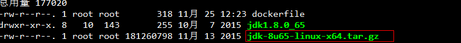

 

# Docker从基础到高级实战

# 1 Dockerfile

## 1.1 什么是Dockerfile

Dockerfile是由一系列命令和参数构成的脚本，这些命令应用于基础镜像并最终创建一个
新的镜像。

1、对于开发人员：可以为开发团队提供一个完全一致的开发环境；

2、对于测试人员：可以直接拿开发时所构建的镜像或者通过Dockerfile文件构建一个新
的镜像开始工作了；

3、对于运维人员：在部署时，可以实现应用的无缝移植。

## 1.2 常用命令

| 命令                                | 作用                                                         |
| ----------------------------------- | ------------------------------------------------------------ |
| FROM image_name:tag                 | 定义了使用哪个基础镜像启动构建流程                           |
| MAINTAINER user_name                | 声明镜像的创建者                                             |
| ENV key value                       | 设置环境变量 (可以写多条)                                    |
| RUN command                         | 是Dockerfile的核心部分(可以写多条)                           |
| ADD source_dir/file  dest_dir/file  | 将宿主机的文件复制到容器内，如果是一个压缩文件，<br/>将会在复制后自动解压 |
| COPY source_dir/file  dest_dir/file | 和ADD相似，但是如果有压缩文件并不能解压                      |
| WORKDIR path_dir                    | 设置工作目录                                                 |
| EXPOSE port1 prot2                  | 用来指定端口，使容器内的应用可以通过端口和外界交<br/>互      |
| CMD argument                        | 在构建容器时使用，会被docker run 后的argument覆<br/>盖       |
| ENTRYPOINT argument                 | 和CMD相似，但是并不会被docker run指定的参数覆盖              |
| VOLUME                              | 将本地文件夹或者其他容器的文件挂载到容器中                   |


## 1.3 使用脚本创建镜像

### 1.3.1 创建JDK1.8镜像

步骤：
（1）创建目录

```bash
#在本地Linux机器创建一个工作目录
mkdir –p /usr/local/dockerjdk8
```

（2）下载jdk-8u65-linux-x64.tar.gz并上传到服务器（虚拟机）中的/usr/local/dockerjdk8目录



（3）创建文件Dockerfile 

```bash
#第一套配置
#依赖镜像名称和ID
FROM centos:latest
#指定镜像创建者信息
MAINTAINER Hulk
#切换工作目录
WORKDIR /javaee
ADD jdk-8u65-linux-x64.tar.gz /javaee
#ADD 是相对路径jar,把java添加到容器中
#配置java环境变量
ENV JAVA_HOME /usr/local/java/jdk1.8.0_65
ENV PATH $JAVA_HOME/bin:$PATH


#第二套：前面一直报错，因此用了第二套，但是经过测试是镜像构建编码问题，和JDK无关，因此第一个配置，第二个配置应该都ok。
#docker logs 6eeb1af46d04
#Error: Could not find or load main class ???jar
#依赖镜像名称和ID
FROM centos:latest
#指定镜像创建者信息
MAINTAINER Hulk
#切换工作目录
WORKDIR /javaee
ADD jdk-8u65-linux-x64.tar.gz /usr/local/java
#ADD 是相对路径jar,把java添加到容器中
#配置java环境变量
ENV JAVA_HOME /usr/local/java/jdk1.8.0_65
ENV JRE_HOME $JAVA_HOME/jre
ENV CLASSPATH $JAVA_HOME/lib/dt.jar:$JAVA_HOME/lib/tools.jar:$JRE_HOME/lib:$CLASSPATH
ENV PATH $JAVA_HOME/bin:$PATH
```


（4）执行命令构建镜像

```bash
# 构建镜像 -t -tag 指定镜像的名称版本
docker build ‐t='jdk1.8' .
#命令变形
docker build -t jdk1.8 .
#命令变形
docker build -t jdk1.8:v1 .
#指定dockerfile
docker build -f java/dockerfile -t eureka:v1 .
```

注意后边的空格和点，不要省略

（5）查看镜像是否建立完成

```bash
docker images
```


（6）创建容器

```bash
docker run ‐it ‐‐name=myjdk8 jdk1.8 /bin/bash
```

果然可以创建哟~

### 1.3.2 创建Eureka镜像

（1）进入控制台，eureka工程的目录下，执行maven命令

```java
#maven编译
mvn clean package
#可使用idea工具自动构建
把生成的jar拷贝到Linux服务器
```

（2）服务器创建/usr/local/dockereureka目录， 将生成的supergo-eureka-1.0-SNAPSHOT.jar上传到服务器的此目录


（3）创建文件Dockerfile

```bash
#注意空格及一些特殊符号‘-’编码问题，有严格要求，否则无法构建镜像
FROM jdk1.8
VOLUME /tmp
ADD supergo-eureka-1.0-SNAPSHOT.jar /usr/local/
ENTRYPOINT ["java","‐jar","/usr/local/supergo-eureka-1.0-SNAPSHOT.jar"]
```

（4）创建镜像

```bash
docker build ‐t='eureka' .
```

（5）创建容器

```bash
docker run ‐di ‐‐name=myeureka ‐p 6868:6868 eureka
```


