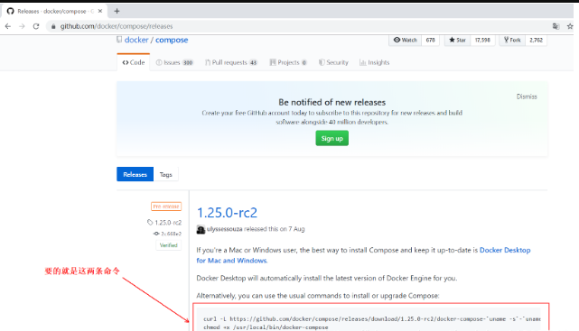
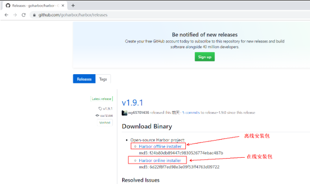
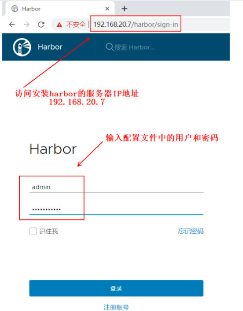
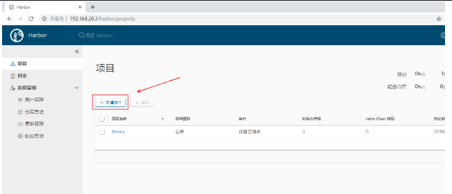
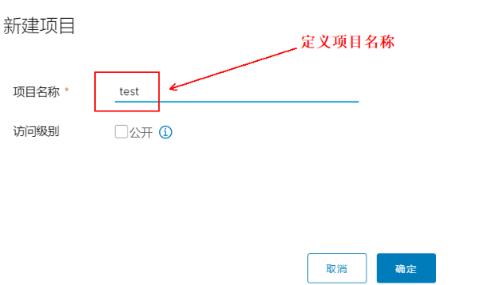
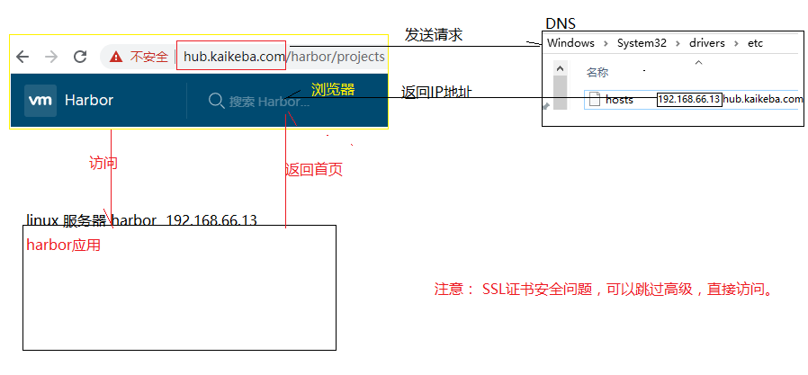
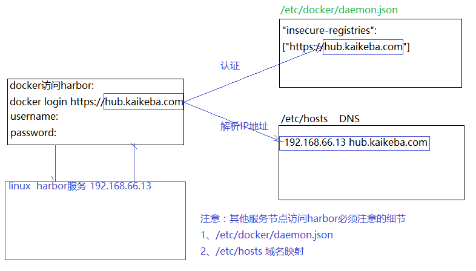

# Registry&Harbor私有仓库

这篇博文写的是两种不同的搭建Docker私有仓库的方法，都必须要基于一个Docker服务器上，相比较而言，Harbor功能更强大些。

之前详细写过Registry私有仓库的搭建方法，这里的Registry只是有一点配置不一样而已，若要搭建Registry私有仓库，最好结合：[Docker镜像的创建+构建私有仓库及其使用方法](https://blog.51cto.com/14154700/2436956)这篇博文来，对比其不一样的地方，选择适合自己的方案。

## 一、搭建Registry私有仓库

> 环境准备：
>
> - 两台centos 7.3，一台为Docker私有仓库服务器，另一台为测试端，两台须可ping通；
> - 参考博文：[Docker的安装详细配置](https://blog.51cto.com/14154700/2442086)，对两台服务器进行安装docker环境。

### 1、第一台服务

开始配置第一台Docker私有仓库服务器：

```
[root@docker ~]# docker pull registry     #下载registry镜像
[root@docker ~]# docker run -tid --name registry --restart=always -p 5000:5000 -v /data/registry:/var/lib/registry registry
#运行该镜像，各个选项含义如下：
# -tid：以后台持久运行，并分配一个可交互的为终端
# --name registry  ：给容器定义一个名字
#  --restart=always：该容器可以随着docker服务的启动而启动
# -p：将容器的端口映射到宿主机，冒号前面是宿主机的端口，冒号后面是容器的端口，registry的默认端口是5000
# -v：将宿主机的目录挂载到容器中，冒号前面是宿主机的目录，冒号后面是容器中的目录
[root@docker ~]# docker images   #查看当前的镜像
REPOSITORY          TAG                 IMAGE ID            CREATED             SIZE
centos              latest              0f3e07c0138f        2 weeks ago         220MB
registry            latest              f32a97de94e1        7 months ago        25.8MB
[root@docker ~]# docker tag centos:latest 192.168.20.7:5000/centos:latest   
#更改镜像名称，以便符合私有仓库名称规范
#注：私有仓库镜像的命名规则：192.168.20.7:5000/XXX（宿主机的IP:5000端口/镜像名称）
[root@docker ~]# vim /usr/lib/systemd/system/docker.service   #更改docker的配置文件，以便指定私有仓库
ExecStart=/usr/bin/dockerd -H unix:// --insecure-registry 192.168.20.7:5000
#定位到上面那行，在后面添加“--insecure-registry”并指定私有仓库的IP及端口，然后保存退出即可 
[root@docker ~]# systemctl daemon-reload     #重载配置文件
[root@docker ~]# systemctl restart docker    #重启docker服务
[root@docker ~]# docker push 192.168.20.7:5000/centos:latest     #上传镜像至私有仓库
[root@docker ~]# curl 192.168.20.7:5000/v2/_catalog   #查看私有仓库中的镜像
{"repositories":["centos"]}
[root@docker ~]# curl 192.168.20.7:5000/v2/centos/tags/list   #查看镜像的详细信息
{"name":"centos","tags":["latest"]}
```

### 2、第二台服务

第二台Docker服务器进行如下操作：

```
[root@docker02 ~]# vim /usr/lib/systemd/system/docker.service   #编辑主配置文件
ExecStart=/usr/bin/dockerd -H unix:// --insecure-registry 192.168.20.7:5000
#定位到上面那行，添加“--insecure-registry”指定私有仓库的IP及参数
#添加完成后，保存退出即可
[root@docker02 ~]# systemctl daemon-reload   #重载配置文件
[root@docker02 ~]# systemctl restart docker    #重启docker服务
[root@docker02 ~]# docker pull 192.168.20.7:5000/centos:latest
#下载私有仓库的中的镜像
[root@docker02 ~]#  docker images      #确认下载的镜像
```

## 二、配置Harbor私有仓库

Harbor私有仓库和第一个Registry私有仓库相比较而言，功能强大很多，并且支持web图形化管理，推荐使用。

> 环境和搭建Registry的一样，如下：
>
> - 两台centos 7.3，一台为Docker私有仓库服务器，另一台为测试端，两台须可ping通；
> - 参考博文：[Docker的安装详细配置](https://blog.51cto.com/14154700/2442086)，对两台服务器进行安装docker环境。

### 1、安装compose

打开github.com官网，在登录页面的右上角搜索compose找到docker/compose再找releases，（网址：https://github.com/docker/compose/releases） 如下：

</img>

复制自己所需版本下提供的两条命令，在第一台Docker服务器上依次进行操作：

```bash
#在线下载docker-compose ,harbor需要借助docker-compose安装
#安装依赖包
yum -y install yum-utils device-mapper-persistent-data lvm2
#复制官网上的上述命令
curl -L https://github.com/docker/compose/releases/download/1.24.1/docker-compose-`uname -s`-`uname -m` -o /usr/local/bin/docker-compose

#赋予该命令执行权限
chmod u+x /usr/local/bin/docker-compose  
#查看其版本信息
docker-compose -version   
docker-compose version 1.24.1, build 4667896b

#################################推荐离线安装########################################
#离线安装
#上传本地文件，资料已经准备，在本地文件夹
#把本地文件拷贝到/usr/local/bin目录下
mv docker-compose /usr/local/bin/
#授权：可以执行
chmod 755 /usr/local/bin/docker-compose
#查询docker版本
docker-compose -version
```

### 2、安装harbor

​	github官网搜索harbor，再点击goharbor/harbor，再点击“releases”，根据自己所需，下载相应的版本，上传至服务器（网址如下：https://github.com/goharbor/harbor/releases 也可下载在线安装的包，没试过，可自行尝试），如下：

</img>


```bash
#追加ip:hostname到每一台机器节点
echo "192.168.66.13 hub.kaikeba.com" >> /etc/hosts

#查询harbor服务节点 /etc/hosts
192.168.66.10 k8s-master01
192.168.66.11 k8s-node01
192.168.66.12 k8s-node02
192.168.66.13 hub.kaikeba.com

#windows系统中 hosts中去填写 ip:hosts，后期使用域名访问
192.168.66.13 hub.kaikeba.com


#将下载的安装包解压到指定目录
tar zxf harbor-offline-installer-v1.7.4.tgz -C /usr/src
#切换至解压后的目录中
cd /usr/src/harbor/    
#编辑这个配置文件
vim harbor.cfg     

..............#省略部分内容

#将hostname更改为本机IP
#[此处可以写域名：hostname = hub.kaikeba.com]  
hostname = 192.168.20.7

#设置https协议
ui_url_protocol = https

#这行指定的是登录harbor的登录名及密码
#默认用户为“admin”，密码为“Harbor12345”
harbor_admin_password = Harbor12345    

..............#省略部分内容

#自定义证书开启
customize_crt = on
#创建证书存储目录：ssl_cert = /data/cert/server.crt 配置文件中有说明
mkdir -p /data/cert/

#创建证书
#进入创建的存储证书的目录
cd !$
#首先生成证书私钥
openssl genrsa -des3 -out server.key 2048
#证书的服务
openssl req -new -key server.key -out server.csr
#备份私钥
cp server.key server.key.org
#转换为证书
openssl rsa -in server.key.org -out server.key
#给证书签名
openssl x509 -req -days 365 -in server.csr -signkey server.key -out server.crt
#给所有的证书授权
chmod 755 *

#执行自带的安装脚本，安装完毕，浏览器即可访问
./install.sh

# 10,11,12 几台工作机器：编辑docker主配置文件daemon.json加入，注意逗号的问题，否则无法连接harbor
"insecure-registries": ["https://hub.kaikeba.com"]

# 配置上阿里云镜像
{"exec-opts": ["native.cgroupdriver=systemd"],"log-driver": "json-file","log-opts": {"max-size": "100m"},"registry-mirrors":["https://pee6w651.mirror.aliyuncs.com"],"insecure-registries": ["https://hub.kaikeba.com"]}

#确定80端口正在监听
netstat -antp | grep 80    

#重新加载配置文件
systemctl daemon-reload   
 #重启docker服务
systemctl restart docker   
#停止所有容器
docker-compose stop    
#启动所有容器
docker-compose start    
```

### 3、登录harbor

​	使用浏览器访问harbor服务器的IP地址，使用配置文件中指定的用户名及密码登录（默认用户为“admin”，密码为“Harbor12345”）

</img>

注意：登录时，证书认证时候，选择高级，略过即可

### 4、新建项目

点击“新建项目”

</img>

### 5、项目名称

定义项目名称：

</img>

### 6、上传镜像

回到Harbor服务器，开始向Harbor上传镜像

```bash
#命令行登录到harbor
#docker login -u admin -p Harbor12345 192.168.20.7:80  
#域名登录
docker login https://hub.kaikeba.com
#更改镜像名称
docker tag centos:latest hub.kaikeba.com/test/centos:latest  

#注意要上传至harbor仓库的命名规范，其中test是刚才在harbor创建的项目
#上传至harbor,将会根据域名到指定仓库进行上传
docker push hub.kaikeba.com/test/centos:latest

#下载镜像,将会根据域名到指定仓库进行下载
docker pull hub.kaikeba.com/test/centos:latest
```


### 7、流程说明

1）浏览器访问流程



2）docker访问流程




