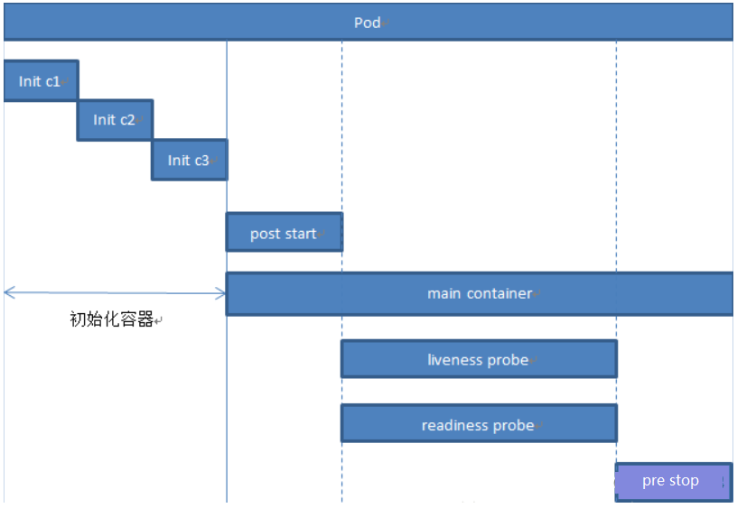

# Kubernetes(K8s)-k8s资源清单

# 一、资源控制器

## 1、什么是控制器？

Kubernetes中内建了很多controller (控制器) ,这些相当于一个状态机,用来控制Pod的具体状态和行为

Pod 的分类

- 自主式 Pod：Pod 退出了，此类型的 Pod 不会被创建
- 控制器管理的 Pod：在控制器的生命周期里，始终要维持 Pod 的副本数目

## 2、常用控制器

- ReplicationController（旧版本）
- ReplicaSet
- Deployment
- DaemonSet
- Job/Cronjob

## 3、自主式pod

```yaml
# 自主式的pod: 单独定义一个pod,这个没有没有副本控制器管理，也没有对应deployment
#init-pod.yaml
apiVersion: v1
kind: Pod
metadata:
 name: init-pod
 labels:
   app: myapp
spec:
 containers:
 - name: myapp
   image: hub.kaikeba.com/library/myapp:v1
#注意事项
#总结
#k8s资源对象（所有的k8s管理的资源，都叫做资源对象），都可以独立存在，但是需要根据相应原理，需求结合使用。
```


## 4、RC&RS

ReplicationController (RC)用来确保容器应用的副本数始终保持在用户定义的副本数,即如果有容器异常退出,会自动创建新的Pod来替代;而如果异常多出来的容器也会自动回收;

在新版本的Kubernetes中建议使用Replicaset来取代ReplicationController. ReplicaSet跟 ReplicationController没有本质的不同,只是名字不一样,并且ReplicaSet支持集合式的selector;

```yaml
apiVersion: extensions/v1beta1 
kind: ReplicaSet 
metadata:
  name: frontend 
spec:
  replicas: 3
  selector:
    matchLabels: 
      tier: frontend 
  template:
    metadata:
      labels:
        tier: frontend
    spec:
      containers:
        - name: Java-nginx
          image: hub.kaikeba.com/library/myapp:v1
          env:
            - name: GET_HOSTS_FROM 
              value: dns
          ports:
            - containerPort: 80
            
```

## 5、Deployment

Deployment为Pod和ReplicaSet提供了一个声明式定义(declarative)方法,用来替代以前的 ReplicationController来方便的管理应用。典型的应用场景包括;

- 定义Deployment来创建Pod和ReplicaSet
- 滚动升级和回滚应用
- 扩容和缩容
- 暂停和继续Deployment

```yaml
#1)、部署一简单的Nginx应用
apiVersion: extensions/v1beta1 
kind: Deployment 
metadata:
  name: nginx-deployment 
spec:
  replicas: 3
  template:
    metadata:
      labels:
        app: nginx 
    spec:
      containers: 
        - name: nginx 
          image: nginx:1.7.9
          ports:
            - containerPort: 80
           
```

Deployment更新策略

​	Deployment可以保证在升级时只有一定数量的Pod是down的。默认的,它会确保至少有比期望的Pod数量少一个是up状态(最多一个不可用)

​	Deployment同时也可以确保只创建出超过期望数量的一定数量的Pod,默认的,它会确保最多比期望的Pod数量多一个的Pod是up的(最多1个surge )

未来的Kuberentes版本中,将从1-1变成25%-25%

```
 kubect1 describe deployments
```

</img>


## 6、DaemonSet

```yaml
#确保只运行一个副本，运行在集群中每一个节点上。（也可以部分节点上只运行一个且只有一个pod副本，如监控ssd硬盘）
# kubectl explain ds
# vim  filebeat.yaml
apiVersion: apps/v1
kind: DaemonSet
metadata:
  name: my-deamon
  namespace: default
  labels: 
    app: daemonset
spec:
  selector:
    matchLabels:
      app: my-daemonset
  template:
    metadata:
      labels:
        app: my-daemonset
    spec:
      containers:
      - name: daemon-app
        image: hub.kaikeba.com/library/myapp:v1
```


## 7、Job

`Job`负责处理任务，即仅执行一次的任务，它保证批处理任务的一个或多个`Pod`成功结束。而`CronJob`则就是在`Job`上加上了时间调度。

```yaml
# 我们用Job这个资源对象来创建一个任务，我们定一个Job来执行一个倒计时的任务，定义YAML文件：
apiVersion: batch/v1
kind: Job
metadata:
  name: job-demo
spec:
  template:
    metadata:
      name: job-demo
    spec:
      restartPolicy: Never
      containers:
      - name: counter
        image: busybox
        command:
        - "bin/sh"
        - "-c"
        - "for i in 9 8 7 6 5 4 3 2 1; do echo $i; done"
        
# 创建
kubectl apply -f xx.yaml
# 查询日志
kubectl logs 
```

注意`Job`的`RestartPolicy`仅支持`Never`和`OnFailure`两种，不支持`Always`，我们知道`Job`就相当于来执行一个批处理任务，执行完就结束了，如果支持`Always`的话是不是就陷入了死循环了？


## 8、cronJob

`CronJob`其实就是在`Job`的基础上加上了时间调度，我们可以：在给定的时间点运行一个任务，也可以周期性地在给定时间点运行。这个实际上和我们`Linux`中的`crontab`就非常类似了。

一个`CronJob`对象其实就对应中`crontab`文件中的一行，它根据配置的时间格式周期性地运行一个`Job`，格式和`crontab`也是一样的。

`crontab`的格式如下：

> 分 时 日 月 星期 要运行的命令 第1列分钟0～59 第2列小时0～23） 第3列日1～31 第4列月1～12 第5列星期0～7（0和7表示星期天） 第6列要运行的命令

```yaml
# 现在，我们用CronJob来管理我们上面的Job任务
apiVersion: batch/v1beta1
kind: CronJob
metadata:
  name: cronjob-demo
spec:
  schedule: "*/1 * * * *"
  jobTemplate:
    spec:
      template:
        spec:
          restartPolicy: OnFailure
          containers:
          - name: hello
            image: busybox
            args:
            - "bin/sh"
            - "-c"
            - "for i in 9 8 7 6 5 4 3 2 1; do echo $i; done"
            
# 创建cronjob
kubctl apply -f xx.yaml
# 查询cronjob
kubectl get cronjob
# 查询jon ,cronjon会循环多个job
kubectl get job 
# 实时监控查询job 
kubectl get job -w

```

我们这里的`Kind`是`CronJob`了，要注意的是`.spec.schedule`字段是必须填写的，用来指定任务运行的周期，格式就和`crontab`一样，另外一个字段是`.spec.jobTemplate`, 用来指定需要运行的任务，格式当然和`Job`是一致的。还有一些值得我们关注的字段`.spec.successfulJobsHistoryLimit`


# 二、Pod's lifecycle


## 1、再次理解Pod

Pod是kubernetes中你可以创建和部署的最⼩也是最简的单位。 ⼀个Pod代表着集群中运⾏的⼀个进程。
Pod中封装着应⽤的容器（有的情况下是好⼏个容器） ， 存储、 独⽴的⽹络IP， 管理容器如何运⾏的策略选项。 Pod代
表着部署的⼀个单位： kubernetes中应⽤的⼀个实例， 可能由⼀个或者多个容器组合在⼀起共享资源。
在Kubrenetes集群中Pod有如下两种使⽤⽅式：

- ⼀个Pod中运⾏⼀个容器。 “每个Pod中⼀个容器”的模式是最常⻅的⽤法； 在这种使⽤⽅式中， 你可以把Pod想象成是单个容器的封装， kuberentes管理的是Pod⽽不是直接管理容器。
- 在⼀个Pod中同时运⾏多个容器。 ⼀个Pod中也可以同时封装⼏个需要紧密耦合互相协作的容器， 它们之间共享资源。 这些在同⼀个Pod中的容器可以互相协作成为⼀个service单位——⼀个容器共享⽂件， 另⼀个“sidecar”容器来更新这些⽂件。 Pod将这些容器的存储资源作为⼀个实体来管理。

每个Pod都是应⽤的⼀个实例。 如果你想平⾏扩展应⽤的话（运⾏多个实例） ， 你应该运⾏多个Pod， 每个Pod都是⼀个应⽤实例。 在Kubernetes中， 这通常被称为replication。

服务如何部署：

1、建议一个pod中部署一个容器（通常情况下都是这样的）

2、有一些业务上紧密耦合的服务，可以部署在一个容器，通信效率比较高。


## 2、Pod Phase

Pod 的 `status` 属性是一个 [PodStatus](https://kubernetes.io/docs/reference/generated/kubernetes-api/v1.11/#podstatus-v1-core) 对象，拥有一个 `phase` 字段。它简单描述了 Pod 在其生命周期的阶段。

| 阶段          | 描述                                                         |
| ------------- | ------------------------------------------------------------ |
| **Pending**   | Pod 已被 Kubernetes 接受，但尚未创建一个或多个容器镜像。这包括被调度之前的时间以及通过网络下载镜像所花费的时间，执行需要一段时间。 |
| **Running**   | Pod 已经被绑定到了一个节点，所有容器已被创建。至少一个容器正在运行，或者正在启动或重新启动。 |
| **Succeeded** | 所有容器成功终止，也不会重启。                               |
| **Failed**    | 所有容器终止，至少有一个容器以失败方式终止。也就是说，这个容器要么已非 0 状态退出，要么被系统终止。 |
| **Unknown**   | 由于一些原因，Pod 的状态无法获取，通常是与 Pod 通信时出错导致的。 |

使用命令查询pod的状态：

```bash
#查询pod的详细状态
kubectl describe pods test1 -n kube-system

```


## 3、重启策略

```java
Pod 的重启策略有 3 种，默认值为 Always。

- Always ： 容器失效时，kubelet 自动重启该容器；
- OnFailure ： 容器终止运行且退出码不为0时重启；
- Never ： 不论状态为何， kubelet 都不重启该容器。

失败的容器由 kubelet 以五分钟为上限的指数退避延迟（10秒，20秒，40秒…）重新启动，并在成功执行十分钟后重置。
```


## 4、生命周期详解

pod生命周期示意图（初始化容器,post start,main container..,pre stop）：




- 说明：

  > - 初始化容器阶段初始化pod中每一个容器,他们是串行执行的，执行完成后就退出了
  > - 启动主容器main container
  > - 在main container刚刚启动之后可以执行post start命令
  > - 在整个main container执行的过程中可以做两类探测：liveness probe(存活探测)和readiness probe(就绪探测)
  > - 在main container结束前可以执行pre stop命令

- 配置启动后钩子(post start)和终止前钩子(pre stop)

  > - post start：容器创建之后立即执行，如果失败了就会按照重启策略重启容器
  > - pre stop：容器终止前立即执行，执行完成之后容器将成功终止

- 可以使用以下命令查看post start和pre stop的设置格式：

  > -  kubectl explain pod.spec.containers.lifecycle.preStop
  > -  kubectl explain pod.spec.containers.lifecycle.postStart


## 5、pod init


### 5.1、init容器

Pod能够持有多个容器，应用运行在容器里面，但是它也可能有一个或多个先于应用容器启动的Init容器

Init容器与普通的容器非常像，除了如下两点：

- Init容器总是运行到成功完成为止
- 每个Init容器都必须在下一个Init容器启动之前成功完成

如果Pod的Init容器失败，Kubernetes会不断地重启该Pod，直到Init容器成功为止。然而，如果Pod对应的restartPolicy为Never，它不会重新启动


### 5.2、init作用

 因为Init容器具有与应用程序容器分离的单独镜像，所以它们的启动相关代码具有如下优势：

- ①　它们可以包含并运行实用工具，但是出于安全考虑，是不建议在应用程序容器镜像中包含这些实用工具的
- ②　它们可以包含使用工具和定制化代码来安装，但是不能出现在应用程序镜像中。例如，创建镜像没必要FROM另一个镜像，只需要在安装过程中使用类似sed、awk、python或dig这样的工具。
- ③　应用程序镜像可以分离出创建和部署的角色，而没有必要联合它们构建一个单独的镜像。
- ④　Init容器使用LinuxNamespace，所以相对应用程序容器来说具有不同的文件系统视图。因此，它们能够具有访问Secret的权限，而应用程序容器则不能。
- ⑤　它们必须在应用程序容器启动之前运行完成，而应用程序容器是并行运行的，所以Init容器能够提供了一种简单的阻塞或延迟应用容器的启动的方法，直到满足了一组先决条件。


### 5.3、特殊说明

- ①　在Pod启动过程中，Init容器会按顺序在网络和数据卷初始化之后启动。每个容器必须在下一个容器启动之前成功退出(网络和数据卷初始化是在pause)
- ②　如果由于运行时或失败退出，将导致容器启动失败，它会根据Pod的restartPolicy指定的策略进行重试。然而，如果Pod的restartPolicy设置为Always，Init容器失败时会使用RestartPolicy策略
- ③　在所有的Init容器没有成功之前，Pod将不会变成Ready状态。Init容器的端口将不会在Service中进行聚集。正在初始化中的Pod处于Pending状态，但应该会将Initializing状态设置为true
- ④　如果Pod重启，所有Init容器必须重新执行
- ⑤　对Init容器spec的修改被限制在容器image字段，修改其他字段都不会生效。更改Init容器的image字段，等价于重启该Pod
- ⑥　Init容器具有应用容器的所有字段。除了readinessProbe（就绪检测），因为Init容器无法定义不同于完成（completion）的就绪（readiness）之外的其他状态。这会在验证过程中强制执行
- ⑦　在Pod中的每个app和Init容器的名称必须唯一；与任何其它容器共享同一个名称，会在验证时抛出错误

### 5.4、一个例子

```yaml
#init-pod.yaml
apiVersion: v1
kind: Pod
metadata:
 name: init-pod
 labels:
   app: myapp
spec:
 containers:
 - name: myapp
   image: hub.kaikeba.com/library/busybox:v1
   command: ['sh', '-c', 'echo -n "running at " && date +%T && sleep 600']
 initContainers:
 - name: init-mydb
   image: hub.kaikeba.com/library/busybox:v1
   command: ['sh', '-c', 'until nslookup init-db; do echo waiting for init-db;date +%T; sleep 2;echo; done;']

#init-db.yaml
kind: Service
apiVersion: v1
metadata:
 name: init-db
spec:
 ports:
   - protocol: TCP
     port: 80
     targetPort: 3366

#创建
kubectl create -f init-pod.yaml
#查看pod状态 init没成功
kubectl get pod
#查看log
kubectl logs init-pod -c init-mydb

#创建svr
kubectl create -f init-db.yaml
#查看
kubectl get svc

#svc有ip地址，等待init容器运行成功
kubectl get pod

#删除
kubectl delete -f init-pod.yaml
kubectl delete -f init-db.yaml
```

①　在Pod启动过程中，Init容器会按顺序在网络和数据卷初始化之后启动。每个容器必须在下一个容器启动之前成功退出(网络和数据卷初始化是在pause)

②　如果由于运行时或失败退出，将导致容器启动失败，它会根据Pod的restartPolicy指定的策略进行重试。然而，如果Pod的restartPolicy设置为Always，Init容器失败时会使用RestartPolicy策略

③　在所有的Init容器没有成功之前，Pod将不会变成Ready状态。Init容器的端口将不会在Service中进行聚集。正在初始化中的Pod处于Pending状态，但应该会将Initializing状态设置为true

④　如果Pod重启，所有Init容器必须重新执行

⑤　对Init容器spec的修改被限制在容器image字段，修改其他字段都不会生效。更改Init容器的image字段，等价于重启该Pod

⑥　Init容器具有应用容器的所有字段。除了readinessProbe（就绪检测），因为Init容器无法定义不同于完成（completion）的就绪（readiness）之外的其他状态。这会在验证过程中强制执行

⑦　在Pod中的每个app和Init容器的名称必须唯一；与任何其它容器共享同一个名称，会在验证时抛出错误


## 6、容器探针

探针是由kubelet对容器执行的定期诊断。要执行诊断，kubelet调用由容器实现的Handler。有三种类型的处理程序：

-  **ExecAction**：在容器内执行指定命令。如果命令退出时返回码为0则认为诊断成功。
-  **TCPSocketAction**：对指定端口上的容器的IP地址进行TCP检查。如果端口打开，则诊断被认为是成功的。
-  **HTTPGetAction**：对指定的端口和路径上的容器的IP地址执行HTTPGet请求。如果响应的状态码大于等于200且小于400，则诊断被认为是成功的

每次探测都将获得以下三种结果之一：

-  **成功**：容器通过了诊断。
-  **失败**：容器未通过诊断。
-  **未知**：诊断失败，因此不会采取任何行动

**探测方式**

-  **①　livenessProbe**：指示容器是否正在运行。如果存活探测失败，则kubelet会杀死容器，并且容器将受到其重启策略的影响。如果容器不提供存活探针，则默认状态为Success（会随着容器的生命周期一直存在）
-  **②　readinessProbe**：指示容器是否准备好服务请求。如果就绪探测失败，端点控制器将从与Pod匹配的所有Service的端点中删除该Pod的IP地址。初始延迟之前的就绪状态默认为Failure。如果容器不提供就绪探针，则默认状态为Success

**检测探针 - 就绪检测**

* readinessProbe-httpget 

```yaml
#readinessProbe-httpget
apiVersion: v1 
kind: Pod 
metadata:
  name: readiness-httpget-pod 
  namespace: default
spec:
  containers:
  - name: readiness-httpget-container 
    image: hub.kaikeba.com/library/myapp:v1 
    imagePullPolicy: IfNotPresent
    readinessProbe:
      httpGet:
        port: 80
        path: /index1.html 
      initialDelaySeconds: 1
      periodSeconds: 3
```

**检测探针 - 存活检测**

- livenessProbe-exec方式

```yaml
apiVersion: v1 
kind: Pod 
metadata:
  name: liveness-exec-pod
  namespace: default 
spec:
  containers: 
  - name: liveness-exec-container 
    image: hub.kaikeba.cn/library/busybox:v1
    imagePullPolicy: IfNotPresent 
    command: ["/bin/sh","-c","touch /tmp/live;sleep 60;rm -rf /tmp/live;sleep 3600"] 
    livenessProbe:
      exec:
        command: ["test","-e","/tmp/live"]
      initialDelaySeconds: 1
      periodSeconds: 3
      
```

- livenessProbe-Httpget方式

  **存活检测**

```yaml
apiVersion: v1 
kind: Pod 
metadata:
  name: liveness-httpget-pod 
  namespace: default 
spec:
  containers: 
  - name: liveness-httpget-container 
    image: hub.kaikeba.com/library/myapp:v1
    imagePu11Policy: IfNotPresent 
    ports:
    - name: http 
      containerPort: 80 
    livenessProbe:
      httpGet:
        port: http 
        path: /index.html 
      initialDelaySeconds: 1
      periodSeconds: 3
      timeoutSeconds: 10
```

- livenessProbe-Tcp方式

```yaml
apiVersion: v1 
kind: Pod 
metadata:
  name: probe-tcp 
spec:
  containers:
  - name: nginx
    image: hub.kaikeba.com/library/myapp:v1 
    livenessProbe:
      initialDelaySeconds: 5 
      timeoutSeconds: 1 
      tcpSocket:
        port: 80
      periodSeconds: 3
```

* 存活就绪

```yaml
apiVersion: v1 
kind: Pod 
metadata:
  name: liveness-httpget-pod 
  namespace: default 
spec:
  containers: 
  - name: liveness-httpget-container 
    image: hub.kaikeba.com/library/myapp:v1 
    imagePullPolicy: IfNotPresent 
    ports:
    - name: http 
      containerPort: 80 
    readinessProbe:
      httpGet: 
        port: 80
        path: /index1.html 
      initialDelaySeconds: 1 
      periodSeconds: 3 
    livenessProbe:
      httpGet:
        port: http 
        path: /index.html 
      initialDelaySeconds: 1
      periodSeconds: 3
      timeoutSeconds: 10
 
```


* **启动及退出动作**

```yaml
apiVersion: v1 
kind: Pod 
metadata:
  name: lifecycle-startstop 
spec:
  containers:
  - name: lifecycle-container
    image: nginx
    lifecycle:
      poststart:
        exec:
          command: ["/bin/sh","-c","echo Hello from the postStart handler > /usr/share/message"]
      prestop:
        exec:
          command: ["/bin/sh","-c","echo Hello container stop"]
```


