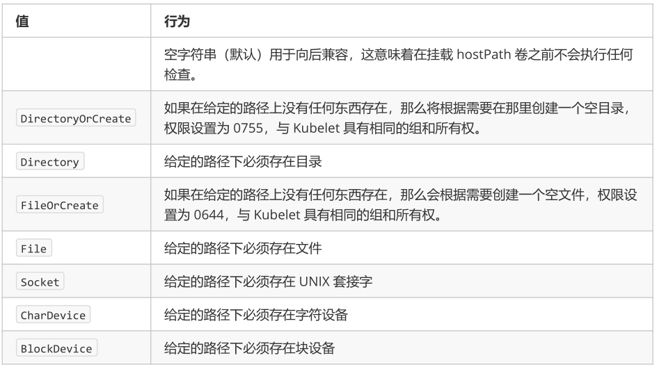

# configmap&secret&pv&pvc

# 一、configMap

我们在kubernetes上部署应用的时候，经常会需要传一些配置给我们的应用，比如数据库地址啊，用户名密码啊之类的。我们要做到这个，有好多种方案，比如：

- 我们可以直接在打包镜像的时候写在应用配置文件里面，但是这种方式的坏处显而易见而且非常明显。
- 我们可以在配置文件里面通过env环境变量传入，但是这样的话我们要修改env就必须去修改yaml文件，而且需要重启所有的container才行。
- 我们可以在应用启动的时候去数据库或者某个特定的地方拿，没问题！但是第一，实现起来麻烦；第二，如果配置的地方变了怎么办？

当然还有别的方案，但是各种方案都有各自的问题。

而且，还有一个问题就是，如果说我的一个配置，是要多个应用一起使用的，以上除了第三种方案，都没办法进行配置的共享，就是说我如果要改配置的话，那得一个一个手动改。假如我们有100个应用，就得改100份配置，以此类推……

kubernetes对这个问题提供了一个很好的解决方案，就是用ConfigMap和Secret

ConfigMap功能在kubernetes1.2版本中引入，许多应用程序会从配置文件，命令行参数或环境变量中读取配置信息，ConfigAPI给我们提供了向容器中注入配置信息的机制，ConfigMap可以被用来保存单个属性，也可以用来保存整个配置文件或者JSON二进制大对象。


```
ConfigMap对像是一系列配置的集合，k8s会将这一集合注入到对应的Pod对像中，并为容器成功启动使用。注入的方式一般有两种，一种是挂载存储卷，一种是传递变量。ConfigMap被引用之前必须存在，属于名称空间级别，不能跨名称空间使用，内容明文显示。ConfigMap内容修改后，对应的pod必须重启或者重新加载配置（支持热更新的应用，不需要重启）。
Secret类似于ConfigMap，是用Base64加密，密文显示，一般存放敏感数据。一般有两种创建方式，一种是使用kubectl create创建，一种是用Secret配置文件。
```


## 1、应用场景

应用场景：镜像往往是一个应用的基础，还有很多需要自定义的参数或配置，例如资源的消耗、日志的位置级别等等，这些配置可能会有很多，因此不能放入镜像中，Kubernetes中提供了Configmap来实现向容器中提供配置文件或环境变量来实现不同配置，从而实现了镜像配置与镜像本身解耦，使容器应用做到不依赖于环境配置。

```
我们经常都需要为我们的应用程序配置一些特殊的数据，比如密钥、Token 、数据库连接地址或者其他私密的信息。你的应用可能会使用一些特定的配置文件进行配置，比如settings.py文件，或者我们可以在应用的业务逻辑中读取环境变量或者某些标志来处理配置信息。
我们要做到这个，有好多种方案，比如：
1.我们可以直接在打包镜像的时候写在应用配置文件里面，但是这种方式的坏处显而易见而且非常明显。
2.我们可以在配置文件里面通过 env 环境变量传入，但是这样的话我们要修改 env 就必须去修改 yaml 文件，而且需要重启所有的 container 才行。
3.我们可以在应用启动的时候去数据库或者某个特定的地方拿，没问题！但是第一，实现起来麻烦；第二，如果配置的地方变了怎么办？

当然还有别的方案，但是各种方案都有各自的问题。
而且，还有一个问题就是，如果说我的一个配置，是要多个应用一起使用的，以上除了第三种方案，都没办法进行配置的共享，就是说我如果要改配置的话，那得一个一个手动改。假如我们有 100 个应用，就得改 100 份配置，以此类推……

kubernetes 对这个问题提供了一个很好的解决方案，就是用 ConfigMap 和 Secret。　　　　
```

向容器传递参数：

| Docker     | Kubernetes | 描述                       |
| ---------- | ---------- | -------------------------- |
| ENTRYPOINT | command    | 容器中的可执行文件         |
| CMD        | args       | 需要传递给可执行文件的参数 |

如果需要向容器传递参数，可以在Yaml文件中通过command和args或者环境变量的方式实现。

```yaml
apiVersion: v1
kind: Pod
metadata:
  name: print-greeting
spec:
  containers:
  - name: env-print-demo
    image: hub.kaikeba.com/java12/bash:v1
    env:
    - name: GREETING
      value: "Warm greetings to"
    - name: HONORIFIC
      value: "The Most Honorable"
    - name: NAME
      value: "Kubernetes"
    command: ["echo"]
    args: ["$(GREETING) $(HONORIFIC) $(NAME)"]
    
    # 创建后，命令 echo Warm greetings to The Most Honorable Kubernetes 将在容器中运行,也就是环境变量中的值被传递到了容器中。
    # 查看pod就可以看出
    kubectl logs podname 
```

## 2、创建configMap

### 2.1、help文档

```bash
[root@k8s-master-155-221 configmap]# kubectl create  configmap --help
......
Aliases:
configmap, cm  #可以使用cm替代

Examples:
  # Create a new configmap named my-config based on folder bar
  kubectl create configmap my-config --from-file=path/to/bar  #从目录创建  文件名称为键  文件内容为值?
  
  # Create a new configmap named my-config with specified keys instead of file basenames on disk
  kubectl create configmap my-config --from-file=key1=/path/to/bar/file1.txt --from-file=key2=/path/to/bar/file2.txt #从文件创建 key1为键 文件内容为值
  
  # Create a new configmap named my-config with key1=config1 and key2=config2
  kubectl create configmap my-config --from-literal=key1=config1 --from-literal=key2=config2   #直接命令行给定,键为key1 值为config1
  
  # Create a new configmap named my-config from the key=value pairs in the file
  kubectl create configmap my-config --from-file=path/to/bar   #从文件创建 文件名为键 文件内容为值
  
  # Create a new configmap named my-config from an env file
  kubectl create configmap my-config --from-env-file=path/to/bar.env
```


### 2.2、使用目录创建

```bash


# 指定目录
ls /docs/user-guide/configmap
#创建game.properties,ui.properties，game.cnf ui.conf ,game.yaml
# game.properties
enemies=aliens
lives=3
enemies.cheat=true
enemies.cheat.level=noGoodRotten
secret.code.passphrase=UUDDLRLRBABAS
secret.code.allowed=true
secret.code.lives=30

# ui.propertes
color.good=purple
color.bad=yellow
allow.textmode=true
how.nice.to.look=fairlyNice

#创建configmap ，指令
# game-config ：configmap的名称
# --from-file：指定一个目录，目录下的所有内容都会被创建出来。以键值对的形式
# --from-file指定在目录下的所有文件都会被用在 ConfigMap 里面创建一个键值对，键的名字就是文件名，值就是文件的内容
kubectl create configmap game-config --from-file=docs/user-guide/configmap

# 查看configmap文件
kubectl get cm 

# 查看详细信息
kubectl get cm game-config -o yaml   

kubectl describe cm
```


### 2.3、根据文件创建

只需要指定为一个文件就可以从单个文件中创建ConfigMap

```bash
# 指定创建的文件即可
kubectl create configmap game-config-2 --from-file=/docs/user-guide/configmap/game.propertes

#查看
kubectl get configmaps game-config-2 -o yaml
```

--from-file这个参数可以使用多次，可以分别指定game.properties,ui.propertes.效果和指定整个目录是一样的。

### 2.4、文字创建

```bash
# 使用--from-literal 方式直接创建configmap
# Create the ConfigMap
$ kubectl create configmap my-config --from-literal=key1=value1 --from-literal=key2=value2
configmap "my-config" created 

# Get the ConfigMap Details for my-config
$ kubectl get configmaps my-config -o yaml
apiVersion: v1
data:
  key1: value1
  key2: value2
kind: ConfigMap
metadata:
  creationTimestamp: 2017-05-31T07:21:55Z
  name: my-config
  namespace: default
  resourceVersion: "241345"
  selfLink: /api/v1/namespaces/default/configmaps/my-config
  uid: d35f0a3d-45d1-11e7-9e62-080027a46057
  
# 文字方式
kubectl create configmap special-config --from-literal=special.how=very --from-literal=special.type=charm

#查看
kubectlget configmaps special-config -o yaml 
```

使用文字方式创建，利用 --from-literal 参数传递配置信息，改参数可以使用多次。

### 2.5、直接方法

```bash

# 直接通过配置文件的方式创建  
# 耦合方式创建
apiVersion: v1
data:
  game.properties: |
    enemies=aliens
    lives=3
    enemies.cheat=true
    enemies.cheat.level=noGoodRotten
    secret.code.passphrase=UUDDLRLRBABAS
    secret.code.allowed=true
    secret.code.lives=30
  ui.properties: |
    color.good=purple
    color.bad=yellow
    allow.textmode=true
    how.nice.to.look=fairlyNice
kind: ConfigMap
metadata:
  name: game-config
  namespace: default
```


### 2.6、pod中应用

```yaml
# 创建configMap,   special.how: very   键名：键值
apiVersion: v1
kind: ConfigMap
metadata:
  name: special-config
  namespace: default
data:
  special.how: very
  special.type: charm
  
# 创建第二个configMap
apiVersion: v1
kind: ConfigMap
metadata:
  name: env-config
  namespace: default
data:
  log_level: INFO

# 第一种方式： 在pod中使用configmap配置,使用ConfigMap来替代环境变量
apiVersion: v1
kind: Pod
metadata:
  name: test-pod
spec:
  containers:
    - name: test-container
      image: hub.kaikeba.com/library/myapp:v1 
      command: ["/bin/sh", "-c", "env"]
      env:
        - name: SPECIAL_LEVEL_KEY 
          valueFrom:
            configMapKeyRef: 
              name: special-config  # 第一种导入方式：在env中导入
              key: special.how              
        - name: SPECIAL_TYPE_KEY
          valueFrom: 
            configMapKeyRef: 
              name: special-config 
              key: special.type 
      envFrom:                      # 第二种导入方式，直接使用envFrom导入
        - configMapRef: 
            name: env-config 
  restartPolicy: Never
  
# 查看日志可以发现,环境变量注入到了容器中了，打印env就结束了
kubectl  logs  test-pod 
...
SPECIAL_TYPE_KEY=charm
SPECIAL_LEVEL_KEY=very
log_level=INFO
  
  
#第二种方式：用ConfigMap设置命令行参数
#用作命令行参数，将 ConfigMap 用作命令行参数时，需要先把 ConfigMap 的数据保存在环境变量中，然后通过 $(VAR_NAME) 的方式引用环境变量.
apiVersion: v1
kind: Pod
metadata:
  name: test-pod
spec:
  containers:
    - name: test-container
      image: hub.kaikeba.com/library/myapp:v1
      command: [ "/bin/sh", "-c", "echo $(SPECIAL_LEVEL_KEY) $(SPECIAL_TYPE_KEY)" ] 
      env:
        - name: SPECIAL_LEVEL_KEY 
          valueFrom: 
            configMapKeyRef: 
              name: special-config 
              key: special.how 
        - name: SPECIAL_TYPE_KEY 
          valueFrom: 
            configMapKeyRef: 
              name: special-config 
              key: special.type 
  restartPolicy: Never
  
  
# 第三种方式：通过数据卷插件使用ConfigMap
#在数据卷里面使用这个ConfigMap,有不同的选项。最基本的就是将文件填入数据卷,在这个文件中,键就是文件名,键值就是文件内容

apiversion: v1
kind: Pod
metadata:
  name: test-pod3
spec:
  containers:
    - name: test-container
      image: hub.kaikeba.com/library/myapp:v1
      command: [ "/bin/sh", "-c", "sleep 600s" ] 
      volumeMounts:
        - name: config-volume
          mountPath: /etc/config # 表示把conifg-volume挂载卷挂载到容器的/etc/config目录下
  volumes:    # 开启挂载外部configmap
    - name: config-volume
      configMap:
        name: e-config
  restartPolicy: Never
  
  # 登录容器查看/etc/config目录下是否挂载成功
  
```

### 2.7、热更新

```yaml
# ConfigMap的热更新
apiVersion: v1
kind: ConfigMap
metadata:
  name: log-config
  namespace: default
data:
  log_level:INFO
---
apiVersion: extensions/v1beta1 
kind: Deployment 
metadata: 
  name: my-nginx 
spec:
  replicas: 1
  template:
    metadata:
      labels:
        run: my-nginx
    spec:
      containers:
        - name: my-nginx
          image: hub.kaikeba.com/java12/myapp:v1 
          ports:
            - containerPort: 80 
          volumeMounts:
            - name: config-volume 
              mountPath: /etc/config 
      volumes:
        - name: config-volume 
          configMap:
            name: log-config

# 获取值
kubectl exec my-nginx-7b55868ff4-wqh2q -it -- cat /etc/config/log_level
#输出
INFO

修改ConfigMap

$ kubectl edit configmap log-config
修改log-level的值为DEBUG等待大概10秒钟时间,再次查看环境变量的值
```


# 二、secret

​	Secret对象存储数据的方式是以键值方式存储数据，在Pod资源进行调用Secret的方式是通过环境变量或者存储卷的方式进行访问数据，解决了密码、token、密钥等敏感数据的配置问题，而不需要把这些敏感数据暴露到镜像或者Pod Spec中。

​	另外，Secret对象的数据存储和打印格式为Base64编码的字符串，因此用户在创建Secret对象时，也需要提供该类型的编码格式的数据。在容器中以环境变量或存储卷的方式访问时，会自动解码为明文格式。需要注意的是，如果是在Master节点上，Secret对象以非加密的格式存储在etcd中，所以需要对etcd的管理和权限进行严格控制。
Secret有4种类型：

- Service Account ：用来访问Kubernetes API，由Kubernetes自动创建，并且会自动挂载到Pod的/run/secrets/kubernetes.io/serviceaccount目录中；
- Opaque ：base64编码格式的Secret，用来存储密码、密钥、信息、证书等，类型标识符为generic；
- kubernetes.io/dockerconfigjson ：用来存储私有docker registry的认证信息，类型标识为docker-registry。
- kubernetes.io/tls：用于为SSL通信模式存储证书和私钥文件，命令式创建类型标识为tls。

## 1、Service Account

Service Account 用来访问kubernetes API,由Kubernetes自动创建，并且会自动挂载到Pod的/run/secrets/kubernetes.io/serviceaccount目录中.

Service Account 不需要我们自己去管理的，此证书是由kubernetes自己来进行维护管理的。

```bash
# 创建pod
kubectl run my-nginx --image=hub.kaikeba.com/java12/nginx:v1 

# 查看证书
kubctl exec -it podName -- sh
# 进入证书目录/run/secrets/kubernetes.io/serviceaccount查看即可
ca
namespace
token
```


## 2、opaque  Secret

### 2.1、创建示例

Opaque类型的数据一个map类型，要求value是base64编码格式

```bash
# base64对用户名，密码加密效果演示
echo -n "admin" | base64
YWRtaW4=

echo -n "abcdefgh" | base64
YWJjZGVmZ2g=


# secret.yaml配置文件方式
apiVersion: v1
kind: Secret
metadata:
  name: mysecret
type: Opaque
data:
 password: YWJjZGVmZ2g=
 username: YWRtaW4=

```


### 2.2、使用方式

```yaml
# 将secret挂载到volume中
apiVersion: v1
kind: pod
metadata:
 name: secret-test
 labels:
   name: secret-test
spec:
  volumes:
  - name: secrets
    secret:
      secretName: mysecret
  containers:
  - image: hub.kaikeba.com/java12/myapp:v1
    name: db
    volumeMounts:
    - name: secrets
      mountPath: "/etc/secrets"
      readOnly: true
   


# 将secret导出到环境变量中
apiVersion: extensions/v1beta1
kind: Deployment
metadata:
 name: secret-deployment
spec:
  replicas: 2
  template:
    metadata:
      labels:
        app: pod-deployment
    spec:
      containers:
      - name: pod-1
        image: hub.kaikeba.com/java12/myapp:v1
        ports:
        - containerPort: 80
        env:
        - name: TEST_USER
          valueFrom:
            secretKeyRef:
              name: mysecret
              key: username
        - name: TEST_PASSWORD
          valueFrom:
            secretKeyRef:
              name: mysecret
              key: password
```


# 三、k8s-volumes

## 1、什么要用volumes?


k8s中容器中的磁盘的生命周期是短暂的, 这就带来了一些列的问题

1. 当一个容器损坏之后, kubelet会重启这个容器,  但是容器中的文件将丢失----容器以干净的状态重新启动
2. 当很多容器运行在同一个pod中时, 很多时候需要数据文件的共享
3. 在`k8s`中，由于`pod`分布在各个不同的节点之上，并不能实现不同节点之间持久性数据的共享，并且，在节点故障时，可能会导致数据的永久性丢失。

**volumes就是用来解决以上问题的**

Volume 的生命周期独立于容器，Pod 中的容器可能被销毁和重建，但 Volume 会被保留。


<font color='red'>注意：docker磁盘映射的数据将会被保留,和kubernetes有一些不一样</font>

## 2、什么是volume？

  volume用来对容器的数据进行挂载，存储容器运行时所需的一些数据。当容器被重新创建时，实际上我们发现volume挂载卷并没有发生变化。

​	kubernetes中的卷有明确的寿命————与封装它的pod相同。所以，卷的生命比pod中的所有容器都长，当这个容器重启时数据仍然得以保存。

当然，当pod不再存在时，卷也不复存在，也许更重要的是kubernetes支持多种类型的卷，pod可以同时使用任意数量的卷


## 3、卷的类型

kubenetes卷的类型：


**第一种就是本地卷**

像hostPath类型与docker里面的bind mount类型，就是直接挂载到宿主机文件的类型
像emptyDir是这样本地卷，也就是类似于volume类型
这两点都是绑定node节点的

**第二种就是网络数据卷**

比如Nfs、ClusterFs、Ceph，这些都是外部的存储都可以挂载到k8s上

**第三种就是云盘**

比如AWS、微软(azuredisk)

**第四种就是k8s自身的资源**

比如secret、configmap、downwardAPI


## 4、emptyDir


先来看一下本地卷
像emptyDir类似与docker的volume，而docker删除容器，数据卷还会存在，而emptyDir删除容器，数据卷也会丢失，一般这个只做临时数据卷来使用

创建一个空卷，挂载到Pod中的容器。Pod删除该卷也会被删除。

应用场景：Pod中容器之间数据共享

​	当pod被分配给节点时，首先创建emptyDir卷，并且只要该pod在该节点上运行，该卷就会存在。正如卷的名字所述，它最初是空的，pod中的容器可以读取和写入emptyDir卷中的相同文件，尽管该卷可以挂载到每个容器中的相同或者不同路径上。当处于任何原因从节点删除pod时，emptyDir中的数据将被永久删除

注意：容器崩溃不会从节点中移除pod，因此emptyDir卷中的数据在容器崩溃时是安全的


emptyDir的用法

```Java
1、暂存空间，例如用于基于磁盘的合并排序
2、用作长时间计算崩溃恢复时候的检查点
3、web服务器容器提供数据时，保存内容管理器容器提取的文件
```

## 5、一个例子

```yaml
apiVersion: v1
kind: Pod
metadata:
  name: test-pod1
spec:
  containers:
  - image: hub.kaikeba.com/library/myapp:v1
    name: test-container
    volumeMounts:
    - mountPath: /cache
      name: cache-volume
  volumes:
  - name: cache-volume
    emptyDir: {}
    

---
apiVersion: v1
kind: Pod
metadata:
  name: test-pod2
spec:
  containers:
  - image: hub.kaikeba.com/library/myapp:v1
    name: test-container
    volumeMounts:
    - mountPath: /cache
      name: cache-volume
  - name: test-1
    image: hub.kaikeba.com/library/busybox:v1
    command: ["/bin/sh","-c","sleep 3600s"]
    imagePullPolicy: IfNotPresent
    volumeMounts:
    - mountPath: /cache
      name: cache-volume
  volumes:
  - name: cache-volume
    emptyDir: {}

```


## 6、HostPath

挂载Node文件系统上文件或者目录到Pod中的容器。

应用场景：Pod中容器需要访问宿主机文件 ;

## 7、一个例子

```yaml
apiVersion: v1
kind: Pod
metadata:
  name: test-pod
spec:
  containers:
  - image: hub.kaikeba.com/library/myapp:v1
    name: test-container
    volumeMounts:
    - mountPath: /cache
      name: cache-volume
  volumes:
  - name: cache-volume
    hostPath:
      path: /data
      type: Directory

```

这里创建的数据和我们被分配的node节点的数据都是一样的，创建的数据都会更新上去，删除容器，不会删除数据卷的数据。 

**type类型**

除了所需的path属性职位，用户还可以为hostPath卷指定type.



## 8、NFS网络存储

**Kubernetes进阶之PersistentVolume 静态供给实现NFS网络存储**

NFS是一种很早的技术，单机的存储在服务器方面还是非常主流的，但nfs唯一的就是缺点比较大就是没有集群版，做集群化还是比较费劲的，文件系统做不了，这是一个很大的弊端，大规模的还是需要选择一些分布式的存储，nfs就是一个网络文件存储服务器，装完nfs之后，共享一个目录，其他的服务器就可以通过这个目录挂载到本地了，在本地写到这个目录的文件，就会同步到远程服务器上，实现一个共享存储的功能，一般都是做数据的共享存储，比如多台web服务器，肯定需要保证这些web服务器的数据一致性，那就会用到这个共享存储了，要是将nfs挂载到多台的web服务器上，网站根目录下，网站程序就放在nfs服务器上，这样的话。每个网站，每个web程序都能读取到这个目录，一致性的数据，这样的话就能保证多个节点，提供一致性的程序了。


1）、单独拿一台服务器做nfs服务器，我们这里先搭建一台NFS服务器用来存储我们的网页根目录 

```bash
yum install nfs-utils -y
```

2）、暴露目录，让是让其他服务器能挂载这个目录

```bash
mkdir /opt/k8s
vim /etc/exports
/opt/k8s 192.168.30.0/24(rw,no_root_squash)
```

给这个网段加上权限，可读可写

`[root@nfs ~]# systemctl start nfs`

找个节点去挂载测试一下,只要去共享这个目录就要都去安装这个客户端

```bash
#其他节点也需要安装nfs
yum install nfs-utils -y
mount -t nfs 192.168.30.27:/opt/k8s /mnt
cd /mnt
df -h
192.168.30.27:/opt/k8s    36G  5.8G   30G   17% /mnt
touch a.txt
```

去服务器端查看已经数据共享过来了

删除nfs服务器的数据也会删除
接下来怎么将K8s进行使用
我们把网页目录都放在这个目录下

```yaml
# mkdir wwwroot
# vim nfs.yaml
apiVersion: apps/v1beta1
kind: Deployment
metadata:
  name: nfs
spec:
  replicas: 3
  template:
    metadata:
      labels:
        app: nginx
    spec:
      containers:
      - name: nginx
        image: hub.kaikeba.com/library/myapp:v1
        volumeMounts:
        - name: wwwroot
          mountPath: /usr/share/nginx/html
        ports:
        - containerPort: 80
      volumes:
      - name: wwwroot
        nfs:
          server: 192.168.66.13
          path: /opt/k8s/wwwroot
---
apiVersion: v1
kind: Service
metadata:
  name: nginx-service
  labels:
    app: nginx
spec:
  ports:
  - port: 80
    targetPort: 80
  selector:
    app: nginx
  type: NodePort
```

我们在源pod的网页目录下写入数据，并查看我们的nfs服务器目录下也会共享


# 四、PV&PVC

## 1、pv&pvc说明

管理`存储`和管理`计算`有着明显的不同。`PersistentVolume`给用户和管理员提供了一套API，抽象出`存储`是如何`提供和消耗的细节`。在这里，我们介绍两种新的API资源：`PersistentVolume（简称PV）`和`PersistentVolumeClaim（简称PVC）`。

- PersistentVolume（持久卷，简称PV）是集群内，由管理员提供的网络存储的一部分。就像集群中的节点一样，PV也是集群中的一种资源。它也像Volume一样，是一种volume插件，但是它的生命周期却是和使用它的Pod相互独立的。PV这个API对象，捕获了诸如NFS、ISCSI、或其他云存储系统的实现细节。
- PersistentVolumeClaim（持久卷声明，简称PVC）是用户的一种存储请求。它和Pod类似，Pod消耗Node资源，而PVC消耗PV资源。Pod能够请求特定的资源（如CPU和内存）。PVC能够请求指定的大小和访问的模式（可以被映射为一次读写或者多次只读）。

PVC允许用户消耗抽象的存储资源，用户也经常需要各种属性（如性能）的PV。集群管理员需要提供各种各样、不同大小、不同访问模式的PV，而不用向用户暴露这些volume如何实现的细节。因为这种需求，就催生出一种`StorageClass`资源。

`StorageClass`提供了一种方式，使得管理员能够描述他提供的存储的等级。集群管理员可以将不同的等级映射到不同的服务等级、不同的后端策略。


**K8s为了做存储的编排**
数据持久卷PersistentVolume 简称pv/pvc主要做容器存储的编排

• PersistentVolume（PV）：对存储资源创建和使用的抽象，使得存储作为集群中的资源管理
pv都是运维去考虑，用来管理外部存储的

• 静态 ：提前创建好pv，比如创建一个100G的pv,200G的pv,让有需要的人拿去用，就是说pvc连接pv,就是知道pv创建的是多少，空间大小是多少，创建的名字是多少，有一定的可匹配性

• 动态

• PersistentVolumeClaim（PVC）：让用户不需要关心具体的Volume实现细节
使用多少个容量来定义，比如开发要部署一个服务要使用10个G，那么就可以使用pvc这个资源对象来定义使用10个G，其他的就不用考虑了


**pv&pvc区别**

`PersistentVolume（持久卷）`和`PersistentVolumeClaim（持久卷申请）`是k8s提供的两种API资源，用于抽象存储细节。

管理员关注如何通过pv提供存储功能而无需关注用户如何使用，同样的用户只需要挂载pvc到容器中而不需要关注存储卷采用何种技术实现。

pvc和pv的关系与pod和node关系类似，前者消耗后者的资源。pvc可以向pv申请指定大小的存储资源并设置访问模式,这就可以通过Provision -> Claim 的方式，来对存储资源进行控制。


## 2、生命周期

volume 和 claim 的生命周期，PV是集群中的资源，PVC是对这些资源的请求，同时也是这些资源的“提取证”。PV和PVC的交互遵循以下生命周期：

- ##### 供给

  有两种PV提供的方式：静态和动态。

- ##### 静态

  集群管理员创建多个PV，它们携带着真实存储的详细信息，这些存储对于集群用户是可用的。它们存在于Kubernetes API中，并可用于存储使用。

- ##### 动态

  当管理员创建的静态PV都不匹配用户的PVC时，集群可能会尝试专门地供给volume给PVC。这种供给基于StorageClass：PVC必须请求这样一个等级，而管理员必须已经创建和配置过这样一个等级，以备发生这种动态供给的情况。请求等级配置为“”的PVC，有效地禁用了它自身的动态供给功能。

- ##### 绑定

  用户创建一个PVC（或者之前就已经就为动态供给创建了），指定要求存储的大小和访问模式。master中有一个控制回路用于监控新的PVC，查找匹配的PV（如果有），并把PVC和PV绑定在一起。如果一个PV曾经动态供给到了一个新的PVC，那么这个回路会一直绑定这个PV和PVC。另外，用户总是至少能得到它们所要求的存储，但是volume可能超过它们的请求。一旦绑定了，PVC绑定就是专属的，无论它们的绑定模式是什么。

  如果没找到匹配的PV，那么PVC会无限期得处于unbound未绑定状态，一旦PV可用了，PVC就会又变成绑定状态。比如，如果一个供给了很多50G的PV集群，不会匹配要求100G的PVC。直到100G的PV添加到该集群时，PVC才会被绑定。

- ##### 使用

  Pod使用PVC就像使用volume一样。集群检查PVC，查找绑定的PV，并映射PV给Pod。对于支持多种访问模式的PV，用户可以指定想用的模式。一旦用户拥有了一个PVC，并且PVC被绑定，那么只要用户还需要，PV就一直属于这个用户。用户调度Pod，通过在Pod的volume块中包含PVC来访问PV。

- ##### 释放

  当用户使用PV完毕后，他们可以通过API来删除PVC对象。当PVC被删除后，对应的PV就被认为是已经是“released”了，但还不能再给另外一个PVC使用。前一个PVC的属于还存在于该PV中，必须根据策略来处理掉。

- ##### 回收

  PV的回收策略告诉集群，在PV被释放之后集群应该如何处理该PV。当前，PV可以被Retained（保留）、 Recycled（再利用）或者Deleted（删除）。保留允许手动地再次声明资源。对于支持删除操作的PV卷，删除操作会从Kubernetes中移除PV对象，还有对应的外部存储（如AWS EBS，GCE PD，Azure Disk，或者Cinder volume）。动态供给的卷总是会被删除。

## 3、POD&PVC

先创建一个容器应用

```yaml
#vim pod.yaml
apiVersion: v1
kind: Pod
metadata:
  name: my-pod
spec:
    containers:
    - name: nginx
      image: nginx:latest
      ports:
      - containerPort: 80
      volumeMounts:
        - name: www
          mountPath: /usr/share/nginx/html
  volumes:
    - name: www
      persistentVolumeClaim:
        claimName: my-pvc
```

卷需求yaml,这里的名称一定要对应，一般两个文件都放在一块

```yaml
# vim pvc.yaml
apiVersion: v1
kind: PersistentVolumeClaim
metadata:
  name: my-pvc
spec:
  accessModes:
    - ReadWriteMany
  resources:
    requests:
      storage: 5Gi
```

接下来就是运维出场了，提前创建好pv

```yaml
# vim pv1.yaml
apiVersion: v1
kind: PersistentVolume
metadata:
  name: my-pv1
spec:
  capacity:
    storage: 5Gi
  accessModes:
    - ReadWriteMany
  nfs:
    path: /opt/k8s/demo1
    server: 192.168.66.13
```

提前创建好pv,以及挂载目录

我再创建一个pv，在nfs服务器提前把目录创建好,名称修改一下

```yaml
# vim pv2.yaml 
apiVersion: v1
kind: PersistentVolume
metadata:
  name: my-pv2
spec:
  capacity:
    storage: 10Gi
  accessModes:
    - ReadWriteMany
  nfs:
    path: /opt/k8s/demo2
    server: 192.168.66.13
```

然后现在创建一下我们的pod和pvc,这里我写在一起了

```yaml
# vim pod.yaml
apiVersion: v1
kind: Pod
metadata:
  name: my-pod
spec:
  containers:
  - name: nginx
    image: nginx:latest
    ports:
    - containerPort: 80
    volumeMounts:
      - name: www
        mountPath: /usr/share/nginx/html
  volumes:
    - name: www
      persistentVolumeClaim:
        claimName: my-pvc
---
apiVersion: v1
kind: PersistentVolumeClaim
metadata:
  name: my-pvc
spec:
  accessModes:
    - ReadWriteMany
  resources:
    requests:
      storage: 5Gi
```

