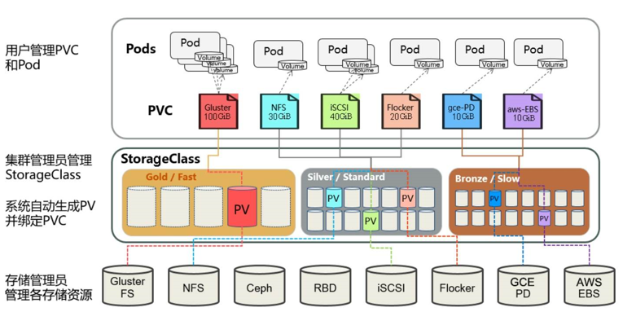
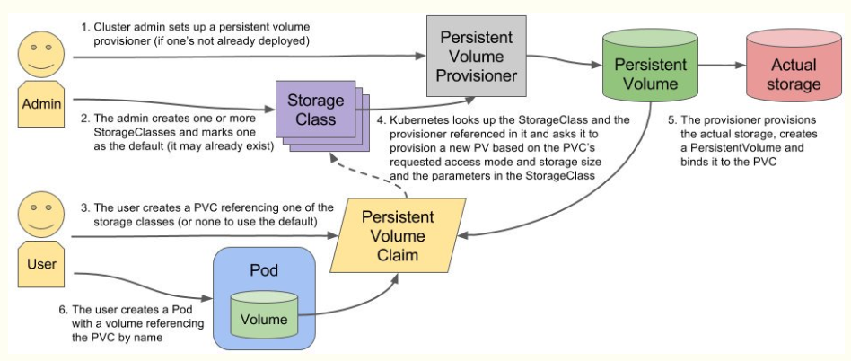

# pv&pvc&statefulset

# 一、PV&PVC

## 1、pv&pvc说明

管理`存储`和管理`计算`有着明显的不同。`PersistentVolume`给用户和管理员提供了一套API，抽象出`存储`是如何`提供和消耗的细节`。在这里，我们介绍两种新的API资源：`PersistentVolume（简称PV）`和`PersistentVolumeClaim（简称PVC）`。

- PersistentVolume（持久卷，简称PV）是集群内，由管理员提供的网络存储的一部分。就像集群中的节点一样，PV也是集群中的一种资源。它也像Volume一样，是一种volume插件，但是它的生命周期却是和使用它的Pod相互独立的。PV这个API对象，捕获了诸如NFS、ISCSI、或其他云存储系统的实现细节。
- PersistentVolumeClaim（持久卷声明，简称PVC）是用户的一种存储请求。它和Pod类似，Pod消耗Node资源，而PVC消耗PV资源。Pod能够请求特定的资源（如CPU和内存）。PVC能够请求指定的大小和访问的模式（可以被映射为一次读写或者多次只读）。

PVC允许用户消耗抽象的存储资源，用户也经常需要各种属性（如性能）的PV。集群管理员需要提供各种各样、不同大小、不同访问模式的PV，而不用向用户暴露这些volume如何实现的细节。因为这种需求，就催生出一种`StorageClass`资源。

`StorageClass`提供了一种方式，使得管理员能够描述他提供的存储的等级。集群管理员可以将不同的等级映射到不同的服务等级、不同的后端策略。


**K8s为了做存储的编排**
数据持久卷PersistentVolume 简称pv/pvc主要做容器存储的编排

• PersistentVolume（PV）：对存储资源创建和使用的抽象，使得存储作为集群中的资源管理
pv都是运维去考虑，用来管理外部存储的

• 静态 ：提前创建好pv，比如创建一个100G的pv,200G的pv,让有需要的人拿去用，就是说pvc连接pv,就是知道pv创建的是多少，空间大小是多少，创建的名字是多少，有一定的可匹配性

• 动态

• PersistentVolumeClaim（PVC）：让用户不需要关心具体的Volume实现细节
使用多少个容量来定义，比如开发要部署一个服务要使用10个G，那么就可以使用pvc这个资源对象来定义使用10个G，其他的就不用考虑了


**pv&pvc区别**

`PersistentVolume（持久卷）`和`PersistentVolumeClaim（持久卷申请）`是k8s提供的两种API资源，用于抽象存储细节。

管理员关注如何通过pv提供存储功能而无需关注用户如何使用，同样的用户只需要挂载pvc到容器中而不需要关注存储卷采用何种技术实现。

pvc和pv的关系与pod和node关系类似，前者消耗后者的资源。pvc可以向pv申请指定大小的存储资源并设置访问模式,这就可以通过Provision -> Claim 的方式，来对存储资源进行控制。


## 2、生命周期

volume 和 claim 的生命周期，PV是集群中的资源，PVC是对这些资源的请求，同时也是这些资源的“提取证”。PV和PVC的交互遵循以下生命周期：


- ##### 供给

  有两种PV提供的方式：静态和动态。

- ##### 静态

  集群管理员创建多个PV，它们携带着真实存储的详细信息，这些存储对于集群用户是可用的。它们存在于Kubernetes API中，并可用于存储使用。

- ##### 动态

  当管理员创建的静态PV都不匹配用户的PVC时，集群可能会尝试专门地供给volume给PVC。这种供给基于StorageClass：PVC必须请求这样一个等级，而管理员必须已经创建和配置过这样一个等级，以备发生这种动态供给的情况。请求等级配置为“”的PVC，有效地禁用了它自身的动态供给功能。

- ##### 绑定

  用户创建一个PVC（或者之前就已经就为动态供给创建了），指定要求存储的大小和访问模式。master中有一个控制回路用于监控新的PVC，查找匹配的PV（如果有），并把PVC和PV绑定在一起。如果一个PV曾经动态供给到了一个新的PVC，那么这个回路会一直绑定这个PV和PVC。另外，用户总是至少能得到它们所要求的存储，但是volume可能超过它们的请求。一旦绑定了，PVC绑定就是专属的，无论它们的绑定模式是什么。

  如果没找到匹配的PV，那么PVC会无限期得处于unbound未绑定状态，一旦PV可用了，PVC就会又变成绑定状态。比如，如果一个供给了很多50G的PV集群，不会匹配要求100G的PVC。直到100G的PV添加到该集群时，PVC才会被绑定。

- ##### 使用

  Pod使用PVC就像使用volume一样。集群检查PVC，查找绑定的PV，并映射PV给Pod。对于支持多种访问模式的PV，用户可以指定想用的模式。一旦用户拥有了一个PVC，并且PVC被绑定，那么只要用户还需要，PV就一直属于这个用户。用户调度Pod，通过在Pod的volume块中包含PVC来访问PV。

- ##### 释放

  当用户使用PV完毕后，他们可以通过API来删除PVC对象。当PVC被删除后，对应的PV就被认为是已经是“released”了，但还不能再给另外一个PVC使用。前一个PVC的属于还存在于该PV中，必须根据策略来处理掉。

- ##### 回收

  PV的回收策略告诉集群，在PV被释放之后集群应该如何处理该PV。当前，PV可以被Retained（保留）、 Recycled（再利用）或者Deleted（删除）。保留允许手动地再次声明资源。对于支持删除操作的PV卷，删除操作会从Kubernetes中移除PV对象，还有对应的外部存储（如AWS EBS，GCE PD，Azure Disk，或者Cinder volume）。动态供给的卷总是会被删除。

## 3、POD&PVC

先创建一个容器应用

```yaml
#vim pod.yaml
apiVersion: v1
kind: Pod
metadata:
  name: my-pod
spec:
    containers:
    - name: nginx
      image: nginx:latest
      ports:
      - containerPort: 80
      volumeMounts:
        - name: www
          mountPath: /usr/share/nginx/html
  volumes:
    - name: www
      persistentVolumeClaim:
        claimName: my-pvc
```

卷需求yaml,这里的名称一定要对应，一般两个文件都放在一块

```yaml
# vim pvc.yaml
apiVersion: v1
kind: PersistentVolumeClaim
metadata:
  name: my-pvc
spec:
  accessModes:
    - ReadWriteMany
  resources:
    requests:
      storage: 5Gi
```

接下来就是运维出场了，提前创建好pv

```yaml
# vim pv1.yaml
apiVersion: v1
kind: PersistentVolume
metadata:
  name: my-pv1
spec:
  capacity:
    storage: 5Gi
  accessModes:
    - ReadWriteMany
  nfs:
    path: /opt/k8s/demo1
    server: 192.168.66.13
```

提前创建好pv,以及挂载目录

我再创建一个pv，在nfs服务器提前把目录创建好,名称修改一下

```yaml
# vim pv2.yaml 
apiVersion: v1
kind: PersistentVolume
metadata:
  name: my-pv2
spec:
  capacity:
    storage: 10Gi
  accessModes:
    - ReadWriteMany
  nfs:
    path: /opt/k8s/demo2
    server: 192.168.66.13
```

然后现在创建一下我们的pod和pvc,这里我写在一起了

```yaml
# vim pod.yaml
apiVersion: v1
kind: Pod
metadata:
  name: my-pod
spec:
  containers:
  - name: nginx
    image: nginx:latest
    ports:
    - containerPort: 80
    volumeMounts:
      - name: www
        mountPath: /usr/share/nginx/html
  volumes:
    - name: www
      persistentVolumeClaim:
        claimName: my-pvc
---
apiVersion: v1
kind: PersistentVolumeClaim
metadata:
  name: my-pvc
spec:
  accessModes:
    - ReadWriteMany
  resources:
    requests:
      storage: 5Gi
```


# 二、statefulset

​	上一个章节我们已经清楚地的认识的pv,pvc的数据绑定原理，及pv,pvc与pod的绑定方法，那么对于有状态服务部署其实已经非常简单的了，有状态服务器本身就是有实时的数据需要存储，那么现在数据存储的问题已经解决了，现在就来一个statefulset的实例部署。

## 1、headless services

​	Headless Services是一种特殊的service，其spec:clusterIP表示为None，这样在实际运行时就不会被分配ClusterIP。

前几节课中我们了解了service的作用，主要是代理一组pod容器负载均衡服务，但是有时候我们不需要这种负载均衡场景，比如下面的两个例子。

- 比如kubernetes部署某个kafka集群，这种就不需要service来代理，客户端需要的是一组pod的所有的ip。
- 还有一种场景客户端自己处理负载均衡的逻辑，比如kubernates部署两个mysql，有客户端处理负载请求，或者根本不处理这种负载，就要两套mysql。

基于上面的两个例子，kubernates增加了headless serivces功能，字面意思无service其实就是改service对外无提供IP。下面我们看看它如何配置的

```yaml
apiVersion: v1
kind: Service
metadata:
  name: nginx-service
spec:
  selector:
    app: nginx-demo
  ports:
  - port: 80
    name: nginx
  clusterIP: None
---
apiVersion: apps/v1beta1
kind: Deployment
metadata:
  name: nginx-dp
spec:
  selector:
    matchLabels:
      app: nginx-demo
  replicas: 2
  template:
    metadata:
      labels:
        app: nginx-demo
    spec:
      containers:
      - name: nginx
        image: hub.kaikeba.com/java12/myapp:v1
        ports:
        - containerPort: 80
          name: web
```


## 2、服务部署

```yaml
apiVersion: v1
kind: PersistentVolume
metadata: 
  name: pv001
  labels:
    name: pv001
spec:
  nfs:
    path: /opt/k8s/v1
    server: 192.168.66.13
  accessModes: ["ReadWriteMany", "ReadWriteOnce"]
  capacity:
    storage: 1Gi
---
apiVersion: v1
kind: PersistentVolume
metadata: 
  name: pv002
  labels:
    name: pv002
spec:
  nfs:
    path: /opt/k8s/v2
    server: 192.168.66.13
  accessModes: ["ReadWriteOnce"]
  capacity:
    storage: 2Gi
---
apiVersion: v1
kind: PersistentVolume
metadata: 
  name: pv003
  labels:
    name: pv003
spec:
  nfs:
    path: /opt/k8s/v3
    server: 192.168.66.13
  accessModes: ["ReadWriteMany", "ReadWriteOnce"]
  capacity:
    storage: 3Gi
---
apiVersion: v1
kind: PersistentVolume
metadata: 
  name: pv004
  labels:
    name: pv004
spec:
  nfs:
    path: /opt/k8s/v4
    server: 192.168.66.13
  accessModes: ["ReadWriteMany", "ReadWriteOnce"]
  capacity:
    storage: 1Gi
---
apiVersion: v1
kind: PersistentVolume
metadata: 
  name: pv005
  labels:
    name: pv005
spec:
  nfs:
    path: /opt/k8s/v5
    server: 192.168.66.13
  accessModes: ["ReadWriteMany", "ReadWriteOnce"]
  capacity:
    storage: 1Gi
```


根据部署pv,pvc的方式，加上statefulset的部署即可。

```yaml
# 部署stateful类型的有状态服务, 指定pvc
apiVersion: v1
kind: Service
metadata:
  name: nginx
  labels:
    app: nginx
spec:
  ports:
  - port: 80
    name: web
  clusterIP: None
  selector:
    app: nginx
---
apiVersion: apps/v1
kind: StatefulSet
metadata:
  name: web
spec:
  selector:
    matchLabels:
      app: nginx
  serviceName: "nginx"
  replicas: 3
  template:
    metadata:
      labels:
        app: nginx
    spec:
      terminationGracePeriodSeconds: 10
      containers:
      - name: nginx
        image: k8s.gcr.io/nginx-slim:0.8
        ports:
        - containerPort: 80
          name: web
        volumeMounts:
        - name: www
          mountPath: /usr/share/nginx/html
    volumes:
    - name: www
      persistentVolumeClaim:
        claimName: my-pvc
---
apiVersion: v1
kind: PersistentVolumeClaim
metadata:
  name: my-pvc
spec:
  accessModes:
    - ReadWriteMany
  resources:
    requests:
      storage: 5Gi          

# 使用volumeClaimTemplates直接指定pvc，申请pv
apiVersion: v1
kind: Service
metadata:
  name: nginx
  labels:
    app: nginx
spec:
  ports:
  - port: 80
    name: web
  clusterIP: None
  selector:
    app: nginx
---
apiVersion: apps/v1
kind: StatefulSet
metadata:
  name: web
spec:
  selector:
    matchLabels:
      app: nginx
  serviceName: nginx
  replicas: 3
  template:
    metadata:
      labels:
        app: nginx
    spec:
      terminationGracePeriodSeconds: 10
      containers:
      - name: nginx
        image: hub.kaikeba.com/java12/myapp:v1
        ports:
        - containerPort: 80
          name: web
        volumeMounts:
        - name: www
          mountPath: /usr/share/nginx/html
  volumeClaimTemplates:
  - metadata:
      name: www
    spec:
      accessModes: [ "ReadWriteOnce" ]
      storageClassName: "my-storage-class"
      resources:
        requests:
          storage: 1Gi
# 清单解析
# 等待 terminationGracePeriodSeconds 这么长的时间。(默认为30秒)、超过terminationGracePeriodSeconds等待时间后， K8S 会强制结束老POD
```


PVC和PV的绑定是通过StorageClassName进行的。然而如果定义PVC时没有指定StorageClassName呢？这取决与admission插件是否开启了DefaultDefaultStorageClass功能：

如果DefaultDefaultStorageClass功能开启，那么此PVC的StorageClassName就会被指定为DefaultStorageClass。DefaultStorageClass从何处而来呢？原来在定义StorageClass时，可以在Annotation中添加一个键值对：storageclass.kubernetes.io/is-default-class: true，那么此StorageClass就变成默认的StorageClass了。
如果DefaultDefaultStorageClass功能没有开启，那么没有指定StorageClassName的PVC只能被绑定到同样没有指定StorageClassName的PV。
查看了我们环境中的storageclass 定义，发现没有开启DefaultDefaultStorageClass功能。


# 三、storageClass

在动态资源供应模式下，通过StorageClass和PVC完成资源动态绑定（系统自动生成PV），并供Pod使用的存储管理机制。



## 1、什么是StorageClass


```java
Kubernetes提供了一套可以自动创建PV的机制,即:Dynamic Provisioning.而这个机制的核心在于:StorageClass这个API对象.

StorageClass对象会定义下面两部分内容:
1,PV的属性.比如,存储类型,Volume的大小等.
2,创建这种PV需要用到的存储插件
有了这两个信息之后,Kubernetes就能够根据用户提交的PVC,找到一个对应的StorageClass,之后Kubernetes就会调用该StorageClass声明的存储插件,进而创建出需要的PV.
但是其实使用起来是一件很简单的事情,你只需要根据自己的需求,编写YAML文件即可,然后使用kubectl create命令执行即可
```

## 2、为什么需要StorageClass

```java
在一个大规模的Kubernetes集群里,可能有成千上万个PVC,这就意味着运维人员必须实现创建出这个多个PV,此外,随着项目的需要,会有新的PVC不断被提交,那么运维人员就需要不断的添加新的,满足要求的PV,否则新的Pod就会因为PVC绑定不到PV而导致创建失败.而且通过 PVC 请求到一定的存储空间也很有可能不足以满足应用对于存储设备的各种需求

而且不同的应用程序对于存储性能的要求可能也不尽相同，比如读写速度、并发性能等，为了解决这一问题，Kubernetes 又为我们引入了一个新的资源对象：StorageClass，通过 StorageClass 的定义，管理员可以将存储资源定义为某种类型的资源，比如快速存储、慢速存储等，用户根据 StorageClass 的描述就可以非常直观的知道各种存储资源的具体特性了，这样就可以根据应用的特性去申请合适的存储资源了。
```

## 3、运行原理及部署流程

```java
要使用 StorageClass，我们就得安装对应的自动配置程序，比如我们这里存储后端使用的是 nfs，那么我们就需要使用到一个 nfs-client 的自动配置程序，我们也叫它 Provisioner，这个程序使用我们已经配置好的 nfs 服务器，来自动创建持久卷，也就是自动帮我们创建 PV。

1.自动创建的 PV 以${namespace}-${pvcName}-${pvName}这样的命名格式创建在 NFS 服务器上的共享数据目录中
2.而当这个 PV 被回收后会以archieved-${namespace}-${pvcName}-${pvName}这样的命名格式存在 NFS 服务器上。
```



**搭建StorageClass+NFS,大致有以下几个步骤:**

```java
1.创建一个可用的NFS Server
2.创建Service Account.这是用来管控NFS provisioner在k8s集群中运行的权限
3.创建StorageClass.负责建立PVC并调用NFS provisioner进行预定的工作,并让PV与PVC建立管理
4.创建NFS provisioner.有两个功能,一个是在NFS共享目录下创建挂载点(volume),另一个则是建了PV并将PV与NFS的挂载点建立关联  
```

## 4、statefulset实践

```yaml
# rbac.yaml:#唯一需要修改的地方只有namespace,根据实际情况定义
apiVersion: v1
kind: ServiceAccount
metadata:
  name: nfs-client-provisioner
  namespace: default
---
kind: ClusterRole
apiVersion: rbac.authorization.k8s.io/v1
metadata:
  name: nfs-client-provisioner-runner
rules:
  - apiGroups: [""]
    resources: ["persistentvolumes"]
    verbs: ["get", "list", "watch", "create", "delete"]
  - apiGroups: [""]
    resources: ["persistentvolumeclaims"]
    verbs: ["get", "list", "watch", "update"]
  - apiGroups: ["storage.k8s.io"]
    resources: ["storageclasses"]
    verbs: ["get", "list", "watch"]
  - apiGroups: [""]
    resources: ["events"]
    verbs: ["create", "update", "patch"]
---
kind: ClusterRoleBinding
apiVersion: rbac.authorization.k8s.io/v1
metadata:
  name: run-nfs-client-provisioner
subjects:
  - kind: ServiceAccount
    name: nfs-client-provisioner
    namespace: default
roleRef:
  kind: ClusterRole
  name: nfs-client-provisioner-runner
  apiGroup: rbac.authorization.k8s.io
---
kind: Role
apiVersion: rbac.authorization.k8s.io/v1
metadata:
  name: leader-locking-nfs-client-provisioner
  namespace: default
rules:
  - apiGroups: [""]
    resources: ["endpoints"]
    verbs: ["get", "list", "watch", "create", "update", "patch"]
---
kind: RoleBinding
apiVersion: rbac.authorization.k8s.io/v1
metadata:
  name: leader-locking-nfs-client-provisioner
subjects:
  - kind: ServiceAccount
    name: nfs-client-provisioner
    namespace: default
roleRef:
  kind: Role
  name: leader-locking-nfs-client-provisioner
  apiGroup: rbac.authorization.k8s.io
  
  
# 创建NFS资源的StorageClass
apiVersion: storage.k8s.io/v1
kind: StorageClass
metadata:
  name: managed-nfs-storage
provisioner: qgg-nfs-storage
parameters:  
   archiveOnDelete: "false"

# 创建NFS provisioner
apiVersion: apps/v1
kind: Deployment
metadata:
  name: nfs-client-provisioner
  labels:
    app: nfs-client-provisioner
  namespace: default
spec:
  replicas: 1
  selector:
    matchLabels:
      app: nfs-client-provisioner
  strategy:
    type: Recreate
  selector:
    matchLabels:
      app: nfs-client-provisioner
  template:
    metadata:
      labels:
        app: nfs-client-provisioner
    spec:
      serviceAccountName: nfs-client-provisioner
      containers:
        - name: nfs-client-provisioner
          image: hub.kaikeba.com/library/nfs-client-provisioner:v1
          volumeMounts:
            - name: nfs-client-root
              mountPath: /persistentvolumes
          env:
            - name: PROVISIONER_NAME
              value: qgg-nfs-storage
            - name: NFS_SERVER
              value: 192.168.66.13
            - name: NFS_PATH  
              value: /opt/k8s
      volumes:
        - name: nfs-client-root
          nfs:
            server: 192.168.66.13
            path: /opt/k8s
 
# 创建pod进行测试
kind: PersistentVolumeClaim
apiVersion: v1
metadata:
  name: test-claim
  annotations:
    volume.beta.kubernetes.io/storage-class: "managed-nfs-storage"
spec:
  accessModes:
    - ReadWriteMany
  resources:
    requests:
      storage: 1Mi

# 创建测试pod,查看是否可以正常挂载    
kind: Pod
apiVersion: v1
metadata:
  name: test-pod
spec:
  containers:
  - name: test-pod
    image: busybox:1.24
    command:
      - "/bin/sh"
    args:
      - "-c"
      - "touch /mnt/SUCCESS && exit 0 || exit 1"   #创建一个SUCCESS文件后退出
    volumeMounts:
      - name: nfs-pvc
        mountPath: "/mnt"
  restartPolicy: "Never"
  volumes:
    - name: nfs-pvc
      persistentVolumeClaim:
        claimName: test-claim  #与PVC名称保持一致
        
        
# StateFulDet+volumeClaimTemplates自动创建PV
---
apiVersion: v1
kind: Service
metadata:
  name: nginx-headless
  labels:
    app: nginx
spec:
  ports:
  - port: 80
    name: web
  clusterIP: None 
  selector:
    app: nginx
---
apiVersion: apps/v1beta1
kind: StatefulSet
metadata:
  name: web
spec:
  serviceName: "nginx"
  replicas: 2
  template:
    metadata:
      labels:
        app: nginx
    spec:
      containers:
      - name: nginx
        image: ikubernetes/myapp:v1
        ports:
        - containerPort: 80
          name: web
        volumeMounts:
        - name: www
          mountPath: /usr/share/nginx/html
  volumeClaimTemplates:
  - metadata:
      name: www
      annotations:
        volume.beta.kubernetes.io/storage-class: "managed-nfs-storage"
    spec:
      accessModes: [ "ReadWriteOnce" ]
      resources:
        requests:
          storage: 1Gi


```

