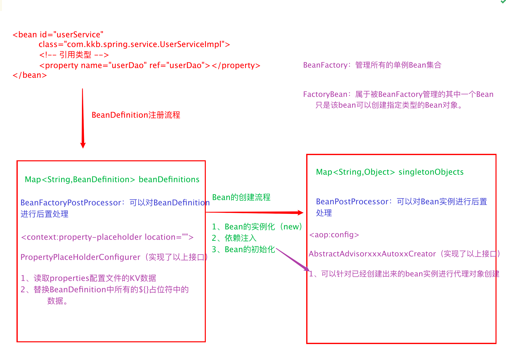
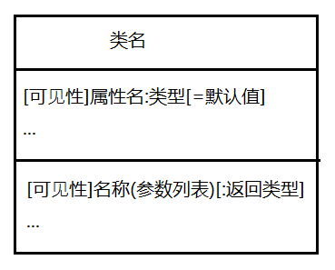
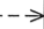
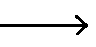
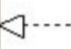
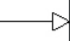
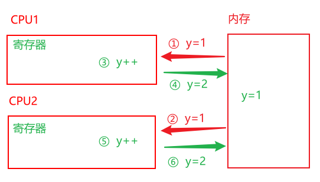

# 0928-设计模式1

## BeanDfinition注册流程

### 注册流程

 

+ 将配置文件中Bean的配置信息读取到`beanDefinitions`中

+ 通过`BeanFactoryPostProcessor`接口的实现类对`BeanDefinition`进行后置处理

  + `PropertyPlaceHolderConfigurer`是`BeanFactoryPostProcessor`的1个实现类，用于读取`beanDefinitions`后进行如下后续操作：
    + 读取properties配置文件的KV数据
    + 替换`BeanDefinition`中所有`${}`占位符

+ 创建`Bean`，将创建后的`Bean`存储到`singletonObjects`集合中

  `Bean`的创建流程如下：

  + `Bean`的实例化
  + 依赖注入
  + `Bean`的初始化

+ 通过`BeanPostProcessor`接口的实现类对`Bean`实例进行后置处理

  + `AbstractAdvisorxxxAutoxxxCreator`是`BeanPostProcessor`的1个实现类，用户创建`Bean`后，针对已经创建出来的`Bean`实例进行代理对象创建

### BeanFactory与FactoryBean区别

+ `BeanFactory`

  这是1个工厂，用于管理所有的单例`Bean`集合

+ `FactoryBean`

  这是`BeanFactory`中的1个`Bean`,这个`Bean`的功能是创建指定类型的`Bean`对象

## 设计模式

### OOA、OOD、OOP

> 面向对象分析、设计、编程，依次是面向对象软件开发需要经历的3个阶段

+ OOA
  + 面向对象分析
+ OOD
  + 面向对象设计
+ OOP
  + 面向对象编程

### UML类图及类图关系

> UML类图是面向对象分析（OOA）阶段形成的，用于描述类之间的关系

#### 类

+ 格式

   

+ 可见性

  + `+`

    公开（public）

  + `-`

    私有（private）

  + `#`

    受保护（protected）

  + `~`

    朋友（friendly），也就是默认的

+ 例

   

#### 接口

+ 格式

   

+ 例

   

#### 关系

> 由上至下，依次由弱至强

+ 依赖关系

  + 描述

    + 最弱的关系
    + 临时的关系，在代码中体现为：局部变量、方法参数、对静态⽅法的调⽤来访问另⼀个类（被依 赖类）中的某些⽅法来完成⼀些职责

  + 表示

    + 带箭头的虚线

       

    + 箭头从使用类指向被依赖的类

+ 关联关系

  关联关系在代码中体现为成员变量

  + 一般关联

    + 描述

      + 较弱的关联关系
      + 可以是单向的或双向的

    + 表示

      + 双向的关联可以⽤带两个箭头或者没有箭头的实线来表示
      + 单向的关联⽤带⼀个箭头的 实线来表示，箭头从使⽤类指向被关联的类。
      + 也可以在关联线的两端标注⻆⾊名

       

  + 聚合关系

    + 描述

      + 整体与部分之间的关系（has a）
      + 整体与部分可以单独存在

    + 表示

      + 带空心菱形的实线
      + 菱形指向整体

       

  + 组合关系

    + 描述

      + 整体与部分之间的关系（contain a）
      + 整体与部分不可以单独存在

    + 表示

      + 带实心菱形的实线
      + 菱形指向整体

       

+ 实现关系

  + 描述

    + 接口与是实现类之间的关系

  + 表示

    + 带空心三角箭头的虚线表示
    + 箭头指向接口

     

+ 泛化关系（继承）

  + 描述

    + 子类与父类之间的关系
    + 最强的关系
    + 要尽量避免使用泛化关系

  + 表示

    + 带空心三角箭头的实线表示
    + 箭头指向父类

     

### 七大设计原则

| 设计原则名称                                       | 定义                                              | 使用频率 |
| -------------------------------------------------- | ------------------------------------------------- | -------- |
| 单⼀职责原则(Single Responsibility Principle, SRP) | ⼀个类只负责⼀个功能领域中的相应职责              | ★★★★☆    |
| 开闭原则(Open-Closed Principle, OCP)               | 软件实体应对扩展开放，⽽对修改关闭                | ★★★★★    |
| ⾥⽒代换原则(Liskov Substitution Principle, LSP)   | 所有引⽤基类对象的地⽅能够透明地使 ⽤其⼦类的对象 | ★★★★★    |
| 依赖倒转原则(Dependence Inversion Principle, DIP)  | 抽象不应该依赖于细节，细节应该依赖 于抽象         | ★★★★★    |
| 接⼝隔离原则(Interface Segregation Principle, ISP) | 使⽤多个专⻔的接⼝，⽽不使⽤单⼀的 总接⼝         | ★★☆☆☆    |
| 合成复⽤原则(Composite Reuse Principle, CRP)       | 尽量使⽤对象组合，⽽不是继承来达到 复⽤的⽬的     | ★★★★☆    |
| 迪⽶特法则(Law of Demeter, LoD)                    | ⼀个软件实体应当尽可能少地与其他实 体发⽣相互作⽤ | ★★★☆☆    |

#### 解析

+ 开闭原则

  + 尽量做到产生新需求时，不用修改已经写完的代码，通过增加代码满足新需求

  + 反例

    ```java
    // 下面代码在新增1个type时需要新增1个if，违反了开闭原则
    if (type.equals("pie")) {
     PieChart chart = new PieChart();
     chart.display();
    }else if (type.equals("bar")) {
     BarChart chart = new BarChart();
     chart.display();
    }
    ```

+ 里氏替换原则

  + 描述的是继承关系
  + 父类已经实现的方法子类不要重写了
  + 不要破坏继承体系

+ 依赖倒转原则

  + 面向接口编程，而不要面向实现的细节编程

+ 合成复用原则

  + 避免使用`泛化关系`，尽量使用`关联关系`

+ 迪米特法则

  + 不要和隔了一层的对象直接发生关系，降低耦合度

#### 描述

+ 所有其他原则都是为了保证`开闭原则`
+ 根本目的是提高`可维护性`和`可复用性`

### 23种设计模式

> 设计模式分为3类23种：
>
> + 创建型
>   + 简单工厂模式
>   + 工厂方法模式
>   + 抽象工厂模式
>   + 单例模式（重点）
>   + 原型模式
>   + 构建者模式
> + 结构性
>   + 适配器模式
>   + 装饰模式
>   + 代理模式（重点）
>   + 外观模式
>   + 桥接模式
>   + 组合模式
>   + 享元模式
> + 行为型
>   + 模板方法模式
>   + 策略模式
>   + 观察者模式
>   + 中介者模式
>   + 状态模式
>   + 责任链模式
>   + 命令模式
>   + 迭代器模式
>   + 访问者模式
>   + 解释器模式
>   + 备忘录模式

#### 简单工厂模式

+ 描述

  + 1个工厂类，通过不同的方法或不同的参数，生产对应的对象

+ 例

  + 普通简单工厂

    ```java
    public class AnimalFactory {
        //简单⼯⼚设计模式（负担太重、不符合开闭原则）
        public static Animal createAnimal(String name){
            if ("cat".equals(name)) {
                return new Cat();
            }else if ("dog".equals(name)) {
                return new Dog();
            }else if ("cow".equals(name)) {
                return new Cow();
            }else{
                return null;
            }
        }
    }
    ```

  + 静态方法工厂

    ```java
    //该简单⼯⼚，也称为静态⽅法⼯⼚
    public class AnimalFactory2 {
        public static Dog createDog(){
            return new Dog();
        }
    
        public static Cat createCat(){
            return new Cat();
        }
    }
    ```

+ 优缺点

  + 优点

    简单粗暴

  + 缺点

    + 违反开闭原则
    + 负担太重，代码越来越多

+ 问题（TODO）

  + `BeanFactory`为什么算简单工厂

#### 工厂方法模式

+ 描述

  + 先定义好所有工厂要实现的方法
  + 每个工厂继承上面的类，去做各自的实现

+ 例

  ```java
  // 抽象出来的动物⼯⼚----它只负责⽣产⼀种产品
  public abstract class AnimalFactory {
      // ⼯⼚⽅法
      public abstract Animal createAnimal();
  }
  
  // 具体的⼯⼚实现类
  public class CatFactory extends AnimalFactory {
      @Override
      public Animal createAnimal() {
          return new Cat();
      }
  }
  
  //具体的⼯⼚实现类
  public class DogFactory extends AnimalFactory {
      @Override
      public Animal createAnimal() {
          return new Dog();
      }
  }
  ```

+ 优缺点

  + 优点
    + 符合开闭原则
    + 代码分散给各自的工厂
  + 缺点
    + 无法满足生产一系列产品

#### 抽象工厂模式

+ 描述
  + `抽象工厂`就是在`工厂方法`的基础上，可以定义多个生产产品的方法

#### 单例模式（重点）

##### 懒汉、饿汉

+ 懒汉
  + 定义：需要的时候再加载
  + 优缺点：
    + 节省内存空间
    + 存在线程安全问题
  + 面试问的一定是懒汉式
  + 懒汉式创建单例对象一共有3种方式：
    + 双重检查锁
    + 静态内部类
    + 枚举
+ 饿汉：程序启动时立即加载
  + 浪费内存空间
  + 没有线程安全问题
  + 一般不被使用

##### 饿汉式

```java
public class Student1 {
    private static Student1 student = new Student1();

    private Student1() {
    }

    public static Student1 getSingletonInstance() {
        return student;
    }
}
```

##### 双重检查锁

+ demo

  ```java
  public class DoubleCheckLockSingleton {
      private static volatile DoubleCheckLockSingleton instance = null;
      
      public static DoubleCheckLockSingleton getInstance() {
          if (instance == null) {
              synchronized (DoubleCheckLockSingleton.class) {
                  if (instance == null) {
                      instance = new DoubleCheckLockSingleton();
                  }
              }
          }
          return instance;
      }
  }
  ```

+ volatile

  + 作用

    + 禁止指令重排
    + 保证可见性

  + 指令重排

    `instance = new DoubleCheckLockSingleton();`这一行代码在`cpu`执行时会被拆分成多条指令，如：

    1. 申请内存空间
    2. 对象初始化
    3. 地址赋值给`instance`变量

    但是`cpu`在执行时，会进行指令重排，上面3个步骤可能会被重拍成如下步骤：

    1. 申请内存空间
    2. 地址赋值给`instance`变量
    3. 对象初始化

    如果线程1执行完第2步时，时间片到期，将cpu交给线程2，而线程2执行到第一遍的`if (instance == null)`,发现`instance`不为`null`，会立即返回并进行使用，而此时`instance`对象并未完成第3步的准备工作，导致使用该对象时程序报错

  + 可见性

    CPU操作内存中变量时，变量会先被加载到CPU的寄存器中，再进行操作；当多核CPU同时操作同1个变量时，会出现1个CPU寄存器中变量值被改变时，其他COU寄存器不知道，导致变量值出错

     

    当变量`y`被`volatile`修饰时，变量`y`的值会通过`MESI(内存数据一致性协议)`被及时同步到内存和其他CPU寄存器中，来保证可见性

+ 并不安全，会被`反射攻击`和`序列化攻击`

##### 静态内部类

+ demo

  ```java
  public class StaticInnerHolderSingleton {
      // 静态内部类
      private static class SingletonHolder {
          private static final StaticInnerHolderSingleton INSTANCE =
              new StaticInnerHolderSingleton();
      }
      
      public static StaticInnerHolderSingleton getInstance() {
          return SingletonHolder.INSTANCE;
      }
  }
  ```

+ 因为`SingletonHolder`是静态内部类，所以只有在**第一次使用时**，这个类才会被加载，它的静态成员变量才会被初始化

+ 并不安全，会被`反射攻击`和`序列化攻击`

##### 枚举

+ demo

  ```java
  public enum EnumSingleton {
      INSTANCE;
      // 虽然类的类型是枚举，但是类该有的特性他都有，所以并不影响功能使用
      public void tellEveryone() {
          System.out.println("This is an EnumSingleton " + this.hashCode());
      }
  }
  ```

+ 最安全的单例对象创建方式，天然防御`反射攻击`和`序列化攻击`

##### 反射攻击

```java
public class SingletonAttack{
    public static void reflectionAttack() throws Exception {
        //通过反射，获取单例类的私有构造器
        Constructor constructor = DoubleCheckLockSingleton.class.getDeclaredConstructor();
        //设置私有成员的暴⼒破解
        constructor.setAccessible(true);
        // 通过反射去创建单例类的多个不同的实例
        DoubleCheckLockSingleton s1 = (DoubleCheckLockSingleton)constructor.newInstance();
        // 通过反射去创建单例类的多个不同的实例
        DoubleCheckLockSingleton s2 = (DoubleCheckLockSingleton)constructor.newInstance();
        System.out.println(s1 == s2);
    }
}
```

##### 序列化攻击

+ 序列化攻击仅针对实现了`Serializable`接口的类，将对象序列化之后再反序列化回来的方式进行攻击

+ demo

  ```java
  public class SingletonAttack {
      public static void serializationAttack() throws Exception {
          DoubleCheckLockSingleton s1 = DoubleCheckLockSingleton.getInstance();
          // 序列化
          ObjectOutputStream outputStream = new ObjectOutputStream(new FileOutputStream("serFile"));
          outputStream.writeObject(s1);
          // 反序列化
          ObjectInputStream inputStream = new ObjectInputStream(new FileInputStream(new File("serFile")));
          DoubleCheckLockSingleton s2 = (DoubleCheckLockSingleton)inputStream.readObject();
          System.out.println(s1 == s2);
      }
  }
  ```

+ 防御

  在反序列化时比然后调用`inputStream.readObject()`这行代码，而这行代码里会判断是否存在`readResolve`方法，如果存在直接使用该方法返回值作为反序列化的结果，所以我们只需要重写`readResolve`方法并返回单例对象即可进行防御

  ```java
  private Object readResolve() {
   return instance;
  }
  ```

#### 设计模式总结

##### 工厂模式

+ 简单工厂： 使⽤⼀个⼯⼚对象⽤来⽣产同⼀等级结构中的任意产品。（不⽀持拓展增加产品） 
+ ⼯⼚⽅法 ： 使⽤多个⼯⼚对象⽤来⽣产同⼀等级结构中对应的固定产品。（⽀持拓展增加产品） 
+ 抽象⼯⼚ ： 使⽤多个⼯⼚对象⽤来⽣产不同产品族的全部产品。（不⽀持拓展增加产品；⽀持增 加产品族）