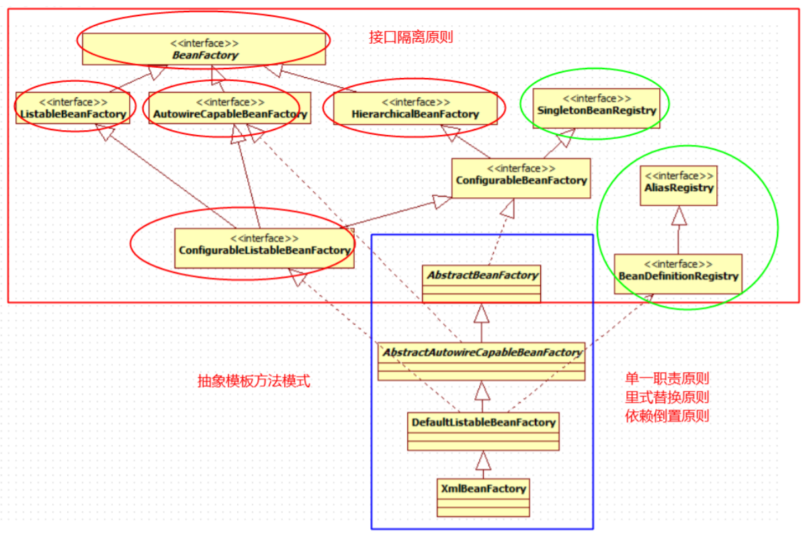

# 0930-手写IOC.v3(1)

## BeanFactory继承体系

 

> 参见[CSDN](https://blog.csdn.net/u013412772/category_9273433.html) 

+ BeanFactory

  + 接口
  + Spring bean容器的根接口.提供获取bean,是否包含bean,是否单例与原型,获取bean类型,bean别名的api

+ ListableBeanFactory

  + 接口
  + 提供容器内bean实例的枚举功能，可列表化操作
  + 该接口中的方法只考虑自己管理Bean，其他的都不考虑，比如：
    + 父类中管理的Bean（即使实现了`HierarchicalBeanFactory`）
    + `ConfigurableBeanFactory`的`registerSingleton`注册的单例bean（getBeanNamesOfType和getBeansOfType是除外）

+ AutowireCapableBeanFactory

  + 接口
  + 添加框架集成功能，扩展了自动装配的功能，根据类定义BeanDefinition装配Bean、执行前、后处理器等。

+ HierarchicalBeanFactory

  + 接口
  + 提供父容器的访问功能

+ ConfigurableBeanFactory

  + 接口
  + 定义`BeanFactory`的配置方法

+ SingletonBeanRegistry

  + 接口

  + 单例Bean都存储到该类中进行管理

+ AliasRegistry

  + 接口
  + 用于操作Bean的别名

+ BeanDefinitionRegistry

  + 接口
  + Bean的描述信息都在该类中进行管理

+ DefaultListableBeanFactory

  + 类
  + 集大成者，我们最终使用的是该类

+ 其他

  + 对于上图中的2个抽象类，都是各自实现了接口或父抽象类中的方法，并定义了新的接口方法留给子类去实现，这体现了`抽象模板方法`的设计模式
  + 其他的暂不介绍