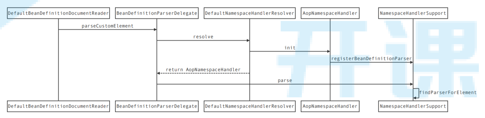

# 1012-AOP

## 概念

+ Pointcut（切入点）

  + 对要拦截的连接点进行描述的对象
  + 如定义1个切入点表达式`execution(* com.kkb..*ServiceImpl.*(..))`,该表达式匹配到的方法都会被拦截，那将这个切入点表达式及相关信息封装为1个对象，这个对象就是个切入点

+ Joinpoint（连接点）

  + 被拦截的方法

  + 切入点表达式拦截到的，某个具体的方法，就是连接点，如上面表达式匹配到了如下方法：

    `void com.kkb.service.UserServiceImpl.add()`,则这个具体的方法就是1个连接点

+ Advice（通知/增强）

  + 连接点周围增强的内容

  + 通过切入点找到连接点之后，需要在连接点周围执行要增强的方法，将这些方法封装成对象，这个对象就是通知（增强）

  + 分类

    + 前置通知
    + 后置通知
    + 返回通知
    + 环绕通知
    + 异常通知

+ Aspect（切面）

  + （切入点 + 通知） * n = 切面

+ Advisor（通知器、顾问）

  + 概念同`切面`

+ Weaving（织入）

  + 上面定义好了切面，但是这些还仅仅是描述信息；真正实现在调用切入点匹配到的方法前后，执行对应的通知代码，还需要一些技术手段；通过技术手段真正实现这个功能的过程，叫做织入
  + 如：使用JDK的动态代理技术，生成动态代理类，动态代理类实现了被代理类的所有接口，具有相同的方法，动态代理类中持有被代理对象，在动态代理类的方法中加入通知代码，并调用对应的被代理对象的方法；这种通过JDK动态代理技术实现增强的过程就叫织入
  + 织入分为：
    + 动态织入：主要靠JDK动态代理、CGLib动态代理实现
    + 静态织入：手动编写代理类（静态代理）

+ Proxy（代理对象）

  + 通过动态代理或者静态代理产生的代理类实例化出来的对象

+ Target（目标对象）

  + `切入点`匹配到的类，实例化出来的具体的对象，就是目标对象，目标对象也就是需要被代理的对象
  + JDK动态代理产生的代理对象中持有目标对象；CGLib动态代理实现该功能时，代理对象和目标对象是同一个对象（动态代理类是目标类的子类）

+ Introduction（引介）

## 动态代理

### JDK动态代理

#### 概述

+ 原理
  + 通过反射获取目标类实现的所有接口
  + 通过字符串拼接的方式，拼接出需要的动态代理类中的代码；代理类实现了和目标类相同的接口，并实现了接口中所有方法，并且持有目标对象，代理类中的方法调用了`InvocationHandler`的`invoke`方法，来实现对目标对象中对应方法及增强代码的调用
  + 生成1个名为`$Proxy[随机数]`的`java`文件，将刚才拼接出来的代理类的内容写入该文件
  + 将生成的`java`文件编译成`class`文件
  + 通过`ClassLoader`将`class`文件加载到`jvm`
  + 生成代理对象
+ JDK动态代理只能代理实现了接口的类，并且只能拦截接口中的方法
+ 代理类和目标类实现了相同的接口，是同级关系

#### demo

```java
public class JDKProxyFactory implements InvocationHandler {
    // ⽬标对象的引⽤
    private Object target;
    // 通过构造⽅法将⽬标对象注⼊到代理对象中
    public JDKProxyFactory(Object target) {
        this.target = target;
    }

    // 只能为实现了接⼝的类产⽣代理对象
    public Object getProxy() {
        // 1.⽬标类的类加载器
        // 2.⽬标类的接⼝集合
        // 3.代理对象被调⽤时的调⽤处理器
        Object proxy = Proxy.newProxyInstance(target.getClass().getClassLoader(),
                                              target.getClass().getInterfaces(),
                                              this);
        return proxy;
    }
    /**
     * 代理对象会执⾏的⽅法
     * 1.代理对象
     * 2.⽬标对象⽅法
     * 3.⽅法参数
     */
    @Override
    public Object invoke(Object proxy, Method method, Object[] args) throws Throwable {
        // 增强代码....
        Object returnValue = method.invoke(target, args);
        // 增强代码....
        return returnValue;
    }
}
```

#### 生成的代理类demo

这个自动生成的类是看不见的，这个代码是演示

```java
public class $Proxy11 implements UserService {

	private InvocationHandler h;

	public $Proxy11(InvocationHandler h) {
		this.h = h;
	}

	// saveUser对应的方法对象
	private static Method m1;

	// 可以通过反射获取每个接口的方法声明
	@Override
	public void saveUser() {
		try {
			this.h.invoke(this,m1,null);
		} catch (Throwable throwable) {
			throwable.printStackTrace();
		}
	}

	static {
		try {
			m1 = Class.forName("com.kkb.UserService").getDeclaredMethod("saveUser");
		} catch (NoSuchMethodException e) {
			e.printStackTrace();
		} catch (ClassNotFoundException e) {
			e.printStackTrace();
		}
	}
}
```

可以看见，代理类中所有方法调用的都是`InvocationHandler`的`invoke`方法，所以这个`invoke`方法的内容才是核心，增强的内容都在这个方法中

### CGLib动态代理

#### 概述

+ CGLib是第三方jar包
+ 底层依赖`ASM`工具包操作`class`字节码文件
+ 原理
  + 通过字符串拼接方式生成1个目标类的子类作为代理类；代理类中重写了目标类中需要代理的方法，代理类的方法通过调用`MethodInterceptor`的`intercept`方法，来调用了父类的对应方法及增强代码
  + 生成1个`class`文件，将刚才拼接出来的代码写入该文件
  + 通过`ClassLoader`加载该文件并生成代理对象
+ CGLib能代理所有非`final`类，拦截所有方法
+ 目标类与代理类是父子关系

#### demo

```java
public class CgLibProxyFactory implements MethodInterceptor {

    public Object getProxy(Class clazz) {
        // 创建增强器
        Enhancer enhancer = new Enhancer();
        // 设置需要增强的类的类对象
        enhancer.setSuperclass(clazz);
        // 设置回调函数
        enhancer.setCallback(this);
        // 获取增强之后的代理对象
        return enhancer.create();
    }
    /***
     * Object proxy:这是代理对象，也就是[⽬标对象]的⼦类
     * Method method:[⽬标对象]的⽅法
     * Object[] arg:参数
     * MethodProxy methodProxy：代理对象的⽅法
     */
    @Override
    public Object intercept(Object proxy, Method method, Object[] arg,MethodProxy methodProxy) throws Throwable {
        // 增强代码....
        // 通过调⽤⼦类[代理类]的invokeSuper⽅法，去实际调⽤[⽬标对象]的⽅法
        Object returnValue = methodProxy.invokeSuper(proxy, arg);
        // 增强代码....
        return returnValue;
    }
}
```


### 区别

+ JDK动态代理是Java自带的，CGLib是第三方jar包
+ JDK动态代理只能代理实现了接口的类，并且只能拦截接口中的方法；CGLib能代理所有非`final`类，拦截所有方法
+ spring优先使用JDK动态代理，没有接口的类才会使用CGLib，也可以手动指定为CGLib
+ JDK动态代理中，目标类与代理类是同级关系；CGLib动态代理中，目标类与代理类是父子关系
+ jdk1.8之前，CGLib性能更好，jdk1.8以后，JDK动态代理性能更好

## 源码

### 核心类

#### MethodInvocation

+ `Joinpoint`的子接口
+ 实现了拦截器链式调用

#### ClassFilter

+ 根据切入点表达式匹配目标类

#### MethodMatcher

+ 根据切入点表达式匹配目标方法

### 解读

aop源码处理流程分为如下几步：

+ 加载xml配置文件（省略）
+ 根据xml配置文件中的标签查找对应的`BeanDefinitionParser`
+ 执行`BeanDefinitionParser`对所有标签进行处理，转换成对应的`BeanDefinition`
+ 产生aop代理对象
+ 代理对象执行

#### `ApplicationContext`创建

AbstractGenericContextLoader#loadContext

```java
@Override
public final ConfigurableApplicationContext loadContext(MergedContextConfiguration mergedConfig) throws Exception {
    // 其他工作
    ...
    // 加载BeanDefinition
    loadBeanDefinitions(context, mergedConfig);
    // 根据前面的配置刷新 applicationContext（包括Bean的创建）
    context.refresh();
    // 其他工作
    ...
    return context;
}
```

上面5步流程的前三步，都是在`loadBeanDefinitions(context, mergedConfig);`中完成的

第4步是在`context.refresh();`中完成的

#### 查找`BeanDefinitionParser`

##### 入口

> DefaultBeanDefinitionDocumentReader#parseBeanDefinitions 

##### 流程图

 


##### 总结

+ 当遇见`<aop:config >`标签时，根据`:`左边的字符串`aop`在根标签`<beans></beans>`中查找对应的命名空间

  `xmlns:aop="http://www.springframework.org/schema/aop"`

+ 根据明明空间在`resources/META-INF/spring.handlers`中查找对应的命名空间处理器

  `http\://www.springframework.org/schema/aop=org.springframework.aop.config.AopNamespaceHandler`

+ 在处理类中根据`:`右边字符串查找对应的`BeanDefinitionParser`

  ```java
  // <aop:config>
  registerBeanDefinitionParser("config", new ConfigBeanDefinitionParser());
  ```

#### 执行`BeanDefinitionParser`

##### 入口

> 上面找到的`BeanDefinitionParser`的`parse`方法

##### 总结

最终解析出`AspectJAwareAdvisorAutoProxyCreator`的`BeanDefinition`对象注入到IOC容器

`AspectJAwareAdvisorAutoProxyCreator`的`BeanDefinition`中又包含了解析出来的下面这些`BeanDefinition`:

+ 切面
  + AspectJPointcutAdvisor
  + DefaultBeanFactoryPointcutAdvisor
+ 切入点
  + AspectJExpressionPointcut
+ 通知
  + AspectJMethodBeforeAdvice
  + AspectJAfterAdvice
  + AspectJAfterReturningAdvice
  + AspectJAfterThrowingAdvice
  + AspectJAroundAdvice
+ ⽤于产⽣⾃定义增强类实例的类对应的`BeanDefinition`实例⼯⼚
  + SimpleBeanFactoryAwareAspectInstanceFactory
+ ⽤于调⽤⾃定义增强类⽅法对应的`BeanDefinition`
  + MethodLocatingFactoryBean

`AspectJAwareAdvisorAutoProxyCreator`是代理对象创建器，用户代理对象创建