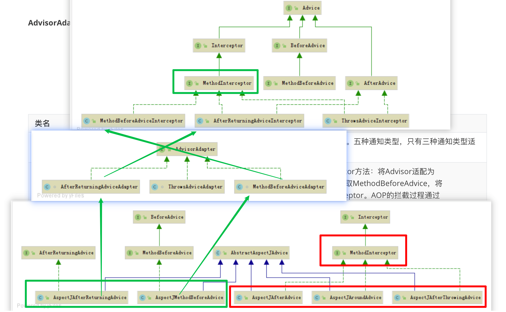

# 1016-AOP代理对象创建执行

## 代理对象创建

+ 前面讲过，在`AbstractGenericContextLoader#loadContext`中会先加载`beandefinition`，然后执行`context.refresh()`创建Bean

+ 在`AbstractApplicationContext#refresh`方法中有如下代码：

  ```java
  @Override
  public void  refresh() throws BeansException, IllegalStateException {
      synchronized (this.startupShutdownMonitor) {
          // 其他工作
          ...
          try {
              // 其他工作
              ...
              //注册bean的后置处理器来方便拦截bean的创建
              registerBeanPostProcessors(beanFactory);
              // 其他工作
              ...
              // 11.bean工厂初始化(创建非懒加载单例bean)
              finishBeanFactoryInitialization(beanFactory);
              // 其他工作
              ...
          } catch (BeansException ex) {
              // 其他工作
              ...
          } finally {
              // 其他工作
              ...
          }
      }
  }
  ```

  通过这段代码我们可以看到：

  + 先执行`registerBeanPostProcessors(beanFactory);`，注册了所有类型为`BeanPostProcessor`的`bean`

    前面我们说过，在加载`BeanDefinition`时，加载了1个创建`AspectJAwareAdvisorAutoProxyCreator`的`BeanDefinition`（参见[执行`BeanDefinitionParser`](#执行`BeanDefinitionParser`)）；`AspectJAwareAdvisorAutoProxyCreator`实现了`BeanPostProcessor`接口，所以`AspectJAwareAdvisorAutoProxyCreator`实例在这步就被创建出来了

  + 然后进行`bean`工厂初始化，其中包括单例`bean`的创建

+ `BenPostProcessor`创建完成后，开始进行`bean`工厂初始化，其中包括单例`bean`的创建

  在`ioc`的课程中我们讲过`Bean`的创建流程为：

  + bean的实例化
  + 依赖注入
  + bean的初始化(`AbstractAutowireCapableBeanFactory # initializeBean`)

  在bean的初始化方法(`AbstractAutowireCapableBeanFactory # initializeBean`)中包含如下代码：

  ```java
  try {
      //执行初始化方法（先调用InitializingBean的afterPropertiesSet，再调用init-method属性指定的初始化方法）
      invokeInitMethods(beanName, wrappedBean, mbd);
  }
  catch (Throwable ex) {
      // 其他工作.....
  }
  if (mbd == null || !mbd.isSynthetic()) {
      //应用BeanPostProcessor的postProcessAfterInitialization方法(AOP代理对象生成)
      wrappedBean = applyBeanPostProcessorsAfterInitialization(wrappedBean, beanName);
  }
  
  return wrappedBean;
  ```

  此时可以看见，每个`bean`创建完成后，都会执行`applyBeanPostProcessorsAfterInitialization(wrappedBean, beanName);`来走一遍所有的`BeanPostProcessor`，其中就包括负责创建代理对象的`AspectJAwareAdvisorAutoProxyCreator`

+ `AspectJAwareAdvisorAutoProxyCreator`中`BeanPostProcessor`的接口方法`postProcessAfterInitialization`（实际是在抽象父类`AbstractAutoProxyCreator`中实现）如下：

  ```java
  if (bean != null) {
      Object cacheKey = getCacheKey(bean.getClass(), beanName);
      if (this.earlyProxyReferences.remove(cacheKey) != bean) {
          ////如果需要的情况下进行包装
          return wrapIfNecessary(bean, beanName, cacheKey);
      }
  }
  return bean;
  ```

+ `wrapIfNecessary`方法如下：

  ```java
  protected Object wrapIfNecessary(Object bean, String beanName, Object cacheKey) {
      // 其他...
      
      // 从所有Advisor中找到匹配的
      Object[] specificInterceptors = getAdvicesAndAdvisorsForBean(bean.getClass(), beanName, null);
  
      // 对相应的advisor不为空才采取代理
      if (specificInterceptors != DO_NOT_PROXY) {//如果这个bean有增强器,就不为空,
          this.advisedBeans.put(cacheKey, Boolean.TRUE);//把当前已经增强过的bean保存到,保存当前bean在advisedBeans中
          // 通过jdk动态代理或者cglib动态代，产理生代理对象
          // 第三步：针对目标对象产生代理对象
          //如果当前bean有了增强器,那么就创建代理对象,增强此bean(如果当前bean需要增强，创建当前bean的代理对象)
  
          //点击进入 createProxy跟进去,看如何创建代理对象
          Object proxy = createProxy(
              bean.getClass(), beanName, specificInterceptors, new SingletonTargetSource(bean));
          // 放入代理类型缓存
          this.proxyTypes.put(cacheKey, proxy.getClass());
          return proxy;
      }
      // 放入通知缓存
      this.advisedBeans.put(cacheKey, Boolean.FALSE);
      return bean;
  }
  ```

  + `getAdvicesAndAdvisorsForBean`这一步是根据切入点表达式，找到所有匹配的`Advisor`

    这一步跟下去，最终会跟到`AopUtils#canApply`这个方法（223行）

    ```java
    // 获取 ClassFilter 用来匹配类
    if (!pc.getClassFilter().matches(targetClass)) {
        return false;
    }
    // 获取 MethodMatcher 用来匹配方法
    MethodMatcher methodMatcher = pc.getMethodMatcher();
    ```

  + 代理对象创建在`Object proxy = createProxy(bean.getClass(), beanName, specificInterceptors, new SingletonTargetSource(bean));`这一步

  + createProxy

    这个方法中做了如下几件事：

    + 新建代理工厂（`ProxyFactory`）并进行配置
    + 将代理对象封装到`ProxyFactory`中
    + 使用`ProxyFactory`创建代理对象并返回

+ `ProxyFactory#getProxy`

  我们先看下`ProxyFactory`的继承关系：

   

  然后看下`ProxyFactory#getProxy`方法：

  ```java
  public Object getProxy(@Nullable ClassLoader classLoader) {
      return createAopProxy().getProxy(classLoader);
  }
  ```

  这里先创建了代理类`createAopProxy()`，然后获取代理对象`getProxy(classLoader)`

  + `createAopProxy()`跟下去，调用了其父类的`ProxyCreatorSupport#createAopProxy`方法

    ```java
    protected final synchronized AopProxy createAopProxy() {
        if (!this.active) {
            activate();
        }
        // 创建JDK方式的AOP代理或者CGLib方式的AOP代理
        return getAopProxyFactory().createAopProxy(this);
    }
    ```

    这里我们关注的是`createAopProxy(this)`这句话，点进去进到了`DefaultAopProxyFactory#createAopProxy`

    ```java
    @Override
    public AopProxy createAopProxy(AdvisedSupport config) throws AopConfigException {
        if (config.isOptimize() || config.isProxyTargetClass() || hasNoUserSuppliedProxyInterfaces(config)) {
            Class<?> targetClass = config.getTargetClass();
            if (targetClass == null) {
                throw new AopConfigException("TargetSource cannot determine target class: " +
                                             "Either an interface or a target is required for proxy creation.");
            }
            // 如果目标类是接口或者目标类是Proxy的子类，则使用JDK动态代理方式
            if (targetClass.isInterface() || Proxy.isProxyClass(targetClass)) {
                return new JdkDynamicAopProxy(config);
            }
            // 使用Cglib动态代理
            return new ObjenesisCglibAopProxy(config);
        }
        else {
            // 默认使用JDK动态代理
            return new JdkDynamicAopProxy(config);
        }
    }
    ```

    `DefaultAopProxyFactory#createAopProxy`判断了是使用JDK动态代理（`JdkDynamicAopProxy`）还是CGLib动态代理（`ObjenesisCglibAopProxy`）

  + 根据`createAopProxy`返回的动态代理类不同，调用的是不同的类中的`getProxy`方法，下面以`JdkDynamicAopProxy#getProxy`为例

+ `JdkDynamicAopProxy#getProxy`

  ```java
  @Override
  public Object getProxy(@Nullable ClassLoader classLoader) {
      if (logger.isDebugEnabled()) {
          logger.debug("Creating JDK dynamic proxy: target source is " + this.advised.getTargetSource());
      }
      // 获取完整的代理接口
      Class<?>[] proxiedInterfaces = AopProxyUtils.completeProxiedInterfaces(this.advised, true);
      findDefinedEqualsAndHashCodeMethods(proxiedInterfaces);
      // 调用JDK动态代理方法
      return Proxy.newProxyInstance(classLoader, proxiedInterfaces, this);
  }
  ```

  最后一行，`newProxyInstance`的第三个参数是当前对象，则代理对象执行的时候，调用的其实是当前对象中的`invoke`方法`JdkDynamicAopProxy#invoke`（参见[JDK动态代理](#JDK动态代理)） 

+ 最终返回值就是创建后的代理对象，最终保存在IOC容器中的，其实是这个代理对象了

+ `Advisor`如何保存在代理对象中？

  `ProxyCreatorSupport#createAopProxy`方法中，`createAopProxy`的参数是`this`，而当前对象仍然是`AbstractAutoProxyCreator#createProxy`中创建的局部变量`ProxyFactory`，并且前面我们把匹配到的所有`Advisor`交给它保存了，而这个`ProxyFactory`对象，最终成为了`JdkDynamicAopProxy`的构造方法参数，下面看下`JdkDynamicAopProxy`的构造方法

  ```java
  public JdkDynamicAopProxy(AdvisedSupport config) throws AopConfigException {
      Assert.notNull(config, "AdvisedSupport must not be null");
      if (config.getAdvisors().length == 0 && config.getTargetSource() == AdvisedSupport.EMPTY_TARGET_SOURCE) {
          throw new AopConfigException("No advisors and no TargetSource specified");
      }
      this.advised = config;
  }
  ```

  可以看到，`JdkDynamicAopProxy`对象将`ProxyFactory`对象保存起来了，而`JdkDynamicAopProxy#getProxy`方法中，又将`JdkDynamicAopProxy`对象作为`InvocationHandler`传给了最终的代理对象

  代理对象执行时，调用的其实是`InvocationHandler#invoke`方法，在这里就是`JdkDynamicAopProxy#invoke`方法，而`JdkDynamicAopProxy`对象中保存`ProxyFactory`对象，`ProxyFactory`对象中保存了所有匹配到的`Advisor`

## 代理对象执行

+ [JDK动态代理](#JDK动态代理)中得知，代理对象执行时，调用的是`InvocationHandler#invoke`方法，这里对应的是`JdkDynamicAopProxy#invoke`，代码如下

  ```java
  @Override
  @Nullable
  public Object invoke(Object proxy, Method method, Object[] args) throws Throwable {
      MethodInvocation invocation;
      // 其他 ......
      try{
          // 其他 ......
          // 将所有的 Advisor 转换为 MethodInterceptor
          List<Object> chain = this.advised.getInterceptorsAndDynamicInterceptionAdvice(method, targetClass);
          if (chain.isEmpty()) {
              // 处理可变长参数
              Object[] argsToUse = AopProxyUtils.adaptArgumentsIfNecessary(method, args);
              // 通过反射调用目标对象的方法，此时没有进行功能增强
              retVal = AopUtils.invokeJoinpointUsingReflection(target, method, argsToUse);
          } else {
              // 我们需要创建一个方法调用
              invocation = new ReflectiveMethodInvocation(proxy, target, method, args, targetClass, chain);
              // 开始执行AOP的拦截过程
              retVal = invocation.proceed();
          }
          // 其他 ......
      }finally{
          // 其他 ......
      }
  }
  ```

+ 上面代码中，我们关注`List<Object> chain = this.advised.getInterceptorsAndDynamicInterceptionAdvice(method, targetClass);`这句话

  `this.advised`其实就是构造时传入的`ProxyFactory`，其中保存了所有匹配的`Advisor`

  跟进`getInterceptorsAndDynamicInterceptionAdvice`

  ```java
  public List<Object> getInterceptorsAndDynamicInterceptionAdvice(Method method, @Nullable Class<?> targetClass) {
      MethodCacheKey cacheKey = new MethodCacheKey(method);
      List<Object> cached = this.methodCache.get(cacheKey);
      if (cached == null) {
          //从advisorChainFactory拦截器链工厂获取div 方法的拦截器键，跟进方法
          cached = this.advisorChainFactory.getInterceptorsAndDynamicInterceptionAdvice(//跟进方法
              this, method, targetClass);
          this.methodCache.put(cacheKey, cached);
      }
      return cached;
  }
  ```

  在跟进`this.advisorChainFactory.getInterceptorsAndDynamicInterceptionAdvice`，进到`DefaultAdvisorChainFactory#getInterceptorsAndDynamicInterceptionAdvice`，找到下面这行代码

  ```java
  MethodInterceptor[] interceptors = registry.getInterceptors(advisor);
  ```

  在跟进，进入`DefaultAdvisorAdapterRegistry#getInterceptors`

  ```java
  public MethodInterceptor[] getInterceptors(Advisor advisor) throws UnknownAdviceTypeException {
      List<MethodInterceptor> interceptors = new ArrayList<>(3);
      //CTRL+T查看一下类看是不是MethodInterceptor类型
      Advice advice = advisor.getAdvice();
      // 如果是advice是MethodInterceptor类型，则直接加到数组中
      if (advice instanceof MethodInterceptor) {
          interceptors.add((MethodInterceptor) advice);
      }
      // 使用AdvisorAdapter适配器对advice进行适配，如果适配成功，则将advisor适配成MethodInterceptor,放入集合中
      //有些advice不是实现MethodInterceptor接口,需要使用adapter进行包装转换,实际上就是加一个AfterReturningAdviceInterceptor后置通知进行
      for (AdvisorAdapter adapter : this.adapters) {//如果不是,需要AdvisorAdapter 适配器帮它转过来,将增强器转为interceptors
          if (adapter.supportsAdvice(advice)) {
              interceptors.add(adapter.getInterceptor(advisor));
          }
      }
      if (interceptors.isEmpty()) {
          throw new UnknownAdviceTypeException(advisor.getAdvice());
      }
      //把每个adivce转换成MethodIntereptor数组并返回,得到拦截器链(其实就是指每个通知方法又被包装为方法拦截 器,
      // 以后的方法的执行都是利用 MethodIntercpter机制执行)
      return interceptors.toArray(new MethodInterceptor[0]);
  }
  ```

  这里是判断一下`Advisor`是否本身是否是`MethodInterceptor`，如果是则直接强转放入数组返回；如果不是，则需要通过适配器逐个尝试，转换为`MethodInterceptor`，再放入数组返回（详见[`Advisor`转换`MethodInterceptor`](#`Advisor`转换`MethodInterceptor`)） 

+ `MethodInterceptor`链式调用

  + 这里采用了责任链模式

  + 我们再来关注`JdkDynamicAopProxy#invoke`中如下代码：

    ```java
    // 我们需要创建一个方法调用
    invocation = new ReflectiveMethodInvocation(proxy, target, method, args, targetClass, chain);
    // 开始执行AOP的拦截过程
    retVal = invocation.proceed();
    ```

    将代理对象、目标对象、`MethodInterceptor`等信息统统作为构造参数，创建出1个`ReflectiveMethodInvocation`对象，这个对象是负责链式调用的

  + 跟进`ReflectiveMethodInvocation#proceed`

    ```java
    public Object proceed() throws Throwable {
        //currentInterceptorIndex索引 默认为-1,记录当前拦截器索引
        if (this.currentInterceptorIndex == this.interceptorsAndDynamicMethodMatchers.size() - 1) {
            //如果没有拦截器执行执行目标方法，或者拦截器的索引和拦截器数组-1大小一样（指定到了最后一个拦截器）执行目标方法,比如最一个为5, -1 != 5-1
            return invokeJoinpoint();//如果不相同,表明不使用拦截器跟进会发现,最终是调了一个invoke反射
            //注：如果代码执行到这，表示前置通知已处理完，并执行完@Before注解的打印内容，开始准备调用目标方法
        }
    
        Object interceptorOrInterceptionAdvice =
            this.interceptorsAndDynamicMethodMatchers.get(++this.currentInterceptorIndex);//每次加1，取一个拦截器
        if (interceptorOrInterceptionAdvice instanceof InterceptorAndDynamicMethodMatcher) {
            // Evaluate dynamic method matcher here: static part will already have
            // been evaluated and found to match.
            InterceptorAndDynamicMethodMatcher dm =
                (InterceptorAndDynamicMethodMatcher) interceptorOrInterceptionAdvice;
            Class<?> targetClass = (this.targetClass != null ? this.targetClass : this.method.getDeclaringClass());
            if (dm.methodMatcher.matches(this.method, targetClass, this.arguments)) {
                return dm.interceptor.invoke(this);
            }
            else {
                // Dynamic matching failed.
                // Skip this interceptor and invoke the next in the chain.
                return proceed();
            }
        }
        else {
            // It's an interceptor, so we just invoke it: The pointcut will have
            // been evaluated statically before this object was constructed.
            //会调用此方法，this=CglibAopProxy,跟进去看
            return ((MethodInterceptor) interceptorOrInterceptionAdvice).invoke(this);
        }
    }
    ```

    + 这里是通过维护`MethodInterceptor`集合索引下标方式实现链式调用

    + 先调用第一个`MethodInterceptor`的`invoke`方法，将当前对象作为参数传入

    + `MethodInterceptor#invoke`方法中会在调用参数对象的`procced`方法（也就还是这个`ReflectiveMethodInvocation`对象的`procced`方法），但是因为`MethodInterceptor`集合的索引下标加1了，则会调用下一个`MethodInterceptor`，如此循环......
    + 直到所有`MethodInterceptor`调用结束，最后调用代理对象的方法，再原路返回

## `Advisor`转换`MethodInterceptor`


 

上图可知

+ 5种通知中，`AspectJAfterAdvice`、`AspectJAroundAdvice`、`AspectJAfterThrowingAdvice`是实现了`MerhodInterceptor`接口的，所以直接进行转换
+ 而`AspectJMethodBeforeAdvice`、`AspectJAfterReturningAdvice`没有实现`MerhodInterceptor`接口，需要通过适配器才能进行转换
  + `AspectJMethodBeforeAdvice`需要通过`MethodBeforeAdvieAdapter`转换
  + `AspectJAfterReturningAdvice`需要通过`AfterReturningAdviceAdapter`转换

## 循环依赖

### 分类

+ 构造方法注入

  无法解决

+ setter方法注入

下面讲到解决的循环依赖问题，指的都是`setter方法注入`方式

### 三级缓存

spring通过三级缓存解决循环依赖问题

+ 一级缓存
  + Map<String, Object> singletonObjects
  + 存储已经创建好的单例bean
+ 二级缓存
  + Map<String, Object> earlySingletonObjects
  + 存储创建中的单例Bean
+ 三级缓存
  + Map<String, ObjectFactory<?>> singletonFactories
  + 存储创建中的bean的`bean工厂`
  + 注意，这里存储的是`bean工厂`，而非单例bean

### 流程

> 以下流程以`ClassA`与`ClassB`互相依赖为例

获取`ClassA`单例bean流程：

1. 获取`ClassA`的单例bean，依次从一二三级缓存获取，获取不到接着往下走

2. 实例化`ClassA`对象，同时将`ClassA`的`Bean工厂`放入三级缓存

   因为这里只是目标对象引用，还没有代理对象引用，所以先把bean工厂缓存起来

3. 依赖注入`ClassB`

   因为此时还没有创建`ClassB`的单例bean，所以需要按同样的方式获取`ClassB`的单例bean

   获取`ClassB`单例bean流程：

   1. 获取`ClassB`的单例bean，依次从一二三级缓存获取，获取不到接着往下走

   2. 实例化`ClassB`对象，同时将`ClassB`的`Bean工厂`放入三级缓存

   3. 依赖注入`ClassA`

      依次从一二三级缓存获取，此时在三级缓存中找到了`ClassA`

      通过`ClassA`的bean工厂获取代理对象，并将`ClassA`提升至二级缓存

      将`ClassA`的代理对象引用注入到`ClassB`

   4. 初始化`ClassB`

   5. 将`ClassB`代理对象提升至一级缓存

4. 初始化`ClassA`

5. 将二级缓存中的`ClassA`代理对象提升至一级缓存

> + 外层的5步和内层的5步是一模一样的代码，类似于递归调用
> + 解决循环依赖问题的根本原则就是，每个对象获取到引用之后先缓存起来，依赖另外一个bean时先去创建他，创建他时如果需要注入我，就直接拿着我得引用注入，虽然我还没创建好；两个bean互相都拿到对方的引用之后，再各自进行初始化

### 第三级缓存存在意义

+ 首先，大原则是：一级缓存只能缓存创建好的bean，所以必然需要二级缓存存储创建中的bean
+ 如果没有三级缓存，`ClassB`注入`CalssA`时只能拿到目标对象引用，而拿不到代理对象引用，如果`ClassA`最终被IOC容器管理的是代理对象引用，则在`ClassB`中注入的`ClassA`是无效的