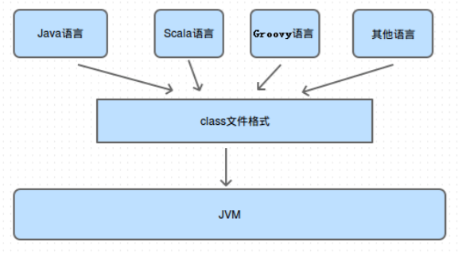
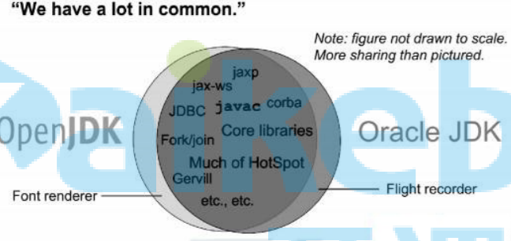

# 1018-JVM基础、JIT

## JVM通识

### 程序执行方式有哪些

+ 静态编译执行
  + 直接将代码编译为机器码再执行
  + C语言
+ 动态解释执行
  + 将代码加载到内存中，看一行，解释一行，将这行代码编译成机器码；每次看这行代码，都需要重新解释
  + python
+ 动态编译执行
  + 当一块代码，被动态解释执行的次数太多的时候，会在内存中将这一块代码编译成机器码保存起来，以后在执行这块代码时直接使用机器码

> jvm采用的是`动态编译`+`动态解释`的方式
>
> + 动态编译就是`JIT`（java即时编译器）
> + 动态解释就是`interpreter`（java解释器）

### java和jvm关系

+ jvm只认`class`格式的字节码

+ 不是只有java可以编译为`class`格式的字节码

   

### jdk、jre、jvm关系

 

### OracleJDK和OpenJDK

#### 查看JDK版本

+ OracleJDK版本信息

  ```
  [root@localhost ~]# java -version
  java version "1.8.0_162"
  Java(TM) SE Runtime Environment (build 1.8.0_162-b12)
  Java HotSpot(TM) 64-Bit Server VM (build 25.162-b12， mixed mode)
  ```

+ OpenJDK版本信息

  ```
  [root@localhost ~]# java -version
  openjdk version "1.8.0_144"
  OpenJDK Runtime Environment (build 1.8.0_144-b01)
  OpenJDK 64-Bit Server VM (build 25.144-b01， mixed mode)
  ```

#### 区别

 

两者几乎没有区别，那点区别我们也用不到，可以忽略

### jvm与hotspot

+ jvm是一种标准
+ hotspot是jvm标准的具体实现

### jvm运行模式

+ 分为client模式和server模式

  我们用的一般都是server模式，在嵌入式系统中（手机）上，可能用的是client模式

  client模式只能在32为机器上运行

+ server模式是重量级虚拟机，加入了很多优化项，所以server模式启动更慢，但是运行时server模式运行效率更高

## JVM架构图

 

## JVM程序执行流程

### 执行流程

+ java源代码到机器码流程

   

+ 编译器与解释器协调流程

   

  当一块代码执行次数很多时，就可能会变成热点代码，被一次性编译成机器码，以后每次执行时直接执行机器码

### 热点代码

+ 当出现以下两种情况时，会被标记为热点代码

  + 被多次调用的方法。
  + 被多次执行的循环体。

  两种情况，编译器都是以整个方法作为编译对象

+ 这里的多次，默认是10000次

  我们可以通过修改这个阈值，让jvm尽快的使用动态编译执行，来提高执行效率

  具体是通过虚拟机参数：`-XX： CompileThreshold`设置。

#### 热点检测方式

+ 基于采样的热点探测

  周期性地检查各个线程的栈顶，如果发现某些方法经常出现在栈顶，那这 个方法就是“热点方法”

  + 缺点：由于`周期性`，容易因为受到线程阻塞或别 的外界因素的影响而扰乱热点探测。
  + JVM不使用这种方式

+ 基于计数器的热点探测（HOTSPOT采用的方式）

  为每个方法（甚至是代码块）建立计数器，统计方法的执行次数，如果执 行次数超过一定的阀值，就认为它是“热点方法”。

  计数器一共有两个：

  + 方法调用计数器

    用于统计方法被调用的次数

  + 回边计数器

    + 统计一个方法中循环体代码执行的次数
    + 在字节码中遇到控制流向后跳转的指令称 为“回边”

#### 半衰期

当方法在一段时间内被调用次数还没有超过阈值，则会将计数器直接修改为阈值的一半，防止一段代码靠时间耗成热点代码

## JIT使用

### JVM为什么编译器与解释器并存

+ 解释器执行代码启动更快，编译器运行时效率更高
+ 编译执行占用内存空间更大，解释器能节省内存空间，适用于嵌入式系统

jvm并存两种执行方式，可以针对不同的代码在时间和空间的权衡上找到最优方案

### 为什么实现两种即时编译器

jvm中有2种即时编译器：

+ client complier

  编译速度更快，专注于局部优化，放弃了全局优化

+ server complier

  编译质量更高，进行了充分优化

可以根据不同场景做出更合适的选择

## JIT进行了哪些优化

### 公共子表达式消除

```java
int d = (c*b)*12+a+(a+b*c);
```

对于上面代码，JIT会检测到`c*b`和`b*c`是同一个表达式，会将`b*c`替换成公共表达式`E`进行替换

```
int d = E*12+a+(a+E);
```

只要`b`和`c`的值没有发生改变，都是使用上次`E`的计算结果进行替换，这个子表达式计算一次即可，不用每次都计算了

对于上面的结果，还可以使用`代数化简`进行优化

```java
int d = E*13+a*2;
```

### 方法内联

JIT进行即时编译时，如果A方法调用了B方法，有时会直接使用B方法内的代码替换到A方法中，减少方法个数，从而减少方法入栈出栈引发的额外开销

```java
private int add4(int x1， int x2， int x3， int x4) {
	return add2(x1， x2) + add2(x3， x4);
}
private int add2(int x1， int x2) {
	return x1 + x2;
}
```

是运行一段时间后JVM会把add2方法去掉，并把代码翻译成

```java
private int add4(int x1， int x2， int x3， int x4) {
	return x1 + x2 + x3 + x4;
}
```

### 逃逸分析

+ 当一个对象在1个作用域中被创建之后，被另外一个作用域引用，称为`逃逸`

+ jvm中的作用域一般指的是方法，所以一般逃逸分析指的是`方法逃逸`

+ 逃逸分析包括

  + 全局变量赋值逃逸
  + 方法返回值逃逸
  + 实例引用发生逃逸
  + 线程逃逸:赋值给类变量或可以在其他线程中访问的实例变量

  ```java
  public class EscapeAnalysis {
  	//全局变量
  	public static Object object;
  	public void globalVariableEscape(){//全局变量赋值逃逸
  		object = new Object();
  	}
  	public Object methodEscape(){ //方法返回值逃逸
  		return new Object();
  	}
  	public void instancePassEscape(){ //实例引用发生逃逸
  		this.speak(this);
  	}
  	public void speak(EscapeAnalysis escapeAnalysis){
  		System.out.println("Escape Hello");
  	}
  }
  ```

+ jvm默认是开启逃逸分析的，如果需要关闭，可以通过设计`-XX:-DoEscapeAnalysis`进行关闭，一般不需要关闭

### 对象的栈上内存分配

当方法内创建1个对象，而这个对象没有发生逃逸时，jvm会尽量使用栈上内存分配，好处是在栈上创建的对象，方法执行结束后可以直接释放掉，而如果放在堆中进行内存分配，将需要进行垃圾回收，成本更高

### 标量替换

当1个对象没有方法逃逸是，JIT会把这个对 象拆解成若干个其中包含的若干个成员变量来代替。

```java
//有一个类A
public class A{
    public int a=1;
    public int b=2
}

//方法getAB使用类A里面的a，b
private void getAB(){
    A x = new A();
    A y = new A();
}

//JVM在编译的时候会直接编译成
private void getAB(){
    xa = 1;
    xb = 2;
    ya = 1;
    yb = 2;
}
```

### 同步锁消除

当一块加了同步锁的代码，经过逃逸分析后发现不会发生逃逸，则JIT编译时会自动取消同步锁