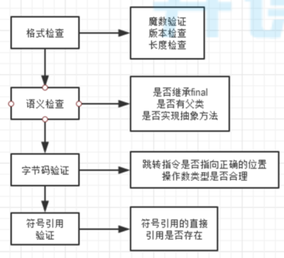

# 1019-class文件、类加载

## class文件

### 查看class文件插件

+ 字节码查看class文件
  + 安装插件`jclasslib Bytecode Viewer`
  + 查看文件之前，先`Rebuild Project`
  + 查看class文件汇总信息
    + 选中要查看的java文件，View --> Show Bytecode With Jclasslib
  + 查看class文件
    + 选中要查看的java文件，View --> Show Bytecode
+ 二进制查看class文件
  + 安装插件`BinEd`
  + 选择要查看的class文件，右键，open as binary

### class文件概述

+ class文件字节码结构示意图

   

+ 魔数

  + 固定4字节
  + 固定内容`0xCAFEBABE`，用来标识这是1个class文件

+ 版本号

  + 副版本号2字节；主版本号2字节
  + 5、6字节用来表示副版本号；7、8字节用来表示主版本号
  + 主版本号1.1用十进制的45表示，以后的每个新主版本都会在原先版本的基础上加1，1.8版本用52表示，16进制是0x34

+ 常量池计数器（constant_pool_count ）

  + 固定2字节
  + 常量池计数器值 = 常量池（constant_pool）中常量池项（cp_info）个数 + 1
  + 当常量池索引值大于0，且小于constant_pool_count 时有效，常量池索引值从1开始
  + 常量池索引值为0时（#0）用来表示不指向任何常量

+ 常量池数据区

  + 由（constant_pool_count  - 1）个常量池项（cp_info）组成
  + cp_info：参见[常量池项](#常量池项) 

+ 访问标志

  + 固定两字节

  + 描述

     

+ 类索引

  + 固定2字节
  + 当前类对应 CONSTANT_Class_info 的常量池索引值 - 1

+ 父类索引

  + 固定2字节
  + 父类对应 CONSTANT_Class_info 的常量池索引值 - 1

+ 接口计数器

  + 固定2字节
  + 当前类或接口的直接父接口数

+ 接口信息区

  + 接口计数器 * 2 个字节
  + 父接口对应 CONSTANT_Class_info 的常量池索引值 - 1，组成数组

+ 字段计数器

  + 固定2字节
  + 该类或接口声明的【类字段】或者【实例字段】数

+ 字段信息数据区

  字段表，fields[]数组中的每个成员都必须是一个fields_info结构的数据项，用于表示当前类或接口中某个字段的完整描述。 fields[]数组描述当前类或接口声明的所有字段，但不包括从父类或父接口继承的部分。

+ 方法计数器

  + 固定2字节
  + 当前类的方法数

+ 方法信息数据区

  + 方法表，methods[] 数组中的每个成员都必须是一个 method_info 结构的数据项，用于表示当前类或接口中某个方法的完整描述。
  + 如果某个method_info 结构的access_flags 项既没有设置 ACC_NATIVE 标志也没有设置ACC_ABSTRACT 标志，那么它所对应的方法体就应当可以被 Java 虚拟机直接从当前类加载，而不需要引用其它类。
  + method_info结构可以表示类和接口中定义的所有方法，包括【实例方法】、【类方法】、【实例初始化方法】和【类或接口初始化方法】。
  + methods[]数组只描述【当前类或接口中声明的方法】，【不包括从父类或父接口继承的方法

+ 属性计数器

  + 固定2字节
  + 当前 Class 文件attributes表的成员个数

+ 属性信息数据区

  + attributes 表的每个项的值必须是attribute_info结构。

### 常量池项

常量池项有很多种类型，具体类型由第1个字节`tag`（固定1个字节）的值决定

+ 结构

  > + CONSTANT_Utf8_info
  >
  >   + tag：1
  >
  >   + 含义：表示字符串常量，不对应java中任何数据类型，仅用于被其他cp_info引用
  >
  >   + 结构
  >
  >     ```json
  >     {
  >         tag				// 固定1字节；此时值为1
  >         length			// 固定1字节；表示字符长度
  >         byte[length]	// length个字节；字符串内容
  >     }
  >     ```
  >
  > + CONSTANT_Integer_info
  >
  >   + tag：3
  >
  >   + 含义：int类型常量
  >
  >   + 结构
  >
  >     ```json
  >     {
  >         tag				// 固定1字节；此时值为3
  >         byte[4]			// 固定4字节；int常量值
  >     }
  >     ```
  >
  > + CONSTANT_Float_info
  >
  >   + tag：4
  >
  >   + 含义：float类型常量
  >
  >   + 结构
  >
  >     ```json
  >     {
  >         tag				// 固定1字节；此时值为4
  >         byte[4]			// 固定4字节；float常量值
  >     }
  >     ```
  >
  > + CONSTANT_Long_info
  >
  >   + tag：5
  >
  >   + 含义：long类型常量
  >
  >   + 结构
  >
  >     ```json
  >     {
  >         tag				// 固定1字节；此时值为5
  >         byte[8]			// 固定8字节；long常量值
  >     }
  >     ```
  >
  > + CONSTANT_Double_info
  >
  >   + tag：6
  >
  >   + 含义：double类型常量
  >
  >   + 结构
  >
  >     ```json
  >     {
  >         tag				// 固定1字节；此时值为6
  >         byte[4]			// 固定8字节；double常量值
  >     }
  >     ```
  >
  > + CONSTANT_Class_info
  >
  >   + tag：7
  >
  >   + 含义：当前或调用的类或接口
  >
  >     这里的调用到是真的用到，如果一个类声明了一个属性，而这个属性后续没有被用到，则这个声明删掉都行，那这个类的全限定名就不会放入常量池
  >
  >   + 结构
  >
  >     ```json
  >     {
  >         tag				// 固定1字节；此时值为7
  >         byte[2]			// 固定2字节；当前或调用的类或接口的完全限定名对应 CONSTANT_Utf8_info 的常量池索引值 - 1
  >     }
  >     ```
  >
  >   + 例
  >
  >      
  >
  > + CONSTANT_String_info
  >
  >   + tag：8
  >
  >   + 含义：String类型常量
  >
  >   + 结构
  >
  >     ```json
  >     {
  >         tag				// 固定1字节；此时值为8
  >         byte[2]			// 固定2字节；String类型字符串的值对应 CONSTANT_Utf8_info 的常量池索引值 - 1
  >     }
  >     ```
  >
  > + CONSTANT_Fieldref_info
  >
  >   + tag：9
  >
  >   + 含义：类中字段
  >
  >   + 结构
  >
  >     ```json
  >     {
  >         tag				// 固定1字节；此时值为9
  >         byte[2]			// 固定2字节；所属类对应 CONSTANT_Class_info 的常量池索引值 - 1
  >     	byte[2] 		// 固定2字节；字段对应 CONSTANT_NameAndType_info 的常量池索引值 - 1
  >     }
  >     ```
  >
  > + CONSTANT_Methodref_info
  >
  >   + tag：10
  >
  >   + 含义：类中调用的方法
  >
  >   + 结构
  >
  >     ```json
  >     {
  >         tag				// 固定1字节；此时值为10
  >         byte[2]			// 固定2字节；所属类对应 CONSTANT_Class_info 的常量池索引值 - 1
  >     	byte[2] 		// 固定2字节；方法对应 CONSTANT_NameAndType_info 的常量池索引值 - 1
  >     }
  >     ```
  >
  > + CONSTANT_InterfaceMethodref_info
  >
  >   + tag：11
  >
  >   + 含义：类中通过接口调用的接口方法
  >
  >   + 结构
  >
  >     ```json
  >     {
  >         tag				// 固定1字节；此时值为11
  >         byte[2]			// 固定2字节；所属类对应 CONSTANT_Class_info 的常量池索引值 - 1
  >     	byte[2] 		// 固定2字节；方法对应 CONSTANT_NameAndType_info 的常量池索引值 - 1
  >     }
  >     ```
  >
  > + CONSTANT_NameAndType_info
  >
  >   + tag：12
  >
  >   + 含义：字段或方法的名称或类型
  >
  >     这里方法的参数+返回值可以看作这个方法的类型
  >
  >   + 结构
  >
  >     ```json
  >     {
  >         tag				// 固定1字节；此时值为12
  >         byte[2]			// 固定2字节；字段或方法名对应 CONSTANT_Utf8_info 的常量池索引值 - 1
  >     	byte[2] 		// 固定2字节；字段或方法的类型描述字符串对应 CONSTANT_Utf8_info 的常量池索引值 - 1
  >     }
  >     ```
  >
  > + CONSTANT_MethodHandler_info
  >
  >   + tag：15
  >   + 含义：方法句柄
  >
  > + CONSTANT_MethodType_info
  >
  >   + tag：16
  >   + 含义：方法类型
  >
  > + CONSTANT_InvokeDynamic_info
  >
  >   + tag：18
  >   + 含义：用于表示invokeddynamic指令所使用到的引导方法（Bootstrap Method）、引导方法使用到动态调用名称（Dynamic Invocation Name）、参数和请求返回类型、以及可以选择性的附加被称为静态参数（static Arguments）的常量序列

+ cp_info分类

  + 字面量型结构体
    + 内容是字面量
    + CONSTANT_Utf8_info、CONSTANT_Integer_info、CONSTANT_Float_info、CONSTANT_Long_info、CONSTANT_Double_info
  + 引用型结构体
    + 内容是索引值
    + 其他都是

+ 哪些字面量会进入常量池

  + double、float、long一定进
  + final类型的其他5种基本类型
  + 双引号引起的字符串值

### 引用

+ 符号引用

  当要引用的内容还没有加载到内存时，是没有这个内容的地址的，先用符号先占着

+ 直接引用

  + 这个内容加载到内存之后，已经有了这个内容的实际地址，则直接指向这个内容
  + 可以是如下形式：
    + 直接指向目标指针
    + 相对偏移量（如数组下标）
    + 一个能间接定位到目标的句柄

+ 引用替换时机

  符号引用替换为直接引用的操作发生在类加载过程(加载 -> 连接(验证、准备、解析) -> 初始化)中的解析阶段，会将符号引用转换(替换)为对应的直接引用，放入运行时常量池中。

### 特殊字符串字面量

+ 类的全限定名

  class文件中，类的全限定名中的`.`全被替换为`/`

+ 描述符

   

### 特殊方法名称

+ `<init>`

  构造方法名称

+ `<clinit>`

  静态代码块方法名称

## 类加载子系统

### 类加载过程

 

#### 加载

+ class文件加载可以来源于多种途径，如：文件、网络、jar包、动态生成
+ 加载靠类加载器实现（ClassLoader）
+ 类加载不是启动时全加载的，是需要用到这个类时在进行加载
+ 类加载之后变成Class对象保存带方法区
+ 

#### 验证

+ 验证class文件是否合法

+ 验证流程

   

#### 准备

+ 为类的静态变量分配内存
+ 把静态变量初始化为0，false，null等

#### 解析

+ 符号引用替换为直接引用

#### 初始化

+ 调用静态代码块方法`<clinit>`，jvm执行该方法时会自动上锁
+ 为`static`变量初始化赋值

### 类加载时机

+ 执行字节码指令`new`、`getstatic`、`putstatic`、`invokestatic`时，如果类没有初始化，先进行初始化

  对应代码是`new`对象，读写static（非final）变量，调用static方法

+ 使用反射调用类

+ 初始化1个类时发现父类还没有初始化，先初始化父类

+ 虚拟机启动时指定了主类，加载主类

### 类加载器

 

+ jvm中主要有4中类加载器，每种类加载器负责加载不同目录下的jar包
+ custom classloader是自定义加载器，如有需要，自己实现的，其他三个是自带的

### 双亲委派

#### 什么叫双亲委派

+ 如上图，一个类要被加载时，先从下至上检查是否已加载，再自上而下尝试加载
+ 因为越上层类加载器的权重越高，为了保证1个类加载时加载的是权限最高的类加载器加载的类，下层类加载器发现这个类没有加载时，不能直接加载，需要先问问上层类加载器要不要加载这个类

#### 好处

+ 避免重复加载
+ 避免自己写了1个`java.lang.String`类时，就会由下层类加载器加载成自己的了，代码就出错了

#### jvm如何判断两个类相同

+ 判断类的全路径
+ 判断是否由同一个类加载器加载

#### 为什么需要自定义类加载器

+ 默认类加载器只能加载指定目录的类，如果需要从其他位置加载，需要自定义

### SPI机制

+ 编写1个接口

  ```java
  package spi;
  public interface SpiTestInterface {
      void test();
  }
  ```

+ 编写1个实现类

  ```java
  package spi;
  public class SpiTestClass implements SpiTestInterface {
      @Override
      public void test() {
          System.out.println("hello");
      }
  }
  ```

+ `classpath:/META-INF/services`下写1个以`接口全路径`为名的文件，内容为实现类的全路径

  `classpath:/META-INF/services/spi.SpiTestInterface`:

  ```
  spi.SpiTestClass
  ```

+ 使用`ServiceLoader`加载

  ```java
  @Test
  public void run(){
      ServiceLoader<SpiTestInterface> spiTestInterfaces = ServiceLoader.load(SpiTestInterface.class);
      Optional<SpiTestInterface> first = StreamSupport.stream(spiTestInterfaces.spliterator(), false).findFirst();
      first.ifPresent(SpiTestInterface::test);
  }
  ```

  