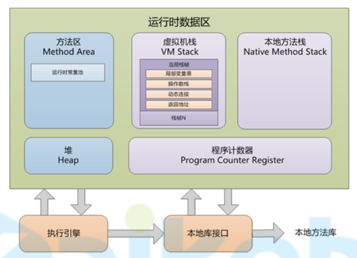

# 1021-运行时数据区

## JVM运行时数据区规范

 

### 结构

+ 方法区

  方法区中主要是class文件中加载的内容

+ 堆

  + 对象
  + 数组

+ 栈

  每个线程在栈中分配一块空间，线程结束，内存释放

+ 程序计数器

  用来记录每个线程的PC指针，知道程序执行到哪了

+ 本地方法栈

  本地方法指的是系统内核提供的方法

  当JVM调用内核方法时，会在这里分配一块空间作为栈空间

### 概述

+ 方法区、堆，是线程共享区域；栈、程序计数器、本地方法栈，是线程独享区域，每个线程对应一部分内存
+ 垃圾回收主要针对`堆`，方法区也存在垃圾回收，但是效率不高
+ 上述5块区域，只有`程序计数器`不存在内存溢出，其他都存在

## HotSpot的JVM实现

 

+ hotspot中，方法区就是`永久代`

+ 运行时数据区

  + 在1.7以前，等于`JVM内存`

    方法区、堆、栈、程序计数器、本地方法栈，都在`JVM内存`中

  + 在1.8以后，等于`JVM内存` + `元空间`

    堆、栈、程序计数器、本地方法栈，在`JVM内存`中；方法区在`元空间`

+ 运行时常量池

  jvm内存中，每个类对用1个jvm常量池

+ 元空间

  1.8以后，方法区

+ 版本演化

  + 1.7版本准备去永久代，将静态变量、运行时常量池，从永久代移入堆中
  + 1.8版本完成去永久代，将原来的永久代从JVM内存中移出，放入机器内存中，更名为`元空间`

## JVM参数

### 分类

+ 标准参数

  几乎不可能变化的；

  如：`-help`、`-version`

  `java -help`检索出来的都是标准参数

+ 非标准参数

  可能会发生变更的

  + `-X`开头的

    不用于调优和debug的参数

  + `-XX`开头的

    主要是用于调优和debug的参数

### `-X`参数

#### 详解

+ `-Xint`：仅解释器执行
+ `-Xmixed`：编译器解释器混合执行（默认）

+ `-Xloggc:<file>`：打印gc日志
+ `-Xms<size>`：指定堆空间初始大小；一般设置为与`-Xmx`一致
+ `-Xmx<size>`：指定对空间最大大小；一般设置为与`-Xms`一致
+ `-Xxx<size>`：每个线程的独享内存空间大小（包括栈、程序计数器、本地方法栈），默认1M

### `-XX`参数

#### 概述

+ boolean型

  使用`+-`表示启用或禁用该参数

  如：`-XX:+DisableExplicitGC`

+ 非boolean型

  使用表达式

  如：`-XX:NewRatio=1`

## 打印对象实际内存地址

```java
public class StringTest {

    static final Unsafe UNSAFE = getUnsafe();
    static final boolean IS64BIT = true;

    public static void main(String... args) {
        String a = "he";
        a = a + "llo";
        printAddresses("ascending", a);
        printAddresses("ascending", a.charAt(0));
        printAddresses("ascending", a.charAt(1));
        printAddresses("ascending", a.intern());
    }

    public static void printAddresses(String label, Object... objects) {
        System.out.print(label + ": 0x");
        long last = 0;
        int offset = UNSAFE.arrayBaseOffset(objects.getClass());
        int scale = UNSAFE.arrayIndexScale(objects.getClass());
        switch (scale) {
            case 4:
                long factor = IS64BIT ? 8 : 1;
                final long i1 = (UNSAFE.getInt(objects, offset) & 0xFFFFFFFFL) * factor;
                System.out.print(Long.toHexString(i1));
                last = i1;
                for (int i = 1; i < objects.length; i++) {
                    final long i2 = (UNSAFE.getInt(objects, offset + i * 4) & 0xFFFFFFFFL) * factor;
                    if (i2 > last)
                        System.out.print(", +" + Long.toHexString(i2 - last));
                    else
                        System.out.print(", -" + Long.toHexString( last - i2));
                    last = i2;
                }
                break;
            case 8:
                throw new AssertionError("Not supported");
        }
        System.out.println();
    }

    private static Unsafe getUnsafe() {
        try {
            Field theUnsafe = Unsafe.class.getDeclaredField("theUnsafe");
            theUnsafe.setAccessible(true);
            return (Unsafe) theUnsafe.get(null);
        } catch (Exception e) {
            throw new AssertionError(e);
        }
    }
}
```

## 运行时常量池和字符串常量池

### 运行时常量池和字符串常量池区别

  

+ 静态常量池（class常量池）

  存在于class文件中，

  每个类都有1个静态常量池

+ 运行时常量池

  class文件加载到内存之后，之前静态常量池在内存中加载成了运行时常量池

  每个Class对象有1个运行时常量池

+ 字符串常量池

  全局只有1个字符串常量池

  字符串常量池就是`stringtable`

  字符串常量池里存得是`CONSTANT_String_info` 和`CONSTANT_Utf8_info`，`CONSTANT_String_info` 指向`CONSTANT_Utf8_info`

### 存储位置

字符串常量池和运行时常量池存储位置始终是相同的

1.6以前，存在方法区；1.7以后，存在堆中

### 字符串

字符串`String s = "hello"`在内存中体现

 

### 字符串常量池

##### stringtable

+ 数据结构与`hashtable`完全一样，用来加快查找效率
+ `key`是字符串的hash值，`value`是字符串常量（String对象）的引用地址

+ 1.6以前是哈希桶长度固定`1009`，1.7以后可以通过`-XX:StringTableSize=<size>`进行设置
+ 常量存入stringtable过程
  + 类加载时字符串常量已经加载进运行时常量池
  + **第一次使用该常量时**，先校验stringtable中是否存在该字符串对应的hashcode
  + 有直接返回stringtable中该hashcode指向的对象
  + 没有则将该对象字符串的hashcode作为key，字符串常量地址作为value存入
  + 返回该对象

##### String.intern()

+ 作用：将字符串动态存储为常量
+ 过程
  + 校验stringtable中是否存在该字符串对应的hashcode
  + 有直接返回stringtable中该hashcode指向的对象
  + 没有则将该对象字符串的hashcode作为key，对象地址作为value存入
  + 返回该对象

##### 注意

+ 编译器能确定的字符串都会在编译期作为字面量存储在常量池

  ```java
  private static final String a = "he";
  private static final String b = "llo";
  private static String d = a + b;
  
  // 上面代码编译后对应class文件的<clint>方法为
  0 ldc #3 <hello>
  2 putstatic #4 <StringTest.d>
  5 return
  // 可见, hello这个字面量已经存在于常量池
  ```

 