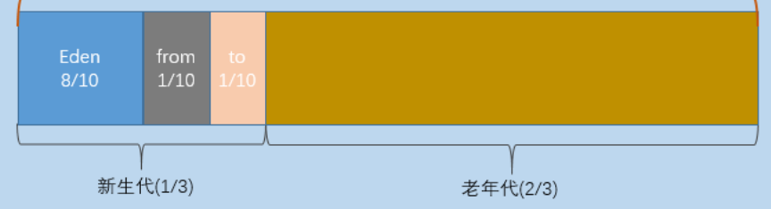
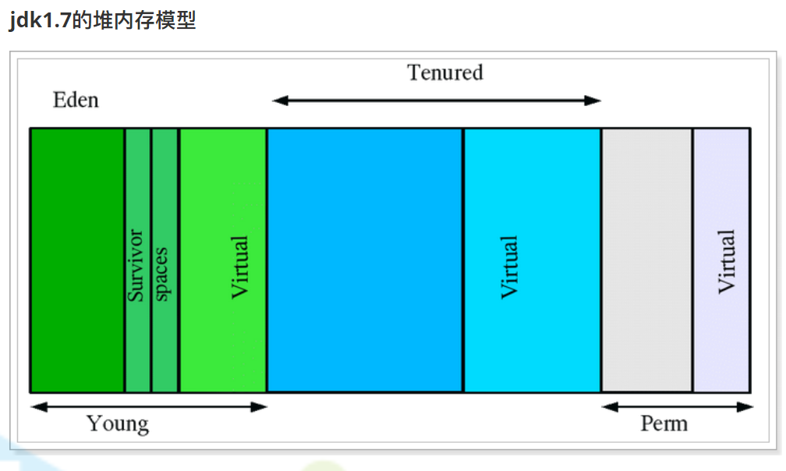
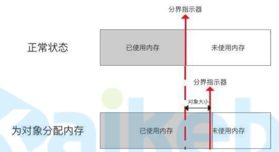
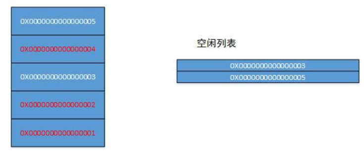
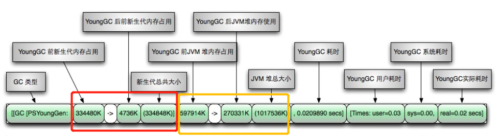
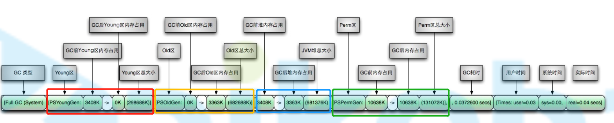
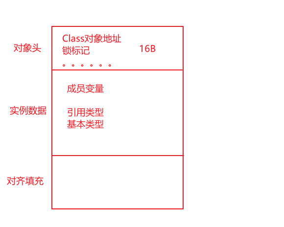
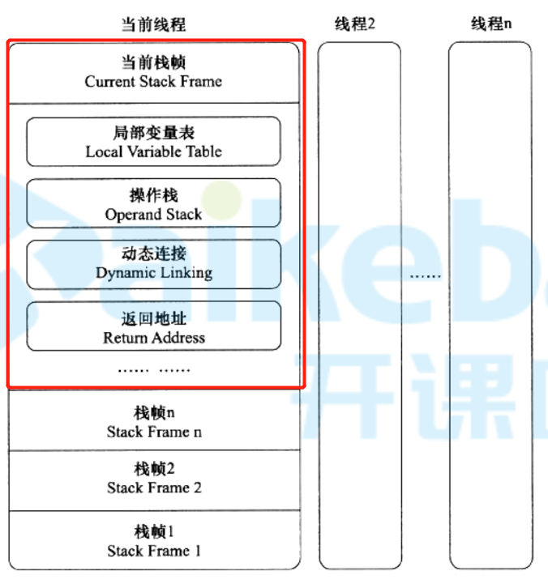

# java堆

## 堆中存储什么数据

+ 1.6：对象、数组
+ 1.7：对象、数组、字符串常量池、静态变量

## 堆内存划分

 

+ 堆分为新生代和老年代，默认比例为1：2

+ 新生代分为`Eden`区、`s0`区、`s1`区，三者默认比例为8：1：1

+ 新创建的对象会优先放入新生代

  90%以上的对象存在于新生代，并且很快被回收掉

+ 老年代对象

  + 新生代存活下来的对象
  + 通过内存担保机制直接进入老年代的对象
  + 超过设定的阈值（具体大小，不是比例）的大对象，直接放入老年代

## 内存分配参数

+ 设置堆空间总大小

  + `-Xms`：堆空间初始值；默认当前机器最大内存的 1/64
  + `-Xmn`：堆空间最大值；默认当前机器最大内存的 1/4
  + 一般将初始值与最大值设置为相同，避免对虚拟空间再次进行内存开辟带来的性能消耗
  + 一般设置为4G，太大了`STW`时间会过长

+ 设置年轻代大小：

  + `-XX:NewSize(-Xns)`：新生代初始值；
  + `-XX:MaxNewSize(-Xmn)`：新生代最大值
  + 老年代 = 堆空间 - 新生代

+ 设置`Eden`区占新生代比例

  + `-XX:SurvivorRatio=8`：`Eden`区与`Survivor`区比例，默认`8:1:1`

+ 设置永久代大小

  + `-XX:PermSize`：永久代初始值
  + `-XX:MaxPermSize`：永久代最大值

+ 设置元空间大小

  + `-XX:MetaspaceSize`：元空间初始值，默认`20.75MB`
  + `-XX:MaxMetaspaceSize`：元空间最大值，默认无上限

+ 设置大对象阈值

  `-XX:PretenureSizeThreshold`

  + 超过这个值的对象直接在年老代分配内存
  + 默认0，表示无论如何都优先在`Eden`区分配内存
  + 一般不设置，容易出问题

## 虚拟空间

 

+ 当某块内存初始值与最大值不相等时，这个差值会以虚拟空间的形式存在，自己不用，别人也不能用，当自己想用时需要重新开辟内存空间（容量震荡）
+ 一般将初始值与最大值设为相同，避免容量震荡

## 对象内存分配方式

### 指针碰撞

+ 用在年轻代的垃圾回收器中

+ 已使用内存与未使用内存之间有分界线，需要分配内存时紧邻已使用内存进行分配，就叫指针碰撞

   

### 空闲列表

+ 用在老年代垃圾回收器中

+ 整个内存中的未使用内存是碎片化的，需要空闲列表进行维护

   

## 对象内存分配安全问题

当多个线程同时在同一块地址申请内存时，存在线程安全问题

有如下两种解决方案

### CAS

+ 全称：`Compare And Swap`（比较替换）
+ 内存空间分配本身有一个原子性的特点，当一块内存空间已经被使用时，其他线程再来使用会失败
+ `CAS`使用乐观锁的方式，每次直接去分配，失败了再重试

### TLAB

+ 全称：`Thread Local Allocation Buffer`（本地线程分配缓存）
+ 每个线程创建时，先使用`CAS`方式，为这个线程申请一块内存空间，这个线程创建的对象在这块空间中进行分配；每个线程的这块空间不够时，再次利用`CAS`去申请
+ 这样的方式会引发申请的内存碎片化的问题，但是这个碎片化在可控范围内，允许存在
+ `TLAB`存在的目的是在一定程度上减少`CAS`中失败的概率

## GC日志

### 启用

+ `-verbose:gc`

  + 打印简单GC日志
  + 同`-XX:+PrintGC`，不过`-XX:+PrintGC`即将被废弃
  + 一般不看简单日志

+ `-XX:+PrintGCDetails`

  打印详细GC日志

+ `-Xloggc:/opt/logs/gc.log`

  GC日志输出到文件

+ `-XX:+PrintGCTimeStamps`

  日志每行前面添加`jvm`启动至今的时间戳,单位秒

  ```
  0.185: [GC 66048K->53077K(251392K)，0.0977580 secs]
  0.323: [GC 119125K->114661K(317440K)，0.1448850 secs]
  0.603: [GC 246757K->243133K(375296K)，0.2860800 secs]
  ```

+ `-XX:+PrintGCDateStamps`

  日志每行前面添加日期时间戳

  ```
  2014-01-03T12:08:38.102-0100: [GC 66048K->53077K(251392K)，0.0959470 secs]
  2014-01-03T12:08:38.239-0100: [GC 119125K->114661K(317440K)，0.1421720secs]
  2014-01-03T12:08:38.513-0100: [GC 246757K->243133K(375296K)，0.2761000secs]
  ```

### 查看

#### GC日志

年轻代GC时可以看见该日志

 

+ GC类型：可以看出垃圾回收器，和GC类型

#### Full gc 日志

发生full gc时可以看见该日志

 

## 内存担保机制

当1个对象进入1个区时，如果大于等于该区总大小，直接进入下一个区

ps：因为`survivor`区不可能大于`eden`区，所以`eden`区放不下的，`survivor`区也一定放不下，所以`eden`区放不下的也会直接进入老年代

## 对象内存布局

 

# java虚拟机栈

 

## 栈帧

+ `每次调用1个方法`对应1个栈帧
+ 栈帧内包括：局部变量表、操作栈、动态链接、返回地址

## 局部变量表

用来存储局部变量的

```java
String a = "hello"
// a就是个局部变量，存储在局部变量表
```

## 操作栈

用来进行数值运算的

加减乘除，移位，与或非等运算，都是将数值先加载到操作栈在进行运算的


