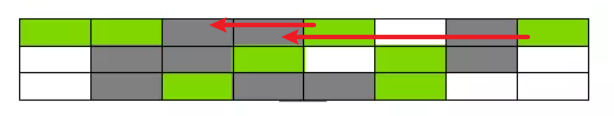

# java堆

## 堆中存储什么数据

+ 1.6：对象、数组
+ 1.7：对象、数组、字符串常量池、静态变量

## 堆内存划分

 

+ 堆分为新生代和老年代，默认比例为1：2

+ 新生代分为`Eden`区、`s0`区、`s1`区，三者默认比例为8：1：1

+ 新创建的对象会优先放入新生代

  90%以上的对象存在于新生代，并且很快被回收掉

+ 老年代对象

  + 新生代存活下来的对象
  + 通过内存担保机制直接进入老年代的对象
  + 超过设定的阈值（具体大小，不是比例）的大对象，直接放入老年代

## 内存分配参数

+ 设置堆空间总大小

  + `-Xms`：堆空间初始值；默认当前机器最大内存的 1/64
  + `-Xmn`：堆空间最大值；默认当前机器最大内存的 1/4
  + 一般将初始值与最大值设置为相同，避免对虚拟空间再次进行内存开辟带来的性能消耗
  + 一般设置为4G，太大了`STW`时间会过长

+ 设置年轻代大小：

  + `-XX:NewSize(-Xns)`：新生代初始值；
  + `-XX:MaxNewSize(-Xmn)`：新生代最大值
  + 老年代 = 堆空间 - 新生代

+ 设置`Eden`区占新生代比例

  + `-XX:SurvivorRatio=8`：`Eden`区与`Survivor`区比例，默认`8:1:1`

+ 设置永久代大小

  + `-XX:PermSize`：永久代初始值
  + `-XX:MaxPermSize`：永久代最大值

+ 设置元空间大小

  + `-XX:MetaspaceSize`：元空间初始值，默认`20.75MB`
  + `-XX:MaxMetaspaceSize`：元空间最大值，默认无上限

+ 设置大对象阈值

  `-XX:PretenureSizeThreshold`

  + 超过这个值的对象直接在年老代分配内存
  + 默认0，表示无论如何都优先在`Eden`区分配内存
  + 一般不设置，容易出问题

## 虚拟空间

 

+ 当某块内存初始值与最大值不相等时，这个差值会以虚拟空间的形式存在，自己不用，别人也不能用，当自己想用时需要重新开辟内存空间（容量震荡）
+ 一般将初始值与最大值设为相同，避免容量震荡

## 对象内存分配方式

### 指针碰撞

+ 用在年轻代的垃圾回收器中

+ 已使用内存与未使用内存之间有分界线，需要分配内存时紧邻已使用内存进行分配，就叫指针碰撞

   

### 空闲列表

+ 用在老年代垃圾回收器中

+ 整个内存中的未使用内存是碎片化的，需要空闲列表进行维护

   

## 对象内存分配安全问题

当多个线程同时在同一块地址申请内存时，存在线程安全问题

有如下两种解决方案

### CAS

+ 全称：`Compare And Swap`（比较替换）
+ 内存空间分配本身有一个原子性的特点，当一块内存空间已经被使用时，其他线程再来使用会失败
+ `CAS`使用乐观锁的方式，每次直接去分配，失败了再重试

### TLAB

+ 全称：`Thread Local Allocation Buffer`（本地线程分配缓存）
+ 每个线程创建时，先使用`CAS`方式，为这个线程申请一块内存空间，这个线程创建的对象在这块空间中进行分配；每个线程的这块空间不够时，再次利用`CAS`去申请
+ 这样的方式会引发申请的内存碎片化的问题，但是这个碎片化在可控范围内，允许存在
+ `TLAB`存在的目的是在一定程度上减少`CAS`中失败的概率

## GC日志

### 启用

+ `-verbose:gc`

  + 打印简单GC日志
  + 同`-XX:+PrintGC`，不过`-XX:+PrintGC`即将被废弃
  + 一般不看简单日志

+ `-XX:+PrintGCDetails`

  打印详细GC日志

+ `-Xloggc:/opt/logs/gc.log`

  GC日志输出到文件

+ `-XX:+PrintGCTimeStamps`

  日志每行前面添加`jvm`启动至今的时间戳,单位秒

  ```
  0.185: [GC 66048K->53077K(251392K)，0.0977580 secs]
  0.323: [GC 119125K->114661K(317440K)，0.1448850 secs]
  0.603: [GC 246757K->243133K(375296K)，0.2860800 secs]
  ```

+ `-XX:+PrintGCDateStamps`

  日志每行前面添加日期时间戳

  ```
  2014-01-03T12:08:38.102-0100: [GC 66048K->53077K(251392K)，0.0959470 secs]
  2014-01-03T12:08:38.239-0100: [GC 119125K->114661K(317440K)，0.1421720secs]
  2014-01-03T12:08:38.513-0100: [GC 246757K->243133K(375296K)，0.2761000secs]
  ```

### 查看

#### GC日志

年轻代GC时可以看见该日志

 

+ GC类型：可以看出垃圾回收器，和GC类型

#### Full gc 日志

发生full gc时可以看见该日志

 

## 内存担保机制

当1个对象进入1个区时，如果大小大于等于该区总大小的一半时（可配置），直接进入老年代

## 对象内存布局

 

# java虚拟机栈

 

## 栈帧

+ `每次调用1个方法`对应1个栈帧
+ 栈帧内包括：局部变量表、操作栈、动态链接、返回地址

## 局部变量表

用来存储局部变量的

```java
String a = "hello"
// a就是个局部变量，存储在局部变量表
```

## 操作栈

用来进行数值运算的

加减乘除，移位，与或非等运算，都是将数值先加载到操作栈在进行运算的

# 垃圾回收

## 什么是垃圾

无任何引用的对象被称为垃圾

## 什么时间回收

+ 空闲时间不定时回收
+ 某区空间不够时回收

## 引用

> 以下引用由上至下越来越弱

1. 强引用

   ```java
   Object o = new Object()
   ```

   只要引用还在，就不会被回收

2. 软引用

   + 可能还有用，但并非必须的对象
   + 内存不够时回收

3. 弱引用

   + 非须对象
   + 垃圾回收发生时，无论内存够不够，都被回收

4. 虚引用

   + 唯一用处就是被回收时收到1个系统通知

## 垃圾标记算法

### 引用计数

+ 原理

  每个对象都有1个引用计数器，用来表示自己被多少个变量引用了，当计数为0时就是垃圾

+ 优点：

  简单高效

+ 缺点

  无法解决循环引用问题

  两个垃圾互相引用，计数永远达不到0

+ 已经过时了

### 根可达

#### GC根对象

垃圾回收器将某些特殊的对象定义为GC根对象，包括：

+ 虚拟机栈中引用的对象（栈帧中的本地变量表）
+ 方法区中的常量引用的对象
+ 方法区中的类静态属性引用的对象
+ 本地方法栈中JNI（Native方法）的引用对象
+ 活跃线程

#### 标记存活对象

+ 标记开始前，先暂停线程，称为`STW(Stop The World)`
+ 遍历`GC根对象`，执行如下流程
  + 是否在`GC根对象`的引用链上
    + 是：标记为存活对象
    + 否：对象是否重写了`finalize()`方法
      + 是：`finalize()`方法是否被执行过
        + 是：标记为垃圾
        + 否：放入`F-Queue`队列
      + 否：标记为垃圾
+ 遍历`F-Queue`执行`finalize()`方法，执行后是否在`GC根对象`的引用链上
  + 是：标记为存活对象
  + 否：标记为垃圾

#### finalize()

+ 可以看作对象的`析构方法`，可以进行重写
+ 该方法只会被一条由虚拟机自动建立的、低优先级的`Finalizer`线程执行1次，下次发现不在`GC根对象`的引用链上时，一定会被回收

## 垃圾回收算法

### 标记清除

+ 使用`根可达`算法对垃圾进行标记，然后对垃圾对象占用的内存空间进行回收
+ 优点：不需要移动存活对象，存活对象较多时效率较高
+ 缺点：
  + 内存空间碎片化，需要使用的内存大于碎片内存时，这块内存就无法被使用
  + 需要额外的`空闲列表`对空闲空间进行管理，降低效率

### 标记整理

+ 过程

   

  + 标记：使用`根可达`算法对垃圾进行标记
  + 整理：让所有的对象都向一端移动，然后直接清理掉端边界以外的内存

+ 优点：解决碎片化问题

+ 缺点：`STW`时间较长，需要拷贝对象并更新引用地址

### 复制算法

+ 将内存一分为2，分别称为`对象面`和`空闲面`

+ 当需要垃圾回收时，将`对象面`的存活对象统一复制到`空闲面`，清空`对象面`，将原来的`空闲面`作为新的`对象面`，原来的`对象面`作为新的`空闲面`

+ 适用性

  + 因为每次垃圾回收需要对所有存活对象进行拷贝，所以适用于`新生代`这种存活周期较短的空间

  + 老年代中对象存活周期较长，使用复制算法或导致同一个对象翻来覆去的拷贝，降低性能
  + 新生代用的就是复制算法，`Eden区`内存满了回收时，将对象拷贝到`s0`区，清空`Eden区`

+ 优点

  + 标记复制可同时进行
  + 避免碎片化

+ 缺点

  + 可使用内存空间缩小一半

### 适应算法

监控当前堆的使用情况，并将选择适当算法的垃圾收集


> 其他内容没整理完，参见[垃圾回收机制](https://www.jianshu.com/p/5261a62e4d29) 
>
> 问题：
>
> + full gc时会将对象放入元空间吗
> + 直接内存
> + jvm参数整理
> + gc流程图
>   + https://blog.csdn.net/weixin_38106322/article/details/108943731
> + 各种gc定义
> + java命令工具
>   + jps
>   + stat
>   + jinfo
>   + jmap
>   + jhat
>   + jstack
>   + jconsole
>   + hprof


