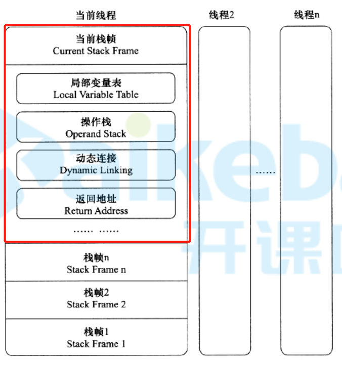
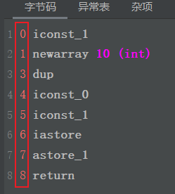
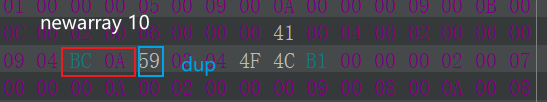

# 程序计数器

+ 1个线程1个PC寄存器
+ 用于标记代码执行到第几行了

# 虚拟机栈

  

+ 每个线程有1个独立的栈
+ 每个线程的栈由多个栈帧组成，每执行1个方法就压入1个栈帧

## 栈帧

+ `每次调用1个方法`对应1个栈帧
+ 栈帧内包括：局部变量表、操作栈、动态链接、返回地址

## 局部变量表

+ 可以看成1个带下标的数组，每个元素是1个变量槽，每个变量槽占4字节

+ 用于存储局部变量的值
  + this（下标为0的槽）
  + 方法参数
  + 方法内定义的变量
  + 返回地址
  
+ 可以保存`boolean`、`byte`、`char`、`short`、`int`、`float`、`double`、`long`、`reference`、`returnAddress`类型变量的值
  + 变量不足4字节（1个槽）时，使用1个槽存储这个变量
  
    如：`boolean`、`byte`、`char`、`short`
  
  + 变量超过4字节（1个槽）时，使用多个槽存储这个变量
  
    如：`double`、`long`
  
+ 每个局部变量在编译时就已经确定了，他是这个方法的第几个变量，也就确定了这个变量对应的局部变量表中的下标，所以局部变量在编译之后，都转化为了对局部变量表中槽的操作

  + java代码

    ```java
    int a = 1;
    long b = 1;
    int c = 1;
    ```

  + 字节码

    ```java
    0 iconst_1
    1 istore_1
    2 lconst_1
    3 lstore_2
    4 iconst_1
    5 istore 4
    ```

+ 1个方法在编译时，就能确定局部变量表需要的最大槽数（`max_locals`），直接写进方法的`code`属性中了

## 操作栈

+ 作用

  用来进行数值运算的，相当于草稿纸

  加减乘除，移位，与或非等运算，都是将数值先加载到操作栈在进行运算的

+ 程序运行方式

  所有程序运行方式有2种：

  + 操作数栈
  + 寄存器

  jvm采用基于操作数栈的方式运行

+ 最大深度

  1个方法在编译时，就能确定操作数栈需要的最大深度（`max_stacks`），直接写进方法的`code`属性中了

## 动态连接

+ 将符号引用转换为直接引用
  + 符号引用：字节码中的`#12`
  + 直接引用：内存地址
+ 引用的转换一部分在类加载或第一次使用时已经完成（静态连接），还有一部分需要运行时转换（动态连接）

## 方法返回

+ 栈帧中需要保存调用自己的方法执行到第几行了（进入当前栈帧时PC寄存器的值），当方法返回时，才能找到上个方法执行到哪了

# 内存异常

### StackOverflowError

+ 发生在栈中
+ 栈中每个线程栈的大小由`-Xss`参数决定，一般为256K，当方法调用太深时（一般为递归调用），会导致这个线程的栈中有很多个栈帧，导致这个线程栈的内存不足，抛出异常

### OutOfMemoryError

+ 发生在堆中
+ 当堆中内存不够分配对象时抛出该异常

# 本地方法栈

+ 本地方法

  java调用的，由C++编写的方法（`native`方法），被称为本地方法

+ 本地方法栈就是给本地方法调用时使用的栈空间


# 字节码指令

## 概述

+ 1个字节码指定由1个操作码（Opcode）和0~1个操作数（Operands）组成
  + 操作码（Opcode）
    + 固定1个字节
    + 用于表示这是个什么指令
  + 操作数
    + 4*n个字节
    + 用于表示要操作的数值

+ 操作数

  因为操作数最小单位也是变量槽，而1个变量槽固定4字节，所以操作数中：

  + `long`、`double`占用8字节
  + 其余占用4字节
  
+ 字节码指令前的数字，代表这行字节码指令开始于代码区第几个字节

   

   

## 操作码

### 简化操作码

为了减少字节码代码的长度，将经常出现的一些`操作码+操作数`的组合直接用1个`操作码`表示，将这个字节码指令从`4*n+1`个字节减少至1个字节

如：`iload 1`简化为`iload_1`，`istore 2`简化为`istore_2`

### `load`系列

+ 【局部变量表】加载到【操作数栈】

  将【局部变量表】中第`n`个变量槽开始的`x`个变量槽中的数据加载到【操作数栈】

  `x`由操作码对应的变量类型确定

+ 关键字是`load`

+ 变量类型
  + `iload`：int
  + `lload`：long
  + `fload`：float
  + `dload`：double
  + `aload`：引用

+ 当操作数`n`为`0~3`时，使用`<t>load_<n>`简化

### `aload`系列

+ 【数组】加载到【操作数栈】

  【操作数栈】栈顶第1个元素作为数组下标，第2个元素组为数组地址，将数组中对应下标的元素的值加载到【操作数栈】栈顶

  java

  ```java
  int b = arr1[0];
  ```

  字节码指令

  ```java
  32 aload_1
  33 iconst_0
  34 iaload
  35 istore_3
  ```

+ 数组存储在堆中

+ 关键字是`<t>aload`

+ 变量类型

  + `iaload`：int
  + `laload`：long
  + `faload`：float
  + `daload`：double
  + `aaload`：引用
  + `baload`：boolean或byte
  + `caload`：char
  + `saload`：short

### `store`系列

+ 【操作数栈】存储到【局部变量表】

  将【操作数栈】栈顶数据存储到【局部变量表】第`n`个变量槽开始的`x`个变量槽中

  `x`由操作码对应的变量类型确定

+ 关键字是`store`

+ 变量类型

  + `istore`：int
  + `lstore`：long
  + `fstore`：float
  + `dstore`：double
  + `astore`：引用

+ 当操作数`n`为`0~3`时，使用`<t>store_<n>`简化

### `astore`系列

+ 【操作数栈】存储到【数组】

  【操作数栈】栈顶第1个元素作为数组元素值，第2个元素组为数组下标，第3个元素组为数组地址，将数组元素值存储到数组中

  java

  ```java
  int[] arr = {1};
  ```

  字节码指令

  ```java
  0 iconst_1
  1 newarray 10 (int)
  3 dup
  4 iconst_0
  5 iconst_1
  6 iastore
  7 astore_1
  ```

+ 数组存储在堆中

+ 关键字是`<t>astore`

+ 变量类型

  + `iastore`：int
  + `lastore`：long
  + `fastore`：float
  + `dastore`：double
  + `aastore`：引用
  + `bastore`：boolean或byte
  + `castore`：char
  + `sastore`：short

### 【常量】加载到【操作数栈】

#### `const`系列

+ 操作对象：固定数值
+ 分类
  + `aconst_null`：将`null`推送至栈顶
  + ` iconst_m1`：将int型`-1`推送至栈顶
  + `iconst_<n>`：将int型`n`推送至栈顶（`n`在0~5内）
  + `lconst_<n>`：将long型`n`推送至栈顶（`n`在0~1内）
  + `fconst_<n>`：将float型`n`推送至栈顶（`n`在0、1、2内）
  + `dconst_<n>`：将double型`n`推送至栈顶（`n`在0、1内）

#### `push`系列

> 需要1个常量值作为操作数

+ 操作对象：1~2字节int型数值）
+ 分类：
  + `bipush`：将单字节int型数值（-128~127）推送至栈顶
  + `sipush`：将双字节int型数值（-32768~32767）推送至栈顶

#### `ldc`系列

> 需要1个符号引用作为操作数
>
> `const`和`push`系列搞不定的常量一定都存储在常量池中

+ 操作对象：常量池中常量
+ 分类：
  + `ldc`：将常量池中单字节常量值推送至栈顶
  + `ldc_w`：将常量池中双字节常量值推送至栈顶
  + `ldc2_w`：将常量池中4字节常量值推送至栈顶

### `pop`系列

> + 对栈上数据进行操作
>
> + 2个字节 = 1个字

+ `pop`：将双字节栈顶数值弹出

+ `pop2`：将4字节栈顶数值弹出

+ `dup`：

  复制栈顶1个字，然后插入到栈顶原来的字之前

  执行指令之前，栈顶： `word1 xxxx`

  执行完指令之后： `word1 word1 xxxx`

+ `dup_x1`：

  复制栈顶1个字，然后插入到栈顶原来的字的前1个字之前

  执行指令之前，栈顶： `word1 word2 xxxx`

  执行完指令之后： `word1 word2 word1 xxxx`

+ `dup_x2`：

  复制栈顶1个字，然后插入到栈顶原来的字的前2个字之前

  执行指令之前，栈顶： `word1 word2 world3 xxxx`

  执行完指令之后： `word1 word2 world3 word1 xxxx`

+ `dup2`：

  复制栈顶2个字，然后插入到栈顶原来的2个字之前

  执行指令之前，栈顶： `word1 world2 world3 xxxx`

  执行完指令之后：  `word1 world2 word1 world2 world3 xxxx`

+ `dup2_x1`：

  复制栈顶2个字，然后插入到栈顶原来的2个字的前1个字之前

  执行指令之前，栈顶： `word1 world2 world3 xxxx`

  执行完指令之后：  `word1 world2 word3 world1 world2 xxxx`

+ `dup2_x2`：

  复制栈顶2个字，然后插入到栈顶原来的2个字的前2个字之前

  执行指令之前，栈顶： `word1 world2 world3 world4 xxxx`

  执行完指令之后：  `word1 world2 word3 world4 world1 world2 xxxx`

### 运算操作

> 还有很多其他操作指令，暂时没时间学了


# 方法调用 

## 虚方法与非虚方法

+ 虚方法

  可以产生多态的方法

  + static方法
  + 私有方法
  + final方法
  + this()
  + super()

+ 非虚方法

  不可以产生多态的方法

  除了上述的方法之外的都是

## 静态绑定与动态绑定

+ 静态绑定

  非虚方法使用静态绑定，在编译器就可以根据类确定目标方法

+ 动态绑定

  虚方法使用动态绑定，需要在运行期根据具体对象的类型确定目标方法

## 方法调用指令

+ `invokestatic`

  调用静态方法

  （静态绑定）

+ `invokespecial`

  调用非静态私有方法、构造方法(包括super)

  （静态绑定）

+ `invokeinterface`

  调用接口方法

  （动态绑定）

+ `invokevirtual`

  调用非静态非私有方法（实例方法）

  （动态绑定）

+ `invokedynamic`

  动态调用（Java7引入的，第一次用却是在Java8中，用在了Lambda表达式和默认方法中，它允许调用任意类中的同名方法，注意是任意类，和重载重写不同）(动态≠多态)

## 虚方法表

+ 虚方法表位于运行时常量池
+ 使用key-value存储结构，key是方法的hashcode，value是方法地址
+ 每个类的虚方法表中存储了他和他父类中所有方法，重写的方法存得是最下层的方法
+ 当调用1个方法时，先计算这个方法的hashcode，然后去这个对象的类的虚方法表中查找这个方法，因为即使是父类的方法也在这个类中存了，所以也是可以直接找到的