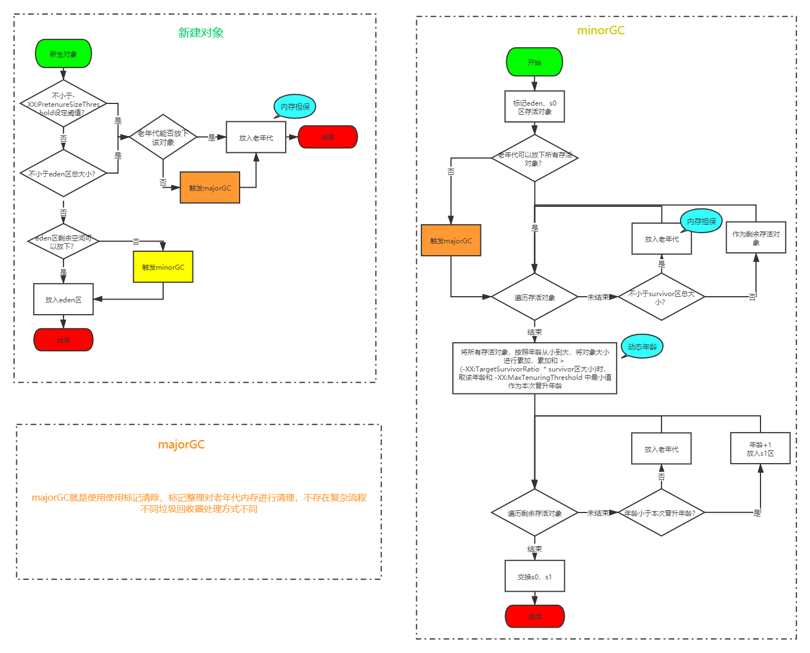
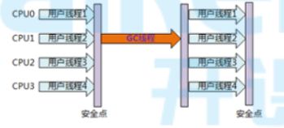
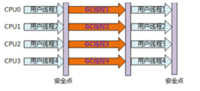

# 什么是垃圾

无任何引用的对象被称为垃圾

# 什么时间回收

+ 某区空间不够时回收

# 引用

> 以下引用由上至下越来越弱

1. 强引用

   ```java
   Object o = new Object()
   ```

   只要引用还在，就不会被回收

   我们研究的，都是强引用

2. 软引用

   + 可能还有用，但并非必须的对象
   + 内存不够时回收

3. 弱引用

   + 非须对象
   + 垃圾回收发生时，无论内存够不够，都被回收

4. 虚引用

   + 唯一用处就是被回收时收到1个系统通知

# 垃圾标记算法

## 引用计数

+ 原理

  每个对象都有1个引用计数器，用来表示自己被多少个变量引用了，当计数为0时就是垃圾

+ 优点：

  简单高效

+ 缺点

  无法解决循环引用问题

  两个垃圾互相引用，计数永远达不到0

+ 已经过时了

## 根可达

### GC根对象

垃圾回收器将某些特殊的对象定义为GC根对象，包括：

+ 虚拟机栈中引用的对象（栈帧中的本地变量表）
+ 方法区中的常量引用的对象
+ 方法区中的类静态属性引用的对象
+ 本地方法栈中JNI（Native方法）的引用对象
+ 活跃线程

### 标记存活对象

+ 标记开始前，先暂停线程，称为`STW(Stop The World)`
+ 遍历`GC根对象`，执行如下流程
  + 是否在`GC根对象`的引用链上
    + 是：标记为存活对象
    + 否：对象是否重写了`finalize()`方法
      + 是：`finalize()`方法是否被执行过
        + 是：标记为垃圾
        + 否：放入`F-Queue`队列
      + 否：标记为垃圾
+ 遍历`F-Queue`执行`finalize()`方法，执行后是否在`GC根对象`的引用链上
  + 是：标记为存活对象
  + 否：标记为垃圾

### finalize()

+ 可以看作对象的`析构方法`，可以进行重写
+ 该方法只会被一条由虚拟机自动建立的、低优先级的`Finalizer`线程执行1次，下次发现不在`GC根对象`的引用链上时，一定会被回收

# 垃圾回收算法

## 标记清除

+ 使用`根可达`算法对垃圾进行标记，然后对垃圾对象占用的内存空间进行回收
+ 优点：不需要移动存活对象，存活对象较多时效率较高
+ 缺点：
  + 内存空间碎片化，需要使用的内存大于碎片内存时，这块内存就无法被使用
  + 需要额外的`空闲列表`对空闲空间进行管理，降低效率
+ 因为对象还在原来得区域，所以通常适用于老年代

## 标记整理

+ 过程

   

  + 标记：使用`根可达`算法对垃圾进行标记
  + 整理：让所有的对象都向一端移动，然后直接清理掉端边界以外的内存

+ 优点：解决碎片化问题

+ 缺点：`STW`时间较长，需要拷贝对象并更新引用地址

+ 因为对象还在原来得区域，所以通常适用于老年代

## 复制算法

+ 将内存一分为2，分别称为`对象面`和`空闲面`

+ 当需要垃圾回收时，将`对象面`的存活对象统一复制到`空闲面`，清空`对象面`，将原来的`空闲面`作为新的`对象面`，原来的`对象面`作为新的`空闲面`

+ 适用性

  + 因为每次垃圾回收需要对所有存活对象进行拷贝，所以适用于`新生代`这种存活周期较短的空间
  + 老年代中对象存活周期较长，使用复制算法或导致同一个对象翻来覆去的拷贝，降低性能
  + 新生代用的就是复制算法
    + `Eden区`内存满了回收时，将对象拷贝到`s0`区，清空`Eden区`
    + `eden`和`s0`都满了的时候，对象拷贝到`s1`，清空`eden`和`s0`，将`s0`与`s1`位置互换
    + 

+ 优点

  + 标记复制可同时进行
  + 避免碎片化

+ 缺点

  + 可使用内存空间缩小一半

## 分代回收

就是1个大原则，年轻代和老年代采用不同得回收算法


# GC

## GC方式

+ `minorGC`：
  + 年轻代得`gc`
  + `eden`区空间不足时触发`minorGC`
+ `majorGC`：
  + 老年代得`gc`
  + 因为一般`minoeGC`后，存活对象需要放入老年代，而老年代空房间不足时会触发`majorGC`，所以`majorGC`一般都伴随1次`minorGC`
  + 老年代空间不足时触发`majorGC`
+ `fullGC`：
  + 整个堆和方法区得回收
  + `fullGC` = `minorGC` + `majorGC` + 方法区回收；但是因为只差了个方法区，所以`majorGC`和`fullGC`概念也经常混淆
  + 触发条件
    + 调用System.gc时，系统建议执行Full GC，但是不必然执行
    + 老年代不够用，没人替它担保
    + 方法区不够用，没人替他担保
    + 当新生代的对象无法被老年代担保成功时

## 其他

+ 方法区垃圾回收

  方法区也会进行垃圾回收，但是性能太低，一般不关注

+ 老年代垃圾回收

  老年代垃圾回收不会进入永久代，还会保留在老年代

## GC流程

> 流程图：https://www.processon.com/diagraming/5fa27383e401fd1c7b84bf26
>
> 官方文档：https://www.oracle.com/webfolder/technetwork/tutorials/obe/java/gc01/index.html

 

## 回收方式

### 串行回收

+ 回收时需要`STW`，使用`单线程`进行回收

 

### 并行回收

+ 回收时需要`STW`，使用`多线程`进行回收

 

### 并发标记回收


### 垃圾优先回收


### 适用性

+ 

## 评估指标

### 总结

`full gc`应该控制在每天`1`次，每次不超过`10ms`

在保证响应时间得基础上，应该尽量提升吞吐量


# 垃圾回收器

