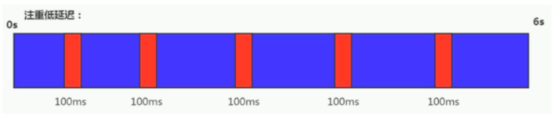
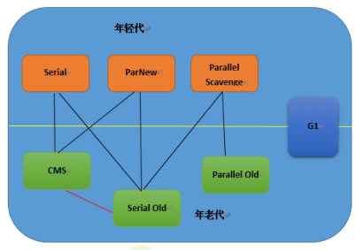
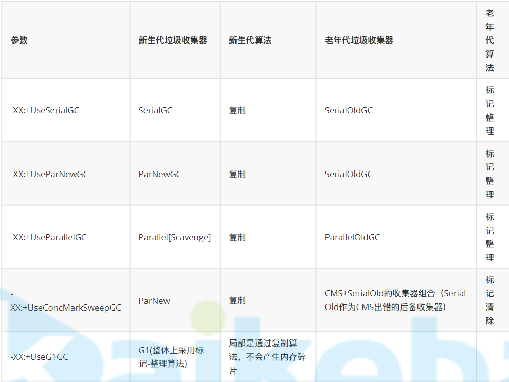
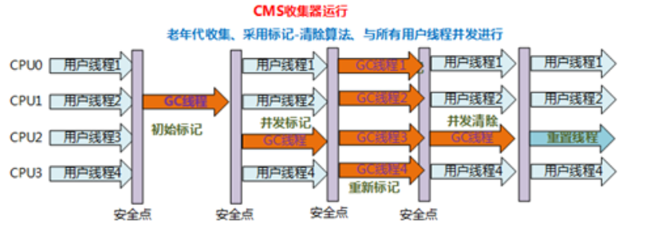
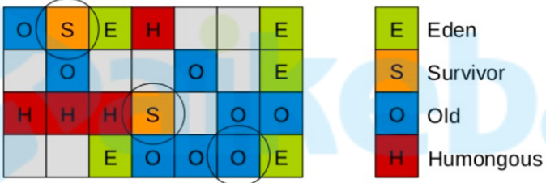

# 什么是垃圾

无任何引用的对象被称为垃圾

# 什么时间回收

+ 某区空间不够时回收

# 引用

> 以下引用由上至下越来越弱

1. 强引用

   ```java
   Object o = new Object()
   ```

   只要引用还在，就不会被回收

   我们研究的，都是强引用

2. 软引用

   + 可能还有用，但并非必须的对象
   + 内存不够时回收

3. 弱引用

   + 非须对象
   + 垃圾回收发生时，无论内存够不够，都被回收

4. 虚引用

   + 唯一用处就是被回收时收到1个系统通知

# 垃圾标记算法

## 引用计数

+ 原理

  每个对象都有1个引用计数器，用来表示自己被多少个变量引用了，当计数为0时就是垃圾

+ 优点：

  简单高效

+ 缺点

  无法解决循环引用问题

  两个垃圾互相引用，计数永远达不到0

+ 已经过时了

## 根可达

### GC根对象

垃圾回收器将某些特殊的对象定义为GC根对象，包括：

+ 虚拟机栈中引用的对象（栈帧中的本地变量表）
+ 方法区中的常量引用的对象
+ 方法区中的类静态属性引用的对象
+ 本地方法栈中JNI（Native方法）的引用对象
+ 活跃线程

### 标记存活对象

+ 标记开始前，先暂停线程，称为`STW(Stop The World)`
+ 遍历`GC根对象`，执行如下流程
  + 是否在`GC根对象`的引用链上
    + 是：标记为存活对象
    + 否：对象是否重写了`finalize()`方法
      + 是：`finalize()`方法是否被执行过
        + 是：标记为垃圾
        + 否：放入`F-Queue`队列
      + 否：标记为垃圾
+ 遍历`F-Queue`执行`finalize()`方法，执行后是否在`GC根对象`的引用链上
  + 是：标记为存活对象
  + 否：标记为垃圾

### finalize()

+ 可以看作对象的`析构方法`，可以进行重写
+ 该方法只会被一条由虚拟机自动建立的、低优先级的`Finalizer`线程执行1次，下次发现不在`GC根对象`的引用链上时，一定会被回收

# 垃圾回收算法

## 标记清除

+ 使用`根可达`算法对垃圾进行标记，然后对垃圾对象占用的内存空间进行回收
+ 优点：不需要移动存活对象，存活对象较多时效率较高
+ 缺点：
  + 内存空间碎片化，需要使用的内存大于碎片内存时，这块内存就无法被使用
  + 需要额外的`空闲列表`对空闲空间进行管理，降低效率
+ 因为对象还在原来得区域，所以通常适用于老年代

## 标记整理

+ 过程

   

  + 标记：使用`根可达`算法对垃圾进行标记
  + 整理：让所有的对象都向一端移动，然后直接清理掉端边界以外的内存

+ 优点：解决碎片化问题

+ 缺点：`STW`时间较长，需要拷贝对象并更新引用地址

+ 因为对象还在原来得区域，所以通常适用于老年代

## 复制算法

+ 将内存一分为2，分别称为`对象面`和`空闲面`

+ 当需要垃圾回收时，将`对象面`的存活对象统一复制到`空闲面`，清空`对象面`，将原来的`空闲面`作为新的`对象面`，原来的`对象面`作为新的`空闲面`

+ 适用性

  + 因为每次垃圾回收需要对所有存活对象进行拷贝，所以适用于`新生代`这种存活周期较短的空间
  + 老年代中对象存活周期较长，使用复制算法或导致同一个对象翻来覆去的拷贝，降低性能
  + 新生代用的就是复制算法
    + `Eden区`内存满了回收时，将对象拷贝到`s0`区，清空`Eden区`
    + `eden`和`s0`都满了的时候，对象拷贝到`s1`，清空`eden`和`s0`，将`s0`与`s1`位置互换
    + 

+ 优点

  + 标记复制可同时进行
  + 避免碎片化

+ 缺点

  + 可使用内存空间缩小一半

## 分代回收

就是1个大原则，年轻代和老年代采用不同得回收算法


# GC

## GC方式

+ `minorGC`：
  + 年轻代得`gc`
  + `eden`区空间不足时触发`minorGC`
+ `majorGC`：
  + 老年代得`gc`
  + 因为一般`minoeGC`后，存活对象需要放入老年代，而老年代空房间不足时会触发`majorGC`，所以`majorGC`一般都伴随1次`minorGC`
  + 老年代空间不足时触发`majorGC`
+ `fullGC`：
  + 整个堆和方法区得回收
  + `fullGC` = `minorGC` + `majorGC` + 方法区回收；但是因为只差了个方法区，所以`majorGC`和`fullGC`概念也经常混淆
  + 触发条件
    + 调用System.gc时，系统建议执行Full GC，但是不必然执行
    + 老年代不够用，没人替它担保
    + 方法区不够用，没人替他担保
    + 当新生代的对象无法被老年代担保成功时

## 其他

+ 方法区垃圾回收

  方法区也会进行垃圾回收，但是性能太低，一般不关注

+ 老年代垃圾回收

  老年代垃圾回收不会进入永久代，还会保留在老年代

## GC流程

> 流程图：https://www.processon.com/diagraming/5fa27383e401fd1c7b84bf26
>
> 官方文档：https://www.oracle.com/webfolder/technetwork/tutorials/obe/java/gc01/index.html

 

## 回收方式

### 串行回收

+ 回收时需要`STW`，使用`单线程`进行回收

 

### 并行回收

+ 回收时需要`STW`，使用`多线程`进行回收

 

### 并发标记回收

`CMS`回收器的回收方式，参见[CMS收集器](# CMS收集器)  

### 垃圾优先回收

+ G1和ZGC垃圾回收器的回收方式
+ 将整个内存划分成一个个小区域，优先对回收性价比最高的区域进行回收

### 适用性

+ 复制、标记整理
  + 因为这两个算法需要移动对象，内存地址会变更，所以适用串行回收、并行回收
+ 标记清除
  + 不需要移动对象，适用并发标记回收

## 评估指标

### 指标

+ 吞吐量

  `用户代码运行时间 `与 `总运行时间` 比例

+ 垃圾收集开销

  `垃圾回收时间 `与 `总运行时间` 比例

+ 暂停时间

  `STW`时间

+ 收集频率

  垃圾回收发生频率

+ 内存占用

  内存越大，回收频率越低，但是暂停时间越长

  内存比较贵的时候看这个，现在不看了

+ 快速

  对象生命周期

### 重点关注

+ 吞吐量、暂停时间

+ 吞吐量高，暂停时间长，适用于计算场景

   

+ 吞吐量低，暂停时间短，适用于处理请求场景

   

### 总结

+ jvm调优目标

  尽量提升吞吐量和响应时间，两者需要一个平衡，至于哪个更优先根据场景决定

+ 经验

  `full gc`应该控制在每天`1`次，每次不超过`10ms`

# 垃圾回收器

## 概述

 

图中连线表示谁和谁可以组合，但是常用组合方式如下：

 

## 组合选择

+ 单CPU或小内存，单机程序

  `-XX:+UseSerialGC`

+ 多CPU，需要最大吞吐量，如后台计算型应用

  `-XX:+UseParalellGC`或者`-XX:+UseParalellOldGC`

+ 多CPU，追求低停顿时间（STW的时间），需快速响应如互联网应用

  `-XX:+UseParNewGC`或

  `-XX:+UseConcMarkSweepGC`

> 常用组合：
>
> + 计算型用`-XX:+UseParalellGC`
> + 响应型用`-XX:+UseConcMarkSweepGC`
>
> 最好的垃圾回收器`G1`，可以替代其他回收器

## 默认垃圾回收器

+ 1.8：`ps` + `po`
+ 1.9：`G1`

## Serial收集器

+ 串行回收方式
+ 适用于新生代
+ 使用复制算法
+ 适用于单机应用程序会单核cpu场景

## Serial Old收集器

+ `Serial`收集器的老年代版本，特性与`Serial`收集器相同
+ 使用标记整理算法
+ 也用于做`cms`收集器的后备收集器

## ParNew收集器

+ `Serial`收集器的多线程版本
+ 并行回收方式
+ 响应时间优先

## Parallel Scavenge收集器

+ 新生代收集器
+ 并行回收方式
+ 采用复制算法

> 以上特性与`ParNew`很像

+ 吞吐量优先

## Parallel Old收集器

+ `Parallel Scavenge`老年代版本
+ 使用标记整理算法

## CMS收集器

### 概述

+ 并发标记回收方式
+ 使用标记清除算法，容易产生内存碎片
+ 老年代回收器
+ 响应时间优先
+ 不是默认回收器，需要单独开启

### 回收过程

 

+ 初始标记

  + 标记`GC Root`可以直接到达的对象
  + 需要`STW`，但是时间非常短

+ 并发标记

  + 并发遍历刚才标记的可直接到达的对象

  + 这个过程耗时较长

  + 并发执行可能会导致存活对象标记成了垃圾

    ```
    1. C对象挂在B对象下，A对象独立，此时遍历A，标记不到C
    2. 用户进程将C对象从B对象下转移到A对象下，此时遍历到B，则整个过程遍历不到C对象
    ```

+ 重新标记

  + 将上一步中误标记为垃圾的存活对象重新标记为存活对象
  + 并行执行，时间略长于初始标记

+ 并发清除

  对标记的对象进行清除

### 浮动垃圾

并发标记过程中，可能有些对象正在变成垃圾，而本次标记不到，需要下次才能回收，这部分对象称为浮动垃圾

### Concurrent Mode Failure

+ 这是`CMS`收集器在`GC`时可能出现的异常，原因就是老年代内存不够分了

+ 解决方案

  减小年轻代大小，避免年轻代一次性放入太多数据

  但是会导致增加回收频率

### 碎片整理

> 碎片整理引发`STW`

+ `-XX:+UseCMSCompactAtFullCollection`

  强制进行碎片整理

+ `-XX:+CMSFullGCsBeforeCompaction`

  经过几次的FullGC进行空间碎片整理

## G1收集器

### 概述

+ java9开始作为默认回收器

+ 并行 + 并发

+ 物理上将整个堆分为多个`region`，逻辑上将这些`region`分为`eden`区、`survivor`区、老年代、`Humongous`区

   

  默认分为`2048`个`region`，可以通过`-XX:G1HeapRegionSize`指定`region`大小（`1MB~32MB`，且必须是2的幂）

+ `Humongous`区

  + 当1个对象大小超过1个`region`一半，会直接在老年代进行分配，这个区称为`Humongous`区

  + `Humongous`区占用1至多个`region`

+ 每个`region`是什么区并不是固定的，可以相互转换

+ `G1`会自动调年轻代大小

  + 方式1
    + 动态变化范围：
      + 最小：年轻代初始百分比`-XX:G1NewSizePercent`（默认整堆5%）
      + 最大：年轻代最大百分比`-XX:G1MaxNewSizePercent`（默认整堆60%）
    + 根据暂停时间`XX:MaxGCPauseMillis`（默认200）动态计算得出年轻代大小
  + 方式2
    + 设置`-XX:NewRatio`、`-Xmn`直接指定年轻带大小
    + 此时上面三个参数失去意义

+ 采用标记清除和复制算法

+ 通过`-XX:+UseG1GC`启用

+ 不会等内存耗尽的时候进行垃圾回收，使用`启发性算法`在合适的时候对性价比高的`region`进行回收

+ 可以通过`-XX:MaxGCPauseMill`设置`stw`时间，暂停时间越短，年轻代越小

### 参数

+ `-XX:+UseG1GC`：启用`G1`
+ `-XX:G1HeapRegionSize`：指定`region`大小（`1MB~32MB`，且必须是2的幂）
+ `-XX:MaxGCPauseMillis`：最大暂停时间（默认200）
+ `-XX:ParallelGCThread`：设置`STW`工作线程数，最大8
+ `-XX:ConcGCThreads`：并发标记线程数，设置为`-XX:ParallelGCThread`的`1/4`左右
+ `-XX:InitiatingHeapOccupancyPercent`：垃圾回收触发阈值，默认`45%`

### 使用

`G1`使用比较简单

+ 启用

+ 设置堆大小

+ 设置合适的`-XX:MaxGCPauseMillis`

  这个很重要，设置不好影响吞吐量，一般10%时间用于垃圾回收即可

## ZGC回收器

+ java11引入的，应该是用不着了
+ 取消了分区概念
+ 目前最好回收器
