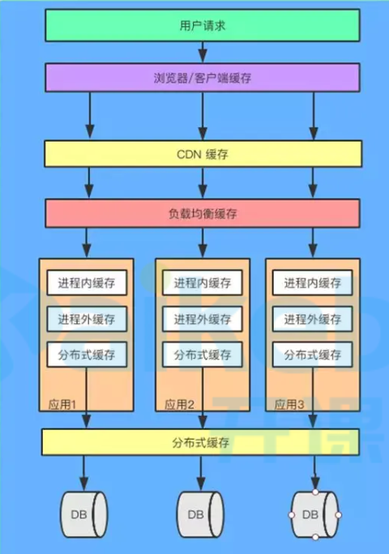
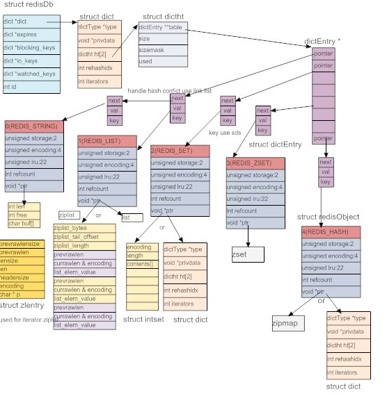

# 通识

## 缓存与缓冲

1. 缓存（cache）

   缓存是为了提高性能，把数据就存到这了，以后获取的时候，这里有就直接从这里获取了

2. 缓冲（buffer）

   缓冲是为了较少设备交互次数存在的

   比如向硬盘写数据时，如果每写1个字节都直接写入到磁盘，磁盘交互会很多，可以先把数据缓冲到buffer中，一次性写入，磁盘交互次数会大幅降低

## 缓存有哪些

+ CPU缓存
+ 操作系统缓存
+ 数据库缓存
+ JVM 编译缓存
+ CDN 缓存
+ 代理与反向代理缓存
+ 前端缓存
+ 应用程序缓存
+ 分布式对象缓存

## 多级缓存

 

使用多级缓存后，大部分请求都被缓存处理了，只有少部分请求会打到数据库

+ CDN缓存

  内容分发网络，将一些静态文件缓存到就近的站点，每次请求相同文件时，直接就近获取即可，不会直接请求源服务器

+ 负载均衡缓存

  动静分离时，对静态文件缓存，不用每次去磁盘取数据

  `nginx`

# redis介绍

## 快的原因

1. 基于内存
2. 单线程，使用了IO多路复用（epoll模型）

## 源码

+ 地址：https://github.com/redis/redis
+ 本文基于6.0版本
+ 源码介绍
  + server.h
    + 663：redisDb
  + dict.h
    + 76：dict
    + 58：dictType
    + 69：dictht 
    + 47：dictEntry 
  + sds.h
    + sds
  + 

# 数据结构

## 字典（hashtable）

# 存储结构

 

