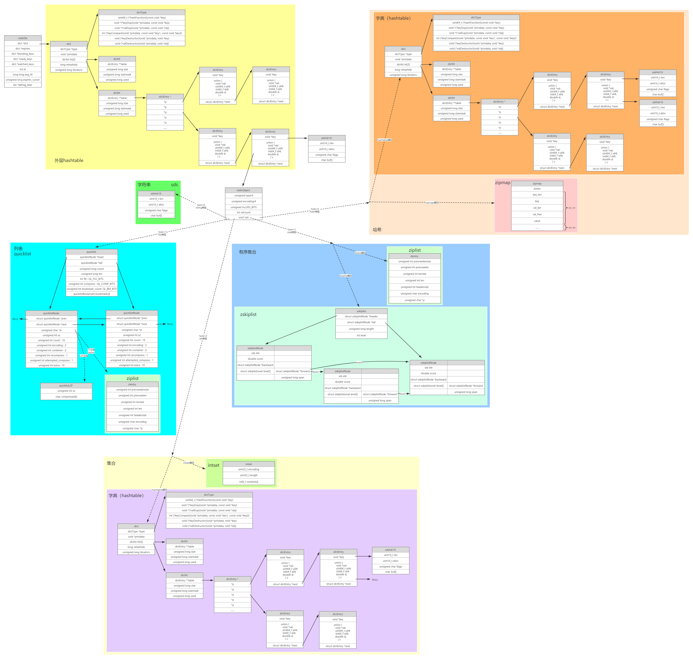
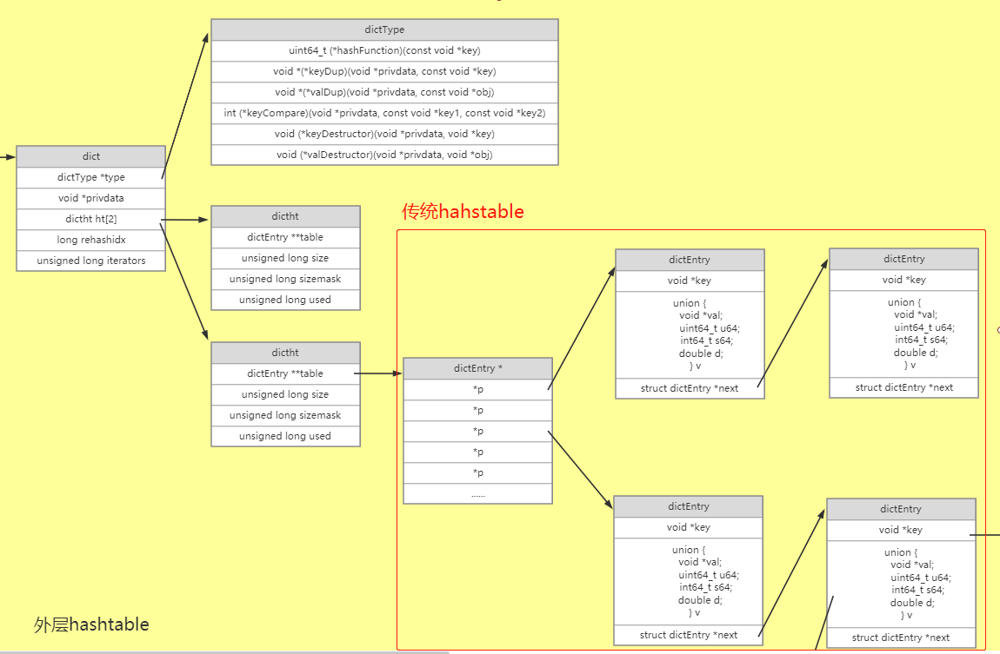

# 通识

## 缓存与缓冲

1. 缓存（cache）

   缓存是为了提高性能，把数据就存到这了，以后获取的时候，这里有就直接从这里获取了

2. 缓冲（buffer）

   缓冲是为了较少设备交互次数存在的

   比如向硬盘写数据时，如果每写1个字节都直接写入到磁盘，磁盘交互会很多，可以先把数据缓冲到buffer中，一次性写入，磁盘交互次数会大幅降低

## 缓存有哪些

+ CPU缓存
+ 操作系统缓存
+ 数据库缓存
+ JVM 编译缓存
+ CDN 缓存
+ 代理与反向代理缓存
+ 前端缓存
+ 应用程序缓存
+ 分布式对象缓存

## 多级缓存

 

使用多级缓存后，大部分请求都被缓存处理了，只有少部分请求会打到数据库

+ CDN缓存

  内容分发网络，将一些静态文件缓存到就近的站点，每次请求相同文件时，直接就近获取即可，不会直接请求源服务器

+ 负载均衡缓存

  动静分离时，对静态文件缓存，不用每次去磁盘取数据

  `nginx`

# redis介绍

## 快的原因

1. 基于内存
2. 单线程，使用了IO多路复用（epoll模型）

## 源码

+ 地址：https://github.com/redis/redis
+ 本文基于6.0版本


# 存储结构

 


## 结构说明

### redisDb

+ 每个`redisDb`代表1个数据库，默认16个数据库

### 外层hashtable

+ 每个`redisDb`下挂着1个`hashtable`，用于存储该库中所有键值对
+ 键固定是字符串类型，存储结构一般为`sds`结构体，具体参见[字符串类型](#字符串类型) 
+ 值使用`redisObject`结构存储，这个值具体是哪种基本类型，在`redisObject`中指定

### redisObject

+ 所有value值使用`redisObject`类型存储，使用`type`属性表示5种基本数据类型
+ `ptr`指针指向真正的数据

### 字符串类型

字符串类型内部编码有3种：

+ 整形编码
  + 字符串内容为整形数字时，使用8字节`long`整形表示
+ `embstr`编码
  + 小于等于44字节的字符串，使用该编码存储
  + 字符串内容使用`sds`结构存储
  + `redisObject`与`sds`内存空间上是连续的，一次内存分配同时创建这两个对象，`sds`中直接预留了固定的44个字节
+ `raw`编码
  + 大于44字节的字符串，使用该编码存储
  + 字符串内容也使用`sds`结构存储
  + 区别在于`redisObject`与`sds`内存空间上是分开的，这两个对象分两次创建；每次设置1个字符串值的时候，先在一块新的内存上创建对应的`sds`对象，然后将`sds`对象的地址赋值给`redisObject`的`ptr`属性

### 列表

列表使用`quicklist`数据结构

### 集合

内部编码：

+ `intset`

  满足如下2个条件时，使用该编码

  + 元素数量小于512

  + 所有元素都是整数

+ `hashtable`

  + 不满足上面两个条件时使用该编码

### 有序集合

内部编码：

+ `ziplist`

  满足如下2个条件时，使用该编码

  + 元素数量小于128

  + 所有元素长度小于64字节

+ `zskiplist`

  + 不满足上面两个条件时使用该编码

### 哈希

hash类型内部编码有2种：

+ `zipmap`

  满足如下2个条件时，使用该编码

  + 元素数量小于512
  + 所有键和值的字符串长度都小于64字节

+ `hashtable`

  + 不满足上面两个条件时使用该编码

## 结构体

```c
// server.h:663
typedef struct redisDb {
    dict *dict;                 	// 数据库键空间，存放着所有的键值对
    dict *expires;              	// 键的过期时间
    dict *blocking_keys;        	// 处于阻塞状态的键和相应的client（主要用于List类型的阻塞操作）
    dict *ready_keys;           	// 准备好数据可以解除阻塞状态的键和相应的client
    dict *watched_keys;         	// 被watch命令监控的key和相应client
    int id;                     	// 数据库ID标识
    long long avg_ttl;          	// 数据库内所有键的平均TTL（生存时间）
    unsigned long expires_cursor; 	// 周期性删除过期键的游标
    list *defrag_later;         	// 逐一尝试整理碎片的关键名称列表
} redisDb;

// dict.h:76
typedef struct dict {
    dictType *type;					// 字典类型数据指针
    void *privdata;					// 私有数据
    dictht ht[2];					// 两张hashtable
    long rehashidx; 				// rehash索引
    unsigned long iterators; 		// 正在运行的迭代器个数
} dict;

// dict.h:58
typedef struct dictType {
    uint64_t (*hashFunction)(const void *key);								// 哈希函数指针
    void *(*keyDup)(void *privdata, const void *key);						// 复制key函数指针
    void *(*valDup)(void *privdata, const void *obj);						// 复制值函数指针
    int (*keyCompare)(void *privdata, const void *key1, const void *key2);	// 键比对函数指针
    void (*keyDestructor)(void *privdata, void *key);						// 销毁键的函数指针
    void (*valDestructor)(void *privdata, void *obj);						// 销毁值的函数指针
} dictType;

// dict.h:69
typedef struct dictht {
    dictEntry **table;			// 哈希桶指针
    unsigned long size;			// 哈希表大小
    unsigned long sizemask;		// 哈希表大小掩码，用于计算索引值；总是等于 size - 1
    unsigned long used;			// 已有节点数量
} dictht;

// dict.h:47
typedef struct dictEntry {
    void *key;					// key数据指针
    union {
        void *val;
        uint64_t u64;
        int64_t s64;
        double d;
    } v;						// value数据指针
    struct dictEntry *next;		// 链表下一节点指针
} dictEntry;

// sds.h
// sds结构体存在多种字节长度的结构体，仅仅长度不同，结构完全相同；这里以sdshdr16为例
struct __attribute__ ((__packed__)) sdshdr16 {
    uint16_t len; 				// 已用长度
    uint16_t alloc; 			// 可用字符串总长度
    unsigned char flags; 		// 低3位为标志位
    char buf[];					// 字符串内容
};

// server.h:625
typedef struct redisObject {
    unsigned type:4;				// 值类型
    unsigned encoding:4;			// 编码
    unsigned lru:LRU_BITS; 			// 最后一次命令程序访问时间
    int refcount;					// 引用计数
    void *ptr;						// 数据指针
} robj;

// quicklist.h:105
typedef struct quicklist {
    quicklistNode *head;					// 链表头指针
    quicklistNode *tail;					// 链表尾指针
    unsigned long count;        			// 集合种元素总数
    unsigned long len;          			// 链表节点数
    int fill : QL_FILL_BITS;              	// ziplist大小限定
    unsigned int compress : QL_COMP_BITS; 	// 节点压缩深度设置
    unsigned int bookmark_count: QL_BM_BITS;
    quicklistBookmark bookmarks[];
} quicklist;

// quicklist.h:46
typedef struct quicklistNode {
    struct quicklistNode *prev;				// 前一节点指针
    struct quicklistNode *next;				// 后一节点指针
    unsigned char *zl;						// ziplist数据指针
    unsigned int sz;             			// ziplist数据字节数
    unsigned int count : 16;     			// ziplist中元素数
    unsigned int encoding : 2;   			// 编码 RAW==1 or LZF==2
    unsigned int container : 2;  			// 预留字段，存放数据的方式，1--NONE，2--ziplist
    unsigned int recompress : 1; 			// 解压标记，当查看一个被压缩的数据时，需要暂时解压，标记此参数为1，之后再重新进行压缩
    unsigned int attempted_compress : 1; 	// 标记节点不压缩
    unsigned int extra : 10; 				// 扩展字段
} quicklistNode;

// quicklist.h:64
typedef struct quicklistLZF {
    unsigned int sz; 			// compressed[]字节数
    char compressed[];			// 压缩后内容
} quicklistLZF;

// ziplist.c:271
typedef struct zlentry {
    unsigned int prevrawlensize; // 前一个元素长度需要空间
    unsigned int prevrawlen;     // 上一项长度
    unsigned int lensize;        // 当前元素长度需要空间
    unsigned int len;            // 当前元素长度
    unsigned int headersize;     // prevrawlensize + lensize 字节长度
    unsigned char encoding;      // 编码
    unsigned char *p;            // 实际内容
} zlentry;

// intset.h:35
typedef struct intset {
    uint32_t encoding;			// 编码
    uint32_t length;			// 长度
    int8_t contents[];			// 内容
} intset;

// server.h:923
typedef struct zskiplist {
    struct zskiplistNode *header, *tail;	// 头节点、尾节点
    unsigned long length;					// 节点长度
    int level;								// 最大节点层数
} zskiplist;

// server.h:913
typedef struct zskiplistNode {
    sds ele;								// 成员对象
    double score;							// 分数
    struct zskiplistNode *backward;			// 前一节点
    struct zskiplistLevel {
        struct zskiplistNode *forward;		// 下一节点
        unsigned long span;					// 跨度
    } level[];								// 层
} zskiplistNode;
```


# 数据结构

## 字典（hashtable）

 

+ 传统`hashtable`如上图红框内所示，一个哈希桶下面挂1个单向链表

+ `redis`中`hashtable`上面加了两层，主要目的是准备两个哈希桶，用于实现扩容时的[渐进rehash](https://github.com/Mshuyan/redis#%E6%B8%90%E8%BF%9Brehash) 

  

## ziplist


## quicklist


## skiplist


## zipmap


