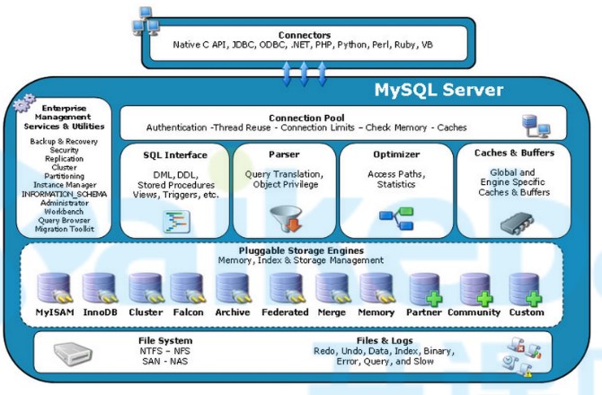

> + 课程使用`mysql5.7.3`
> + `mysql`配置文件中不区分`-`和`_`

# 安装

+ docker

  ```sh
  #!/bin/bash
  
  # /usr/local/docker-srv/mysql5.7/logs 需要修改权限为 777
  
  docker run -d --name mysql5.7 \
   --log-opt max-size=10m \
   -v /etc/localtime:/etc/localtime:ro \
   -v /etc/timezone:/etc/timezone:ro \
   -p 3306:3306 \
   --privileged=true \
   -v /usr/local/docker-srv/mysql5.7/conf:/etc/mysql \
   -v /usr/local/docker-srv/mysql5.7/logs:/logs \
   -v /usr/local/docker-srv/mysql5.7/data:/var/lib/mysql \
   -e MYSQL_ROOT_PASSWORD=943397 \
   mysql:5.7
  ```

  

# 文件结构

> + `mysql`数据分为日志文件和数据文件，通常放在`var/lib/mysql`目录下

## 日志文件

> + 日志文件都是`顺序IO`的，追加的形式按顺序写
> + 日志相关配置可以通过` show variables like '%log%';`查看

### 错误日志

+ 作用：记录运行过程中遇到的所有`错误、警告、通知`等信息,以及每次`启动和关闭`的详细信息。

+ 配置

  ```sh
  # 作用：错误日志存储位置
  # 默认值：stderr，输出到控制台
  # 常用配置：一般都需要指定1个输出位置
  log_error=/var/log/mysqld.log
  # 作用：将哪些级别的警告输出到错误日志，默认2；0表示不输出警告
  # 默认值：2
  # 常用配置：使用默认值
  log_warnings=2
  # 作用：将哪些信息输出到错误日志：1：错误；2：错误和警告；3：错误、警告和通知
  # 默认值：3
  # 常用配置：使用默认值
  log_error_verbosity=3
  ```

### 二进制日志

+ 作用：记录数据库实例的所有修改语句

+ 配置

  ```sh
  # 作用：指定服务id
  # 默认值：0
  # 说明：主从复制功能需要为每个mysql实例指定不同的server-id；为0时无法启用主从复制和binlog日志功能
  server-id=1 
  # 作用：启用并配置binlog文件的basename
  # 默认：OFF
  # 常用配置：需要使用`binlog`文件时再开启，一般需要将数据实时同步给其他服务时需要开启
  log-bin=mysql-bin
  ```

+ 说明：启用`binlog`后，会在`/var/lib/mysql`下生成如下文件：

  + `{basename.index}`：二进制索引文件，用于为所有二进制文件建立索引
  + `{basename}.000001`：二进制文件，真正的内容

### 通用查询日志

+ 作用：记录用户所有操作

+ 配置

  ```sh
  # 是否启用通用日志
  # 默认值 OFF；可选值 ON|OFF
# 常用配置：关闭；开启后产生大量不必要的磁盘IO，影响性能
  general_log=OFF
  # 通用日志文件名
  # 默认值：/{datadir}/{hostname}.log
  general_log_file=/var/lib/mysql/dc3757bde5bd.log
  ```

### 慢查询日志

+ 作用：记录查询时间过长得sql

+ 配置

  ```sh
  # 是否启用慢查询
  # 默认值：OFF；可选值 ON|OFF
  # 常用配置：
  slow_query_log=ON
  # 慢查询阈值，单位秒
  # 默认10
  long_query_time=10
  # 慢查询日志文件名
  # 默认值：/{datadir}/{hostname}-slow.log
  # 如果指定文件名没有指定目录，默认目录为{datadir}
  slow_query_log_file=/var/lib/mysql/dc3757bde5bd-slow.log
  ```

## 数据文件

> 数据文件是`随机IO`的，需要在文件中需要的位置插入、修改数据

### InnoDB

+ `ib_buffer_pool`

  内存中缓冲池得持久化文件

  持久化的目的是数据库重启时可以直接加载上次使用的缓冲池，避免预热过程

+ `ib_logfile0`、`ib_logfile1`

  重做日志文件

+ `ibdata1`

  系统表空间文件

+ 库文件

  > + 每个`database`对于1个与数据库同名的目录，目录下存放该数据库相关文件
  > + 下属文件名中的`*`均为表名

  + `*.frm`

    表结构定义信息

  + `*.ibd`

    表中索引和数据

  + `db.opt`

    数据库属性信息，默认字符集等

### MyIsam

+ `*.frm`

  表结构定义信息

+ `*.myd`

  表中数据

+ `*.myi`

  表中索引

# 逻辑架构

## 总览

 

+ 客户端

  各种语言实现的客户端连接器，如JDBC

+ `MySQL Server`层

  + `Management Serveices & Utilities`

    系统管理和控制工具

  + `Connaction Pool`

    + 连接池
    + 用于与客户端建立连接

  + `SQL Interface`

    + `SQL`接口
    + 用于接收和返回数据

  + `Parser`

    + 解析器
    + 用于对sql进行验证和解析

  + `Optimizer`

    + 查询优化器
    + 对查询语句进行优化
    + `explain`查看的执行计划，就是查询优化器生成的

  + `Caches & Buffers`

    + 缓存和缓冲区
    + 将查询语句的hash值作为key，将查询结果进行缓冲，数据变更时自动失效
    + 使用效果并不理想，mysql8.0中已弃用，想用可以自己用二级缓存、redis等实现

+ 存储引擎层

  + 

+ 文件系统

## 执行流程


# InnoDB引擎


#### 缓冲池文件

+ 文件名`ib_buffer_pool`
+ 内存中缓冲池得持久化文件；持久化的目的是数据库重启时可以直接加载上次使用的缓冲池，避免预热过程
+ `buffer pool`实例大小 = `buffer pool`总大小（`innodb_buffer_pool_size`） / `buffer pool`实例数（`innodb_buffer_pool_instances`）
+ `buffer pool`中缓存了多种类型的数据页，类型如下：
  + 索引页
  + 数据页
  + `undo_log`页
  + 插入缓存
  + 自适应哈希索引
  + 锁信息
  + 数据字典

#### 重做日志文件

+ 文件名`ib_logfile0`、`ib_logfile1`

+ 这是一组文件，这组文件是顺序循环写入的

+ 该文件用于记录对数据的修改行为（修改语句）

  提交的时候，不直接修改硬盘上的数据（随机IO消耗性能），而是将修改语句持久化到磁盘上的`redo_log`文件中，后续异步修改磁盘上的数据，这样既避免数据的丢失，又提高了修改数据的性能

