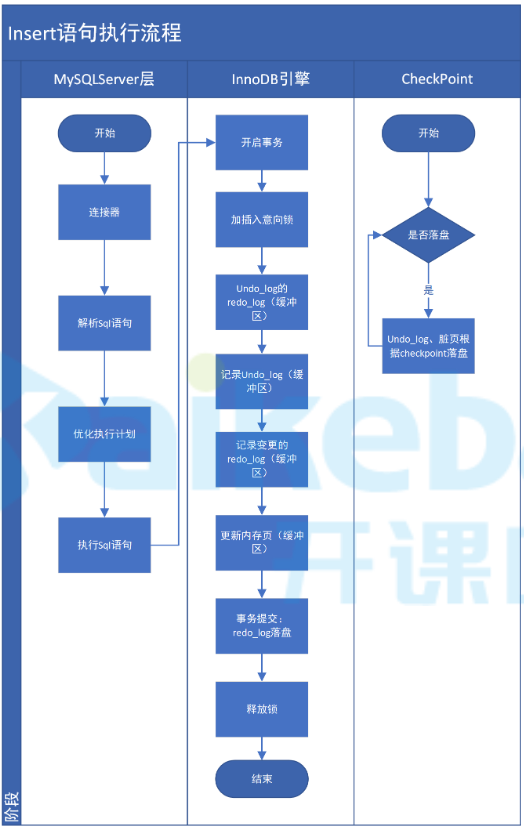

> `TODO`
>
> + 隔离级别是使用锁解决的吗？还是分离出独立缓存？都有那些锁？
> + 幻读包括删除操作吗？可重复读使用的锁（行锁？）能否阻止删除？

# 事务执行流程

 

# 事务介绍

## 事务特性（ACID）

+ 原子性（`atomicty`）

  整个事务要么全成功。要么全失败

+ 一致性（`consistency`）

  事务开始前和结束后，数据完整性不要被破坏（因为事务部分提交导致出现错误数据）

+ 隔离性（`isolation`）

  不同事务之间不能相互影响

  隔离性的强弱与事务的性能相关，隔离级别越高性能越差

+ 持久性（`durability`）

  事务提交后数据永久有效

## 隔离级别

### 事务之间存在哪些影响

+ 脏读

  一个事务读取到另一个事务中还`未提交`的数据

+ 不可重复读

  因其他事务提交的`修改`，一个事务中两次读取同一条数据的结果不一致

+ 幻读

  因其他事务提交的`新增或删除`，一个事务中两次读取到的数据不一致

+ 丢失更新

  两个事务同时执行时，后提交事务`覆盖`了先提交的事务提交的数据

### 隔离级别

+ 读未提交（RU）

  未解决任何问题

+ 读已提交（RC）

  解决脏读

  `oracle`默认

+ 可重复读（RR）

  解决脏读、不可重复读

  `mysql`默认

+ 串行化（`Serializable`）

  解决所有问题

# MVCC

## 丢失更新

