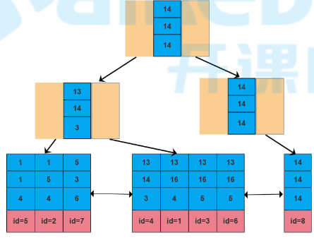
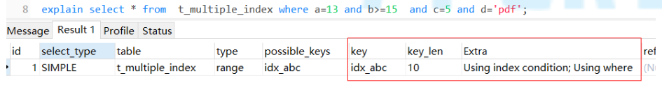
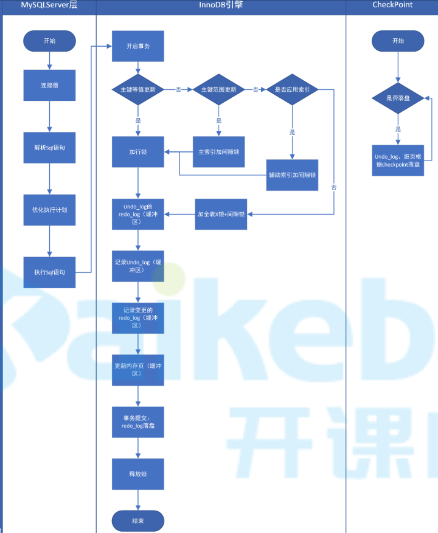

# 索引

## 组合索引

+ 创建索引时尽量使用组合索引

+ 存储结构

   

+ 组合索引有2个好处

  + 当查询条件中涉及多个索引列时
    + 如果单独为每个字段创建索引，`InnoDB`只会选择效率最高的1个索引使用
    + 如果创建组合索引，`InnoDB`会按照组合索引中字段顺序依次进行检索；效率更高
  + 增删改数据时，如果单独为每个字段创建索引，会产生多个索引树；如果创建组合索引，只会产生1个索引树；维护多个索引相对于维护一个索引，成本更高

+ 最左前缀匹配原则

  + 匹配时，按照组合索引创建顺序，前面的字段走了索引，后面的字段才会走索引，任何一个字段无法使用索引，则会造成索引中断，后面的字段都无法使用索引了

  + 索引中断

    组合索引匹配时，任意一个字段只有匹配到1个值时，后面的字段才会使用索引

    哪些情况会造成索引中断：

    + 没有使用组合索引中某字段作为条件（当前列索引已经失效）
    + 索引列上做计算（当前列索引已经失效）
    + 范围查询：大于、小于、`between`、`like`（当前列使用索引，后面的索引失效）

## 覆盖索引

+ 索引树中包含了`条件中`和`select中`的所有字段时，`InnoDB`直接使用该索引树进行查询，并直接使用索引树中数据进行返回，`避免了回表操作`，这种现象称为覆盖索引

+ 案例

  + 背景

    在`a,b,c`字段上创建组合索引

  + 案例1

    ```sql
    select a,b,c,id from  t_multiple_index where a=13 and b=16;
    ```

    因为组合索引树中包含了`a,b,c,id`字段，所以没必要进行回表操作，查询完直接使用索引树中字段返回

  + 案例2

    ```sql
    select a,b,c,id from  t_multiple_index where b=16;
    ```

    该语句表面上是无法使用组合索引的，但是因为组合索引树中包含了涉及到的所有列，会使用该索引树进行全表扫描，这样可以减少磁盘IO次数

## 索引条件下推ICP

+ 概念

  + 组合索引中存在索引中断时，存储引擎将数据返给`MySqlServer`层对被中断的索引字段进行筛选
  + 启用`索引条件下推`后，存储引擎层会直接对被中断的索引字段进行筛选
  + 因为是将对被中断的索引字段进行筛选步骤，下推到了存储引擎层处理，所以叫`索引条件下推`
  + 好处就是减少了存储引擎层磁盘IO次数

+ 开启关闭

  + 查看状态

    ```sh
    mysql> show VARIABLES like 'optimizer_switch';
    ```

  + 启用禁用

    ```sh
    # 默认开启
    # 常用设置：保持默认
    mysql> SET optimizer_switch = 'index_condition_pushdown=off';
    ```

+ 执行计划中`extra`列包含`Using_index_condition`，表示使用了`索引条件下推`

+ 例

  `a,b,c`创建组合索引

   

## In是否走索引

+ 优化器会根据表中数据量和`in`中可选值个数自动进行判断。如果能过滤掉大部分数据，会走索引；否则不会走
+ 总结，大胆的用，但是可以使用`exists`进行优化

## Exists

+ 用法

  + 如果子查询中存在关联的记录，则返回外层查询中对应的记录

  + 相当于`boolean`条件

  + 例

    ```sql
    select * from p_user_2 
    where [not] EXISTS (select id from p_user where id = p_user_2.id )
    # 如果 p_user 中存在关联记录，则返回 p_user_2 表中对应记录
    ```

+ `exists`与`in`

  两者什么时候使用的原则是：大表可以走索引

  + 当子查询为大表时，使用`exists`，因为使用`exists`时，对于外层查询来说，该条件走不了索引
  + 当子查询为小表时，使用`in`，因为子查询不需要使用索引，尽量让外层查询使用索引
  + 两张表数据量差不多时，这俩没啥区别

  

## 索引总结

```
全值匹配我最爱，最左前缀要遵守；
带头大哥不能死，中间兄弟不能断；
索引列上不计算，范围之后全失效；
Like百分写最右，覆盖索引不写星；
不等空值还有OR，索引失效要少用.
```

+ 隐式类型转换属于计算，会造成索引失效
+ 必要的情况下，可以将select中字段放入到组合索引树中，这样会用到覆盖索引，避免回表
+ 尽量使用组合索引，避免每个字段单独创建索引
+ 记录很少的表不要创建索引（避免存储开销）
+ 索引不能过多
  + 空间浪费
  + 时间浪费
    + 更新时维护索引树的时间开销
    + 增加优化器选择时间
+ 最终是否走不走索引，看的是索引字段的区分度，如果索引字段不能帮助筛选掉大部分数据，就没必要走索引了

# 锁

## update流程

 

+ 修改时不存在加`表锁`，是把所有行加行锁+间隙锁，效果与加表锁相同

## 锁分类

### 粒度分类

#### 全局锁

+ 锁住整个数据库
+ 备份数据库时，可以加上`--single-transaction`通过`MVCC`的`read view`功能来保证数据的一致性，避免通过全局锁保证一致性

#### 表锁

##### 读(S)写(X)锁

+ `MySqlServer`层实现

+ 读锁就是表级共享锁

  ```sql
  lock table t read;
  ```

+ 写锁就是表级排他锁

  ```sql
  lock table t write;
  ```

+ 查看表锁情况

  ```sql
  show open tables;
  ```

+ 删除表锁

  ```sql
  unlock tables;
  ```

+ 读写锁与所有作用于表中数据的锁发生作用，如行锁、间隙锁

##### 元数据锁

+ `MySqlServer`层实现

+ 元数据所也分共享锁和排他锁，但是锁住的是表的元数据
+ 开启一个事务后，对表进行增删改查操作时，自动为表加上元数据共享锁；当对表结构进行修改时，自动加上元数据排他锁
+ 作用就是事务中对数据进行操作时不允许修改表结构
+ 元数据锁作用于元数据，因为只有元数据锁作用于元数据，所以他只跟自己产生作用

##### 意向锁

+ `InnoDB`实现

+ 意向锁分为意向共享锁（IS），意向排他锁（IX）

+ 兼容性

  

##### 自增锁

+ `MySqlServer`层实现

+ 生成自增id时需要上锁，避免id重复

#### 行锁

+ 只有`InnoDB`支持
+ 锁住一行数据

### 功能分类

#### 共享锁

#### 排他锁

