# 0928-设计模式1

## BeanDfinition注册流程

### 注册流程

 

+ 将配置文件中Bean的配置信息读取到`beanDefinitions`中

+ 通过`BeanFactoryPostProcessor`接口的实现类对`BeanDefinition`进行后置处理

  + `PropertyPlaceHolderConfigurer`是`BeanFactoryPostProcessor`的1个实现类，用于读取`beanDefinitions`后进行如下后续操作：
    + 读取properties配置文件的KV数据
    + 替换`BeanDefinition`中所有`${}`占位符

+ 创建`Bean`，将创建后的`Bean`存储到`singletonObjects`集合中

  `Bean`的创建流程如下：

  + `Bean`的实例化
  + 依赖注入
  + `Bean`的初始化

+ 通过`BeanPostProcessor`接口的实现类对`Bean`实例进行后置处理

  + `AbstractAdvisorxxxAutoxxxCreator`是`BeanPostProcessor`的1个实现类，用户创建`Bean`后，针对已经创建出来的`Bean`实例进行代理对象创建

### BeanFactory与FactoryBean区别

+ `BeanFactory`

  这是1个工厂，用于管理所有的单例`Bean`集合

+ `FactoryBean`

  这是`BeanFactory`中的1个`Bean`,这个`Bean`的功能是创建指定类型的`Bean`对象

## 设计模式

### OOA、OOD、OOP

> 面向对象分析、设计、编程，依次是面向对象软件开发需要经历的3个阶段

+ OOA
  + 面向对象分析
+ OOD
  + 面向对象设计
+ OOP
  + 面向对象编程

### UML类图及类图关系

> UML类图是面向对象分析（OOA）阶段形成的，用于描述类之间的关系

#### 类

+ 格式

   

+ 可见性

  + `+`

    公开（public）

  + `-`

    私有（private）

  + `#`

    受保护（protected）

  + `~`

    朋友（friendly），也就是默认的

+ 例

   

#### 接口

+ 格式

   

+ 例

  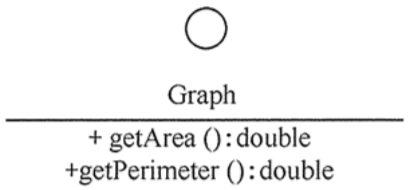 

#### 关系

> 由上至下，依次由弱至强

+ 依赖关系

  + 描述

    + 最弱的关系
    + 临时的关系，在代码中体现为：局部变量、方法参数、对静态⽅法的调⽤来访问另⼀个类（被依 赖类）中的某些⽅法来完成⼀些职责

  + 表示

    + 带箭头的虚线

      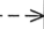 

    + 箭头从使用类指向被依赖的类

+ 关联关系

  关联关系在代码中体现为成员变量

  + 一般关联

    + 描述

      + 较弱的关联关系
      + 可以是单向的或双向的

    + 表示

      + 双向的关联可以⽤带两个箭头或者没有箭头的实线来表示
      + 单向的关联⽤带⼀个箭头的 实线来表示，箭头从使⽤类指向被关联的类。
      + 也可以在关联线的两端标注⻆⾊名

       

  + 聚合关系

    + 描述

      + 整体与部分之间的关系（has a）
      + 整体与部分可以单独存在

    + 表示

      + 带空心菱形的实线
      + 菱形指向整体

       

  + 组合关系

    + 描述

      + 整体与部分之间的关系（contain a）
      + 整体与部分不可以单独存在

    + 表示

      + 带实心菱形的实线
      + 菱形指向整体

       

+ 实现关系

  + 描述

    + 接口与是实现类之间的关系

  + 表示

    + 带空心三角箭头的虚线表示
    + 箭头指向接口

    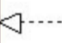 

+ 泛化关系（继承）

  + 描述

    + 子类与父类之间的关系
    + 最强的关系
    + 要尽量避免使用泛化关系

  + 表示

    + 带空心三角箭头的实线表示
    + 箭头指向父类

     

### 七大设计原则

| 设计原则名称                                       | 定义                                              | 使用频率 |
| -------------------------------------------------- | ------------------------------------------------- | -------- |
| 单⼀职责原则(Single Responsibility Principle, SRP) | ⼀个类只负责⼀个功能领域中的相应职责              | ★★★★☆    |
| 开闭原则(Open-Closed Principle, OCP)               | 软件实体应对扩展开放，⽽对修改关闭                | ★★★★★    |
| ⾥⽒代换原则(Liskov Substitution Principle, LSP)   | 所有引⽤基类对象的地⽅能够透明地使 ⽤其⼦类的对象 | ★★★★★    |
| 依赖倒转原则(Dependence Inversion Principle, DIP)  | 抽象不应该依赖于细节，细节应该依赖 于抽象         | ★★★★★    |
| 接⼝隔离原则(Interface Segregation Principle, ISP) | 使⽤多个专⻔的接⼝，⽽不使⽤单⼀的 总接⼝         | ★★☆☆☆    |
| 合成复⽤原则(Composite Reuse Principle, CRP)       | 尽量使⽤对象组合，⽽不是继承来达到 复⽤的⽬的     | ★★★★☆    |
| 迪⽶特法则(Law of Demeter, LoD)                    | ⼀个软件实体应当尽可能少地与其他实 体发⽣相互作⽤ | ★★★☆☆    |

#### 解析

+ 开闭原则

  + 尽量做到产生新需求时，不用修改已经写完的代码，通过增加代码满足新需求

  + 反例

    ```java
    // 下面代码在新增1个type时需要新增1个if，违反了开闭原则
    if (type.equals("pie")) {
     PieChart chart = new PieChart();
     chart.display();
    }else if (type.equals("bar")) {
     BarChart chart = new BarChart();
     chart.display();
    }
    ```

+ 里氏替换原则

  + 描述的是继承关系
  + 父类已经实现的方法子类不要重写了
  + 不要破坏继承体系

+ 依赖倒转原则

  + 面向接口编程，而不要面向实现的细节编程

+ 合成复用原则

  + 避免使用`泛化关系`，尽量使用`关联关系`

+ 迪米特法则

  + 不要和隔了一层的对象直接发生关系，降低耦合度

#### 描述

+ 所有其他原则都是为了保证`开闭原则`
+ 根本目的是提高`可维护性`和`可复用性`

### 23种设计模式

> 设计模式分为3类23种：
>
> + 创建型
>   + 简单工厂模式
>   + 工厂方法模式
>   + 抽象工厂模式
>   + 单例模式（重点）
>   + 原型模式
>   + 构建者模式
> + 结构性
>   + 适配器模式
>   + 装饰模式
>   + 代理模式（重点）
>   + 外观模式
>   + 桥接模式
>   + 组合模式
>   + 享元模式
> + 行为型
>   + 模板方法模式
>   + 策略模式
>   + 观察者模式
>   + 中介者模式
>   + 状态模式
>   + 责任链模式
>   + 命令模式
>   + 迭代器模式
>   + 访问者模式
>   + 解释器模式
>   + 备忘录模式

#### 简单工厂模式

+ 描述

  + 1个工厂类，通过不同的方法或不同的参数，生产对应的对象

+ 例

  + 普通简单工厂

    ```java
    public class AnimalFactory {
        //简单⼯⼚设计模式（负担太重、不符合开闭原则）
        public static Animal createAnimal(String name){
            if ("cat".equals(name)) {
                return new Cat();
            }else if ("dog".equals(name)) {
                return new Dog();
            }else if ("cow".equals(name)) {
                return new Cow();
            }else{
                return null;
            }
        }
    }
    ```

  + 静态方法工厂

    ```java
    //该简单⼯⼚，也称为静态⽅法⼯⼚
    public class AnimalFactory2 {
        public static Dog createDog(){
            return new Dog();
        }
    
        public static Cat createCat(){
            return new Cat();
        }
    }
    ```

+ 优缺点

  + 优点

    简单粗暴

  + 缺点

    + 违反开闭原则
    + 负担太重，代码越来越多
  
+ 问题（TODO）

  + `BeanFactory`为什么算简单工厂

#### 工厂方法模式

+ 描述

  + 先定义好所有工厂要实现的方法
  + 每个工厂继承上面的类，去做各自的实现

+ 例

  ```java
  // 抽象出来的动物⼯⼚----它只负责⽣产⼀种产品
  public abstract class AnimalFactory {
      // ⼯⼚⽅法
      public abstract Animal createAnimal();
  }
  
  // 具体的⼯⼚实现类
  public class CatFactory extends AnimalFactory {
      @Override
      public Animal createAnimal() {
          return new Cat();
      }
  }
  
  //具体的⼯⼚实现类
  public class DogFactory extends AnimalFactory {
      @Override
      public Animal createAnimal() {
          return new Dog();
      }
  }
  ```

+ 优缺点

  + 优点
    + 符合开闭原则
    + 代码分散给各自的工厂
  + 缺点
    + 无法满足生产一系列产品

#### 抽象工厂模式

+ 描述
  + `抽象工厂`就是在`工厂方法`的基础上，可以定义多个生产产品的方法

#### 单例模式（重点）

##### 懒汉、饿汉

+ 懒汉
  + 定义：需要的时候再加载
  + 优缺点：
    + 节省内存空间
    + 存在线程安全问题
  + 面试问的一定是懒汉式
  + 懒汉式创建单例对象一共有3种方式：
    + 双重检查锁
    + 静态内部类
    + 枚举
+ 饿汉：程序启动时立即加载
  + 浪费内存空间
  + 没有线程安全问题
  + 一般不被使用

##### 饿汉式

```java
public class Student1 {
    private static Student1 student = new Student1();

    private Student1() {
    }

    public static Student1 getSingletonInstance() {
        return student;
    }
}
```

##### 双重检查锁

+ demo

  ```java
  public class DoubleCheckLockSingleton {
      private static volatile DoubleCheckLockSingleton instance = null;
      
      public static DoubleCheckLockSingleton getInstance() {
          if (instance == null) {
              synchronized (DoubleCheckLockSingleton.class) {
                  if (instance == null) {
                      instance = new DoubleCheckLockSingleton();
                  }
              }
          }
          return instance;
      }
  }
  ```

+ volatile

  + 作用

    + 禁止指令重排
    + 保证可见性

  + 指令重排

    `instance = new DoubleCheckLockSingleton();`这一行代码在`cpu`执行时会被拆分成多条指令，如：

    1. 申请内存空间
    2. 对象初始化
    3. 地址赋值给`instance`变量

    但是`cpu`在执行时，会进行指令重排，上面3个步骤可能会被重拍成如下步骤：

    1. 申请内存空间
    2. 地址赋值给`instance`变量
    3. 对象初始化

    如果线程1执行完第2步时，时间片到期，将cpu交给线程2，而线程2执行到第一遍的`if (instance == null)`,发现`instance`不为`null`，会立即返回并进行使用，而此时`instance`对象并未完成第3步的准备工作，导致使用该对象时程序报错

  + 可见性

    CPU操作内存中变量时，变量会先被加载到CPU的寄存器中，再进行操作；当多核CPU同时操作同1个变量时，会出现1个CPU寄存器中变量值被改变时，其他COU寄存器不知道，导致变量值出错

     

    当变量`y`被`volatile`修饰时，变量`y`的值会通过`MESI(内存数据一致性协议)`被及时同步到内存和其他CPU寄存器中，来保证可见性

+ 并不安全，会被`反射攻击`和`序列化攻击`

##### 静态内部类

+ demo

  ```java
  public class StaticInnerHolderSingleton {
      // 静态内部类
      private static class SingletonHolder {
          private static final StaticInnerHolderSingleton INSTANCE =
              new StaticInnerHolderSingleton();
      }
      
      public static StaticInnerHolderSingleton getInstance() {
          return SingletonHolder.INSTANCE;
      }
  }
  ```

+ 因为`SingletonHolder`是静态内部类，所以只有在**第一次使用时**，这个类才会被加载，它的静态成员变量才会被初始化

+ 并不安全，会被`反射攻击`和`序列化攻击`

##### 枚举

+ demo

  ```java
  public enum EnumSingleton {
      INSTANCE;
      // 虽然类的类型是枚举，但是类该有的特性他都有，所以并不影响功能使用
      public void tellEveryone() {
          System.out.println("This is an EnumSingleton " + this.hashCode());
      }
  }
  ```

+ 最安全的单例对象创建方式，天然防御`反射攻击`和`序列化攻击`

##### 反射攻击

```java
public class SingletonAttack{
    public static void reflectionAttack() throws Exception {
        //通过反射，获取单例类的私有构造器
        Constructor constructor = DoubleCheckLockSingleton.class.getDeclaredConstructor();
        //设置私有成员的暴⼒破解
        constructor.setAccessible(true);
        // 通过反射去创建单例类的多个不同的实例
        DoubleCheckLockSingleton s1 = (DoubleCheckLockSingleton)constructor.newInstance();
        // 通过反射去创建单例类的多个不同的实例
        DoubleCheckLockSingleton s2 = (DoubleCheckLockSingleton)constructor.newInstance();
        System.out.println(s1 == s2);
    }
}
```

##### 序列化攻击

+ 序列化攻击仅针对实现了`Serializable`接口的类，将对象序列化之后再反序列化回来的方式进行攻击

+ demo

  ```java
  public class SingletonAttack {
      public static void serializationAttack() throws Exception {
          DoubleCheckLockSingleton s1 = DoubleCheckLockSingleton.getInstance();
          // 序列化
          ObjectOutputStream outputStream = new ObjectOutputStream(new FileOutputStream("serFile"));
          outputStream.writeObject(s1);
          // 反序列化
          ObjectInputStream inputStream = new ObjectInputStream(new FileInputStream(new File("serFile")));
          DoubleCheckLockSingleton s2 = (DoubleCheckLockSingleton)inputStream.readObject();
          System.out.println(s1 == s2);
      }
  }
  ```

+ 防御

  在反序列化时比然后调用`inputStream.readObject()`这行代码，而这行代码里会判断是否存在`readResolve`方法，如果存在直接使用该方法返回值作为反序列化的结果，所以我们只需要重写`readResolve`方法并返回单例对象即可进行防御

  ```java
  private Object readResolve() {
   return instance;
  }
  ```

#### 设计模式总结

##### 工厂模式

+ 简单工厂： 使⽤⼀个⼯⼚对象⽤来⽣产同⼀等级结构中的任意产品。（不⽀持拓展增加产品） 
+ ⼯⼚⽅法 ： 使⽤多个⼯⼚对象⽤来⽣产同⼀等级结构中对应的固定产品。（⽀持拓展增加产品） 
+ 抽象⼯⼚ ： 使⽤多个⼯⼚对象⽤来⽣产不同产品族的全部产品。（不⽀持拓展增加产品；⽀持增 加产品族）

# 0930-手写IOC.v3(1)

## BeanFactory继承体系

 

> 参见[CSDN](https://blog.csdn.net/u013412772/category_9273433.html) 

+ BeanFactory

  + 接口
  + Spring bean容器的根接口.提供获取bean,是否包含bean,是否单例与原型,获取bean类型,bean别名的api

+ ListableBeanFactory

  + 接口
  + 提供容器内bean实例的枚举功能，可列表化操作
  + 该接口中的方法只考虑自己管理Bean，其他的都不考虑，比如：
    + 父类中管理的Bean（即使实现了`HierarchicalBeanFactory`）
    + `ConfigurableBeanFactory`的`registerSingleton`注册的单例bean（getBeanNamesOfType和getBeansOfType是除外）

+ AutowireCapableBeanFactory

  + 接口
  + 添加框架集成功能，扩展了自动装配的功能，根据类定义BeanDefinition装配Bean、执行前、后处理器等。

+ HierarchicalBeanFactory

  + 接口
  + 提供父容器的访问功能

+ ConfigurableBeanFactory

  + 接口
  + 定义`BeanFactory`的配置方法

+ SingletonBeanRegistry

  + 接口

  + 单例Bean都存储到该类中进行管理

+ AliasRegistry

  + 接口
  + 用于操作Bean的别名

+ BeanDefinitionRegistry

  + 接口
  + Bean的描述信息都在该类中进行管理

+ DefaultListableBeanFactory

  + 类
  + 集大成者，我们最终使用的是该类

+ 其他

  + 对于上图中的2个抽象类，都是各自实现了接口或父抽象类中的方法，并定义了新的接口方法留给子类去实现，这体现了`抽象模板方法`的设计模式
  + 其他的暂不介绍

# 1009-源码阅读

## 阅读源码

### 方法

1. 带着目的阅读源码
   + 找到阅读主流程
   + 找到程序入口（一般就是自己代码调用的地方）
   + 分清主次（不要轻易进入旁支流程）
2. 借鉴别人的经验阅读
3. 注意阅读源码的层次
   + 第一步：搞清处理流程
   + 第二部：理解设计模式
4. 源码debug
5. 使用翻译工具
6. 总结
   + 记笔记
   + 记录调用栈的方法路径

### 源码导入

+ 务必按照[Spring源码导入.pdf](./2020-09-30（手写IOC.v3）/课件/19期Spring 0930/Spring源码导入.pdf)中的步骤导入源码[spring-framework-5.1.x](./2020-09-30（手写IOC.v3）/课件/19期Spring 0930/spring-framework-5.1.x)  
+ 源码导入后`build project`还是会报错，但是测试用例可以正常运行，可以先不管

# 1012-AOP

## 概念

+ Pointcut（切入点）

  + 对要拦截的连接点进行描述的对象
  + 如定义1个切入点表达式`execution(* com.kkb..*ServiceImpl.*(..))`,该表达式匹配到的方法都会被拦截，那将这个切入点表达式及相关信息封装为1个对象，这个对象就是个切入点

+ Joinpoint（连接点）

  + 被拦截的方法

  + 切入点表达式拦截到的，某个具体的方法，就是连接点，如上面表达式匹配到了如下方法：

    `void com.kkb.service.UserServiceImpl.add()`,则这个具体的方法就是1个连接点

+ Advice（通知/增强）

  + 连接点周围增强的内容

  + 通过切入点找到连接点之后，需要在连接点周围执行要增强的方法，将这些方法封装成对象，这个对象就是通知（增强）

  + 分类

    + 前置通知
    + 后置通知
    + 返回通知
    + 环绕通知
    + 异常通知

+ Aspect（切面）

  + （切入点 + 通知） * n = 切面

+ Advisor（通知器、顾问）

  + 概念同`切面`

+ Weaving（织入）

  + 上面定义好了切面，但是这些还仅仅是描述信息；真正实现在调用切入点匹配到的方法前后，执行对应的通知代码，还需要一些技术手段；通过技术手段真正实现这个功能的过程，叫做织入
  + 如：使用JDK的动态代理技术，生成动态代理类，动态代理类实现了被代理类的所有接口，具有相同的方法，动态代理类中持有被代理对象，在动态代理类的方法中加入通知代码，并调用对应的被代理对象的方法；这种通过JDK动态代理技术实现增强的过程就叫织入
  + 织入分为：
    + 动态织入：主要靠JDK动态代理、CGLib动态代理实现
    + 静态织入：手动编写代理类（静态代理）

+ Proxy（代理对象）

  + 通过动态代理或者静态代理产生的代理类实例化出来的对象

+ Target（目标对象）

  + `切入点`匹配到的类，实例化出来的具体的对象，就是目标对象，目标对象也就是需要被代理的对象
  + JDK动态代理产生的代理对象中持有目标对象；CGLib动态代理实现该功能时，代理对象和目标对象是同一个对象（动态代理类是目标类的子类）

+ Introduction（引介）

## 动态代理

### JDK动态代理

#### 概述

+ 原理
  + 通过反射获取目标类实现的所有接口
  + 通过字符串拼接的方式，拼接出需要的动态代理类中的代码；代理类实现了和目标类相同的接口，并实现了接口中所有方法，并且持有目标对象，代理类中的方法调用了`InvocationHandler`的`invoke`方法，来实现对目标对象中对应方法及增强代码的调用
  + 生成1个名为`$Proxy[随机数]`的`java`文件，将刚才拼接出来的代理类的内容写入该文件
  + 将生成的`java`文件编译成`class`文件
  + 通过`ClassLoader`将`class`文件加载到`jvm`
  + 生成代理对象
+ JDK动态代理只能代理实现了接口的类，并且只能拦截接口中的方法
+ 代理类和目标类实现了相同的接口，是同级关系

#### demo

```java
public class JDKProxyFactory implements InvocationHandler {
    // ⽬标对象的引⽤
    private Object target;
    // 通过构造⽅法将⽬标对象注⼊到代理对象中
    public JDKProxyFactory(Object target) {
        this.target = target;
    }

    // 只能为实现了接⼝的类产⽣代理对象
    public Object getProxy() {
        // 1.⽬标类的类加载器
        // 2.⽬标类的接⼝集合
        // 3.代理对象被调⽤时的调⽤处理器
        Object proxy = Proxy.newProxyInstance(target.getClass().getClassLoader(),
                                              target.getClass().getInterfaces(),
                                              this);
        return proxy;
    }
    /**
     * 代理对象会执⾏的⽅法
     * 1.代理对象
     * 2.⽬标对象⽅法
     * 3.⽅法参数
     */
    @Override
    public Object invoke(Object proxy, Method method, Object[] args) throws Throwable {
        // 增强代码....
        Object returnValue = method.invoke(target, args);
        // 增强代码....
        return returnValue;
    }
}
```

#### 生成的代理类demo

这个自动生成的类是看不见的，这个代码是演示

```java
public class $Proxy11 implements UserService {

	private InvocationHandler h;

	public $Proxy11(InvocationHandler h) {
		this.h = h;
	}

	// saveUser对应的方法对象
	private static Method m1;

	// 可以通过反射获取每个接口的方法声明
	@Override
	public void saveUser() {
		try {
			this.h.invoke(this,m1,null);
		} catch (Throwable throwable) {
			throwable.printStackTrace();
		}
	}

	static {
		try {
			m1 = Class.forName("com.kkb.UserService").getDeclaredMethod("saveUser");
		} catch (NoSuchMethodException e) {
			e.printStackTrace();
		} catch (ClassNotFoundException e) {
			e.printStackTrace();
		}
	}
}
```

可以看见，代理类中所有方法调用的都是`InvocationHandler`的`invoke`方法，所以这个`invoke`方法的内容才是核心，增强的内容都在这个方法中

### CGLib动态代理

#### 概述

+ CGLib是第三方jar包
+ 底层依赖`ASM`工具包操作`class`字节码文件
+ 原理
  + 通过字符串拼接方式生成1个目标类的子类作为代理类；代理类中重写了目标类中需要代理的方法，代理类的方法通过调用`MethodInterceptor`的`intercept`方法，来调用了父类的对应方法及增强代码
  + 生成1个`class`文件，将刚才拼接出来的代码写入该文件
  + 通过`ClassLoader`加载该文件并生成代理对象
+ CGLib能代理所有非`final`类，拦截所有方法
+ 目标类与代理类是父子关系

#### demo

```java
public class CgLibProxyFactory implements MethodInterceptor {

    public Object getProxy(Class clazz) {
        // 创建增强器
        Enhancer enhancer = new Enhancer();
        // 设置需要增强的类的类对象
        enhancer.setSuperclass(clazz);
        // 设置回调函数
        enhancer.setCallback(this);
        // 获取增强之后的代理对象
        return enhancer.create();
    }
    /***
     * Object proxy:这是代理对象，也就是[⽬标对象]的⼦类
     * Method method:[⽬标对象]的⽅法
     * Object[] arg:参数
     * MethodProxy methodProxy：代理对象的⽅法
     */
    @Override
    public Object intercept(Object proxy, Method method, Object[] arg,MethodProxy methodProxy) throws Throwable {
        // 增强代码....
        // 通过调⽤⼦类[代理类]的invokeSuper⽅法，去实际调⽤[⽬标对象]的⽅法
        Object returnValue = methodProxy.invokeSuper(proxy, arg);
        // 增强代码....
        return returnValue;
    }
}
```


### 区别

+ JDK动态代理是Java自带的，CGLib是第三方jar包
+ JDK动态代理只能代理实现了接口的类，并且只能拦截接口中的方法；CGLib能代理所有非`final`类，拦截所有方法
+ spring优先使用JDK动态代理，没有接口的类才会使用CGLib，也可以手动指定为CGLib
+ JDK动态代理中，目标类与代理类是同级关系；CGLib动态代理中，目标类与代理类是父子关系
+ jdk1.8之前，CGLib性能更好，jdk1.8以后，JDK动态代理性能更好

## 源码

### 核心类

#### MethodInvocation

+ `Joinpoint`的子接口
+ 实现了拦截器链式调用

#### ClassFilter

+ 根据切入点表达式匹配目标类

#### MethodMatcher

+ 根据切入点表达式匹配目标方法

### 解读

aop源码处理流程分为如下几步：

+ 加载xml配置文件（省略）
+ 根据xml配置文件中的标签查找对应的`BeanDefinitionParser`
+ 执行`BeanDefinitionParser`对所有标签进行处理，转换成对应的`BeanDefinition`
+ 产生aop代理对象
+ 代理对象执行

#### `ApplicationContext`创建

AbstractGenericContextLoader#loadContext

```java
@Override
public final ConfigurableApplicationContext loadContext(MergedContextConfiguration mergedConfig) throws Exception {
    // 其他工作
    ...
    // 加载BeanDefinition
    loadBeanDefinitions(context, mergedConfig);
    // 根据前面的配置刷新 applicationContext（包括Bean的创建）
    context.refresh();
    // 其他工作
    ...
    return context;
}
```

上面5步流程的前三步，都是在`loadBeanDefinitions(context, mergedConfig);`中完成的

第4步是在`context.refresh();`中完成的

#### 查找`BeanDefinitionParser`

##### 入口

> DefaultBeanDefinitionDocumentReader#parseBeanDefinitions 

##### 流程图

 


##### 总结

+ 当遇见`<aop:config >`标签时，根据`:`左边的字符串`aop`在根标签`<beans></beans>`中查找对应的命名空间

  `xmlns:aop="http://www.springframework.org/schema/aop"`

+ 根据明明空间在`resources/META-INF/spring.handlers`中查找对应的命名空间处理器

  `http\://www.springframework.org/schema/aop=org.springframework.aop.config.AopNamespaceHandler`

+ 在处理类中根据`:`右边字符串查找对应的`BeanDefinitionParser`

  ```java
  // <aop:config>
  registerBeanDefinitionParser("config", new ConfigBeanDefinitionParser());
  ```

#### 执行`BeanDefinitionParser`

##### 入口

> 上面找到的`BeanDefinitionParser`的`parse`方法

##### 总结

最终解析出`AspectJAwareAdvisorAutoProxyCreator`的`BeanDefinition`对象注入到IOC容器

`AspectJAwareAdvisorAutoProxyCreator`的`BeanDefinition`中又包含了解析出来的下面这些`BeanDefinition`:

+ 切面
  + AspectJPointcutAdvisor
  + DefaultBeanFactoryPointcutAdvisor
+ 切入点
  + AspectJExpressionPointcut
+ 通知
  + AspectJMethodBeforeAdvice
  + AspectJAfterAdvice
  + AspectJAfterReturningAdvice
  + AspectJAfterThrowingAdvice
  + AspectJAroundAdvice
+ ⽤于产⽣⾃定义增强类实例的类对应的`BeanDefinition`实例⼯⼚
  + SimpleBeanFactoryAwareAspectInstanceFactory
+ ⽤于调⽤⾃定义增强类⽅法对应的`BeanDefinition`
  + MethodLocatingFactoryBean

`AspectJAwareAdvisorAutoProxyCreator`是代理对象创建器，用户代理对象创建

# 1016-AOP代理对象创建执行

## 代理对象创建

+ 前面讲过，在`AbstractGenericContextLoader#loadContext`中会先加载`beandefinition`，然后执行`context.refresh()`创建Bean

+ 在`AbstractApplicationContext#refresh`方法中有如下代码：

  ```java
  @Override
  public void  refresh() throws BeansException, IllegalStateException {
      synchronized (this.startupShutdownMonitor) {
          // 其他工作
          ...
          try {
              // 其他工作
              ...
              //注册bean的后置处理器来方便拦截bean的创建
              registerBeanPostProcessors(beanFactory);
              // 其他工作
              ...
              // 11.bean工厂初始化(创建非懒加载单例bean)
              finishBeanFactoryInitialization(beanFactory);
              // 其他工作
              ...
          } catch (BeansException ex) {
              // 其他工作
              ...
          } finally {
              // 其他工作
              ...
          }
      }
  }
  ```

  通过这段代码我们可以看到：

  + 先执行`registerBeanPostProcessors(beanFactory);`，注册了所有类型为`BeanPostProcessor`的`bean`

    前面我们说过，在加载`BeanDefinition`时，加载了1个创建`AspectJAwareAdvisorAutoProxyCreator`的`BeanDefinition`（参见[执行`BeanDefinitionParser`](#执行`BeanDefinitionParser`)）；`AspectJAwareAdvisorAutoProxyCreator`实现了`BeanPostProcessor`接口，所以`AspectJAwareAdvisorAutoProxyCreator`实例在这步就被创建出来了

  + 然后进行`bean`工厂初始化，其中包括单例`bean`的创建

+ `BenPostProcessor`创建完成后，开始进行`bean`工厂初始化，其中包括单例`bean`的创建

  在`ioc`的课程中我们讲过`Bean`的创建流程为：
  + bean的实例化
  + 依赖注入
  + bean的初始化(`AbstractAutowireCapableBeanFactory # initializeBean`)

  在bean的初始化方法(`AbstractAutowireCapableBeanFactory # initializeBean`)中包含如下代码：

  ```java
  try {
      //执行初始化方法（先调用InitializingBean的afterPropertiesSet，再调用init-method属性指定的初始化方法）
      invokeInitMethods(beanName, wrappedBean, mbd);
  }
  catch (Throwable ex) {
      // 其他工作.....
  }
  if (mbd == null || !mbd.isSynthetic()) {
      //应用BeanPostProcessor的postProcessAfterInitialization方法(AOP代理对象生成)
      wrappedBean = applyBeanPostProcessorsAfterInitialization(wrappedBean, beanName);
  }
  
  return wrappedBean;
  ```

  此时可以看见，每个`bean`创建完成后，都会执行`applyBeanPostProcessorsAfterInitialization(wrappedBean, beanName);`来走一遍所有的`BeanPostProcessor`，其中就包括负责创建代理对象的`AspectJAwareAdvisorAutoProxyCreator`

+ `AspectJAwareAdvisorAutoProxyCreator`中`BeanPostProcessor`的接口方法`postProcessAfterInitialization`（实际是在抽象父类`AbstractAutoProxyCreator`中实现）如下：

  ```java
  if (bean != null) {
      Object cacheKey = getCacheKey(bean.getClass(), beanName);
      if (this.earlyProxyReferences.remove(cacheKey) != bean) {
          ////如果需要的情况下进行包装
          return wrapIfNecessary(bean, beanName, cacheKey);
      }
  }
  return bean;
  ```

+ `wrapIfNecessary`方法如下：

  ```java
  protected Object wrapIfNecessary(Object bean, String beanName, Object cacheKey) {
      // 其他...
      
      // 从所有Advisor中找到匹配的
      Object[] specificInterceptors = getAdvicesAndAdvisorsForBean(bean.getClass(), beanName, null);
  
      // 对相应的advisor不为空才采取代理
      if (specificInterceptors != DO_NOT_PROXY) {//如果这个bean有增强器,就不为空,
          this.advisedBeans.put(cacheKey, Boolean.TRUE);//把当前已经增强过的bean保存到,保存当前bean在advisedBeans中
          // 通过jdk动态代理或者cglib动态代，产理生代理对象
          // 第三步：针对目标对象产生代理对象
          //如果当前bean有了增强器,那么就创建代理对象,增强此bean(如果当前bean需要增强，创建当前bean的代理对象)
  
          //点击进入 createProxy跟进去,看如何创建代理对象
          Object proxy = createProxy(
              bean.getClass(), beanName, specificInterceptors, new SingletonTargetSource(bean));
          // 放入代理类型缓存
          this.proxyTypes.put(cacheKey, proxy.getClass());
          return proxy;
      }
      // 放入通知缓存
      this.advisedBeans.put(cacheKey, Boolean.FALSE);
      return bean;
  }
  ```

  + `getAdvicesAndAdvisorsForBean`这一步是根据切入点表达式，找到所有匹配的`Advisor`

    这一步跟下去，最终会跟到`AopUtils#canApply`这个方法（223行）

    ```java
    // 获取 ClassFilter 用来匹配类
    if (!pc.getClassFilter().matches(targetClass)) {
        return false;
    }
    // 获取 MethodMatcher 用来匹配方法
    MethodMatcher methodMatcher = pc.getMethodMatcher();
    ```

  + 代理对象创建在`Object proxy = createProxy(bean.getClass(), beanName, specificInterceptors, new SingletonTargetSource(bean));`这一步

  + createProxy

    这个方法中做了如下几件事：

    + 新建代理工厂（`ProxyFactory`）并进行配置
    + 将代理对象封装到`ProxyFactory`中
    + 使用`ProxyFactory`创建代理对象并返回

+ `ProxyFactory#getProxy`

  我们先看下`ProxyFactory`的继承关系：

  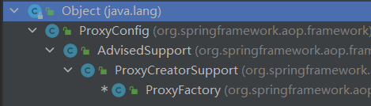 

  然后看下`ProxyFactory#getProxy`方法：

  ```java
  public Object getProxy(@Nullable ClassLoader classLoader) {
      return createAopProxy().getProxy(classLoader);
  }
  ```

  这里先创建了代理类`createAopProxy()`，然后获取代理对象`getProxy(classLoader)`

  + `createAopProxy()`跟下去，调用了其父类的`ProxyCreatorSupport#createAopProxy`方法

    ```java
    protected final synchronized AopProxy createAopProxy() {
        if (!this.active) {
            activate();
        }
        // 创建JDK方式的AOP代理或者CGLib方式的AOP代理
        return getAopProxyFactory().createAopProxy(this);
    }
    ```

    这里我们关注的是`createAopProxy(this)`这句话，点进去进到了`DefaultAopProxyFactory#createAopProxy`

    ```java
    @Override
    public AopProxy createAopProxy(AdvisedSupport config) throws AopConfigException {
        if (config.isOptimize() || config.isProxyTargetClass() || hasNoUserSuppliedProxyInterfaces(config)) {
            Class<?> targetClass = config.getTargetClass();
            if (targetClass == null) {
                throw new AopConfigException("TargetSource cannot determine target class: " +
                                             "Either an interface or a target is required for proxy creation.");
            }
            // 如果目标类是接口或者目标类是Proxy的子类，则使用JDK动态代理方式
            if (targetClass.isInterface() || Proxy.isProxyClass(targetClass)) {
                return new JdkDynamicAopProxy(config);
            }
            // 使用Cglib动态代理
            return new ObjenesisCglibAopProxy(config);
        }
        else {
            // 默认使用JDK动态代理
            return new JdkDynamicAopProxy(config);
        }
    }
    ```

    `DefaultAopProxyFactory#createAopProxy`判断了是使用JDK动态代理（`JdkDynamicAopProxy`）还是CGLib动态代理（`ObjenesisCglibAopProxy`）

  + 根据`createAopProxy`返回的动态代理类不同，调用的是不同的类中的`getProxy`方法，下面以`JdkDynamicAopProxy#getProxy`为例

+ `JdkDynamicAopProxy#getProxy`

  ```java
  @Override
  public Object getProxy(@Nullable ClassLoader classLoader) {
      if (logger.isDebugEnabled()) {
          logger.debug("Creating JDK dynamic proxy: target source is " + this.advised.getTargetSource());
      }
      // 获取完整的代理接口
      Class<?>[] proxiedInterfaces = AopProxyUtils.completeProxiedInterfaces(this.advised, true);
      findDefinedEqualsAndHashCodeMethods(proxiedInterfaces);
      // 调用JDK动态代理方法
      return Proxy.newProxyInstance(classLoader, proxiedInterfaces, this);
  }
  ```

  最后一行，`newProxyInstance`的第三个参数是当前对象，则代理对象执行的时候，调用的其实是当前对象中的`invoke`方法`JdkDynamicAopProxy#invoke`（参见[JDK动态代理](#JDK动态代理)） 

+ 最终返回值就是创建后的代理对象，最终保存在IOC容器中的，其实是这个代理对象了

+ `Advisor`如何保存在代理对象中？

  `ProxyCreatorSupport#createAopProxy`方法中，`createAopProxy`的参数是`this`，而当前对象仍然是`AbstractAutoProxyCreator#createProxy`中创建的局部变量`ProxyFactory`，并且前面我们把匹配到的所有`Advisor`交给它保存了，而这个`ProxyFactory`对象，最终成为了`JdkDynamicAopProxy`的构造方法参数，下面看下`JdkDynamicAopProxy`的构造方法

  ```java
  public JdkDynamicAopProxy(AdvisedSupport config) throws AopConfigException {
      Assert.notNull(config, "AdvisedSupport must not be null");
      if (config.getAdvisors().length == 0 && config.getTargetSource() == AdvisedSupport.EMPTY_TARGET_SOURCE) {
          throw new AopConfigException("No advisors and no TargetSource specified");
      }
      this.advised = config;
  }
  ```

  可以看到，`JdkDynamicAopProxy`对象将`ProxyFactory`对象保存起来了，而`JdkDynamicAopProxy#getProxy`方法中，又将`JdkDynamicAopProxy`对象作为`InvocationHandler`传给了最终的代理对象

  代理对象执行时，调用的其实是`InvocationHandler#invoke`方法，在这里就是`JdkDynamicAopProxy#invoke`方法，而`JdkDynamicAopProxy`对象中保存`ProxyFactory`对象，`ProxyFactory`对象中保存了所有匹配到的`Advisor`

## 代理对象执行

+ [JDK动态代理](#JDK动态代理)中得知，代理对象执行时，调用的是`InvocationHandler#invoke`方法，这里对应的是`JdkDynamicAopProxy#invoke`，代码如下

  ```java
  @Override
  @Nullable
  public Object invoke(Object proxy, Method method, Object[] args) throws Throwable {
      MethodInvocation invocation;
      // 其他 ......
      try{
          // 其他 ......
          // 将所有的 Advisor 转换为 MethodInterceptor
          List<Object> chain = this.advised.getInterceptorsAndDynamicInterceptionAdvice(method, targetClass);
          if (chain.isEmpty()) {
              // 处理可变长参数
              Object[] argsToUse = AopProxyUtils.adaptArgumentsIfNecessary(method, args);
              // 通过反射调用目标对象的方法，此时没有进行功能增强
              retVal = AopUtils.invokeJoinpointUsingReflection(target, method, argsToUse);
          } else {
              // 我们需要创建一个方法调用
              invocation = new ReflectiveMethodInvocation(proxy, target, method, args, targetClass, chain);
              // 开始执行AOP的拦截过程
              retVal = invocation.proceed();
          }
          // 其他 ......
      }finally{
          // 其他 ......
      }
  }
  ```

+ 上面代码中，我们关注`List<Object> chain = this.advised.getInterceptorsAndDynamicInterceptionAdvice(method, targetClass);`这句话

  `this.advised`其实就是构造时传入的`ProxyFactory`，其中保存了所有匹配的`Advisor`

  跟进`getInterceptorsAndDynamicInterceptionAdvice`

  ```java
  public List<Object> getInterceptorsAndDynamicInterceptionAdvice(Method method, @Nullable Class<?> targetClass) {
      MethodCacheKey cacheKey = new MethodCacheKey(method);
      List<Object> cached = this.methodCache.get(cacheKey);
      if (cached == null) {
          //从advisorChainFactory拦截器链工厂获取div 方法的拦截器键，跟进方法
          cached = this.advisorChainFactory.getInterceptorsAndDynamicInterceptionAdvice(//跟进方法
              this, method, targetClass);
          this.methodCache.put(cacheKey, cached);
      }
      return cached;
  }
  ```

  在跟进`this.advisorChainFactory.getInterceptorsAndDynamicInterceptionAdvice`，进到`DefaultAdvisorChainFactory#getInterceptorsAndDynamicInterceptionAdvice`，找到下面这行代码

  ```java
  MethodInterceptor[] interceptors = registry.getInterceptors(advisor);
  ```

  在跟进，进入`DefaultAdvisorAdapterRegistry#getInterceptors`

  ```java
  public MethodInterceptor[] getInterceptors(Advisor advisor) throws UnknownAdviceTypeException {
      List<MethodInterceptor> interceptors = new ArrayList<>(3);
      //CTRL+T查看一下类看是不是MethodInterceptor类型
      Advice advice = advisor.getAdvice();
      // 如果是advice是MethodInterceptor类型，则直接加到数组中
      if (advice instanceof MethodInterceptor) {
          interceptors.add((MethodInterceptor) advice);
      }
      // 使用AdvisorAdapter适配器对advice进行适配，如果适配成功，则将advisor适配成MethodInterceptor,放入集合中
      //有些advice不是实现MethodInterceptor接口,需要使用adapter进行包装转换,实际上就是加一个AfterReturningAdviceInterceptor后置通知进行
      for (AdvisorAdapter adapter : this.adapters) {//如果不是,需要AdvisorAdapter 适配器帮它转过来,将增强器转为interceptors
          if (adapter.supportsAdvice(advice)) {
              interceptors.add(adapter.getInterceptor(advisor));
          }
      }
      if (interceptors.isEmpty()) {
          throw new UnknownAdviceTypeException(advisor.getAdvice());
      }
      //把每个adivce转换成MethodIntereptor数组并返回,得到拦截器链(其实就是指每个通知方法又被包装为方法拦截 器,
      // 以后的方法的执行都是利用 MethodIntercpter机制执行)
      return interceptors.toArray(new MethodInterceptor[0]);
  }
  ```

  这里是判断一下`Advisor`是否本身是否是`MethodInterceptor`，如果是则直接强转放入数组返回；如果不是，则需要通过适配器逐个尝试，转换为`MethodInterceptor`，再放入数组返回（详见[`Advisor`转换`MethodInterceptor`](#`Advisor`转换`MethodInterceptor`)） 

+ `MethodInterceptor`链式调用

  + 这里采用了责任链模式

  + 我们再来关注`JdkDynamicAopProxy#invoke`中如下代码：

    ```java
    // 我们需要创建一个方法调用
    invocation = new ReflectiveMethodInvocation(proxy, target, method, args, targetClass, chain);
    // 开始执行AOP的拦截过程
    retVal = invocation.proceed();
    ```

    将代理对象、目标对象、`MethodInterceptor`等信息统统作为构造参数，创建出1个`ReflectiveMethodInvocation`对象，这个对象是负责链式调用的

  + 跟进`ReflectiveMethodInvocation#proceed`

    ```java
    public Object proceed() throws Throwable {
        //currentInterceptorIndex索引 默认为-1,记录当前拦截器索引
        if (this.currentInterceptorIndex == this.interceptorsAndDynamicMethodMatchers.size() - 1) {
            //如果没有拦截器执行执行目标方法，或者拦截器的索引和拦截器数组-1大小一样（指定到了最后一个拦截器）执行目标方法,比如最一个为5, -1 != 5-1
            return invokeJoinpoint();//如果不相同,表明不使用拦截器跟进会发现,最终是调了一个invoke反射
            //注：如果代码执行到这，表示前置通知已处理完，并执行完@Before注解的打印内容，开始准备调用目标方法
        }
    
        Object interceptorOrInterceptionAdvice =
            this.interceptorsAndDynamicMethodMatchers.get(++this.currentInterceptorIndex);//每次加1，取一个拦截器
        if (interceptorOrInterceptionAdvice instanceof InterceptorAndDynamicMethodMatcher) {
            // Evaluate dynamic method matcher here: static part will already have
            // been evaluated and found to match.
            InterceptorAndDynamicMethodMatcher dm =
                (InterceptorAndDynamicMethodMatcher) interceptorOrInterceptionAdvice;
            Class<?> targetClass = (this.targetClass != null ? this.targetClass : this.method.getDeclaringClass());
            if (dm.methodMatcher.matches(this.method, targetClass, this.arguments)) {
                return dm.interceptor.invoke(this);
            }
            else {
                // Dynamic matching failed.
                // Skip this interceptor and invoke the next in the chain.
                return proceed();
            }
        }
        else {
            // It's an interceptor, so we just invoke it: The pointcut will have
            // been evaluated statically before this object was constructed.
            //会调用此方法，this=CglibAopProxy,跟进去看
            return ((MethodInterceptor) interceptorOrInterceptionAdvice).invoke(this);
        }
    }
    ```

    + 这里是通过维护`MethodInterceptor`集合索引下标方式实现链式调用

    + 先调用第一个`MethodInterceptor`的`invoke`方法，将当前对象作为参数传入

    + `MethodInterceptor#invoke`方法中会在调用参数对象的`procced`方法（也就还是这个`ReflectiveMethodInvocation`对象的`procced`方法），但是因为`MethodInterceptor`集合的索引下标加1了，则会调用下一个`MethodInterceptor`，如此循环......
    + 直到所有`MethodInterceptor`调用结束，最后调用代理对象的方法，再原路返回

## `Advisor`转换`MethodInterceptor`


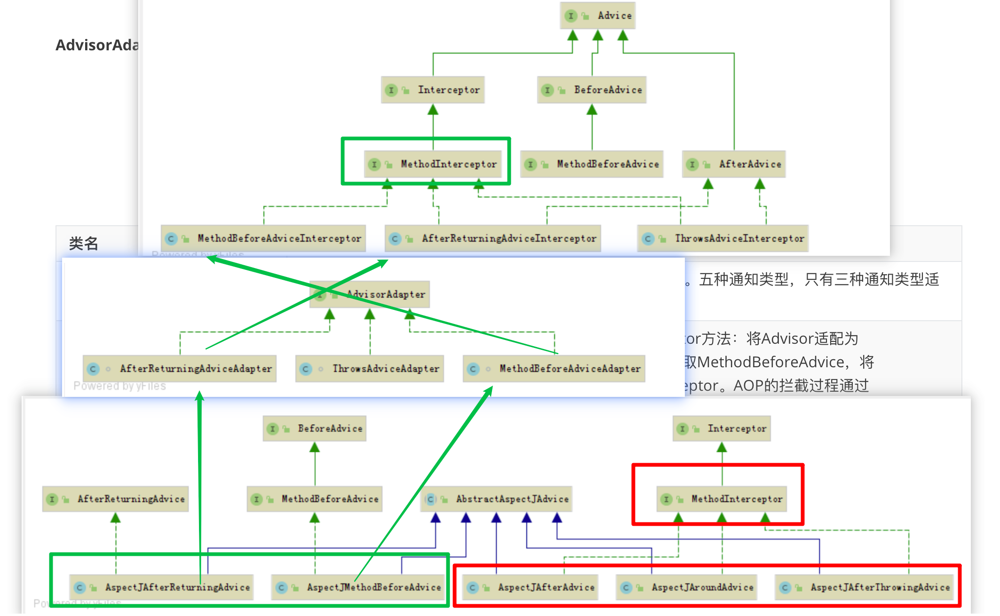 

上图可知

+ 5种通知中，`AspectJAfterAdvice`、`AspectJAroundAdvice`、`AspectJAfterThrowingAdvice`是实现了`MerhodInterceptor`接口的，所以直接进行转换
+ 而`AspectJMethodBeforeAdvice`、`AspectJAfterReturningAdvice`没有实现`MerhodInterceptor`接口，需要通过适配器才能进行转换
  + `AspectJMethodBeforeAdvice`需要通过`MethodBeforeAdvieAdapter`转换
  + `AspectJAfterReturningAdvice`需要通过`AfterReturningAdviceAdapter`转换

## 循环依赖

### 分类

+ 构造方法注入

  无法解决

+ setter方法注入

下面讲到解决的循环依赖问题，指的都是`setter方法注入`方式

### 三级缓存

spring通过三级缓存解决循环依赖问题

+ 一级缓存
  + Map<String, Object> singletonObjects
  + 存储已经创建好的单例bean
+ 二级缓存
  + Map<String, Object> earlySingletonObjects
  + 存储创建中的单例Bean
+ 三级缓存
  + Map<String, ObjectFactory<?>> singletonFactories
  + 存储创建中的bean的`bean工厂`
  + 注意，这里存储的是`bean工厂`，而非单例bean

### 流程

> 以下流程以`ClassA`与`ClassB`互相依赖为例

获取`ClassA`单例bean流程：

1. 获取`ClassA`的单例bean，依次从一二三级缓存获取，获取不到接着往下走

2. 实例化`ClassA`对象，同时将`ClassA`的`Bean工厂`放入三级缓存

   因为这里只是目标对象引用，还没有代理对象引用，所以先把bean工厂缓存起来

3. 依赖注入`ClassB`

   因为此时还没有创建`ClassB`的单例bean，所以需要按同样的方式获取`ClassB`的单例bean

   获取`ClassB`单例bean流程：

   1. 获取`ClassB`的单例bean，依次从一二三级缓存获取，获取不到接着往下走

   2. 实例化`ClassB`对象，同时将`ClassB`的`Bean工厂`放入三级缓存

   3. 依赖注入`ClassA`

      依次从一二三级缓存获取，此时在三级缓存中找到了`ClassA`

      通过`ClassA`的bean工厂获取代理对象，并将`ClassA`提升至二级缓存

      将`ClassA`的代理对象引用注入到`ClassB`

   4. 初始化`ClassB`

   5. 将`ClassB`代理对象提升至一级缓存

4. 初始化`ClassA`

5. 将二级缓存中的`ClassA`代理对象提升至一级缓存

> + 外层的5步和内层的5步是一模一样的代码，类似于递归调用
> + 解决循环依赖问题的根本原则就是，每个对象获取到引用之后先缓存起来，依赖另外一个bean时先去创建他，创建他时如果需要注入我，就直接拿着我得引用注入，虽然我还没创建好；两个bean互相都拿到对方的引用之后，再各自进行初始化

### 第三级缓存存在意义

+ 首先，大原则是：一级缓存只能缓存创建好的bean，所以必然需要二级缓存存储创建中的bean
+ 如果没有三级缓存，`ClassB`注入`CalssA`时只能拿到目标对象引用，而拿不到代理对象引用，如果`ClassA`最终被IOC容器管理的是代理对象引用，则在`ClassB`中注入的`ClassA`是无效的

# 1018-JVM基础、JIT

## JVM通识

### 程序执行方式有哪些

+ 静态编译执行
  + 直接将代码编译为机器码再执行
  + C语言
+ 动态解释执行
  + 将代码加载到内存中，看一行，解释一行，将这行代码编译成机器码；每次看这行代码，都需要重新解释
  + python
+ 动态编译执行
  + 当一块代码，被动态解释执行的次数太多的时候，会在内存中将这一块代码编译成机器码保存起来，以后在执行这块代码时直接使用机器码

> jvm采用的是`动态编译`+`动态解释`的方式
>
> + 动态编译就是`JIT`（java即时编译器）
> + 动态解释就是`interpreter`（java解释器）

### java和jvm关系

+ jvm只认`class`格式的字节码

+ 不是只有java可以编译为`class`格式的字节码

  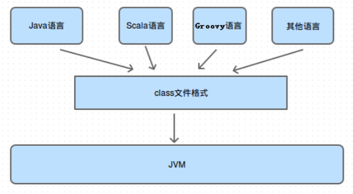 

### jdk、jre、jvm关系

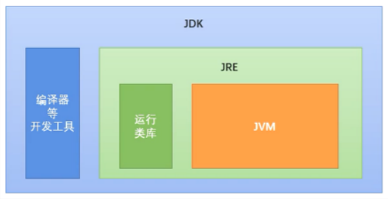 

### OracleJDK和OpenJDK

#### 查看JDK版本

+ OracleJDK版本信息

  ```
  [root@localhost ~]# java -version
  java version "1.8.0_162"
  Java(TM) SE Runtime Environment (build 1.8.0_162-b12)
  Java HotSpot(TM) 64-Bit Server VM (build 25.162-b12， mixed mode)
  ```

+ OpenJDK版本信息

  ```
  [root@localhost ~]# java -version
  openjdk version "1.8.0_144"
  OpenJDK Runtime Environment (build 1.8.0_144-b01)
  OpenJDK 64-Bit Server VM (build 25.144-b01， mixed mode)
  ```

#### 区别

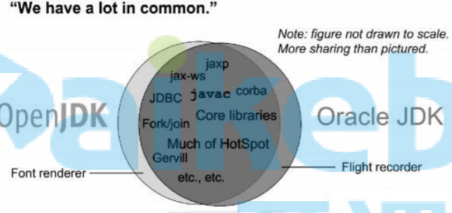 

两者几乎没有区别，那点区别我们也用不到，可以忽略

### jvm与hotspot

+ jvm是一种标准
+ hotspot是jvm标准的具体实现

### jvm运行模式

+ 分为client模式和server模式

  我们用的一般都是server模式，在嵌入式系统中（手机）上，可能用的是client模式

  client模式只能在32为机器上运行

+ server模式是重量级虚拟机，加入了很多优化项，所以server模式启动更慢，但是运行时server模式运行效率更高

## JVM架构图

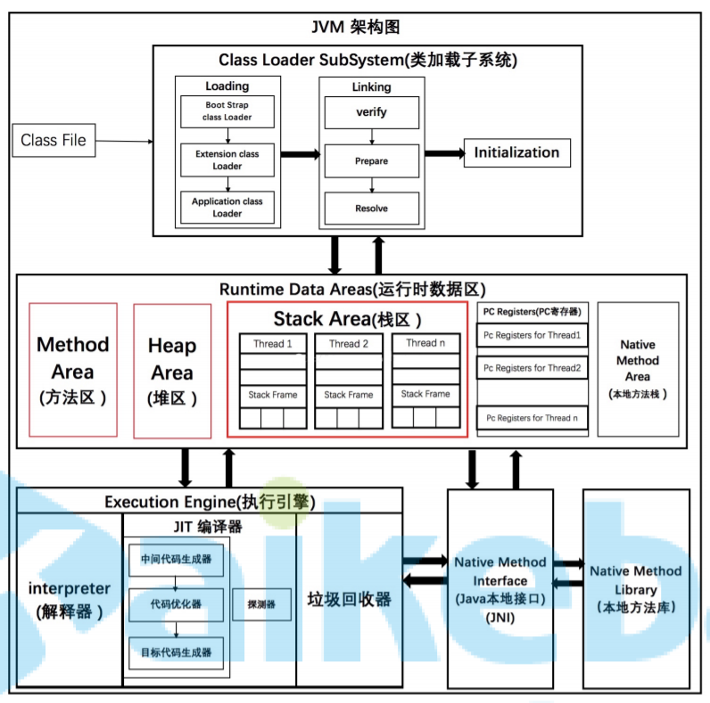 

## JVM程序执行流程

### 执行流程

+ java源代码到机器码流程

  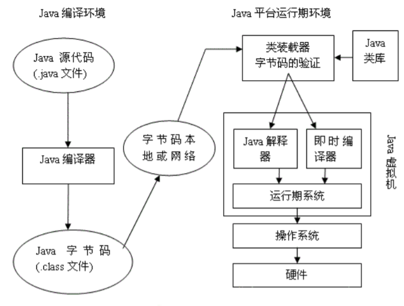 

+ 编译器与解释器协调流程

   

  当一块代码执行次数很多时，就可能会变成热点代码，被一次性编译成机器码，以后每次执行时直接执行机器码

### 热点代码

+ 当出现以下两种情况时，会被标记为热点代码

  + 被多次调用的方法。
  + 被多次执行的循环体。

  两种情况，编译器都是以整个方法作为编译对象

+ 这里的多次，默认是10000次

  我们可以通过修改这个阈值，让jvm尽快的使用动态编译执行，来提高执行效率

  具体是通过虚拟机参数：`-XX： CompileThreshold`设置。

#### 热点检测方式

+ 基于采样的热点探测

  周期性地检查各个线程的栈顶，如果发现某些方法经常出现在栈顶，那这 个方法就是“热点方法”

  + 缺点：由于`周期性`，容易因为受到线程阻塞或别 的外界因素的影响而扰乱热点探测。
  + JVM不使用这种方式

+ 基于计数器的热点探测（HOTSPOT采用的方式）

  为每个方法（甚至是代码块）建立计数器，统计方法的执行次数，如果执 行次数超过一定的阀值，就认为它是“热点方法”。

  计数器一共有两个：

  + 方法调用计数器

    用于统计方法被调用的次数

  + 回边计数器

    + 统计一个方法中循环体代码执行的次数
    + 在字节码中遇到控制流向后跳转的指令称 为“回边”

#### 半衰期

当方法在一段时间内被调用次数还没有超过阈值，则会将计数器直接修改为阈值的一半，防止一段代码靠时间耗成热点代码

## JIT使用

### JVM为什么编译器与解释器并存

+ 解释器执行代码启动更快，编译器运行时效率更高
+ 编译执行占用内存空间更大，解释器能节省内存空间，适用于嵌入式系统

jvm并存两种执行方式，可以针对不同的代码在时间和空间的权衡上找到最优方案

### 为什么实现两种即时编译器

jvm中有2种即时编译器：

+ client complier

  编译速度更快，专注于局部优化，放弃了全局优化

+ server complier

  编译质量更高，进行了充分优化

可以根据不同场景做出更合适的选择

## JIT进行了哪些优化

### 公共子表达式消除

```java
int d = (c*b)*12+a+(a+b*c);
```

对于上面代码，JIT会检测到`c*b`和`b*c`是同一个表达式，会将`b*c`替换成公共表达式`E`进行替换

```
int d = E*12+a+(a+E);
```

只要`b`和`c`的值没有发生改变，都是使用上次`E`的计算结果进行替换，这个子表达式计算一次即可，不用每次都计算了

对于上面的结果，还可以使用`代数化简`进行优化

```java
int d = E*13+a*2;
```

### 方法内联

JIT进行即时编译时，如果A方法调用了B方法，有时会直接使用B方法内的代码替换到A方法中，减少方法个数，从而减少方法入栈出栈引发的额外开销

```java
private int add4(int x1， int x2， int x3， int x4) {
	return add2(x1， x2) + add2(x3， x4);
}
private int add2(int x1， int x2) {
	return x1 + x2;
}
```

是运行一段时间后JVM会把add2方法去掉，并把代码翻译成

```java
private int add4(int x1， int x2， int x3， int x4) {
	return x1 + x2 + x3 + x4;
}
```

### 逃逸分析

+ 当一个对象在1个作用域中被创建之后，被另外一个作用域引用，称为`逃逸`
+ jvm中的作用域一般指的是方法，所以一般逃逸分析指的是`方法逃逸`

+ 逃逸分析包括

  + 全局变量赋值逃逸
  + 方法返回值逃逸
  + 实例引用发生逃逸
  + 线程逃逸:赋值给类变量或可以在其他线程中访问的实例变量

  ```java
  public class EscapeAnalysis {
  	//全局变量
  	public static Object object;
  	public void globalVariableEscape(){//全局变量赋值逃逸
  		object = new Object();
  	}
  	public Object methodEscape(){ //方法返回值逃逸
  		return new Object();
  	}
  	public void instancePassEscape(){ //实例引用发生逃逸
  		this.speak(this);
  	}
  	public void speak(EscapeAnalysis escapeAnalysis){
  		System.out.println("Escape Hello");
  	}
  }
  ```

+ jvm默认是开启逃逸分析的，如果需要关闭，可以通过设计`-XX:-DoEscapeAnalysis`进行关闭，一般不需要关闭

### 对象的栈上内存分配

当方法内创建1个对象，而这个对象没有发生逃逸时，jvm会尽量使用栈上内存分配，好处是在栈上创建的对象，方法执行结束后可以直接释放掉，而如果放在堆中进行内存分配，将需要进行垃圾回收，成本更高

### 标量替换

当1个对象没有方法逃逸是，JIT会把这个对 象拆解成若干个其中包含的若干个成员变量来代替。

```java
//有一个类A
public class A{
    public int a=1;
    public int b=2
}

//方法getAB使用类A里面的a，b
private void getAB(){
    A x = new A();
    A y = new A();
}

//JVM在编译的时候会直接编译成
private void getAB(){
    xa = 1;
    xb = 2;
    ya = 1;
    yb = 2;
}
```

### 同步锁消除

当一块加了同步锁的代码，经过逃逸分析后发现不会发生逃逸，则JIT编译时会自动取消同步锁

# 1019-class文件、类加载

## class文件

### 查看class文件插件

+ 字节码查看class文件
  + 安装插件`jclasslib Bytecode Viewer`
  + 查看文件之前，先`Rebuild Project`
  + 查看class文件汇总信息
    + 选中要查看的java文件，View --> Show Bytecode With Jclasslib
  + 查看class文件
    + 选中要查看的java文件，View --> Show Bytecode
+ 二进制查看class文件
  + 安装插件`BinEd`
  + 选择要查看的class文件，右键，open as binary

### class文件概述

+ class文件字节码结构示意图

  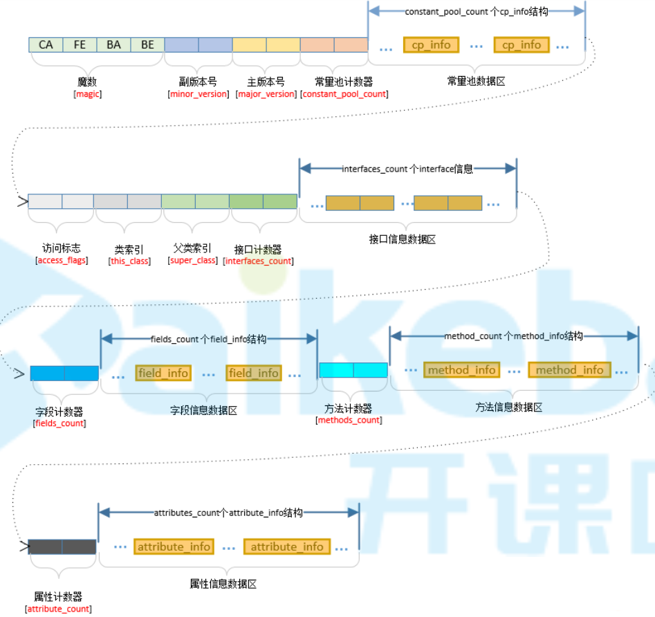 

+ 魔数

  + 固定4字节
  + 固定内容`0xCAFEBABE`，用来标识这是1个class文件

+ 版本号

  + 副版本号2字节；主版本号2字节
  + 5、6字节用来表示副版本号；7、8字节用来表示主版本号
  + 主版本号1.1用十进制的45表示，以后的每个新主版本都会在原先版本的基础上加1，1.8版本用52表示，16进制是0x34

+ 常量池计数器（constant_pool_count ）

  + 固定2字节
  + 常量池计数器值 = 常量池（constant_pool）中常量池项（cp_info）个数 + 1
  + 当常量池索引值大于0，且小于constant_pool_count 时有效，常量池索引值从1开始
  + 常量池索引值为0时（#0）用来表示不指向任何常量

+ 常量池数据区

  + 由（constant_pool_count  - 1）个常量池项（cp_info）组成
  + cp_info：参见[常量池项](#常量池项) 

+ 访问标志

  + 固定两字节

  + 描述

    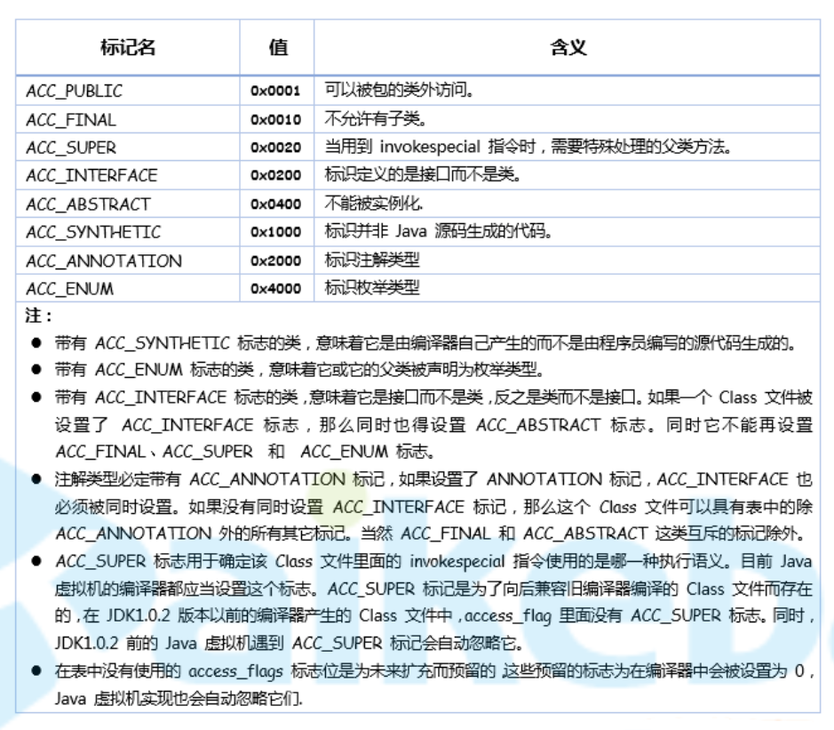 

+ 类索引

  + 固定2字节
  + 当前类对应 CONSTANT_Class_info 的常量池索引值 - 1

+ 父类索引

  + 固定2字节
  + 父类对应 CONSTANT_Class_info 的常量池索引值 - 1

+ 接口计数器

  + 固定2字节
  + 当前类或接口的直接父接口数

+ 接口信息区

  + 接口计数器 * 2 个字节
  + 父接口对应 CONSTANT_Class_info 的常量池索引值 - 1，组成数组

+ 字段计数器

  + 固定2字节
  + 该类或接口声明的【类字段】或者【实例字段】数

+ 字段信息数据区

  字段表，fields[]数组中的每个成员都必须是一个fields_info结构的数据项，用于表示当前类或接口中某个字段的完整描述。 fields[]数组描述当前类或接口声明的所有字段，但不包括从父类或父接口继承的部分。

+ 方法计数器

  + 固定2字节
  + 当前类的方法数

+ 方法信息数据区

  + 方法表，methods[] 数组中的每个成员都必须是一个 method_info 结构的数据项，用于表示当前类或接口中某个方法的完整描述。
  + 如果某个method_info 结构的access_flags 项既没有设置 ACC_NATIVE 标志也没有设置ACC_ABSTRACT 标志，那么它所对应的方法体就应当可以被 Java 虚拟机直接从当前类加载，而不需要引用其它类。
  + method_info结构可以表示类和接口中定义的所有方法，包括【实例方法】、【类方法】、【实例初始化方法】和【类或接口初始化方法】。
  + methods[]数组只描述【当前类或接口中声明的方法】，【不包括从父类或父接口继承的方法

+ 属性计数器

  + 固定2字节
  + 当前 Class 文件attributes表的成员个数

+ 属性信息数据区

  + attributes 表的每个项的值必须是attribute_info结构。

### 常量池项

常量池项有很多种类型，具体类型由第1个字节`tag`（固定1个字节）的值决定

+ 结构

  > + CONSTANT_Utf8_info
  >
  >   + tag：1
  >
  >   + 含义：表示字符串常量，不对应java中任何数据类型，仅用于被其他cp_info引用
  >
  >   + 结构
  >
  >     ```json
  >     {
  >         tag				// 固定1字节；此时值为1
  >         length			// 固定1字节；表示字符长度
  >         byte[length]	// length个字节；字符串内容
  >     }
  >     ```
  >
  > + CONSTANT_Integer_info
  >
  >   + tag：3
  >
  >   + 含义：int类型常量
  >
  >   + 结构
  >
  >     ```json
  >     {
  >         tag				// 固定1字节；此时值为3
  >         byte[4]			// 固定4字节；int常量值
  >     }
  >     ```
  >
  > + CONSTANT_Float_info
  >
  >   + tag：4
  >
  >   + 含义：float类型常量
  >
  >   + 结构
  >
  >     ```json
  >     {
  >         tag				// 固定1字节；此时值为4
  >         byte[4]			// 固定4字节；float常量值
  >     }
  >     ```
  >
  > + CONSTANT_Long_info
  >
  >   + tag：5
  >
  >   + 含义：long类型常量
  >
  >   + 结构
  >
  >     ```json
  >     {
  >         tag				// 固定1字节；此时值为5
  >         byte[8]			// 固定8字节；long常量值
  >     }
  >     ```
  >
  > + CONSTANT_Double_info
  >
  >   + tag：6
  >
  >   + 含义：double类型常量
  >
  >   + 结构
  >
  >     ```json
  >     {
  >         tag				// 固定1字节；此时值为6
  >         byte[4]			// 固定8字节；double常量值
  >     }
  >     ```
  >
  > + CONSTANT_Class_info
  >
  >   + tag：7
  >
  >   + 含义：当前或调用的类或接口
  >
  >     这里的调用到是真的用到，如果一个类声明了一个属性，而这个属性后续没有被用到，则这个声明删掉都行，那这个类的全限定名就不会放入常量池
  >
  >   + 结构
  >
  >     ```json
  >     {
  >         tag				// 固定1字节；此时值为7
  >         byte[2]			// 固定2字节；当前或调用的类或接口的完全限定名对应 CONSTANT_Utf8_info 的常量池索引值 - 1
  >     }
  >     ```
  >
  >   + 例
  >
  >      
  >
  > + CONSTANT_String_info
  >
  >   + tag：8
  >
  >   + 含义：String类型常量
  >
  >   + 结构
  >
  >     ```json
  >     {
  >         tag				// 固定1字节；此时值为8
  >         byte[2]			// 固定2字节；String类型字符串的值对应 CONSTANT_Utf8_info 的常量池索引值 - 1
  >     }
  >     ```
  >
  > + CONSTANT_Fieldref_info
  >
  >   + tag：9
  >
  >   + 含义：类中字段
  >
  >   + 结构
  >
  >     ```json
  >     {
  >         tag				// 固定1字节；此时值为9
  >         byte[2]			// 固定2字节；所属类对应 CONSTANT_Class_info 的常量池索引值 - 1
  >     	byte[2] 		// 固定2字节；字段对应 CONSTANT_NameAndType_info 的常量池索引值 - 1
  >     }
  >     ```
  >
  > + CONSTANT_Methodref_info
  >
  >   + tag：10
  >
  >   + 含义：类中调用的方法
  >
  >   + 结构
  >
  >     ```json
  >     {
  >         tag				// 固定1字节；此时值为10
  >         byte[2]			// 固定2字节；所属类对应 CONSTANT_Class_info 的常量池索引值 - 1
  >     	byte[2] 		// 固定2字节；方法对应 CONSTANT_NameAndType_info 的常量池索引值 - 1
  >     }
  >     ```
  >
  > + CONSTANT_InterfaceMethodref_info
  >
  >   + tag：11
  >
  >   + 含义：类中通过接口调用的接口方法
  >
  >   + 结构
  >
  >     ```json
  >     {
  >         tag				// 固定1字节；此时值为11
  >         byte[2]			// 固定2字节；所属类对应 CONSTANT_Class_info 的常量池索引值 - 1
  >     	byte[2] 		// 固定2字节；方法对应 CONSTANT_NameAndType_info 的常量池索引值 - 1
  >     }
  >     ```
  >
  > + CONSTANT_NameAndType_info
  >
  >   + tag：12
  >
  >   + 含义：字段或方法的名称或类型
  >
  >     这里方法的参数+返回值可以看作这个方法的类型
  >
  >   + 结构
  >
  >     ```json
  >     {
  >         tag				// 固定1字节；此时值为12
  >         byte[2]			// 固定2字节；字段或方法名对应 CONSTANT_Utf8_info 的常量池索引值 - 1
  >     	byte[2] 		// 固定2字节；字段或方法的类型描述字符串对应 CONSTANT_Utf8_info 的常量池索引值 - 1
  >     }
  >     ```
  >
  > + CONSTANT_MethodHandler_info
  >
  >   + tag：15
  >   + 含义：方法句柄
  >
  > + CONSTANT_MethodType_info
  >
  >   + tag：16
  >   + 含义：方法类型
  >
  > + CONSTANT_InvokeDynamic_info
  >
  >   + tag：18
  >   + 含义：用于表示invokeddynamic指令所使用到的引导方法（Bootstrap Method）、引导方法使用到动态调用名称（Dynamic Invocation Name）、参数和请求返回类型、以及可以选择性的附加被称为静态参数（static Arguments）的常量序列

+ cp_info分类

  + 字面量型结构体
    + 内容是字面量
    + CONSTANT_Utf8_info、CONSTANT_Integer_info、CONSTANT_Float_info、CONSTANT_Long_info、CONSTANT_Double_info
  + 引用型结构体
    + 内容是索引值
    + 其他都是

+ 哪些字面量会进入常量池

  + double、float、long一定进
  + final类型的其他5种基本类型
  + 双引号引起的字符串值

### 引用

+ 符号引用

  当要引用的内容还没有加载到内存时，是没有这个内容的地址的，先用符号先占着

+ 直接引用

  + 这个内容加载到内存之后，已经有了这个内容的实际地址，则直接指向这个内容
  + 可以是如下形式：
    + 直接指向目标指针
    + 相对偏移量（如数组下标）
    + 一个能间接定位到目标的句柄

+ 引用替换时机

  符号引用替换为直接引用的操作发生在类加载过程(加载 -> 连接(验证、准备、解析) -> 初始化)中的解析阶段，会将符号引用转换(替换)为对应的直接引用，放入运行时常量池中。

### 特殊字符串字面量

+ 类的全限定名

  class文件中，类的全限定名中的`.`全被替换为`/`

+ 描述符

  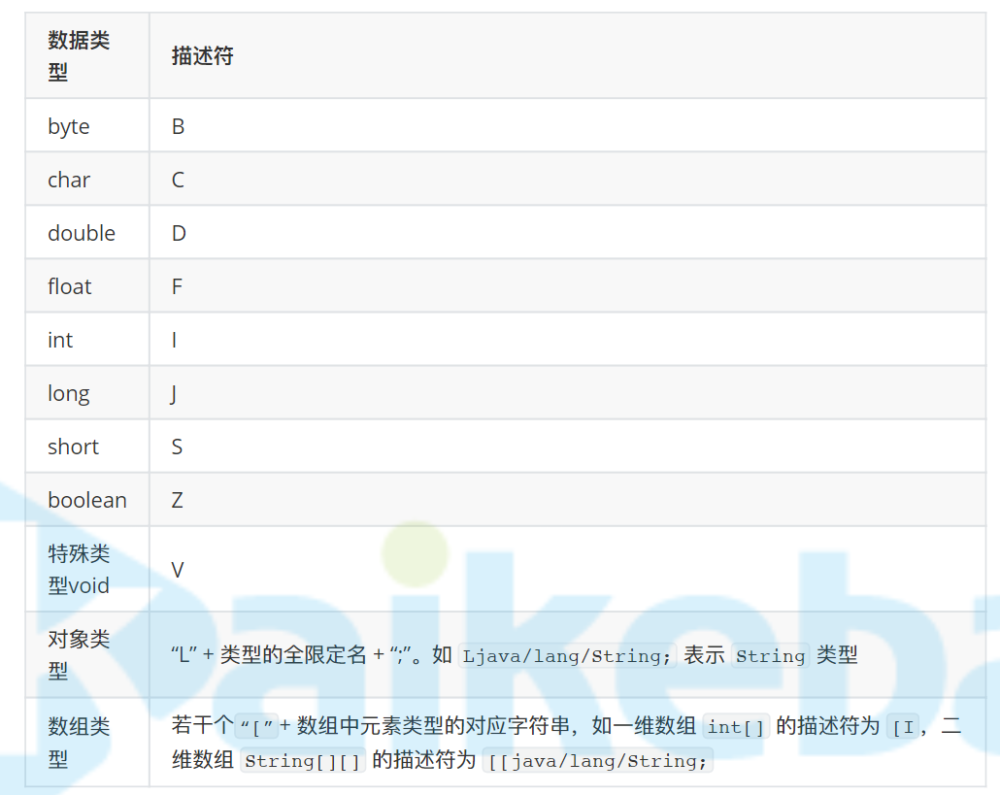 

### 特殊方法名称

+ `<init>`

  构造方法名称

+ `<clinit>`

  静态代码块方法名称

## 类加载子系统

### 类加载过程

 

#### 加载

+ class文件加载可以来源于多种途径，如：文件、网络、jar包、动态生成
+ 加载靠类加载器实现（ClassLoader）
+ 类加载不是启动时全加载的，是需要用到这个类时在进行加载
+ 类加载之后变成Class对象保存带方法区
+ 

#### 验证

+ 验证class文件是否合法

+ 验证流程

  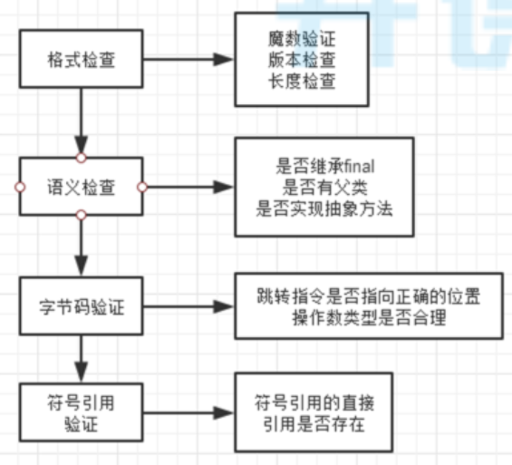 

#### 准备

+ 为类的静态变量分配内存
+ 把静态变量初始化为0，false，null等

#### 解析

+ 符号引用替换为直接引用

#### 初始化

+ 调用静态代码块方法`<clinit>`，jvm执行该方法时会自动上锁
+ 为`static`变量初始化赋值

### 类加载时机

+ 执行字节码指令`new`、`getstatic`、`putstatic`、`invokestatic`时，如果类没有初始化，先进行初始化

  对应代码是`new`对象，读写static（非final）变量，调用static方法

+ 使用反射调用类

+ 初始化1个类时发现父类还没有初始化，先初始化父类

+ 虚拟机启动时指定了主类，加载主类

### 类加载器

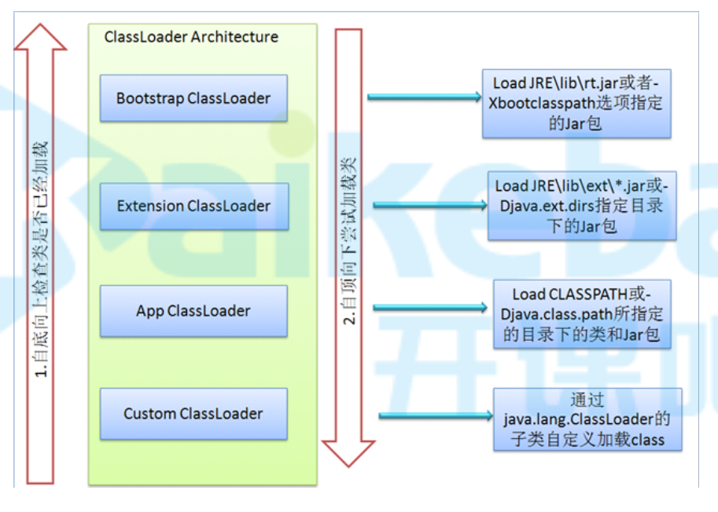 

+ jvm中主要有4中类加载器，每种类加载器负责加载不同目录下的jar包
+ custom classloader是自定义加载器，如有需要，自己实现的，其他三个是自带的

### 双亲委派

#### 什么叫双亲委派

+ 如上图，一个类要被加载时，先从下至上检查是否已加载，再自上而下尝试加载
+ 因为越上层类加载器的权重越高，为了保证1个类加载时加载的是权限最高的类加载器加载的类，下层类加载器发现这个类没有加载时，不能直接加载，需要先问问上层类加载器要不要加载这个类

#### 好处

+ 避免重复加载
+ 避免自己写了1个`java.lang.String`类时，就会由下层类加载器加载成自己的了，代码就出错了

#### jvm如何判断两个类相同

+ 判断类的全路径
+ 判断是否由同一个类加载器加载

#### 为什么需要自定义类加载器

+ 默认类加载器只能加载指定目录的类，如果需要从其他位置加载，需要自定义


